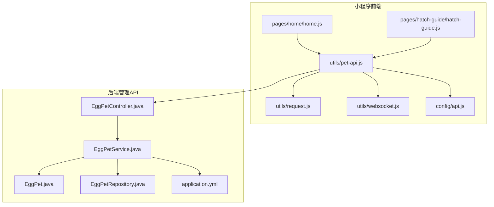
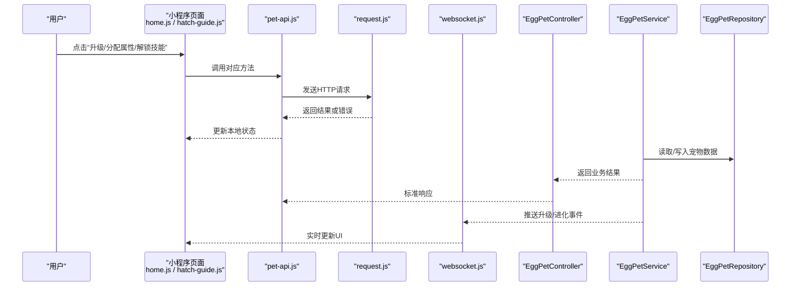
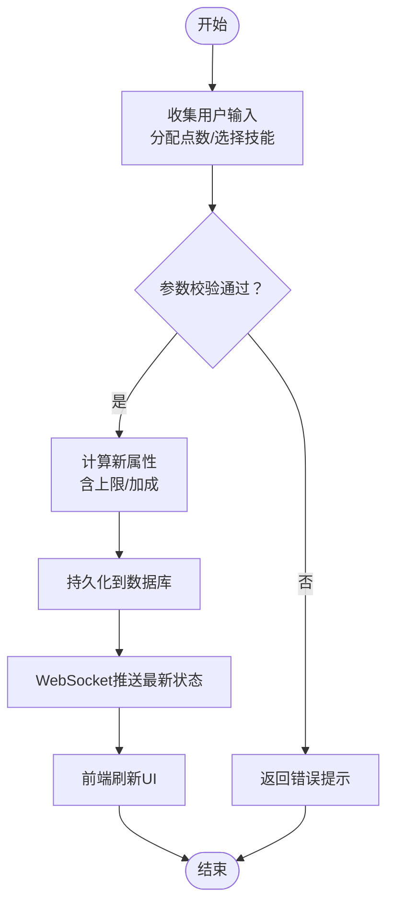
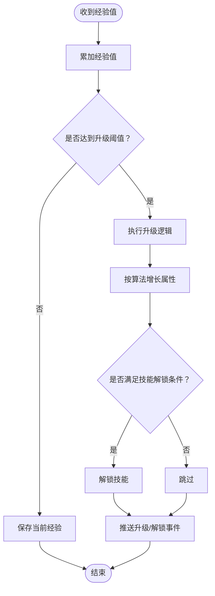
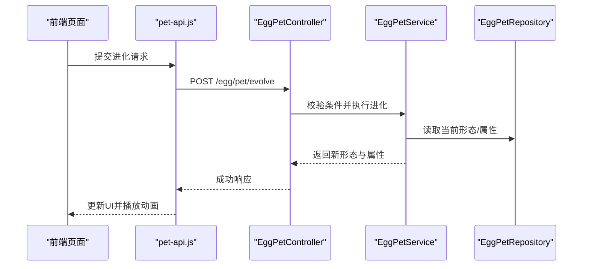
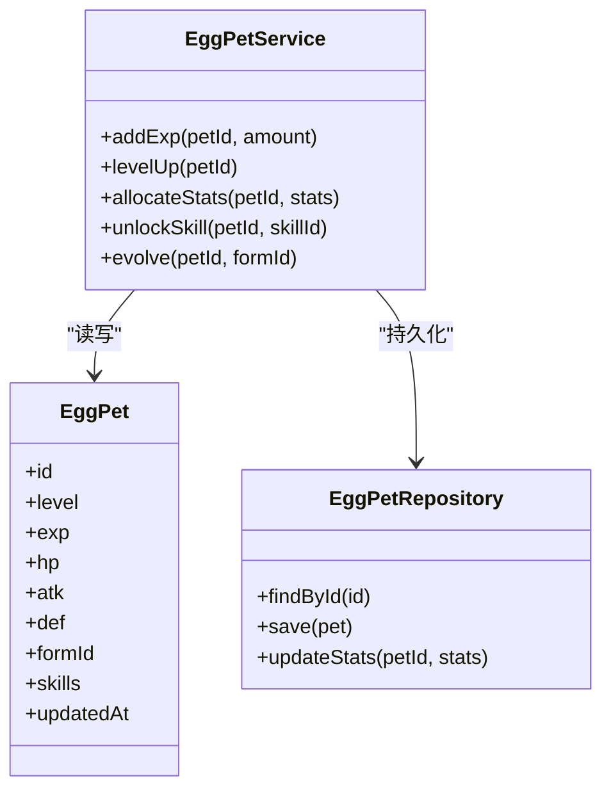
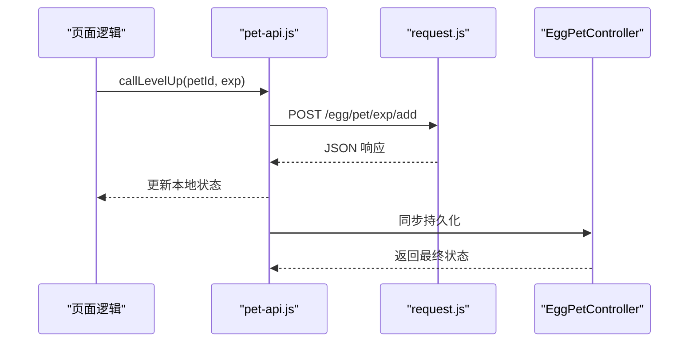
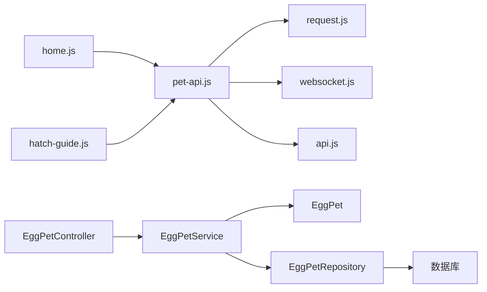

# 角色养成系统

<cite>
**本文档引用的文件**   
- [egg-miniprogram/DESIGN.md](file://main/egg-miniprogram/DESIGN.md)
- [egg-miniprogram/README.md](file://main/egg-miniprogram/README.md)
- [egg-miniprogram/docs/egg-pet-identity-and-hatch-api.md](file://main/egg-miniprogram/docs/egg-pet-identity-and-hatch-api.md)
- [egg-miniprogram/miniprogram/utils/pet-api.js](file://main/egg-miniprogram/miniprogram/utils/pet-api.js)
- [egg-miniprogram/miniprogram/utils/pet-store-actions.test.js](file://main/egg-miniprogram/miniprogram/utils/pet-store-actions.test.js)
- [egg-miniprogram/miniprogram/utils/pet-store.test.js](file://main/egg-miniprogram/miniprogram/utils/pet-store.test.js)
- [egg-miniprogram/miniprogram/pages/home/home.js](file://main/egg-miniprogram/miniprogram/pages/home/home.js)
- [egg-miniprogram/miniprogram/pages/hatch-guide/hatch-guide.js](file://main/egg-miniprogram/miniprogram/pages/hatch-guide/hatch-guide.js)
- [egg-miniprogram/miniprogram/config/api.js](file://main/egg-miniprogram/miniprogram/config/api.js)
- [egg-miniprogram/miniprogram/utils/request.js](file://main/egg-miniprogram/miniprogram/utils/request.js)
- [egg-miniprogram/miniprogram/utils/websocket.js](file://main/egg-miniprogram/miniprogram/utils/websocket.js)
- [manager-api/src/main/java/xiaozhi/module/egg/controller/EggPetController.java](file://manager-api/src/main/java/xiaozhi/module/egg/controller/EggPetController.java)
- [manager-api/src/main/java/xiaozhi/module/egg/service/EggPetService.java](file://manager-api/src/main/java/xiaozhi/module/egg/service/EggPetService.java)
- [manager-api/src/main/java/xiaozhi/module/egg/model/EggPet.java](file://manager-api/src/main/java/xiaozhi/module/egg/model/EggPet.java)
- [manager-api/src/main/java/xiaozhi/module/egg/repository/EggPetRepository.java](file://manager-api/src/main/java/xiaozhi/module/egg/repository/EggPetRepository.java)
- [manager-api/src/main/resources/application.yml](file://manager-api/src/main/resources/application.yml)
</cite>

## 目录
1. [简介](#简介)
2. [项目结构](#项目结构)
3. [核心组件](#核心组件)
4. [架构总览](#架构总览)
5. [详细组件分析](#详细组件分析)
6. [依赖关系分析](#依赖关系分析)
7. [性能考量](#性能考量)
8. [故障排查指南](#故障排查指南)
9. [结论](#结论)
10. [附录](#附录)

## 简介
本文件为蛋仔小程序“角色养成系统”的完整技术文档，聚焦宠物属性管理、成长曲线设计、进化系统、状态与数据持久化、前后端交互、性能优化与用户反馈机制。内容基于仓库中 egg-miniprogram 前端与 manager-api 后端的相关实现进行梳理，旨在帮助开发者快速理解并扩展该系统的功能。

## 项目结构
围绕角色养成的代码主要分布在以下位置：
- 小程序前端（egg-miniprogram）：包含页面、工具库、API 封装、WebSocket 通信等
- 管理后台 API（manager-api）：提供宠物相关 REST 接口、服务层逻辑、数据模型与仓储访问
- 设计文档与计划：涵盖身份与孵化、前端设计等

图表来源
- [egg-miniprogram/miniprogram/pages/home/home.js](file://main/egg-miniprogram/miniprogram/pages/home/home.js)
- [egg-miniprogram/miniprogram/pages/hatch-guide/hatch-guide.js](file://main/egg-miniprogram/miniprogram/pages/hatch-guide/hatch-guide.js)
- [egg-miniprogram/miniprogram/utils/pet-api.js](file://main/egg-miniprogram/miniprogram/utils/pet-api.js)
- [egg-miniprogram/miniprogram/utils/request.js](file://main/egg-miniprogram/miniprogram/utils/request.js)
- [egg-miniprogram/miniprogram/utils/websocket.js](file://main/egg-miniprogram/miniprogram/utils/websocket.js)
- [egg-miniprogram/miniprogram/config/api.js](file://main/egg-miniprogram/miniprogram/config/api.js)
- [manager-api/src/main/java/xiaozhi/module/egg/controller/EggPetController.java](file://manager-api/src/main/java/xiaozhi/module/egg/controller/EggPetController.java)
- [manager-api/src/main/java/xiaozhi/module/egg/service/EggPetService.java](file://manager-api/src/main/java/xiaozhi/module/egg/service/EggPetService.java)
- [manager-api/src/main/java/xiaozhi/module/egg/model/EggPet.java](file://manager-api/src/main/java/xiaozhi/module/egg/model/EggPet.java)
- [manager-api/src/main/java/xiaozhi/module/egg/repository/EggPetRepository.java](file://manager-api/src/main/java/xiaozhi/module/egg/repository/EggPetRepository.java)
- [manager-api/src/main/resources/application.yml](file://manager-api/src/main/resources/application.yml)

章节来源
- [egg-miniprogram/DESIGN.md](file://main/egg-miniprogram/DESIGN.md)
- [egg-miniprogram/README.md](file://main/egg-miniprogram/README.md)

## 核心组件
- 前端 API 封装（pet-api.js）：统一暴露宠物相关的增删改查、升级、进化、技能解锁等调用入口
- 请求与 WebSocket（request.js、websocket.js）：HTTP 请求封装与实时消息通道
- 页面逻辑（home.js、hatch-guide.js）：承载养成流程的用户交互与状态更新
- 后端控制器（EggPetController.java）：对外暴露 REST 接口，处理请求参数校验与响应
- 服务层（EggPetService.java）：核心业务逻辑，包括属性计算、经验值与等级提升、进化判定、技能解锁
- 数据模型（EggPet.java）：宠物实体定义，包含基础属性、等级、经验、形态、技能等字段
- 仓储层（EggPetRepository.java）：数据持久化访问
- 配置（application.yml）：数据库连接、缓存、限流等运行期配置

章节来源
- [egg-miniprogram/miniprogram/utils/pet-api.js](file://main/egg-miniprogram/miniprogram/utils/pet-api.js)
- [egg-miniprogram/miniprogram/utils/request.js](file://main/egg-miniprogram/miniprogram/utils/request.js)
- [egg-miniprogram/miniprogram/utils/websocket.js](file://main/egg-miniprogram/miniprogram/utils/websocket.js)
- [egg-miniprogram/miniprogram/pages/home/home.js](file://main/egg-miniprogram/miniprogram/pages/home/home.js)
- [egg-miniprogram/miniprogram/pages/hatch-guide/hatch-guide.js](file://main/egg-miniprogram/miniprogram/pages/hatch-guide/hatch-guide.js)
- [manager-api/src/main/java/xiaozhi/module/egg/controller/EggPetController.java](file://manager-api/src/main/java/xiaozhi/module/egg/controller/EggPetController.java)
- [manager-api/src/main/java/xiaozhi/module/egg/service/EggPetService.java](file://manager-api/src/main/java/xiaozhi/module/egg/service/EggPetService.java)
- [manager-api/src/main/java/xiaozhi/module/egg/model/EggPet.java](file://manager-api/src/main/java/xiaozhi/module/egg/model/EggPet.java)
- [manager-api/src/main/java/xiaozhi/module/egg/repository/EggPetRepository.java](file://manager-api/src/main/java/xiaozhi/module/egg/repository/EggPetRepository.java)
- [manager-api/src/main/resources/application.yml](file://manager-api/src/main/resources/application.yml)

## 架构总览
整体采用“小程序前端 + 管理 API 后端”的分层架构。前端通过 pet-api.js 聚合所有宠物相关能力，使用 request.js 发起 HTTP 请求，必要时通过 websocket.js 接收实时事件（如升级、进化通知）。后端由 Controller 接收请求，Service 执行业务规则（属性计算、成长曲线、进化判定），Repository 负责持久化。

图表来源
- [egg-miniprogram/miniprogram/pages/home/home.js](file://main/egg-miniprogram/miniprogram/pages/home/home.js)
- [egg-miniprogram/miniprogram/pages/hatch-guide/hatch-guide.js](file://main/egg-miniprogram/miniprogram/pages/hatch-guide/hatch-guide.js)
- [egg-miniprogram/miniprogram/utils/pet-api.js](file://main/egg-miniprogram/miniprogram/utils/pet-api.js)
- [egg-miniprogram/miniprogram/utils/request.js](file://main/egg-miniprogram/miniprogram/utils/request.js)
- [egg-miniprogram/miniprogram/utils/websocket.js](file://main/egg-miniprogram/miniprogram/utils/websocket.js)
- [manager-api/src/main/java/xiaozhi/module/egg/controller/EggPetController.java](file://manager-api/src/main/java/xiaozhi/module/egg/controller/EggPetController.java)
- [manager-api/src/main/java/xiaozhi/module/egg/service/EggPetService.java](file://manager-api/src/main/java/xiaozhi/module/egg/service/EggPetService.java)
- [manager-api/src/main/java/xiaozhi/module/egg/repository/EggPetRepository.java](file://manager-api/src/main/java/xiaozhi/module/egg/repository/EggPetRepository.java)

## 详细组件分析

### 宠物属性管理与动态更新
- 基础属性：生命值、攻击力、防御力等由 EggPet 模型承载，Service 层在每次升级或分配时重新计算
- 动态更新机制：前端通过 pet-api.js 触发更新，后端 Service 校验并应用变更，随后通过 WebSocket 推送最新属性到前端，确保多端一致
- 一致性保障：服务端作为权威源，前端仅做展示与输入收集；关键操作需二次确认与幂等处理

图表来源
- [manager-api/src/main/java/xiaozhi/module/egg/service/EggPetService.java](file://manager-api/src/main/java/xiaozhi/module/egg/service/EggPetService.java)
- [manager-api/src/main/java/xiaozhi/module/egg/model/EggPet.java](file://main/egg-miniprogram/miniprogram/utils/pet-api.js)
- [egg-miniprogram/miniprogram/utils/websocket.js](file://main/egg-miniprogram/miniprogram/utils/websocket.js)

章节来源
- [manager-api/src/main/java/xiaozhi/module/egg/model/EggPet.java](file://manager-api/src/main/java/xiaozhi/module/egg/model/EggPet.java)
- [manager-api/src/main/java/xiaozhi/module/egg/service/EggPetService.java](file://manager-api/src/main/java/xiaozhi/module/egg/service/EggPetService.java)
- [egg-miniprogram/miniprogram/utils/pet-api.js](file://main/egg-miniprogram/miniprogram/utils/pet-api.js)
- [egg-miniprogram/miniprogram/utils/websocket.js](file://main/egg-miniprogram/miniprogram/utils/websocket.js)

### 成长曲线设计模式（经验值、等级提升、属性增长算法）
- 经验值获取：来自互动行为（对话、任务、战斗等），由后端统一累计并校验
- 等级提升条件：达到阈值后自动升级，可能伴随冷却或资源消耗
- 属性增长算法：按等级分段函数或线性/指数增长策略，结合职业/灵魂/语音等加成

图表来源
- [manager-api/src/main/java/xiaozhi/module/egg/service/EggPetService.java](file://manager-api/src/main/java/xiaozhi/module/egg/service/EggPetService.java)
- [manager-api/src/main/java/xiaozhi/module/egg/model/EggPet.java](file://manager-api/src/main/java/xiaozhi/module/egg/model/EggPet.java)

章节来源
- [manager-api/src/main/java/xiaozhi/module/egg/service/EggPetService.java](file://manager-api/src/main/java/xiaozhi/module/egg/service/EggPetService.java)
- [manager-api/src/main/java/xiaozhi/module/egg/model/EggPet.java](file://manager-api/src/main/java/xiaozhi/module/egg/model/EggPet.java)

### 宠物进化系统（触发条件与形态变化）
- 触发条件：等级、亲密度、特定道具或活动达成
- 形态变化：切换形态ID、外观资源、属性上限与技能集
- 回滚与保护：失败时保持原状态，避免数据不一致

图表来源
- [manager-api/src/main/java/xiaozhi/module/egg/controller/EggPetController.java](file://manager-api/src/main/java/xiaozhi/module/egg/controller/EggPetController.java)
- [manager-api/src/main/java/xiaozhi/module/egg/service/EggPetService.java](file://manager-api/src/main/java/xiaozhi/module/egg/service/EggPetService.java)
- [manager-api/src/main/java/xiaozhi/module/egg/repository/EggPetRepository.java](file://manager-api/src/main/java/xiaozhi/module/egg/repository/EggPetRepository.java)
- [egg-miniprogram/miniprogram/utils/pet-api.js](file://main/egg-miniprogram/miniprogram/utils/pet-api.js)

章节来源
- [manager-api/src/main/java/xiaozhi/module/egg/controller/EggPetController.java](file://manager-api/src/main/java/xiaozhi/module/egg/controller/EggPetController.java)
- [manager-api/src/main/java/xiaozhi/module/egg/service/EggPetService.java](file://manager-api/src/main/java/xiaozhi/module/egg/service/EggPetService.java)
- [manager-api/src/main/java/xiaozhi/module/egg/repository/EggPetRepository.java](file://manager-api/src/main/java/xiaozhi/module/egg/repository/EggPetRepository.java)
- [egg-miniprogram/miniprogram/utils/pet-api.js](file://main/egg-miniprogram/miniprogram/utils/pet-api.js)

### 状态管理与数据持久化
- 前端状态：页面级与组件级状态分离，使用 store/actions 管理宠物生命周期
- 持久化策略：后端以 ORM 模型持久化，支持事务与并发控制；前端可缓存最近一次快照用于离线展示
- 一致性：关键路径走服务端校验与落库，前端仅做乐观更新与冲突回滚

图表来源
- [manager-api/src/main/java/xiaozhi/module/egg/model/EggPet.java](file://manager-api/src/main/java/xiaozhi/module/egg/model/EggPet.java)
- [manager-api/src/main/java/xiaozhi/module/egg/service/EggPetService.java](file://manager-api/src/main/java/xiaozhi/module/egg/service/EggPetService.java)
- [manager-api/src/main/java/xiaozhi/module/egg/repository/EggPetRepository.java](file://manager-api/src/main/java/xiaozhi/module/egg/repository/EggPetRepository.java)

章节来源
- [manager-api/src/main/java/xiaozhi/module/egg/model/EggPet.java](file://manager-api/src/main/java/xiaozhi/module/egg/model/EggPet.java)
- [manager-api/src/main/java/xiaozhi/module/egg/service/EggPetService.java](file://manager-api/src/main/java/xiaozhi/module/egg/service/EggPetService.java)
- [manager-api/src/main/java/xiaozhi/module/egg/repository/EggPetRepository.java](file://manager-api/src/main/java/xiaozhi/module/egg/repository/EggPetRepository.java)

### 与后端 API 的交互方式
- HTTP：通过 request.js 统一封装，pet-api.js 暴露领域方法（升级、分配、进化、技能解锁）
- WebSocket：用于实时事件（升级、进化、掉落、在线状态）推送
- 配置：api.js 集中管理接口前缀与环境变量

图表来源
- [egg-miniprogram/miniprogram/utils/pet-api.js](file://main/egg-miniprogram/miniprogram/utils/pet-api.js)
- [egg-miniprogram/miniprogram/utils/request.js](file://main/egg-miniprogram/miniprogram/utils/request.js)
- [egg-miniprogram/miniprogram/config/api.js](file://main/egg-miniprogram/miniprogram/config/api.js)
- [manager-api/src/main/java/xiaozhi/module/egg/controller/EggPetController.java](file://manager-api/src/main/java/xiaozhi/module/egg/controller/EggPetController.java)

章节来源
- [egg-miniprogram/miniprogram/utils/pet-api.js](file://main/egg-miniprogram/miniprogram/utils/pet-api.js)
- [egg-miniprogram/miniprogram/utils/request.js](file://main/egg-miniprogram/miniprogram/utils/request.js)
- [egg-miniprogram/miniprogram/config/api.js](file://main/egg-miniprogram/miniprogram/config/api.js)
- [manager-api/src/main/java/xiaozhi/module/egg/controller/EggPetController.java](file://manager-api/src/main/java/xiaozhi/module/egg/controller/EggPetController.java)

### 具体实现示例（路径指引）
- 宠物升级：参考 pet-api.js 中的升级方法与对应的后端接口调用
- 属性分配：查看 pet-api.js 的属性分配方法与服务层校验逻辑
- 技能解锁：查看 pet-api.js 的技能解锁方法与后端解锁条件判断

章节来源
- [egg-miniprogram/miniprogram/utils/pet-api.js](file://main/egg-miniprogram/miniprogram/utils/pet-api.js)
- [manager-api/src/main/java/xiaozhi/module/egg/service/EggPetService.java](file://manager-api/src/main/java/xiaozhi/module/egg/service/EggPetService.java)

### 测试与验证
- 单元测试覆盖：pet-store-actions.test.js、pet-store.test.js 验证状态流转与边界条件
- 建议用例：经验值溢出、等级上限、属性分配非法、进化条件不满足、并发升级冲突

章节来源
- [egg-miniprogram/miniprogram/utils/pet-store-actions.test.js](file://main/egg-miniprogram/miniprogram/utils/pet-store-actions.test.js)
- [egg-miniprogram/miniprogram/utils/pet-store.test.js](file://main/egg-miniprogram/miniprogram/utils/pet-store.test.js)

## 依赖关系分析
- 前端依赖：pet-api.js 依赖 request.js 与 websocket.js；页面逻辑依赖 pet-api.js
- 后端依赖：Controller 依赖 Service；Service 依赖 Model 与 Repository；Repository 依赖数据库配置
- 外部依赖：数据库、缓存、消息队列（可选）

图表来源
- [egg-miniprogram/miniprogram/pages/home/home.js](file://main/egg-miniprogram/miniprogram/pages/home/home.js)
- [egg-miniprogram/miniprogram/pages/hatch-guide/hatch-guide.js](file://main/egg-miniprogram/miniprogram/pages/hatch-guide/hatch-guide.js)
- [egg-miniprogram/miniprogram/utils/pet-api.js](file://main/egg-miniprogram/miniprogram/utils/pet-api.js)
- [egg-miniprogram/miniprogram/utils/request.js](file://main/egg-miniprogram/miniprogram/utils/request.js)
- [egg-miniprogram/miniprogram/utils/websocket.js](file://main/egg-miniprogram/miniprogram/utils/websocket.js)
- [egg-miniprogram/miniprogram/config/api.js](file://main/egg-miniprogram/miniprogram/config/api.js)
- [manager-api/src/main/java/xiaozhi/module/egg/controller/EggPetController.java](file://manager-api/src/main/java/xiaozhi/module/egg/controller/EggPetController.java)
- [manager-api/src/main/java/xiaozhi/module/egg/service/EggPetService.java](file://manager-api/src/main/java/xiaozhi/module/egg/service/EggPetService.java)
- [manager-api/src/main/java/xiaozhi/module/egg/model/EggPet.java](file://manager-api/src/main/java/xiaozhi/module/egg/model/EggPet.java)
- [manager-api/src/main/java/xiaozhi/module/egg/repository/EggPetRepository.java](file://manager-api/src/main/java/xiaozhi/module/egg/repository/EggPetRepository.java)

章节来源
- [egg-miniprogram/miniprogram/utils/pet-api.js](file://main/egg-miniprogram/miniprogram/utils/pet-api.js)
- [manager-api/src/main/java/xiaozhi/module/egg/service/EggPetService.java](file://manager-api/src/main/java/xiaozhi/module/egg/service/EggPetService.java)

## 性能考量
- 批量操作：合并多次属性分配与经验值累计，减少网络往返
- 缓存策略：热点数据（如等级阈值表、技能解锁表）前端缓存，降低重复请求
- 增量更新：WebSocket 推送最小化负载，避免全量刷新
- 防抖节流：高频交互（如连续点击升级）进行节流，防止重复提交
- 服务端优化：数据库索引优化、读写分离、事务粒度控制

[本节为通用指导，不直接分析具体文件]

## 故障排查指南
- 常见问题
  - 升级失败：检查经验值阈值、冷却时间、资源不足
  - 属性分配异常：校验点数上限、非法负数、重复分配
  - 进化失败：形态前置条件未满足、资源不足、并发冲突
  - 数据不一致：网络中断导致前端状态落后，需拉取最新快照
- 定位手段
  - 前端日志：记录请求参数与响应体，观察状态变化
  - 后端日志：追踪 Service 关键分支与异常堆栈
  - 数据库审计：核对更新前后的字段差异
- 恢复策略
  - 客户端重试与幂等键
  - 服务端补偿与回滚
  - 用户提示与引导

章节来源
- [egg-miniprogram/miniprogram/utils/request.js](file://main/egg-miniprogram/miniprogram/utils/request.js)
- [manager-api/src/main/java/xiaozhi/module/egg/service/EggPetService.java](file://manager-api/src/main/java/xiaozhi/module/egg/service/EggPetService.java)

## 结论
本系统通过清晰的前后端分层与职责划分，实现了宠物属性管理、成长曲线、进化系统与实时状态同步。建议在后续迭代中完善测试覆盖率、引入更细粒度的权限控制与更丰富的成长事件体系，以提升用户体验与系统稳定性。

[本节为总结性内容，不直接分析具体文件]

## 附录
- 相关文档
  - [egg-miniprogram/DESIGN.md](file://main/egg-miniprogram/DESIGN.md)
  - [egg-miniprogram/README.md](file://main/egg-miniprogram/README.md)
  - [egg-miniprogram/docs/egg-pet-identity-and-hatch-api.md](file://main/egg-miniprogram/docs/egg-pet-identity-and-hatch-api.md)
- 配置参考
  - [manager-api/src/main/resources/application.yml](file://manager-api/src/main/resources/application.yml)