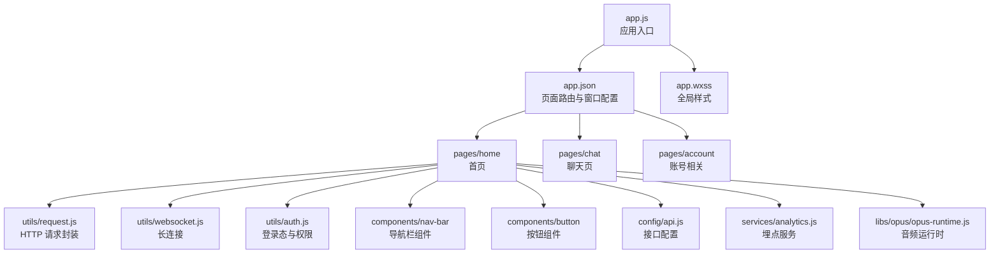
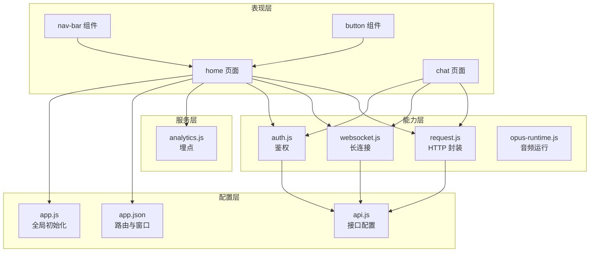
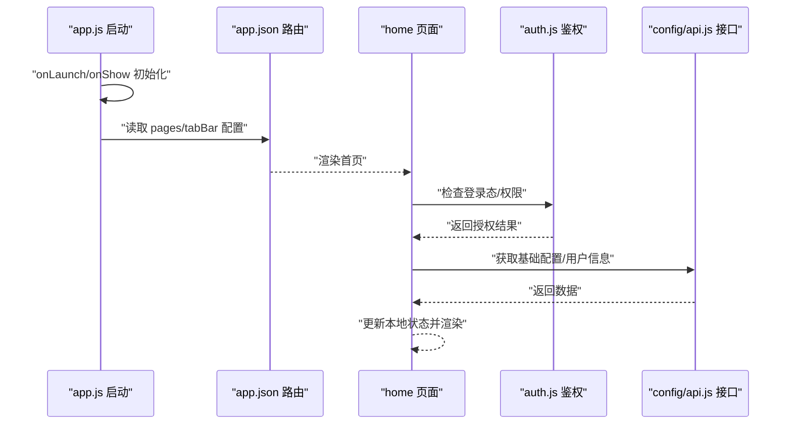
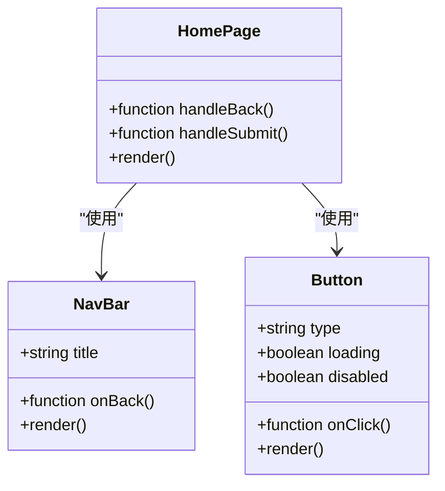
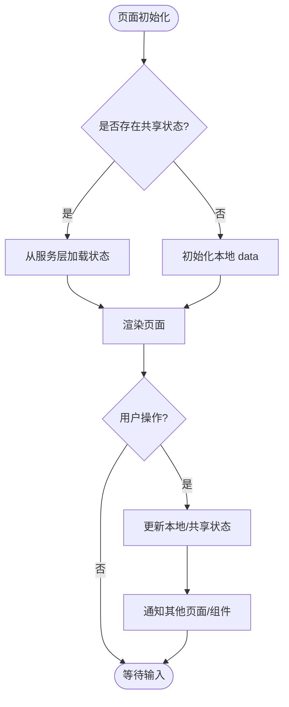
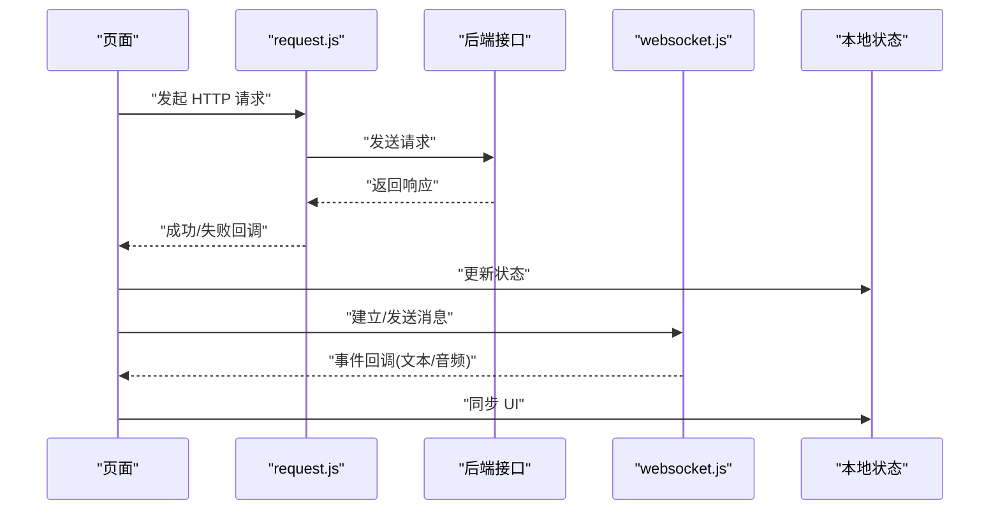
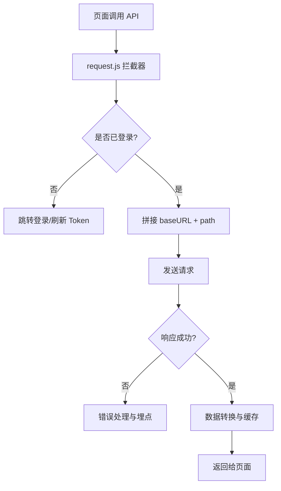
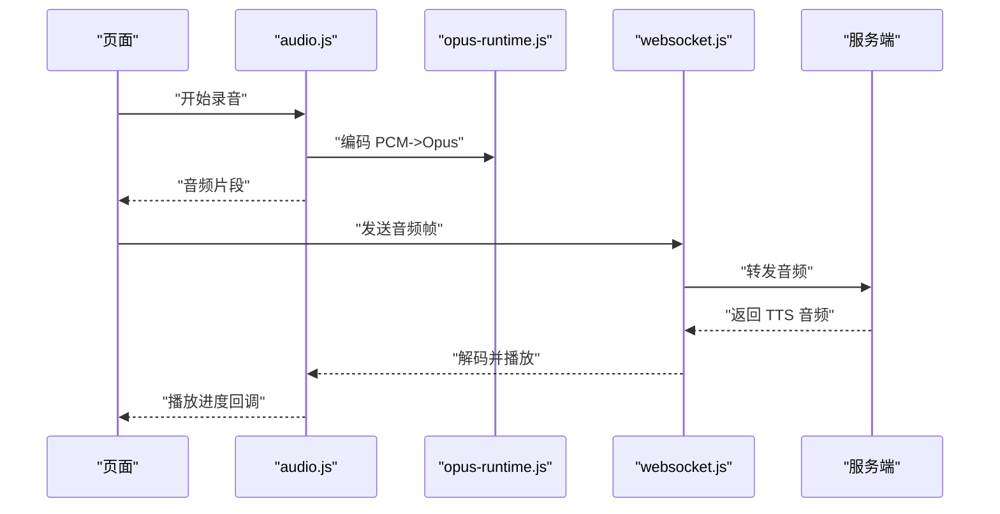
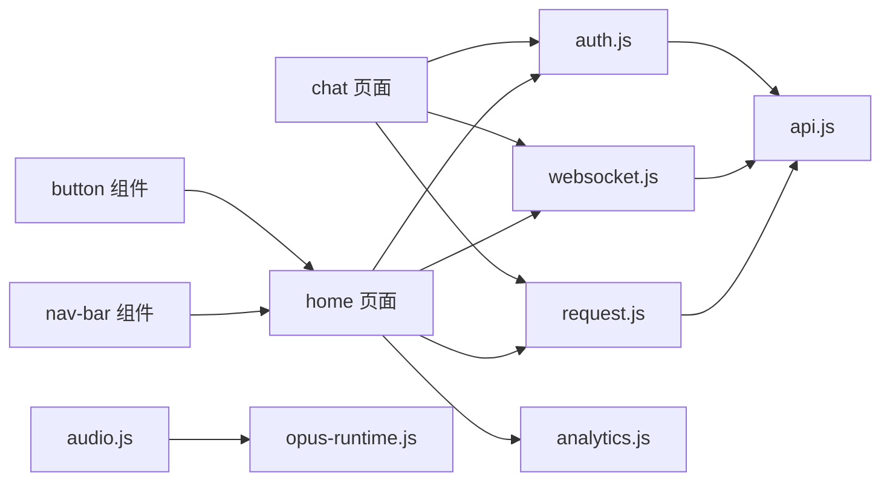

# 系统架构设计

<cite>
**本文引用的文件**   
- [egg-miniprogram/DESIGN.md](file://main/egg-miniprogram/DESIGN.md)
- [egg-miniprogram/README.md](file://main/egg-miniprogram/README.md)
- [egg-miniprogram/app.json](file://main/egg-miniprogram/miniprogram/app.json)
- [egg-miniprogram/app.js](file://main/egg-miniprogram/miniprogram/app.js)
- [egg-miniprogram/app.wxss](file://main/egg-miniprogram/miniprogram/app.wxss)
- [egg-miniprogram/project.config.json](file://main/egg-miniprogram/project.config.json)
- [egg-miniprogram/pages/home/index.js](file://main/egg-miniprogram/miniprogram/pages/home/index.js)
- [egg-miniprogram/pages/chat/index.js](file://main/egg-miniprogram/miniprogram/pages/chat/index.js)
- [egg-miniprogram/components/nav-bar/index.js](file://main/egg-miniprogram/miniprogram/components/nav-bar/index.js)
- [egg-miniprogram/components/button/index.js](file://main/egg-miniprogram/miniprogram/components/button/index.js)
- [egg-miniprogram/utils/request.js](file://main/egg-miniprogram/miniprogram/utils/request.js)
- [egg-miniprogram/utils/websocket.js](file://main/egg-miniprogram/miniprogram/utils/websocket.js)
- [egg-miniprogram/utils/auth.js](file://main/egg-miniprogram/miniprogram/utils/auth.js)
- [egg-miniprogram/config/api.js](file://main/egg-miniprogram/miniprogram/config/api.js)
- [egg-miniprogram/services/analytics.js](file://main/egg-miniprogram/miniprogram/services/analytics.js)
- [egg-miniprogram/libs/opus/opus-runtime.js](file://main/egg-miniprogram/miniprogram/libs/opus/opus-runtime.js)
</cite>

## 目录
1. [简介](#简介)
2. [项目结构](#项目结构)
3. [核心组件](#核心组件)
4. [架构总览](#架构总览)
5. [详细组件分析](#详细组件分析)
6. [依赖关系分析](#依赖关系分析)
7. [性能考量](#性能考量)
8. [故障排查指南](#故障排查指南)
9. [结论](#结论)
10. [附录](#附录)

## 简介
本文件面向“蛋仔小程序”的系统架构设计与实现，聚焦页面组织结构、组件架构模式、状态管理机制、启动流程、路由配置、全局状态管理、数据流向、事件处理机制、API 调用封装、配置与环境变量、多环境支持、模块化开发、组件复用、页面间通信、性能优化与内存管理、资源加载优化等主题。文档以仓库中 egg-miniprogram 子工程为核心，结合小程序原生能力与自研工具库进行说明，并提供架构图与代码路径引用，帮助读者快速理解并落地实践。

## 项目结构
egg-miniprogram 采用典型的小程序分层组织：
- miniprogram/app.*：应用入口、全局样式与配置
- miniprogram/pages/*：按功能划分的页面模块（如 home、chat、account 等）
- miniprogram/components/*：可复用的业务与 UI 组件（如 nav-bar、button、card 等）
- miniprogram/utils/*：通用工具（网络请求、WebSocket、鉴权、音频等）
- miniprogram/config/*：接口地址与常量配置
- miniprogram/services/*：跨页面的服务层（如埋点、时间服务等）
- libs/*：第三方或自研运行时库（如 opus 编解码）

图表来源
- [egg-miniprogram/app.js](file://main/egg-miniprogram/miniprogram/app.js)
- [egg-miniprogram/app.json](file://main/egg-miniprogram/miniprogram/app.json)
- [egg-miniprogram/app.wxss](file://main/egg-miniprogram/miniprogram/app.wxss)
- [egg-miniprogram/pages/home/index.js](file://main/egg-miniprogram/miniprogram/pages/home/index.js)
- [egg-miniprogram/pages/chat/index.js](file://main/egg-miniprogram/miniprogram/pages/chat/index.js)
- [egg-miniprogram/components/nav-bar/index.js](file://main/egg-miniprogram/miniprogram/components/nav-bar/index.js)
- [egg-miniprogram/components/button/index.js](file://main/egg-miniprogram/miniprogram/components/button/index.js)
- [egg-miniprogram/utils/request.js](file://main/egg-miniprogram/miniprogram/utils/request.js)
- [egg-miniprogram/utils/websocket.js](file://main/egg-miniprogram/miniprogram/utils/websocket.js)
- [egg-miniprogram/utils/auth.js](file://main/egg-miniprogram/miniprogram/utils/auth.js)
- [egg-miniprogram/config/api.js](file://main/egg-miniprogram/miniprogram/config/api.js)
- [egg-miniprogram/services/analytics.js](file://main/egg-miniprogram/miniprogram/services/analytics.js)
- [egg-miniprogram/libs/opus/opus-runtime.js](file://main/egg-miniprogram/miniprogram/libs/opus/opus-runtime.js)

章节来源
- [egg-miniprogram/DESIGN.md](file://main/egg-miniprogram/DESIGN.md)
- [egg-miniprogram/README.md](file://main/egg-miniprogram/README.md)
- [egg-miniprogram/app.json](file://main/egg-miniprogram/miniprogram/app.json)

## 核心组件
- 应用入口 app.js：负责初始化全局状态、生命周期钩子、插件注册、错误捕获与日志上报。
- 路由配置 app.json：定义 tabBar、页面路径、窗口样式、分包与预加载策略。
- 全局样式 app.wxss：统一字体、颜色、布局基线，提供 CSS 变量与主题切换基础。
- 页面模块 pages/*：每个页面包含独立的逻辑、模板与样式，遵循最小职责原则。
- 组件体系 components/*：通过 props/events 实现单向数据流与事件冒泡，保证高内聚低耦合。
- 工具层 utils/*：封装 HTTP、WebSocket、鉴权、音频处理等通用能力，供页面与组件复用。
- 配置中心 config/*：集中管理 API 域名、功能开关、文案与常量，便于多环境切换。
- 服务层 services/*：跨页面共享的业务服务（如埋点、时间、设备信息等）。
- 运行时库 libs/*：音频编解码、协议解析等底层能力，按需引入。

章节来源
- [egg-miniprogram/app.js](file://main/egg-miniprogram/miniprogram/app.js)
- [egg-miniprogram/app.json](file://main/egg-miniprogram/miniprogram/app.json)
- [egg-miniprogram/app.wxss](file://main/egg-miniprogram/miniprogram/app.wxss)
- [egg-miniprogram/config/api.js](file://main/egg-miniprogram/miniprogram/config/api.js)
- [egg-miniprogram/services/analytics.js](file://main/egg-miniprogram/miniprogram/services/analytics.js)

## 架构总览
整体架构遵循“页面-组件-工具-服务-配置”的分层模型，数据自上而下流动，事件自下而上传播；网络与长连接由工具层统一封装，服务层提供跨页面能力，配置中心支撑多环境部署。

图表来源
- [egg-miniprogram/pages/home/index.js](file://main/egg-miniprogram/miniprogram/pages/home/index.js)
- [egg-miniprogram/pages/chat/index.js](file://main/egg-miniprogram/miniprogram/pages/chat/index.js)
- [egg-miniprogram/components/nav-bar/index.js](file://main/egg-miniprogram/miniprogram/components/nav-bar/index.js)
- [egg-miniprogram/components/button/index.js](file://main/egg-miniprogram/miniprogram/components/button/index.js)
- [egg-miniprogram/utils/request.js](file://main/egg-miniprogram/miniprogram/utils/request.js)
- [egg-miniprogram/utils/websocket.js](file://main/egg-miniprogram/miniprogram/utils/websocket.js)
- [egg-miniprogram/utils/auth.js](file://main/egg-miniprogram/miniprogram/utils/auth.js)
- [egg-miniprogram/config/api.js](file://main/egg-miniprogram/miniprogram/config/api.js)
- [egg-miniprogram/app.json](file://main/egg-miniprogram/miniprogram/app.json)
- [egg-miniprogram/app.js](file://main/egg-miniprogram/miniprogram/app.js)

## 详细组件分析

### 启动流程与路由配置
- 启动流程：应用启动时执行 app.js 的 onLaunch/onShow，完成全局状态初始化、权限检查、埋点初始化、异常捕获与日志上报。随后根据 app.json 中的 pages 列表与 tabBar 配置渲染首页。
- 路由配置：app.json 中声明所有页面路径、tabBar 图标与文案、窗口背景色与标题、分包结构与预加载策略。推荐使用分包减少首屏体积，按需加载非关键页面。
- 页面跳转：使用小程序官方 navigateTo/reLaunch 等 API，配合路由守卫在 auth.js 中校验登录态与权限。

图表来源
- [egg-miniprogram/app.js](file://main/egg-miniprogram/miniprogram/app.js)
- [egg-miniprogram/app.json](file://main/egg-miniprogram/miniprogram/app.json)
- [egg-miniprogram/pages/home/index.js](file://main/egg-miniprogram/miniprogram/pages/home/index.js)
- [egg-miniprogram/utils/auth.js](file://main/egg-miniprogram/miniprogram/utils/auth.js)
- [egg-miniprogram/config/api.js](file://main/egg-miniprogram/miniprogram/config/api.js)

章节来源
- [egg-miniprogram/app.js](file://main/egg-miniprogram/miniprogram/app.js)
- [egg-miniprogram/app.json](file://main/egg-miniprogram/miniprogram/app.json)
- [egg-miniprogram/pages/home/index.js](file://main/egg-miniprogram/miniprogram/pages/home/index.js)

### 组件架构模式与复用
- 组件设计：采用“属性驱动 + 事件回调”的单向数据流，props 传入配置，events 触发父级处理。例如 nav-bar 组件接收 title、back 回调；button 组件接收 type、loading、disabled 等属性。
- 复用策略：将高频 UI 与交互抽象为组件，置于 components/*；页面仅关注业务编排，避免重复逻辑。
- 样式隔离：组件内部使用独立 wxss，必要时通过 CSS 变量与主题切换实现全局风格统一。

图表来源
- [egg-miniprogram/components/nav-bar/index.js](file://main/egg-miniprogram/miniprogram/components/nav-bar/index.js)
- [egg-miniprogram/components/button/index.js](file://main/egg-miniprogram/miniprogram/components/button/index.js)
- [egg-miniprogram/pages/home/index.js](file://main/egg-miniprogram/miniprogram/pages/home/index.js)

章节来源
- [egg-miniprogram/components/nav-bar/index.js](file://main/egg-miniprogram/miniprogram/components/nav-bar/index.js)
- [egg-miniprogram/components/button/index.js](file://main/egg-miniprogram/miniprogram/components/button/index.js)

### 状态管理与页面间通信
- 状态管理：优先使用页面级 data 与组件级 data，复杂场景可通过 services/* 暴露单例服务（如 analytics.js）进行跨页面共享。避免滥用全局变量，确保状态可追踪。
- 页面通信：同栈页面使用 eventChannel 传递参数；跨栈页面使用 wx.setStorageSync/localStorage 持久化轻量状态；实时数据通过 WebSocket 广播。
- 事件总线：对于松耦合通知，可在 services/* 中实现简单的事件发布订阅，限制作用域与生命周期。

章节来源
- [egg-miniprogram/services/analytics.js](file://main/egg-miniprogram/miniprogram/services/analytics.js)
- [egg-miniprogram/pages/home/index.js](file://main/egg-miniprogram/miniprogram/pages/home/index.js)
- [egg-miniprogram/pages/chat/index.js](file://main/egg-miniprogram/miniprogram/pages/chat/index.js)

### 数据流向与事件处理机制
- 数据流向：页面发起请求 -> request.js 统一封装 -> 后端 API -> 响应回传 -> 页面 state 更新 -> 视图重绘。WebSocket 消息通过 websocket.js 分发到对应处理器。
- 事件处理：组件通过 bindtap/catchtouchmove 等事件绑定回调，统一在页面或组件方法中处理，避免内联逻辑。
- 错误处理：在网络层与 WebSocket 层统一捕获异常，上报埋点并提示用户，保障体验一致性。

图表来源
- [egg-miniprogram/pages/home/index.js](file://main/egg-miniprogram/miniprogram/pages/home/index.js)
- [egg-miniprogram/utils/request.js](file://main/egg-miniprogram/miniprogram/utils/request.js)
- [egg-miniprogram/utils/websocket.js](file://main/egg-miniprogram/miniprogram/utils/websocket.js)
- [egg-miniprogram/config/api.js](file://main/egg-miniprogram/miniprogram/config/api.js)

章节来源
- [egg-miniprogram/utils/request.js](file://main/egg-miniprogram/miniprogram/utils/request.js)
- [egg-miniprogram/utils/websocket.js](file://main/egg-miniprogram/miniprogram/utils/websocket.js)

### API 调用封装与多环境支持
- 请求封装：request.js 统一处理 baseURL、超时、重试、鉴权头、错误码映射与埋点上报。
- 接口配置：config/api.js 集中定义各环境域名、版本前缀、功能开关，便于灰度与切换。
- 多环境：通过 project.config.json 与环境变量区分开发/测试/生产环境，构建时替换 baseURL 与特性开关。

图表来源
- [egg-miniprogram/utils/request.js](file://main/egg-miniprogram/miniprogram/utils/request.js)
- [egg-miniprogram/config/api.js](file://main/egg-miniprogram/miniprogram/config/api.js)
- [egg-miniprogram/project.config.json](file://main/egg-miniprogram/project.config.json)

章节来源
- [egg-miniprogram/utils/request.js](file://main/egg-miniprogram/miniprogram/utils/request.js)
- [egg-miniprogram/config/api.js](file://main/egg-miniprogram/miniprogram/config/api.js)
- [egg-miniprogram/project.config.json](file://main/egg-miniprogram/project.config.json)

### 音频与 WebSocket 集成
- 音频处理：libs/opus/opus-runtime.js 提供编解码能力，utils/audio.js 封装播放、录制、转码流程，降低页面复杂度。
- 长连接：websocket.js 管理连接生命周期、心跳、断线重连、消息队列与错误恢复，确保语音通话稳定性。

图表来源
- [egg-miniprogram/libs/opus/opus-runtime.js](file://main/egg-miniprogram/miniprogram/libs/opus/opus-runtime.js)
- [egg-miniprogram/utils/websocket.js](file://main/egg-miniprogram/miniprogram/utils/websocket.js)

章节来源
- [egg-miniprogram/libs/opus/opus-runtime.js](file://main/egg-miniprogram/miniprogram/libs/opus/opus-runtime.js)
- [egg-miniprogram/utils/websocket.js](file://main/egg-miniprogram/miniprogram/utils/websocket.js)

## 依赖关系分析
- 页面依赖工具与服务：页面通过 utils/* 与 services/* 解耦外部能力，降低耦合度。
- 组件依赖配置：组件通过 config/* 获取行为开关与文案，避免硬编码。
- 工具依赖运行时：audio/ws 依赖 libs/* 提供的底层能力，形成稳定的依赖链。

图表来源
- [egg-miniprogram/pages/home/index.js](file://main/egg-miniprogram/miniprogram/pages/home/index.js)
- [egg-miniprogram/pages/chat/index.js](file://main/egg-miniprogram/miniprogram/pages/chat/index.js)
- [egg-miniprogram/components/nav-bar/index.js](file://main/egg-miniprogram/miniprogram/components/nav-bar/index.js)
- [egg-miniprogram/components/button/index.js](file://main/egg-miniprogram/miniprogram/components/button/index.js)
- [egg-miniprogram/utils/request.js](file://main/egg-miniprogram/miniprogram/utils/request.js)
- [egg-miniprogram/utils/websocket.js](file://main/egg-miniprogram/miniprogram/utils/websocket.js)
- [egg-miniprogram/utils/auth.js](file://main/egg-miniprogram/miniprogram/utils/auth.js)
- [egg-miniprogram/config/api.js](file://main/egg-miniprogram/miniprogram/config/api.js)
- [egg-miniprogram/services/analytics.js](file://main/egg-miniprogram/miniprogram/services/analytics.js)
- [egg-miniprogram/libs/opus/opus-runtime.js](file://main/egg-miniprogram/miniprogram/libs/opus/opus-runtime.js)

章节来源
- [egg-miniprogram/pages/home/index.js](file://main/egg-miniprogram/miniprogram/pages/home/index.js)
- [egg-miniprogram/pages/chat/index.js](file://main/egg-miniprogram/miniprogram/pages/chat/index.js)
- [egg-miniprogram/utils/request.js](file://main/egg-miniprogram/miniprogram/utils/request.js)
- [egg-miniprogram/utils/websocket.js](file://main/egg-miniprogram/miniprogram/utils/websocket.js)
- [egg-miniprogram/config/api.js](file://main/egg-miniprogram/miniprogram/config/api.js)

## 性能考量
- 首屏优化：启用分包加载与预加载，减少主包体积；延迟加载非关键页面与组件。
- 渲染优化：避免频繁 setData，合并数据更新；合理使用 wx:key 提升列表渲染效率。
- 内存管理：及时释放 WebSocket 连接与定时器；清理监听器与缓存；避免大对象常驻内存。
- 资源加载：图片懒加载与压缩；音频按需解码；静态资源 CDN 加速。
- 网络优化：请求合并与去抖；失败重试与降级；缓存热点数据。

[本节为通用指导，不直接分析具体文件]

## 故障排查指南
- 网络问题：检查 request.js 的错误码映射与重试策略；确认 api.js 的 baseURL 与鉴权头是否正确。
- WebSocket 异常：查看 websocket.js 的重连与心跳逻辑；确认服务端地址与端口；记录断线原因与消息队列长度。
- 鉴权失败：核对 auth.js 的登录态与 Token 刷新流程；检查接口返回的权限字段。
- 音频播放异常：验证 opus-runtime.js 的编解码参数；检查音频格式与采样率；定位播放器状态机。
- 性能瓶颈：使用小程序开发者工具的 Performance 面板分析 setData 频率与耗时；定位阻塞渲染的代码段。

章节来源
- [egg-miniprogram/utils/request.js](file://main/egg-miniprogram/miniprogram/utils/request.js)
- [egg-miniprogram/utils/websocket.js](file://main/egg-miniprogram/miniprogram/utils/websocket.js)
- [egg-miniprogram/utils/auth.js](file://main/egg-miniprogram/miniprogram/utils/auth.js)
- [egg-miniprogram/libs/opus/opus-runtime.js](file://main/egg-miniprogram/miniprogram/libs/opus/opus-runtime.js)

## 结论
蛋仔小程序采用清晰的分层架构与模块化设计，通过统一的工具与服务层提升复用性与可维护性；借助配置中心与多环境支持实现灵活部署；在音视频与长连接方面具备完善的封装与容错机制。建议持续完善性能监控与自动化测试，进一步优化首屏与内存占用，提升用户体验与稳定性。

[本节为总结性内容，不直接分析具体文件]

## 附录
- 开发规范：组件命名、目录结构、注释与测试约定请参考 DESIGN.md 与 README.md。
- 环境变量：通过 project.config.json 与构建脚本切换环境，确保 baseURL 与特性开关一致。
- 扩展建议：在服务层增加更多跨页面能力（如设备信息、国际化），在工具层增强错误诊断与性能埋点。

章节来源
- [egg-miniprogram/DESIGN.md](file://main/egg-miniprogram/DESIGN.md)
- [egg-miniprogram/README.md](file://main/egg-miniprogram/README.md)
- [egg-miniprogram/project.config.json](file://main/egg-miniprogram/project.config.json)