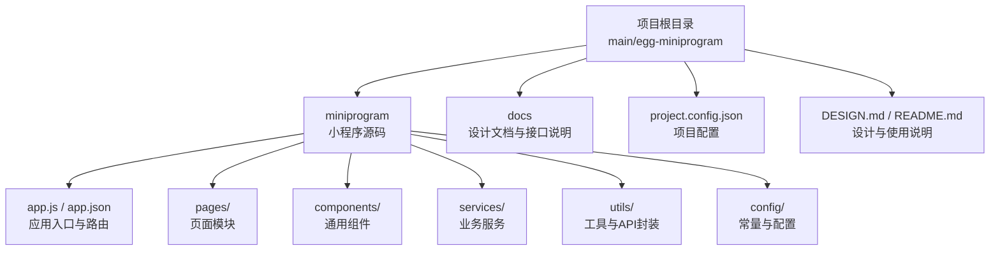
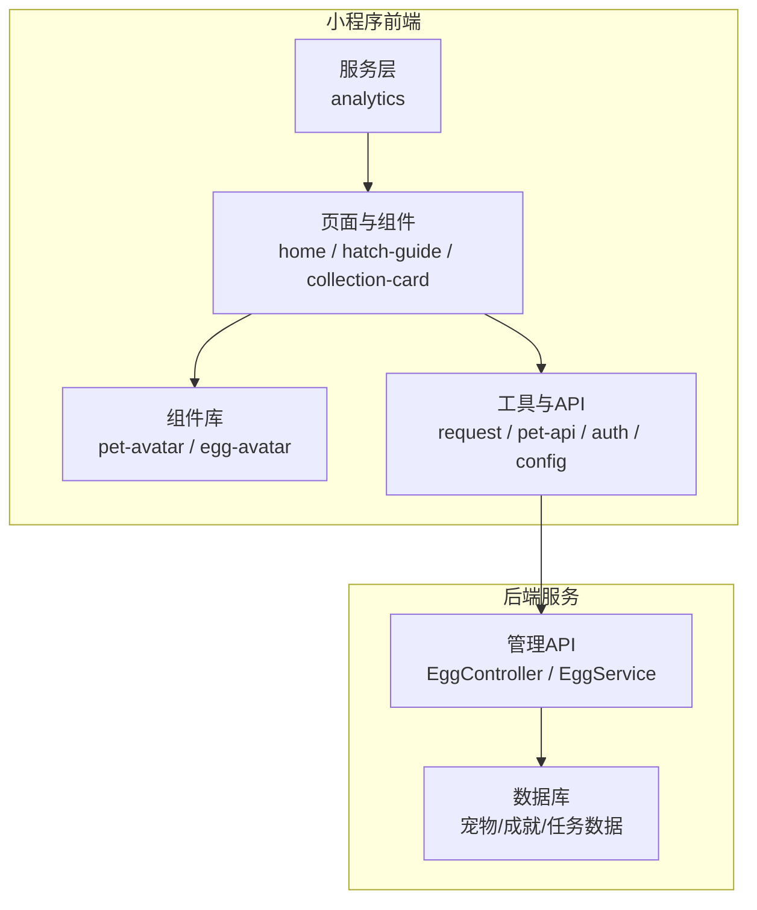
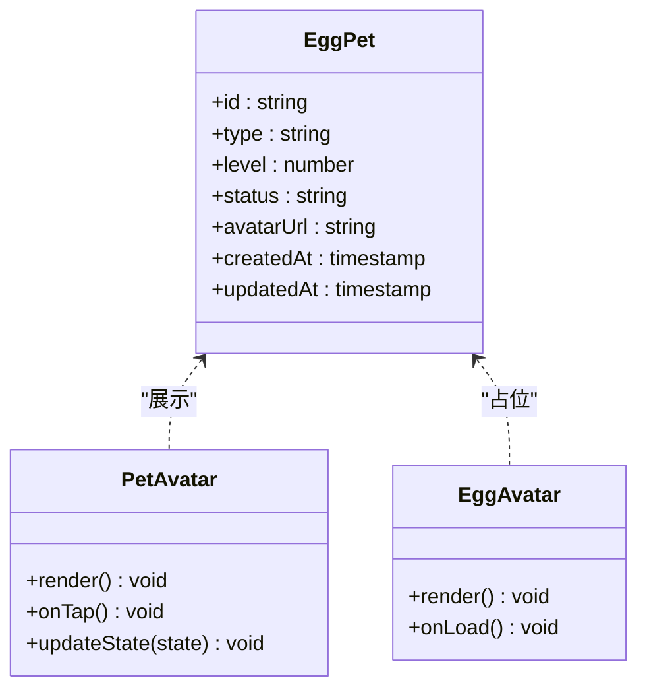
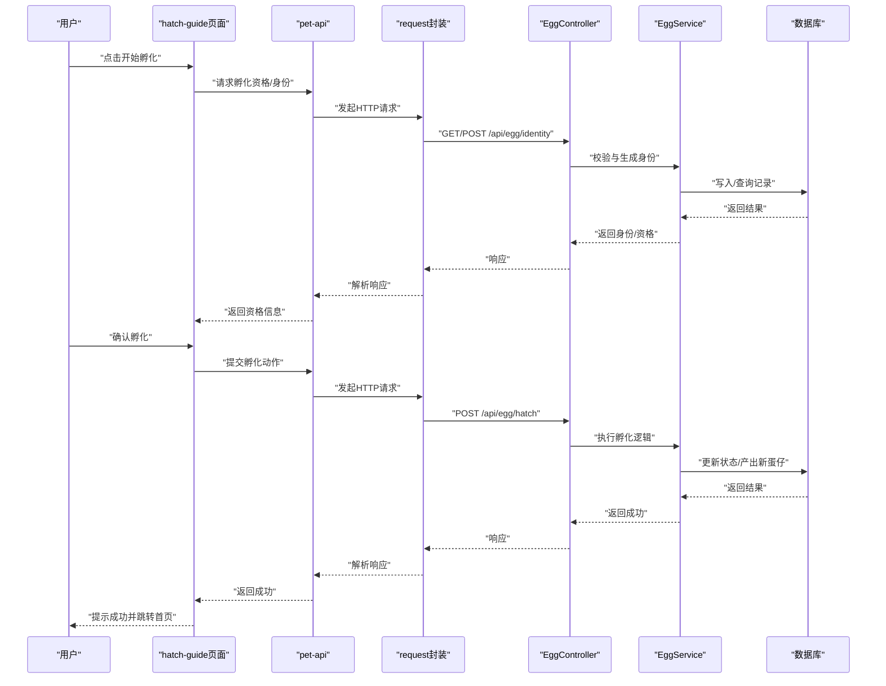
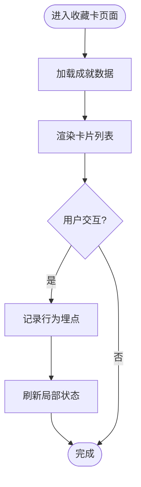
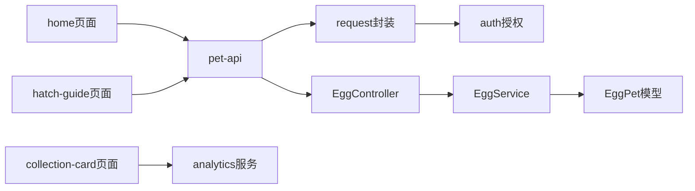

# 蛋仔小程序概述

<cite>
**本文引用的文件**   
- [main/egg-miniprogram/DESIGN.md](file://main/egg-miniprogram/DESIGN.md)
- [main/egg-miniprogram/README.md](file://main/egg-miniprogram/README.md)
- [main/egg-miniprogram/project.config.json](file://main/egg-miniprogram/project.config.json)
- [main/egg-miniprogram/miniprogram/app.js](file://main/egg-miniprogram/miniprogram/app.js)
- [main/egg-miniprogram/miniprogram/app.json](file://main/egg-miniprogram/miniprogram/app.json)
- [main/egg-miniprogram/miniprogram/pages/home/index.js](file://main/egg-miniprogram/miniprogram/pages/home/index.js)
- [main/egg-miniprogram/miniprogram/pages/hatch-guide/index.js](file://main/egg-miniprogram/miniprogram/pages/hatch-guide/index.js)
- [main/egg-miniprogram/miniprogram/pages/collection-card/index.js](file://main/egg-miniprogram/miniprogram/pages/collection-card/index.js)
- [main/egg-miniprogram/miniprogram/services/analytics.js](file://main/egg-miniprogram/miniprogram/services/analytics.js)
- [main/egg-miniprogram/miniprogram/utils/pet-api.js](file://main/egg-miniprogram/miniprogram/utils/pet-api.js)
- [main/egg-miniprogram/miniprogram/utils/request.js](file://main/egg-miniprogram/miniprogram/utils/request.js)
- [main/egg-miniprogram/miniprogram/utils/auth.js](file://main/egg-miniprogram/miniprogram/utils/auth.js)
- [main/egg-miniprogram/miniprogram/config/api.js](file://main/egg-miniprogram/miniprogram/config/api.js)
- [main/egg-miniprogram/miniprogram/components/pet-avatar/pet-avatar.js](file://main/egg-miniprogram/miniprogram/components/pet-avatar/pet-avatar.js)
- [main/egg-miniprogram/miniprogram/components/egg-avatar/egg-avatar.js](file://main/egg-miniprogram/miniprogram/components/egg-avatar/egg-avatar.js)
- [main/egg-miniprogram/docs/egg-pet-identity-and-hatch-api.md](file://main/egg-miniprogram/docs/egg-pet-identity-and-hatch-api.md)
- [main/egg-miniprogram/docs/page-navigation.md](file://main/egg-miniprogram/docs/page-navigation.md)
- [main/manager-api/src/main/java/xiaozhi/controller/EggController.java](file://main/manager-api/src/main/java/xiaozhi/controller/EggController.java)
- [main/manager-api/src/main/java/xiaozhi/service/EggService.java](file://main/manager-api/src/main/java/xiaozhi/service/EggService.java)
- [main/manager-api/src/main/java/xiaozhi/model/EggPet.java](file://main/manager-api/src/main/java/xiaozhi/model/EggPet.java)
</cite>

## 目录
1. [简介](#简介)
2. [项目结构](#项目结构)
3. [核心组件](#核心组件)
4. [架构总览](#架构总览)
5. [详细组件分析](#详细组件分析)
6. [依赖关系分析](#依赖关系分析)
7. [性能考虑](#性能考虑)
8. [故障排查指南](#故障排查指南)
9. [结论](#结论)
10. [附录](#附录)

## 简介
本概述面向“蛋仔小程序”的设计与实现，聚焦游戏化体验、角色系统、成就机制与社交互动。文档从设计理念出发，梳理页面结构与组件复用机制，解释游戏循环、状态管理与数据持久化策略，并给出宠物养成、装备系统与任务完成等关键功能的实现思路与参考路径。读者无需深入代码即可理解整体方案，同时为开发者提供可追溯的文件定位与流程图示。

## 项目结构
蛋仔小程序位于 main/egg-miniprogram 目录，采用微信小程序标准工程结构：
- miniprogram：小程序源码（入口、页面、组件、服务、工具）
- docs：设计文档与接口说明
- project.config.json：项目配置
- DESIGN.md / README.md：设计与使用说明

图表来源
- [main/egg-miniprogram/miniprogram/app.js](file://main/egg-miniprogram/miniprogram/app.js)
- [main/egg-miniprogram/miniprogram/app.json](file://main/egg-miniprogram/miniprogram/app.json)
- [main/egg-miniprogram/project.config.json](file://main/egg-miniprogram/project.config.json)

章节来源
- [main/egg-miniprogram/DESIGN.md](file://main/egg-miniprogram/DESIGN.md)
- [main/egg-miniprogram/README.md](file://main/egg-miniprogram/README.md)
- [main/egg-miniprogram/project.config.json](file://main/egg-miniprogram/project.config.json)

## 核心组件
- 应用入口与路由
  - app.js：初始化全局状态、生命周期钩子、权限与网络环境准备
  - app.json：页面注册、窗口样式、TabBar 配置
- 页面模块
  - home：首页主场景，承载蛋仔展示、交互入口与状态概览
  - hatch-guide：孵化引导流程，驱动新手任务与进度推进
  - collection-card：收藏卡界面，呈现成就与收集进度
- 组件库
  - pet-avatar：蛋仔/宠物头像与状态展示组件
  - egg-avatar：蛋形头像组件，用于未孵化或占位态
- 服务层
  - analytics：埋点与行为统计，支撑用户激励与留存分析
- 工具与API
  - pet-api：宠物相关接口封装（身份、孵化、成长、任务）
  - request：统一请求封装（拦截器、重试、错误处理）
  - auth：微信授权与会话管理
  - config/api：后端接口地址与版本管理

章节来源
- [main/egg-miniprogram/miniprogram/app.js](file://main/egg-miniprogram/miniprogram/app.js)
- [main/egg-miniprogram/miniprogram/app.json](file://main/egg-miniprogram/miniprogram/app.json)
- [main/egg-miniprogram/miniprogram/pages/home/index.js](file://main/egg-miniprogram/miniprogram/pages/home/index.js)
- [main/egg-miniprogram/miniprogram/pages/hatch-guide/index.js](file://main/egg-miniprogram/miniprogram/pages/hatch-guide/index.js)
- [main/egg-miniprogram/miniprogram/pages/collection-card/index.js](file://main/egg-miniprogram/miniprogram/pages/collection-card/index.js)
- [main/egg-miniprogram/miniprogram/components/pet-avatar/pet-avatar.js](file://main/egg-miniprogram/miniprogram/components/pet-avatar/pet-avatar.js)
- [main/egg-miniprogram/miniprogram/components/egg-avatar/egg-avatar.js](file://main/egg-miniprogram/miniprogram/components/egg-avatar/egg-avatar.js)
- [main/egg-miniprogram/miniprogram/services/analytics.js](file://main/egg-miniprogram/miniprogram/services/analytics.js)
- [main/egg-miniprogram/miniprogram/utils/pet-api.js](file://main/egg-miniprogram/miniprogram/utils/pet-api.js)
- [main/egg-miniprogram/miniprogram/utils/request.js](file://main/egg-miniprogram/miniprogram/utils/request.js)
- [main/egg-miniprogram/miniprogram/utils/auth.js](file://main/egg-miniprogram/miniprogram/utils/auth.js)
- [main/egg-miniprogram/miniprogram/config/api.js](file://main/egg-miniprogram/miniprogram/config/api.js)

## 架构总览
小程序前端通过统一请求层访问后端管理 API，结合本地缓存与会话管理完成状态同步。宠物与孵化流程由后端服务编排，前端负责引导与反馈。

图表来源
- [main/egg-miniprogram/miniprogram/pages/home/index.js](file://main/egg-miniprogram/miniprogram/pages/home/index.js)
- [main/egg-miniprogram/miniprogram/pages/hatch-guide/index.js](file://main/egg-miniprogram/miniprogram/pages/hatch-guide/index.js)
- [main/egg-miniprogram/miniprogram/pages/collection-card/index.js](file://main/egg-miniprogram/miniprogram/pages/collection-card/index.js)
- [main/egg-miniprogram/miniprogram/components/pet-avatar/pet-avatar.js](file://main/egg-miniprogram/miniprogram/components/pet-avatar/pet-avatar.js)
- [main/egg-miniprogram/miniprogram/components/egg-avatar/egg-avatar.js](file://main/egg-miniprogram/miniprogram/components/egg-avatar/egg-avatar.js)
- [main/egg-miniprogram/miniprogram/services/analytics.js](file://main/egg-miniprogram/miniprogram/services/analytics.js)
- [main/egg-miniprogram/miniprogram/utils/request.js](file://main/egg-miniprogram/miniprogram/utils/request.js)
- [main/egg-miniprogram/miniprogram/utils/pet-api.js](file://main/egg-miniprogram/miniprogram/utils/pet-api.js)
- [main/manager-api/src/main/java/xiaozhi/controller/EggController.java](file://main/manager-api/src/main/java/xiaozhi/controller/EggController.java)
- [main/manager-api/src/main/java/xiaozhi/service/EggService.java](file://main/manager-api/src/main/java/xiaozhi/service/EggService.java)

## 详细组件分析

### 角色系统与蛋仔展示
- 角色模型
  - 使用统一的宠物实体描述蛋仔属性（类型、等级、状态、外观资源等），前后端通过 API 同步。
- 展示组件
  - pet-avatar：根据状态渲染不同形态（未孵化、孵化中、已孵化、成长阶段），支持动画切换与交互事件。
  - egg-avatar：用于占位与过渡态，配合加载骨架提升感知性能。
- 状态管理
  - 页面级状态与全局状态分离，常用数据通过本地缓存与后端拉取双通道保障一致性。

图表来源
- [main/manager-api/src/main/java/xiaozhi/model/EggPet.java](file://main/manager-api/src/main/java/xiaozhi/model/EggPet.java)
- [main/egg-miniprogram/miniprogram/components/pet-avatar/pet-avatar.js](file://main/egg-miniprogram/miniprogram/components/pet-avatar/pet-avatar.js)
- [main/egg-miniprogram/miniprogram/components/egg-avatar/egg-avatar.js](file://main/egg-miniprogram/miniprogram/components/egg-avatar/egg-avatar.js)

章节来源
- [main/manager-api/src/main/java/xiaozhi/model/EggPet.java](file://main/manager-api/src/main/java/xiaozhi/model/EggPet.java)
- [main/egg-miniprogram/miniprogram/components/pet-avatar/pet-avatar.js](file://main/egg-miniprogram/miniprogram/components/pet-avatar/pet-avatar.js)
- [main/egg-miniprogram/miniprogram/components/egg-avatar/egg-avatar.js](file://main/egg-miniprogram/miniprogram/components/egg-avatar/egg-avatar.js)

### 孵化流程与新手引导
- 流程目标
  - 通过孵化引导建立新手任务链，驱动用户完成首次互动与基础养成。
- 关键步骤
  - 获取蛋仔身份与孵化资格
  - 执行孵化动作（消耗/等待/条件达成）
  - 更新状态并进入主页展示
- 前端控制
  - hatch-guide 页面串联步骤，调用 pet-api 进行状态变更，成功后跳转 home。

图表来源
- [main/egg-miniprogram/miniprogram/pages/hatch-guide/index.js](file://main/egg-miniprogram/miniprogram/pages/hatch-guide/index.js)
- [main/egg-miniprogram/miniprogram/utils/pet-api.js](file://main/egg-miniprogram/miniprogram/utils/pet-api.js)
- [main/egg-miniprogram/miniprogram/utils/request.js](file://main/egg-miniprogram/miniprogram/utils/request.js)
- [main/manager-api/src/main/java/xiaozhi/controller/EggController.java](file://main/manager-api/src/main/java/xiaozhi/controller/EggController.java)
- [main/manager-api/src/main/java/xiaozhi/service/EggService.java](file://main/manager-api/src/main/java/xiaozhi/service/EggService.java)

章节来源
- [main/egg-miniprogram/miniprogram/pages/hatch-guide/index.js](file://main/egg-miniprogram/miniprogram/pages/hatch-guide/index.js)
- [main/egg-miniprogram/miniprogram/utils/pet-api.js](file://main/egg-miniprogram/miniprogram/utils/pet-api.js)
- [main/egg-miniprogram/miniprogram/utils/request.js](file://main/egg-miniprogram/miniprogram/utils/request.js)
- [main/egg-miniprogram/docs/egg-pet-identity-and-hatch-api.md](file://main/egg-miniprogram/docs/egg-pet-identity-and-hatch-api.md)

### 成就机制与收藏卡
- 设计目标
  - 以收藏卡形式可视化成就与收集进度，增强成就感与持续参与动机。
- 实现要点
  - 页面层聚合成就列表与状态，组件层渲染卡片与动效。
  - 通过 analytics 记录关键行为，辅助运营与激励策略优化。

图表来源
- [main/egg-miniprogram/miniprogram/pages/collection-card/index.js](file://main/egg-miniprogram/miniprogram/pages/collection-card/index.js)
- [main/egg-miniprogram/miniprogram/services/analytics.js](file://main/egg-miniprogram/miniprogram/services/analytics.js)

章节来源
- [main/egg-miniprogram/miniprogram/pages/collection-card/index.js](file://main/egg-miniprogram/miniprogram/pages/collection-card/index.js)
- [main/egg-miniprogram/miniprogram/services/analytics.js](file://main/egg-miniprogram/miniprogram/services/analytics.js)

### 社交互动功能
- 能力范围
  - 邀请码、好友分享、排行榜与协作任务等（按需求扩展）。
- 技术要点
  - 通过 invite-api 与后端协作完成邀请链路；在页面层提供分享入口与回调处理。
- 建议模式
  - 将社交事件纳入 analytics，形成闭环评估与激励策略。

章节来源
- [main/egg-miniprogram/miniprogram/utils/invite-api.js](file://main/egg-miniprogram/miniprogram/utils/invite-api.js)
- [main/egg-miniprogram/miniprogram/services/analytics.js](file://main/egg-miniprogram/miniprogram/services/analytics.js)

### 页面结构与组件复用
- 页面组织
  - 基于 pages 目录划分功能域，每个页面包含 js/wxml/wxss/json，职责清晰。
- 组件复用
  - 通用 UI 组件集中在 components 目录，如 pet-avatar、egg-avatar、nav-bar、button 等，减少重复代码。
- 导航与路由
  - app.json 集中管理页面注册与 TabBar；page-navigation 文档规范跳转与参数传递。

章节来源
- [main/egg-miniprogram/miniprogram/app.json](file://main/egg-miniprogram/miniprogram/app.json)
- [main/egg-miniprogram/docs/page-navigation.md](file://main/egg-miniprogram/docs/page-navigation.md)

### 动画效果实现
- 推荐方式
  - 使用 CSS 动画与小程序原生动画 API 组合，保证流畅性与兼容性。
- 实践建议
  - 对频繁更新的属性（如位置、透明度）优先使用 transform 与 opacity，避免重排。
  - 复杂动效拆分为多帧与延迟触发，降低首屏压力。

章节来源
- [main/egg-miniprogram/miniprogram/components/pet-avatar/pet-avatar.js](file://main/egg-miniprogram/miniprogram/components/pet-avatar/pet-avatar.js)
- [main/egg-miniprogram/miniprogram/components/egg-avatar/egg-avatar.js](file://main/egg-miniprogram/miniprogram/components/egg-avatar/egg-avatar.js)

### 游戏循环、状态管理与数据持久化
- 游戏循环
  - 以“任务—反馈—奖励—新任务”的循环为核心，通过 hatch-guide 与 collection-card 串联。
- 状态管理
  - 页面级状态与全局状态分离，关键状态通过本地缓存与后端同步，确保断网与重启恢复。
- 数据持久化
  - 使用小程序存储 API 缓存轻量数据；重要数据通过 API 持久化到后端。

章节来源
- [main/egg-miniprogram/miniprogram/pages/home/index.js](file://main/egg-miniprogram/miniprogram/pages/home/index.js)
- [main/egg-miniprogram/miniprogram/pages/hatch-guide/index.js](file://main/egg-miniprogram/miniprogram/pages/hatch-guide/index.js)
- [main/egg-miniprogram/miniprogram/pages/collection-card/index.js](file://main/egg-miniprogram/miniprogram/pages/collection-card/index.js)

### 具体功能示例（实现思路与参考路径）
- 宠物养成
  - 通过 pet-api 调用成长、喂养、升级等接口；页面层维护等级、经验值与外观变化。
  - 参考路径：[pet-api 封装](file://main/egg-miniprogram/miniprogram/utils/pet-api.js)、[宠物实体](file://main/manager-api/src/main/java/xiaozhi/model/EggPet.java)
- 装备系统
  - 定义装备模型与槽位规则，前端渲染装备栏与穿戴状态，后端校验与持久化。
  - 参考路径：[EggService 业务逻辑](file://main/manager-api/src/main/java/xiaozhi/service/EggService.java)、[EggController 接口](file://main/manager-api/src/main/java/xiaozhi/controller/EggController.java)
- 任务完成
  - 任务清单与进度跟踪由 collection-card 与 hatch-guide 协同实现，完成后触发奖励与埋点。
  - 参考路径：[收藏卡页面](file://main/egg-miniprogram/miniprogram/pages/collection-card/index.js)、[埋点服务](file://main/egg-miniprogram/miniprogram/services/analytics.js)

章节来源
- [main/egg-miniprogram/miniprogram/utils/pet-api.js](file://main/egg-miniprogram/miniprogram/utils/pet-api.js)
- [main/manager-api/src/main/java/xiaozhi/model/EggPet.java](file://main/manager-api/src/main/java/xiaozhi/model/EggPet.java)
- [main/manager-api/src/main/java/xiaozhi/service/EggService.java](file://main/manager-api/src/main/java/xiaozhi/service/EggService.java)
- [main/manager-api/src/main/java/xiaozhi/controller/EggController.java](file://main/manager-api/src/main/java/xiaozhi/controller/EggController.java)
- [main/egg-miniprogram/miniprogram/pages/collection-card/index.js](file://main/egg-miniprogram/miniprogram/pages/collection-card/index.js)
- [main/egg-miniprogram/miniprogram/services/analytics.js](file://main/egg-miniprogram/miniprogram/services/analytics.js)

## 依赖关系分析
- 前端依赖
  - 页面依赖组件与服务；服务依赖工具与配置；工具依赖网络与授权。
- 后端依赖
  - Controller 暴露 REST 接口，Service 编排业务逻辑，Model 映射数据表。
- 耦合与内聚
  - 通过 API 解耦前后端；组件高内聚、低耦合，便于复用与维护。

图表来源
- [main/egg-miniprogram/miniprogram/pages/home/index.js](file://main/egg-miniprogram/miniprogram/pages/home/index.js)
- [main/egg-miniprogram/miniprogram/pages/hatch-guide/index.js](file://main/egg-miniprogram/miniprogram/pages/hatch-guide/index.js)
- [main/egg-miniprogram/miniprogram/pages/collection-card/index.js](file://main/egg-miniprogram/miniprogram/pages/collection-card/index.js)
- [main/egg-miniprogram/miniprogram/utils/pet-api.js](file://main/egg-miniprogram/miniprogram/utils/pet-api.js)
- [main/egg-miniprogram/miniprogram/utils/request.js](file://main/egg-miniprogram/miniprogram/utils/request.js)
- [main/egg-miniprogram/miniprogram/utils/auth.js](file://main/egg-miniprogram/miniprogram/utils/auth.js)
- [main/manager-api/src/main/java/xiaozhi/controller/EggController.java](file://main/manager-api/src/main/java/xiaozhi/controller/EggController.java)
- [main/manager-api/src/main/java/xiaozhi/service/EggService.java](file://main/manager-api/src/main/java/xiaozhi/service/EggService.java)
- [main/manager-api/src/main/java/xiaozhi/model/EggPet.java](file://main/manager-api/src/main/java/xiaozhi/model/EggPet.java)

章节来源
- [main/egg-miniprogram/miniprogram/utils/pet-api.js](file://main/egg-miniprogram/miniprogram/utils/pet-api.js)
- [main/egg-miniprogram/miniprogram/utils/request.js](file://main/egg-miniprogram/miniprogram/utils/request.js)
- [main/egg-miniprogram/miniprogram/utils/auth.js](file://main/egg-miniprogram/miniprogram/utils/auth.js)
- [main/manager-api/src/main/java/xiaozhi/controller/EggController.java](file://main/manager-api/src/main/java/xiaozhi/controller/EggController.java)
- [main/manager-api/src/main/java/xiaozhi/service/EggService.java](file://main/manager-api/src/main/java/xiaozhi/service/EggService.java)
- [main/manager-api/src/main/java/xiaozhi/model/EggPet.java](file://main/manager-api/src/main/java/xiaozhi/model/EggPet.java)

## 性能考虑
- 首屏优化
  - 懒加载非关键组件与图片，骨架屏替代长耗时渲染。
- 动画与渲染
  - 优先使用 transform/opacity，减少布局抖动；拆分复杂动画为多帧。
- 网络与缓存
  - 合理设置缓存策略与重试机制；对热点数据做本地缓存与增量更新。
- 资源管理
  - 压缩静态资源，按需加载；避免内存泄漏与过度监听。

## 故障排查指南
- 常见问题
  - 授权失败：检查 auth 流程与权限申请时机
  - 网络异常：查看 request 拦截器日志与重试策略
  - 状态不一致：对比本地缓存与后端数据，必要时强制刷新
  - 动画卡顿：检查是否触发布局重排，优化动画属性
- 调试建议
  - 启用 analytics 日志，定位关键行为节点
  - 使用小程序开发者工具的 Network 面板观察请求与响应
  - 在后端日志中追踪 EggController/EggService 的关键调用

章节来源
- [main/egg-miniprogram/miniprogram/utils/auth.js](file://main/egg-miniprogram/miniprogram/utils/auth.js)
- [main/egg-miniprogram/miniprogram/utils/request.js](file://main/egg-miniprogram/miniprogram/utils/request.js)
- [main/egg-miniprogram/miniprogram/services/analytics.js](file://main/egg-miniprogram/miniprogram/services/analytics.js)
- [main/manager-api/src/main/java/xiaozhi/controller/EggController.java](file://main/manager-api/src/main/java/xiaozhi/controller/EggController.java)
- [main/manager-api/src/main/java/xiaozhi/service/EggService.java](file://main/manager-api/src/main/java/xiaozhi/service/EggService.java)

## 结论
蛋仔小程序以游戏化为核心，围绕角色系统、成就机制与社交互动构建完整体验。通过清晰的页面结构与组件复用、稳健的状态管理与数据持久化策略，以及前后端解耦的架构设计，实现了良好的可扩展性与可维护性。建议在后续迭代中持续优化性能与用户体验，完善激励与社交玩法，提升用户粘性与活跃度。

## 附录
- 设计文档
  - [DESIGN.md](file://main/egg-miniprogram/DESIGN.md)
  - [README.md](file://main/egg-miniprogram/README.md)
- 接口与导航
  - [egg-pet-identity-and-hatch-api.md](file://main/egg-miniprogram/docs/egg-pet-identity-and-hatch-api.md)
  - [page-navigation.md](file://main/egg-miniprogram/docs/page-navigation.md)
- 项目配置
  - [project.config.json](file://main/egg-miniprogram/project.config.json)
  - [app.json](file://main/egg-miniprogram/miniprogram/app.json)