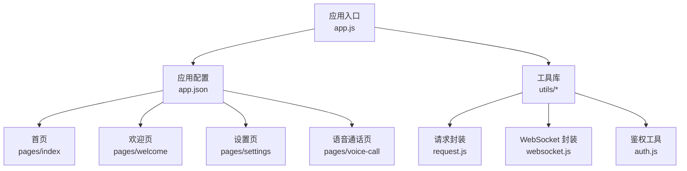
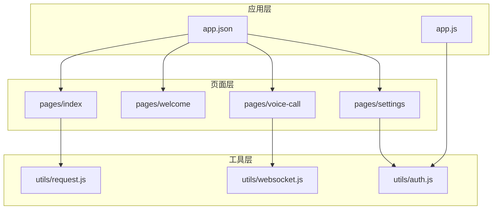
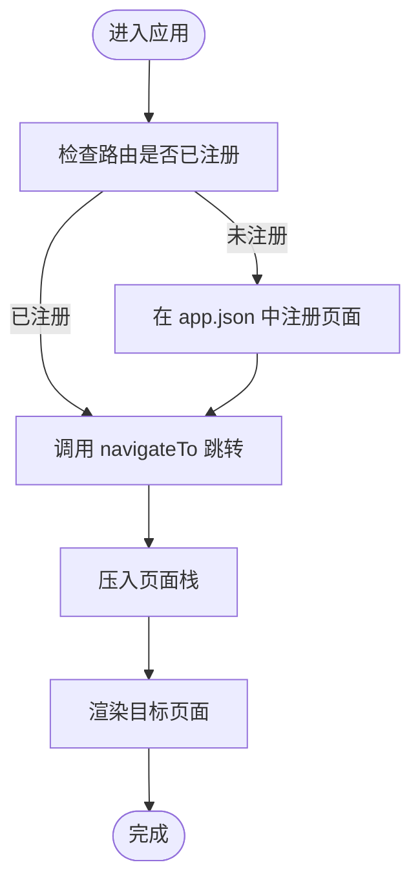
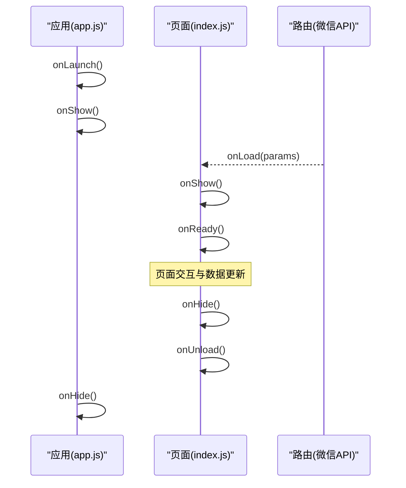
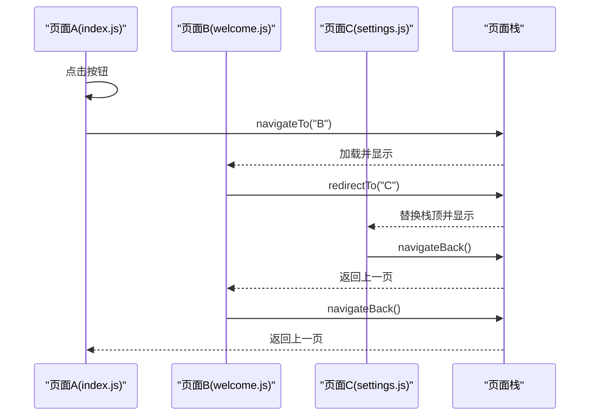
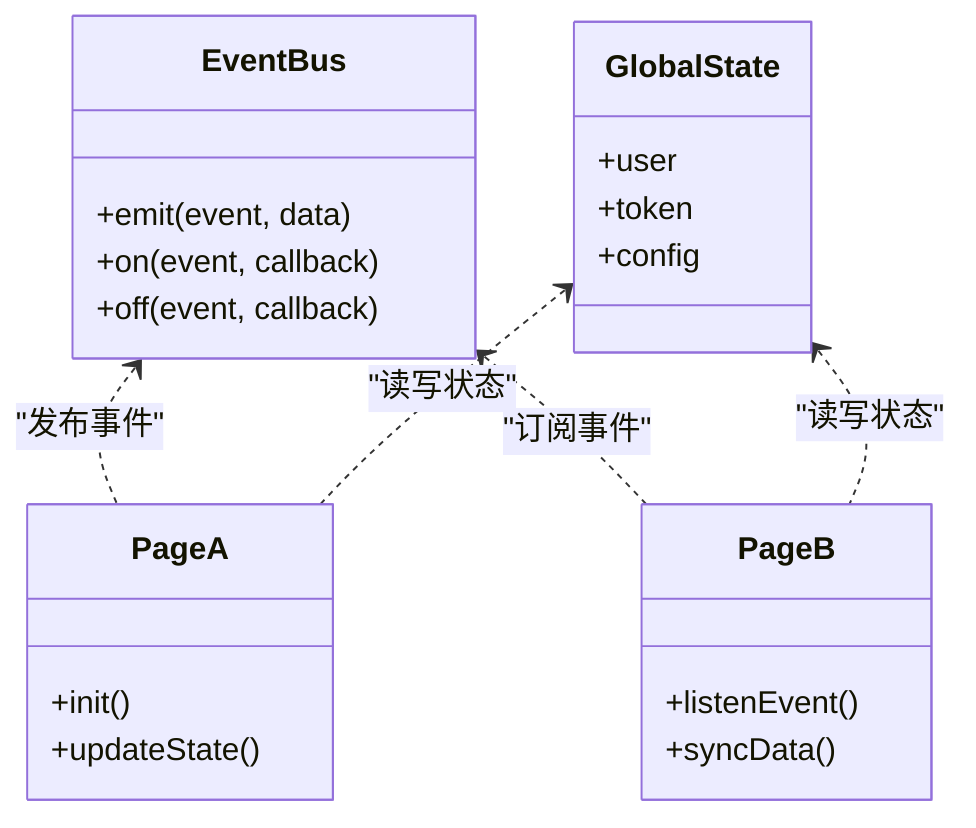
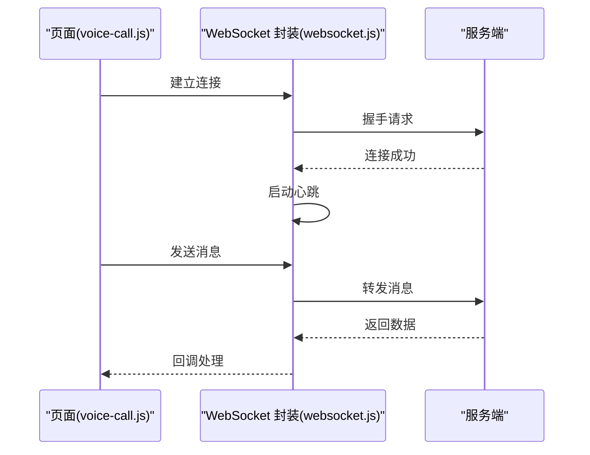
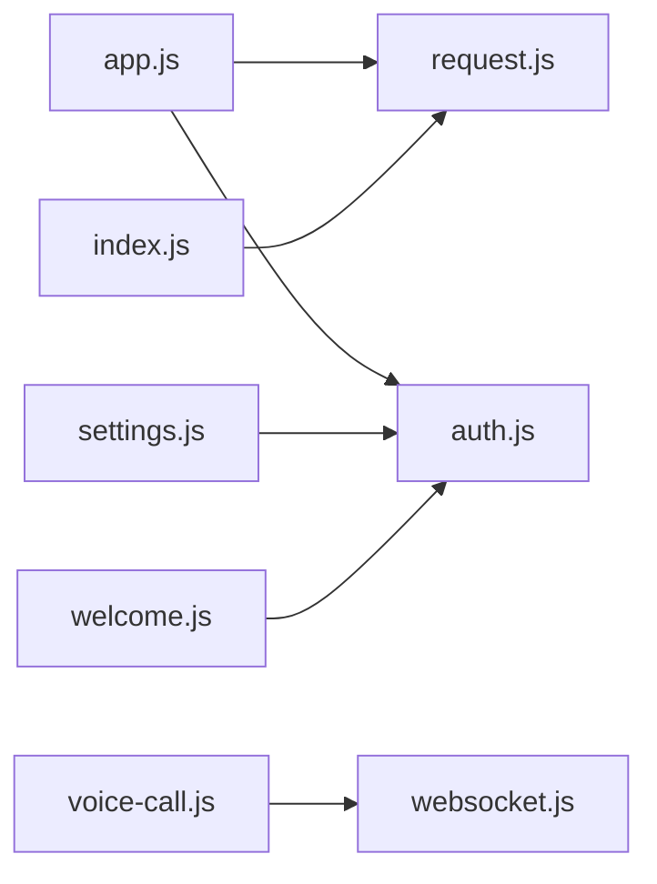

# 页面与导航

<cite>
**本文引用的文件**   
- [app.json](file://main/miniprogram/app.json)
- [app.js](file://main/miniprogram/app.js)
- [index.js](file://main/miniprogram/pages/index/index.js)
- [welcome.js](file://main/miniprogram/pages/welcome/welcome.js)
- [settings.js](file://main/miniprogram/pages/settings/settings.js)
- [voice-call.js](file://main/miniprogram/pages/voice-call/voice-call.js)
- [request.js](file://main/miniprogram/utils/request.js)
- [websocket.js](file://main/miniprogram/utils/websocket.js)
- [auth.js](file://main/miniprogram/utils/auth.js)
- [page-navigation.md](file://main/egg-miniprogram/docs/page-navigation.md)
</cite>

## 目录
1. [简介](#简介)
2. [项目结构](#项目结构)
3. [核心组件](#核心组件)
4. [架构总览](#架构总览)
5. [详细组件分析](#详细组件分析)
6. [依赖分析](#依赖分析)
7. [性能考虑](#性能考虑)
8. [故障排查指南](#故障排查指南)
9. [结论](#结论)
10. [附录](#附录)

## 简介
本章节面向蛋仔小程序的页面与导航系统，系统性阐述页面组织方式、路由配置、生命周期管理、导航机制（跳转、参数传递、返回栈）、状态管理与跨页通信、以及性能优化策略。文档同时提供可操作的实践建议与常见问题排查方法，帮助开发者快速构建稳定、高性能且体验良好的小程序页面体系。

## 项目结构
蛋仔小程序采用微信小程序原生框架，页面按功能模块划分在 pages 目录下，每个页面包含 .js/.json/.wxml/.wxss 四个文件；应用级入口为 app.js 与 app.json，其中 app.json 负责全局配置与路由注册。工具类集中在 utils 目录，如网络请求、WebSocket、鉴权等。

图表来源 
- [app.json](file://main/miniprogram/app.json)
- [app.js](file://main/miniprogram/app.js)
- [index.js](file://main/miniprogram/pages/index/index.js)
- [welcome.js](file://main/miniprogram/pages/welcome/welcome.js)
- [settings.js](file://main/miniprogram/pages/settings/settings.js)
- [voice-call.js](file://main/miniprogram/pages/voice-call/voice-call.js)
- [request.js](file://main/miniprogram/utils/request.js)
- [websocket.js](file://main/miniprogram/utils/websocket.js)
- [auth.js](file://main/miniprogram/utils/auth.js)

章节来源
- [app.json](file://main/miniprogram/app.json)
- [app.js](file://main/miniprogram/app.js)

## 核心组件
- 应用入口与配置
  - app.js：初始化全局数据、监听应用生命周期、注册全局事件总线或状态容器。
  - app.json：声明页面路径、窗口样式、tabBar、网络超时、分包与预加载策略等。
- 页面模块
  - index.js：首页逻辑，含页面生命周期、数据获取与渲染、导航触发。
  - welcome.js：欢迎页逻辑，常用于引导流程与权限校验。
  - settings.js：设置页逻辑，维护用户偏好与本地缓存。
  - voice-call.js：语音通话页，处理实时音视频相关状态与交互。
- 工具库
  - request.js：统一 HTTP 请求封装，拦截器、重试、错误码映射。
  - websocket.js：长连接封装，断线重连、心跳、消息分发。
  - auth.js：登录态、Token 管理、权限判断。

章节来源
- [app.js](file://main/miniprogram/app.js)
- [app.json](file://main/miniprogram/app.json)
- [index.js](file://main/miniprogram/pages/index/index.js)
- [welcome.js](file://main/miniprogram/pages/welcome/welcome.js)
- [settings.js](file://main/miniprogram/pages/settings/settings.js)
- [voice-call.js](file://main/miniprogram/pages/voice-call/voice-call.js)
- [request.js](file://main/miniprogram/utils/request.js)
- [websocket.js](file://main/miniprogram/utils/websocket.js)
- [auth.js](file://main/miniprogram/utils/auth.js)

## 架构总览
小程序页面与导航的整体架构由“应用层 + 页面层 + 工具层”构成。应用层负责全局配置与生命周期；页面层承载业务逻辑与视图；工具层提供网络、WebSocket、鉴权等能力。导航通过微信提供的 API 实现，结合返回栈进行页面流转控制。

图表来源 
- [app.json](file://main/miniprogram/app.json)
- [app.js](file://main/miniprogram/app.js)
- [index.js](file://main/miniprogram/pages/index/index.js)
- [welcome.js](file://main/miniprogram/pages/welcome/welcome.js)
- [settings.js](file://main/miniprogram/pages/settings/settings.js)
- [voice-call.js](file://main/miniprogram/pages/voice-call/voice-call.js)
- [request.js](file://main/miniprogram/utils/request.js)
- [websocket.js](file://main/miniprogram/utils/websocket.js)
- [auth.js](file://main/miniprogram/utils/auth.js)

## 详细组件分析

### 页面结构与路由配置
- 页面组织
  - 每个页面独立目录，包含 JS/WXML/WXSS/JSON，便于职责分离与复用。
- 路由配置
  - 通过 app.json 的 pages 字段声明所有页面路径，支持 tabBar 与 window 全局样式。
  - 可使用 subPackages 进行分包，减少首屏体积。
- 动态路由
  - 基于 wx.navigateTo 的动态路径拼接可实现条件渲染与动态路由，但需确保目标页面已在 app.json 中注册。

图表来源 
- [app.json](file://main/miniprogram/app.json)
- [index.js](file://main/miniprogram/pages/index/index.js)

章节来源
- [app.json](file://main/miniprogram/app.json)
- [index.js](file://main/miniprogram/pages/index/index.js)

### 页面生命周期管理
- 应用生命周期
  - onLaunch：应用启动时执行，适合初始化全局数据、日志、埋点。
  - onShow：应用显示时执行，适合恢复状态、刷新数据。
  - onHide：应用隐藏时执行，适合清理定时器、释放资源。
- 页面生命周期
  - onLoad：页面加载，接收路由参数。
  - onShow：页面显示，适合拉取数据、更新 UI。
  - onReady：页面初次渲染完成，适合 DOM 操作。
  - onHide：页面隐藏，适合暂停动画、停止轮询。
  - onUnload：页面卸载，适合清理监听、释放内存。

图表来源 
- [app.js](file://main/miniprogram/app.js)
- [index.js](file://main/miniprogram/pages/index/index.js)

章节来源
- [app.js](file://main/miniprogram/app.js)
- [index.js](file://main/miniprogram/pages/index/index.js)

### 导航机制与返回栈管理
- 页面跳转
  - wx.navigateTo：保留当前页面，跳转到新页面，压入页面栈。
  - wx.redirectTo：关闭当前页面，跳转到新页面，替换当前栈顶。
  - wx.switchTab：跳转到 tabBar 页面，清空非 tabBar 页面栈。
  - wx.reLaunch：关闭所有页面，打开到指定页面。
  - wx.navigateBack：返回上一页，弹出栈顶页面。
- 参数传递
  - 通过 URL query 参数传递轻量数据，或使用全局变量/事件总线传递复杂对象。
- 返回栈管理
  - 使用 getCurrentPages() 获取页面栈，避免深层嵌套导致的内存占用。
  - 对频繁切换的页面使用 switchTab 或 reLaunch 控制栈深度。

图表来源 
- [index.js](file://main/miniprogram/pages/index/index.js)
- [welcome.js](file://main/miniprogram/pages/welcome/welcome.js)
- [settings.js](file://main/miniprogram/pages/settings/settings.js)

章节来源
- [index.js](file://main/miniprogram/pages/index/index.js)
- [welcome.js](file://main/miniprogram/pages/welcome/welcome.js)
- [settings.js](file://main/miniprogram/pages/settings/settings.js)

### 页面状态管理与跨页通信
- 数据共享
  - 使用 getApp().globalData 存储全局状态，适用于简单场景。
  - 对于复杂状态，建议使用第三方状态管理库（如 MobX、Redux）或自定义事件总线。
- 事件总线
  - 在 app.js 中定义 emit/on/off 方法，实现跨页面事件发布订阅。
- 跨页通信
  - 通过 URL 参数传递必要信息，或通过 storage 持久化共享数据。
  - WebSocket 可用于实时数据同步（如语音通话状态）。

图表来源 
- [app.js](file://main/miniprogram/app.js)
- [index.js](file://main/miniprogram/pages/index/index.js)
- [welcome.js](file://main/miniprogram/pages/welcome/welcome.js)

章节来源
- [app.js](file://main/miniprogram/app.js)
- [index.js](file://main/miniprogram/pages/index/index.js)
- [welcome.js](file://main/miniprogram/pages/welcome/welcome.js)

### 网络与实时通信集成
- HTTP 请求
  - 使用 request.js 封装 wx.request，统一处理请求头、响应拦截、错误提示。
- WebSocket 长连接
  - 使用 websocket.js 封装连接建立、心跳检测、断线重连、消息分发。
- 鉴权与安全
  - 使用 auth.js 管理 Token，自动附加到请求头，处理过期刷新。

图表来源 
- [voice-call.js](file://main/miniprogram/pages/voice-call/voice-call.js)
- [websocket.js](file://main/miniprogram/utils/websocket.js)

章节来源
- [voice-call.js](file://main/miniprogram/pages/voice-call/voice-call.js)
- [websocket.js](file://main/miniprogram/utils/websocket.js)
- [request.js](file://main/miniprogram/utils/request.js)
- [auth.js](file://main/miniprogram/utils/auth.js)

## 依赖分析
页面与导航系统的依赖关系清晰：页面依赖工具库，工具库相互独立，应用层协调全局状态与生命周期。

图表来源 
- [index.js](file://main/miniprogram/pages/index/index.js)
- [welcome.js](file://main/miniprogram/pages/welcome/welcome.js)
- [settings.js](file://main/miniprogram/pages/settings/settings.js)
- [voice-call.js](file://main/miniprogram/pages/voice-call/voice-call.js)
- [app.js](file://main/miniprogram/app.js)
- [request.js](file://main/miniprogram/utils/request.js)
- [websocket.js](file://main/miniprogram/utils/websocket.js)
- [auth.js](file://main/miniprogram/utils/auth.js)

章节来源
- [index.js](file://main/miniprogram/pages/index/index.js)
- [welcome.js](file://main/miniprogram/pages/welcome/welcome.js)
- [settings.js](file://main/miniprogram/pages/settings/settings.js)
- [voice-call.js](file://main/miniprogram/pages/voice-call/voice-call.js)
- [app.js](file://main/miniprogram/app.js)
- [request.js](file://main/miniprogram/utils/request.js)
- [websocket.js](file://main/miniprogram/utils/websocket.js)
- [auth.js](file://main/miniprogram/utils/auth.js)

## 性能考虑
- 懒加载
  - 使用分包加载（subPackages）将非关键页面延迟加载，减少首屏体积。
- 预加载
  - 在用户可能跳转的路径上提前发起数据请求，提升后续页面加载速度。
- 页面缓存
  - 合理使用 keepAlive 或本地缓存（wx.setStorageSync）保存页面状态，避免重复计算。
- 资源优化
  - 图片压缩、字体按需加载、代码分割与 Tree Shaking。
- 网络优化
  - 请求合并、缓存策略、错误重试与降级。

[本节为通用指导，不直接分析具体文件]

## 故障排查指南
- 页面无法跳转
  - 检查 app.json 中是否注册目标页面路径。
  - 确认 navigateTo 路径正确，无拼写错误。
- 参数丢失
  - 检查 URL 参数是否正确传递，复杂对象应序列化后传递。
- 页面栈过深
  - 使用 switchTab 或 reLaunch 控制栈深度，避免内存泄漏。
- 网络请求失败
  - 检查 request.js 的错误拦截与重试逻辑，确认服务端接口可用性。
- WebSocket 连接不稳定
  - 检查心跳与重连机制，确认服务端支持长连接。

章节来源
- [app.json](file://main/miniprogram/app.json)
- [request.js](file://main/miniprogram/utils/request.js)
- [websocket.js](file://main/miniprogram/utils/websocket.js)

## 结论
蛋仔小程序的页面与导航系统基于微信小程序原生框架，通过清晰的页面组织、规范的路由配置、完善的生命周期管理与强大的工具库支持，实现了稳定高效的页面流转与状态管理。结合懒加载、预加载与缓存策略，可显著提升用户体验。建议在实际开发中遵循本文最佳实践，持续优化性能与可维护性。

[本节为总结性内容，不直接分析具体文件]

## 附录
- 参考文档
  - [page-navigation.md](file://main/egg-miniprogram/docs/page-navigation.md)：页面导航设计说明，包含更多实践案例与注意事项。

章节来源
- [page-navigation.md](file://main/egg-miniprogram/docs/page-navigation.md)