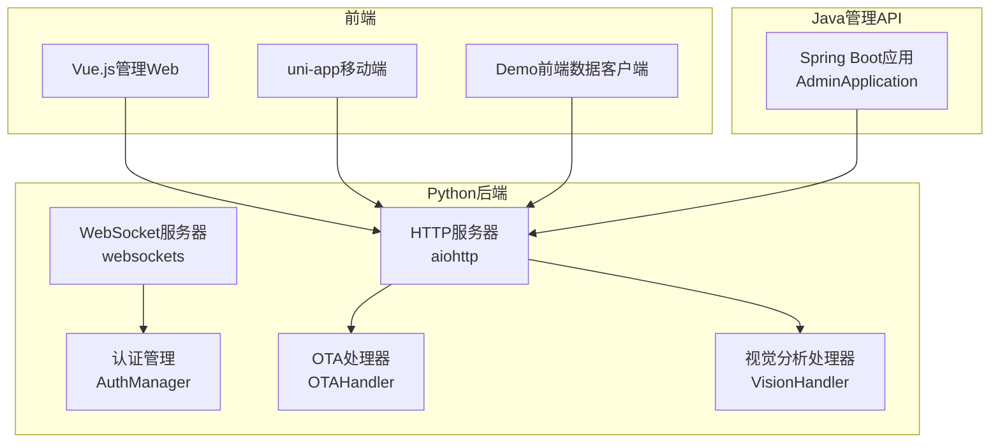
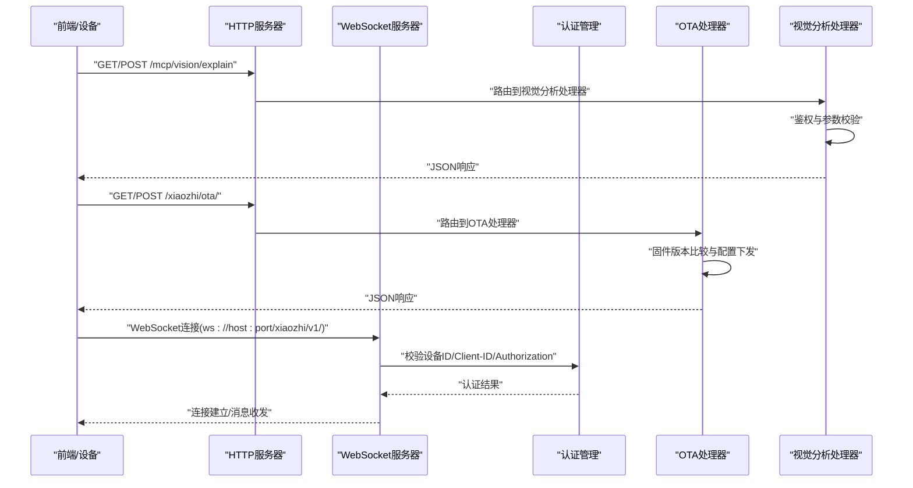
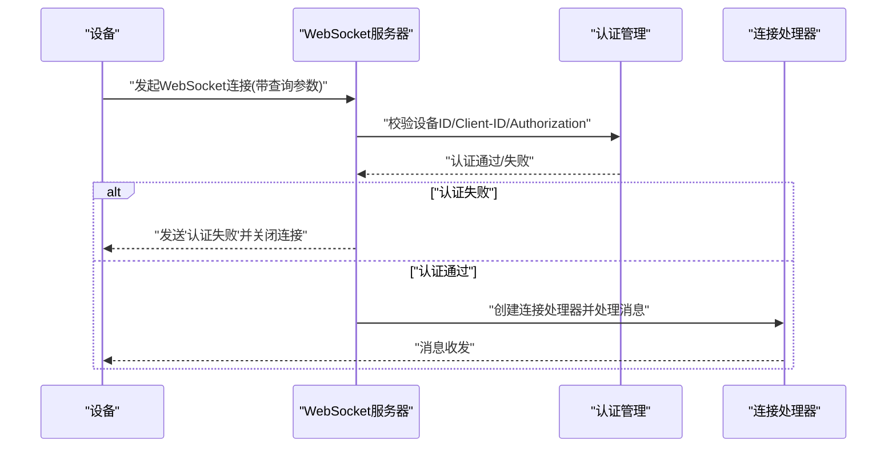
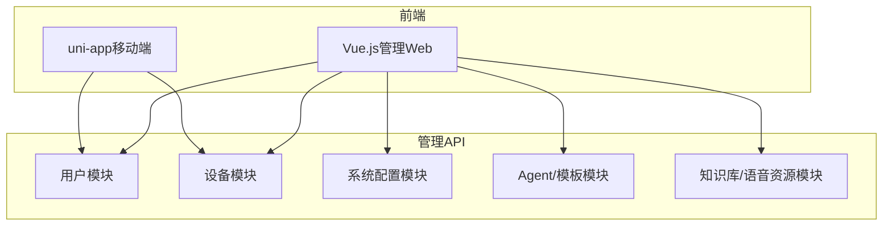
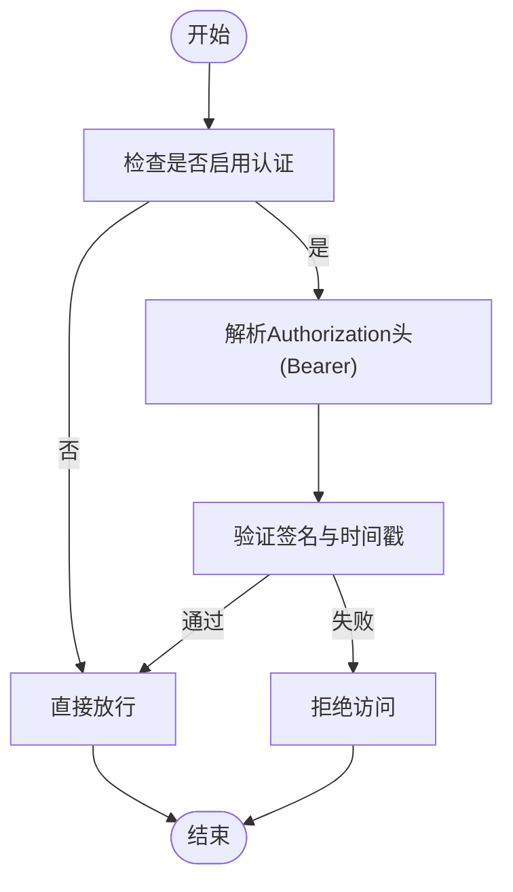
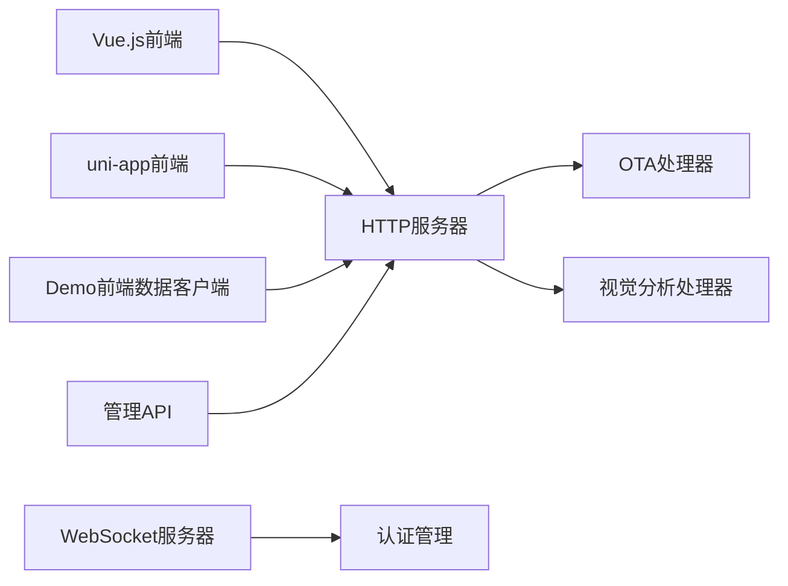

# API接口文档

<cite>
**本文档引用的文件**
- [app.py](file://main/xiaozhi-server/app.py)
- [http_server.py](file://main/xiaozhi-server/core/http_server.py)
- [websocket_server.py](file://main/xiaozhi-server/core/websocket_server.py)
- [base_handler.py](file://main/xiaozhi-server/core/api/base_handler.py)
- [ota_handler.py](file://main/xiaozhi-server/core/api/ota_handler.py)
- [vision_handler.py](file://main/xiaozhi-server/core/api/vision_handler.py)
- [auth.py](file://main/xiaozhi-server/core/auth.py)
- [settings.py](file://main/xiaozhi-server/config/settings.py)
- [mcpMessageHandler.py](file://main/xiaozhi-server/core/handle/textHandler/mcpMessageHandler.py)
- [AdminApplication.java](file://main/manager-api/src/main/java/xiaozhi/AdminApplication.java)
- [api.js](file://main/manager-web/src/apis/api.js)
- [auth.ts](file://main/manager-mobile/src/api/auth.ts)
- [device.ts](file://main/manager-mobile/src/api/device/device.ts)
- [data-client.js](file://main/demo-web/js/api/data-client.js)
</cite>

## 目录
1. [简介](#简介)
2. [项目结构](#项目结构)
3. [核心组件](#核心组件)
4. [架构总览](#架构总览)
5. [详细组件分析](#详细组件分析)
6. [依赖分析](#依赖分析)
7. [性能考虑](#性能考虑)
8. [故障排除指南](#故障排除指南)
9. [结论](#结论)
10. [附录](#附录)

## 简介
本文件为小智ESP32服务器的API接口文档，覆盖以下方面：
- RESTful API设计规范：HTTP方法、URL路径、状态码与CORS策略
- WebSocket API接口：连接建立、认证方式、消息格式与事件类型
- 管理API接口：设备管理、用户管理、系统配置等REST接口
- 前端API接口：Vue.js与uni-app的调用规范
- MCP协议API：命令格式、参数规范与响应处理
- 认证与授权：JWT令牌使用、权限验证与安全策略
- API版本管理：版本控制策略、向后兼容性与迁移指南
- API测试方法：接口测试工具、自动化测试与性能测试

## 项目结构
小智ESP32服务器采用多语言混合架构：
- Python后端：基于aiohttp与websockets，提供HTTP与WebSocket服务
- Java管理API：Spring Boot应用，提供管理端REST接口
- 前端：Vue.js管理Web与uni-app移动端
- Demo前端：演示页面与数据客户端

**图表来源**
- [http_server.py:35-93](file://main/xiaozhi-server/core/http_server.py#L35-L93)
- [websocket_server.py:71-79](file://main/xiaozhi-server/core/websocket_server.py#L71-L79)
- [auth.py:13-73](file://main/xiaozhi-server/core/auth.py#L13-L73)
- [ota_handler.py:46-416](file://main/xiaozhi-server/core/api/ota_handler.py#L46-L416)
- [vision_handler.py:20-183](file://main/xiaozhi-server/core/api/vision_handler.py#L20-L183)
- [AdminApplication.java:1-13](file://main/manager-api/src/main/java/xiaozhi/AdminApplication.java#L1-L13)

**章节来源**
- [app.py:46-160](file://main/xiaozhi-server/app.py#L46-L160)
- [http_server.py:35-93](file://main/xiaozhi-server/core/http_server.py#L35-L93)
- [websocket_server.py:71-79](file://main/xiaozhi-server/core/websocket_server.py#L71-L79)

## 核心组件
- HTTP服务器：负责OTA与视觉分析接口的HTTP路由与CORS处理
- WebSocket服务器：负责设备连接、认证与消息分发
- 认证管理：基于HMAC-SHA256的JWT式令牌生成与验证
- OTA处理器：设备固件升级、MQTT/WebSocket配置下发
- 视觉分析处理器：MCP视觉分析接口，支持图片上传与鉴权
- 管理API：Spring Boot应用，提供设备、用户、系统配置等管理接口
- 前端API：Vue.js与uni-app通过HTTP请求调用后端接口

**章节来源**
- [http_server.py:10-93](file://main/xiaozhi-server/core/http_server.py#L10-L93)
- [websocket_server.py:42-79](file://main/xiaozhi-server/core/websocket_server.py#L42-L79)
- [auth.py:13-73](file://main/xiaozhi-server/core/auth.py#L13-L73)
- [ota_handler.py:46-416](file://main/xiaozhi-server/core/api/ota_handler.py#L46-L416)
- [vision_handler.py:20-183](file://main/xiaozhi-server/core/api/vision_handler.py#L20-L183)
- [AdminApplication.java:1-13](file://main/manager-api/src/main/java/xiaozhi/AdminApplication.java#L1-L13)

## 架构总览
后端通过HTTP与WebSocket双通道提供服务，前端通过HTTP调用REST接口，设备通过WebSocket连接并携带认证信息。

**图表来源**
- [http_server.py:66-76](file://main/xiaozhi-server/core/http_server.py#L66-L76)
- [websocket_server.py:206-228](file://main/xiaozhi-server/core/websocket_server.py#L206-L228)
- [vision_handler.py:47-159](file://main/xiaozhi-server/core/api/vision_handler.py#L47-L159)
- [ota_handler.py:143-353](file://main/xiaozhi-server/core/api/ota_handler.py#L143-L353)

## 详细组件分析

### RESTful API设计规范
- HTTP方法
  - GET：用于健康检查与信息查询
  - POST：用于数据提交与操作触发
  - OPTIONS：预检请求，返回CORS与允许方法
- URL路径规范
  - 视觉分析：/mcp/vision/explain
  - OTA接口：/xiaozhi/ota/ 与 /xiaozhi/ota/download/{filename}
- 状态码标准
  - 200：成功
  - 400：请求参数错误或文件名非法
  - 401：认证失败
  - 403：禁止访问（路径越权）
  - 404：文件不存在
  - 500：服务器内部错误
- CORS策略
  - 允许任意源访问，支持凭据
  - 支持的头部：client-id, content-type, device-id, authorization
  - 支持的方法：GET, POST, OPTIONS

**章节来源**
- [http_server.py:66-76](file://main/xiaozhi-server/core/http_server.py#L66-L76)
- [base_handler.py:10-25](file://main/xiaozhi-server/core/api/base_handler.py#L10-L25)
- [vision_handler.py:161-182](file://main/xiaozhi-server/core/api/vision_handler.py#L161-L182)
- [ota_handler.py:372-416](file://main/xiaozhi-server/core/api/ota_handler.py#L372-L416)

### WebSocket API接口
- 连接建立
  - 地址：ws://host:port/xiaozhi/v1/
  - 查询参数：device-id、client-id、authorization（Bearer）
  - 非升级HTTP请求返回“Server is running”
- 认证机制
  - 若启用白名单且设备在白名单内，跳过token校验
  - 否则校验Authorization头中的Bearer token
  - token由AuthManager生成，包含签名与时间戳
- 消息格式与事件类型
  - 文本消息：遵循MCP消息格式，payload字段承载具体命令
  - 事件类型：通过消息类型枚举区分不同处理逻辑

**图表来源**
- [websocket_server.py:81-145](file://main/xiaozhi-server/core/websocket_server.py#L81-L145)
- [websocket_server.py:206-228](file://main/xiaozhi-server/core/websocket_server.py#L206-L228)
- [auth.py:36-73](file://main/xiaozhi-server/core/auth.py#L36-L73)
- [mcpMessageHandler.py:18-22](file://main/xiaozhi-server/core/handle/textHandler/mcpMessageHandler.py#L18-L22)

**章节来源**
- [websocket_server.py:71-79](file://main/xiaozhi-server/core/websocket_server.py#L71-L79)
- [websocket_server.py:81-145](file://main/xiaozhi-server/core/websocket_server.py#L81-L145)
- [websocket_server.py:206-228](file://main/xiaozhi-server/core/websocket_server.py#L206-L228)
- [mcpMessageHandler.py:11-22](file://main/xiaozhi-server/core/handle/textHandler/mcpMessageHandler.py#L11-L22)

### 管理API接口（设备管理、用户管理、系统配置）
- Spring Boot应用入口
  - 应用启动后输出Swagger文档地址，便于查看REST接口定义
- 前端调用
  - Vue.js管理Web通过统一API模块聚合各业务模块接口
  - uni-app移动端通过Alova封装HTTP请求，提供登录、设备绑定、固件升级等功能

**图表来源**
- [AdminApplication.java:1-13](file://main/manager-api/src/main/java/xiaozhi/AdminApplication.java#L1-L13)
- [api.js:17-48](file://main/manager-web/src/apis/api.js#L17-L48)
- [auth.ts:36-144](file://main/manager-mobile/src/api/auth.ts#L36-L144)
- [device.ts:15-72](file://main/manager-mobile/src/api/device/device.ts#L15-L72)

**章节来源**
- [AdminApplication.java:1-13](file://main/manager-api/src/main/java/xiaozhi/AdminApplication.java#L1-L13)
- [api.js:17-48](file://main/manager-web/src/apis/api.js#L17-L48)
- [auth.ts:36-144](file://main/manager-mobile/src/api/auth.ts#L36-L144)
- [device.ts:15-72](file://main/manager-mobile/src/api/device/device.ts#L15-L72)

### 前端API接口文档（Vue.js与uni-app）
- Vue.js管理Web
  - 统一API入口，按模块导出接口方法
  - 通过环境变量动态切换开发/生产环境的API基础地址
- uni-app移动端
  - 使用Alova进行HTTP请求封装
  - 提供登录、注册、验证码、设备绑定、固件升级等接口
  - 支持缓存策略与全局toast提示

**章节来源**
- [api.js:17-48](file://main/manager-web/src/apis/api.js#L17-L48)
- [auth.ts:36-144](file://main/manager-mobile/src/api/auth.ts#L36-L144)
- [device.ts:15-72](file://main/manager-mobile/src/api/device/device.ts#L15-L72)

### MCP协议API
- 命令格式
  - 文本消息类型：MCP消息，payload字段承载具体命令
  - 处理流程：消息进入后交由MCP消息处理器异步处理
- 参数规范
  - 设备侧通过WebSocket发送MCP消息
  - payload包含命令与参数，后端按类型分发至对应工具或服务
- 响应处理
  - 后端根据命令生成响应，通过WebSocket回传

**章节来源**
- [mcpMessageHandler.py:18-22](file://main/xiaozhi-server/core/handle/textHandler/mcpMessageHandler.py#L18-L22)

### 认证与授权机制
- JWT令牌使用
  - 令牌结构：签名.时间戳（HMAC-SHA256签名，Base64 URL安全编码）
  - 有效期：可配置，默认约30天
- 权限验证
  - WebSocket：Authorization头（Bearer），或白名单直通
  - HTTP：Authorization头（Bearer），用于视觉分析接口鉴权
- 安全策略
  - CORS允许任意源，但需正确设置允许头部
  - OTA接口在未配置MQTT网关时下发WebSocket与令牌
  - 固件下载严格限制在data/bin目录下，防止路径穿越

**图表来源**
- [auth.py:52-73](file://main/xiaozhi-server/core/auth.py#L52-L73)
- [websocket_server.py:206-228](file://main/xiaozhi-server/core/websocket_server.py#L206-L228)
- [vision_handler.py:30-46](file://main/xiaozhi-server/core/api/vision_handler.py#L30-L46)

**章节来源**
- [auth.py:13-73](file://main/xiaozhi-server/core/auth.py#L13-L73)
- [websocket_server.py:206-228](file://main/xiaozhi-server/core/websocket_server.py#L206-L228)
- [vision_handler.py:30-46](file://main/xiaozhi-server/core/api/vision_handler.py#L30-L46)

### API版本管理
- 版本控制策略
  - 当前代码未体现显式的API版本号
  - 建议在URL中加入版本前缀（如/xiaozhi/v1/），并在未来演进中保持向后兼容
- 向后兼容性
  - 新增字段以扩展能力，避免破坏既有字段语义
  - 对于不兼容变更，提供迁移指南与过渡期
- 迁移指南
  - 逐步替换旧字段与接口，提供并行支持窗口
  - 记录变更日志，明确废弃时间表

[本节为通用指导，无需特定文件引用]

### API测试方法
- 接口测试工具
  - Swagger：管理API应用启动后可通过内置文档查看与测试接口
  - Postman：导入REST接口集合，批量验证GET/POST/OPTIONS
- 自动化测试
  - 建议为关键接口编写单元测试与集成测试
  - 覆盖认证、CORS、OTA固件下载、视觉分析等场景
- 性能测试
  - 使用压力测试工具对HTTP与WebSocket接口进行并发与吞吐测试
  - 关注认证开销、消息分发延迟与资源占用

**章节来源**
- [AdminApplication.java:10-12](file://main/manager-api/src/main/java/xiaozhi/AdminApplication.java#L10-L12)

## 依赖分析
- 组件耦合
  - HTTP服务器依赖OTA与视觉分析处理器
  - WebSocket服务器依赖认证管理与连接处理器
  - 前端通过HTTP与WebSocket与后端交互
- 外部依赖
  - aiohttp/websockets：HTTP与WebSocket服务
  - Spring Boot：管理API后端
  - Alova/Vue：前端请求封装

**图表来源**
- [http_server.py:10-16](file://main/xiaozhi-server/core/http_server.py#L10-L16)
- [websocket_server.py:42-70](file://main/xiaozhi-server/core/websocket_server.py#L42-L70)
- [AdminApplication.java:1-13](file://main/manager-api/src/main/java/xiaozhi/AdminApplication.java#L1-L13)

**章节来源**
- [http_server.py:10-16](file://main/xiaozhi-server/core/http_server.py#L10-L16)
- [websocket_server.py:42-70](file://main/xiaozhi-server/core/websocket_server.py#L42-L70)
- [AdminApplication.java:1-13](file://main/manager-api/src/main/java/xiaozhi/AdminApplication.java#L1-L13)

## 性能考虑
- 连接池与并发
  - 合理配置HTTP与WebSocket并发数，避免资源争用
- 缓存策略
  - 固件版本缓存减少磁盘扫描开销
  - 前端请求缓存策略降低重复请求
- 日志与监控
  - 过滤无效握手日志，减少噪声
  - 记录关键指标（响应时间、错误率、连接数）

[本节为通用指导，无需特定文件引用]

## 故障排除指南
- 配置文件检查
  - 确认data/.config.yaml存在且配置合法
  - 若启用从API读取配置，避免本地与远程配置混用
- 认证失败
  - 检查Authorization头格式与签名
  - 确认设备ID与Client-ID匹配
- 固件下载失败
  - 检查文件名是否符合规则，确保路径未越权
  - 确认data/bin目录存在且可读

**章节来源**
- [settings.py:9-34](file://main/xiaozhi-server/config/settings.py#L9-L34)
- [websocket_server.py:206-228](file://main/xiaozhi-server/core/websocket_server.py#L206-L228)
- [ota_handler.py:372-416](file://main/xiaozhi-server/core/api/ota_handler.py#L372-L416)

## 结论
本文档梳理了小智ESP32服务器的REST与WebSocket API、管理API、前端调用规范、MCP协议与认证授权机制，并提供了版本管理与测试建议。建议在后续迭代中引入显式API版本控制与更完善的错误码体系，持续优化性能与可观测性。

## 附录
- 配置文件位置与读取策略
  - data/.config.yaml为默认配置文件，支持从API读取配置
- 管理API文档地址
  - 应用启动后输出Swagger文档地址，便于在线调试

**章节来源**
- [settings.py:9-34](file://main/xiaozhi-server/config/settings.py#L9-L34)
- [AdminApplication.java:10-12](file://main/manager-api/src/main/java/xiaozhi/AdminApplication.java#L10-L12)