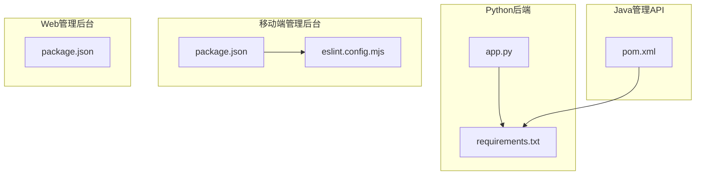
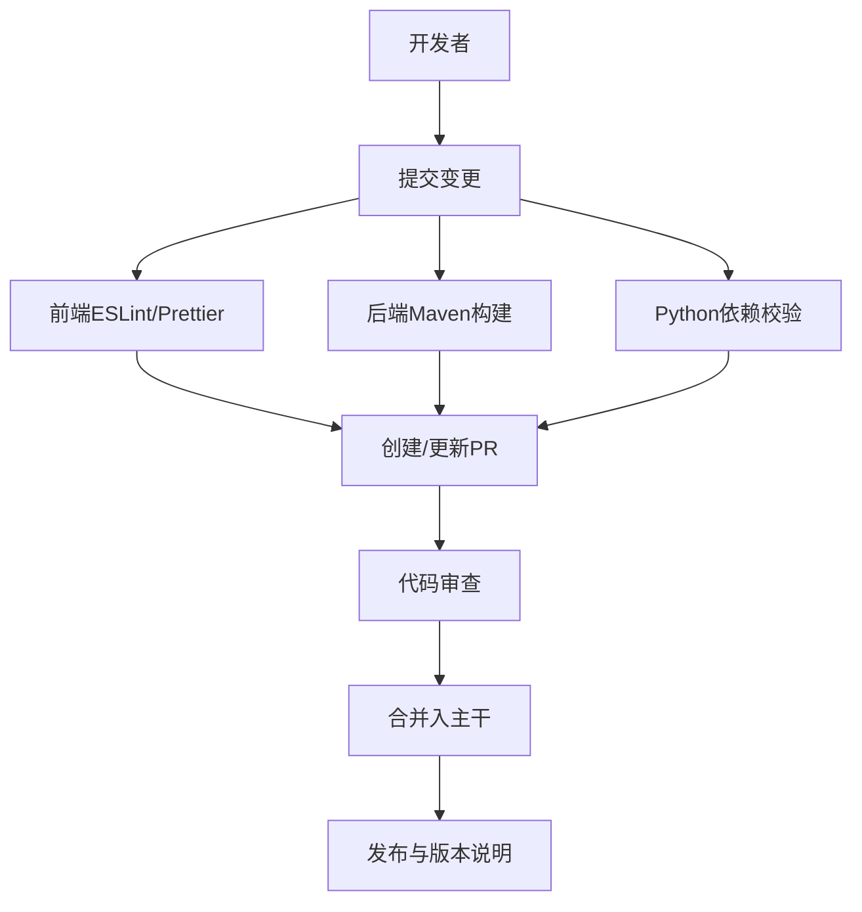
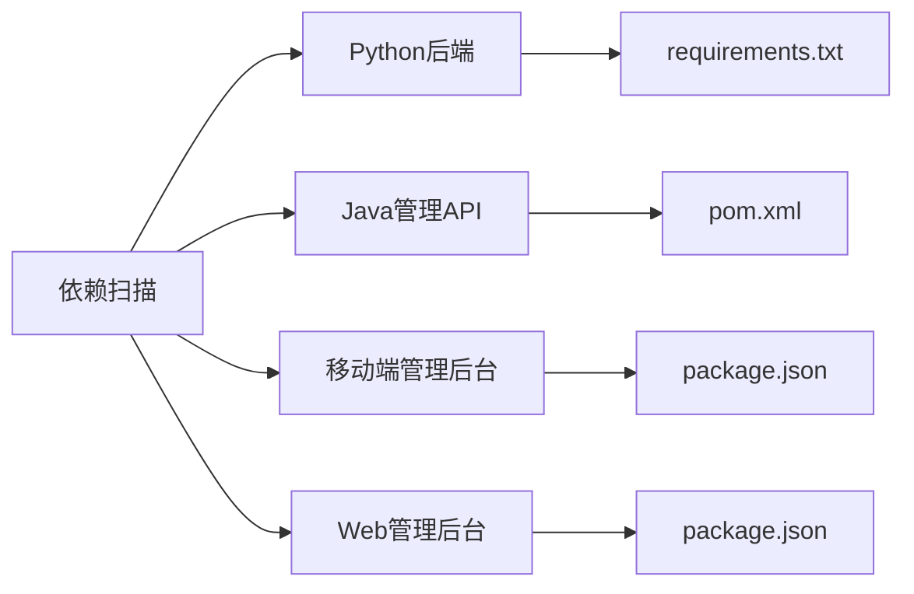

# 代码贡献规范

<cite>
**本文引用的文件**
- [README.md](file://README.md)
- [.github/dependabot.yml](file://.github/dependabot.yml)
- [main/manager-api/pom.xml](file://main/manager-api/pom.xml)
- [main/manager-mobile/package.json](file://main/manager-mobile/package.json)
- [main/manager-mobile/eslint.config.mjs](file://main/manager-mobile/eslint.config.mjs)
- [main/manager-web/package.json](file://main/manager-web/package.json)
- [main/xiaozhi-server/requirements.txt](file://main/xiaozhi-server/requirements.txt)
- [main/xiaozhi-server/app.py](file://main/xiaozhi-server/app.py)
</cite>

## 目录
1. [引言](#引言)
2. [项目结构](#项目结构)
3. [核心组件](#核心组件)
4. [架构总览](#架构总览)
5. [详细组件分析](#详细组件分析)
6. [依赖分析](#依赖分析)
7. [性能考虑](#性能考虑)
8. [故障排查指南](#故障排查指南)
9. [结论](#结论)
10. [附录](#附录)

## 引言
本规范面向“小智ESP32服务器”项目贡献者，旨在统一开发流程、代码风格、注释规范、代码审查、测试与安全实践以及版本管理策略，确保多语言（Python、Java、JavaScript/TypeScript）混合工程在协作过程中的质量与一致性。

## 项目结构
本项目采用多模块组织方式：
- Python后端服务：位于 main/xiaozhi-server，提供HTTP/WebSocket服务、ASR/TTS/LLM/VLLM/记忆/工具调用等核心能力。
- Java管理API：位于 main/manager-api，基于Spring Boot，提供管理后台接口与鉴权、数据库迁移等能力。
- 移动端管理后台：位于 main/manager-mobile，基于UniApp/Vue3，覆盖多端构建与运行。
- Web管理后台：位于 main/manager-web，基于Vue2，提供传统Web端管理界面。
- 文档与部署：docs目录下包含部署、集成、架构等文档。

图表来源
- [main/xiaozhi-server/app.py:1-160](file://main/xiaozhi-server/app.py#L1-L160)
- [main/xiaozhi-server/requirements.txt:1-43](file://main/xiaozhi-server/requirements.txt#L1-L43)
- [main/manager-api/pom.xml:1-291](file://main/manager-api/pom.xml#L1-L291)
- [main/manager-mobile/package.json:1-163](file://main/manager-mobile/package.json#L1-L163)
- [main/manager-mobile/eslint.config.mjs:1-44](file://main/manager-mobile/eslint.config.mjs#L1-L44)
- [main/manager-web/package.json:1-51](file://main/manager-web/package.json#L1-L51)

章节来源
- [README.md:1-378](file://README.md#L1-L378)

## 核心组件
- Python后端入口与生命周期管理：负责配置加载、服务启动、信号处理、资源清理与日志输出。
- Java管理API：基于Spring Boot与MyBatis-Plus，集成Shiro鉴权、Redis、Liquibase迁移、MySQL驱动等。
- 移动端管理后台：基于UniApp生态，脚本覆盖多端开发与构建，ESLint规则集中配置。
- Web管理后台：基于Vue CLI，提供传统Web端管理界面。
- 依赖管理：Python使用requirements.txt；Java使用Maven；前端使用pnpm/npm/yarn。

章节来源
- [main/xiaozhi-server/app.py:1-160](file://main/xiaozhi-server/app.py#L1-L160)
- [main/manager-api/pom.xml:1-291](file://main/manager-api/pom.xml#L1-L291)
- [main/manager-mobile/package.json:1-163](file://main/manager-mobile/package.json#L1-L163)
- [main/manager-web/package.json:1-51](file://main/manager-web/package.json#L1-L51)
- [main/xiaozhi-server/requirements.txt:1-43](file://main/xiaozhi-server/requirements.txt#L1-L43)

## 架构总览
下图展示贡献流程与关键检查点：提交前由ESLint/Prettier与依赖扫描保障前端质量；提交后由Maven/Spring Boot与Python依赖校验保障后端质量；最终由文档与发布说明指导版本发布。

## 详细组件分析

### Git工作流程与分支管理
- 分支命名规范
  - 功能分支：feature/模块名/简述
  - 修复分支：fix/模块名/简述
  - 文档分支：docs/模块名/简述
  - 发布分支：release/vX.Y.Z
- 提交信息格式
  - 类型: 模块/文件路径: 一句话描述
  - 示例：feat(manager-api): 添加用户鉴权接口
- Pull Request流程
  - 在创建PR前，确保通过ESLint/Prettier与后端构建检查
  - PR标题与描述需明确变更范围、影响面与测试要点
  - 至少一名维护者审查通过后方可合并

章节来源
- [README.md:1-378](file://README.md#L1-L378)

### 代码风格指南
- Python
  - 以PEP8为主，结合项目现有代码风格；避免尾随空白、行长不超过100字符、合理缩进。
  - 重要：本项目未提供pyproject.toml或flake8配置文件，建议在本地启用IDE PEP8检查并在CI中补充。
- Java
  - 使用Spring Boot约定与Maven管理；遵循阿里巴巴Java开发手册（可在IDE中配置检查规则）。
  - 关键点：包名全部小写、类名使用帕斯卡命名、方法与变量使用驼峰命名、常量全部大写。
- JavaScript/TypeScript（移动端）
  - 使用ESLint配置集中管理，规则已在eslint.config.mjs中声明；忽略生成文件与特定目录。
  - 关键点：禁用console.warn等调试输出；保持导入顺序与类型安全；CSS/HTML格式化开启。

章节来源
- [main/manager-mobile/eslint.config.mjs:1-44](file://main/manager-mobile/eslint.config.mjs#L1-L44)
- [main/manager-mobile/package.json:1-163](file://main/manager-mobile/package.json#L1-L163)
- [main/manager-web/package.json:1-51](file://main/manager-web/package.json#L1-L51)
- [main/manager-api/pom.xml:1-291](file://main/manager-api/pom.xml#L1-L291)

### 注释规范
- Python
  - 函数/类使用三引号文档字符串，描述用途、参数、返回值与异常。
  - 模块顶部添加作者、日期与简要说明。
- Java
  - 类与公共方法使用标准Javadoc注释，包含@param、@return、@throws等。
- JavaScript/TypeScript
  - 重要逻辑添加注释；组件与API层注释应清晰表达意图与边界条件。
  - 生成文件（如类型声明）不在提交范围内，避免污染历史。

章节来源
- [main/xiaozhi-server/app.py:1-160](file://main/xiaozhi-server/app.py#L1-L160)

### 代码审查流程
- 审查清单
  - 是否满足提交信息格式与分支命名规范
  - 是否通过ESLint/Prettier与后端构建
  - 是否新增或修改了关键依赖，是否同步更新依赖扫描
  - 是否补充/更新了相关测试与文档
  - 是否存在安全风险（硬编码密钥、明文日志等）
- 常见问题与解决
  - 生成文件误提交：将生成目录加入.gitignore或在lint配置中忽略
  - 依赖版本冲突：统一在requirements.txt/pom.xml/package.json中锁定版本
  - CI失败：先在本地复现错误，再提交修复

章节来源
- [main/manager-mobile/eslint.config.mjs:7-19](file://main/manager-mobile/eslint.config.mjs#L7-L19)
- [main/manager-mobile/package.json:159-162](file://main/manager-mobile/package.json#L159-L162)

### 测试要求
- 单元测试
  - Java：JUnit 5已引入，建议在模块内补充单元测试与参数化用例
  - Python：建议引入pytest或unittest，对核心工具函数与处理器进行覆盖
  - 移动端：建议引入vitest/jest，覆盖关键逻辑与API请求封装
- 集成测试
  - 通过端到端脚本验证WebSocket/HTTP服务可用性
  - 对关键链路（ASR→LLM→TTS）进行端到端回归
- 测试用例编写指南
  - 每个功能模块至少包含正向、边界与异常场景
  - 对外部依赖（第三方API）使用Mock或沙盒环境

章节来源
- [main/manager-api/pom.xml:92-131](file://main/manager-api/pom.xml#L92-L131)
- [main/xiaozhi-server/requirements.txt:1-43](file://main/xiaozhi-server/requirements.txt#L1-L43)

### 安全编码规范
- SQL注入防护
  - Java侧使用MyBatis-Plus与参数化查询，避免拼接SQL
- XSS攻击防范
  - 前端对用户输入进行转义与白名单过滤；后端对输出内容进行上下文相关编码
- 敏感信息处理
  - 禁止在代码中硬编码密钥与令牌；使用环境变量或配置中心
  - 日志中避免打印敏感字段；对日志内容进行脱敏
- 依赖安全
  - 依赖扫描：已启用pip weekly扫描；建议同时启用Maven依赖扫描与前端依赖审计

章节来源
- [.github/dependabot.yml:1-6](file://.github/dependabot.yml#L1-L6)
- [main/manager-api/pom.xml:230-241](file://main/manager-api/pom.xml#L230-L241)

### 版本管理策略与发布流程
- 语义化版本控制
  - 主版本：破坏性变更
  - 次版本：向下兼容的功能新增
  - 修订版本：向下兼容的问题修复
- 发布流程
  - 在主干上打标签并生成Release说明
  - 更新依赖扫描与安全策略
  - 同步更新文档与部署指南

章节来源
- [README.md:1-378](file://README.md#L1-L378)

## 依赖分析
- Python后端依赖集中在requirements.txt，建议固定版本并定期扫描安全漏洞
- Java管理API通过Maven集中管理，包含Shiro、Redis、MySQL、Liquibase等
- 前端依赖通过package.json管理，移动端使用pnpm，Web端使用npm/yarn

图表来源
- [main/xiaozhi-server/requirements.txt:1-43](file://main/xiaozhi-server/requirements.txt#L1-L43)
- [main/manager-api/pom.xml:1-291](file://main/manager-api/pom.xml#L1-L291)
- [main/manager-mobile/package.json:1-163](file://main/manager-mobile/package.json#L1-L163)
- [main/manager-web/package.json:1-51](file://main/manager-web/package.json#L1-L51)
- [.github/dependabot.yml:1-6](file://.github/dependabot.yml#L1-L6)

章节来源
- [main/xiaozhi-server/requirements.txt:1-43](file://main/xiaozhi-server/requirements.txt#L1-L43)
- [main/manager-api/pom.xml:1-291](file://main/manager-api/pom.xml#L1-L291)
- [main/manager-mobile/package.json:1-163](file://main/manager-mobile/package.json#L1-L163)
- [main/manager-web/package.json:1-51](file://main/manager-web/package.json#L1-L51)
- [.github/dependabot.yml:1-6](file://.github/dependabot.yml#L1-L6)

## 性能考虑
- Python服务
  - 合理设置异步任务与事件循环，避免阻塞主线程
  - 对外部API调用增加超时与重试策略
- Java服务
  - 合理配置连接池与缓存，避免内存泄漏
- 前端
  - 控制包体积，按需加载与懒编译
  - 对高频UI操作进行节流/防抖

## 故障排查指南
- 启动失败
  - 检查Python依赖是否完整安装
  - 检查Maven依赖是否拉取成功
  - 检查前端依赖安装与Node版本
- WebSocket/HTTP不可达
  - 查看app.py输出的服务地址与端口
  - 确认防火墙与网络策略
- 依赖安全告警
  - 依据dependabot提示升级对应依赖版本

章节来源
- [main/xiaozhi-server/app.py:86-130](file://main/xiaozhi-server/app.py#L86-L130)
- [.github/dependabot.yml:1-6](file://.github/dependabot.yml#L1-L6)

## 结论
本规范为小智ESP32服务器项目提供统一的贡献流程与质量基线。建议在CI中补充Python与Java静态检查、安全扫描与测试覆盖率统计，持续提升项目稳定性与可维护性。

## 附录
- 贡献者须知与致开发者公开信：参见项目根目录README与docs/contributor_open_letter.md
- 依赖安全策略：已启用pip weekly扫描，建议补充Maven与前端依赖审计