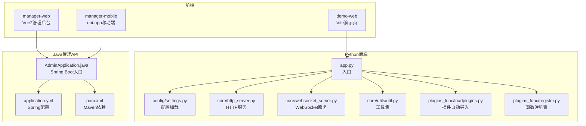
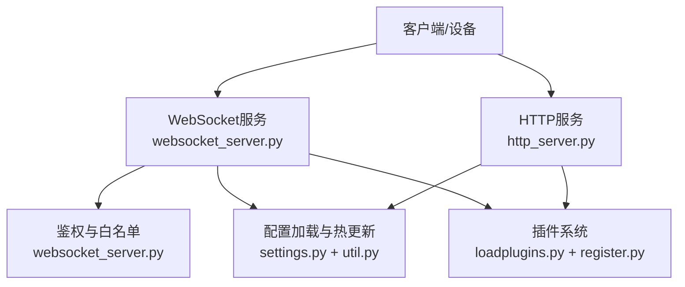
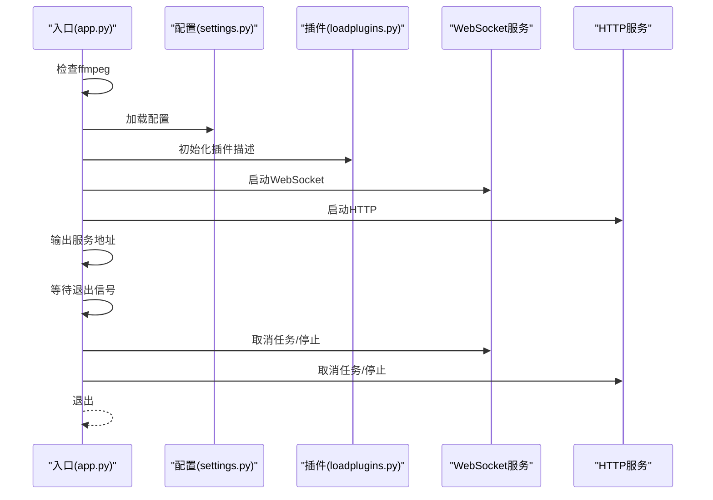
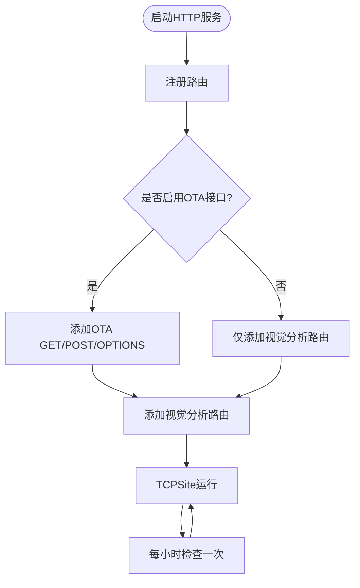
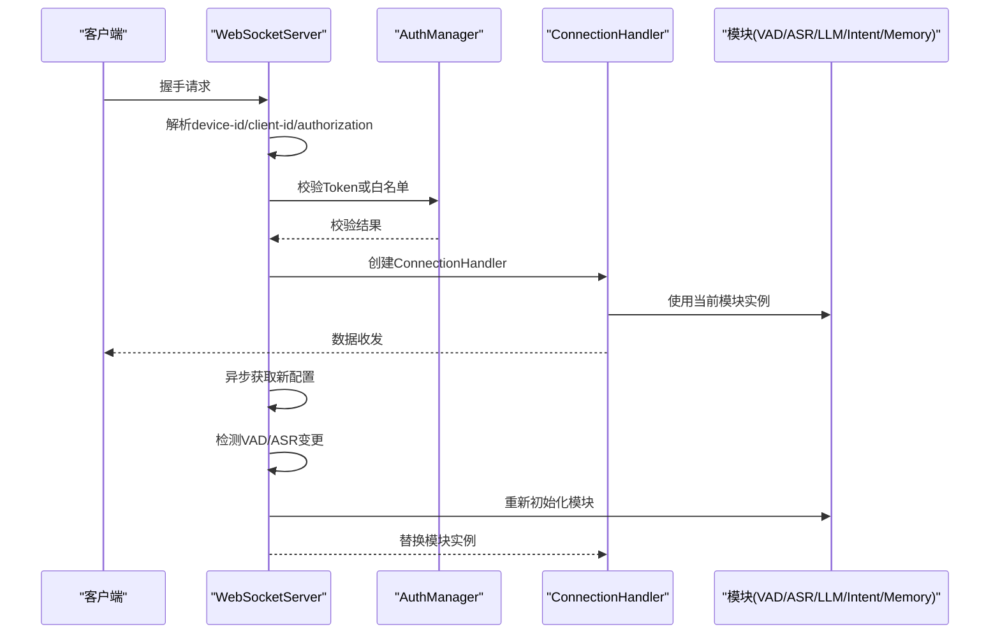
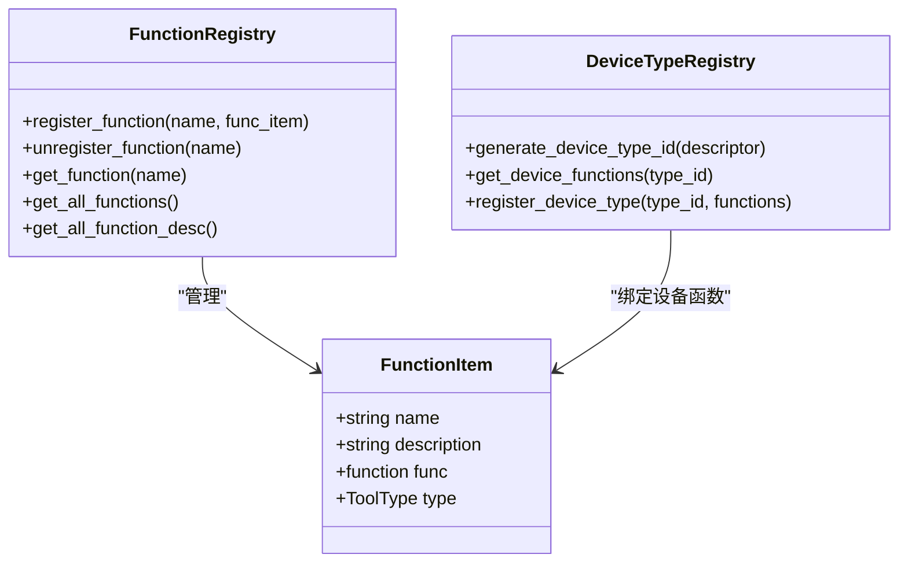
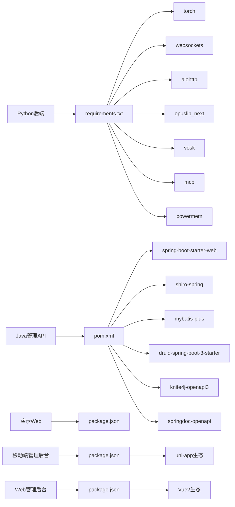

# 开发指南

<cite>
**本文引用的文件**
- [README.md](file://README.md)
- [contributor_open_letter.md](file://docs/contributor_open_letter.md)
- [app.py](file://main/xiaozhi-server/app.py)
- [settings.py](file://main/xiaozhi-server/config/settings.py)
- [http_server.py](file://main/xiaozhi-server/core/http_server.py)
- [websocket_server.py](file://main/xiaozhi-server/core/websocket_server.py)
- [base_handler.py](file://main/xiaozhi-server/core/api/base_handler.py)
- [util.py](file://main/xiaozhi-server/core/utils/util.py)
- [requirements.txt](file://main/xiaozhi-server/requirements.txt)
- [pom.xml](file://main/manager-api/pom.xml)
- [application.yml](file://main/manager-api/src/main/resources/application.yml)
- [AdminApplication.java](file://main/manager-api/src/main/java/xiaozhi/AdminApplication.java)
- [package.json（演示Web）](file://main/demo-web/package.json)
- [package.json（移动端管理后台）](file://main/manager-mobile/package.json)
- [package.json（Web管理后台）](file://main/manager-web/package.json)
- [loadplugins.py](file://main/xiaozhi-server/plugins_func/loadplugins.py)
- [register.py](file://main/xiaozhi-server/plugins_func/register.py)
</cite>

## 目录
1. [简介](#简介)
2. [项目结构](#项目结构)
3. [核心组件](#核心组件)
4. [架构总览](#架构总览)
5. [详细组件分析](#详细组件分析)
6. [依赖分析](#依赖分析)
7. [性能考虑](#性能考虑)
8. [故障排查指南](#故障排查指南)
9. [结论](#结论)
10. [附录](#附录)

## 简介
本指南面向小智ESP32服务器项目的开发者，覆盖开发环境搭建、依赖安装、IDE配置、代码贡献规范、Git工作流、插件开发、API接口文档规范、单元测试与CI配置、调试与性能分析、新功能开发流程与发布策略等。目标是帮助你在本地快速搭建可运行的开发环境，并高质量地参与项目贡献。

## 项目结构
项目采用多模块组织方式：
- Python后端服务：main/xiaozhi-server，提供HTTP/WS服务、插件系统、工具函数注册、配置加载与校验等
- Java管理API：main/manager-api，基于Spring Boot，提供Knife4j/SpringDoc接口文档与管理端能力
- Web前端：main/manager-web，Vue2管理后台
- 移动端管理后台：main/manager-mobile，基于uni-app的多端应用
- 演示Web：main/demo-web，Vite演示页面

图表来源
- [app.py:46-160](file://main/xiaozhi-server/app.py#L46-L160)
- [settings.py:1-34](file://main/xiaozhi-server/config/settings.py#L1-L34)
- [http_server.py:1-93](file://main/xiaozhi-server/core/http_server.py#L1-L93)
- [websocket_server.py:1-228](file://main/xiaozhi-server/core/websocket_server.py#L1-L228)
- [util.py:1-609](file://main/xiaozhi-server/core/utils/util.py#L1-L609)
- [loadplugins.py:1-25](file://main/xiaozhi-server/plugins_func/loadplugins.py#L1-L25)
- [register.py:1-142](file://main/xiaozhi-server/plugins_func/register.py#L1-L142)
- [AdminApplication.java:1-13](file://main/manager-api/src/main/java/xiaozhi/AdminApplication.java#L1-L13)
- [application.yml:1-66](file://main/manager-api/src/main/resources/application.yml#L1-L66)
- [pom.xml:1-291](file://main/manager-api/pom.xml#L1-L291)

章节来源
- [README.md:178-260](file://README.md#L178-L260)

## 核心组件
- 应用入口与生命周期：app.py负责启动HTTP/WS服务、全局GC管理、MCP接入点校验、打印服务地址与日志
- 配置系统：settings.py负责配置文件存在性检查、从API读取配置的冲突提示
- HTTP服务：http_server.py提供OTA与视觉分析接口路由
- WebSocket服务：websocket_server.py提供鉴权、连接处理、配置热更新与组件初始化
- 工具集：util.py提供IP获取、ffmpeg检测、音频编解码、缓存键生成、MCP接入点校验等
- 插件系统：loadplugins.py自动导入functions包内模块；register.py提供函数注册表、动作枚举、设备类型注册等

章节来源
- [app.py:46-160](file://main/xiaozhi-server/app.py#L46-L160)
- [settings.py:9-34](file://main/xiaozhi-server/config/settings.py#L9-L34)
- [http_server.py:35-93](file://main/xiaozhi-server/core/http_server.py#L35-L93)
- [websocket_server.py:42-228](file://main/xiaozhi-server/core/websocket_server.py#L42-L228)
- [util.py:157-218](file://main/xiaozhi-server/core/utils/util.py#L157-L218)
- [loadplugins.py:9-25](file://main/xiaozhi-server/plugins_func/loadplugins.py#L9-L25)
- [register.py:83-142](file://main/xiaozhi-server/plugins_func/register.py#L83-L142)

## 架构总览
小智ESP32服务器采用“Python后端 + Java管理API + 多前端”的分层架构。Python后端提供HTTP/WS服务与插件扩展能力；Java管理API提供接口文档与管理端能力；前端通过HTTP/WS与后端交互。

图表来源
- [websocket_server.py:63-70](file://main/xiaozhi-server/core/websocket_server.py#L63-L70)
- [http_server.py:35-76](file://main/xiaozhi-server/core/http_server.py#L35-L76)
- [settings.py:22-33](file://main/xiaozhi-server/config/settings.py#L22-L33)
- [util.py:522-537](file://main/xiaozhi-server/core/utils/util.py#L522-L537)
- [loadplugins.py:9-25](file://main/xiaozhi-server/plugins_func/loadplugins.py#L9-L25)
- [register.py:83-142](file://main/xiaozhi-server/plugins_func/register.py#L83-L142)

## 详细组件分析

### 组件A：应用入口与生命周期（app.py）
- 负责：
  - 检查ffmpeg安装
  - 加载配置并初始化插件描述
  - 生成/校验JWT密钥
  - 启动WebSocket与HTTP服务
  - 输出服务地址与使用提示
  - 清理资源与优雅退出
- 关键流程：启动任务 → 等待退出信号 → 取消任务 → 等待终止 → 退出

图表来源
- [app.py:46-160](file://main/xiaozhi-server/app.py#L46-L160)
- [settings.py:9-34](file://main/xiaozhi-server/config/settings.py#L9-L34)
- [loadplugins.py:9-25](file://main/xiaozhi-server/plugins_func/loadplugins.py#L9-L25)

章节来源
- [app.py:46-160](file://main/xiaozhi-server/app.py#L46-L160)

### 组件B：HTTP服务（http_server.py）
- 路由：
  - OTA接口：GET/POST /xiaozhi/ota/，支持下载 /xiaozhi/ota/download/{filename}
  - 视觉分析接口：GET/POST /mcp/vision/explain
- CORS处理：统一在BaseHandler中添加CORS头
- 错误处理：捕获异常并记录堆栈

图表来源
- [http_server.py:35-93](file://main/xiaozhi-server/core/http_server.py#L35-L93)
- [base_handler.py:5-25](file://main/xiaozhi-server/core/api/base_handler.py#L5-L25)

章节来源
- [http_server.py:35-93](file://main/xiaozhi-server/core/http_server.py#L35-L93)
- [base_handler.py:5-25](file://main/xiaozhi-server/core/api/base_handler.py#L5-L25)

### 组件C：WebSocket服务（websocket_server.py）
- 鉴权：
  - 支持白名单直通与JWT校验
  - 从Header或URL参数解析device-id/client-id/authorization
- 配置热更新：
  - 异步获取新配置
  - 检测VAD/ASR类型变化
  - 重新初始化模块并替换实例
- 连接处理：
  - 每个连接创建独立ConnectionHandler
  - 异常时记录并强制关闭连接

图表来源
- [websocket_server.py:63-205](file://main/xiaozhi-server/core/websocket_server.py#L63-L205)

章节来源
- [websocket_server.py:63-205](file://main/xiaozhi-server/core/websocket_server.py#L63-L205)

### 组件D：插件系统（plugins_func）
- 自动导入：遍历functions包内模块并导入
- 函数注册：提供装饰器与注册表，支持设备类型注册与函数描述收集
- 动作枚举：定义工具调用后的动作类型（直接回复、调用LLM、记录历史等）

图表来源
- [register.py:104-142](file://main/xiaozhi-server/plugins_func/register.py#L104-L142)

章节来源
- [loadplugins.py:9-25](file://main/xiaozhi-server/plugins_func/loadplugins.py#L9-L25)
- [register.py:83-142](file://main/xiaozhi-server/plugins_func/register.py#L83-L142)

### 组件E：工具集（util.py）
- ffmpeg检测：提供详细错误提示与解决步骤
- 音频编解码：支持OPUS/PCM帧级编码与解码
- 配置校验：过滤敏感信息、校验MCP接入点格式、生成本地IP与Vision URL
- 缓存键生成：为音频与IP信息生成缓存键

章节来源
- [util.py:157-218](file://main/xiaozhi-server/core/utils/util.py#L157-L218)
- [util.py:229-324](file://main/xiaozhi-server/core/utils/util.py#L229-L324)
- [util.py:391-423](file://main/xiaozhi-server/core/utils/util.py#L391-L423)
- [util.py:477-519](file://main/xiaozhi-server/core/utils/util.py#L477-L519)
- [util.py:576-599](file://main/xiaozhi-server/core/utils/util.py#L576-L599)

## 依赖分析
- Python后端依赖：requirements.txt列出torch、websockets、aiohttp、opuslib_next、silero_vad、openai、powermem、vosk、mcp、Jinja2等
- Java管理API依赖：pom.xml使用Spring Boot 3.4.3、Shiro、MyBatis-Plus、Druid、Knife4j、SpringDoc、Guava、JUnit等
- 前端依赖：
  - 演示Web：Vite
  - 移动端管理后台：uni-app生态、ESLint、TypeScript、UnoCSS等
  - Web管理后台：Vue CLI、Element UI、Opus相关库等

图表来源
- [requirements.txt:1-43](file://main/xiaozhi-server/requirements.txt#L1-L43)
- [pom.xml:38-248](file://main/manager-api/pom.xml#L38-L248)
- [package.json（演示Web）:1-15](file://main/demo-web/package.json#L1-L15)
- [package.json（移动端管理后台）:1-163](file://main/manager-mobile/package.json#L1-L163)
- [package.json（Web管理后台）:1-51](file://main/manager-web/package.json#L1-L51)

章节来源
- [requirements.txt:1-43](file://main/xiaozhi-server/requirements.txt#L1-L43)
- [pom.xml:1-291](file://main/manager-api/pom.xml#L1-L291)
- [package.json（演示Web）:1-15](file://main/demo-web/package.json#L1-L15)
- [package.json（移动端管理后台）:1-163](file://main/manager-mobile/package.json#L1-L163)
- [package.json（Web管理后台）:1-51](file://main/manager-web/package.json#L1-L51)

## 性能考虑
- 音频处理：OPUS帧级编码/解码，支持缓存键生成与线程池执行，降低CPU与内存抖动
- 配置热更新：异步获取新配置，仅在VAD/ASR类型变化时重建模块，避免全量重启
- ffmpeg检测：提供详尽的错误提示与依赖缺失指引，减少环境问题导致的性能退化
- 建议：
  - 在高并发场景下，优先使用流式配置（如讯飞流式ASR、火山流式TTS），以缩短响应延迟
  - 对频繁调用的接口启用缓存（如IP信息、音频数据），合理设置TTL

章节来源
- [util.py:249-324](file://main/xiaozhi-server/core/utils/util.py#L249-L324)
- [util.py:425-474](file://main/xiaozhi-server/core/utils/util.py#L425-L474)
- [util.py:157-218](file://main/xiaozhi-server/core/utils/util.py#L157-L218)

## 故障排查指南
- ffmpeg未安装或依赖缺失
  - 现象：启动时报错，提示ffmpeg不可用
  - 处理：根据util.py提供的错误提示，在conda环境中安装ffmpeg与缺失的依赖库
- WebSocket连接失败
  - 现象：无效握手、连接被关闭
  - 处理：检查请求是否为WS升级请求；确认设备ID、Authorization参数是否正确；查看过滤器日志
- 配置文件问题
  - 现象：找不到data/.config.yaml；从API读取配置时出现冲突
  - 处理：按settings.py提示准备config_from_api.yaml并正确配置接口地址与密钥
- 插件未生效
  - 现象：函数未出现在注册表
  - 处理：确认插件位于functions包内并被自动导入；使用装饰器正确注册

章节来源
- [util.py:157-218](file://main/xiaozhi-server/core/utils/util.py#L157-L218)
- [websocket_server.py:8-30](file://main/xiaozhi-server/core/websocket_server.py#L8-L30)
- [settings.py:9-33](file://main/xiaozhi-server/config/settings.py#L9-L33)
- [loadplugins.py:9-25](file://main/xiaozhi-server/plugins_func/loadplugins.py#L9-L25)

## 结论
本指南从环境搭建、依赖管理、代码贡献、插件开发、API规范、测试与CI、调试与性能、发布策略等方面，为小智ESP32服务器项目提供了系统性的开发指导。建议在开发过程中遵循贡献规范与工作流，充分利用插件系统与工具集，确保系统的稳定性与可扩展性。

## 附录

### 开发环境搭建与IDE配置
- Python后端
  - Python版本：推荐3.12
  - 依赖安装：pip install -r requirements.txt
  - IDE建议：PyCharm/VSCode，启用Python解释器与虚拟环境
- Java管理API
  - JDK版本：21
  - Maven：使用pom.xml管理依赖，IDE中导入Maven项目
  - IDE建议：IntelliJ IDEA，启用Lombok注解处理
- 前端
  - 演示Web：Vite，使用package.json脚本启动
  - 移动端管理后台：uni-app，使用pnpm，按package.json脚本构建
  - Web管理后台：Vue CLI，按package.json脚本启动

章节来源
- [requirements.txt:1-43](file://main/xiaozhi-server/requirements.txt#L1-L43)
- [pom.xml:17-36](file://main/manager-api/pom.xml#L17-L36)
- [package.json（演示Web）:6-10](file://main/demo-web/package.json#L6-L10)
- [package.json（移动端管理后台）:22-25](file://main/manager-mobile/package.json#L22-L25)
- [package.json（Web管理后台）:5-9](file://main/manager-web/package.json#L5-L9)

### 代码贡献规范与Git工作流
- 贡献流程
  - Fork项目 → 新建分支 → 提交PR → 审核合并
  - 成为开发者：累计3次有效PR后可申请加入开发者群
- 分支命名
  - 简洁明确，体现功能点，避免功能重复
- 提交规范
  - 使用清晰的提交信息，必要时附带Issue编号

章节来源
- [contributor_open_letter.md:32-51](file://docs/contributor_open_letter.md#L32-L51)

### 插件开发指南
- 插件位置：plugins_func/functions
- 自动导入：通过loadplugins.py自动导入functions包内模块
- 函数注册：使用装饰器register_function注册；支持设备类型注册
- 动作类型：根据Action枚举决定后续行为（直接回复、调用LLM、记录历史等）

章节来源
- [loadplugins.py:9-25](file://main/xiaozhi-server/plugins_func/loadplugins.py#L9-L25)
- [register.py:83-142](file://main/xiaozhi-server/plugins_func/register.py#L83-L142)

### API接口文档规范
- HTTP接口
  - OTA接口：GET/POST /xiaozhi/ota/，支持下载 /xiaozhi/ota/download/{filename}
  - 视觉分析接口：GET/POST /mcp/vision/explain
  - CORS：统一在BaseHandler中添加CORS头
- WebSocket接口
  - 地址：ws://{host}:{port}/xiaozhi/v1/
  - 鉴权：支持白名单直通与JWT校验；参数来自Header或URL参数
- 接口文档
  - Java管理API：Knife4j/SpringDoc自动生成接口文档

章节来源
- [http_server.py:35-76](file://main/xiaozhi-server/core/http_server.py#L35-L76)
- [base_handler.py:5-25](file://main/xiaozhi-server/core/api/base_handler.py#L5-L25)
- [websocket_server.py:63-70](file://main/xiaozhi-server/core/websocket_server.py#L63-L70)
- [AdminApplication.java:10-12](file://main/manager-api/src/main/java/xiaozhi/AdminApplication.java#L10-L12)
- [application.yml:30-37](file://main/manager-api/src/main/resources/application.yml#L30-L37)

### 单元测试与持续集成
- Python后端
  - 依赖：pytest、aiohttp、aiohttp_cors、loguru等
  - 建议：为核心模块（工具集、插件注册、HTTP处理器）编写单元测试
- Java管理API
  - 依赖：JUnit Jupiter、Spring Boot Test
  - 建议：为控制器与服务层编写单元测试与集成测试
- 前端
  - 演示Web：Vite + ES模块化测试
  - 移动端管理后台：uni-app + ESLint + TypeScript类型检查
  - Web管理后台：Vue CLI + Vue Test Utils

章节来源
- [requirements.txt:1-43](file://main/xiaozhi-server/requirements.txt#L1-L43)
- [pom.xml:92-131](file://main/manager-api/pom.xml#L92-L131)
- [package.json（演示Web）:6-10](file://main/demo-web/package.json#L6-L10)
- [package.json（移动端管理后台）:108-163](file://main/manager-mobile/package.json#L108-L163)
- [package.json（Web管理后台）:27-39](file://main/manager-web/package.json#L27-L39)

### 调试技巧与性能分析
- 调试
  - Python：利用loguru输出日志；WebSocket过滤无效握手日志
  - Java：Spring Boot日志与Knife4j接口文档辅助定位问题
- 性能分析
  - 音频处理：OPUS帧级编解码与缓存键生成
  - 配置热更新：异步获取与按需重建模块
  - ffmpeg检测：提供详尽错误提示与依赖指引

章节来源
- [util.py:157-218](file://main/xiaozhi-server/core/utils/util.py#L157-L218)
- [websocket_server.py:8-30](file://main/xiaozhi-server/core/websocket_server.py#L8-L30)

### 新功能开发流程与发布策略
- 新功能开发流程
  - 设计插件或模块 → 实现核心逻辑 → 编写单元测试 → 文档与接口规范 → 提交PR
- 向后兼容性
  - 配置热更新：仅在VAD/ASR类型变化时重建模块
  - 接口：保持现有路由不变，新增接口时遵循版本化策略
- 发布策略
  - 使用版本标签与变更日志，遵循语义化版本管理

章节来源
- [websocket_server.py:155-205](file://main/xiaozhi-server/core/websocket_server.py#L155-L205)
- [http_server.py:35-76](file://main/xiaozhi-server/core/http_server.py#L35-L76)