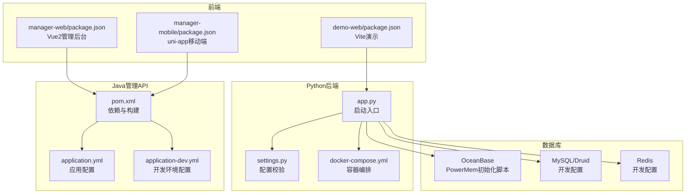
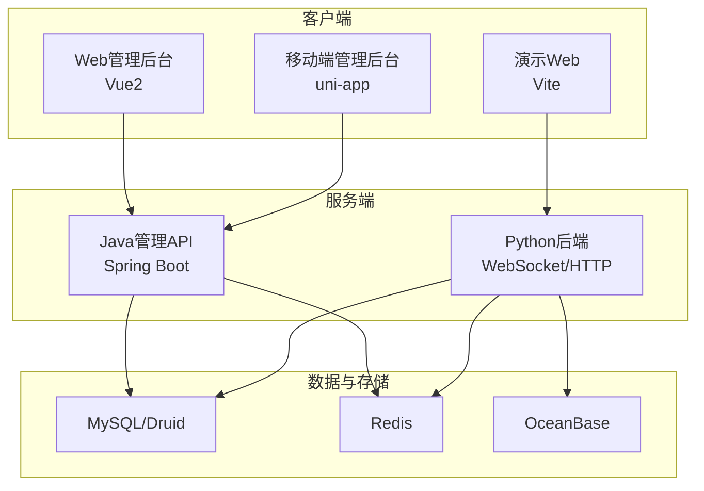
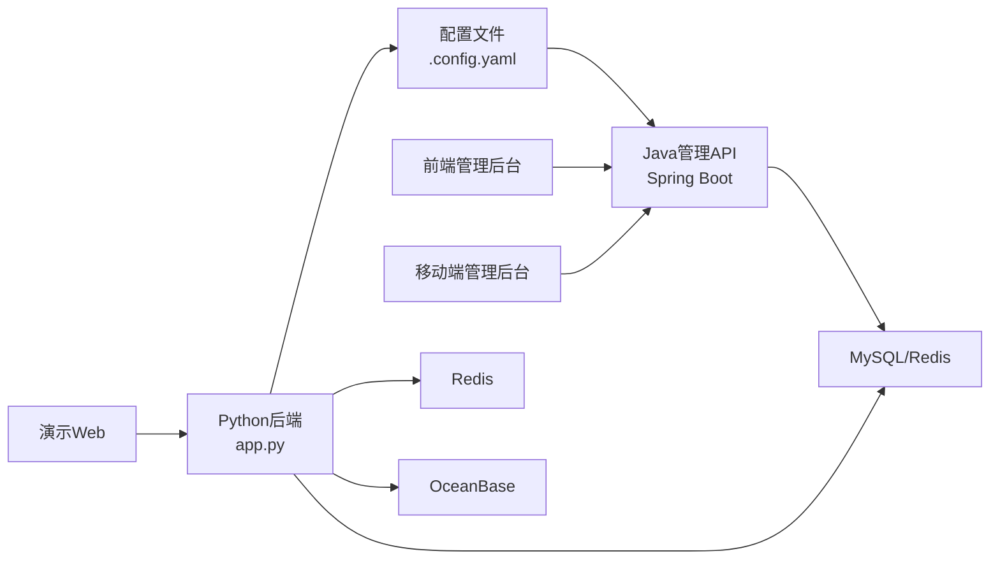

# 开发环境搭建

<cite>
**本文引用的文件**
- [requirements.txt](file://main/xiaozhi-server/requirements.txt)
- [pom.xml](file://main/manager-api/pom.xml)
- [application.yml](file://main/manager-api/src/main/resources/application.yml)
- [application-dev.yml](file://main/manager-api/src/main/resources/application-dev.yml)
- [package.json（演示Web）](file://main/demo-web/package.json)
- [package.json（移动端管理后台）](file://main/manager-mobile/package.json)
- [package.json（Web管理后台）](file://main/manager-web/package.json)
- [docker-compose.yml（服务器）](file://main/xiaozhi-server/docker-compose.yml)
- [settings.py](file://main/xiaozhi-server/config/settings.py)
- [app.py](file://main/xiaozhi-server/app.py)
- [docker-setup.sh](file://docker-setup.sh)
- [init-powermem.sh](file://main/xiaozhi-server/oceanbase/init-powermem.sh)
- [config_from_api.yaml](file://main/xiaozhi-server/config_from_api.yaml)
- [Deployment.md](file://docs/Deployment.md)
</cite>

## 目录
1. [简介](#简介)
2. [项目结构](#项目结构)
3. [核心组件](#核心组件)
4. [架构总览](#架构总览)
5. [详细组件分析](#详细组件分析)
6. [依赖关系分析](#依赖关系分析)
7. [性能注意事项](#性能注意事项)
8. [故障排查指南](#故障排查指南)
9. [结论](#结论)
10. [附录](#附录)

## 简介
本指南面向小智ESP32服务器项目的开发者，提供从零搭建Python后端、Java管理API、前端管理后台与移动端、Docker容器化开发环境的完整步骤；同时涵盖数据库（MySQL、Redis、OceanBase）的本地配置与调试工具使用建议，帮助你在本地快速完成开发与联调。

## 项目结构
项目采用多模块组织方式：
- Python后端：位于 main/xiaozhi-server，提供WebSocket与HTTP服务、ASR/TTS/LLM等能力
- Java管理API：位于 main/manager-api，基于Spring Boot，提供管理后台服务
- 前端管理后台：main/manager-web（Vue2），main/manager-mobile（uni-app/Vue3），main/demo-web（Vite演示）
- Docker与部署：docker-compose与一键安装脚本，支持本地与容器化开发

图表来源
- [app.py:1-160](file://main/xiaozhi-server/app.py#L1-L160)
- [settings.py:1-34](file://main/xiaozhi-server/config/settings.py#L1-L34)
- [docker-compose.yml（服务器）:1-22](file://main/xiaozhi-server/docker-compose.yml#L1-L22)
- [pom.xml:1-291](file://main/manager-api/pom.xml#L1-L291)
- [application.yml:1-66](file://main/manager-api/src/main/resources/application.yml#L1-L66)
- [application-dev.yml:1-51](file://main/manager-api/src/main/resources/application-dev.yml#L1-L51)
- [package.json（Web管理后台）:1-51](file://main/manager-web/package.json#L1-L51)
- [package.json（移动端管理后台）:1-163](file://main/manager-mobile/package.json#L1-L163)
- [package.json（演示Web）:1-15](file://main/demo-web/package.json#L1-L15)
- [init-powermem.sh:1-97](file://main/xiaozhi-server/oceanbase/init-powermem.sh#L1-L97)

章节来源
- [app.py:1-160](file://main/xiaozhi-server/app.py#L1-L160)
- [settings.py:1-34](file://main/xiaozhi-server/config/settings.py#L1-L34)
- [docker-compose.yml（服务器）:1-22](file://main/xiaozhi-server/docker-compose.yml#L1-L22)
- [pom.xml:1-291](file://main/manager-api/pom.xml#L1-L291)
- [application.yml:1-66](file://main/manager-api/src/main/resources/application.yml#L1-L66)
- [application-dev.yml:1-51](file://main/manager-api/src/main/resources/application-dev.yml#L1-L51)
- [package.json（Web管理后台）:1-51](file://main/manager-web/package.json#L1-L51)
- [package.json（移动端管理后台）:1-163](file://main/manager-mobile/package.json#L1-L163)
- [package.json（演示Web）:1-15](file://main/demo-web/package.json#L1-L15)
- [init-powermem.sh:1-97](file://main/xiaozhi-server/oceanbase/init-powermem.sh#L1-L97)

## 核心组件
- Python后端（WebSocket/HTTP服务、ASR/TTS/LLM、缓存与工具链）
- Java管理API（Spring Boot + MyBatis Plus + Shiro + Knife4j + Redis + MySQL）
- 前端管理后台（Vue2管理后台、uni-app移动端、Vite演示）
- Docker与一键安装脚本（容器化部署与本地调试）

章节来源
- [requirements.txt:1-43](file://main/xiaozhi-server/requirements.txt#L1-L43)
- [pom.xml:1-291](file://main/manager-api/pom.xml#L1-L291)
- [package.json（Web管理后台）:1-51](file://main/manager-web/package.json#L1-L51)
- [package.json（移动端管理后台）:1-163](file://main/manager-mobile/package.json#L1-L163)
- [package.json（演示Web）:1-15](file://main/demo-web/package.json#L1-L15)
- [docker-compose.yml（服务器）:1-22](file://main/xiaozhi-server/docker-compose.yml#L1-L22)
- [docker-setup.sh:1-414](file://docker-setup.sh#L1-L414)

## 架构总览
小智ESP32服务器由Python后端提供实时通信与多媒体处理能力，Java管理API提供用户与设备管理、参数配置、权限控制等；前端通过uni-app与Vue分别提供Web与移动端管理体验；数据库层采用MySQL/Redis/OceanBase组合，满足高并发与扩展需求。

图表来源
- [pom.xml:1-291](file://main/manager-api/pom.xml#L1-L291)
- [application.yml:1-66](file://main/manager-api/src/main/resources/application.yml#L1-L66)
- [application-dev.yml:1-51](file://main/manager-api/src/main/resources/application-dev.yml#L1-L51)
- [package.json（Web管理后台）:1-51](file://main/manager-web/package.json#L1-L51)
- [package.json（移动端管理后台）:1-163](file://main/manager-mobile/package.json#L1-L163)
- [package.json（演示Web）:1-15](file://main/demo-web/package.json#L1-L15)
- [docker-compose.yml（服务器）:1-22](file://main/xiaozhi-server/docker-compose.yml#L1-L22)

## 详细组件分析

### Python后端开发环境
- Python版本与依赖
  - 推荐Python版本：3.12（兼容性最佳）
  - 关键依赖：PyTorch、Silero VAD、OpenAI、Edge TTS、WebRTC/Opus、Loguru、aiohttp、mcp、powermem、mem0ai等
  - 安装方式：在项目根目录执行依赖安装命令
- 虚拟环境
  - 建议使用虚拟环境隔离依赖，确保与系统Python互不干扰
- IDE配置
  - 推荐使用PyCharm或VS Code，启用Python解释器为虚拟环境路径
  - 配置日志输出与断点调试，便于定位异步任务与WebSocket交互问题
- 启动与调试
  - 通过入口脚本启动服务，观察启动日志中的接口地址与端口
  - 使用浏览器或专用测试页验证WebSocket连通性

章节来源
- [requirements.txt:1-43](file://main/xiaozhi-server/requirements.txt#L1-L43)
- [app.py:1-160](file://main/xiaozhi-server/app.py#L1-L160)
- [settings.py:1-34](file://main/xiaozhi-server/config/settings.py#L1-L34)
- [Deployment.md:114-188](file://docs/Deployment.md#L114-L188)

### Java管理API开发环境
- JDK与Maven
  - JDK版本：21（与pom属性一致）
  - Maven：使用Maven 3.x，国内仓库镜像加速
- Spring Boot与依赖
  - Spring Boot Starter Web/WebSocket、MyBatis Plus、Shiro、Knife4j、Redis、MySQL Connector/J、Liquibase
- 应用配置
  - 端口：8002，上下文路径：/xiaozhi
  - 开启Knife4j，启用国际化消息
  - 开发环境配置：MySQL（OceanBase兼容模式）、Redis连接参数
- 构建与热加载
  - 使用Spring Boot Maven Plugin打包
  - 开发阶段可结合IDE热部署或重启策略

章节来源
- [pom.xml:1-291](file://main/manager-api/pom.xml#L1-L291)
- [application.yml:1-66](file://main/manager-api/src/main/resources/application.yml#L1-L66)
- [application-dev.yml:1-51](file://main/manager-api/src/main/resources/application-dev.yml#L1-L51)

### 前端开发环境
- Node.js与包管理
  - Web管理后台：Vue CLI + Vue2，使用npm或yarn
  - 移动端管理后台：uni-app + pnpm（版本要求>=7.30），Node>=18
  - 演示Web：Vite + ES模块
- Vue生态与工具
  - Vue2管理后台：Element UI、Vuex、路由、i18n
  - 移动端管理后台：Pinia、TanStack Vue Query、Wot Design Uni、Sass
  - ESLint、UnoCSS、Vite插件等
- uni-app平台与构建
  - 支持H5、小程序、App多端构建
  - 使用uni命令进行开发与构建

章节来源
- [package.json（Web管理后台）:1-51](file://main/manager-web/package.json#L1-L51)
- [package.json（移动端管理后台）:1-163](file://main/manager-mobile/package.json#L1-L163)
- [package.json（演示Web）:1-15](file://main/demo-web/package.json#L1-L15)

### Docker开发环境
- 服务器容器编排
  - 服务映射：WebSocket 8000、HTTP OTA/视觉分析 8003
  - 数据卷：配置文件与模型文件挂载
- 一键安装脚本
  - 自动检测系统、Docker安装、镜像源配置
  - 下载模型与配置文件、启动容器、等待服务就绪
  - 支持升级与备份策略
- 本地调试
  - 通过日志与容器状态确认服务可用性
  - 修改配置后重启容器验证

章节来源
- [docker-compose.yml（服务器）:1-22](file://main/xiaozhi-server/docker-compose.yml#L1-L22)
- [docker-setup.sh:1-414](file://docker-setup.sh#L1-L414)

### 数据库开发环境设置
- MySQL/Redis（开发）
  - MySQL：Druid连接池、MyBatis Plus、Liquibase迁移
  - Redis：连接参数、连接池配置
- OceanBase（PowerMem）
  - 提供初始化脚本，一键启动容器、等待健康、执行SQL初始化
  - 初次部署后，后续重启使用docker-compose重启，避免重复初始化

章节来源
- [application-dev.yml:1-51](file://main/manager-api/src/main/resources/application-dev.yml#L1-L51)
- [init-powermem.sh:1-97](file://main/xiaozhi-server/oceanbase/init-powermem.sh#L1-L97)

### 配置文件与密钥对接
- 从API读取配置
  - 将配置文件复制到data目录并重命名为.config.yaml
  - 在管理后台获取server.secret并填入配置
  - 启动后按日志提示验证接口地址

章节来源
- [config_from_api.yaml:1-27](file://main/xiaozhi-server/config_from_api.yaml#L1-L27)
- [settings.py:1-34](file://main/xiaozhi-server/config/settings.py#L1-L34)
- [app.py:1-160](file://main/xiaozhi-server/app.py#L1-L160)

## 依赖关系分析
Python后端与Java管理API之间通过配置文件中的管理API地址与密钥建立连接；前端通过HTTP与WebSocket与后端交互；数据库层为两者提供统一的数据支撑。

图表来源
- [app.py:1-160](file://main/xiaozhi-server/app.py#L1-L160)
- [config_from_api.yaml:1-27](file://main/xiaozhi-server/config_from_api.yaml#L1-L27)
- [pom.xml:1-291](file://main/manager-api/pom.xml#L1-L291)
- [application-dev.yml:1-51](file://main/manager-api/src/main/resources/application-dev.yml#L1-L51)
- [package.json（Web管理后台）:1-51](file://main/manager-web/package.json#L1-L51)
- [package.json（移动端管理后台）:1-163](file://main/manager-mobile/package.json#L1-L163)
- [package.json（演示Web）:1-15](file://main/demo-web/package.json#L1-L15)

## 性能注意事项
- Python后端
  - 合理配置异步任务与资源回收，避免内存泄漏
  - 对音频编解码与模型推理进行限流与缓存
- Java管理API
  - 使用连接池与慢SQL监控，优化数据库查询
  - 启用Redis缓存热点数据，降低数据库压力
- 前端
  - 使用按需加载与代码分割，减少首屏体积
  - uni-app多端构建时关注平台差异与性能瓶颈

## 故障排查指南
- 配置文件缺失
  - 确认data目录下存在.config.yaml，否则按提示创建并填入必要参数
- 管理API密钥不匹配
  - 在管理后台获取server.secret并填入配置，重启服务
- Docker服务启动失败
  - 更换镜像源、检查容器日志、确认端口占用
- OceanBase初始化失败
  - 检查容器健康状态、确认初始化SQL执行成功
- WebSocket/HTTP接口不可达
  - 根据日志中的局域网IP确认真实地址，避免使用容器内部地址

章节来源
- [settings.py:1-34](file://main/xiaozhi-server/config/settings.py#L1-L34)
- [config_from_api.yaml:1-27](file://main/xiaozhi-server/config_from_api.yaml#L1-L27)
- [docker-setup.sh:350-381](file://docker-setup.sh#L350-L381)
- [init-powermem.sh:45-71](file://main/xiaozhi-server/oceanbase/init-powermem.sh#L45-L71)
- [Deployment.md:236-254](file://docs/Deployment.md#L236-L254)

## 结论
通过本指南，你可以完成Python后端、Java管理API、前端管理后台与移动端的开发环境搭建，并结合Docker与一键安装脚本实现本地与容器化开发。配合MySQL/Redis/OceanBase的本地配置，即可开展完整的功能开发与联调工作。

## 附录
- 快速启动顺序建议
  - 准备数据库（MySQL/Redis/OceanBase）
  - 启动Java管理API（8002端口）
  - 启动Python后端（WebSocket 8000、HTTP 8003）
  - 启动前端（Web/移动端）
- 常用命令
  - Python后端：在项目根目录执行依赖安装与启动
  - Java管理API：Maven构建与Spring Boot启动
  - 前端：npm/pnpm/yarn安装依赖与启动
  - Docker：docker compose up/down与日志查看