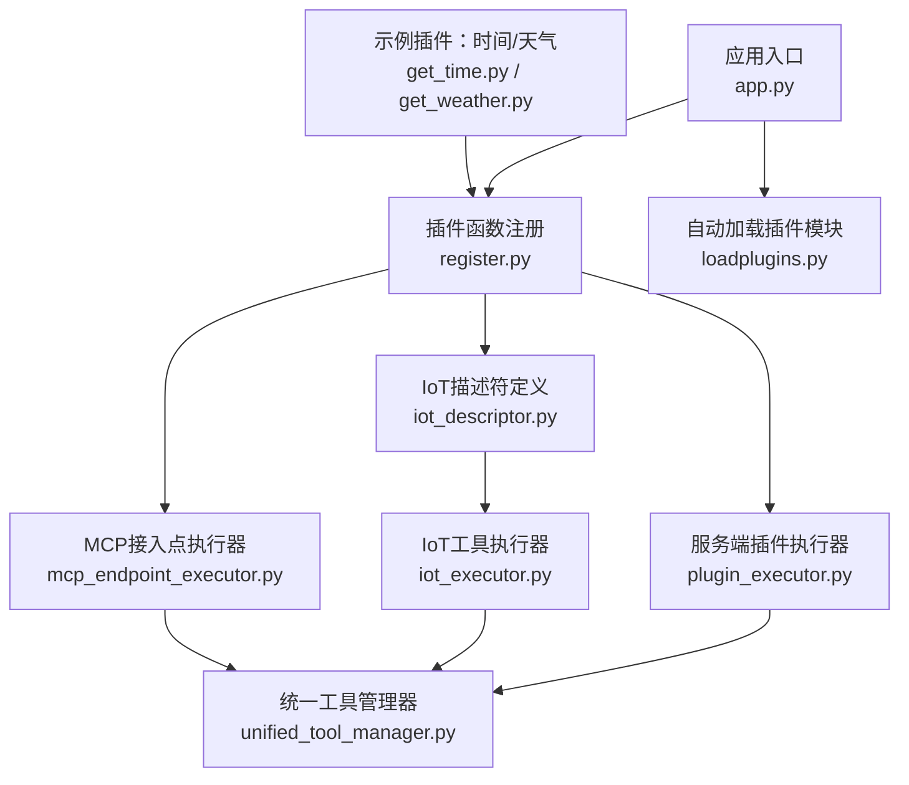
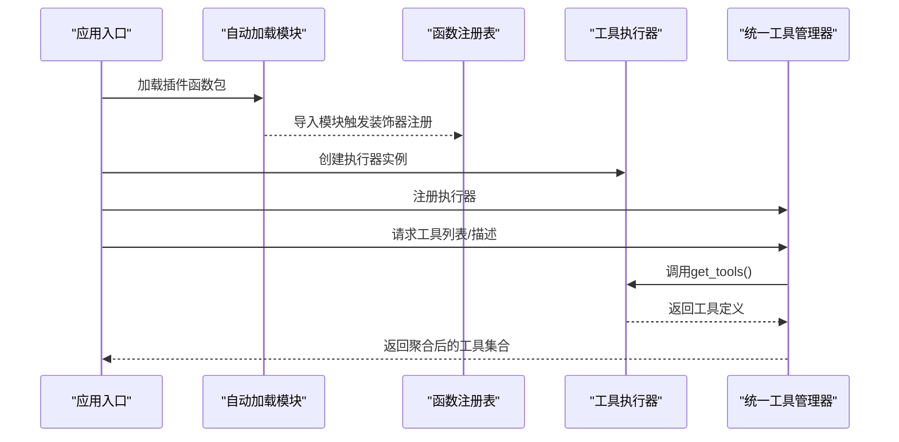
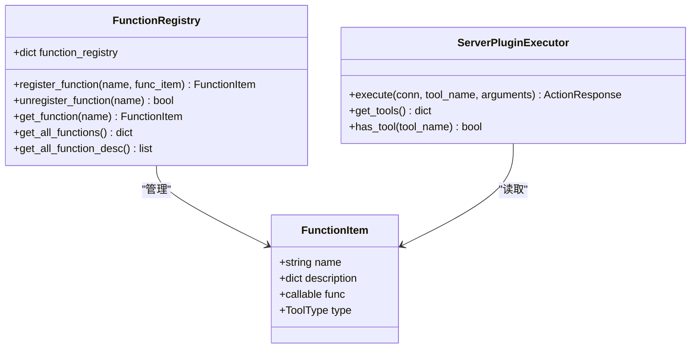
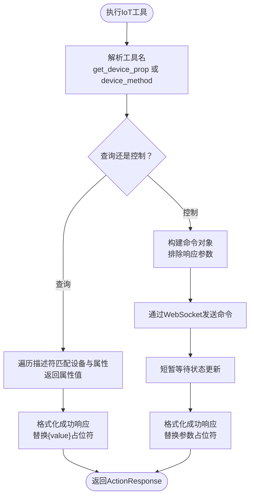
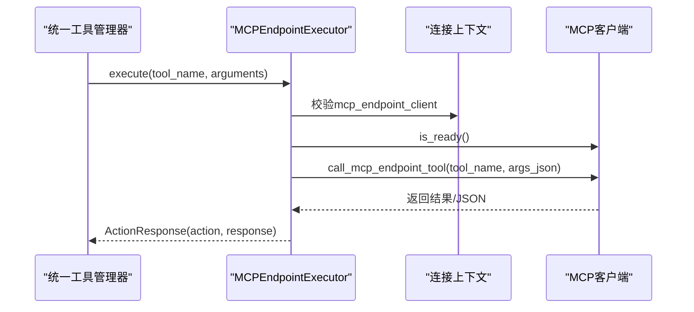
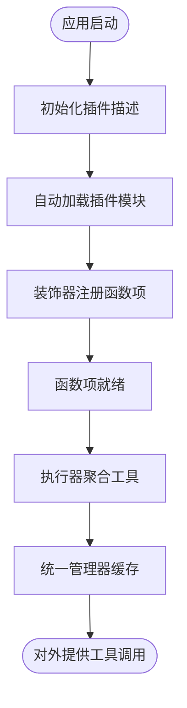
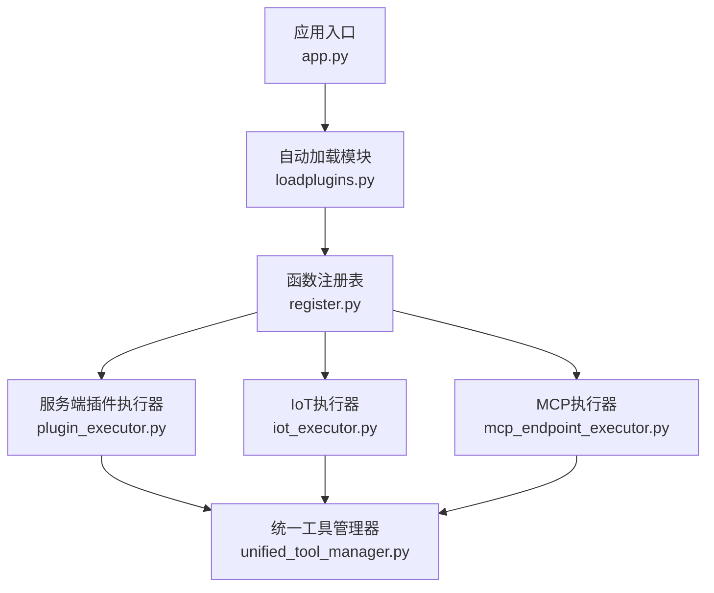

# 插件开发指南

<cite>
**本文引用的文件**
- [app.py](file://main/xiaozhi-server/app.py)
- [register.py](file://main/xiaozhi-server/plugins_func/register.py)
- [loadplugins.py](file://main/xiaozhi-server/plugins_func/loadplugins.py)
- [plugin_executor.py](file://main/xiaozhi-server/core/providers/tools/server_plugins/plugin_executor.py)
- [iot_descriptor.py](file://main/xiaozhi-server/core/providers/tools/device_iot/iot_descriptor.py)
- [iot_executor.py](file://main/xiaozhi-server/core/providers/tools/device_iot/iot_executor.py)
- [mcp_endpoint_executor.py](file://main/xiaozhi-server/core/providers/tools/mcp_endpoint/mcp_endpoint_executor.py)
- [unified_tool_manager.py](file://main/xiaozhi-server/core/providers/tools/unified_tool_manager.py)
- [get_time.py](file://main/xiaozhi-server/plugins_func/functions/get_time.py)
- [get_weather.py](file://main/xiaozhi-server/plugins_func/functions/get_weather.py)
</cite>

## 目录
1. [简介](#简介)
2. [项目结构](#项目结构)
3. [核心组件](#核心组件)
4. [架构总览](#架构总览)
5. [详细组件分析](#详细组件分析)
6. [依赖分析](#依赖分析)
7. [性能考虑](#性能考虑)
8. [故障排查指南](#故障排查指南)
9. [结论](#结论)
10. [附录](#附录)

## 简介
本指南面向小智ESP32服务器的插件开发者，系统讲解插件架构设计、生命周期管理、插件间通信机制，并覆盖三类插件的开发要点：函数插件（基于装饰器与注册表）、设备插件（IoT设备类型与描述符）、工具插件（MCP接入点与统一工具管理）。文档同时提供插件配置管理、动态加载与热更新建议、调试技巧以及完整开发模板与最佳实践。

## 项目结构
小智ESP32服务器的插件体系主要由以下层次构成：
- 应用入口负责配置加载与服务启动，插件描述初始化在服务启动前完成。
- 插件函数注册与工具类型定义位于插件函数注册模块。
- 工具执行器按类型分层：服务端插件执行器、设备端IoT执行器、MCP接入点执行器。
- 统一工具管理器聚合各类执行器，提供工具发现、调用与缓存。
- 示例插件展示函数插件的典型实现模式。

**图表来源**
- [app.py:46-131](file://main/xiaozhi-server/app.py#L46-L131)
- [register.py:83-142](file://main/xiaozhi-server/plugins_func/register.py#L83-L142)
- [loadplugins.py:9-25](file://main/xiaozhi-server/plugins_func/loadplugins.py#L9-L25)
- [plugin_executor.py:11-101](file://main/xiaozhi-server/core/providers/tools/server_plugins/plugin_executor.py#L11-L101)
- [iot_descriptor.py:9-47](file://main/xiaozhi-server/core/providers/tools/device_iot/iot_descriptor.py#L9-L47)
- [iot_executor.py:10-239](file://main/xiaozhi-server/core/providers/tools/device_iot/iot_executor.py#L10-L239)
- [mcp_endpoint_executor.py:9-98](file://main/xiaozhi-server/core/providers/tools/mcp_endpoint/mcp_endpoint_executor.py#L9-L98)
- [unified_tool_manager.py:9-125](file://main/xiaozhi-server/core/providers/tools/unified_tool_manager.py#L9-L125)
- [get_time.py:33-128](file://main/xiaozhi-server/plugins_func/functions/get_time.py#L33-L128)
- [get_weather.py:161-229](file://main/xiaozhi-server/plugins_func/functions/get_weather.py#L161-L229)

**章节来源**
- [app.py:46-131](file://main/xiaozhi-server/app.py#L46-L131)
- [register.py:83-142](file://main/xiaozhi-server/plugins_func/register.py#L83-L142)
- [loadplugins.py:9-25](file://main/xiaozhi-server/plugins_func/loadplugins.py#L9-L25)
- [unified_tool_manager.py:9-125](file://main/xiaozhi-server/core/providers/tools/unified_tool_manager.py#L9-L125)

## 核心组件
- 工具类型与动作定义：工具类型枚举与动作枚举用于统一工具行为与返回语义。
- 函数项与注册表：函数项封装函数元信息，全局注册表与按需注册表共同支撑函数发现与调用。
- 执行器基类与类型：抽象工具执行器接口，不同工具类型实现各自的执行逻辑。
- 统一工具管理器：聚合各执行器，提供工具缓存、冲突告警与统计。

**章节来源**
- [register.py:9-36](file://main/xiaozhi-server/plugins_func/register.py#L9-L36)
- [register.py:45-51](file://main/xiaozhi-server/plugins_func/register.py#L45-L51)
- [register.py:104-142](file://main/xiaozhi-server/plugins_func/register.py#L104-L142)
- [unified_tool_manager.py:9-125](file://main/xiaozhi-server/core/providers/tools/unified_tool_manager.py#L9-L125)

## 架构总览
插件系统采用“类型化执行器 + 统一管理器”的分层架构：
- 应用启动阶段加载插件描述与函数模块。
- 工具类型通过枚举区分，执行器按类型实现各自调用策略。
- 统一工具管理器负责工具聚合、缓存与调用路由。
- 插件函数通过装饰器注册到全局注册表，执行时按类型选择参数传递方式。

**图表来源**
- [app.py:46-131](file://main/xiaozhi-server/app.py#L46-L131)
- [loadplugins.py:9-25](file://main/xiaozhi-server/plugins_func/loadplugins.py#L9-L25)
- [register.py:83-142](file://main/xiaozhi-server/plugins_func/register.py#L83-L142)
- [unified_tool_manager.py:30-47](file://main/xiaozhi-server/core/providers/tools/unified_tool_manager.py#L30-L47)

## 详细组件分析

### 函数插件开发
函数插件是插件系统的核心，围绕装饰器、函数项与注册表展开。

- 装饰器与注册流程
  - 使用装饰器将函数注册到全局注册表，便于集中管理与发现。
  - 装饰器支持为函数绑定工具类型，决定执行时的参数传递方式。
  - 示例插件展示了两种工具类型：WAIT（等待返回）与SYSTEM_CTL（系统控制，需要连接上下文）。

- 函数项与描述
  - 函数项封装函数名、描述、实现与类型。
  - OpenAI风格的函数描述用于LLM工具调用时的参数校验与提示。

- 服务端插件执行器
  - 执行器从全局注册表获取函数项，按类型分支调用。
  - 对于需要连接上下文的类型，执行器会传入连接对象；否则仅传参。

**图表来源**
- [register.py:45-51](file://main/xiaozhi-server/plugins_func/register.py#L45-L51)
- [register.py:104-142](file://main/xiaozhi-server/plugins_func/register.py#L104-L142)
- [plugin_executor.py:18-51](file://main/xiaozhi-server/core/providers/tools/server_plugins/plugin_executor.py#L18-L51)

**章节来源**
- [register.py:83-142](file://main/xiaozhi-server/plugins_func/register.py#L83-L142)
- [plugin_executor.py:18-51](file://main/xiaozhi-server/core/providers/tools/server_plugins/plugin_executor.py#L18-L51)
- [get_time.py:33-128](file://main/xiaozhi-server/plugins_func/functions/get_time.py#L33-L128)
- [get_weather.py:161-229](file://main/xiaozhi-server/plugins_func/functions/get_weather.py#L161-L229)

### 设备插件开发（IoT）
设备插件通过设备描述符与执行器实现设备能力的统一暴露与调用。

- 设备描述符
  - 描述符定义设备名称、属性与方法，支持参数类型与描述。
  - 执行器根据描述符动态生成查询与控制工具。

- 设备工具执行器
  - 查询工具：按约定命名规则解析设备与属性，返回状态值。
  - 控制工具：解析设备与方法，构造命令并通过连接发送至设备。
  - 响应回填：支持参数占位符替换，提升用户体验。

**图表来源**
- [iot_executor.py:17-101](file://main/xiaozhi-server/core/providers/tools/device_iot/iot_executor.py#L17-L101)
- [iot_descriptor.py:12-47](file://main/xiaozhi-server/core/providers/tools/device_iot/iot_descriptor.py#L12-L47)

**章节来源**
- [iot_descriptor.py:9-47](file://main/xiaozhi-server/core/providers/tools/device_iot/iot_descriptor.py#L9-L47)
- [iot_executor.py:10-239](file://main/xiaozhi-server/core/providers/tools/device_iot/iot_executor.py#L10-L239)

### 工具插件开发（MCP接入点）
MCP接入点插件通过统一执行器桥接外部工具生态。

- 执行流程
  - 校验连接中的MCP客户端可用性。
  - 将参数序列化为JSON字符串，调用接入点工具。
  - 根据返回结果判断动作类型，决定是否直接回复或交由LLM二次处理。

**图表来源**
- [mcp_endpoint_executor.py:15-65](file://main/xiaozhi-server/core/providers/tools/mcp_endpoint/mcp_endpoint_executor.py#L15-L65)
- [unified_tool_manager.py:73-102](file://main/xiaozhi-server/core/providers/tools/unified_tool_manager.py#L73-L102)

**章节来源**
- [mcp_endpoint_executor.py:9-98](file://main/xiaozhi-server/core/providers/tools/mcp_endpoint/mcp_endpoint_executor.py#L9-L98)
- [unified_tool_manager.py:73-102](file://main/xiaozhi-server/core/providers/tools/unified_tool_manager.py#L73-L102)

### 插件生命周期与动态加载
- 应用启动时进行插件描述初始化与模块自动加载。
- 插件函数通过装饰器注册到全局注册表，执行器按需读取。
- 统一工具管理器对工具集合进行缓存，避免重复聚合。

**图表来源**
- [app.py:50-56](file://main/xiaozhi-server/app.py#L50-L56)
- [loadplugins.py:9-25](file://main/xiaozhi-server/plugins_func/loadplugins.py#L9-L25)
- [register.py:83-91](file://main/xiaozhi-server/plugins_func/register.py#L83-L91)
- [unified_tool_manager.py:25-28](file://main/xiaozhi-server/core/providers/tools/unified_tool_manager.py#L25-L28)

**章节来源**
- [app.py:50-56](file://main/xiaozhi-server/app.py#L50-L56)
- [loadplugins.py:9-25](file://main/xiaozhi-server/plugins_func/loadplugins.py#L9-L25)
- [register.py:83-91](file://main/xiaozhi-server/plugins_func/register.py#L83-L91)
- [unified_tool_manager.py:25-28](file://main/xiaozhi-server/core/providers/tools/unified_tool_manager.py#L25-L28)

## 依赖分析
- 组件耦合
  - 执行器依赖注册表与工具类型枚举，解耦具体函数实现。
  - 统一工具管理器聚合执行器，提供统一入口与缓存。
  - 插件函数通过装饰器与注册表间接依赖日志与配置。

- 外部依赖
  - 插件函数可能依赖缓存管理器与网络请求库。
  - IoT执行器依赖连接上下文的描述符与WebSocket通道。
  - MCP执行器依赖MCP客户端可用性与工具清单。

**图表来源**
- [register.py:83-142](file://main/xiaozhi-server/plugins_func/register.py#L83-L142)
- [plugin_executor.py:11-101](file://main/xiaozhi-server/core/providers/tools/server_plugins/plugin_executor.py#L11-L101)
- [iot_executor.py:10-239](file://main/xiaozhi-server/core/providers/tools/device_iot/iot_executor.py#L10-L239)
- [mcp_endpoint_executor.py:9-98](file://main/xiaozhi-server/core/providers/tools/mcp_endpoint/mcp_endpoint_executor.py#L9-L98)
- [unified_tool_manager.py:9-125](file://main/xiaozhi-server/core/providers/tools/unified_tool_manager.py#L9-L125)
- [app.py:46-131](file://main/xiaozhi-server/app.py#L46-L131)
- [loadplugins.py:9-25](file://main/xiaozhi-server/plugins_func/loadplugins.py#L9-L25)

**章节来源**
- [register.py:83-142](file://main/xiaozhi-server/plugins_func/register.py#L83-L142)
- [unified_tool_manager.py:9-125](file://main/xiaozhi-server/core/providers/tools/unified_tool_manager.py#L9-L125)

## 性能考虑
- 工具缓存：统一工具管理器对工具集合与函数描述进行缓存，减少重复聚合开销。
- 日志与异常：执行器与管理器均包含异常捕获与日志记录，有助于定位性能瓶颈。
- 异步执行：IoT与MCP执行器采用异步调用，降低阻塞风险。
- 参数校验：IoT执行器对工具名解析与参数占位符替换进行防御式编程，避免无效调用。

**章节来源**
- [unified_tool_manager.py:25-28](file://main/xiaozhi-server/core/providers/tools/unified_tool_manager.py#L25-L28)
- [unified_tool_manager.py:49-60](file://main/xiaozhi-server/core/providers/tools/unified_tool_manager.py#L49-L60)
- [iot_executor.py:17-101](file://main/xiaozhi-server/core/providers/tools/device_iot/iot_executor.py#L17-L101)
- [mcp_endpoint_executor.py:15-65](file://main/xiaozhi-server/core/providers/tools/mcp_endpoint/mcp_endpoint_executor.py#L15-L65)

## 故障排查指南
- 工具不存在
  - 现象：返回“工具不存在”或“函数未找到”。
  - 排查：确认工具名拼写、是否已通过装饰器注册、是否在配置中启用。
- 执行器未注册
  - 现象：返回“执行器未注册”。
  - 排查：确认执行器已通过统一管理器注册。
- IoT工具解析失败
  - 现象：返回“无法解析IoT工具名称”。
  - 排查：检查工具命名是否符合约定（查询：get_device_prop；控制：device_method）。
- MCP客户端不可用
  - 现象：返回“MCP客户端未初始化/未就绪”。
  - 排查：确认连接上下文中MCP客户端存在且可用。
- 异常与日志
  - 执行器与管理器均记录错误日志，便于定位问题。

**章节来源**
- [plugin_executor.py:22-26](file://main/xiaozhi-server/core/providers/tools/server_plugins/plugin_executor.py#L22-L26)
- [unified_tool_manager.py:80-92](file://main/xiaozhi-server/core/providers/tools/unified_tool_manager.py#L80-L92)
- [iot_executor.py:96-100](file://main/xiaozhi-server/core/providers/tools/device_iot/iot_executor.py#L96-L100)
- [mcp_endpoint_executor.py:19-29](file://main/xiaozhi-server/core/providers/tools/mcp_endpoint/mcp_endpoint_executor.py#L19-L29)

## 结论
小智ESP32服务器的插件体系以类型化执行器与统一管理器为核心，结合装饰器注册与自动加载机制，实现了高内聚、低耦合的插件扩展能力。开发者可依据本文档的模板与最佳实践快速开发函数插件、设备插件与工具插件，并通过统一管理器获得一致的工具发现与调用体验。

## 附录

### 插件配置管理
- 插件参数配置
  - 在配置中为插件设置参数（如API密钥、默认位置等），函数插件可通过连接上下文读取。
- 动态加载与热更新
  - 应用启动时自动加载插件模块；若需热更新，可重新导入模块并刷新工具缓存。
- 插件描述与展示
  - 通过OpenAI风格的函数描述向LLM暴露工具签名与参数约束。

**章节来源**
- [get_weather.py:165-169](file://main/xiaozhi-server/plugins_func/functions/get_weather.py#L165-L169)
- [plugin_executor.py:52-96](file://main/xiaozhi-server/core/providers/tools/server_plugins/plugin_executor.py#L52-L96)
- [unified_tool_manager.py:109-112](file://main/xiaozhi-server/core/providers/tools/unified_tool_manager.py#L109-L112)

### 插件调试技巧
- 日志记录
  - 使用统一的日志初始化函数输出调试信息，定位工具注册与执行问题。
- 错误处理
  - 执行器捕获异常并返回标准化的动作响应，便于上层统一处理。
- 性能监控
  - 利用统一管理器的统计接口查看各类型工具数量，评估插件规模。

**章节来源**
- [register.py:83-91](file://main/xiaozhi-server/plugins_func/register.py#L83-L91)
- [plugin_executor.py:46-50](file://main/xiaozhi-server/core/providers/tools/server_plugins/plugin_executor.py#L46-L50)
- [unified_tool_manager.py:114-124](file://main/xiaozhi-server/core/providers/tools/unified_tool_manager.py#L114-L124)

### 开发模板与最佳实践
- 函数插件模板
  - 使用装饰器注册函数，定义OpenAI风格的函数描述，按工具类型选择参数传递方式。
  - 示例参考：[get_time.py:33-128](file://main/xiaozhi-server/plugins_func/functions/get_time.py#L33-L128)、[get_weather.py:161-229](file://main/xiaozhi-server/plugins_func/functions/get_weather.py#L161-L229)
- 设备插件模板
  - 定义设备描述符，生成查询与控制工具；在执行器中实现解析与命令发送。
  - 示例参考：[iot_descriptor.py:12-47](file://main/xiaozhi-server/core/providers/tools/device_iot/iot_descriptor.py#L12-L47)、[iot_executor.py:10-239](file://main/xiaozhi-server/core/providers/tools/device_iot/iot_executor.py#L10-L239)
- 工具插件模板
  - 实现MCP接入点执行器，确保客户端可用性与参数序列化。
  - 示例参考：[mcp_endpoint_executor.py:9-98](file://main/xiaozhi-server/core/providers/tools/mcp_endpoint/mcp_endpoint_executor.py#L9-L98)
- 最佳实践
  - 明确工具类型，合理使用动作返回值（直接回复、请求LLM、记录历史等）。
  - 保持工具名唯一，避免冲突；必要时通过统一管理器检查冲突。
  - 对外部依赖（网络、缓存）进行容错与降级处理。

**章节来源**
- [get_time.py:33-128](file://main/xiaozhi-server/plugins_func/functions/get_time.py#L33-L128)
- [get_weather.py:161-229](file://main/xiaozhi-server/plugins_func/functions/get_weather.py#L161-L229)
- [iot_descriptor.py:12-47](file://main/xiaozhi-server/core/providers/tools/device_iot/iot_descriptor.py#L12-L47)
- [iot_executor.py:10-239](file://main/xiaozhi-server/core/providers/tools/device_iot/iot_executor.py#L10-L239)
- [mcp_endpoint_executor.py:9-98](file://main/xiaozhi-server/core/providers/tools/mcp_endpoint/mcp_endpoint_executor.py#L9-L98)
- [unified_tool_manager.py:40-42](file://main/xiaozhi-server/core/providers/tools/unified_tool_manager.py#L40-42)