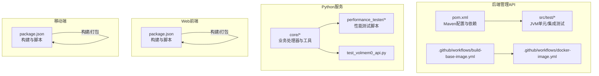
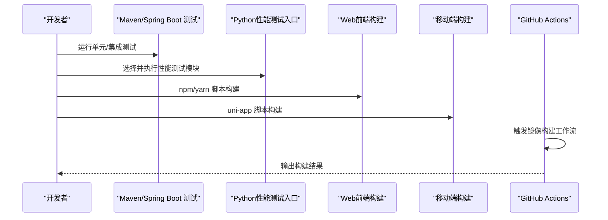
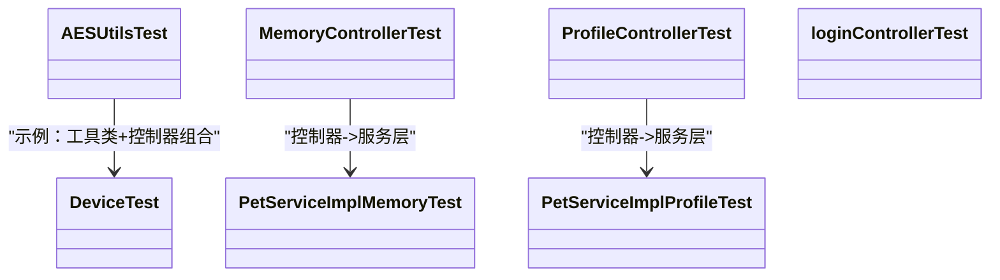
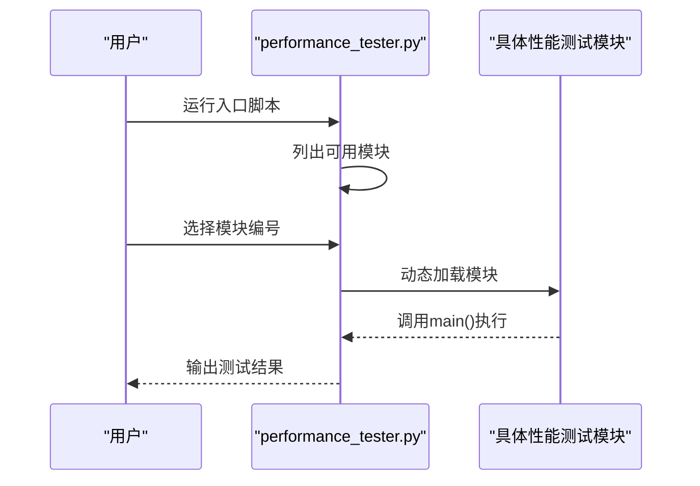
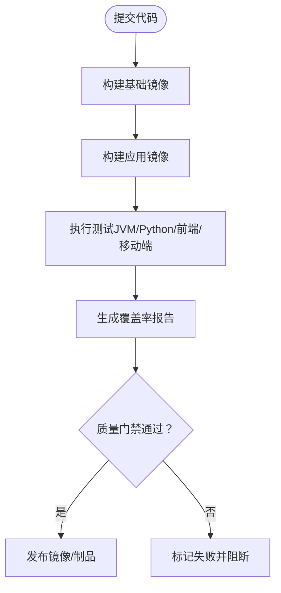
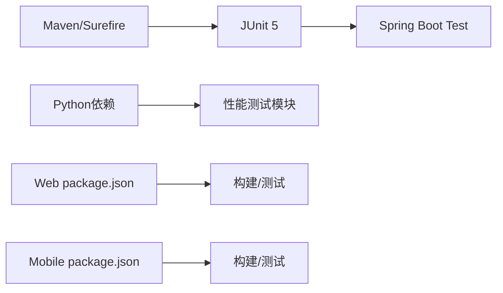

# 测试指南

<cite>
**本文引用的文件**
- [.github/workflows/build-base-image.yml](file://.github/workflows/build-base-image.yml)
- [.github/workflows/docker-image.yml](file://.github/workflows/docker-image.yml)
- [main/manager-api/pom.xml](file://main/manager-api/pom.xml)
- [main/manager-api/src/test/java/xiaozhi/common/utils/AESUtilsTest.java](file://main/manager-api/src/test/java/xiaozhi/common/utils/AESUtilsTest.java)
- [main/manager-api/src/test/java/xiaozhi/modules/device/DeviceTest.java](file://main/manager-api/src/test/java/xiaozhi/modules/device/DeviceTest.java)
- [main/manager-api/src/test/java/xiaozhi/modules/pet/MemoryControllerTest.java](file://main/manager-api/src/test/java/xiaozhi/modules/pet/MemoryControllerTest.java)
- [main/manager-api/src/test/java/xiaozhi/modules/pet/ProfileControllerTest.java](file://main/manager-api/src/test/java/xiaozhi/modules/pet/ProfileControllerTest.java)
- [main/manager-api/src/test/java/xiaozhi/modules/pet/service/impl/PetServiceImplMemoryTest.java](file://main/manager-api/src/test/java/xiaozhi/modules/pet/service/impl/PetServiceImplMemoryTest.java)
- [main/manager-api/src/test/java/xiaozhi/modules/pet/service/impl/PetServiceImplProfileTest.java](file://main/manager-api/src/test/java/xiaozhi/modules/pet/service/impl/PetServiceImplProfileTest.java)
- [main/manager-api/src/test/java/xiaozhi/modules/sys/loginControllerTest.java](file://main/manager-api/src/test/java/xiaozhi/modules/sys/loginControllerTest.java)
- [main/manager-api/src/test/resources/application.yml](file://main/manager-api/src/test/resources/application.yml)
- [main/manager-web/package.json](file://main/manager-web/package.json)
- [main/manager-mobile/package.json](file://main/manager-mobile/package.json)
- [main/xiaozhi-server/performance_tester.py](file://main/xiaozhi-server/performance_tester.py)
- [main/xiaozhi-server/performance_tester/performance_tester_asr.py](file://main/xiaozhi-server/performance_tester/performance_tester_asr.py)
- [main/xiaozhi-server/performance_tester/performance_tester_llm.py](file://main/xiaozhi-server/performance_tester/performance_tester_llm.py)
- [main/xiaozhi-server/performance_tester/performance_tester_stream_asr.py](file://main/xiaozhi-server/performance_tester/performance_tester_stream_asr.py)
- [main/xiaozhi-server/performance_tester/performance_tester_stream_tts.py](file://main/xiaozhi-server/performance_tester/performance_tester_stream_tts.py)
- [main/xiaozhi-server/performance_tester/performance_tester_tts.py](file://main/xiaozhi-server/performance_tester/performance_tester_tts.py)
- [main/xiaozhi-server/performance_tester/performance_tester_vllm.py](file://main/xiaozhi-server/performance_tester/performance_tester_vllm.py)
- [main/xiaozhi-server/test_volmem0_api.py](file://main/xiaozhi-server/test_volmem0_api.py)
</cite>

## 目录
1. 引言
2. 项目结构
3. 核心组件
4. 架构总览
5. 详细组件分析
6. 依赖分析
7. 性能考虑
8. 故障排除指南
9. 结论
10. 附录

## 引言
本测试指南面向小智ESP32服务器的多端（后端Java API、Python服务、Web前端、移动端）测试体系，覆盖单元测试、集成测试、性能测试、前端测试与测试数据管理，并结合现有CI配置给出自动化落地建议。文档同时提供可操作的流程图与序列图，帮助不同技术背景的读者快速上手。

## 项目结构
项目由四大部分组成：
- 后端管理API（Spring Boot，基于Maven）
- Python语音/大模型服务（核心逻辑与性能测试脚本）
- Web管理端（Vue 2）
- 移动端管理端（uni-app/Vue 3）

下图展示测试相关模块与文件的组织关系：

图表来源
- [main/manager-api/pom.xml:1-291](file://main/manager-api/pom.xml#L1-L291)
- [.github/workflows/build-base-image.yml:1-50](file://.github/workflows/build-base-image.yml#L1-L50)
- [.github/workflows/docker-image.yml:1-89](file://.github/workflows/docker-image.yml#L1-L89)
- [main/xiaozhi-server/performance_tester.py:1-70](file://main/xiaozhi-server/performance_tester.py#L1-L70)
- [main/manager-web/package.json:1-51](file://main/manager-web/package.json#L1-L51)
- [main/manager-mobile/package.json:1-163](file://main/manager-mobile/package.json#L1-L163)

章节来源
- [main/manager-api/pom.xml:1-291](file://main/manager-api/pom.xml#L1-L291)
- [.github/workflows/build-base-image.yml:1-50](file://.github/workflows/build-base-image.yml#L1-L50)
- [.github/workflows/docker-image.yml:1-89](file://.github/workflows/docker-image.yml#L1-L89)
- [main/manager-web/package.json:1-51](file://main/manager-web/package.json#L1-L51)
- [main/manager-mobile/package.json:1-163](file://main/manager-mobile/package.json#L1-L163)

## 核心组件
- 单元测试（JVM侧）：基于JUnit 5与Spring Boot Test，覆盖通用工具与控制器/服务层。
- 集成测试（JVM侧）：通过测试配置加载与数据库迁移工具进行端到端验证。
- 性能测试（Python侧）：提供ASR/TTS/LLM/VLLM等子模块的独立测试入口。
- 前端测试（Web/移动端）：基于现有构建脚本与依赖，建议引入单元与端到端测试方案。
- 持续集成：GitHub Actions负责镜像构建与发布，可扩展至测试阶段。

章节来源
- [main/manager-api/pom.xml:92-131](file://main/manager-api/pom.xml#L92-L131)
- [main/manager-api/src/test/resources/application.yml:1-200](file://main/manager-api/src/test/resources/application.yml#L1-L200)
- [main/xiaozhi-server/performance_tester.py:1-70](file://main/xiaozhi-server/performance_tester.py#L1-L70)
- [main/manager-web/package.json:1-51](file://main/manager-web/package.json#L1-L51)
- [main/manager-mobile/package.json:1-163](file://main/manager-mobile/package.json#L1-L163)

## 架构总览
下图展示测试执行路径与CI集成关系：

图表来源
- [main/manager-api/pom.xml:283-287](file://main/manager-api/pom.xml#L283-L287)
- [main/xiaozhi-server/performance_tester.py:47-70](file://main/xiaozhi-server/performance_tester.py#L47-L70)
- [main/manager-web/package.json:5-9](file://main/manager-web/package.json#L5-L9)
- [main/manager-mobile/package.json:26-76](file://main/manager-mobile/package.json#L26-L76)
- [.github/workflows/docker-image.yml:1-89](file://.github/workflows/docker-image.yml#L1-L89)

## 详细组件分析

### JVM单元/集成测试（Spring Boot + JUnit 5）
- 测试框架与依赖
  - 使用JUnit Jupiter API/Engine/Params与平台Launcher。
  - Spring Boot Test Starter用于Web与自动配置。
  - Maven Surefire插件控制测试执行开关。
- 测试范围
  - 通用工具类测试（如AES工具）。
  - 控制器层测试（设备、宠物、登录等）。
  - 服务实现层测试（内存/档案相关）。
- 测试配置
  - 测试资源中的application.yml用于隔离数据库与日志配置。

图表来源
- [main/manager-api/src/test/java/xiaozhi/common/utils/AESUtilsTest.java:1-200](file://main/manager-api/src/test/java/xiaozhi/common/utils/AESUtilsTest.java#L1-L200)
- [main/manager-api/src/test/java/xiaozhi/modules/device/DeviceTest.java:1-200](file://main/manager-api/src/test/java/xiaozhi/modules/device/DeviceTest.java#L1-L200)
- [main/manager-api/src/test/java/xiaozhi/modules/pet/MemoryControllerTest.java:1-200](file://main/manager-api/src/test/java/xiaozhi/modules/pet/MemoryControllerTest.java#L1-L200)
- [main/manager-api/src/test/java/xiaozhi/modules/pet/ProfileControllerTest.java:1-200](file://main/manager-api/src/test/java/xiaozhi/modules/pet/ProfileControllerTest.java#L1-L200)
- [main/manager-api/src/test/java/xiaozhi/modules/pet/service/impl/PetServiceImplMemoryTest.java:1-200](file://main/manager-api/src/test/java/xiaozhi/modules/pet/service/impl/PetServiceImplMemoryTest.java#L1-L200)
- [main/manager-api/src/test/java/xiaozhi/modules/pet/service/impl/PetServiceImplProfileTest.java:1-200](file://main/manager-api/src/test/java/xiaozhi/modules/pet/service/impl/PetServiceImplProfileTest.java#L1-L200)
- [main/manager-api/src/test/java/xiaozhi/modules/sys/loginControllerTest.java:1-200](file://main/manager-api/src/test/java/xiaozhi/modules/sys/loginControllerTest.java#L1-L200)

章节来源
- [main/manager-api/pom.xml:92-131](file://main/manager-api/pom.xml#L92-L131)
- [main/manager-api/src/test/resources/application.yml:1-200](file://main/manager-api/src/test/resources/application.yml#L1-L200)

### Python性能测试（ASR/TTS/LLM/VLLM）
- 入口脚本
  - 自动扫描performance_tester目录，列出可用模块并交互式选择执行。
- 子模块
  - ASR/Stream-ASR、TTS/Stream-TTS、LLM、VLLM等独立模块，每个模块提供main函数作为入口。
- 执行流程

图表来源
- [main/xiaozhi-server/performance_tester.py:8-70](file://main/xiaozhi-server/performance_tester.py#L8-L70)
- [main/xiaozhi-server/performance_tester/performance_tester_asr.py:1-200](file://main/xiaozhi-server/performance_tester/performance_tester_asr.py#L1-L200)
- [main/xiaozhi-server/performance_tester/performance_tester_llm.py:1-200](file://main/xiaozhi-server/performance_tester/performance_tester_llm.py#L1-L200)
- [main/xiaozhi-server/performance_tester/performance_tester_stream_asr.py:1-200](file://main/xiaozhi-server/performance_tester/performance_tester_stream_asr.py#L1-L200)
- [main/xiaozhi-server/performance_tester/performance_tester_stream_tts.py:1-200](file://main/xiaozhi-server/performance_tester/performance_tester_stream_tts.py#L1-L200)
- [main/xiaozhi-server/performance_tester/performance_tester_tts.py:1-200](file://main/xiaozhi-server/performance_tester/performance_tester_tts.py#L1-L200)
- [main/xiaozhi-server/performance_tester/performance_tester_vllm.py:1-200](file://main/xiaozhi-server/performance_tester/performance_tester_vllm.py#L1-L200)

章节来源
- [main/xiaozhi-server/performance_tester.py:1-70](file://main/xiaozhi-server/performance_tester.py#L1-L70)

### Web前端测试（Vue 2）
- 当前状态
  - package.json包含构建脚本，未发现内置测试脚本或测试依赖。
- 建议
  - 引入单元测试（如Jest）与端到端测试（如Cypress或Playwright），并与现有构建脚本联动。
  - 在CI中增加测试步骤，确保变更不破坏UI功能。

章节来源
- [main/manager-web/package.json:1-51](file://main/manager-web/package.json#L1-L51)

### 移动端测试（uni-app/Vue 3）
- 当前状态
  - package.json包含多平台构建脚本与类型检查脚本，未发现内置测试脚本或测试依赖。
- 建议
  - 引入单元测试与端到端测试方案，结合HBuilderX或命令行工具运行。
  - 在CI中增加测试步骤，保障小程序/H5/App等多端一致性。

章节来源
- [main/manager-mobile/package.json:1-163](file://main/manager-mobile/package.json#L1-L163)

### 测试数据管理与环境隔离
- 数据库与迁移
  - 使用Liquibase与MyBatis Plus进行数据库版本管理与初始化。
  - 测试环境可通过独立的application.yml进行隔离（如切换数据源与日志级别）。
- 测试数据准备
  - 建议在测试前执行数据库初始化脚本，确保表结构与种子数据一致。
- 清理与隔离
  - 单测使用内存数据库或容器化数据库实例；集成测试使用独立schema或临时库。
  - CI中使用缓存与清理步骤，避免状态污染。

章节来源
- [main/manager-api/pom.xml:172-181](file://main/manager-api/pom.xml#L172-L181)
- [main/manager-api/src/test/resources/application.yml:1-200](file://main/manager-api/src/test/resources/application.yml#L1-L200)

### 持续集成与自动化测试
- 现状
  - GitHub Actions包含基础镜像构建与主镜像发布工作流。
- 建议
  - 在现有工作流中新增“测试”阶段：先执行JVM单测，再执行Python性能测试入口，最后执行前端/移动端构建与测试。
  - 将测试覆盖率与静态检查纳入CI，失败即阻断合并。

图表来源
- [.github/workflows/build-base-image.yml:1-50](file://.github/workflows/build-base-image.yml#L1-L50)
- [.github/workflows/docker-image.yml:1-89](file://.github/workflows/docker-image.yml#L1-L89)

## 依赖分析
- 测试框架与工具链
  - JVM：JUnit 5、Spring Boot Test、Maven Surefire。
  - Python：标准库与第三方依赖（见requirements.txt与各性能测试模块）。
  - 前端/移动端：构建脚本与依赖（见package.json）。
- 外部服务与数据库
  - MySQL、Redis、OceanBase（初始化脚本与迁移）。
  - 第三方服务（ASR/LLM/TTS提供商）需在测试中通过Mock或沙箱环境隔离。

图表来源
- [main/manager-api/pom.xml:92-131](file://main/manager-api/pom.xml#L92-L131)
- [main/xiaozhi-server/performance_tester.py:1-70](file://main/xiaozhi-server/performance_tester.py#L1-L70)
- [main/manager-web/package.json:1-51](file://main/manager-web/package.json#L1-L51)
- [main/manager-mobile/package.json:1-163](file://main/manager-mobile/package.json#L1-L163)

## 性能考虑
- 性能测试入口
  - 通过统一入口脚本动态加载并执行指定模块，便于扩展与维护。
- 压力/负载/基准
  - 建议在独立环境中运行，使用容器编排与资源限制模拟真实场景。
  - 对关键路径（ASR/TTS/LLM）分别建立基线，定期回归对比。
- 报告与可视化
  - 输出吞吐、延迟、错误率等指标，结合CI生成趋势图。

章节来源
- [main/xiaozhi-server/performance_tester.py:1-70](file://main/xiaozhi-server/performance_tester.py#L1-L70)

## 故障排除指南
- 测试无法启动/找不到main函数
  - 检查性能测试模块是否定义main函数，且命名正确。
- 数据库连接异常
  - 确认测试配置中的数据源URL、用户名、密码与迁移脚本已执行。
- 前端/移动端构建失败
  - 检查Node版本与包管理器版本，确保依赖安装完成。
- CI构建卡顿
  - 清理Docker缓存与构建器缓存，复用缓存键，避免重复下载依赖。

章节来源
- [.github/workflows/docker-image.yml:23-32](file://.github/workflows/docker-image.yml#L23-L32)
- [main/manager-api/src/test/resources/application.yml:1-200](file://main/manager-api/src/test/resources/application.yml#L1-L200)

## 结论
本指南提供了从单元测试到性能测试、从前端到移动端的全栈测试实践建议，并结合现有CI工作流给出可落地的自动化方案。建议尽快补齐前端/移动端测试套件，完善覆盖率与质量门禁，持续提升系统稳定性与交付效率。

## 附录
- 测试覆盖率要求（建议）
  - 单元测试：核心业务逻辑达到较高覆盖率（如>80%），边界条件与异常分支全覆盖。
  - 集成测试：关键API与数据流覆盖，数据库操作与外部服务调用通过Mock隔离。
  - 前端/移动端：组件级测试与端到端场景测试，结合自动化回归。
- 报告与改进
  - 在CI中输出覆盖率报告（Jacoco、Coverage.py、Istanbul等），对低覆盖率模块制定补测计划。
  - 定期回顾测试用例有效性，剔除冗余，补充新场景。