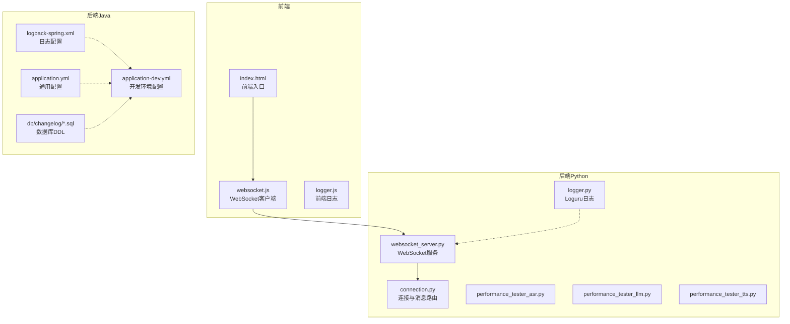
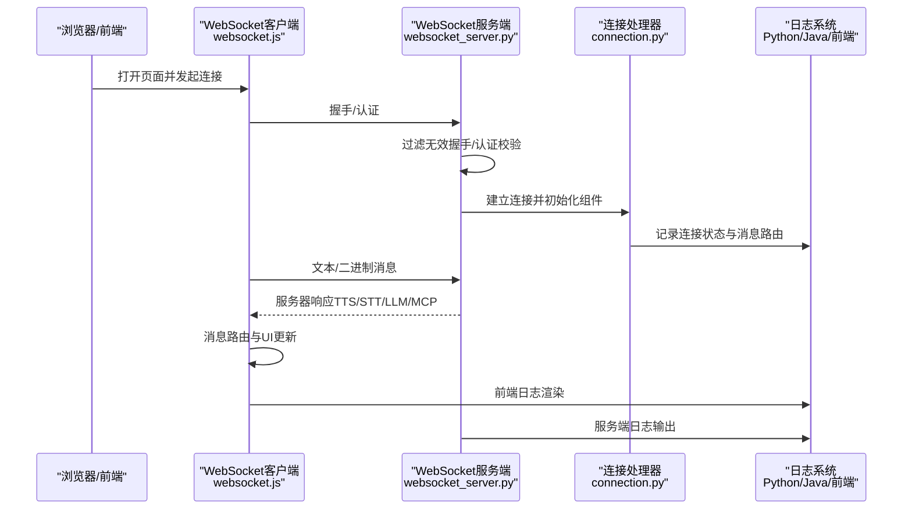
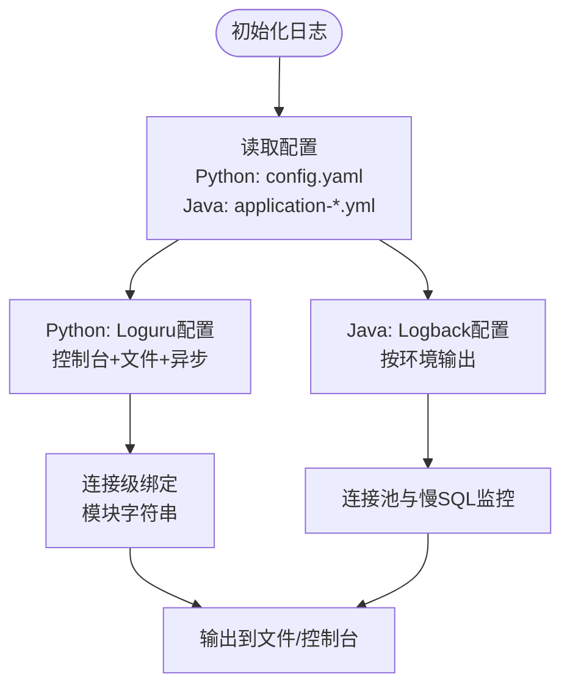
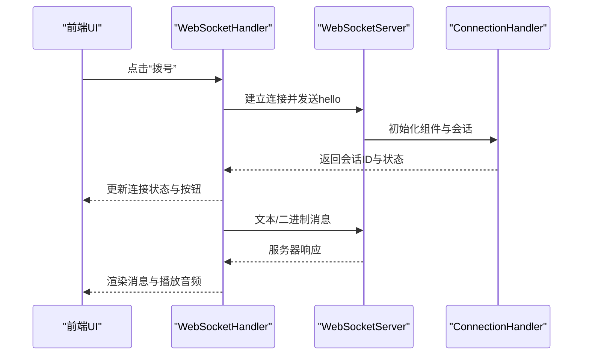
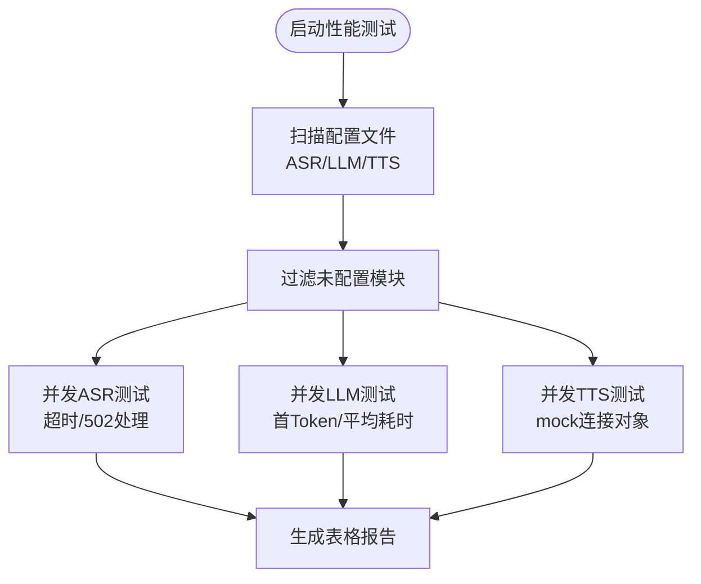
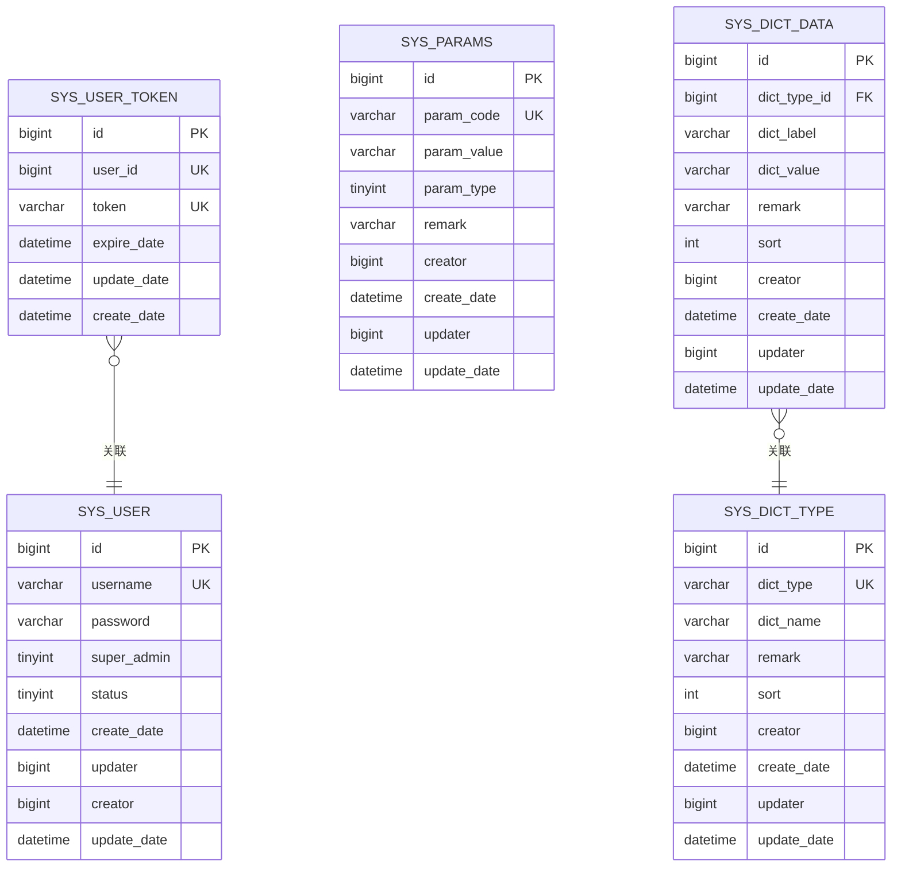
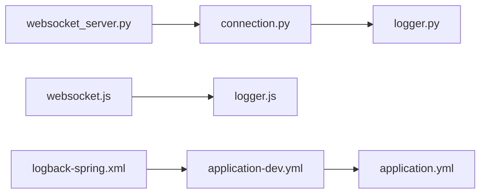

# 调试工具与技巧

<cite>
**本文档引用的文件**
- [main/xiaozhi-server/config/logger.py](file://main/xiaozhi-server/config/logger.py)
- [main/manager-api/src/main/resources/logback-spring.xml](file://main/manager-api/src/main/resources/logback-spring.xml)
- [main/demo-web/js/utils/logger.js](file://main/demo-web/js/utils/logger.js)
- [main/xiaozhi-server/core/websocket_server.py](file://main/xiaozhi-server/core/websocket_server.py)
- [main/demo-web/js/core/network/websocket.js](file://main/demo-web/js/core/network/websocket.js)
- [main/xiaozhi-server/performance_tester/performance_tester_asr.py](file://main/xiaozhi-server/performance_tester/performance_tester_asr.py)
- [main/xiaozhi-server/performance_tester/performance_tester_llm.py](file://main/xiaozhi-server/performance_tester/performance_tester_llm.py)
- [main/xiaozhi-server/performance_tester/performance_tester_tts.py](file://main/xiaozhi-server/performance_tester/performance_tester_tts.py)
- [main/manager-api/src/main/resources/application-dev.yml](file://main/manager-api/src/main/resources/application-dev.yml)
- [main/manager-api/src/main/resources/application.yml](file://main/manager-api/src/main/resources/application.yml)
- [main/manager-api/src/main/resources/db/changelog/202503141335.sql](file://main/manager-api/src/main/resources/db/changelog/202503141335.sql)
- [main/xiaozhi-server/core/connection.py](file://main/xiaozhi-server/core/connection.py)
- [main/xiaozhi-server/config/settings.py](file://main/xiaozhi-server/config/settings.py)
- [main/demo-web/index.html](file://main/demo-web/index.html)
</cite>

## 目录
1. [简介](#简介)
2. [项目结构](#项目结构)
3. [核心组件](#核心组件)
4. [架构总览](#架构总览)
5. [详细组件分析](#详细组件分析)
6. [依赖关系分析](#依赖关系分析)
7. [性能考量](#性能考量)
8. [故障排查指南](#故障排查指南)
9. [结论](#结论)
10. [附录](#附录)

## 简介
本指南面向小智ESP32服务器的调试与运维，覆盖日志系统（Python Loguru、Java Logback）、WebSocket调试、性能分析（ASR/LLM/TTS）、数据库调试（SQL与连接池）、前端调试（浏览器开发者工具、Vue/UniApp调试）、网络抓包与API测试、错误追踪与异常处理、以及开发效率工具。文档以仓库现有实现为依据，提供可操作的调试步骤与可视化图示。

## 项目结构
小智ESP32服务器采用多语言混合架构：
- Python后端（WebSocket服务器、模块编排、性能测试器）
- Java Spring Boot管理API（日志、数据库、连接池）
- 前端Web应用（Vue/UniApp生态，基于浏览器的调试）

图表来源
- [main/demo-web/index.html:1-399](file://main/demo-web/index.html#L1-L399)
- [main/demo-web/js/core/network/websocket.js:1-583](file://main/demo-web/js/core/network/websocket.js#L1-L583)
- [main/xiaozhi-server/core/websocket_server.py:1-228](file://main/xiaozhi-server/core/websocket_server.py#L1-L228)
- [main/xiaozhi-server/core/connection.py:1-800](file://main/xiaozhi-server/core/connection.py#L1-L800)
- [main/xiaozhi-server/config/logger.py:1-115](file://main/xiaozhi-server/config/logger.py#L1-L115)
- [main/manager-api/src/main/resources/logback-spring.xml:1-140](file://main/manager-api/src/main/resources/logback-spring.xml#L1-L140)
- [main/manager-api/src/main/resources/application.yml:1-66](file://main/manager-api/src/main/resources/application.yml#L1-L66)
- [main/manager-api/src/main/resources/application-dev.yml:1-51](file://main/manager-api/src/main/resources/application-dev.yml#L1-L51)
- [main/manager-api/src/main/resources/db/changelog/202503141335.sql:1-83](file://main/manager-api/src/main/resources/db/changelog/202503141335.sql#L1-L83)

章节来源
- [main/demo-web/index.html:1-399](file://main/demo-web/index.html#L1-L399)
- [main/demo-web/js/core/network/websocket.js:1-583](file://main/demo-web/js/core/network/websocket.js#L1-L583)
- [main/xiaozhi-server/core/websocket_server.py:1-228](file://main/xiaozhi-server/core/websocket_server.py#L1-L228)
- [main/xiaozhi-server/core/connection.py:1-800](file://main/xiaozhi-server/core/connection.py#L1-L800)
- [main/xiaozhi-server/config/logger.py:1-115](file://main/xiaozhi-server/config/logger.py#L1-L115)
- [main/manager-api/src/main/resources/logback-spring.xml:1-140](file://main/manager-api/src/main/resources/logback-spring.xml#L1-L140)
- [main/manager-api/src/main/resources/application.yml:1-66](file://main/manager-api/src/main/resources/application.yml#L1-L66)
- [main/manager-api/src/main/resources/application-dev.yml:1-51](file://main/manager-api/src/main/resources/application-dev.yml#L1-L51)
- [main/manager-api/src/main/resources/db/changelog/202503141335.sql:1-83](file://main/manager-api/src/main/resources/db/changelog/202503141335.sql#L1-L83)

## 核心组件
- 日志系统
  - Python：Loguru统一配置，支持控制台与文件输出、异步写入、回溯与诊断信息。
  - Java：Logback按环境配置，支持滚动文件、错误日志阈值、彩色控制台输出。
  - 前端：自定义日志容器渲染，支持不同类型消息的颜色区分与自动滚动。
- WebSocket通信
  - 服务端：握手过滤、认证、连接生命周期管理、配置热更新。
  - 客户端：消息路由、二进制音频队列、MCP工具链路、Live2D联动。
- 性能测试器
  - ASR/LLM/TTS三类性能测试脚本，支持并发、超时控制、结果统计与排序。
- 数据库与连接池
  - 开发环境配置Druid连接池、慢SQL监控、SQL变更脚本。
- 前端调试
  - 浏览器开发者工具、Vue/UniApp组件调试、移动端真机调试要点。
- 网络与API调试
  - WebSocket测试、OTA握手流程、浏览器抓包与跨域问题排查。
- 错误追踪与异常处理
  - 服务端堆栈捕获、异常分类、连接清理与资源回收。
- 开发效率工具
  - IDE配置建议、代码补全与快捷键使用（结合项目结构给出实践建议）。

章节来源
- [main/xiaozhi-server/config/logger.py:1-115](file://main/xiaozhi-server/config/logger.py#L1-L115)
- [main/manager-api/src/main/resources/logback-spring.xml:1-140](file://main/manager-api/src/main/resources/logback-spring.xml#L1-L140)
- [main/demo-web/js/utils/logger.js:1-43](file://main/demo-web/js/utils/logger.js#L1-L43)
- [main/xiaozhi-server/core/websocket_server.py:1-228](file://main/xiaozhi-server/core/websocket_server.py#L1-L228)
- [main/demo-web/js/core/network/websocket.js:1-583](file://main/demo-web/js/core/network/websocket.js#L1-L583)
- [main/xiaozhi-server/performance_tester/performance_tester_asr.py:1-354](file://main/xiaozhi-server/performance_tester/performance_tester_asr.py#L1-L354)
- [main/xiaozhi-server/performance_tester/performance_tester_llm.py:1-545](file://main/xiaozhi-server/performance_tester/performance_tester_llm.py#L1-L545)
- [main/xiaozhi-server/performance_tester/performance_tester_tts.py:1-200](file://main/xiaozhi-server/performance_tester/performance_tester_tts.py#L1-L200)
- [main/manager-api/src/main/resources/application-dev.yml:1-51](file://main/manager-api/src/main/resources/application-dev.yml#L1-L51)
- [main/manager-api/src/main/resources/application.yml:1-66](file://main/manager-api/src/main/resources/application.yml#L1-L66)
- [main/manager-api/src/main/resources/db/changelog/202503141335.sql:1-83](file://main/manager-api/src/main/resources/db/changelog/202503141335.sql#L1-L83)
- [main/xiaozhi-server/core/connection.py:1-800](file://main/xiaozhi-server/core/connection.py#L1-L800)
- [main/xiaozhi-server/config/settings.py:1-34](file://main/xiaozhi-server/config/settings.py#L1-L34)

## 架构总览
小智ESP32服务器的调试涉及前后端协同与多组件交互。下图展示了关键调试路径与数据流：

图表来源
- [main/demo-web/js/core/network/websocket.js:1-583](file://main/demo-web/js/core/network/websocket.js#L1-L583)
- [main/xiaozhi-server/core/websocket_server.py:1-228](file://main/xiaozhi-server/core/websocket_server.py#L1-L228)
- [main/xiaozhi-server/core/connection.py:1-800](file://main/xiaozhi-server/core/connection.py#L1-L800)
- [main/xiaozhi-server/config/logger.py:1-115](file://main/xiaozhi-server/config/logger.py#L1-L115)
- [main/manager-api/src/main/resources/logback-spring.xml:1-140](file://main/manager-api/src/main/resources/logback-spring.xml#L1-L140)

## 详细组件分析

### 日志系统使用指南
- Python（Loguru）
  - 配置项：日志级别、格式、输出目录、文件轮转、异步写入、回溯与诊断。
  - 动态模块字符串：通过模块缩写组合形成唯一标识，便于多模块聚合查看。
  - 连接级日志：为每个连接绑定独立模块串，便于区分来源。
- Java（Logback）
  - 环境配置：dev/test/prod三档，分别控制日志级别与输出目标。
  - 滚动策略：按大小与时间滚动，保留策略与编码。
  - 错误日志：独立文件，阈值过滤，便于快速定位问题。
- 前端日志
  - DOM容器渲染：支持多行消息、时间戳、颜色区分、自动滚动。
  - 与控制台互补：容器不存在时回退到console输出。

图表来源
- [main/xiaozhi-server/config/logger.py:1-115](file://main/xiaozhi-server/config/logger.py#L1-L115)
- [main/manager-api/src/main/resources/logback-spring.xml:1-140](file://main/manager-api/src/main/resources/logback-spring.xml#L1-L140)
- [main/manager-api/src/main/resources/application-dev.yml:1-51](file://main/manager-api/src/main/resources/application-dev.yml#L1-L51)
- [main/demo-web/js/utils/logger.js:1-43](file://main/demo-web/js/utils/logger.js#L1-L43)

章节来源
- [main/xiaozhi-server/config/logger.py:1-115](file://main/xiaozhi-server/config/logger.py#L1-L115)
- [main/manager-api/src/main/resources/logback-spring.xml:1-140](file://main/manager-api/src/main/resources/logback-spring.xml#L1-L140)
- [main/manager-api/src/main/resources/application-dev.yml:1-51](file://main/manager-api/src/main/resources/application-dev.yml#L1-L51)
- [main/demo-web/js/utils/logger.js:1-43](file://main/demo-web/js/utils/logger.js#L1-L43)

### WebSocket调试技巧
- 连接状态监控
  - 服务端：过滤无效握手（如HTTPS访问WS端口），减少噪音日志。
  - 客户端：onopen/onclose/onerror事件处理，状态指示器与UI联动。
- 消息追踪
  - 文本消息：hello握手、stt/llm/tts、mcp工具链路。
  - 二进制消息：OPUS音频帧队列与播放器集成。
- 实时调试
  - 前端日志容器：实时显示消息类型与内容，便于定位异常。
  - Live2D联动：说话动画与音频分析器对接，便于感知播放状态。

图表来源
- [main/demo-web/js/core/network/websocket.js:1-583](file://main/demo-web/js/core/network/websocket.js#L1-L583)
- [main/xiaozhi-server/core/websocket_server.py:1-228](file://main/xiaozhi-server/core/websocket_server.py#L1-L228)
- [main/xiaozhi-server/core/connection.py:1-800](file://main/xiaozhi-server/core/connection.py#L1-L800)

章节来源
- [main/xiaozhi-server/core/websocket_server.py:1-228](file://main/xiaozhi-server/core/websocket_server.py#L1-L228)
- [main/demo-web/js/core/network/websocket.js:1-583](file://main/demo-web/js/core/network/websocket.js#L1-L583)
- [main/xiaozhi-server/core/connection.py:1-800](file://main/xiaozhi-server/core/connection.py#L1-L800)

### 性能分析工具
- ASR性能测试
  - 自动扫描data目录下的配置文件，加载ASR模块。
  - 单音频测试与全量并发测试，超时控制与成功率统计。
  - 结果按平均耗时排序，异常与502错误自动跳过。
- LLM性能测试
  - 系统提示词注入，句子级测试，首Token时间与平均响应时间统计。
  - Ollama服务健康检查与模型存在性校验。
  - 异常与超时保护，结果表格化输出。
- TTS性能测试
  - 非流式合成测试，mock连接对象与编码器，避免依赖缺失。
  - 平均耗时与测试句数统计，结果排序与状态标注。

图表来源
- [main/xiaozhi-server/performance_tester/performance_tester_asr.py:1-354](file://main/xiaozhi-server/performance_tester/performance_tester_asr.py#L1-L354)
- [main/xiaozhi-server/performance_tester/performance_tester_llm.py:1-545](file://main/xiaozhi-server/performance_tester/performance_tester_llm.py#L1-L545)
- [main/xiaozhi-server/performance_tester/performance_tester_tts.py:1-200](file://main/xiaozhi-server/performance_tester/performance_tester_tts.py#L1-L200)

章节来源
- [main/xiaozhi-server/performance_tester/performance_tester_asr.py:1-354](file://main/xiaozhi-server/performance_tester/performance_tester_asr.py#L1-L354)
- [main/xiaozhi-server/performance_tester/performance_tester_llm.py:1-545](file://main/xiaozhi-server/performance_tester/performance_tester_llm.py#L1-L545)
- [main/xiaozhi-server/performance_tester/performance_tester_tts.py:1-200](file://main/xiaozhi-server/performance_tester/performance_tester_tts.py#L1-L200)

### 数据库调试方法
- SQL查询分析
  - 开发环境启用慢SQL记录与阈值设置，便于发现慢查询。
  - DDL变更脚本集中管理，确保表结构一致性。
- 慢查询优化
  - 结合慢SQL日志与索引设计，定位热点查询。
  - 连接池参数（最大活跃、空闲、等待时间）影响整体性能。
- 连接池监控
  - Druid连接池统计与告警，关注连接泄漏与超时。
  - 事务隔离级别与超时设置，避免长事务锁竞争。

图表来源
- [main/manager-api/src/main/resources/db/changelog/202503141335.sql:1-83](file://main/manager-api/src/main/resources/db/changelog/202503141335.sql#L1-L83)

章节来源
- [main/manager-api/src/main/resources/application-dev.yml:1-51](file://main/manager-api/src/main/resources/application-dev.yml#L1-L51)
- [main/manager-api/src/main/resources/application.yml:1-66](file://main/manager-api/src/main/resources/application.yml#L1-L66)
- [main/manager-api/src/main/resources/db/changelog/202503141335.sql:1-83](file://main/manager-api/src/main/resources/db/changelog/202503141335.sql#L1-L83)

### 前端调试技巧
- 浏览器开发者工具
  - Network面板：观察WebSocket升级、消息往返、二进制音频帧。
  - Console面板：查看日志输出与错误堆栈。
  - Elements面板：检查日志容器与UI状态变化。
- Vue/UniApp调试
  - 组件状态与事件流：结合UI控制器与WebSocket处理器。
  - 移动端调试：通过USB或内网代理，开启远程调试。
- 日志与可视化
  - 前端日志容器：支持颜色、时间戳、自动滚动，便于实时观测。

章节来源
- [main/demo-web/js/core/network/websocket.js:1-583](file://main/demo-web/js/core/network/websocket.js#L1-L583)
- [main/demo-web/js/utils/logger.js:1-43](file://main/demo-web/js/utils/logger.js#L1-L43)
- [main/demo-web/index.html:1-399](file://main/demo-web/index.html#L1-L399)

### 网络调试工具
- WebSocket测试
  - 使用浏览器Network面板与第三方工具（如wscat、Postman）验证握手与消息收发。
  - OTA握手流程：检查OTA服务器返回的WebSocket地址与鉴权参数拼接。
- API调试
  - Knife4j在线文档：开发环境启用，便于接口联调。
  - 跨域与证书：生产环境注意HTTPS与CORS配置。
- 抓包分析
  - Wireshark/Fiddler：捕获HTTP/WS流量，定位协议层面问题。

章节来源
- [main/manager-api/src/main/resources/application.yml:1-66](file://main/manager-api/src/main/resources/application.yml#L1-L66)
- [main/demo-web/js/core/network/websocket.js:1-583](file://main/demo-web/js/core/network/websocket.js#L1-L583)

### 错误追踪与异常处理
- 堆栈跟踪
  - 服务端捕获异常并输出完整堆栈，便于定位调用链。
- 异常分类
  - 认证失败、网络超时、502错误、配置缺失等，分别处理与降级。
- 错误恢复
  - 连接清理、资源回收、会话关闭、UI状态重置。

章节来源
- [main/xiaozhi-server/core/connection.py:1-800](file://main/xiaozhi-server/core/connection.py#L1-L800)
- [main/xiaozhi-server/core/websocket_server.py:1-228](file://main/xiaozhi-server/core/websocket_server.py#L1-L228)

### 开发效率工具
- IDE配置
  - Python：启用Loguru日志高亮、类型提示与断点调试。
  - Java：Spring Boot热部署、Lombok简化日志注解。
  - 前端：ESLint/Prettier统一风格，Vite快速热更新。
- 代码补全与快捷键
  - 利用IDE内置模板与Live Templates，快速生成日志、异常处理与WebSocket消息路由框架。

## 依赖关系分析
- 组件耦合
  - WebSocket服务与连接处理器强耦合，负责认证、初始化与消息路由。
  - 前端WebSocket客户端与UI控制器紧密协作，驱动Live2D与音频播放。
- 外部依赖
  - Logback（Java日志）、Loguru（Python日志）、Druid（连接池）、OPUS（音频编解码）。
- 潜在环路
  - 通过模块化导入与弱引用避免环状依赖。

图表来源
- [main/xiaozhi-server/core/websocket_server.py:1-228](file://main/xiaozhi-server/core/websocket_server.py#L1-L228)
- [main/xiaozhi-server/core/connection.py:1-800](file://main/xiaozhi-server/core/connection.py#L1-L800)
- [main/xiaozhi-server/config/logger.py:1-115](file://main/xiaozhi-server/config/logger.py#L1-L115)
- [main/demo-web/js/core/network/websocket.js:1-583](file://main/demo-web/js/core/network/websocket.js#L1-L583)
- [main/demo-web/js/utils/logger.js:1-43](file://main/demo-web/js/utils/logger.js#L1-L43)
- [main/manager-api/src/main/resources/logback-spring.xml:1-140](file://main/manager-api/src/main/resources/logback-spring.xml#L1-L140)
- [main/manager-api/src/main/resources/application-dev.yml:1-51](file://main/manager-api/src/main/resources/application-dev.yml#L1-L51)
- [main/manager-api/src/main/resources/application.yml:1-66](file://main/manager-api/src/main/resources/application.yml#L1-L66)

章节来源
- [main/xiaozhi-server/core/websocket_server.py:1-228](file://main/xiaozhi-server/core/websocket_server.py#L1-L228)
- [main/xiaozhi-server/core/connection.py:1-800](file://main/xiaozhi-server/core/connection.py#L1-L800)
- [main/xiaozhi-server/config/logger.py:1-115](file://main/xiaozhi-server/config/logger.py#L1-L115)
- [main/demo-web/js/core/network/websocket.js:1-583](file://main/demo-web/js/core/network/websocket.js#L1-L583)
- [main/demo-web/js/utils/logger.js:1-43](file://main/demo-web/js/utils/logger.js#L1-L43)
- [main/manager-api/src/main/resources/logback-spring.xml:1-140](file://main/manager-api/src/main/resources/logback-spring.xml#L1-L140)
- [main/manager-api/src/main/resources/application-dev.yml:1-51](file://main/manager-api/src/main/resources/application-dev.yml#L1-L51)
- [main/manager-api/src/main/resources/application.yml:1-66](file://main/manager-api/src/main/resources/application.yml#L1-L66)

## 性能考量
- 日志性能
  - 异步写入与文件轮转，避免IO阻塞；生产环境降低DEBUG级别。
- WebSocket性能
  - 合理的二进制帧大小与队列长度，避免内存峰值。
- 数据库性能
  - 慢SQL阈值与连接池参数调优，索引与查询计划优化。
- 前端性能
  - OPUS解码与音频播放器的缓冲策略，避免卡顿。

## 故障排查指南
- 配置检查
  - Python配置文件存在性与API读取开关，避免混用本地与远端配置。
- 认证与握手
  - 服务端过滤无效握手，客户端超时与错误提示。
- 连接清理
  - 异常分支确保连接关闭与资源释放，避免僵尸连接。
- 日志定位
  - 服务端与前端日志结合，逐步缩小问题范围。

章节来源
- [main/xiaozhi-server/config/settings.py:1-34](file://main/xiaozhi-server/config/settings.py#L1-L34)
- [main/xiaozhi-server/core/websocket_server.py:1-228](file://main/xiaozhi-server/core/websocket_server.py#L1-L228)
- [main/xiaozhi-server/core/connection.py:1-800](file://main/xiaozhi-server/core/connection.py#L1-L800)

## 结论
通过统一的日志体系、完善的WebSocket调试手段、系统的性能测试工具、严谨的数据库与连接池配置、以及前端与网络层面的调试技巧，可以高效定位与解决小智ESP32服务器在开发与运维过程中的各类问题。建议在开发阶段充分利用性能测试器与慢SQL监控，在生产阶段强化日志与告警，确保系统稳定与可观测性。

## 附录
- 快速检查清单
  - 日志：确认Python/Java/前端日志输出正常，级别合理。
  - WebSocket：握手成功、消息可达、二进制音频正常播放。
  - 性能：ASR/LLM/TTS测试通过，结果可读。
  - 数据库：慢SQL日志可用，连接池参数合理。
  - 前端：浏览器开发者工具可用，移动端调试通道畅通。
  - 网络：抓包工具可用，OTA握手与鉴权参数正确。