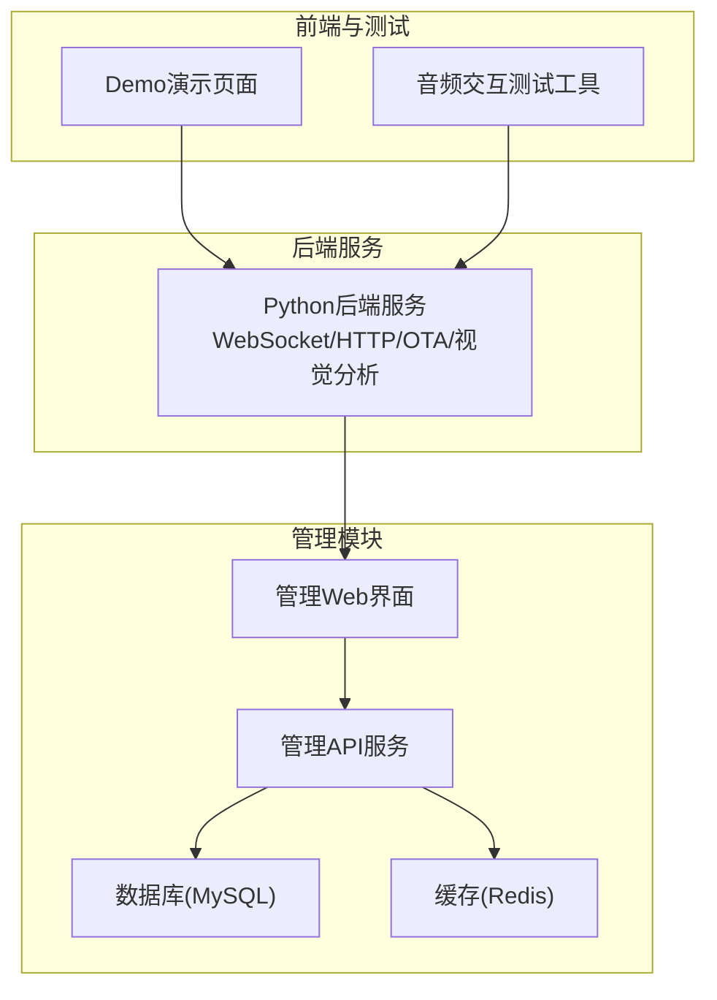
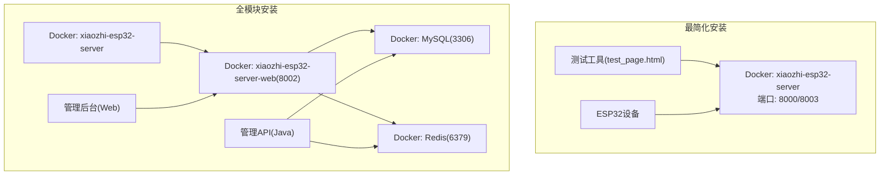
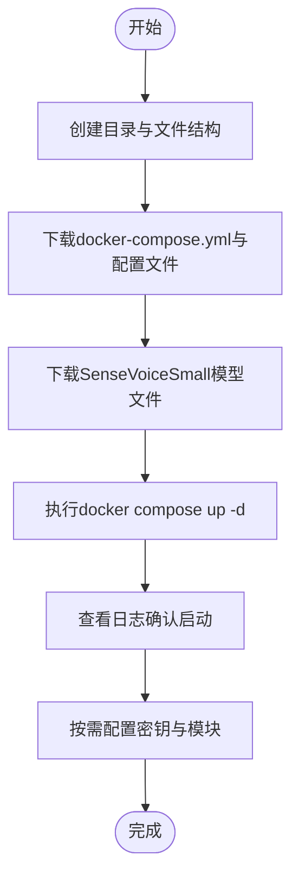
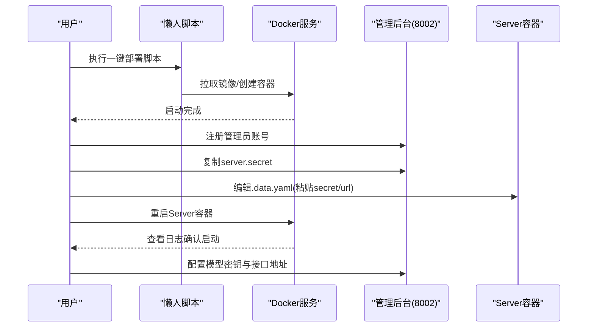
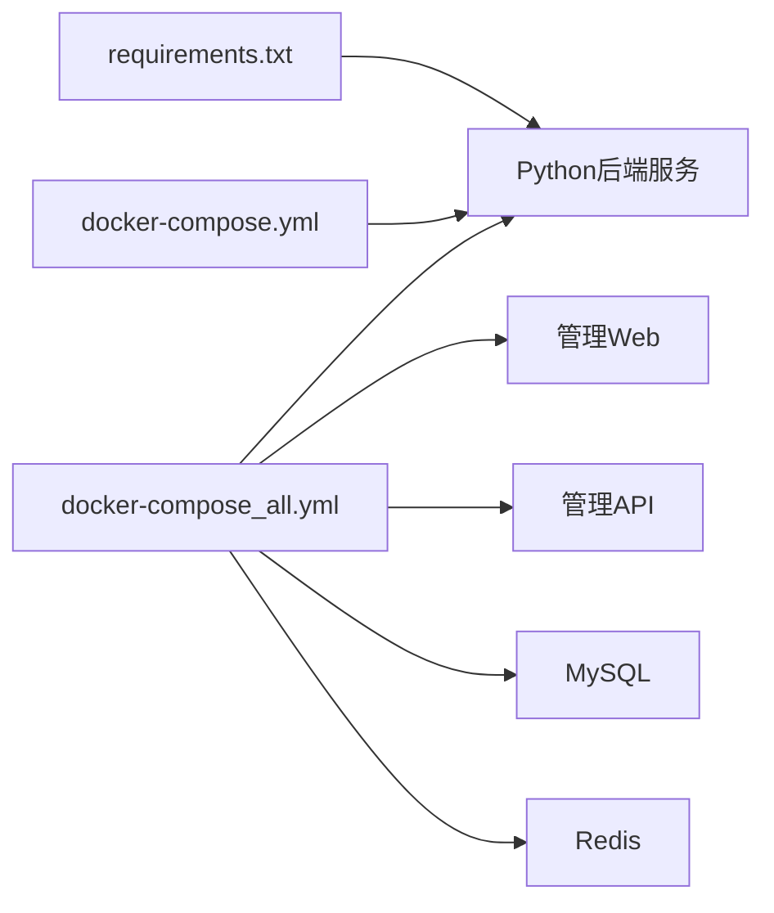

# 快速开始

<cite>
**本文引用的文件**
- [README.md](file://README.md)
- [docker-setup.sh](file://docker-setup.sh)
- [Deployment.md](file://docs/Deployment.md)
- [Deployment_all.md](file://docs/Deployment_all.md)
- [docker-compose.yml](file://main/xiaozhi-server/docker-compose.yml)
- [docker-compose_all.yml](file://main/xiaozhi-server/docker-compose_all.yml)
- [requirements.txt](file://main/xiaozhi-server/requirements.txt)
- [app.py](file://main/xiaozhi-server/app.py)
- [config.yaml](file://main/xiaozhi-server/config.yaml)
- [config_from_api.yaml](file://main/xiaozhi-server/config_from_api.yaml)
- [performance_tester.py](file://main/xiaozhi-server/performance_tester.py)
- [test_page.html](file://main/xiaozhi-server/test/test_page.html)
- [index.html](file://main/demo-web/index.html)
</cite>

## 目录
1. [简介](#简介)
2. [项目结构](#项目结构)
3. [核心组件](#核心组件)
4. [架构总览](#架构总览)
5. [详细组件分析](#详细组件分析)
6. [依赖关系分析](#依赖关系分析)
7. [性能考量](#性能考量)
8. [故障排查指南](#故障排查指南)
9. [结论](#结论)
10. [附录](#附录)

## 简介
本指南面向首次接触小智ESP32服务器项目的用户，提供从零到一的完整安装与部署路径。项目支持两种部署方式：
- 最简化安装：仅运行Server，适合低配置环境与快速验证。
- 全模块安装：包含管理后台与数据库，适合完整功能体验与多用户管理。

同时，项目提供入门全免费配置与流式配置两种推荐方案，前者强调完全免费，后者强调响应速度与演示体验。文中将详细说明Docker部署与源码部署的步骤、环境要求、配置参数、启动流程、测试工具使用与系统验证方法，并为初学者与有经验用户提供清晰的操作指引与高级配置选项。

## 项目结构
项目由三层组成：
- Python后端服务（xiaozhi-server）：提供WebSocket、HTTP、OTA、视觉分析等核心能力。
- 管理后台（manager-web）与管理API（manager-api）：提供Web管理界面与后端服务。
- Demo前端（demo-web）：提供交互式演示页面与测试工具入口。

**图表来源**
- [docker-compose_all.yml:1-93](file://main/xiaozhi-server/docker-compose_all.yml#L1-L93)
- [docker-compose.yml:1-22](file://main/xiaozhi-server/docker-compose.yml#L1-L22)
- [index.html:1-399](file://main/demo-web/index.html#L1-L399)
- [test_page.html:1-348](file://main/xiaozhi-server/test/test_page.html#L1-L348)

**章节来源**
- [README.md:178-234](file://README.md#L178-L234)
- [docker-compose_all.yml:1-93](file://main/xiaozhi-server/docker-compose_all.yml#L1-L93)
- [docker-compose.yml:1-22](file://main/xiaozhi-server/docker-compose.yml#L1-L22)

## 核心组件
- WebSocket服务器：提供实时音频与消息通道，支持设备端连接与控制。
- HTTP服务器：提供OTA接口与视觉分析接口，便于设备升级与图像识别。
- 配置系统：支持本地配置与从管理API动态拉取配置，保障密钥与参数安全。
- 模块化组件：ASR、LLM、VLLM、TTS、VAD、记忆与意图识别等，均可按需切换。
- 管理后台：提供Web界面进行用户、设备、模型与参数管理。

**章节来源**
- [app.py:46-130](file://main/xiaozhi-server/app.py#L46-L130)
- [config.yaml:9-56](file://main/xiaozhi-server/config.yaml#L9-L56)
- [config_from_api.yaml:8-27](file://main/xiaozhi-server/config_from_api.yaml#L8-L27)

## 架构总览
下图展示了两种部署方式的典型拓扑与组件交互：

**图表来源**
- [docker-compose.yml:1-22](file://main/xiaozhi-server/docker-compose.yml#L1-L22)
- [docker-compose_all.yml:1-93](file://main/xiaozhi-server/docker-compose_all.yml#L1-L93)

## 详细组件分析

### 部署方式选择与适用场景
- 最简化安装：适合低配置环境、仅需智能对话与单智能体管理，无需数据库，配置文件可直接使用本地配置。
- 全模块安装：适合完整功能体验，包含多用户管理、多智能体管理与管理后台界面，数据持久化至数据库。

**章节来源**
- [README.md:182-189](file://README.md#L182-L189)

### Docker部署（最简化安装）
- 环境要求：Linux/Ubuntu，已安装Docker与Docker Compose。
- 步骤概览：
  1) 创建目录与data/models目录结构，下载docker-compose.yml与config.yaml（重命名为.data.yaml）。
  2) 下载SenseVoiceSmall模型文件model.pt至models/SenseVoiceSmall。
  3) 执行docker compose up -d启动服务。
  4) 查看日志确认服务启动，按需配置密钥与模块。

**图表来源**
- [Deployment.md:13-93](file://docs/Deployment.md#L13-L93)

**章节来源**
- [Deployment.md:13-93](file://docs/Deployment.md#L13-L93)
- [docker-compose.yml:1-22](file://main/xiaozhi-server/docker-compose.yml#L1-L22)

### Docker部署（全模块安装）
- 环境要求：Linux/Ubuntu，已安装Docker与Docker Compose。
- 步骤概览：
  1) 使用懒人脚本一键部署或手动下载docker-compose_all.yml与config_from_api.yaml。
  2) 启动容器后，使用浏览器打开管理后台，注册管理员账号。
  3) 在管理后台复制server.secret到.data.yaml的manager-api.secret。
  4) 修改manager-api.url为http://xiaozhi-esp32-server-web:8002/xiaozhi。
  5) 重启Server容器，查看日志确认启动。
  6) 在管理后台配置模型密钥与接口地址（server.websocket与server.ota）。

**图表来源**
- [docker-setup.sh:15-381](file://docker-setup.sh#L15-L381)
- [Deployment_all.md:15-182](file://docs/Deployment_all.md#L15-L182)

**章节来源**
- [docker-setup.sh:15-381](file://docker-setup.sh#L15-L381)
- [Deployment_all.md:15-182](file://docs/Deployment_all.md#L15-L182)

### 源码部署（最简化安装）
- 环境要求：Python 3.10+，安装依赖requirements.txt，准备libopus与ffmpeg。
- 步骤概览：
  1) 下载源码，创建conda环境并安装依赖。
  2) 下载SenseVoiceSmall模型文件model.pt。
  3) 配置config.yaml（或.data.yaml），选择模块与密钥。
  4) 运行python app.py，查看日志确认启动。

**章节来源**
- [Deployment.md:114-188](file://docs/Deployment.md#L114-L188)
- [requirements.txt:1-43](file://main/xiaozhi-server/requirements.txt#L1-L43)
- [app.py:46-130](file://main/xiaozhi-server/app.py#L46-L130)

### 源码部署（全模块安装）
- 环境要求：JDK 21+、Maven、MySQL、Redis。
- 步骤概览：
  1) 启动MySQL与Redis容器或本地实例。
  2) 运行manager-api（Spring Boot）与manager-web（Vue）。
  3) 在管理后台注册管理员，配置模型密钥。
  4) 在.data.yaml中配置manager-api.url与secret。
  5) 运行python app.py，查看日志确认启动。

**章节来源**
- [Deployment_all.md:230-462](file://docs/Deployment_all.md#L230-L462)

### 配置说明与推荐设置
- 入门全免费配置：所有组件采用免费方案，适合个人家庭使用。
- 流式配置：采用流式处理技术，响应速度更快，适合演示、培训与高并发场景。
- 关键配置项：
  - server.websocket：设备侧连接的WebSocket地址。
  - server.ota：OTA升级接口地址。
  - manager-api.url与secret：管理后台连接参数。
  - selected_module：选择ASR/LLM/VLLM/TTS等模块与具体提供商。
  - 各模块的api_key或鉴权参数。

**章节来源**
- [README.md:203-222](file://README.md#L203-L222)
- [config_from_api.yaml:8-27](file://main/xiaozhi-server/config_from_api.yaml#L8-L27)
- [config.yaml:219-238](file://main/xiaozhi-server/config.yaml#L219-L238)

### 测试工具使用与系统验证
- 音频交互测试工具：使用Chrome浏览器打开test目录下的test_page.html，验证音频播放与接收功能。
- 模型响应测试工具：执行performance_tester.py，选择相应模块进行ASR/LLM/VLLM/TTS性能测试。
- 日志验证：查看启动日志中输出的OTA与WebSocket地址，确认服务正常启动。

**章节来源**
- [README.md:224-233](file://README.md#L224-L233)
- [test_page.html:1-348](file://main/xiaozhi-server/test/test_page.html#L1-L348)
- [performance_tester.py:1-70](file://main/xiaozhi-server/performance_tester.py#L1-L70)
- [app.py:85-130](file://main/xiaozhi-server/app.py#L85-L130)

## 依赖关系分析
- Python后端依赖：通过requirements.txt统一管理，包含ASR、LLM、TTS、VAD、记忆、工具调用等模块。
- Docker编排：docker-compose.yml与docker-compose_all.yml分别定义最简化与全模块的容器依赖关系与端口映射。
- 管理后台：依赖MySQL与Redis，提供Web界面与API服务，供Python后端动态拉取配置。

**图表来源**
- [requirements.txt:1-43](file://main/xiaozhi-server/requirements.txt#L1-L43)
- [docker-compose.yml:1-22](file://main/xiaozhi-server/docker-compose.yml#L1-L22)
- [docker-compose_all.yml:1-93](file://main/xiaozhi-server/docker-compose_all.yml#L1-L93)

**章节来源**
- [requirements.txt:1-43](file://main/xiaozhi-server/requirements.txt#L1-L43)
- [docker-compose.yml:1-22](file://main/xiaozhi-server/docker-compose.yml#L1-L22)
- [docker-compose_all.yml:1-93](file://main/xiaozhi-server/docker-compose_all.yml#L1-L93)

## 性能考量
- 流式配置相较早期版本可显著降低响应延迟，提升用户体验。
- 模块选择与密钥配置直接影响性能与稳定性，建议结合实际硬件与并发需求选择合适方案。
- 可使用性能测试工具对各模块进行基准测试，以便优化配置与资源分配。

**章节来源**
- [README.md:203-222](file://README.md#L203-L222)
- [performance_tester.py:1-70](file://main/xiaozhi-server/performance_tester.py#L1-L70)

## 故障排查指南
- file://协议限制：测试页面若使用file://协议打开，浏览器会限制功能，需通过HTTP服务器启动（如Python内置HTTP服务）。
- Docker镜像拉取失败：可更换国内镜像源或使用懒人脚本自动配置镜像源。
- 端口冲突：确保8000、8002、8003、3306、6379等端口未被占用。
- 权限问题：懒人脚本要求root权限执行，Docker需在非root用户组中正确配置。
- 模块密钥缺失：性能测试与功能验证需配置对应模块的API密钥。

**章节来源**
- [test_page.html:8-36](file://main/xiaozhi-server/test/test_page.html#L8-L36)
- [docker-setup.sh:78-94](file://docker-setup.sh#L78-L94)
- [Deployment_all.md:105-126](file://docs/Deployment_all.md#L105-L126)

## 结论
通过本快速开始指南，您可以在最短时间内完成小智ESP32服务器的部署与验证。建议初学者从最简化安装入手，快速验证核心功能；有经验用户可直接选择全模块安装，并结合懒人脚本与管理后台完成密钥与接口配置。在部署完成后，使用测试工具与日志验证确保系统稳定运行，并根据实际场景选择入门全免费或流式配置方案。

## 附录
- Demo演示页面：提供交互式场景与工具入口，便于快速体验。
- 常见问题与拓展教程：可在项目文档中查阅更多部署与集成细节。

**章节来源**
- [index.html:1-399](file://main/demo-web/index.html#L1-L399)
- [README.md:262-283](file://README.md#L262-L283)