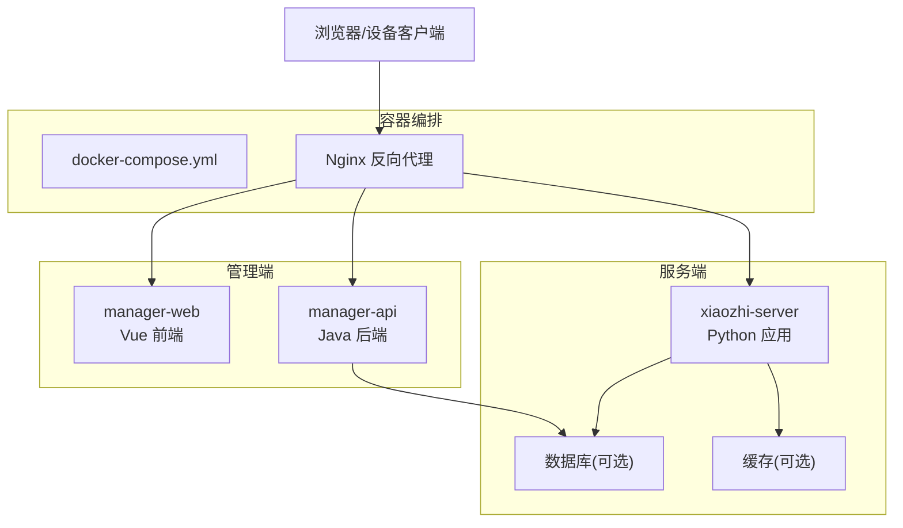
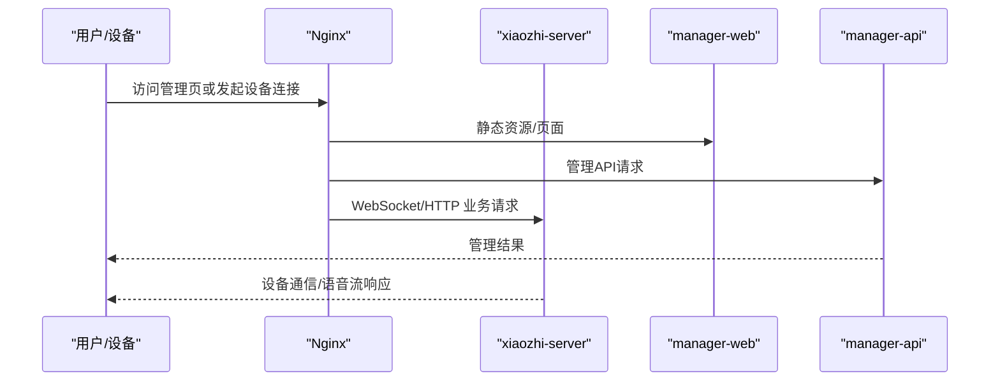
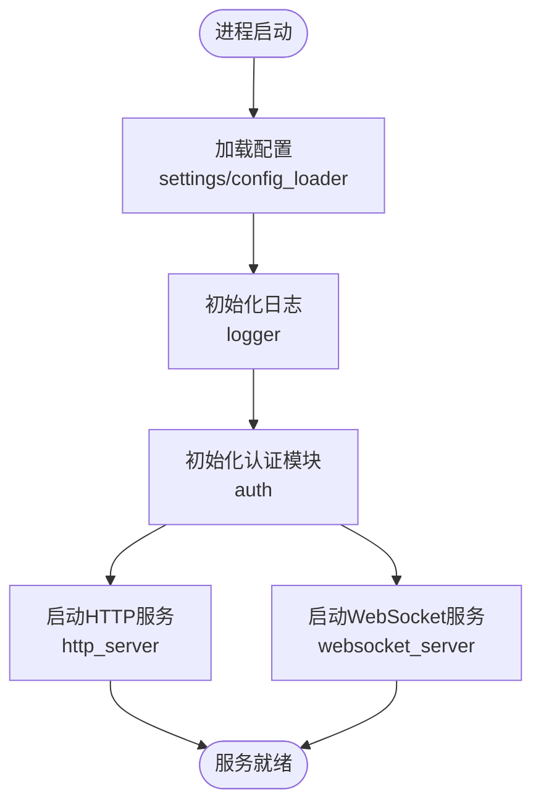
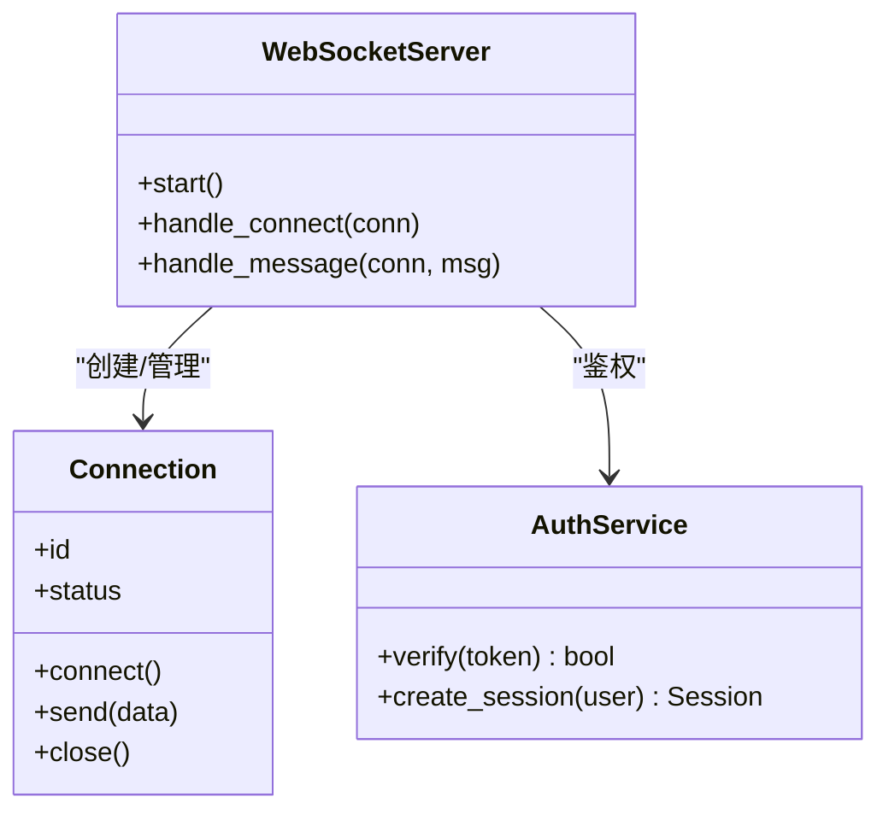
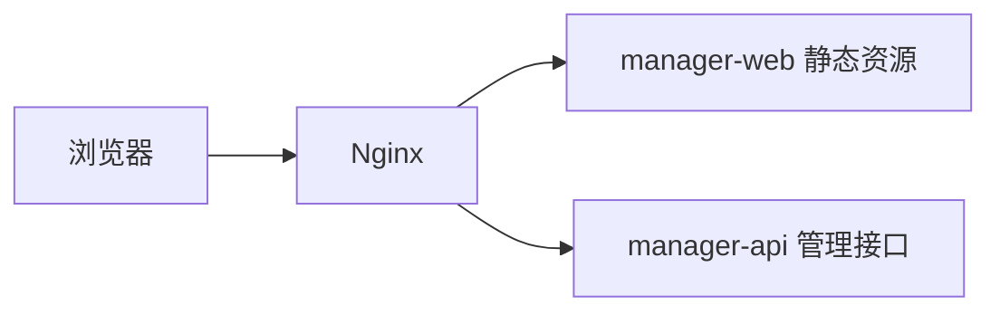
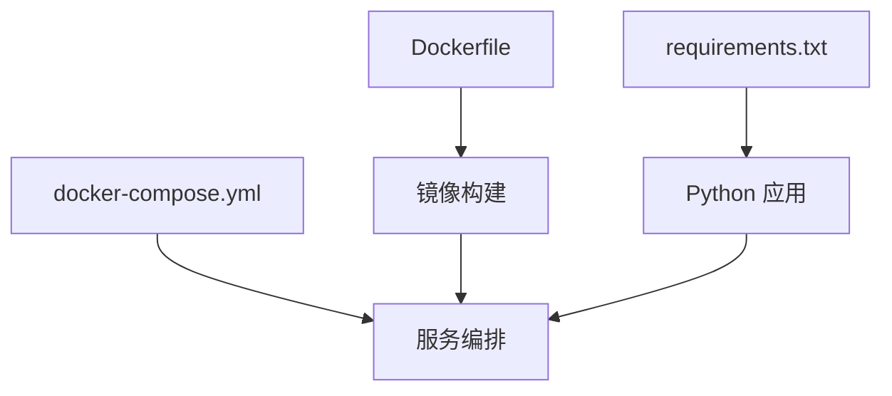

# 快速开始

<cite>
**本文引用的文件**   
- [README.md](file://README.md)
- [docker-setup.sh](file://docker-setup.sh)
- [main/xiaozhi-server/docker-compose.yml](file://main/xiaozhi-server/docker-compose.yml)
- [main/xiaozhi-server/Dockerfile](file://main/xiaozhi-server/Dockerfile)
- [main/xiaozhi-server/app.py](file://main/xiaozhi-server/app.py)
- [main/xiaozhi-server/start.sh](file://main/xiaozhi-server/start.sh)
- [main/xiaozhi-server/requirements.txt](file://main/xiaozhi-server/requirements.txt)
- [main/xiaozhi-server/config/settings.py](file://main/xiaozhi-server/config/settings.py)
- [main/xiaozhi-server/config/logger.py](file://main/xiaozhi-server/config/logger.py)
- [main/xiaozhi-server/core/http_server.py](file://main/xiaozhi-server/core/http_server.py)
- [main/xiaozhi-server/core/websocket_server.py](file://main/xiaozhi-server/core/websocket_server.py)
- [main/xiaozhi-server/core/connection.py](file://main/xiaozhi-server/core/connection.py)
- [main/xiaozhi-server/core/auth.py](file://main/xiaozhi-server/core/auth.py)
- [main/xiaozhi-server/config/config_loader.py](file://main/xiaozhi-server/config/config_loader.py)
- [main/xiaozhi-server/config/manage_api_client.py](file://main/xiaozhi-server/config/manage_api_client.py)
- [main/manager-web/Dockerfile](file://main/manager-web/Dockerfile)
- [main/manager-api/Dockerfile](file://main/manager-api/Dockerfile)
- [docs/docker/nginx.conf](file://docs/docker/nginx.conf)
- [docs/docker/start.sh](file://docs/docker/start.sh)
- [docs/firmware-build.md](file://docs/firmware-build.md)
- [docs/firmware-setting.md](file://docs/firmware-setting.md)
</cite>

## 目录
1. [简介](#简介)
2. [项目结构](#项目结构)
3. [核心组件](#核心组件)
4. [架构总览](#架构总览)
5. [详细组件分析](#详细组件分析)
6. [依赖关系分析](#依赖关系分析)
7. [性能注意事项](#性能注意事项)
8. [故障排查指南](#故障排查指南)
9. [结论](#结论)
10. [附录](#附录)

## 简介
本快速开始指南面向首次接触 xiaozhi-esp32-server 的用户，目标是帮助你在最短时间内完成环境准备、安装与部署，并成功运行核心功能。内容涵盖：
- Docker 一键部署（推荐）
- 本地开发环境搭建（Python + 前端）
- 基础配置示例与验证方法
- 常见问题与排错建议

## 项目结构
仓库采用多模块组织方式，核心服务位于 main/xiaozhi-server，管理端 Web 与管理 API 分别位于 main/manager-web 与 main/manager-api，Docker 相关脚本与文档集中在 docs 与根目录脚本中。

图表来源
- [main/xiaozhi-server/docker-compose.yml](file://main/xiaozhi-server/docker-compose.yml)
- [docs/docker/nginx.conf](file://docs/docker/nginx.conf)
- [main/manager-web/Dockerfile](file://main/manager-web/Dockerfile)
- [main/manager-api/Dockerfile](file://main/manager-api/Dockerfile)

章节来源
- [README.md](file://README.md)
- [main/xiaozhi-server/docker-compose.yml](file://main/xiaozhi-server/docker-compose.yml)

## 核心组件
- xiaozhi-server：核心 Python 服务，提供 HTTP/WebSocket 接口、设备连接、语音处理管线等能力。
- manager-web：管理端前端（Vue），用于设备与模型配置、日志查看等。
- manager-api：管理端后端（Java），提供管理 API。
- 容器化与编排：通过 docker-compose 统一拉起各服务，使用 Nginx 做反向代理。

章节来源
- [main/xiaozhi-server/app.py](file://main/xiaozhi-server/app.py)
- [main/xiaozhi-server/core/http_server.py](file://main/xiaozhi-server/core/http_server.py)
- [main/xiaozhi-server/core/websocket_server.py](file://main/xiaozhi-server/core/websocket_server.py)
- [main/manager-web/Dockerfile](file://main/manager-web/Dockerfile)
- [main/manager-api/Dockerfile](file://main/manager-api/Dockerfile)

## 架构总览
下图展示了从浏览器/设备到各服务的请求路径与交互关系。

图表来源
- [docs/docker/nginx.conf](file://docs/docker/nginx.conf)
- [main/xiaozhi-server/core/http_server.py](file://main/xiaozhi-server/core/http_server.py)
- [main/xiaozhi-server/core/websocket_server.py](file://main/xiaozhi-server/core/websocket_server.py)
- [main/manager-web/Dockerfile](file://main/manager-web/Dockerfile)
- [main/manager-api/Dockerfile](file://main/manager-api/Dockerfile)

## 详细组件分析

### 服务端启动流程（xiaozhi-server）
- 入口程序负责加载配置、初始化日志、启动 HTTP 与 WebSocket 服务。
- 配置文件由配置加载器统一读取，支持环境变量覆盖。
- 认证模块负责鉴权与会话管理。

图表来源
- [main/xiaozhi-server/app.py](file://main/xiaozhi-server/app.py)
- [main/xiaozhi-server/start.sh](file://main/xiaozhi-server/start.sh)
- [main/xiaozhi-server/config/settings.py](file://main/xiaozhi-server/config/settings.py)
- [main/xiaozhi-server/config/config_loader.py](file://main/xiaozhi-server/config/config_loader.py)
- [main/xiaozhi-server/config/logger.py](file://main/xiaozhi-server/config/logger.py)
- [main/xiaozhi-server/core/auth.py](file://main/xiaozhi-server/core/auth.py)
- [main/xiaozhi-server/core/http_server.py](file://main/xiaozhi-server/core/http_server.py)
- [main/xiaozhi-server/core/websocket_server.py](file://main/xiaozhi-server/core/websocket_server.py)

章节来源
- [main/xiaozhi-server/app.py](file://main/xiaozhi-server/app.py)
- [main/xiaozhi-server/start.sh](file://main/xiaozhi-server/start.sh)
- [main/xiaozhi-server/config/settings.py](file://main/xiaozhi-server/config/settings.py)
- [main/xiaozhi-server/config/config_loader.py](file://main/xiaozhi-server/config/config_loader.py)
- [main/xiaozhi-server/config/logger.py](file://main/xiaozhi-server/config/logger.py)
- [main/xiaozhi-server/core/auth.py](file://main/xiaozhi-server/core/auth.py)
- [main/xiaozhi-server/core/http_server.py](file://main/xiaozhi-server/core/http_server.py)
- [main/xiaozhi-server/core/websocket_server.py](file://main/xiaozhi-server/core/websocket_server.py)

### 设备连接与消息处理
- 设备通过 WebSocket 接入，服务端建立连接后进入消息处理循环。
- 连接对象维护会话状态、音频流与文本消息路由。

图表来源
- [main/xiaozhi-server/core/connection.py](file://main/xiaozhi-server/core/connection.py)
- [main/xiaozhi-server/core/websocket_server.py](file://main/xiaozhi-server/core/websocket_server.py)
- [main/xiaozhi-server/core/auth.py](file://main/xiaozhi-server/core/auth.py)

章节来源
- [main/xiaozhi-server/core/connection.py](file://main/xiaozhi-server/core/connection.py)
- [main/xiaozhi-server/core/websocket_server.py](file://main/xiaozhi-server/core/websocket_server.py)
- [main/xiaozhi-server/core/auth.py](file://main/xiaozhi-server/core/auth.py)

### 管理端与 API
- manager-web 为 Vue 前端，构建产物由 Dockerfile 打包。
- manager-api 提供管理接口，供前端调用。

图表来源
- [main/manager-web/Dockerfile](file://main/manager-web/Dockerfile)
- [main/manager-api/Dockerfile](file://main/manager-api/Dockerfile)
- [docs/docker/nginx.conf](file://docs/docker/nginx.conf)

章节来源
- [main/manager-web/Dockerfile](file://main/manager-web/Dockerfile)
- [main/manager-api/Dockerfile](file://main/manager-api/Dockerfile)
- [docs/docker/nginx.conf](file://docs/docker/nginx.conf)

## 依赖关系分析
- Python 依赖：由 requirements.txt 声明，包含网络、语音处理、异步框架等库。
- 容器镜像：Dockerfile 定义构建步骤与运行时依赖。
- 编排：docker-compose.yml 统一管理服务端口、卷挂载与环境变量。

图表来源
- [main/xiaozhi-server/requirements.txt](file://main/xiaozhi-server/requirements.txt)
- [main/xiaozhi-server/Dockerfile](file://main/xiaozhi-server/Dockerfile)
- [main/xiaozhi-server/docker-compose.yml](file://main/xiaozhi-server/docker-compose.yml)

章节来源
- [main/xiaozhi-server/requirements.txt](file://main/xiaozhi-server/requirements.txt)
- [main/xiaozhi-server/Dockerfile](file://main/xiaozhi-server/Dockerfile)
- [main/xiaozhi-server/docker-compose.yml](file://main/xiaozhi-server/docker-compose.yml)

## 性能注意事项
- 合理设置并发与线程池参数，避免高负载下阻塞。
- 对 I/O 密集型操作启用异步与连接池。
- 日志级别在生产环境调低，减少磁盘写入开销。
- 缓存热点数据，降低外部服务压力。

## 故障排查指南
- 启动失败
  - 检查端口占用与防火墙策略。
  - 确认环境变量与配置文件路径正确。
  - 查看服务日志定位错误堆栈。
- 设备无法连接
  - 校验 WebSocket 地址与鉴权令牌。
  - 检查 Nginx 反向代理规则与超时设置。
- 管理端不可用
  - 确认 manager-web 静态资源与 manager-api 可达。
  - 核对跨域与 Cookie/Session 配置。

章节来源
- [main/xiaozhi-server/config/logger.py](file://main/xiaozhi-server/config/logger.py)
- [docs/docker/nginx.conf](file://docs/docker/nginx.conf)
- [main/xiaozhi-server/core/auth.py](file://main/xiaozhi-server/core/auth.py)

## 结论
通过 Docker 一键部署可快速体验 xiaozhi-esp32-server 的核心能力；如需二次开发，可在本地基于 Python 与前端工程进行增量调试。建议优先使用容器化方案，再按需切换至本地开发模式。

## 附录

### 一、Docker 部署（推荐）
- 前置条件
  - 已安装 Docker 与 docker-compose。
- 拉取与启动
  - 使用仓库提供的脚本或 compose 文件直接拉起服务。
- 常用命令
  - 启动：在 main/xiaozhi-server 目录下执行编排命令。
  - 停止：停止并清理容器与网络。
  - 查看日志：按服务名查看实时日志。
- 验证
  - 浏览器访问管理端页面（默认端口见 compose）。
  - 使用设备或测试工具连接 WebSocket 端点。

章节来源
- [docker-setup.sh](file://docker-setup.sh)
- [main/xiaozhi-server/docker-compose.yml](file://main/xiaozhi-server/docker-compose.yml)
- [docs/docker/start.sh](file://docs/docker/start.sh)

### 二、本地开发环境搭建
- Python 环境
  - 安装 Python 版本与虚拟环境。
  - 安装依赖：pip install -r requirements.txt。
- 启动服务
  - 使用 start.sh 或直接运行 app.py。
  - 配置环境变量与配置文件路径。
- 前端开发
  - manager-web：安装依赖后启动开发服务器。
  - 配置代理指向 manager-api 与 xiaozhi-server。

章节来源
- [main/xiaozhi-server/requirements.txt](file://main/xiaozhi-server/requirements.txt)
- [main/xiaozhi-server/start.sh](file://main/xiaozhi-server/start.sh)
- [main/xiaozhi-server/app.py](file://main/xiaozhi-server/app.py)
- [main/manager-web/Dockerfile](file://main/manager-web/Dockerfile)

### 三、基础配置示例
- 关键配置项
  - 服务监听端口、日志级别、数据库/缓存连接串、鉴权密钥等。
- 配置来源
  - settings.py 与 config_loader.py 负责加载与合并配置。
  - 可通过环境变量覆盖默认值。
- 管理端与 API
  - 确保 manager-web 与 manager-api 的域名/端口映射正确。

章节来源
- [main/xiaozhi-server/config/settings.py](file://main/xiaozhi-server/config/settings.py)
- [main/xiaozhi-server/config/config_loader.py](file://main/xiaozhi-server/config/config_loader.py)
- [main/xiaozhi-server/config/manage_api_client.py](file://main/xiaozhi-server/config/manage_api_client.py)

### 四、固件与设备侧说明
- 固件构建与烧录参考文档。
- 设备网络与服务器地址配置要点。

章节来源
- [docs/firmware-build.md](file://docs/firmware-build.md)
- [docs/firmware-setting.md](file://docs/firmware-setting.md)

### 五、验证清单
- 服务健康检查
  - HTTP 健康端点返回正常。
  - WebSocket 握手成功。
- 管理端可用性
  - 登录成功，设备列表可见。
- 端到端通话
  - 设备连接后能发送/接收语音数据。

章节来源
- [main/xiaozhi-server/core/http_server.py](file://main/xiaozhi-server/core/http_server.py)
- [main/xiaozhi-server/core/websocket_server.py](file://main/xiaozhi-server/core/websocket_server.py)
- [docs/docker/nginx.conf](file://docs/docker/nginx.conf)