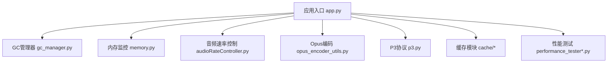
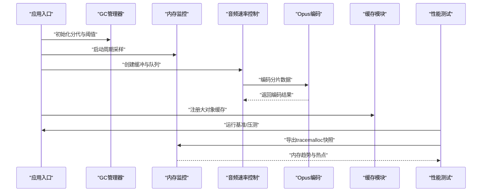
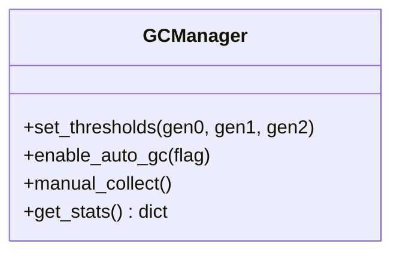
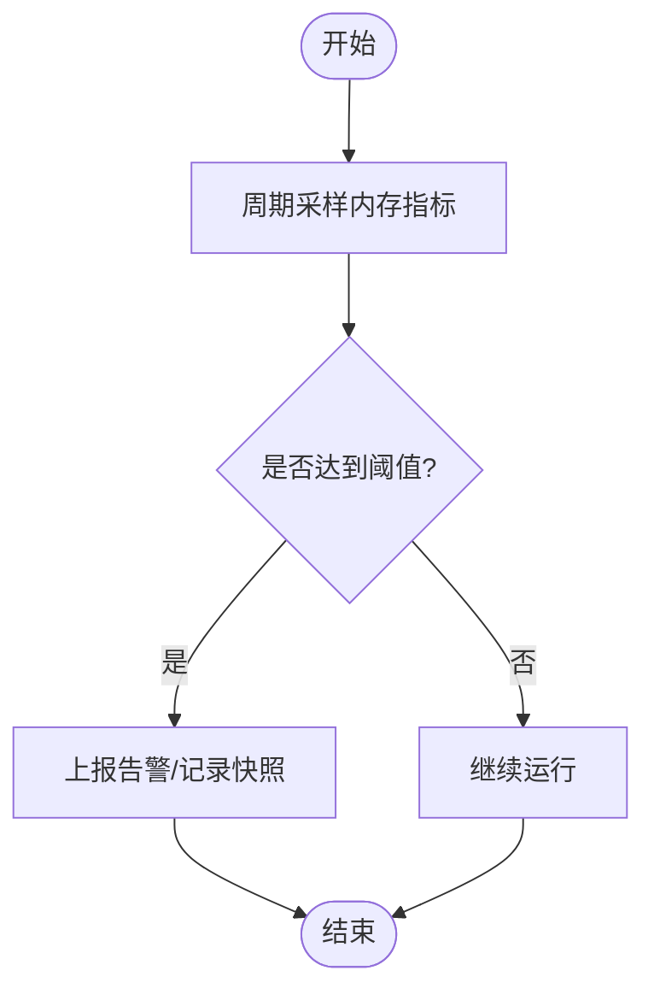
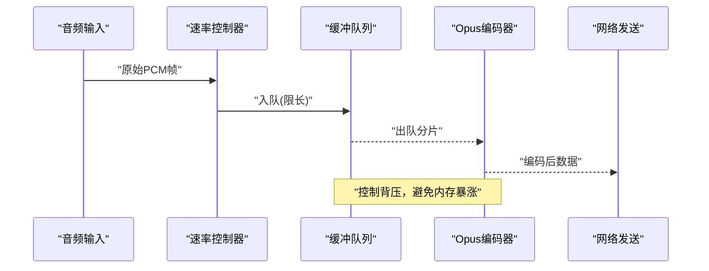
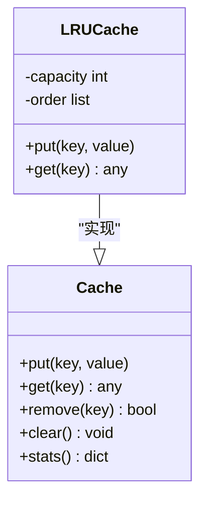
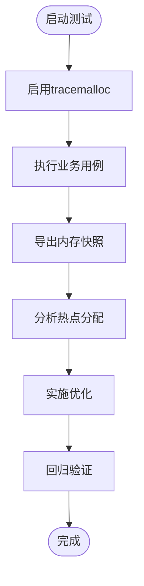
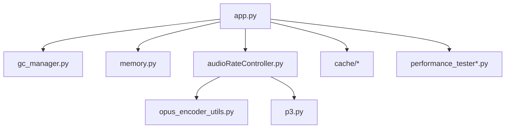

# 内存优化

<cite>
**本文引用的文件**   
- [app.py](file://main/xiaozhi-server/app.py)
- [gc_manager.py](file://main/xiaozhi-server/core/utils/gc_manager.py)
- [memory.py](file://main/xiaozhi-server/core/utils/memory.py)
- [audioRateController.py](file://main/xiaozhi-server/core/utils/audioRateController.py)
- [opus_encoder_utils.py](file://main/xiaozhi-server/core/utils/opus_encoder_utils.py)
- [p3.py](file://main/xiaozhi-server/core/utils/p3.py)
- [cache/__init__.py](file://main/xiaozhi-server/core/utils/cache/__init__.py)
- [performance_tester.py](file://main/xiaozhi-server/performance_tester.py)
- [performance_tester_asr.py](file://main/xiaozhi-server/performance_tester/performance_tester_asr.py)
- [performance_tester_tts.py](file://main/xiaozhi-server/performance_tester/performance_tester_tts.py)
- [performance_tester_stream_asr.py](file://main/xiaozhi-server/performance_tester/performance_tester_stream_asr.py)
- [performance_tester_stream_tts.py](file://main/xiaozhi-server/performance_tester/performance_tester_stream_tts.py)
- [performance_tester_llm.py](file://main/xiaozhi-server/performance_tester/performance_tester_llm.py)
- [performance_tester_vllm.py](file://main/xiaozhi-server/performance_tester/performance_tester_vllm.py)
</cite>

## 目录
1. [简介](#简介)
2. [项目结构](#项目结构)
3. [核心组件](#核心组件)
4. [架构总览](#架构总览)
5. [详细组件分析](#详细组件分析)
6. [依赖关系分析](#依赖关系分析)
7. [性能考量](#性能考量)
8. [故障排查指南](#故障排查指南)
9. [结论](#结论)
10. [附录](#附录)

## 简介
本技术文档聚焦于Python内存优化，围绕以下目标展开：
- Python垃圾回收机制调优：分代GC策略、触发阈值调整、内存碎片整理。
- 对象池技术应用：大对象缓存、音频缓冲区管理、临时对象复用。
- 内存泄漏检测与预防：引用计数监控、循环引用处理、弱引用使用。
- 内存使用分析与优化工具：memory_profiler、tracemalloc等工具的实际应用案例。

本项目为语音交互服务端（xiaozhi-server），涉及大量音频流处理、ASR/TTS调用、LLM推理以及WebSocket长连接，内存压力主要来自：
- 音频缓冲与编解码中间态数据
- 模型加载与大对象缓存
- 高并发下的临时对象分配与释放
- 外部库（如PyTorch、ONNX Runtime）的显存/进程内内存占用

## 项目结构
与内存优化相关的核心代码集中在 main/xiaozhi-server 目录下，关键路径包括：
- core/utils/gc_manager.py：GC管理器，封装分代与阈值控制
- core/utils/memory.py：内存监控与统计
- core/utils/audioRateController.py：音频速率控制与缓冲管理
- core/utils/opus_encoder_utils.py：Opus编码器工具，涉及音频编码缓冲
- core/utils/p3.py：P3协议相关的数据缓冲与解析
- core/utils/cache/*：通用缓存模块（可用于大对象缓存与对象池）
- performance_tester*：性能测试脚本，可结合tracemalloc进行内存剖析

图表来源 
- [app.py:1-200](file://main/xiaozhi-server/app.py#L1-L200)
- [gc_manager.py:1-200](file://main/xiaozhi-server/core/utils/gc_manager.py#L1-L200)
- [memory.py:1-200](file://main/xiaozhi-server/core/utils/memory.py#L1-L200)
- [audioRateController.py:1-200](file://main/xiaozhi-server/core/utils/audioRateController.py#L1-L200)
- [opus_encoder_utils.py:1-200](file://main/xiaozhi-server/core/utils/opus_encoder_utils.py#L1-L200)
- [p3.py:1-200](file://main/xiaozhi-server/core/utils/p3.py#L1-L200)
- [cache/__init__.py:1-200](file://main/xiaozhi-server/core/utils/cache/__init__.py#L1-L200)
- [performance_tester.py:1-200](file://main/xiaozhi-server/performance_tester.py#L1-L200)

章节来源
- [app.py:1-200](file://main/xiaozhi-server/app.py#L1-L200)
- [gc_manager.py:1-200](file://main/xiaozhi-server/core/utils/gc_manager.py#L1-L200)
- [memory.py:1-200](file://main/xiaozhi-server/core/utils/memory.py#L1-L200)
- [audioRateController.py:1-200](file://main/xiaozhi-server/core/utils/audioRateController.py#1-L200)
- [opus_encoder_utils.py:1-200](file://main/xiaozhi-server/core/utils/opus_encoder_utils.py#L1-L200)
- [p3.py:1-200](file://main/xiaozhi-server/core/utils/p3.py#L1-L200)
- [cache/__init__.py:1-200](file://main/xiaozhi-server/core/utils/cache/__init__.py#L1-L200)
- [performance_tester.py:1-200](file://main/xiaozhi-server/performance_tester.py#L1-L200)

## 核心组件
- GC管理器（gc_manager.py）：提供分代GC开关、阈值配置、手动触发与统计上报能力，便于在生产环境按需调优。
- 内存监控（memory.py）：封装psutil或内置统计接口，输出RSS、堆大小、对象计数等指标，支持周期性上报。
- 音频缓冲与速率控制（audioRateController.py、opus_encoder_utils.py、p3.py）：针对音频流的分片、缓冲、编码与传输，减少峰值内存占用。
- 缓存模块（cache/*）：实现LRU/固定容量缓存，用于大对象（如模型权重片段、常用模板）复用，降低频繁分配开销。
- 性能测试（performance_tester*.py）：集成tracemalloc，定位热点分配路径，辅助验证优化效果。

章节来源
- [gc_manager.py:1-200](file://main/xiaozhi-server/core/utils/gc_manager.py#L1-L200)
- [memory.py:1-200](file://main/xiaozhi-server/core/utils/memory.py#L1-L200)
- [audioRateController.py:1-200](file://main/xiaozhi-server/core/utils/audioRateController.py#L1-L200)
- [opus_encoder_utils.py:1-200](file://main/xiaozhi-server/core/utils/opus_encoder_utils.py#L1-L200)
- [p3.py:1-200](file://main/xiaozhi-server/core/utils/p3.py#L1-L200)
- [cache/__init__.py:1-200](file://main/xiaozhi-server/core/utils/cache/__init__.py#L1-L200)
- [performance_tester.py:1-200](file://main/xiaozhi-server/performance_tester.py#L1-L200)

## 架构总览
下图展示内存优化在整体服务中的位置与交互：应用启动时初始化GC与内存监控；音频链路通过速率控制器与编码器管理缓冲；缓存模块贯穿大对象复用；性能测试脚本用于验证与回归。

图表来源 
- [app.py:1-200](file://main/xiaozhi-server/app.py#L1-L200)
- [gc_manager.py:1-200](file://main/xiaozhi-server/core/utils/gc_manager.py#L1-L200)
- [memory.py:1-200](file://main/xiaozhi-server/core/utils/memory.py#L1-L200)
- [audioRateController.py:1-200](file://main/xiaozhi-server/core/utils/audioRateController.py#L1-L200)
- [opus_encoder_utils.py:1-200](file://main/xiaozhi-server/core/utils/opus_encoder_utils.py#L1-L200)
- [cache/__init__.py:1-200](file://main/xiaozhi-server/core/utils/cache/__init__.py#L1-L200)
- [performance_tester.py:1-200](file://main/xiaozhi-server/performance_tester.py#L1-L200)

## 详细组件分析

### GC管理器（gc_manager.py）
- 功能要点
  - 暴露分代阈值设置接口（如0/1/2代的对象数量阈值）
  - 提供手动触发GC的能力，避免在高负载期间频繁自动GC
  - 统计GC次数、耗时与回收对象数，便于观测
- 调优建议
  - 根据工作负载特征（短生命周期对象多 vs 长生命周期对象多）调整阈值
  - 在批处理或I/O密集阶段禁用自动GC，改为定时触发
  - 结合内存监控指标（RSS、堆大小）动态调节阈值

图表来源 
- [gc_manager.py:1-200](file://main/xiaozhi-server/core/utils/gc_manager.py#L1-L200)

章节来源
- [gc_manager.py:1-200](file://main/xiaozhi-server/core/utils/gc_manager.py#L1-L200)

### 内存监控（memory.py）
- 功能要点
  - 采集进程RSS、虚拟内存、堆大小、对象计数
  - 支持周期性上报与快照导出（可与tracemalloc配合）
- 使用建议
  - 将关键指标接入日志或监控系统（Prometheus/Grafana）
  - 在压测前后对比快照，识别异常增长

图表来源 
- [memory.py:1-200](file://main/xiaozhi-server/core/utils/memory.py#L1-L200)

章节来源
- [memory.py:1-200](file://main/xiaozhi-server/core/utils/memory.py#L1-L200)

### 音频缓冲与速率控制（audioRateController.py、opus_encoder_utils.py、p3.py）
- 功能要点
  - 音频分片缓冲：按帧/包切分，限制单缓冲大小，避免峰值内存
  - 速率控制：平滑输入输出速率，防止积压导致内存膨胀
  - 编码缓冲：复用编码器实例与内部缓冲，减少重复分配
  - P3协议：高效解析与序列化，避免中间字符串转换
- 优化策略
  - 使用固定大小的环形缓冲，限制最大长度
  - 批量编码与异步处理，降低锁竞争与上下文切换
  - 及时释放不再使用的中间数组（如numpy数组）

图表来源 
- [audioRateController.py:1-200](file://main/xiaozhi-server/core/utils/audioRateController.py#L1-L200)
- [opus_encoder_utils.py:1-200](file://main/xiaozhi-server/core/utils/opus_encoder_utils.py#L1-L200)
- [p3.py:1-200](file://main/xiaozhi-server/core/utils/p3.py#L1-L200)

章节来源
- [audioRateController.py:1-200](file://main/xiaozhi-server/core/utils/audioRateController.py#L1-L200)
- [opus_encoder_utils.py:1-200](file://main/xiaozhi-server/core/utils/opus_encoder_utils.py#L1-L200)
- [p3.py:1-200](file://main/xiaozhi-server/core/utils/p3.py#L1-L200)

### 缓存模块（cache/*）
- 功能要点
  - LRU/固定容量缓存，支持过期与淘汰策略
  - 线程安全访问，适用于多线程/协程场景
- 应用场景
  - 大对象缓存：模型权重片段、常用提示词模板
  - 对象池：音频编解码器实例、IO缓冲器
- 设计建议
  - 合理设置容量上限，避免缓存成为新的内存瓶颈
  - 对不可变对象采用共享引用，减少拷贝

图表来源 
- [cache/__init__.py:1-200](file://main/xiaozhi-server/core/utils/cache/__init__.py#L1-L200)

章节来源
- [cache/__init__.py:1-200](file://main/xiaozhi-server/core/utils/cache/__init__.py#L1-L200)

### 性能测试与tracemalloc（performance_tester*.py）
- 功能要点
  - 提供ASR/TTS/LLM/vLLM等场景的基准测试
  - 集成tracemalloc，生成内存分配快照与热点报告
- 使用方法
  - 运行对应测试脚本，观察内存曲线与峰值
  - 对比优化前后的分配热点，定位问题模块

图表来源 
- [performance_tester.py:1-200](file://main/xiaozhi-server/performance_tester.py#L1-L200)
- [performance_tester_asr.py:1-200](file://main/xiaozhi-server/performance_tester/performance_tester_asr.py#L1-L200)
- [performance_tester_tts.py:1-200](file://main/xiaozhi-server/performance_tester/performance_tester_tts.py#L1-L200)
- [performance_tester_stream_asr.py:1-200](file://main/xiaozhi-server/performance_tester/performance_tester_stream_asr.py#L1-L200)
- [performance_tester_stream_tts.py:1-200](file://main/xiaozhi-server/performance_tester/performance_tester_stream_tts.py#L1-L200)
- [performance_tester_llm.py:1-200](file://main/xiaozhi-server/performance_tester/performance_tester_llm.py#L1-L200)
- [performance_tester_vllm.py:1-200](file://main/xiaozhi-server/performance_tester/performance_tester_vllm.py#L1-L200)

章节来源
- [performance_tester.py:1-200](file://main/xiaozhi-server/performance_tester.py#L1-L200)
- [performance_tester_asr.py:1-200](file://main/xiaozhi-server/performance_tester/performance_tester_asr.py#L1-L200)
- [performance_tester_tts.py:1-200](file://main/xiaozhi-server/performance_tester/performance_tester_tts.py#L1-L200)
- [performance_tester_stream_asr.py:1-200](file://main/xiaozhi-server/performance_tester/performance_tester_stream_asr.py#L1-L200)
- [performance_tester_stream_tts.py:1-200](file://main/xiaozhi-server/performance_tester/performance_tester_stream_tts.py#L1-L200)
- [performance_tester_llm.py:1-200](file://main/xiaozhi-server/performance_tester/performance_tester_llm.py#L1-L200)
- [performance_tester_vllm.py:1-200](file://main/xiaozhi-server/performance_tester/performance_tester_vllm.py#L1-L200)

## 依赖关系分析
内存优化相关模块之间的依赖如下：
- 应用入口依赖GC管理器与内存监控
- 音频链路依赖速率控制、编码器与协议解析
- 缓存模块被多处复用，作为大对象与对象池的基础设施
- 性能测试脚本驱动各模块，收集指标并验证优化效果

图表来源 
- [app.py:1-200](file://main/xiaozhi-server/app.py#L1-L200)
- [gc_manager.py:1-200](file://main/xiaozhi-server/core/utils/gc_manager.py#L1-L200)
- [memory.py:1-200](file://main/xiaozhi-server/core/utils/memory.py#L1-L200)
- [audioRateController.py:1-200](file://main/xiaozhi-server/core/utils/audioRateController.py#L1-L200)
- [opus_encoder_utils.py:1-200](file://main/xiaozhi-server/core/utils/opus_encoder_utils.py#L1-L200)
- [p3.py:1-200](file://main/xiaozhi-server/core/utils/p3.py#L1-L200)
- [cache/__init__.py:1-200](file://main/xiaozhi-server/core/utils/cache/__init__.py#L1-L200)
- [performance_tester.py:1-200](file://main/xiaozhi-server/performance_tester.py#L1-L200)

章节来源
- [app.py:1-200](file://main/xiaozhi-server/app.py#L1-L200)
- [gc_manager.py:1-200](file://main/xiaozhi-server/core/utils/gc_manager.py#L1-L200)
- [memory.py:1-200](file://main/xiaozhi-server/core/utils/memory.py#L1-L200)
- [audioRateController.py:1-200](file://main/xiaozhi-server/core/utils/audioRateController.py#L1-L200)
- [opus_encoder_utils.py:1-200](file://main/xiaozhi-server/core/utils/opus_encoder_utils.py#L1-L200)
- [p3.py:1-200](file://main/xiaozhi-server/core/utils/p3.py#L1-L200)
- [cache/__init__.py:1-200](file://main/xiaozhi-server/core/utils/cache/__init__.py#L1-L200)
- [performance_tester.py:1-200](file://main/xiaozhi-server/performance_tester.py#L1-L200)

## 性能考量
- 分代GC调优
  - 短生命周期对象多：提高gen0阈值，减少频繁扫描
  - 长生命周期对象多：适当提升gen1/gen2阈值，避免过度压缩
- 内存碎片整理
  - 使用连续内存块（如bytearray/mmap）替代频繁小对象分配
  - 对大数组进行原地更新，避免多次扩容复制
- 对象池与缓存
  - 复用昂贵的对象（编码器、数据库连接、模型会话）
  - 设置合理的容量上限与淘汰策略，防止缓存膨胀
- 音频链路优化
  - 限制缓冲队列长度，采用背压机制
  - 批量编码与异步I/O，降低CPU与内存抖动

[本节为通用指导，不直接分析具体文件]

## 故障排查指南
- 内存泄漏检测
  - 使用tracemalloc捕获分配热点，对比优化前后差异
  - 结合memory_profiler对关键函数进行逐行内存分析
- 引用计数与循环引用
  - 检查是否存在强引用环（如回调闭包、事件总线）
  - 使用weakref打破循环引用，确保及时释放
- 常见症状
  - RSS持续增长且无回落
  - GC频率异常升高或长时间停顿
  - 音频卡顿与缓冲积压
- 排查步骤
  - 启动内存监控与GC统计
  - 运行性能测试脚本，导出快照
  - 定位热点模块，实施局部优化并回归验证

章节来源
- [memory.py:1-200](file://main/xiaozhi-server/core/utils/memory.py#L1-L200)
- [performance_tester.py:1-200](file://main/xiaozhi-server/performance_tester.py#L1-L200)

## 结论
通过对GC策略、对象池、音频缓冲与缓存模块的系统性优化，并结合tracemalloc与memory_profiler的持续验证，可在保证低延迟的同时显著降低内存峰值与长期占用。建议在生产环境建立常态化的内存监控与压测流程，确保优化效果稳定可靠。

[本节为总结性内容，不直接分析具体文件]

## 附录
- 实用命令与脚本
  - 运行ASR/TTS/LLM/vLLM性能测试：参考 performance_tester*.py
  - 启用tracemalloc：在测试脚本中开启并导出快照
  - 使用memory_profiler：对热点函数添加装饰器或命令行分析
- 最佳实践清单
  - 限制缓冲大小与队列长度
  - 复用昂贵对象，避免频繁创建销毁
  - 使用弱引用打破循环依赖
  - 定期导出内存快照，纳入监控体系

[本节为补充信息，不直接分析具体文件]