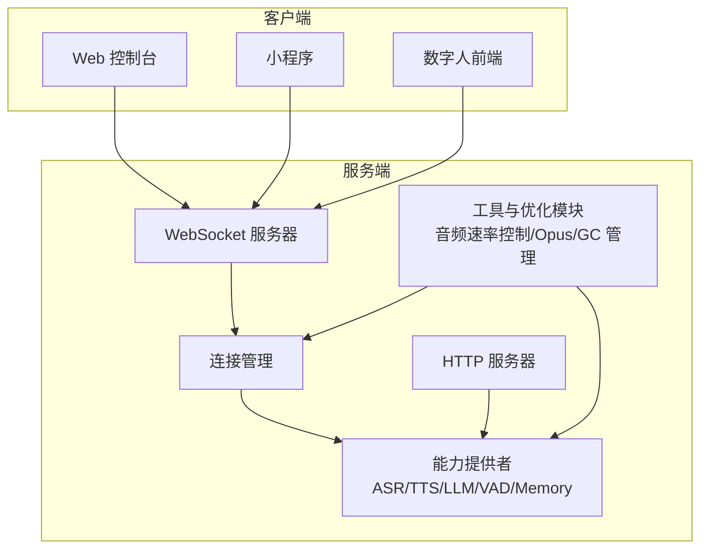
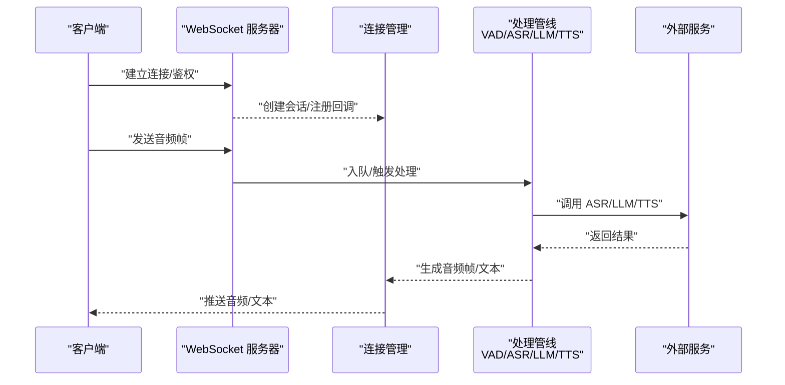
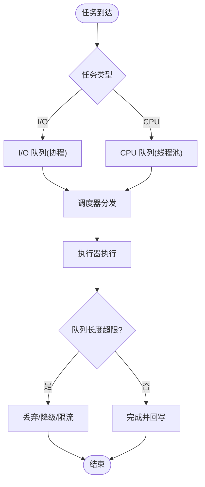
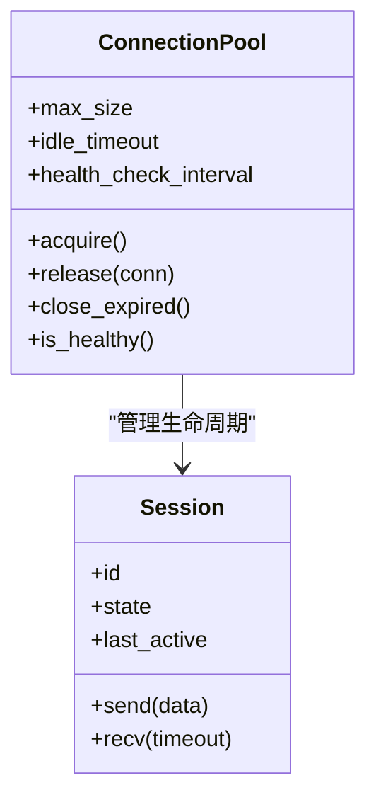
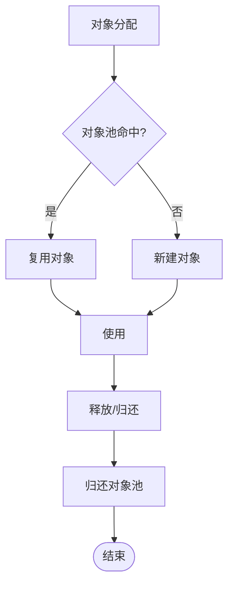
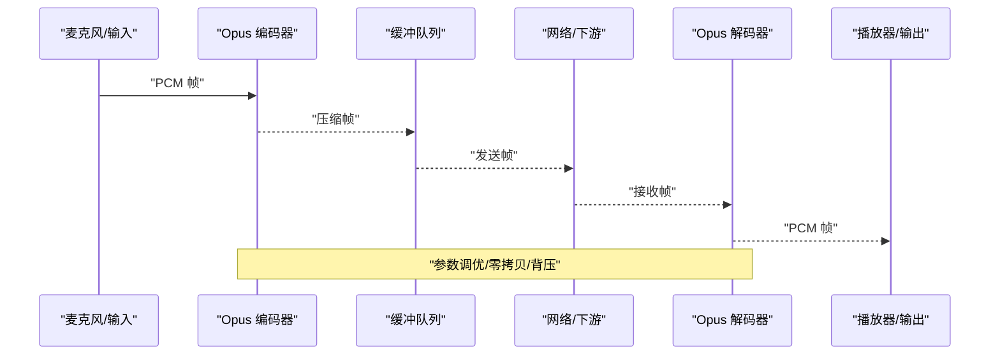
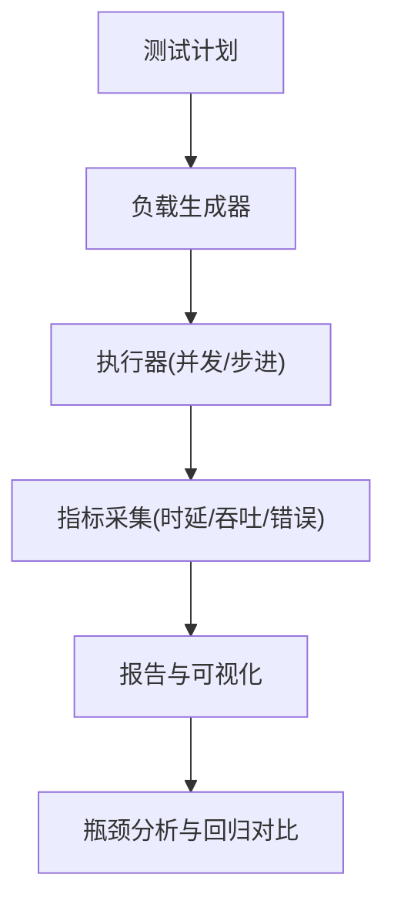
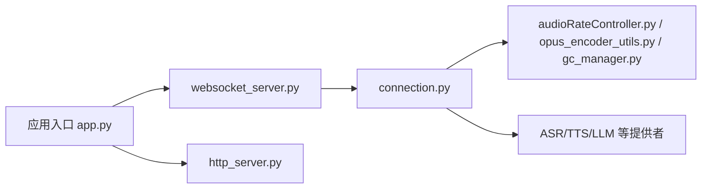

# 性能优化

<cite>
**本文引用的文件**   
- [thread-pool-and-connection-optimization.md](file://docs/custom/thread-pool-and-connection-optimization.md)
- [performance_tester.md](file://docs/performance_tester.md)
- [app.py](file://main/xiaozhi-server/app.py)
- [websocket_server.py](file://main/xiaozhi-server/core/websocket_server.py)
- [http_server.py](file://main/xiaozhi-server/core/http_server.py)
- [connection.py](file://main/xiaozhi-server/core/connection.py)
- [audioRateController.py](file://main/xiaozhi-server/core/utils/audioRateController.py)
- [opus_encoder_utils.py](file://main/xiaozhi-server/core/utils/opus_encoder_utils.py)
- [gc_manager.py](file://main/xiaozhi-server/core/utils/gc_manager.py)
- [performance_tester.py](file://main/xiaozhi-server/performance_tester.py)
- [performance_tester_asr.py](file://main/xiaozhi-server/performance_tester/performance_tester_asr.py)
- [performance_tester_tts.py](file://main/xiaozhi-server/performance_tester/performance_tester_tts.py)
- [performance_tester_stream_asr.py](file://main/xiaozhi-server/performance_tester/performance_tester_stream_asr.py)
- [performance_tester_stream_tts.py](file://main/xiaozhi-server/performance_tester/performance_tester_stream_tts.py)
- [performance_tester_llm.py](file://main/xiaozhi-server/performance_tester/performance_tester_llm.py)
- [performance_tester_vllm.py](file://main/xiaozhi-server/performance_tester/performance_tester_vllm.py)
</cite>

## 目录
1. [简介](#简介)
2. [项目结构](#项目结构)
3. [核心组件](#核心组件)
4. [架构总览](#架构总览)
5. [详细组件分析](#详细组件分析)
6. [依赖分析](#依赖分析)
7. [性能考量](#性能考量)
8. [故障排查指南](#故障排查指南)
9. [结论](#结论)
10. [附录](#附录)

## 简介
本技术文档围绕 xiaozhi-esp32-server 的性能优化展开，覆盖线程池与连接池优化、内存与垃圾回收调优、音频处理（编码/解码、缓冲区与实时性）、压测与基准测试方法、监控指标采集与瓶颈定位。目标是为工程团队提供可落地的优化策略与验证手段，兼顾高并发、低延迟与稳定性。

## 项目结构
本项目为多端协作的语音交互系统，后端服务位于 main/xiaozhi-server，包含 WebSocket/HTTP 服务、消息处理管线、ASR/TTS/LLM 等能力提供者以及性能测试工具集。前端与管理端分别位于 manager-web、manager-mobile、digital-human 等子模块。

**图表来源** 
- [websocket_server.py:1-200](file://main/xiaozhi-server/core/websocket_server.py#L1-L200)
- [http_server.py:1-200](file://main/xiaozhi-server/core/http_server.py#L1-L200)
- [connection.py:1-200](file://main/xiaozhi-server/core/connection.py#L1-L200)
- [audioRateController.py:1-200](file://main/xiaozhi-server/core/utils/audioRateController.py#L1-L200)
- [opus_encoder_utils.py:1-200](file://main/xiaozhi-server/core/utils/opus_encoder_utils.py#L1-L200)
- [gc_manager.py:1-200](file://main/xiaozhi-server/core/utils/gc_manager.py#L1-L200)

**章节来源**
- [app.py:1-200](file://main/xiaozhi-server/app.py#L1-L200)
- [websocket_server.py:1-200](file://main/xiaozhi-server/core/websocket_server.py#L1-L200)
- [http_server.py:1-200](file://main/xiaozhi-server/core/http_server.py#L1-L200)

## 核心组件
- 线程模型与任务调度：基于事件循环与协程的异步 I/O 模型，结合专用线程池执行 CPU 密集任务（如音频编解码、VAD/ASR/TTS 推理），避免阻塞主循环。
- 连接池与复用：通过连接管理器维护长连接与会话状态，支持连接复用、超时清理与健康检查，降低握手开销与资源泄漏风险。
- 音频处理流水线：Opus 编解码、采样率控制、缓冲队列与丢帧策略，保障端到端时延与音质平衡。
- 内存与 GC：对象池减少频繁分配，GC 阈值调优与引用清理，配合内存泄漏检测工具定位问题。
- 性能测试套件：覆盖 ASR/TTS/LLM/vLLM 的批量与流式压测，提供吞吐、时延、错误率等关键指标。

**章节来源**
- [thread-pool-and-connection-optimization.md:1-200](file://docs/custom/thread-pool-and-connection-optimization.md#L1-L200)
- [performance_tester.md:1-200](file://docs/performance_tester.md#L1-L200)
- [gc_manager.py:1-200](file://main/xiaozhi-server/core/utils/gc_manager.py#L1-L200)
- [audioRateController.py:1-200](file://main/xiaozhi-server/core/utils/audioRateController.py#L1-L200)
- [opus_encoder_utils.py:1-200](file://main/xiaozhi-server/core/utils/opus_encoder_utils.py#L1-L200)

## 架构总览
下图展示从客户端到服务端的核心调用链：客户端经 WebSocket 建立会话，连接管理器负责鉴权与会话路由；音频数据进入处理管线，依次经过 VAD、ASR、LLM、TTS，最终回写音频帧；HTTP 接口用于配置与监控。

**图表来源** 
- [websocket_server.py:1-200](file://main/xiaozhi-server/core/websocket_server.py#L1-L200)
- [connection.py:1-200](file://main/xiaozhi-server/core/connection.py#L1-L200)

## 详细组件分析

### 线程池与任务调度优化
- 线程模型选择：I/O 密集型使用事件循环+协程，CPU 密集型（编解码、推理）放入线程池，避免阻塞主循环。
- 任务调度算法：按优先级与公平性混合调度，热点任务快速通道，冷任务批处理；背压机制防止队列膨胀。
- 资源竞争避免：锁粒度细化、无锁队列、分片缓存；对共享资源采用读写分离与惰性初始化。

**图表来源** 
- [thread-pool-and-connection-optimization.md:1-200](file://docs/custom/thread-pool-and-connection-optimization.md#L1-L200)

**章节来源**
- [thread-pool-and-connection-optimization.md:1-200](file://docs/custom/thread-pool-and-connection-optimization.md#L1-L200)

### 连接池管理机制
- 连接复用：会话级连接池，短请求复用长连接，减少握手与鉴权开销。
- 超时控制：读/写/空闲超时，心跳保活，异常自动重连。
- 健康检查：周期性探测下游服务可用性，失败熔断与快速失败。

**图表来源** 
- [connection.py:1-200](file://main/xiaozhi-server/core/connection.py#L1-L200)

**章节来源**
- [connection.py:1-200](file://main/xiaozhi-server/core/connection.py#L1-L200)
- [thread-pool-and-connection-optimization.md:1-200](file://docs/custom/thread-pool-and-connection-optimization.md#L1-L200)

### 内存优化技术
- 对象池：对高频小对象（音频帧、消息头）进行复用，降低分配与 GC 压力。
- GC 调优：调整分代阈值、触发频率，避免 STW 抖动；在关键路径禁用或延迟 GC。
- 内存泄漏检测：引用图快照、弱引用跟踪、增量扫描定位未释放对象。

**图表来源** 
- [gc_manager.py:1-200](file://main/xiaozhi-server/core/utils/gc_manager.py#L1-L200)

**章节来源**
- [gc_manager.py:1-200](file://main/xiaozhi-server/core/utils/gc_manager.py#L1-L200)

### 音频处理优化
- 编解码优化：Opus 编码器参数调优（码率、复杂度、带宽模式），批量编码减少上下文切换。
- 缓冲区管理：环形缓冲与双缓冲，按需扩容，避免拷贝；背压与丢帧策略保证实时性。
- 实时性保证：端到端时延预算，关键路径零拷贝，采样率自适应与抖动缓冲。

**图表来源** 
- [opus_encoder_utils.py:1-200](file://main/xiaozhi-server/core/utils/opus_encoder_utils.py#L1-L200)
- [audioRateController.py:1-200](file://main/xiaozhi-server/core/utils/audioRateController.py#L1-L200)

**章节来源**
- [opus_encoder_utils.py:1-200](file://main/xiaozhi-server/core/utils/opus_encoder_utils.py#L1-L200)
- [audioRateController.py:1-200](file://main/xiaozhi-server/core/utils/audioRateController.py#L1-L200)

### 性能测试方法与工具
- 压测场景：批量 ASR/TTS、流式 ASR/TTS、LLM/vLLM 推理、端到端对话。
- 指标采集：吞吐（QPS/RPS）、P50/P95/P99 时延、错误率、CPU/内存/IO 利用率。
- 工具使用：内置 performance_tester 系列脚本，支持并发、负载曲线、断言与报告导出。

**图表来源** 
- [performance_tester.py:1-200](file://main/xiaozhi-server/performance_tester.py#L1-L200)
- [performance_tester_asr.py:1-200](file://main/xiaozhi-server/performance_tester/performance_tester_asr.py#L1-L200)
- [performance_tester_tts.py:1-200](file://main/xiaozhi-server/performance_tester/performance_tester_tts.py#L1-L200)
- [performance_tester_stream_asr.py:1-200](file://main/xiaozhi-server/performance_tester/performance_tester_stream_asr.py#L1-L200)
- [performance_tester_stream_tts.py:1-200](file://main/xiaozhi-server/performance_tester/performance_tester_stream_tts.py#L1-L200)
- [performance_tester_llm.py:1-200](file://main/xiaozhi-server/performance_tester/performance_tester_llm.py#L1-L200)
- [performance_tester_vllm.py:1-200](file://main/xiaozhi-server/performance_tester/performance_tester_vllm.py#L1-L200)

**章节来源**
- [performance_tester.md:1-200](file://docs/performance_tester.md#L1-L200)
- [performance_tester.py:1-200](file://main/xiaozhi-server/performance_tester.py#L1-L200)

## 依赖分析
- 组件耦合：WebSocket/HTTP 服务依赖连接管理与能力提供者；音频处理依赖 Opus 工具与速率控制器；GC 管理贯穿各模块。
- 外部依赖：ASR/TTS/LLM 等外部服务通过统一接口接入，便于替换与灰度。
- 潜在环依赖：通过分层与接口隔离避免循环依赖；必要时引入事件总线解耦。

**图表来源** 
- [app.py:1-200](file://main/xiaozhi-server/app.py#L1-L200)
- [websocket_server.py:1-200](file://main/xiaozhi-server/core/websocket_server.py#L1-L200)
- [http_server.py:1-200](file://main/xiaozhi-server/core/http_server.py#L1-L200)
- [connection.py:1-200](file://main/xiaozhi-server/core/connection.py#L1-L200)
- [audioRateController.py:1-200](file://main/xiaozhi-server/core/utils/audioRateController.py#L1-L200)
- [opus_encoder_utils.py:1-200](file://main/xiaozhi-server/core/utils/opus_encoder_utils.py#L1-L200)
- [gc_manager.py:1-200](file://main/xiaozhi-server/core/utils/gc_manager.py#L1-L200)

**章节来源**
- [app.py:1-200](file://main/xiaozhi-server/app.py#L1-L200)
- [websocket_server.py:1-200](file://main/xiaozhi-server/core/websocket_server.py#L1-L200)
- [http_server.py:1-200](file://main/xiaozhi-server/core/http_server.py#L1-L200)
- [connection.py:1-200](file://main/xiaozhi-server/core/connection.py#L1-L200)

## 性能考量
- 线程池规模：根据 CPU 核数与任务特性设置 core/max 线程数，CPU 密集任务建议接近核数，I/O 密集可适当放大。
- 背压与限流：队列满时主动丢弃或降级，保护系统稳定；对上游进行令牌桶/漏桶限流。
- 连接池大小：根据下游容量与 RTT 估算，避免过多连接导致端口耗尽与下游拥塞。
- 内存水位：监控堆/非堆使用，设置合理阈值触发 GC；避免大对象长期驻留。
- 音频时延：端到端预算拆分至采集、编码、传输、解码、播放各环节，关键路径零拷贝与最小缓冲。

[本节为通用指导，不直接分析具体文件]

## 故障排查指南
- 常见症状：高时延、抖动、丢包、OOM、CPU 飙升、连接泄漏。
- 排查步骤：
  - 采集指标：QPS、时延分布、错误率、CPU/内存/IO、线程池队列长度、连接池活跃数。
  - 定位热点：火焰图/调用栈、GC 日志、慢查询/慢请求、网络抓包。
  - 恢复措施：扩容、限流、降级、重启、连接池重置、GC 调优。
- 工具建议：内置性能测试脚本复现实验环境，结合系统监控（Prometheus/Grafana）与 APM（Jaeger/ELK）。

**章节来源**
- [performance_tester.md:1-200](file://docs/performance_tester.md#L1-L200)
- [gc_manager.py:1-200](file://main/xiaozhi-server/core/utils/gc_manager.py#L1-L200)

## 结论
通过合理的线程模型与任务调度、连接池复用与健康检查、内存与 GC 调优、音频处理流水线优化，以及完善的压测与监控体系，可显著提升系统的吞吐、时延与稳定性。建议在每次变更前后运行基准测试，确保回归安全。

[本节为总结，不直接分析具体文件]

## 附录
- 术语表：线程池、连接池、背压、GC、Opus、ASR/TTS/LLM、vLLM。
- 参考文档：线程池与连接优化说明、性能测试指南。

[本节为补充信息，不直接分析具体文件]