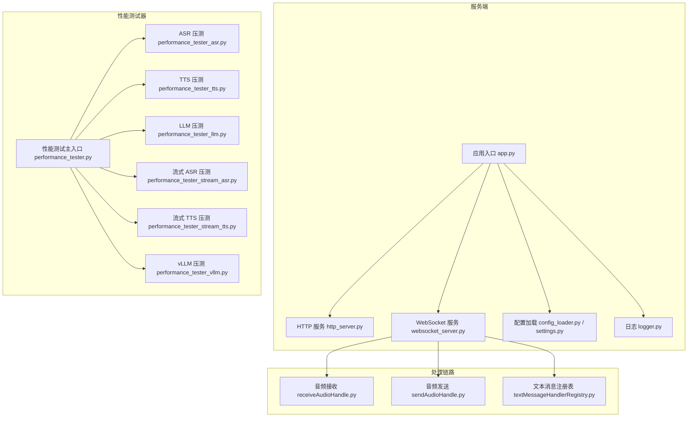
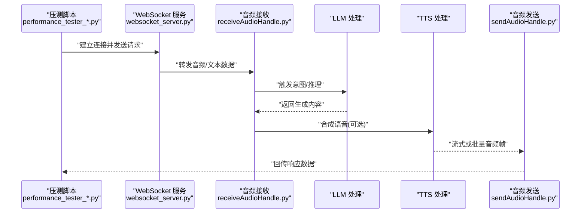
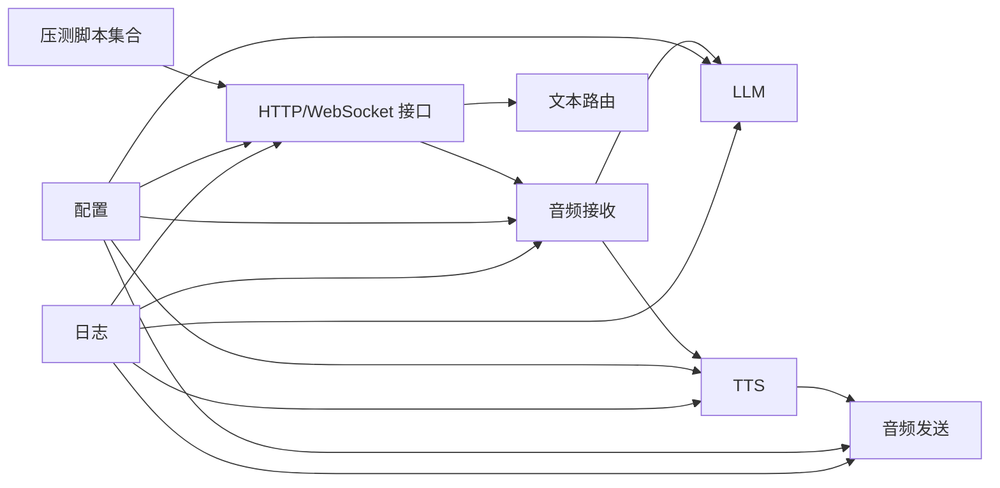

# 性能测试

<cite>
**本文引用的文件**   
- [performance_tester.md](file://docs/performance_tester.md)
- [performance_tester.py](file://main/xiaozhi-server/performance_tester.py)
- [performance_tester_asr.py](file://main/xiaozhi-server/performance_tester/performance_tester_asr.py)
- [performance_tester_llm.py](file://main/xiaozhi-server/performance_tester/performance_tester_llm.py)
- [performance_tester_stream_asr.py](file://main/xiaozhi-server/performance_tester/performance_tester_stream_asr.py)
- [performance_tester_stream_tts.py](file://main/xiaozhi-server/performance_tester/performance_tester_stream_tts.py)
- [performance_tester_tts.py](file://main/xiaozhi-server/performance_tester/performance_tester_tts.py)
- [performance_tester_vllm.py](file://main/xiaozhi-server/performance_tester/performance_tester_vllm.py)
- [app.py](file://main/xiaozhi-server/app.py)
- [websocket_server.py](file://main/xiaozhi-server/core/websocket_server.py)
- [http_server.py](file://main/xiaozhi-server/core/http_server.py)
- [receiveAudioHandle.py](file://main/xiaozhi-server/core/handle/receiveAudioHandle.py)
- [sendAudioHandle.py](file://main/xiaozhi-server/core/handle/sendAudioHandle.py)
- [textMessageHandlerRegistry.py](file://main/xiaozhi-server/core/handle/textMessageHandlerRegistry.py)
- [config_loader.py](file://main/xiaozhi-server/config/config_loader.py)
- [settings.py](file://main/xiaozhi-server/config/settings.py)
- [logger.py](file://main/xiaozhi-server/config/logger.py)
</cite>

## 目录
1. [简介](#简介)
2. [项目结构](#项目结构)
3. [核心组件](#核心组件)
4. [架构总览](#架构总览)
5. [详细组件分析](#详细组件分析)
6. [依赖关系分析](#依赖关系分析)
7. [性能考量](#性能考量)
8. [故障排查指南](#故障排查指南)
9. [结论](#结论)
10. [附录](#附录)

## 简介
本指南面向希望在 xiaozhi-esp32-server 项目中开展性能测试的工程师与测试人员，覆盖压力测试、基准测试、工具链选择与实践、回归流程与自动化集成、告警机制以及报告模板。文档基于仓库中已有的性能测试脚本与服务实现进行系统化梳理，帮助读者快速搭建可复现、可度量、可回归的性能测试体系。

## 项目结构
本项目在 main/xiaozhi-server 下提供完整的性能测试能力：
- 顶层入口与配置：应用启动、HTTP/WebSocket 服务、配置加载与日志。
- 性能测试器：针对 ASR、TTS、LLM、流式 ASR/TTS、vLLM 等模块的专用压测脚本。
- 处理链路：音频接收/发送、文本消息路由、VAD/ASR/LLM/TTS 等组件协同。

图表来源
- [app.py](file://main/xiaozhi-server/app.py)
- [http_server.py](file://main/xiaozhi-server/core/http_server.py)
- [websocket_server.py](file://main/xiaozhi-server/core/websocket_server.py)
- [config_loader.py](file://main/xiaozhi-server/config/config_loader.py)
- [settings.py](file://main/xiaozhi-server/config/settings.py)
- [logger.py](file://main/xiaozhi-server/config/logger.py)
- [performance_tester.py](file://main/xiaozhi-server/performance_tester.py)
- [performance_tester_asr.py](file://main/xiaozhi-server/performance_tester/performance_tester_asr.py)
- [performance_tester_tts.py](file://main/xiaozhi-server/performance_tester/performance_tester_tts.py)
- [performance_tester_llm.py](file://main/xiaozhi-server/performance_tester/performance_tester_llm.py)
- [performance_tester_stream_asr.py](file://main/xiaozhi-server/performance_tester/performance_tester_stream_asr.py)
- [performance_tester_stream_tts.py](file://main/xiaozhi-server/performance_tester/performance_tester_stream_tts.py)
- [performance_tester_vllm.py](file://main/xiaozhi-server/performance_tester/performance_tester_vllm.py)
- [receiveAudioHandle.py](file://main/xiaozhi-server/core/handle/receiveAudioHandle.py)
- [sendAudioHandle.py](file://main/xiaozhi-server/core/handle/sendAudioHandle.py)
- [textMessageHandlerRegistry.py](file://main/xiaozhi-server/core/handle/textMessageHandlerRegistry.py)

章节来源
- [performance_tester.md](file://docs/performance_tester.md)
- [performance_tester.py](file://main/xiaozhi-server/performance_tester.py)
- [performance_tester_asr.py](file://main/xiaozhi-server/performance_tester/performance_tester_asr.py)
- [performance_tester_tts.py](file://main/xiaozhi-server/performance_tester/performance_tester_tts.py)
- [performance_tester_llm.py](file://main/xiaozhi-server/performance_tester/performance_tester_llm.py)
- [performance_tester_stream_asr.py](file://main/xiaozhi-server/performance_tester/performance_tester_stream_asr.py)
- [performance_tester_stream_tts.py](file://main/xiaozhi-server/performance_tester/performance_tester_stream_tts.py)
- [performance_tester_vllm.py](file://main/xiaozhi-server/performance_tester/performance_tester_vllm.py)
- [app.py](file://main/xiaozhi-server/app.py)
- [websocket_server.py](file://main/xiaozhi-server/core/websocket_server.py)
- [http_server.py](file://main/xiaozhi-server/core/http_server.py)
- [receiveAudioHandle.py](file://main/xiaozhi-server/core/handle/receiveAudioHandle.py)
- [sendAudioHandle.py](file://main/xiaozhi-server/core/handle/sendAudioHandle.py)
- [textMessageHandlerRegistry.py](file://main/xiaozhi-server/core/handle/textMessageHandlerRegistry.py)
- [config_loader.py](file://main/xiaozhi-server/config/config_loader.py)
- [settings.py](file://main/xiaozhi-server/config/settings.py)
- [logger.py](file://main/xiaozhi-server/config/logger.py)

## 核心组件
- 性能测试主入口与调度：统一入口负责参数解析、场景编排、结果汇总与输出。
- 专项压测脚本：分别覆盖 ASR、TTS、LLM、流式 ASR/TTS、vLLM 等关键路径。
- 服务端接入点：HTTP 与 WebSocket 服务暴露接口，供压测客户端调用。
- 配置与日志：集中管理运行参数、连接信息、并发策略与指标采集。

章节来源
- [performance_tester.py](file://main/xiaozhi-server/performance_tester.py)
- [performance_tester_asr.py](file://main/xiaozhi-server/performance_tester/performance_tester_asr.py)
- [performance_tester_tts.py](file://main/xiaozhi-server/performance_tester/performance_tester_tts.py)
- [performance_tester_llm.py](file://main/xiaozhi-server/performance_tester/performance_tester_llm.py)
- [performance_tester_stream_asr.py](file://main/xiaozhi-server/performance_tester/performance_tester_stream_asr.py)
- [performance_tester_stream_tts.py](file://main/xiaozhi-server/performance_tester/performance_tester_stream_tts.py)
- [performance_tester_vllm.py](file://main/xiaozhi-server/performance_tester/performance_tester_vllm.py)
- [http_server.py](file://main/xiaozhi-server/core/http_server.py)
- [websocket_server.py](file://main/xiaozhi-server/core/websocket_server.py)
- [config_loader.py](file://main/xiaozhi-server/config/config_loader.py)
- [settings.py](file://main/xiaozhi-server/config/settings.py)
- [logger.py](file://main/xiaozhi-server/config/logger.py)

## 架构总览
下图展示从压测脚本到服务端处理链路的端到端调用关系，适用于语音对话与文本交互两类典型场景。

图表来源
- [performance_tester_stream_asr.py](file://main/xiaozhi-server/performance_tester/performance_tester_stream_asr.py)
- [performance_tester_stream_tts.py](file://main/xiaozhi-server/performance_tester/performance_tester_stream_tts.py)
- [websocket_server.py](file://main/xiaozhi-server/core/websocket_server.py)
- [receiveAudioHandle.py](file://main/xiaozhi-server/core/handle/receiveAudioHandle.py)
- [sendAudioHandle.py](file://main/xiaozhi-server/core/handle/sendAudioHandle.py)

## 详细组件分析

### 性能测试主入口（performance_tester.py）
- 职责：统一参数解析、场景选择、并发控制、指标收集与报告输出。
- 关键点：
  - 支持多场景切换（ASR/TTS/LLM/流式/vLLM）。
  - 通过配置驱动连接地址、认证、超时、重试等。
  - 聚合各子脚本统计结果，便于横向对比。

章节来源
- [performance_tester.py](file://main/xiaozhi-server/performance_tester.py)

### ASR 压测（performance_tester_asr.py）
- 目标：评估语音识别吞吐与延迟，包括短语音、长语音、流式输入。
- 要点：
  - 并发用户数、请求间隔、音频片段大小与采样率。
  - 指标：首包延迟、端到端时延、QPS、错误率、CPU/内存占用。
  - 数据准备：多样化语料、噪声环境模拟、边界长度分布。

章节来源
- [performance_tester_asr.py](file://main/xiaozhi-server/performance_tester/performance_tester_asr.py)

### TTS 压测（performance_tester_tts.py）
- 目标：评估语音合成吞吐与时延，关注首字节时间与整体合成时间。
- 要点：
  - 并发模型、批大小、音频格式与码率。
  - 指标：首字节延迟、平均合成时长、吞吐、资源利用率。
  - 数据准备：不同文本长度、语种、情感风格。

章节来源
- [performance_tester_tts.py](file://main/xiaozhi-server/performance_tester/performance_tester_tts.py)

### LLM 压测（performance_tester_llm.py）
- 目标：评估大模型推理吞吐与延迟，关注系统级瓶颈。
- 要点：
  - 并发度、提示词长度、温度/TopP 等采样参数。
  - 指标：首 token 延迟、生成速率、显存/CPU/IO 使用。
  - 数据准备：多样 prompt、长上下文、函数调用场景。

章节来源
- [performance_tester_llm.py](file://main/xiaozhi-server/performance_tester/performance_tester_llm.py)

### 流式 ASR 压测（performance_tester_stream_asr.py）
- 目标：评估实时语音识别的稳定性与低延迟。
- 要点：
  - 流式分片策略、丢包/乱序模拟、网络抖动。
  - 指标：首包时延、增量识别时延、卡顿率、重传率。
  - 数据准备：连续语音流、静音段、背景噪声。

章节来源
- [performance_tester_stream_asr.py](file://main/xiaozhi-server/performance_tester/performance_tester_stream_asr.py)

### 流式 TTS 压测（performance_tester_stream_tts.py）
- 目标：评估流式语音合成的首字节与持续播放体验。
- 要点：
  - 分块大小、缓冲策略、网络传输开销。
  - 指标：首字节时延、播放流畅度、断流率。
  - 数据准备：长文本分段、标点停顿、多语言混合。

章节来源
- [performance_tester_stream_tts.py](file://main/xiaozhi-server/performance_tester/performance_tester_stream_tts.py)

### vLLM 压测（performance_tester_vllm.py）
- 目标：评估高性能推理引擎的吞吐与延迟特性。
- 要点：
  - 并发请求、KV Cache 配置、批调度策略。
  - 指标：吞吐、尾延迟、显存峰值、队列等待时间。
  - 数据准备：不同长度 prompt、函数调用、多轮对话。

章节来源
- [performance_tester_vllm.py](file://main/xiaozhi-server/performance_tester/performance_tester_vllm.py)

### 服务端接入点（HTTP/WebSocket）
- HTTP 服务：用于非实时接口压测（如配置查询、状态上报）。
- WebSocket 服务：用于实时音视频与指令通道，支撑流式场景。
- 关键点：连接池、心跳保活、背压与限流、错误重试。

章节来源
- [http_server.py](file://main/xiaozhi-server/core/http_server.py)
- [websocket_server.py](file://main/xiaozhi-server/core/websocket_server.py)

### 处理链路（音频接收/发送与文本路由）
- 音频接收：负责解码、VAD 检测、ASR 调用与中间态缓存。
- 音频发送：负责 TTS 合成、编码、流式推送与播放同步。
- 文本路由：根据消息类型分发至对应处理器，保证可扩展性。

章节来源
- [receiveAudioHandle.py](file://main/xiaozhi-server/core/handle/receiveAudioHandle.py)
- [sendAudioHandle.py](file://main/xiaozhi-server/core/handle/sendAudioHandle.py)
- [textMessageHandlerRegistry.py](file://main/xiaozhi-server/core/handle/textMessageHandlerRegistry.py)

### 配置与日志
- 配置加载：集中化管理连接、线程池、超时、重试、开关等。
- 日志记录：结构化日志、分级输出、性能埋点与指标导出。

章节来源
- [config_loader.py](file://main/xiaozhi-server/config/config_loader.py)
- [settings.py](file://main/xiaozhi-server/config/settings.py)
- [logger.py](file://main/xiaozhi-server/config/logger.py)

## 依赖关系分析
- 压测脚本对服务端接口的依赖：通过 HTTP/WebSocket 发起请求，依赖服务端的稳定与正确路由。
- 处理链路内部依赖：ASR/TTS/LLM 等模块通过统一接口协作，避免强耦合。
- 配置与日志贯穿全链路，确保可观测性与可配置性。

图表来源
- [performance_tester.py](file://main/xiaozhi-server/performance_tester.py)
- [http_server.py](file://main/xiaozhi-server/core/http_server.py)
- [websocket_server.py](file://main/xiaozhi-server/core/websocket_server.py)
- [receiveAudioHandle.py](file://main/xiaozhi-server/core/handle/receiveAudioHandle.py)
- [sendAudioHandle.py](file://main/xiaozhi-server/core/handle/sendAudioHandle.py)
- [textMessageHandlerRegistry.py](file://main/xiaozhi-server/core/handle/textMessageHandlerRegistry.py)
- [config_loader.py](file://main/xiaozhi-server/config/config_loader.py)
- [settings.py](file://main/xiaozhi-server/config/settings.py)
- [logger.py](file://main/xiaozhi-server/config/logger.py)

章节来源
- [performance_tester.py](file://main/xiaozhi-server/performance_tester.py)
- [http_server.py](file://main/xiaozhi-server/core/http_server.py)
- [websocket_server.py](file://main/xiaozhi-server/core/websocket_server.py)
- [receiveAudioHandle.py](file://main/xiaozhi-server/core/handle/receiveAudioHandle.py)
- [sendAudioHandle.py](file://main/xiaozhi-server/core/handle/sendAudioHandle.py)
- [textMessageHandlerRegistry.py](file://main/xiaozhi-server/core/handle/textMessageHandlerRegistry.py)
- [config_loader.py](file://main/xiaozhi-server/config/config_loader.py)
- [settings.py](file://main/xiaozhi-server/config/settings.py)
- [logger.py](file://main/xiaozhi-server/config/logger.py)

## 性能考量
- 关键路径识别
  - 语音对话：ASR→LLM→TTS 全链路；流式场景需关注首包与增量时延。
  - 文本交互：LLM 推理与函数调用路径。
- 负载生成策略
  - 并发用户数、阶梯加压、突发流量、长稳态运行。
  - 数据分布：长短文本、不同语种、噪声比例、静音段。
- 指标定义
  - 吞吐：QPS、TPS、带宽。
  - 延迟：首字节、端到端、分片时延、尾延迟（P95/P99）。
  - 资源：CPU、内存、GPU/显存、磁盘 IO、网络 IO。
  - 质量：错误率、超时率、重传率、卡顿率。
- 结果分析
  - 趋势图与分位数分析，定位瓶颈（CPU/IO/GPU/网络）。
  - 回归判定：与基线对比阈值，自动标记退化。

[本节为通用指导，不直接分析具体文件]

## 故障排查指南
- 常见问题
  - 连接失败：检查地址、端口、认证、防火墙与负载均衡。
  - 高延迟：定位 ASR/TTS/LLM 耗时，检查线程池与队列长度。
  - 内存泄漏：观察 GC 行为与对象生命周期，减少临时对象创建。
  - 网络抖动：启用重试与退避，优化分片大小与缓冲策略。
- 诊断手段
  - 结构化日志：按阶段打点，关联请求 ID。
  - 指标采集：Prometheus/自定义导出，结合 Grafana 可视化。
  - 火焰图与堆栈：定位热点函数与锁竞争。
- 恢复策略
  - 降级与熔断：限制并发、关闭非核心功能。
  - 扩容与弹性：水平扩展实例，动态调整资源配额。

章节来源
- [logger.py](file://main/xiaozhi-server/config/logger.py)
- [config_loader.py](file://main/xiaozhi-server/config/config_loader.py)
- [settings.py](file://main/xiaozhi-server/config/settings.py)

## 结论
通过仓库内提供的性能测试脚本与服务实现，可以构建覆盖 ASR/TTS/LLM/流式/vLLM 的全链路性能测试体系。建议以“关键路径+指标化+自动化”为核心，形成稳定的基准与回归流程，配合告警与容量规划，持续提升系统性能与稳定性。

[本节为总结性内容，不直接分析具体文件]

## 附录

### 压力测试方法与实践
- 并发用户模拟
  - 使用压测脚本的多进程/多线程能力，模拟真实用户行为。
  - 设置合理的 ramp-up、steady-state 与 ramp-down 阶段。
- 负载生成策略
  - 阶梯加压：逐步提升并发，观察拐点。
  - 突发流量：短时高并发，验证系统弹性。
  - 长稳态：长时间运行，发现内存与资源泄漏。
- 测试数据准备
  - 多样化语料与文本，覆盖边界与异常。
  - 噪声与丢包模拟，贴近真实网络环境。

章节来源
- [performance_tester_asr.py](file://main/xiaozhi-server/performance_tester/performance_tester_asr.py)
- [performance_tester_tts.py](file://main/xiaozhi-server/performance_tester/performance_tester_tts.py)
- [performance_tester_llm.py](file://main/xiaozhi-server/performance_tester/performance_tester_llm.py)
- [performance_tester_stream_asr.py](file://main/xiaozhi-server/performance_tester/performance_tester_stream_asr.py)
- [performance_tester_stream_tts.py](file://main/xiaozhi-server/performance_tester/performance_tester_stream_tts.py)
- [performance_tester_vllm.py](file://main/xiaozhi-server/performance_tester/performance_tester_vllm.py)

### 基准测试实施
- 关键路径识别
  - 语音对话：ASR→LLM→TTS；文本交互：LLM 推理。
- 性能指标定义
  - 吞吐、延迟（首字节/端到端/尾延迟）、资源使用、错误率。
- 测试结果分析
  - 分位数分析、趋势对比、瓶颈定位与优化建议。

章节来源
- [performance_tester.py](file://main/xiaozhi-server/performance_tester.py)
- [receiveAudioHandle.py](file://main/xiaozhi-server/core/handle/receiveAudioHandle.py)
- [sendAudioHandle.py](file://main/xiaozhi-server/core/handle/sendAudioHandle.py)
- [textMessageHandlerRegistry.py](file://main/xiaozhi-server/core/handle/textMessageHandlerRegistry.py)

### 性能测试工具链
- JMeter
  - 适合 HTTP/WebSocket 接口压测，图形化编排场景，丰富监听器与报告。
- Locust
  - Python 编写用例，灵活并发控制，易于集成自定义逻辑。
- 自定义测试脚本
  - 利用仓库内 performance_tester_* 脚本，快速定制场景与指标。

[本节为通用指导，不直接分析具体文件]

### 性能回归测试流程
- 自动化集成
  - 在 CI/CD 中执行基准与回归用例，产出报告并归档。
- 基线维护
  - 定期更新基线，记录环境与配置差异。
- 告警机制
  - 设定阈值（延迟、错误率、吞吐），触发通知与阻断。

章节来源
- [performance_tester.py](file://main/xiaozhi-server/performance_tester.py)
- [logger.py](file://main/xiaozhi-server/config/logger.py)
- [config_loader.py](file://main/xiaozhi-server/config/config_loader.py)

### 实际测试用例示例
- 语音对话端到端
  - 场景：多用户同时发起语音对话，评估 ASR→LLM→TTS 全链路。
  - 指标：首包时延、端到端时延、QPS、错误率。
- 流式语音交互
  - 场景：连续语音流输入与流式 TTS 输出。
  - 指标：首字节时延、分片时延、卡顿率。
- LLM 推理
  - 场景：不同长度 prompt 与函数调用。
  - 指标：首 token 延迟、生成速率、显存峰值。

章节来源
- [performance_tester_stream_asr.py](file://main/xiaozhi-server/performance_tester/performance_tester_stream_asr.py)
- [performance_tester_stream_tts.py](file://main/xiaozhi-server/performance_tester/performance_tester_stream_tts.py)
- [performance_tester_llm.py](file://main/xiaozhi-server/performance_tester/performance_tester_llm.py)

### 性能报告模板
- 基本信息
  - 版本、环境、配置、数据规模、时间范围。
- 指标摘要
  - 吞吐、延迟（P50/P95/P99）、错误率、资源使用。
- 趋势与对比
  - 与基线对比，标注退化项与改进项。
- 问题与建议
  - 瓶颈定位、优化方案、回归计划。

[本节为模板说明，不直接分析具体文件]