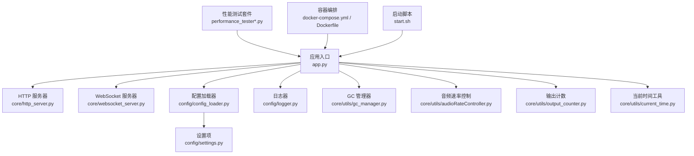
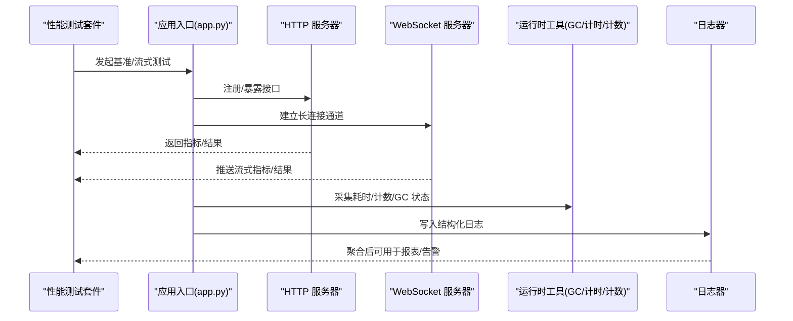
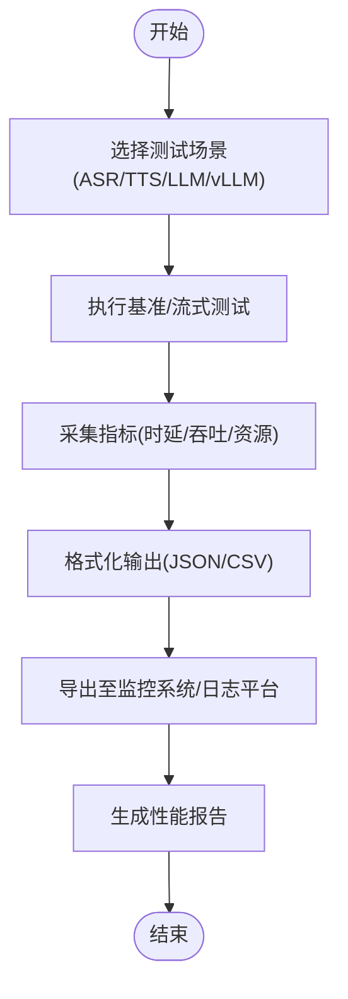
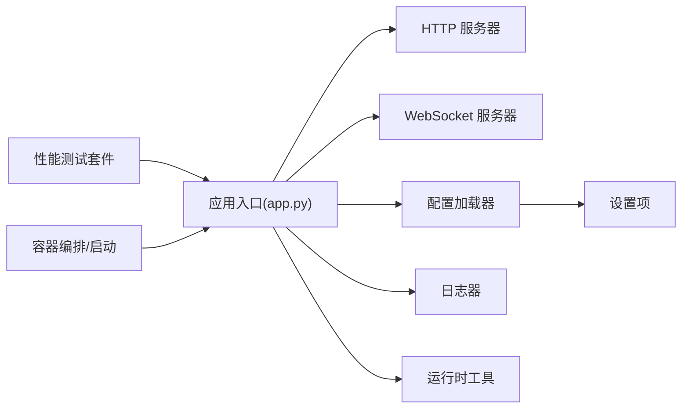

# 监控与剖析

<cite>
**本文引用的文件**   
- [README.md](file://README.md)
- [performance_tester.py](file://main/xiaozhi-server/performance_tester.py)
- [performance_tester_asr.py](file://main/xiaozhi-server/performance_tester/performance_tester_asr.py)
- [performance_tester_llm.py](file://main/xiaozhi-server/performance_tester/performance_tester_llm.py)
- [performance_tester_stream_asr.py](file://main/xiaozhi-server/performance_tester/performance_tester_stream_asr.py)
- [performance_tester_tts.py](file://main/xiaozhi-server/performance_tester/performance_tester_tts.py)
- [performance_tester_stream_tts.py](file://main/xiaozhi-server/performance_tester/performance_tester_stream_tts.py)
- [performance_tester_vllm.py](file://main/xiaozhi-server/performance_tester/performance_tester_vllm.py)
- [app.py](file://main/xiaozhi-server/app.py)
- [http_server.py](file://main/xiaozhi-server/core/http_server.py)
- [websocket_server.py](file://main/xiaozhi-server/core/websocket_server.py)
- [logger.py](file://main/xiaozhi-server/config/logger.py)
- [settings.py](file://main/xiaozhi-server/config/settings.py)
- [config_loader.py](file://main/xiaozhi-server/config/config_loader.py)
- [gc_manager.py](file://main/xiaozhi-server/core/utils/gc_manager.py)
- [audioRateController.py](file://main/xiaozhi-server/core/utils/audioRateController.py)
- [output_counter.py](file://main/xiaozhi-server/core/utils/output_counter.py)
- [current_time.py](file://main/xiaozhi-server/core/utils/current_time.py)
- [docker-compose.yml](file://main/xiaozhi-server/docker-compose.yml)
- [Dockerfile](file://main/xiaozhi-server/Dockerfile)
- [start.sh](file://main/xiaozhi-server/start.sh)
- [performance_tester.md](file://docs/performance_tester.md)
</cite>

## 目录
1. [简介](#简介)
2. [项目结构](#项目结构)
3. [核心组件](#核心组件)
4. [架构总览](#架构总览)
5. [详细组件分析](#详细组件分析)
6. [依赖关系分析](#依赖关系分析)
7. [性能考量](#性能考量)
8. [故障排查指南](#故障排查指南)
9. [结论](#结论)
10. [附录](#附录)

## 简介
本技术文档围绕“监控与剖析”主题，结合仓库中已有的性能测试工具、日志与配置体系、服务启动与容器化方案，系统阐述如何搭建指标收集、日志聚合、告警规则；深入讲解 CPU/内存/I/O 剖析方法；面向分布式场景给出调用链追踪、跨进程性能分析与网络延迟监控建议；并提供热点代码定位、资源竞争分析、慢查询优化等瓶颈定位方法，以及监控仪表板设计与性能报告生成实践。

## 项目结构
本项目包含多语言子模块（Python 服务端、Java 管理 API、前端 Web/小程序等）。与监控与剖析直接相关的核心位于 Python 服务端 main/xiaozhi-server，其中：
- 性能测试与基准脚本集中在 performance_tester 目录与根级 performance_tester.py
- 日志与配置在 config 目录（logger.py、settings.py、config_loader.py）
- 运行时关键工具在 core/utils（如 GC 管理、音频速率控制、输出计数、时间工具）
- 服务入口与 HTTP/WebSocket 服务器在 core 与 app.py
- 容器化与启动脚本在 Dockerfile、docker-compose.yml、start.sh

图表来源
- [app.py](file://main/xiaozhi-server/app.py)
- [http_server.py](file://main/xiaozhi-server/core/http_server.py)
- [websocket_server.py](file://main/xiaozhi-server/core/websocket_server.py)
- [config_loader.py](file://main/xiaozhi-server/config/config_loader.py)
- [settings.py](file://main/xiaozhi-server/config/settings.py)
- [logger.py](file://main/xiaozhi-server/config/logger.py)
- [gc_manager.py](file://main/xiaozhi-server/core/utils/gc_manager.py)
- [audioRateController.py](file://main/xiaozhi-server/core/utils/audioRateController.py)
- [output_counter.py](file://main/xiaozhi-server/core/utils/output_counter.py)
- [current_time.py](file://main/xiaozhi-server/core/utils/current_time.py)
- [performance_tester_asr.py](file://main/xiaozhi-server/performance_tester/performance_tester_asr.py)
- [performance_tester_llm.py](file://main/xiaozhi-server/performance_tester/performance_tester_llm.py)
- [performance_tester_stream_asr.py](file://main/xiaozhi-server/performance_tester/performance_tester_stream_asr.py)
- [performance_tester_tts.py](file://main/xiaozhi-server/performance_tester/performance_tester_tts.py)
- [performance_tester_stream_tts.py](file://main/xiaozhi-server/performance_tester/performance_tester_stream_tts.py)
- [performance_tester_vllm.py](file://main/xiaozhi-server/performance_tester/performance_tester_vllm.py)
- [docker-compose.yml](file://main/xiaozhi-server/docker-compose.yml)
- [Dockerfile](file://main/xiaozhi-server/Dockerfile)
- [start.sh](file://main/xiaozhi-server/start.sh)

章节来源
- [README.md](file://README.md)
- [performance_tester.md](file://docs/performance_tester.md)

## 核心组件
- 性能测试套件：提供 ASR/TTS/LLM/vLLM 的基准与流式能力测试，覆盖吞吐、时延、稳定性等维度，是构建指标采集与报告的基础。
- 配置与日志：集中化的配置加载与日志记录，为可观测性提供统一数据源。
- 运行时工具：GC 管理、音频速率控制、输出计数、时间工具等，支撑实时性与资源使用监控。
- 服务层：HTTP/WebSocket 服务作为请求入口，承载业务处理与外部交互。
- 容器化与启动：标准化部署与运行环境，便于在集群中规模化观测。

章节来源
- [performance_tester.py](file://main/xiaozhi-server/performance_tester.py)
- [performance_tester_asr.py](file://main/xiaozhi-server/performance_tester/performance_tester_asr.py)
- [performance_tester_llm.py](file://main/xiaozhi-server/performance_tester/performance_tester_llm.py)
- [performance_tester_stream_asr.py](file://main/xiaozhi-server/performance_tester/performance_tester_stream_asr.py)
- [performance_tester_tts.py](file://main/xiaozhi-server/performance_tester/performance_tester_tts.py)
- [performance_tester_stream_tts.py](file://main/xiaozhi-server/performance_tester/performance_tester_stream_tts.py)
- [performance_tester_vllm.py](file://main/xiaozhi-server/performance_tester/performance_tester_vllm.py)
- [logger.py](file://main/xiaozhi-server/config/logger.py)
- [settings.py](file://main/xiaozhi-server/config/settings.py)
- [config_loader.py](file://main/xiaozhi-server/config/config_loader.py)
- [gc_manager.py](file://main/xiaozhi-server/core/utils/gc_manager.py)
- [audioRateController.py](file://main/xiaozhi-server/core/utils/audioRateController.py)
- [output_counter.py](file://main/xiaozhi-server/core/utils/output_counter.py)
- [current_time.py](file://main/xiaozhi-server/core/utils/current_time.py)

## 架构总览
下图展示从性能测试到服务处理的端到端流程，体现指标采集点与可观测性接入位置。

图表来源
- [performance_tester.py](file://main/xiaozhi-server/performance_tester.py)
- [app.py](file://main/xiaozhi-server/app.py)
- [http_server.py](file://main/xiaozhi-server/core/http_server.py)
- [websocket_server.py](file://main/xiaozhi-server/core/websocket_server.py)
- [gc_manager.py](file://main/xiaozhi-server/core/utils/gc_manager.py)
- [current_time.py](file://main/xiaozhi-server/core/utils/current_time.py)
- [output_counter.py](file://main/xiaozhi-server/core/utils/output_counter.py)
- [logger.py](file://main/xiaozhi-server/config/logger.py)

## 详细组件分析

### 性能测试套件与指标采集
- 功能要点
  - 覆盖 ASR/TTS/LLM/vLLM 的吞吐与时延测试，支持流式与非流式场景
  - 通过统一入口脚本组织不同场景的测试用例，便于自动化执行与结果汇总
  - 测试结果可作为指标采集的数据源，驱动仪表盘与告警
- 指标建议
  - 吞吐：QPS、并发度、队列长度
  - 时延：P50/P90/P99、首包时延、端到端时延
  - 资源：CPU、内存、GC 次数/停顿、I/O 吞吐
  - 质量：错误率、重试率、丢包率（流式）
- 数据采集方式
  - 在测试脚本中埋点统计关键路径耗时与计数
  - 将指标以结构化格式输出（JSON/CSV），供 Prometheus 抓取或日志聚合

章节来源
- [performance_tester.py](file://main/xiaozhi-server/performance_tester.py)
- [performance_tester_asr.py](file://main/xiaozhi-server/performance_tester/performance_tester_asr.py)
- [performance_tester_llm.py](file://main/xiaozhi-server/performance_tester/performance_tester_llm.py)
- [performance_tester_stream_asr.py](file://main/xiaozhi-server/performance_tester/performance_tester_stream_asr.py)
- [performance_tester_tts.py](file://main/xiaozhi-server/performance_tester/performance_tester_tts.py)
- [performance_tester_stream_tts.py](file://main/xiaozhi-server/performance_tester/performance_tester_stream_tts.py)
- [performance_tester_vllm.py](file://main/xiaozhi-server/performance_tester/performance_tester_vllm.py)
- [performance_tester.md](file://docs/performance_tester.md)

### 日志聚合与结构化输出
- 日志框架
  - 通过 logger.py 统一日志级别、格式与输出目标（控制台/文件/远程）
  - settings.py 与 config_loader.py 负责配置加载与环境变量注入
- 最佳实践
  - 使用结构化字段（trace_id、span_id、service、level、msg、duration_ms 等）
  - 按模块与级别拆分日志文件，避免单文件过大
  - 对敏感信息脱敏，确保合规
- 聚合方案
  - 本地文件 → Filebeat/Fluent Bit → Elasticsearch/ClickHouse
  - 或直接对接云厂商日志服务（SLS/CloudWatch/Stackdriver）

章节来源
- [logger.py](file://main/xiaozhi-server/config/logger.py)
- [settings.py](file://main/xiaozhi-server/config/settings.py)
- [config_loader.py](file://main/xiaozhi-server/config/config_loader.py)

### 运行时工具与资源监控
- GC 管理
  - gc_manager.py 提供垃圾回收相关统计与控制，便于观察内存压力与停顿影响
- 音频速率控制
  - audioRateController.py 保障音频播放/采集的时序一致性，减少抖动
- 输出计数
  - output_counter.py 统计关键操作次数，辅助计算吞吐与错误率
- 时间工具
  - current_time.py 提供高精度时间戳，保证时延统计准确性

章节来源
- [gc_manager.py](file://main/xiaozhi-server/core/utils/gc_manager.py)
- [audioRateController.py](file://main/xiaozhi-server/core/utils/audioRateController.py)
- [output_counter.py](file://main/xiaozhi-server/core/utils/output_counter.py)
- [current_time.py](file://main/xiaozhi-server/core/utils/current_time.py)

### 服务入口与可观测性接入点
- app.py 作为应用入口，协调 HTTP/WebSocket 服务与业务模块
- http_server.py 暴露 REST 接口，适合暴露健康检查、指标端点与调试接口
- websocket_server.py 维护长连接，适合流式指标推送与实时事件上报

章节来源
- [app.py](file://main/xiaozhi-server/app.py)
- [http_server.py](file://main/xiaozhi-server/core/http_server.py)
- [websocket_server.py](file://main/xiaozhi-server/core/websocket_server.py)

### 容器化与部署观测
- Dockerfile 定义运行环境与依赖，确保一致的可观测性栈
- docker-compose.yml 编排服务与依赖（数据库、缓存、日志/指标后端）
- start.sh 统一启动参数与环境变量，便于注入监控探针与日志配置

章节来源
- [Dockerfile](file://main/xiaozhi-server/Dockerfile)
- [docker-compose.yml](file://main/xiaozhi-server/docker-compose.yml)
- [start.sh](file://main/xiaozhi-server/start.sh)

## 依赖关系分析
- 组件耦合
  - 性能测试套件依赖应用入口与服务层，通过 HTTP/WebSocket 进行交互
  - 运行时工具被服务层广泛引用，形成低耦合高内聚的工具集
  - 配置与日志贯穿全链路，是统一的横切关注点
- 外部依赖
  - 容器编排与镜像构建依赖 Docker 生态
  - 日志/指标聚合依赖第三方平台（Elasticsearch、Prometheus、Grafana 等）

图表来源
- [performance_tester.py](file://main/xiaozhi-server/performance_tester.py)
- [app.py](file://main/xiaozhi-server/app.py)
- [http_server.py](file://main/xiaozhi-server/core/http_server.py)
- [websocket_server.py](file://main/xiaozhi-server/core/websocket_server.py)
- [config_loader.py](file://main/xiaozhi-server/config/config_loader.py)
- [settings.py](file://main/xiaozhi-server/config/settings.py)
- [logger.py](file://main/xiaozhi-server/config/logger.py)
- [docker-compose.yml](file://main/xiaozhi-server/docker-compose.yml)
- [Dockerfile](file://main/xiaozhi-server/Dockerfile)
- [start.sh](file://main/xiaozhi-server/start.sh)

## 性能考量
- 指标采集策略
  - 采样与降采样：高频指标采用滑动窗口与分桶统计，降低存储与计算压力
  - 异步上报：指标与日志异步写入，避免阻塞主流程
  - 分级采集：生产环境默认采集关键指标，开发/压测环境开启详细埋点
- 资源利用
  - CPU：合理设置线程/协程池大小，避免上下文切换开销
  - 内存：监控堆/非堆使用，调整 GC 策略与对象生命周期
  - I/O：读写分离、缓冲与批处理，减少系统调用次数
- 流式处理
  - 音频流需严格控制速率与缓冲区，避免抖动与卡顿
  - 背压机制：下游处理能力不足时主动限流与降级

[本节为通用指导，不直接分析具体文件]

## 故障排查指南
- 常见问题定位
  - 高 CPU：通过火焰图与热点函数分析定位热点代码
  - 内存泄漏：结合 GC 统计与堆转储分析对象增长趋势
  - I/O 瓶颈：监控磁盘/网络 I/O，识别慢查询与阻塞调用
  - 网络延迟：抓包与链路追踪定位跨服务调用耗时
- 排查步骤
  - 启用详细日志与追踪 ID，关联请求链路
  - 采集运行时指标（CPU/内存/GC/线程/锁等待）
  - 复现问题并对比基线，逐步缩小范围
  - 修复后回归验证，更新告警阈值与容量规划

章节来源
- [logger.py](file://main/xiaozhi-server/config/logger.py)
- [gc_manager.py](file://main/xiaozhi-server/core/utils/gc_manager.py)
- [current_time.py](file://main/xiaozhi-server/core/utils/current_time.py)
- [output_counter.py](file://main/xiaozhi-server/core/utils/output_counter.py)

## 结论
通过整合性能测试套件、结构化日志与运行时工具，可在本仓库基础上快速搭建完善的监控与剖析体系。建议在容器化部署中统一注入指标与日志采集组件，结合调用链追踪与告警规则，实现从指标到根因的快速闭环。持续完善仪表板与报告模板，将有助于团队高效定位瓶颈与优化性能。

[本节为总结性内容，不直接分析具体文件]

## 附录

### 指标收集与日志聚合方案
- 指标采集
  - 应用内埋点 + 运行时探针（如 Python 内置统计、第三方库）
  - 导出为 OpenMetrics 或自定义 JSON，由采集器拉取或推送
- 日志聚合
  - 结构化日志字段统一，便于检索与分析
  - 使用日志采集器转发至集中式存储，支持实时查询与告警

章节来源
- [logger.py](file://main/xiaozhi-server/config/logger.py)
- [settings.py](file://main/xiaozhi-server/config/settings.py)
- [config_loader.py](file://main/xiaozhi-server/config/config_loader.py)

### 告警规则配置建议
- 基础指标
  - CPU > 80% 持续 5 分钟
  - 内存使用率 > 85% 且 GC 频繁
  - 错误率 > 1% 持续 3 分钟
  - P99 时延超过阈值
- 业务指标
  - QPS 突降/突增
  - 流式音频卡顿率上升
  - 模型推理失败率升高

[本节为通用指导，不直接分析具体文件]

### 应用程序剖析技术
- CPU 剖析
  - 使用 cProfile/py-spy/Perf 等工具生成热点函数与火焰图
  - 结合线程/协程统计，识别同步阻塞与锁竞争
- 内存剖析
  - 使用 tracemalloc/memory_profiler 定位内存增长与泄漏
  - 结合 GC 统计分析停顿与回收效率
- I/O 剖析
  - 使用 iostat/iotop/netstat/ss 等工具观察系统与网络 I/O
  - 针对数据库与外部 API 调用进行慢查询与超时分析

[本节为通用指导，不直接分析具体文件]

### 分布式系统监控
- 服务调用链追踪
  - 引入分布式追踪（如 OpenTelemetry），统一 trace/span 标识
  - 在服务边界与关键路径打点，汇聚至追踪后端
- 跨进程性能分析
  - 使用 eBPF/perf 分析内核态与用户态开销
  - 监控进程间通信（IPC/消息队列）延迟与吞吐
- 网络延迟监控
  - 采集 TCP/UDP 连接数、重传率、RTT
  - 结合地理分布与负载均衡策略分析链路质量

[本节为通用指导，不直接分析具体文件]

### 性能瓶颈定位方法
- 热点代码识别
  - 火焰图与热点函数排名，聚焦 Top N 耗时路径
- 资源竞争分析
  - 线程/锁等待统计，识别死锁与争用热点
- 慢查询优化
  - SQL 审计与执行计划分析，索引与缓存优化

[本节为通用指导，不直接分析具体文件]

### 监控仪表板设计与性能报告生成
- 仪表板设计
  - 概览页：核心指标与健康状态
  - 详情页：服务/实例维度指标与拓扑
  - 诊断页：火焰图、GC 曲线、I/O 热力图
- 报告生成
  - 定期导出指标与日志摘要，生成 PDF/HTML 报告
  - 对比基线与历史趋势，标注异常与改进建议

[本节为通用指导，不直接分析具体文件]