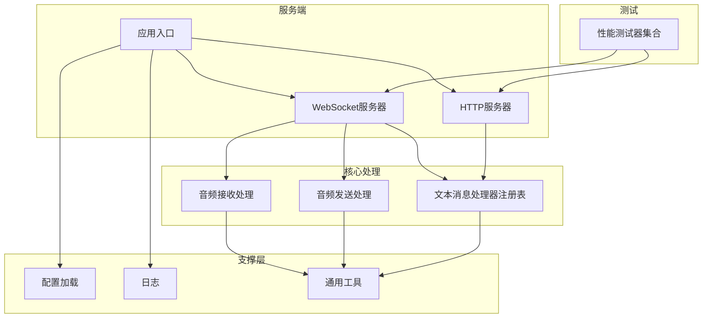
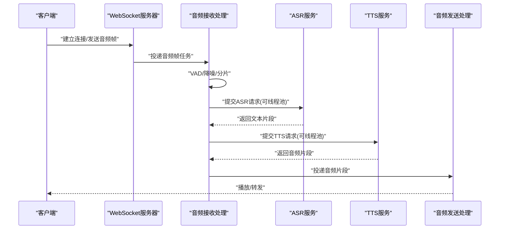
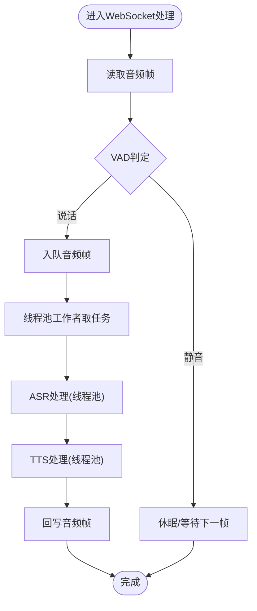
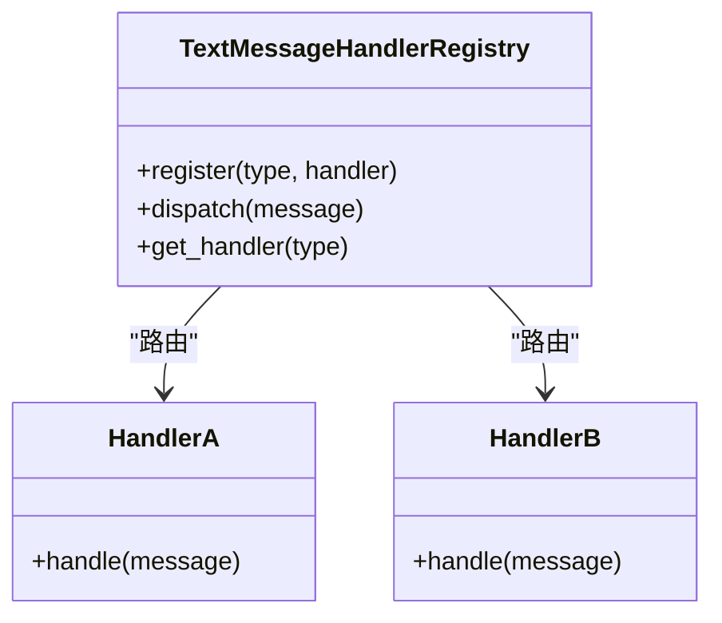
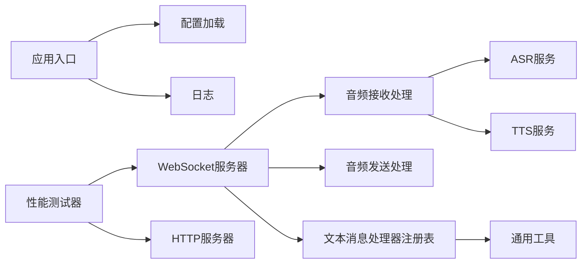

# 线程池优化

<cite>
**本文引用的文件**   
- [thread-pool-and-connection-optimization.md](file://docs/custom/thread-pool-and-connection-optimization.md)
- [performance_tester.py](file://main/xiaozhi-server/performance_tester.py)
- [performance_tester_asr.py](file://main/xiaozhi-server/performance_tester/performance_tester_asr.py)
- [performance_tester_llm.py](file://main/xiaozhi-server/performance_tester/performance_tester_llm.py)
- [performance_tester_stream_asr.py](file://main/xiaozhi-server/performance_tester/performance_tester_stream_asr.py)
- [performance_tester_stream_tts.py](file://main/xiaozhi-server/performance_tester/performance_tester_stream_tts.py)
- [performance_tester_tts.py](file://main/xiaozhi-server/performance_tester/performance_tester_tts.py)
- [performance_tester_vllm.py](file://main/xiaozhi-server/performance_tester/performance_tester_vllm.py)
- [websocket_server.py](file://main/xiaozhi-server/core/websocket_server.py)
- [http_server.py](file://main/xiaozhi-server/core/http_server.py)
- [app.py](file://main/xiaozhi-server/app.py)
- [settings.py](file://main/xiaozhi-server/config/settings.py)
- [logger.py](file://main/xiaozhi-server/config/logger.py)
- [config_loader.py](file://main/xiaozhi-server/config/config_loader.py)
- [receiveAudioHandle.py](file://main/xiaozhi-server/core/handle/receiveAudioHandle.py)
- [sendAudioHandle.py](file://main/xiaozhi-server/core/handle/sendAudioHandle.py)
- [textMessageHandlerRegistry.py](file://main/xiaozhi-server/core/handle/textMessageHandlerRegistry.py)
- [util.py](file://main/xiaozhi-server/core/utils/util.py)
</cite>

## 目录
1. [简介](#简介)
2. [项目结构](#项目结构)
3. [核心组件](#核心组件)
4. [架构总览](#架构总览)
5. [详细组件分析](#详细组件分析)
6. [依赖关系分析](#依赖关系分析)
7. [性能考量](#性能考量)
8. [故障排查指南](#故障排查指南)
9. [结论](#结论)
10. [附录](#附录)

## 简介
本技术文档聚焦于Python多线程模型与线程池优化，结合项目在GIL限制下的并发处理策略、WebSocket连接处理的线程模型设计（异步IO与多线程混合）、以及线程池配置参数调优（最大线程数、队列大小、任务调度算法）。文档同时提供性能测试方法与监控指标，帮助识别线程竞争与死锁问题，并给出最佳实践与常见陷阱避免。

## 项目结构
本项目为多模块工程，后端服务位于 main/xiaozhi-server，包含WebSocket服务器、HTTP服务器、配置加载、日志、核心处理逻辑与性能测试工具等。与线程池和并发相关的代码主要分布在：
- WebSocket/HTTP服务入口与连接管理
- 音频接收/发送处理
- 文本消息处理器注册表
- 通用工具与配置
- 性能测试脚本集合

图表来源
- [websocket_server.py](file://main/xiaozhi-server/core/websocket_server.py)
- [http_server.py](file://main/xiaozhi-server/core/http_server.py)
- [app.py](file://main/xiaozhi-server/app.py)
- [receiveAudioHandle.py](file://main/xiaozhi-server/core/handle/receiveAudioHandle.py)
- [sendAudioHandle.py](file://main/xiaozhi-server/core/handle/sendAudioHandle.py)
- [textMessageHandlerRegistry.py](file://main/xiaozhi-server/core/handle/textMessageHandlerRegistry.py)
- [config_loader.py](file://main/xiaozhi-server/config/config_loader.py)
- [logger.py](file://main/xiaozhi-server/config/logger.py)
- [util.py](file://main/xiaozhi-server/core/utils/util.py)
- [performance_tester.py](file://main/xiaozhi-server/performance_tester.py)

章节来源
- [websocket_server.py](file://main/xiaozhi-server/core/websocket_server.py)
- [http_server.py](file://main/xiaozhi-server/core/http_server.py)
- [app.py](file://main/xiaozhi-server/app.py)

## 核心组件
- WebSocket服务器：负责建立与维护客户端连接，将网络事件转化为内部任务，通常采用异步IO以高吞吐处理I/O密集型工作。
- HTTP服务器：提供REST接口，用于管理与监控，可能通过线程池或协程执行CPU密集或阻塞操作。
- 音频接收/发送处理：对语音流进行解码、VAD检测、ASR/TTS流水线处理，涉及CPU与I/O混合负载。
- 文本消息处理器注册表：按类型路由文本消息到对应处理器，适合使用线程池或协程池执行耗时任务。
- 配置与日志：集中化管理线程池参数、队列大小、日志级别等。
- 性能测试器：覆盖ASR、TTS、LLM、vLLM等场景的压测与指标采集。

章节来源
- [websocket_server.py](file://main/xiaozhi-server/core/websocket_server.py)
- [receiveAudioHandle.py](file://main/xiaozhi-server/core/handle/receiveAudioHandle.py)
- [sendAudioHandle.py](file://main/xiaozhi-server/core/handle/sendAudioHandle.py)
- [textMessageHandlerRegistry.py](file://main/xiaozhi-server/core/handle/textMessageHandlerRegistry.py)
- [settings.py](file://main/xiaozhi-server/config/settings.py)
- [logger.py](file://main/xiaozhi-server/config/logger.py)
- [performance_tester.py](file://main/xiaozhi-server/performance_tester.py)

## 架构总览
下图展示从WebSocket接收到音频数据，经过接收处理、ASR/TTS流水线，最终回写音频的端到端流程。该流程中，I/O密集部分由异步IO承担，CPU密集部分可通过线程池并行化，从而在GIL限制下最大化吞吐。

图表来源
- [websocket_server.py](file://main/xiaozhi-server/core/websocket_server.py)
- [receiveAudioHandle.py](file://main/xiaozhi-server/core/handle/receiveAudioHandle.py)
- [sendAudioHandle.py](file://main/xiaozhi-server/core/handle/sendAudioHandle.py)

章节来源
- [websocket_server.py](file://main/xiaozhi-server/core/websocket_server.py)
- [receiveAudioHandle.py](file://main/xiaozhi-server/core/handle/receiveAudioHandle.py)
- [sendAudioHandle.py](file://main/xiaozhi-server/core/handle/sendAudioHandle.py)

## 详细组件分析

### WebSocket服务器与线程模型设计
- 异步IO优先：使用事件循环处理大量并发连接，降低上下文切换开销。
- 混合线程池：对CPU密集或阻塞调用（如ASR/TTS推理）使用线程池，规避GIL限制。
- 任务队列：入队音频帧与中间结果，解耦I/O与计算，防止背压导致丢包。
- 资源隔离：不同业务通道（音频、文本、控制）使用独立队列与线程池，避免相互影响。

图表来源
- [websocket_server.py](file://main/xiaozhi-server/core/websocket_server.py)
- [receiveAudioHandle.py](file://main/xiaozhi-server/core/handle/receiveAudioHandle.py)
- [sendAudioHandle.py](file://main/xiaozhi-server/core/handle/sendAudioHandle.py)

章节来源
- [websocket_server.py](file://main/xiaozhi-server/core/websocket_server.py)
- [receiveAudioHandle.py](file://main/xiaozhi-server/core/handle/receiveAudioHandle.py)
- [sendAudioHandle.py](file://main/xiaozhi-server/core/handle/sendAudioHandle.py)

### 文本消息处理器注册表与调度
- 注册表模式：按消息类型动态绑定处理器，便于扩展与维护。
- 调度策略：短任务用协程，长任务或阻塞调用放入线程池；支持优先级队列与限流。
- 错误隔离：单个处理器异常不影响其他类型消息处理。

图表来源
- [textMessageHandlerRegistry.py](file://main/xiaozhi-server/core/handle/textMessageHandlerRegistry.py)

章节来源
- [textMessageHandlerRegistry.py](file://main/xiaozhi-server/core/handle/textMessageHandlerRegistry.py)

### 配置与日志
- 配置项：线程池最大线程数、队列容量、超时时间、重试次数、日志级别等。
- 日志：结构化日志记录关键路径耗时、队列长度、线程池活跃数，便于定位瓶颈。

章节来源
- [settings.py](file://main/xiaozhi-server/config/settings.py)
- [logger.py](file://main/xiaozhi-server/config/logger.py)
- [config_loader.py](file://main/xiaozhi-server/config/config_loader.py)

### 性能测试器集合
- 覆盖范围：ASR、TTS、LLM、vLLM、流式ASR/TTS等。
- 指标：QPS、延迟分布、吞吐、错误率、资源利用率。
- 方法：并发压测、阶梯加压、稳态观察、峰值冲击。

章节来源
- [performance_tester.py](file://main/xiaozhi-server/performance_tester.py)
- [performance_tester_asr.py](file://main/xiaozhi-server/performance_tester/performance_tester_asr.py)
- [performance_tester_tts.py](file://main/xiaozhi-server/performance_tester/performance_tester_tts.py)
- [performance_tester_llm.py](file://main/xiaozhi-server/performance_tester/performance_tester_llm.py)
- [performance_tester_vllm.py](file://main/xiaozhi-server/performance_tester/performance_tester_vllm.py)
- [performance_tester_stream_asr.py](file://main/xiaozhi-server/performance_tester/performance_tester_stream_asr.py)
- [performance_tester_stream_tts.py](file://main/xiaozhi-server/performance_tester/performance_tester_stream_tts.py)

## 依赖关系分析
- WebSocket服务器依赖音频接收/发送处理与文本消息处理器注册表。
- 音频处理依赖ASR/TTS服务，可能通过线程池调用外部API或本地模型。
- 配置与日志贯穿各模块，确保一致性与可观测性。
- 性能测试器通过HTTP/WebSocket接口驱动服务端，评估整体吞吐与延迟。

图表来源
- [websocket_server.py](file://main/xiaozhi-server/core/websocket_server.py)
- [receiveAudioHandle.py](file://main/xiaozhi-server/core/handle/receiveAudioHandle.py)
- [sendAudioHandle.py](file://main/xiaozhi-server/core/handle/sendAudioHandle.py)
- [textMessageHandlerRegistry.py](file://main/xiaozhi-server/core/handle/textMessageHandlerRegistry.py)
- [util.py](file://main/xiaozhi-server/core/utils/util.py)
- [app.py](file://main/xiaozhi-server/app.py)
- [config_loader.py](file://main/xiaozhi-server/config/config_loader.py)
- [logger.py](file://main/xiaozhi-server/config/logger.py)
- [performance_tester.py](file://main/xiaozhi-server/performance_tester.py)

章节来源
- [websocket_server.py](file://main/xiaozhi-server/core/websocket_server.py)
- [receiveAudioHandle.py](file://main/xiaozhi-server/core/handle/receiveAudioHandle.py)
- [sendAudioHandle.py](file://main/xiaozhi-server/core/handle/sendAudioHandle.py)
- [textMessageHandlerRegistry.py](file://main/xiaozhi-server/core/handle/textMessageHandlerRegistry.py)
- [util.py](file://main/xiaozhi-server/core/utils/util.py)
- [app.py](file://main/xiaozhi-server/app.py)
- [config_loader.py](file://main/xiaozhi-server/config/config_loader.py)
- [logger.py](file://main/xiaozhi-server/config/logger.py)
- [performance_tester.py](file://main/xiaozhi-server/performance_tester.py)

## 性能考量
- GIL限制下的并发策略：
  - I/O密集：优先使用异步IO（事件循环），减少线程切换与锁竞争。
  - CPU密集：使用线程池执行阻塞或计算密集型任务，绕过GIL限制。
- 线程池参数调优：
  - 最大线程数：根据CPU核数与任务特性设置，通常为CPU核数的2-4倍（I/O为主）或等于CPU核数（CPU为主）。
  - 队列大小：根据峰值流量与内存限制设定，过大导致延迟增加，过小导致丢任务。
  - 任务调度算法：FIFO适用于均匀负载，优先级队列适用于紧急任务，LRU/LFU可用于缓存热点任务。
- 背压与限流：
  - 队列满时拒绝新任务或降级处理，避免雪崩。
  - 对上游限速，保护下游服务。
- 资源隔离：
  - 不同业务通道独立线程池与队列，避免相互干扰。
- 监控指标：
  - 线程池活跃线程数、队列长度、任务完成速率、平均/尾延迟、错误率、GC停顿时间。

[本节为通用指导，不直接分析具体文件]

## 故障排查指南
- 线程竞争：
  - 现象：延迟抖动、吞吐下降、CPU飙升。
  - 排查：检查共享资源锁粒度、临界区代码、锁顺序是否一致。
  - 工具：线程快照、火焰图、锁等待统计。
- 死锁：
  - 现象：进程挂起、无响应。
  - 排查：分析锁获取顺序、超时机制、是否有条件变量未正确通知。
  - 工具：死锁检测、线程堆栈分析。
- 队列积压：
  - 现象：延迟上升、内存增长。
  - 排查：确认消费者处理能力、生产者速率、队列大小与丢弃策略。
- 日志与监控：
  - 启用结构化日志，记录关键路径耗时与状态。
  - 暴露Prometheus指标，实时观察线程池与队列状态。

章节来源
- [logger.py](file://main/xiaozhi-server/config/logger.py)
- [settings.py](file://main/xiaozhi-server/config/settings.py)

## 结论
在Python多线程模型下，结合GIL限制与异步IO优势，采用“异步IO+线程池”的混合架构可有效提升吞吐与延迟表现。通过合理配置线程池参数、队列大小与调度算法，配合完善的监控与测试体系，能够稳定运行在高并发场景。实践中需关注资源隔离、背压与限流、锁与死锁风险，持续优化以达到最佳性能。

[本节为总结，不直接分析具体文件]

## 附录
- 最佳实践清单：
  - 明确区分I/O与CPU任务，分别选择异步IO与线程池。
  - 设置合理的线程池大小与队列容量，避免过度或不足。
  - 使用优先级队列与限流保护关键路径。
  - 实现超时与重试机制，增强鲁棒性。
  - 完善日志与监控，快速定位问题。
- 常见陷阱：
  - 在GIL下误用多线程执行CPU密集任务。
  - 队列过大导致内存溢出与延迟升高。
  - 锁粒度过细或过粗，造成竞争或串行化。
  - 忽略背压与限流，导致系统崩溃。

[本节为补充内容，不直接分析具体文件]