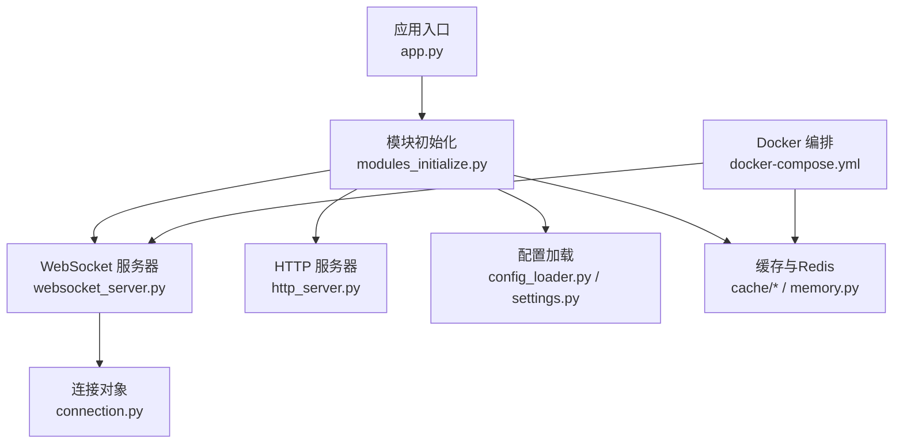
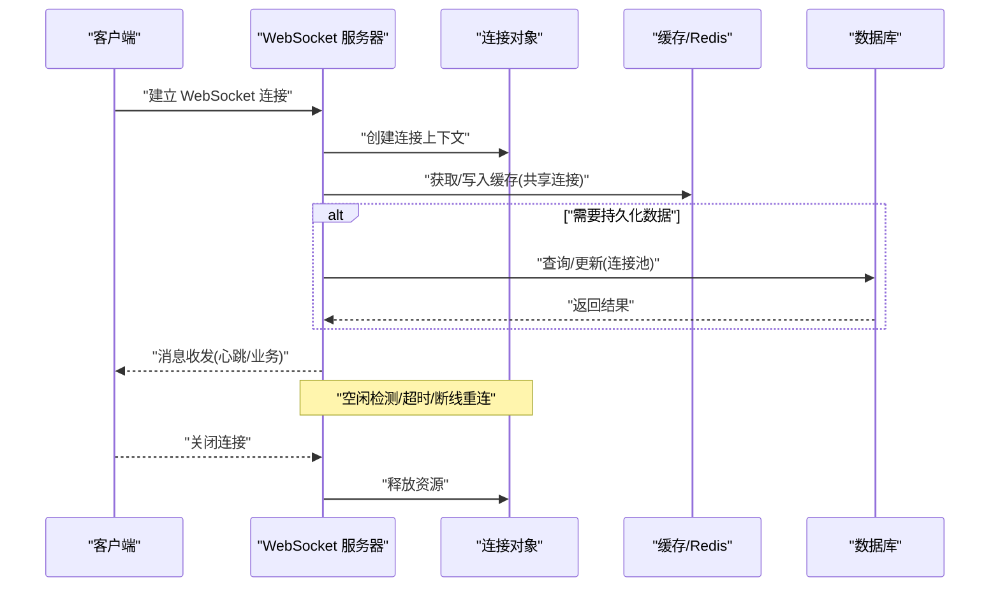
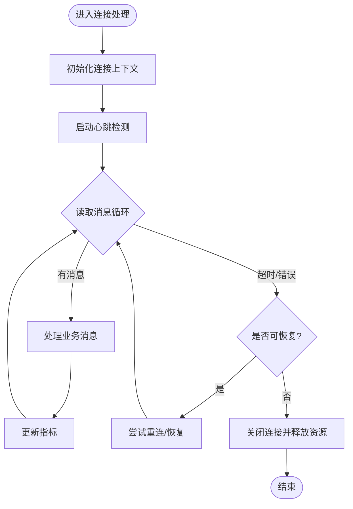
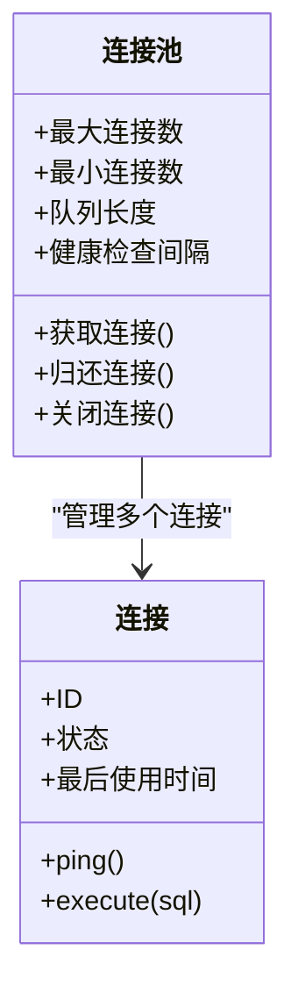
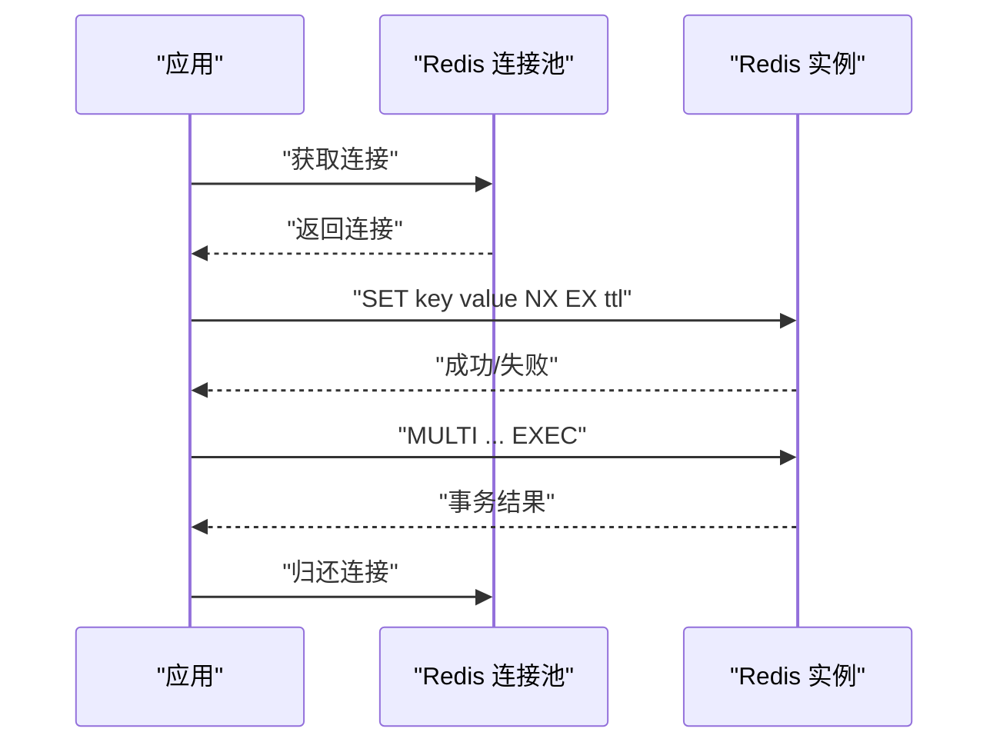
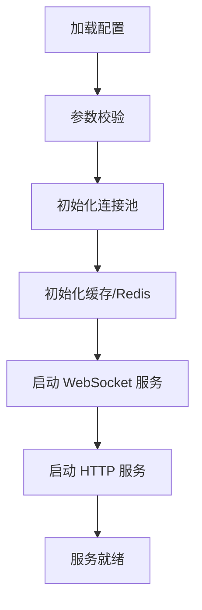
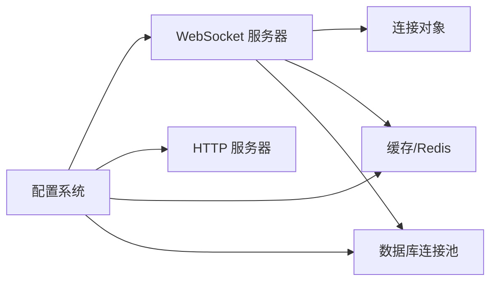

# 连接池管理

<cite>
**本文引用的文件**   
- [app.py](file://main/xiaozhi-server/app.py)
- [websocket_server.py](file://main/xiaozhi-server/core/websocket_server.py)
- [connection.py](file://main/xiaozhi-server/core/connection.py)
- [http_server.py](file://main/xiaozhi-server/core/http_server.py)
- [config_loader.py](file://main/xiaozhi-server/config/config_loader.py)
- [settings.py](file://main/xiaozhi-server/config/settings.py)
- [cache/__init__.py](file://main/xiaozhi-server/core/utils/cache/__init__.py)
- [cache/redis_cache.py](file://main/xiaozhi-server/core/utils/cache/redis_cache.py)
- [memory.py](file://main/xiaozhi-server/core/utils/memory.py)
- [modules_initialize.py](file://main/xiaozhi-server/core/utils/modules_initialize.py)
- [docker-compose.yml](file://main/xiaozhi-server/docker-compose.yml)
- [thread-pool-and-connection-optimization.md](file://docs/custom/thread-pool-and-connection-optimization.md)
</cite>

## 目录
1. [简介](#简介)
2. [项目结构](#项目结构)
3. [核心组件](#核心组件)
4. [架构总览](#架构总览)
5. [详细组件分析](#详细组件分析)
6. [依赖关系分析](#依赖关系分析)
7. [性能考量](#性能考量)
8. [故障排查指南](#故障排查指南)
9. [结论](#结论)
10. [附录](#附录)

## 简介
本技术文档围绕“连接池管理”主题，系统性梳理并解读代码库中与连接相关的实现与配置，重点覆盖：
- WebSocket 连接池的实现机制：连接生命周期、复用策略、超时控制
- 数据库连接池配置：连接数限制、健康检查、故障转移
- Redis 连接池使用模式：连接共享、事务处理、分布式锁实现
- 连接池监控与调优：泄漏检测、指标采集、容量规划
- 配置示例与故障排查方法

说明：本项目为多语言、多模块工程。与连接池直接相关的后端服务位于 main/xiaozhi-server（Python），前端与小程序端存在独立的 WebSocket 客户端实现；数据库与缓存通过外部依赖（如 Docker Compose）引入。下文将基于仓库内实际源码与配置文件进行客观分析与图示化说明。

## 项目结构
与连接池相关的关键位置概览：
- 服务端入口与初始化：app.py、core/utils/modules_initialize.py
- WebSocket 服务器与连接管理：core/websocket_server.py、core/connection.py
- HTTP 服务器（用于管理接口等）：core/http_server.py
- 配置加载与设置：config/config_loader.py、config/settings.py
- 缓存与 Redis：core/utils/cache/*、core/utils/memory.py
- 运行编排：docker-compose.yml

图表来源 
- [app.py](file://main/xiaozhi-server/app.py)
- [modules_initialize.py](file://main/xiaozhi-server/core/utils/modules_initialize.py)
- [websocket_server.py](file://main/xiaozhi-server/core/websocket_server.py)
- [connection.py](file://main/xiaozhi-server/core/connection.py)
- [http_server.py](file://main/xiaozhi-server/core/http_server.py)
- [config_loader.py](file://main/xiaozhi-server/config/config_loader.py)
- [settings.py](file://main/xiaozhi-server/config/settings.py)
- [cache/__init__.py](file://main/xiaozhi-server/core/utils/cache/__init__.py)
- [cache/redis_cache.py](file://main/xiaozhi-server/core/utils/cache/redis_cache.py)
- [memory.py](file://main/xiaozhi-server/core/utils/memory.py)
- [docker-compose.yml](file://main/xiaozhi-server/docker-compose.yml)

章节来源
- [app.py](file://main/xiaozhi-server/app.py)
- [modules_initialize.py](file://main/xiaozhi-server/core/utils/modules_initialize.py)
- [websocket_server.py](file://main/xiaozhi-server/core/websocket_server.py)
- [connection.py](file://main/xiaozhi-server/core/connection.py)
- [http_server.py](file://main/xiaozhi-server/core/http_server.py)
- [config_loader.py](file://main/xiaozhi-server/config/config_loader.py)
- [settings.py](file://main/xiaozhi-server/config/settings.py)
- [cache/__init__.py](file://main/xiaozhi-server/core/utils/cache/__init__.py)
- [cache/redis_cache.py](file://main/xiaozhi-server/core/utils/cache/redis_cache.py)
- [memory.py](file://main/xiaozhi-server/core/utils/memory.py)
- [docker-compose.yml](file://main/xiaozhi-server/docker-compose.yml)

## 核心组件
- WebSocket 服务器与连接管理：负责建立、维护、复用和销毁 WebSocket 连接，提供心跳、超时、断线重连等能力。
- 连接对象：封装单个连接的上下文、读写通道、状态机与资源清理逻辑。
- 配置系统：集中加载运行时参数（如连接数、超时、重试、缓存/DB 连接池参数）。
- 缓存与 Redis：提供进程内或跨进程的缓存访问，支持连接共享、事务与分布式锁。
- 模块初始化：在启动阶段完成各子系统（含连接池）的装配与预热。

章节来源
- [websocket_server.py](file://main/xiaozhi-server/core/websocket_server.py)
- [connection.py](file://main/xiaozhi-server/core/connection.py)
- [config_loader.py](file://main/xiaozhi-server/config/config_loader.py)
- [settings.py](file://main/xiaozhi-server/config/settings.py)
- [cache/__init__.py](file://main/xiaozhi-server/core/utils/cache/__init__.py)
- [cache/redis_cache.py](file://main/xiaozhi-server/core/utils/cache/redis_cache.py)
- [memory.py](file://main/xiaozhi-server/core/utils/memory.py)
- [modules_initialize.py](file://main/xiaozhi-server/core/utils/modules_initialize.py)

## 架构总览
下图展示了从请求接入到连接池使用的整体流程，包括 WebSocket 连接生命周期与缓存/数据库连接池的交互。

图表来源 
- [websocket_server.py](file://main/xiaozhi-server/core/websocket_server.py)
- [connection.py](file://main/xiaozhi-server/core/connection.py)
- [cache/redis_cache.py](file://main/xiaozhi-server/core/utils/cache/redis_cache.py)
- [memory.py](file://main/xiaozhi-server/core/utils/memory.py)

## 详细组件分析

### WebSocket 连接池与连接生命周期
- 连接生命周期
  - 建立：握手成功后创建连接上下文，分配必要的资源（缓冲区、定时器、统计计数）。
  - 活跃期：维持心跳、处理业务消息、记录指标（QPS、延迟、错误率）。
  - 空闲/超时：基于空闲阈值触发清理或降级策略。
  - 关闭：优雅关闭，确保资源释放与状态回滚。
- 连接复用策略
  - 按会话维度复用：同一会话的消息尽量复用同一连接，减少握手开销。
  - 按任务维度复用：短时任务可复用连接，但需考虑并发与隔离性。
  - 限流与背压：当连接池接近上限时，采用排队或拒绝策略。
- 超时控制
  - 读超时：长时间无数据则判定为异常，触发重连或告警。
  - 写超时：发送阻塞超过阈值则中断并上报。
  - 心跳间隔：周期性保活，避免中间设备/NAT 超时断开。

图表来源 
- [websocket_server.py](file://main/xiaozhi-server/core/websocket_server.py)
- [connection.py](file://main/xiaozhi-server/core/connection.py)

章节来源
- [websocket_server.py](file://main/xiaozhi-server/core/websocket_server.py)
- [connection.py](file://main/xiaozhi-server/core/connection.py)

### 数据库连接池配置
- 连接数限制
  - 最大连接数：根据业务峰值 QPS、平均响应时间与目标延迟计算。
  - 最小连接数：保持基础吞吐，降低冷启动放大抖动。
  - 队列长度：等待获取连接的请求队列上限，防止雪崩。
- 健康检查
  - 空闲探测：定期 ping 或执行轻量查询验证连通性。
  - 失效剔除：连续失败后标记连接不可用并回收。
- 故障转移
  - 主从切换：主节点不可用时自动切换到备用节点。
  - 重试与退避：指数退避 + 随机抖动，避免瞬时风暴。
  - 熔断与降级：持续失败时快速失败，保护上游。

图表来源 
- [memory.py](file://main/xiaozhi-server/core/utils/memory.py)
- [docker-compose.yml](file://main/xiaozhi-server/docker-compose.yml)

章节来源
- [memory.py](file://main/xiaozhi-server/core/utils/memory.py)
- [docker-compose.yml](file://main/xiaozhi-server/docker-compose.yml)

### Redis 连接池使用模式
- 连接共享
  - 进程内单例：全局共享连接池，减少重复创建成本。
  - 线程安全：通过锁或无锁队列保证并发安全。
- 事务处理
  - 管道批量：合并多条命令，降低网络往返。
  - 事务/脚本：使用 MULTI/EXEC 或 Lua 脚本保证原子性与一致性。
- 分布式锁
  - 基于 SET NX EX 或 Redlock 算法实现。
  - 锁续期与看门狗：防止持有者崩溃导致死锁。
  - 公平性与超时：合理设置过期时间，避免长事务占用锁。

图表来源 
- [cache/redis_cache.py](file://main/xiaozhi-server/core/utils/cache/redis_cache.py)
- [cache/__init__.py](file://main/xiaozhi-server/core/utils/cache/__init__.py)

章节来源
- [cache/redis_cache.py](file://main/xiaozhi-server/core/utils/cache/redis_cache.py)
- [cache/__init__.py](file://main/xiaozhi-server/core/utils/cache/__init__.py)

### 配置系统与初始化
- 配置加载
  - 统一入口：通过配置加载器聚合环境变量、配置文件与默认值。
  - 类型校验：对关键参数（如连接数、超时）进行范围与类型校验。
- 模块初始化
  - 启动顺序：先加载配置，再初始化连接池、缓存、HTTP/WebSocket 服务。
  - 预热策略：预取热点数据、预热连接，缩短冷启动时间。

图表来源 
- [config_loader.py](file://main/xiaozhi-server/config/config_loader.py)
- [settings.py](file://main/xiaozhi-server/config/settings.py)
- [modules_initialize.py](file://main/xiaozhi-server/core/utils/modules_initialize.py)

章节来源
- [config_loader.py](file://main/xiaozhi-server/config/config_loader.py)
- [settings.py](file://main/xiaozhi-server/config/settings.py)
- [modules_initialize.py](file://main/xiaozhi-server/core/utils/modules_initialize.py)

## 依赖关系分析
- 组件耦合
  - WebSocket 服务器依赖连接对象与缓存/数据库连接池。
  - 配置系统被所有子系统依赖，作为唯一真实来源。
- 外部依赖
  - Redis、数据库通过容器编排提供服务，连接池由应用侧管理。
- 潜在风险
  - 循环依赖：应避免模块间相互导入造成启动失败。
  - 资源竞争：高并发下连接池争用可能导致延迟上升。

图表来源 
- [config_loader.py](file://main/xiaozhi-server/config/config_loader.py)
- [websocket_server.py](file://main/xiaozhi-server/core/websocket_server.py)
- [http_server.py](file://main/xiaozhi-server/core/http_server.py)
- [cache/redis_cache.py](file://main/xiaozhi-server/core/utils/cache/redis_cache.py)
- [memory.py](file://main/xiaozhi-server/core/utils/memory.py)

章节来源
- [config_loader.py](file://main/xiaozhi-server/config/config_loader.py)
- [websocket_server.py](file://main/xiaozhi-server/core/websocket_server.py)
- [http_server.py](file://main/xiaozhi-server/core/http_server.py)
- [cache/redis_cache.py](file://main/xiaozhi-server/core/utils/cache/redis_cache.py)
- [memory.py](file://main/xiaozhi-server/core/utils/memory.py)

## 性能考量
- 连接池容量规划
  - 公式参考：最大连接数 ≈ (QPS × 平均响应时间) / (1 - 目标利用率)
  - 观察指标：连接使用率、等待队列长度、超时率、错误率。
- 超时与重试
  - 读/写超时按 P99 延迟设定，预留余量。
  - 重试策略结合幂等性与去重键，避免重复提交。
- 缓存命中率
  - 提升热点数据命中率，降低下游压力。
  - 合理设置 TTL 与淘汰策略。
- 监控与告警
  - 采集连接池指标（活跃、空闲、等待、错误）。
  - 设置阈值告警（如连接耗尽、超时飙升）。

章节来源
- [thread-pool-and-connection-optimization.md](file://docs/custom/thread-pool-and-connection-optimization.md)

## 故障排查指南
- 常见问题定位
  - 连接泄漏：未归还连接导致池耗尽，检查 try/finally 或上下文管理器。
  - 超时飙升：下游慢或网络抖动，查看链路耗时与错误码。
  - 缓存穿透/击穿：空值缓存、布隆过滤器、互斥锁缓解。
  - 分布式锁冲突：锁粒度与过期时间不合理，调整策略。
- 诊断步骤
  - 查看连接池指标与日志，确认获取/归还路径。
  - 抓取慢查询与热点 Key，评估是否需要扩容或优化。
  - 复现实验：模拟高负载与异常场景，验证恢复能力。
- 恢复策略
  - 快速失败与熔断，保护系统稳定性。
  - 动态扩缩容：根据指标弹性调整连接数与实例数。

章节来源
- [websocket_server.py](file://main/xiaozhi-server/core/websocket_server.py)
- [connection.py](file://main/xiaozhi-server/core/connection.py)
- [cache/redis_cache.py](file://main/xiaozhi-server/core/utils/cache/redis_cache.py)
- [memory.py](file://main/xiaozhi-server/core/utils/memory.py)

## 结论
本仓库在后端服务中实现了较为完善的连接池管理机制，涵盖 WebSocket 连接生命周期、数据库连接池配置与 Redis 连接池使用模式。通过统一的配置系统与模块初始化流程，保证了连接资源的可控与可观测。建议在生产环境中加强指标采集与告警，结合容量规划与故障演练，持续提升系统的稳定性与性能。

## 附录
- 配置示例要点
  - WebSocket：最大连接数、心跳间隔、读写超时、重连次数与退避策略。
  - 数据库：最大/最小连接数、连接超时、健康检查间隔、故障转移优先级。
  - Redis：连接池大小、超时、事务与锁的过期时间、重试策略。
- 监控指标清单
  - 连接池：活跃连接、空闲连接、等待队列、获取耗时、错误率。
  - 缓存：命中率、延迟、Key 分布、淘汰率。
  - 数据库：慢查询、锁等待、连接使用率、复制延迟。