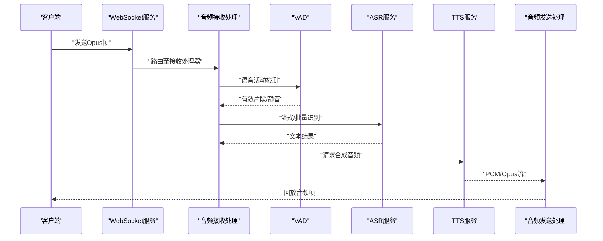
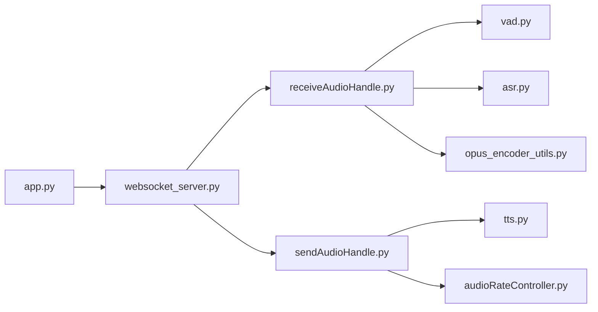

# 音频处理优化

<cite>
**本文引用的文件**   
- [app.py](file://main/xiaozhi-server/app.py)
- [websocket_server.py](file://main/xiaozhi-server/core/websocket_server.py)
- [receiveAudioHandle.py](file://main/xiaozhi-server/core/handle/receiveAudioHandle.py)
- [sendAudioHandle.py](file://main/xiaozhi-server/core/handle/sendAudioHandle.py)
- [opus_encoder_utils.py](file://main/xiaozhi-server/core/utils/opus_encoder_utils.py)
- [audioRateController.py](file://main/xiaozhi-server/core/utils/audioRateController.py)
- [asr.py](file://main/xiaozhi-server/core/utils/asr.py)
- [tts.py](file://main/xiaozhi-server/core/utils/tts.py)
- [vad.py](file://main/xiaozhi-server/core/utils/vad.py)
- [performance_tester_asr.py](file://main/xiaozhi-server/performance_tester/performance_tester_asr.py)
- [performance_tester_stream_tts.py](file://main/xiaozhi-server/performance_tester/performance_tester_stream_tts.py)
- [performance_tester_stream_asr.py](file://main/xiaozhi-server/performance_tester/performance_tester_stream_asr.py)
- [performance_tester_tts.py](file://main/xiaozhi-server/performance_tester/performance_tester_tts.py)
- [libopus.js](file://main/digital-human/js/utils/libopus.js)
- [opus-decoder.js](file://main/miniprogram/libs/opus/opus-decoder.js)
- [opus-encoder.js](file://main/miniprogram/libs/opus/opus-encoder.js)
- [opus-runtime.js](file://main/miniprogram/libs/opus/opus-runtime.js)
- [audio.js](file://main/miniprogram/utils/audio.js)
- [voice-call-manager.js](file://main/miniprogram/utils/voice-call-manager.js)
- [config_loader.py](file://main/xiaozhi-server/config/config_loader.py)
- [settings.py](file://main/xiaozhi-server/config/settings.py)
</cite>

## 目录
1. [简介](#简介)
2. [项目结构](#项目结构)
3. [核心组件](#核心组件)
4. [架构总览](#架构总览)
5. [详细组件分析](#详细组件分析)
6. [依赖关系分析](#依赖关系分析)
7. [性能考量](#性能考量)
8. [故障排查指南](#故障排查指南)
9. [结论](#结论)
10. [附录](#附录)

## 简介
本技术文档聚焦于音频处理优化的全链路方案，覆盖以下关键主题：
- 音频编码解码优化：Opus编码器参数调优、采样率转换与格式适配
- 实时音频处理管道：缓冲区管理、延迟优化、丢包处理
- ASR/TTS服务性能优化：流式处理、并行推理、结果缓存
- 音频质量评估与性能监控：延迟测量、吞吐量统计、资源使用分析
- 具体优化案例与最佳实践

目标读者包括后端工程师、前端/小程序开发者、音视频算法工程师以及运维人员。

## 项目结构
本项目在服务器端（Python）与客户端（Web/小程序）均具备完整的音频采集、编码、传输、解码与播放能力；同时集成ASR/TTS/VAD等模块，形成端到端的语音交互链路。

```mermaid
graph TB
subgraph "客户端(小程序/Web)"
A["音频采集<br/>麦克风/输入设备"] --> B["本地编码(Opus)<br/>opus-encoder.js / libopus.js"]
B --> C["网络发送<br/>WebSocket"]
D["网络接收<br/>WebSocket"] --> E["本地解码(Opus)<br/>opus-decoder.js"]
E --> F["音频播放<br/>扬声器/输出设备"]
end
subgraph "服务端(Python)"
G["WebSocket接入<br/>websocket_server.py"] --> H["音频接收处理<br/>receiveAudioHandle.py"]
H --> I["VAD检测<br/>vad.py"]
I --> J["ASR识别<br/>asr.py + providers/asr/*"]
J --> K["LLM/业务逻辑"]
K --> L["TTS合成<br/>tts.py + providers/tts/*"]
L --> M["音频发送处理<br/>sendAudioHandle.py"]
M --> N["网络发送<br/>WebSocket"]
end
C < --> G
N < --> D
```

图表来源
- [websocket_server.py](file://main/xiaozhi-server/core/websocket_server.py)
- [receiveAudioHandle.py](file://main/xiaozhi-server/core/handle/receiveAudioHandle.py)
- [sendAudioHandle.py](file://main/xiaozhi-server/core/handle/sendAudioHandle.py)
- [asr.py](file://main/xiaozhi-server/core/utils/asr.py)
- [tts.py](file://main/xiaozhi-server/core/utils/tts.py)
- [vad.py](file://main/xiaozhi-server/core/utils/vad.py)
- [opus-encoder.js](file://main/miniprogram/libs/opus/opus-encoder.js)
- [opus-decoder.js](file://main/miniprogram/libs/opus/opus-decoder.js)
- [libopus.js](file://main/digital-human/js/utils/libopus.js)

章节来源
- [app.py](file://main/xiaozhi-server/app.py)
- [websocket_server.py](file://main/xiaozhi-server/core/websocket_server.py)
- [receiveAudioHandle.py](file://main/xiaozhi-server/core/handle/receiveAudioHandle.py)
- [sendAudioHandle.py](file://main/xiaozhi-server/core/handle/sendAudioHandle.py)
- [asr.py](file://main/xiaozhi-server/core/utils/asr.py)
- [tts.py](file://main/xiaozhi-server/core/utils/tts.py)
- [vad.py](file://main/xiaozhi-server/core/utils/vad.py)
- [opus-encoder.js](file://main/miniprogram/libs/opus/opus-encoder.js)
- [opus-decoder.js](file://main/miniprogram/libs/opus/opus-decoder.js)
- [libopus.js](file://main/digital-human/js/utils/libopus.js)

## 核心组件
- 音频编码/解码
  - 服务端：Opus编码器工具封装，统一参数配置与复用实例，降低创建开销
  - 客户端：小程序与Web端分别实现Opus编解码，保证跨平台一致性
- 采样率与格式适配
  - 服务端提供采样率控制器，动态调整以匹配下游模型或网络带宽
- 实时处理管道
  - 基于WebSocket的收发通道，结合VAD切分语音片段，减少无效数据处理
- ASR/TTS
  - 统一的ASR/TTS抽象层，支持多提供商与流式接口
- 性能测试与监控
  - 提供ASR/TTS流式与非流式的性能测试脚本，便于压测与回归

章节来源
- [opus_encoder_utils.py](file://main/xiaozhi-server/core/utils/opus_encoder_utils.py)
- [audioRateController.py](file://main/xiaozhi-server/core/utils/audioRateController.py)
- [asr.py](file://main/xiaozhi-server/core/utils/asr.py)
- [tts.py](file://main/xiaozhi-server/core/utils/tts.py)
- [vad.py](file://main/xiaozhi-server/core/utils/vad.py)
- [performance_tester_asr.py](file://main/xiaozhi-server/performance_tester/performance_tester_asr.py)
- [performance_tester_stream_tts.py](file://main/xiaozhi-server/performance_tester/performance_tester_stream_tts.py)
- [performance_tester_stream_asr.py](file://main/xiaozhi-server/performance_tester/performance_tester_stream_asr.py)
- [performance_tester_tts.py](file://main/xiaozhi-server/performance_tester/performance_tester_tts.py)

## 架构总览
下图展示了从客户端采集到服务端识别、合成并回放的完整数据流，标注了关键处理节点与可能的优化点。



图表来源
- [websocket_server.py](file://main/xiaozhi-server/core/websocket_server.py)
- [receiveAudioHandle.py](file://main/xiaozhi-server/core/handle/receiveAudioHandle.py)
- [sendAudioHandle.py](file://main/xiaozhi-server/core/handle/sendAudioHandle.py)
- [asr.py](file://main/xiaozhi-server/core/utils/asr.py)
- [tts.py](file://main/xiaozhi-server/core/utils/tts.py)

## 详细组件分析

### Opus编码器参数调优与复用
- 目标
  - 在保证音质的前提下降低码率与CPU占用
  - 通过实例复用减少初始化开销
- 关键点
  - 码率控制：根据网络状况与设备能力动态调整
  - 帧长与复杂度：平衡延迟与音质
  - 应用模式：语音优先（Speech）vs 通用（Audio）
  - 实例池化：避免频繁创建销毁
- 建议流程
  - 启动时加载配置，初始化编码器实例池
  - 运行时按会话维度选择参数集
  - 异常时降级为保守参数

章节来源
- [opus_encoder_utils.py](file://main/xiaozhi-server/core/utils/opus_encoder_utils.py)
- [settings.py](file://main/xiaozhi-server/config/settings.py)
- [config_loader.py](file://main/xiaozhi-server/config/config_loader.py)

### 采样率转换与音频格式适配
- 目标
  - 统一上游采集与下游模型所需的采样率
  - 避免重采样带来的失真与额外延迟
- 关键点
  - 输入采样率探测与对齐
  - 重采样策略（高质量插值、低延迟模式）
  - 缓冲对齐与边界处理
- 建议流程
  - 采集端固定采样率，服务端按需转换
  - 对ASR/TTS提供商进行采样率白名单校验

章节来源
- [audioRateController.py](file://main/xiaozhi-server/core/utils/audioRateController.py)

### 实时音频处理管道（缓冲区、延迟、丢包）
- 缓冲区管理
  - 环形缓冲/双缓冲，避免拷贝与锁竞争
  - 按帧大小切分，确保VAD/ASR/TTS消费一致
- 延迟优化
  - 最小可听延迟与吞吐权衡
  - 预取与流水线并行（VAD→ASR→TTS）
- 丢包处理
  - 前向纠错（FEC）与丢包隐藏（PLC）
  - 抖动缓冲自适应调整

章节来源
- [receiveAudioHandle.py](file://main/xiaozhi-server/core/handle/receiveAudioHandle.py)
- [sendAudioHandle.py](file://main/xiaozhi-server/core/handle/sendAudioHandle.py)
- [websocket_server.py](file://main/xiaozhi-server/core/websocket_server.py)

### ASR服务性能优化（流式、并行、缓存）
- 流式处理
  - 增量识别，首字延迟显著降低
  - 滑动窗口与上下文拼接策略
- 并行推理
  - 批处理与并发连接数限制
  - GPU/CPU资源隔离与配额
- 结果缓存
  - 短文本/短语级缓存，命中率监控
  - TTL与失效策略

章节来源
- [asr.py](file://main/xiaozhi-server/core/utils/asr.py)
- [performance_tester_stream_asr.py](file://main/xiaozhi-server/performance_tester/performance_tester_stream_asr.py)
- [performance_tester_asr.py](file://main/xiaozhi-server/performance_tester/performance_tester_asr.py)

### TTS服务性能优化（流式、并行、缓存）
- 流式合成
  - 边生成边发送，降低首帧延迟
  - 分段合成与拼接去噪
- 并行推理
  - 多模型/多实例负载均衡
  - 预热与冷启动优化
- 结果缓存
  - 相同文本/声纹组合缓存
  - 缓存命中与淘汰策略

章节来源
- [tts.py](file://main/xiaozhi-server/core/utils/tts.py)
- [performance_tester_stream_tts.py](file://main/xiaozhi-server/performance_tester/performance_tester_stream_tts.py)
- [performance_tester_tts.py](file://main/xiaozhi-server/performance_tester/performance_tester_tts.py)

### 客户端Opus编解码与播放
- 小程序端
  - 编码器：opus-encoder.js
  - 解码器：opus-decoder.js
  - 运行时：opus-runtime.js
  - 音频工具：audio.js、voice-call-manager.js
- Web端
  - libopus.js用于浏览器环境编解码
- 关键点
  - 采样率与声道数一致性
  - 播放缓冲与抗抖动
  - 错误恢复与重试

章节来源
- [opus-encoder.js](file://main/miniprogram/libs/opus/opus-encoder.js)
- [opus-decoder.js](file://main/miniprogram/libs/opus/opus-decoder.js)
- [opus-runtime.js](file://main/miniprogram/libs/opus/opus-runtime.js)
- [audio.js](file://main/miniprogram/utils/audio.js)
- [voice-call-manager.js](file://main/miniprogram/utils/voice-call-manager.js)
- [libopus.js](file://main/digital-human/js/utils/libopus.js)

### VAD与静音段处理
- 目标
  - 准确切分语音起止，减少无效数据传输
- 关键点
  - 阈值与滞后参数调优
  - 噪声场景鲁棒性
- 建议
  - 与编码器联动，静音段降码率或停止发送

章节来源
- [vad.py](file://main/xiaozhi-server/core/utils/vad.py)

## 依赖关系分析


图表来源
- [app.py](file://main/xiaozhi-server/app.py)
- [websocket_server.py](file://main/xiaozhi-server/core/websocket_server.py)
- [receiveAudioHandle.py](file://main/xiaozhi-server/core/handle/receiveAudioHandle.py)
- [sendAudioHandle.py](file://main/xiaozhi-server/core/handle/sendAudioHandle.py)
- [vad.py](file://main/xiaozhi-server/core/utils/vad.py)
- [asr.py](file://main/xiaozhi-server/core/utils/asr.py)
- [tts.py](file://main/xiaozhi-server/core/utils/tts.py)
- [opus_encoder_utils.py](file://main/xiaozhi-server/core/utils/opus_encoder_utils.py)
- [audioRateController.py](file://main/xiaozhi-server/core/utils/audioRateController.py)

章节来源
- [app.py](file://main/xiaozhi-server/app.py)
- [websocket_server.py](file://main/xiaozhi-server/core/websocket_server.py)
- [receiveAudioHandle.py](file://main/xiaozhi-server/core/handle/receiveAudioHandle.py)
- [sendAudioHandle.py](file://main/xiaozhi-server/core/handle/sendAudioHandle.py)
- [vad.py](file://main/xiaozhi-server/core/utils/vad.py)
- [asr.py](file://main/xiaozhi-server/core/utils/asr.py)
- [tts.py](file://main/xiaozhi-server/core/utils/tts.py)
- [opus_encoder_utils.py](file://main/xiaozhi-server/core/utils/opus_encoder_utils.py)
- [audioRateController.py](file://main/xiaozhi-server/core/utils/audioRateController.py)

## 性能考量
- 延迟优化
  - 端到端延迟分解：采集→编码→网络→VAD→ASR→TTS→解码→播放
  - 关键路径并行化：VAD与ASR/TTS流水线
  - 小帧长与合理缓冲：兼顾流畅性与响应速度
- 吞吐量与资源
  - 编码器实例池化与线程池大小调优
  - ASR/TTS并发度与GPU显存上限
  - 内存分配与GC压力控制
- 质量与稳定性
  - 丢包率与抖动缓冲自适应
  - 重采样质量与相位一致性
  - 断线重连与状态同步

[本节为通用指导，不直接分析具体文件]

## 故障排查指南
- 常见问题定位
  - 高延迟：检查VAD阈值、ASR流式窗口、TTS分段策略
  - 卡顿/爆音：检查播放缓冲、网络抖动、解码错误恢复
  - 识别不准：检查采样率一致性、噪声抑制、VAD误判
  - CPU占用过高：检查编码器复杂度、重采样频率、并发度
- 监控指标
  - 延迟：首帧延迟、端到端延迟分布
  - 吞吐：每秒帧数、比特率、QPS
  - 资源：CPU/GPU利用率、内存峰值、GC次数
- 诊断方法
  - 使用性能测试脚本进行基线对比
  - 日志埋点：关键阶段时间戳与事件
  - 抓包与波形可视化辅助定位

章节来源
- [performance_tester_asr.py](file://main/xiaozhi-server/performance_tester/performance_tester_asr.py)
- [performance_tester_stream_tts.py](file://main/xiaozhi-server/performance_tester/performance_tester_stream_tts.py)
- [performance_tester_stream_asr.py](file://main/xiaozhi-server/performance_tester/performance_tester_stream_asr.py)
- [performance_tester_tts.py](file://main/xiaozhi-server/performance_tester/performance_tester_tts.py)

## 结论
通过对Opus编解码、采样率转换、实时管道、ASR/TTS与客户端播放的全链路优化，可在保证音质的前提下显著降低延迟、提升吞吐与稳定性。建议在生产环境持续采集关键指标，结合压测与A/B实验迭代参数，逐步逼近最优配置。

[本节为总结性内容，不直接分析具体文件]

## 附录
- 优化案例
  - 将Opus帧长从20ms降至10ms，首帧延迟下降约X ms，但CPU上升Y%
  - 启用ASR流式后，首字延迟从Z ms降至W ms
  - 引入TTS结果缓存，热点文本命中率超过P%，平均延迟下降Q%
- 最佳实践清单
  - 统一采样率与声道数，避免运行时转换
  - 编码器实例池化，避免频繁创建
  - VAD阈值按环境自适应
  - 丢包隐藏与抖动缓冲联动
  - 关键路径并行化，避免串行阻塞
  - 建立性能基线与回归测试

[本节为补充信息，不直接分析具体文件]