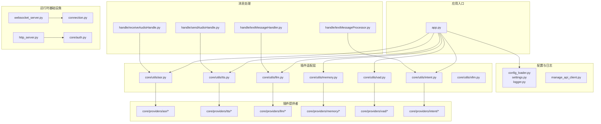
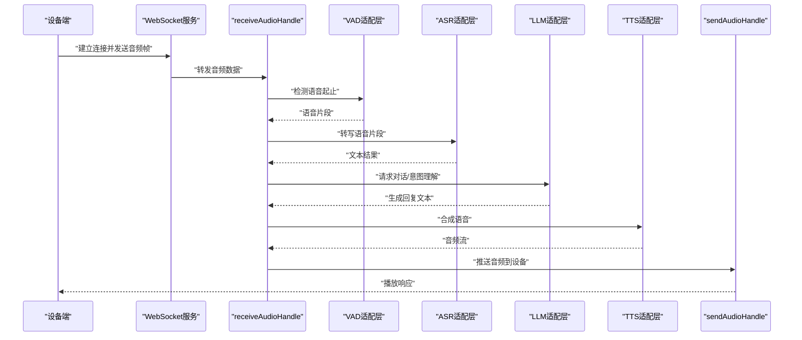
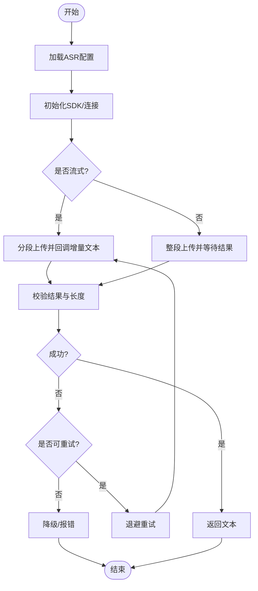
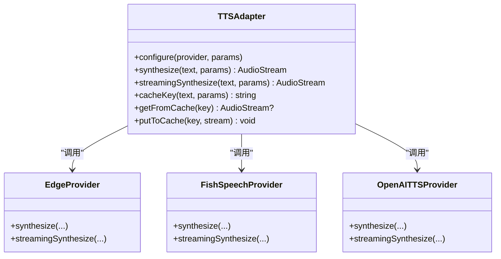
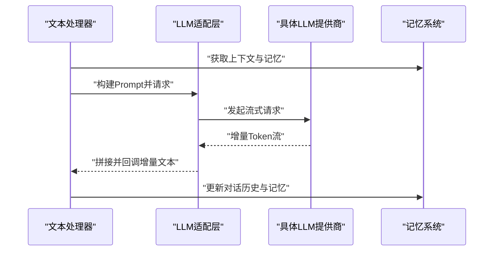
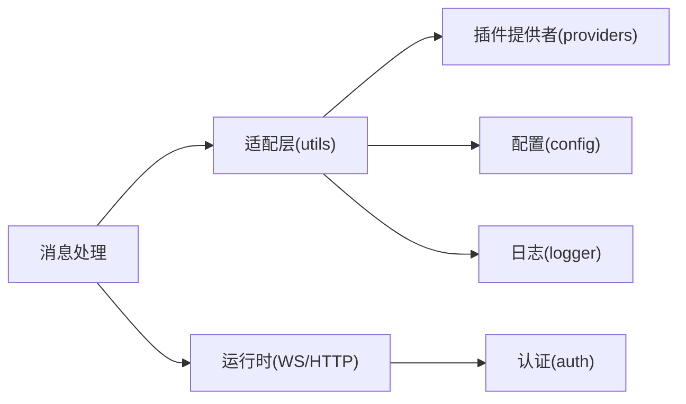

# 内置插件实现

<cite>
**本文引用的文件**   
- [app.py](file://main/xiaozhi-server/app.py)
- [modules_initialize.py](file://main/xiaozhi-server/core/utils/modules_initialize.py)
- [asr.py](file://main/xiaozhi-server/core/utils/asr.py)
- [tts.py](file://main/xiaozhi-server/core/utils/tts.py)
- [llm.py](file://main/xiaozhi-server/core/utils/llm.py)
- [vad.py](file://main/xiaozhi-server/core/utils/vad.py)
- [memory.py](file://main/xiaozhi-server/core/utils/memory.py)
- [intent.py](file://main/xiaozhi-server/core/utils/intent.py)
- [vllm.py](file://main/xiaozhi-server/core/utils/vllm.py)
- [audioRateController.py](file://main/xiaozhi-server/core/utils/audioRateController.py)
- [opus_encoder_utils.py](file://main/xiaozhi-server/core/utils/opus_encoder_utils.py)
- [p3.py](file://main/xiaozhi-server/core/utils/p3.py)
- [current_time.py](file://main/xiaozhi-server/core/utils/current_time.py)
- [gc_manager.py](file://main/xiaozhi-server/core/utils/gc_manager.py)
- [output_counter.py](file://main/xiaozhi-server/core/utils/output_counter.py)
- [prompt_manager.py](file://main/xiaozhi-server/core/utils/prompt_manager.py)
- [textUtils.py](file://main/xiaozhi-server/core/utils/textUtils.py)
- [dialogue.py](file://main/xiaozhi-server/core/utils/dialogue.py)
- [auth.py](file://main/xiaozhi-server/core/auth.py)
- [connection.py](file://main/xiaozhi-server/core/connection.py)
- [websocket_server.py](file://main/xiaozhi-server/core/websocket_server.py)
- [http_server.py](file://main/xiaozhi-server/core/http_server.py)
- [receiveAudioHandle.py](file://main/xiaozhi-server/core/handle/receiveAudioHandle.py)
- [sendAudioHandle.py](file://main/xiaozhi-server/core/handle/sendAudioHandle.py)
- [textMessageHandler.py](file://main/xiaozhi-server/core/handle/textMessageHandler.py)
- [textMessageProcessor.py](file://main/xiaozhi-server/core/handle/textMessageProcessor.py)
- [textMessageType.py](file://main/xiaozhi-server/core/handle/textMessageType.py)
- [abortHandle.py](file://main/xiaozhi-server/core/handle/abortHandle.py)
- [helloHandle.py](file://main/xiaozhi-server/core/handle/helloHandle.py)
- [reportHandle.py](file://main/xiaozhi-server/core/handle/reportHandle.py)
- [intentHandler.py](file://main/xiaozhi-server/core/handle/intentHandler.py)
- [base_handler.py](file://main/xiaozhi-server/core/api/base_handler.py)
- [ota_handler.py](file://main/xiaozhi-server/core/api/ota_handler.py)
- [vision_handler.py](file://main/xiaozhi-server/core/api/vision_handler.py)
- [config_loader.py](file://main/xiaozhi-server/config/config_loader.py)
- [settings.py](file://main/xiaozhi-server/config/settings.py)
- [logger.py](file://main/xiaozhi-server/config/logger.py)
- [manage_api_client.py](file://main/xiaozhi-server/config/manage_api_client.py)
- [performance_tester_asr.py](file://main/xiaozhi-server/performance_tester/performance_tester_asr.py)
- [performance_tester_llm.py](file://main/xiaozhi-server/performance_tester/performance_tester_llm.py)
- [performance_tester_stream_asr.py](file://main/xiaozhi-server/performance_tester/performance_tester_stream_asr.py)
- [performance_tester_tts.py](file://main/xiaozhi-server/performance_tester/performance_tester_tts.py)
- [performance_tester_vllm.py](file://main/xiaozhi-server/performance_tester/performance_tester_vllm.py)
- [loadplugins.py](file://main/xiaozhi-server/plugins_func/loadplugins.py)
- [register.py](file://main/xiaozhi-server/plugins_func/register.py)
</cite>

## 目录
1. [简介](#简介)
2. [项目结构](#项目结构)
3. [核心组件](#核心组件)
4. [架构总览](#架构总览)
5. [详细组件分析](#详细组件分析)
6. [依赖关系分析](#依赖关系分析)
7. [性能考量](#性能考量)
8. [故障排查指南](#故障排查指南)
9. [结论](#结论)
10. [附录](#附录)

## 简介
本文件面向“xiaozhi-esp32-server”的内置插件体系，系统性梳理 ASR（语音识别）、TTS（语音合成）、LLM（大语言模型）、记忆系统、VAD（语音活动检测）、意图识别等插件的实现细节与使用方式。文档覆盖：
- 插件初始化流程与连接管理
- 配置参数与切换策略
- 调用方式与错误处理
- 缓存策略与性能优化
- 监控指标、日志记录与调试技巧
- 典型使用示例与配置模板

## 项目结构
服务器核心位于 main/xiaozhi-server，插件相关代码集中在 core/providers 与 core/utils 两个层次：
- core/utils 提供统一的工具与适配器层，负责加载、初始化、缓存、并发控制与通用能力封装
- core/providers 按功能域组织具体插件实现（ASR/TTS/LLM/Memory/VAD/Intent 等）
- core/handle 编排音频与文本消息的处理链路
- config 提供配置加载、日志、设置与远端管理客户端
- plugins_func 提供插件注册与动态加载机制

图表来源
- [app.py](file://main/xiaozhi-server/app.py)
- [config_loader.py](file://main/xiaozhi-server/config/config_loader.py)
- [asr.py](file://main/xiaozhi-server/core/utils/asr.py)
- [tts.py](file://main/xiaozhi-server/core/utils/tts.py)
- [llm.py](file://main/xiaozhi-server/core/utils/llm.py)
- [vad.py](file://main/xiaozhi-server/core/utils/vad.py)
- [memory.py](file://main/xiaozhi-server/core/utils/memory.py)
- [intent.py](file://main/xiaozhi-server/core/utils/intent.py)
- [receiveAudioHandle.py](file://main/xiaozhi-server/core/handle/receiveAudioHandle.py)
- [sendAudioHandle.py](file://main/xiaozhi-server/core/handle/sendAudioHandle.py)
- [textMessageHandler.py](file://main/xiaozhi-server/core/handle/textMessageHandler.py)
- [textMessageProcessor.py](file://main/xiaozhi-server/core/handle/textMessageProcessor.py)
- [websocket_server.py](file://main/xiaozhi-server/core/websocket_server.py)
- [http_server.py](file://main/xiaozhi-server/core/http_server.py)
- [connection.py](file://main/xiaozhi-server/core/connection.py)
- [auth.py](file://main/xiaozhi-server/core/auth.py)

章节来源
- [app.py](file://main/xiaozhi-server/app.py)
- [config_loader.py](file://main/xiaozhi-server/config/config_loader.py)
- [settings.py](file://main/xiaozhi-server/config/settings.py)
- [logger.py](file://main/xiaozhi-server/config/logger.py)

## 核心组件
- 插件统一适配层
  - ASR/TTS/LLM/VAD/Memory/Intent 等通过 core/utils 下的模块进行统一抽象，屏蔽不同提供商的差异，对外暴露一致的接口
  - 支持多实例、热切换、重试与降级
- 插件提供者
  - core/providers 下按领域划分的具体实现，如阿里云/百度/讯飞 ASR，Edge/FishSpeech/OpenAI TTS，OpenAI/Gemini/Coze LLM 等
- 消息处理管线
  - receiveAudioHandle 接收设备音频流，经 VAD 切分后送入 ASR；ASR 结果进入 LLM 生成回复，再由 TTS 合成音频返回
  - textMessageHandler 与 textMessageProcessor 处理文本消息与意图解析
- 运行时与配置
  - websocket_server/http_server 提供通信通道；config_loader/settings 加载配置；logger 统一日志；manage_api_client 对接管理 API

章节来源
- [asr.py](file://main/xiaozhi-server/core/utils/asr.py)
- [tts.py](file://main/xiaozhi-server/core/utils/tts.py)
- [llm.py](file://main/xiaozhi-server/core/utils/llm.py)
- [vad.py](file://main/xiaozhi-server/core/utils/vad.py)
- [memory.py](file://main/xiaozhi-server/core/utils/memory.py)
- [intent.py](file://main/xiaozhi-server/core/utils/intent.py)
- [receiveAudioHandle.py](file://main/xiaozhi-server/core/handle/receiveAudioHandle.py)
- [sendAudioHandle.py](file://main/xiaozhi-server/core/handle/sendAudioHandle.py)
- [textMessageHandler.py](file://main/xiaozhi-server/core/handle/textMessageHandler.py)
- [textMessageProcessor.py](file://main/xiaozhi-server/core/handle/textMessageProcessor.py)

## 架构总览
下图展示一次完整的语音交互流程，涵盖 VAD 切音、ASR、LLM、TTS 以及音频回传的关键步骤。

图表来源
- [websocket_server.py](file://main/xiaozhi-server/core/websocket_server.py)
- [receiveAudioHandle.py](file://main/xiaozhi-server/core/handle/receiveAudioHandle.py)
- [vad.py](file://main/xiaozhi-server/core/utils/vad.py)
- [asr.py](file://main/xiaozhi-server/core/utils/asr.py)
- [llm.py](file://main/xiaozhi-server/core/utils/llm.py)
- [tts.py](file://main/xiaozhi-server/core/utils/tts.py)
- [sendAudioHandle.py](file://main/xiaozhi-server/core/handle/sendAudioHandle.py)

## 详细组件分析

### ASR 插件（阿里云、百度、讯飞等）
- 职责与接口
  - 统一封装不同 ASR 提供商的鉴权、上传、流式/非流式转写、超时与重试
  - 对外暴露“输入音频 -> 输出文本”的接口，支持流式增量文本回调
- 初始化与连接管理
  - 通过配置选择提供商，创建 SDK 客户端或长连接会话
  - 连接池与会话复用，避免频繁握手
- 缓存策略
  - 对短文本或高频短语可启用本地缓存，减少重复请求
- 错误处理
  - 网络异常、鉴权失败、限流与超时均有明确重试与降级策略
- 性能特点
  - 支持流式传输降低首字延迟；合理分片与编码（Opus/P3）提升吞吐
- 配置要点
  - 提供商密钥、区域、采样率、编码格式、超时时间、重试次数、是否启用流式
- 使用示例与切换
  - 在配置中切换 provider 字段即可切换服务商；同一会话内可基于优先级自动切换
- 监控与日志
  - 记录请求耗时、成功率、错误码分布；关键路径打点便于定位瓶颈

图表来源
- [asr.py](file://main/xiaozhi-server/core/utils/asr.py)
- [receiveAudioHandle.py](file://main/xiaozhi-server/core/handle/receiveAudioHandle.py)

章节来源
- [asr.py](file://main/xiaozhi-server/core/utils/asr.py)
- [receiveAudioHandle.py](file://main/xiaozhi-server/core/handle/receiveAudioHandle.py)

### TTS 插件（Edge、FishSpeech、OpenAI 等）
- 职责与接口
  - 将文本转换为音频流，支持多种音色、语速、音量与格式
- 初始化与连接管理
  - 根据 provider 初始化对应 SDK；长连接用于流式合成
- 缓存策略
  - 对相同文本+参数组合进行哈希缓存，命中则直接返回音频块
- 错误处理
  - 网络抖动、限流、模型不可用等场景具备重试与降级（如切换备用 provider）
- 性能特点
  - 流式合成显著降低首包延迟；音频编码采用 Opus/P3 减小带宽占用
- 配置要点
  - 提供商密钥、音色、语速、采样率、编码格式、超时、重试、缓存开关
- 使用示例与切换
  - 通过配置切换 provider；可在运行时根据质量/成本动态选择
- 监控与日志
  - 记录合成时长、字节数、缓存命中率、错误类型分布

图表来源
- [tts.py](file://main/xiaozhi-server/core/utils/tts.py)

章节来源
- [tts.py](file://main/xiaozhi-server/core/utils/tts.py)

### LLM 插件（OpenAI、Gemini、Coze 等）
- 职责与接口
  - 统一对话上下文、系统提示词、工具调用与流式输出
- 初始化与连接管理
  - 按 provider 初始化客户端；支持多模型并行与负载均衡
- 缓存策略
  - 对相似 prompt 与历史可启用语义缓存，减少重复推理
- 错误处理
  - 鉴权失败、配额不足、超时等场景具备重试、熔断与降级
- 性能特点
  - 流式输出降低首字延迟；上下文压缩与摘要减少 token 消耗
- 配置要点
  - 提供商密钥、模型名、温度、最大 token、超时、重试、是否流式、工具列表
- 使用示例与切换
  - 配置中指定 model/provider；可按场景切换不同模型
- 监控与指标
  - 记录 token 用量、首字延迟、完整时延、错误码、缓存命中率

图表来源
- [llm.py](file://main/xiaozhi-server/core/utils/llm.py)
- [memory.py](file://main/xiaozhi-server/core/utils/memory.py)
- [textMessageHandler.py](file://main/xiaozhi-server/core/handle/textMessageHandler.py)
- [textMessageProcessor.py](file://main/xiaozhi-server/core/handle/textMessageProcessor.py)

章节来源
- [llm.py](file://main/xiaozhi-server/core/utils/llm.py)
- [memory.py](file://main/xiaozhi-server/core/utils/memory.py)
- [textMessageHandler.py](file://main/xiaozhi-server/core/handle/textMessageHandler.py)
- [textMessageProcessor.py](file://main/xiaozhi-server/core/handle/textMessageProcessor.py)

### 记忆系统插件
- 职责与接口
  - 维护短期对话历史、长期记忆与用户画像；支持检索增强（RAG）
- 初始化与连接管理
  - 内存存储与持久化存储（SQLite/MySQL/向量库）双轨；按需加载
- 缓存策略
  - 热点记忆与常用知识条目缓存；过期与淘汰策略
- 错误处理
  - 读写失败、索引损坏等具备恢复与重建机制
- 性能特点
  - 向量化检索加速匹配；批量写入与异步落盘降低阻塞
- 配置要点
  - 存储后端、索引类型、相似度阈值、缓存大小、过期时间
- 使用示例与切换
  - 通过配置切换存储后端；支持热插拔不同记忆策略

章节来源
- [memory.py](file://main/xiaozhi-server/core/utils/memory.py)

### VAD 插件
- 职责与接口
  - 实时检测语音起止，输出静音/语音片段边界
- 初始化与连接管理
  - 本地模型（Silero）或云端服务；支持多线程处理
- 缓存策略
  - 模型权重与特征缓存，减少冷启动开销
- 错误处理
  - 模型加载失败、音频格式不兼容等具备回退策略
- 性能特点
  - 低延迟切片；滑动窗口与阈值可调
- 配置要点
  - 提供商/本地模型、阈值、窗口大小、采样率、线程数
- 使用示例与切换
  - 配置中切换 vad_provider；可在线调整阈值以平衡误检与漏检

章节来源
- [vad.py](file://main/xiaozhi-server/core/utils/vad.py)

### 意图识别插件
- 职责与接口
  - 从文本或对话上下文中提取用户意图，驱动后续动作（工具调用、流程跳转）
- 初始化与连接管理
  - 规则引擎与模型驱动并存；支持热更新规则
- 缓存策略
  - 常见意图与槽位值缓存，提高命中率
- 错误处理
  - 置信度低时回退到澄清问句或默认流程
- 性能特点
  - 轻量规则优先，复杂场景再调用模型
- 配置要点
  - 规则集、模型名称、置信度阈值、槽位定义
- 使用示例与切换
  - 配置中切换 intent_provider；可叠加多策略融合

章节来源
- [intent.py](file://main/xiaozhi-server/core/utils/intent.py)

### vLLM 插件（高性能推理）
- 职责与接口
  - 对接 vLLM 推理服务，提供高吞吐、低延迟的 LLM 推理能力
- 初始化与连接管理
  - 连接推理服务、管理批处理与调度
- 缓存策略
  - KV Cache 与 Prompt Cache 提升重复请求性能
- 错误处理
  - 服务不可用、OOM、超时等具备重试与降级
- 性能特点
  - 连续批处理、PagedAttention、张量并行
- 配置要点
  - 服务地址、模型名、批大小、最大序列长度、超时
- 使用示例与切换
  - 配置中指定 vllm_endpoint 与模型；可与普通 LLM 插件并行对比测试

章节来源
- [vllm.py](file://main/xiaozhi-server/core/utils/vllm.py)

### 音频处理与编码
- 音频速率控制
  - audioRateController 保障播放速率稳定，避免卡顿或过快
- Opus 编码器工具
  - opus_encoder_utils 提供编码参数配置与缓冲管理
- P3 编解码
  - p3.py 支持 P3 格式，降低带宽占用
- 当前时间与计时
  - current_time.py 提供高精度时间戳，便于性能统计
- GC 管理
  - gc_manager.py 控制垃圾回收频率，避免抖动
- 输出计数
  - output_counter.py 统计输出字节与帧数，辅助监控

章节来源
- [audioRateController.py](file://main/xiaozhi-server/core/utils/audioRateController.py)
- [opus_encoder_utils.py](file://main/xiaozhi-server/core/utils/opus_encoder_utils.py)
- [p3.py](file://main/xiaozhi-server/core/utils/p3.py)
- [current_time.py](file://main/xiaozhi-server/core/utils/current_time.py)
- [gc_manager.py](file://main/xiaozhi-server/core/utils/gc_manager.py)
- [output_counter.py](file://main/xiaozhi-server/core/utils/output_counter.py)

### 消息处理与编排
- 接收音频处理
  - receiveAudioHandle 负责 VAD 切分、ASR 转写、错误上报
- 发送音频处理
  - sendAudioHandle 负责 TTS 音频流推送、速率控制与断线重连
- 文本消息处理
  - textMessageHandler 路由文本消息到相应处理器
- 文本消息处理器
  - textMessageProcessor 编排 LLM、意图、记忆与工具调用
- 其他处理器
  - helloHandle、reportHandle、abortHandle 处理握手、状态上报与中断

章节来源
- [receiveAudioHandle.py](file://main/xiaozhi-server/core/handle/receiveAudioHandle.py)
- [sendAudioHandle.py](file://main/xiaozhi-server/core/handle/sendAudioHandle.py)
- [textMessageHandler.py](file://main/xiaozhi-server/core/handle/textMessageHandler.py)
- [textMessageProcessor.py](file://main/xiaozhi-server/core/handle/textMessageProcessor.py)
- [textMessageType.py](file://main/xiaozhi-server/core/handle/textMessageType.py)
- [helloHandle.py](file://main/xiaozhi-server/core/handle/helloHandle.py)
- [reportHandle.py](file://main/xiaozhi-server/core/handle/reportHandle.py)
- [abortHandle.py](file://main/xiaozhi-server/core/handle/abortHandle.py)

### API 与 HTTP 服务
- 基础处理器
  - base_handler.py 提供通用请求处理逻辑
- OTA 处理器
  - ota_handler.py 处理设备固件升级
- 视觉处理器
  - vision_handler.py 处理视觉相关请求
- HTTP 服务
  - http_server.py 提供 REST API 与静态资源服务

章节来源
- [base_handler.py](file://main/xiaozhi-server/core/api/base_handler.py)
- [ota_handler.py](file://main/xiaozhi-server/core/api/ota_handler.py)
- [vision_handler.py](file://main/xiaozhi-server/core/api/vision_handler.py)
- [http_server.py](file://main/xiaozhi-server/core/http_server.py)

### 插件注册与动态加载
- 插件加载器
  - loadplugins.py 扫描并加载插件模块
- 插件注册表
  - register.py 维护插件元数据与版本信息

章节来源
- [loadplugins.py](file://main/xiaozhi-server/plugins_func/loadplugins.py)
- [register.py](file://main/xiaozhi-server/plugins_func/register.py)

## 依赖关系分析
- 耦合与内聚
  - utils 层对内聚性强，对外暴露稳定接口；providers 层高度解耦，便于替换
- 直接依赖
  - 消息处理依赖 utils 适配层；utils 依赖 providers 具体实现
- 间接依赖
  - 配置与日志贯穿全链路；运行时服务（WS/HTTP）为上层提供通道
- 外部依赖
  - 各提供商 SDK、推理服务、存储后端

图表来源
- [receiveAudioHandle.py](file://main/xiaozhi-server/core/handle/receiveAudioHandle.py)
- [sendAudioHandle.py](file://main/xiaozhi-server/core/handle/sendAudioHandle.py)
- [textMessageHandler.py](file://main/xiaozhi-server/core/handle/textMessageHandler.py)
- [textMessageProcessor.py](file://main/xiaozhi-server/core/handle/textMessageProcessor.py)
- [asr.py](file://main/xiaozhi-server/core/utils/asr.py)
- [tts.py](file://main/xiaozhi-server/core/utils/tts.py)
- [llm.py](file://main/xiaozhi-server/core/utils/llm.py)
- [vad.py](file://main/xiaozhi-server/core/utils/vad.py)
- [memory.py](file://main/xiaozhi-server/core/utils/memory.py)
- [intent.py](file://main/xiaozhi-server/core/utils/intent.py)
- [config_loader.py](file://main/xiaozhi-server/config/config_loader.py)
- [logger.py](file://main/xiaozhi-server/config/logger.py)
- [websocket_server.py](file://main/xiaozhi-server/core/websocket_server.py)
- [http_server.py](file://main/xiaozhi-server/core/http_server.py)
- [auth.py](file://main/xiaozhi-server/core/auth.py)

章节来源
- [asr.py](file://main/xiaozhi-server/core/utils/asr.py)
- [tts.py](file://main/xiaozhi-server/core/utils/tts.py)
- [llm.py](file://main/xiaozhi-server/core/utils/llm.py)
- [vad.py](file://main/xiaozhi-server/core/utils/vad.py)
- [memory.py](file://main/xiaozhi-server/core/utils/memory.py)
- [intent.py](file://main/xiaozhi-server/core/utils/intent.py)
- [config_loader.py](file://main/xiaozhi-server/config/config_loader.py)
- [logger.py](file://main/xiaozhi-server/config/logger.py)
- [websocket_server.py](file://main/xiaozhi-server/core/websocket_server.py)
- [http_server.py](file://main/xiaozhi-server/core/http_server.py)
- [auth.py](file://main/xiaozhi-server/core/auth.py)

## 性能考量
- 流式处理
  - ASR/TTS/LLM 均支持流式，降低首字延迟与端到端时延
- 编码与带宽
  - Opus/P3 编码减少带宽占用；合理分片提升吞吐
- 缓存策略
  - TTS 文本哈希缓存、LLM 语义缓存、ASR 短文本缓存
- 并发与队列
  - 音频处理与网络 I/O 分离；队列背压防止积压
- 资源管理
  - GC 调优、连接池复用、模型权重预热
- 监控指标
  - 首字延迟、端到端时延、成功率、错误码分布、缓存命中率、token 用量、字节数

[本节为通用指导，不直接分析具体文件]

## 故障排查指南
- 常见问题
  - 鉴权失败：检查密钥与区域配置；查看鉴权错误码
  - 网络超时：增加超时与重试；检查网络连通性与代理
  - 限流与配额：降低请求频率或扩容；启用排队与退避
  - 模型不可用：切换备用 provider；检查服务健康状态
  - 音频异常：确认采样率与编码格式；检查 VAD 阈值
- 日志与调试
  - 开启详细日志；关键路径打点；导出性能指标
  - 使用性能测试工具验证各插件表现
- 工具与脚本
  - performance_tester_* 系列脚本用于基准测试与回归

章节来源
- [logger.py](file://main/xiaozhi-server/config/logger.py)
- [performance_tester_asr.py](file://main/xiaozhi-server/performance_tester/performance_tester_asr.py)
- [performance_tester_llm.py](file://main/xiaozhi-server/performance_tester/performance_tester_llm.py)
- [performance_tester_stream_asr.py](file://main/xiaozhi-server/performance_tester/performance_tester_stream_asr.py)
- [performance_tester_tts.py](file://main/xiaozhi-server/performance_tester/performance_tester_tts.py)
- [performance_tester_vllm.py](file://main/xiaozhi-server/performance_tester/performance_tester_vllm.py)

## 结论
本项目的内置插件体系通过统一的适配层与解耦的提供者实现，提供了高可用、可扩展且易配置的 ASR/TTS/LLM/Memory/VAD/Intent 能力。借助流式处理、缓存策略与完善的错误处理，系统在延迟、吞吐与稳定性方面达到生产级要求。配合监控与性能测试工具，可快速定位问题并持续优化。

[本节为总结性内容，不直接分析具体文件]

## 附录
- 配置模板建议
  - ASR：provider、apiKey、region、sample_rate、codec、timeout、retry、streaming
  - TTS：provider、voice、speed、sample_rate、codec、timeout、retry、cache
  - LLM：provider、model、temperature、max_tokens、timeout、retry、streaming、tools
  - Memory：backend、index_type、similarity_threshold、cache_size、ttl
  - VAD：provider、threshold、window_size、sample_rate、threads
  - Intent：rules_path、model、confidence_threshold、slots
- 使用示例
  - 切换提供商：修改配置中的 provider 字段；重启或热加载生效
  - 处理异常：捕获错误码并触发重试/降级；记录日志与指标
  - 优化响应：启用流式、缓存与合理的编码参数；调整阈值与超时
- 监控与日志
  - 关键指标：首字延迟、端到端时延、成功率、错误码、缓存命中率、token 用量、字节数
  - 日志级别：DEBUG/INFO/WARN/ERROR；关键路径埋点

[本节为补充说明，不直接分析具体文件]