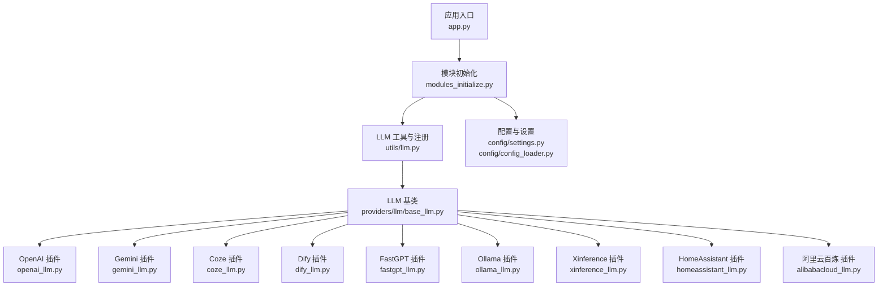
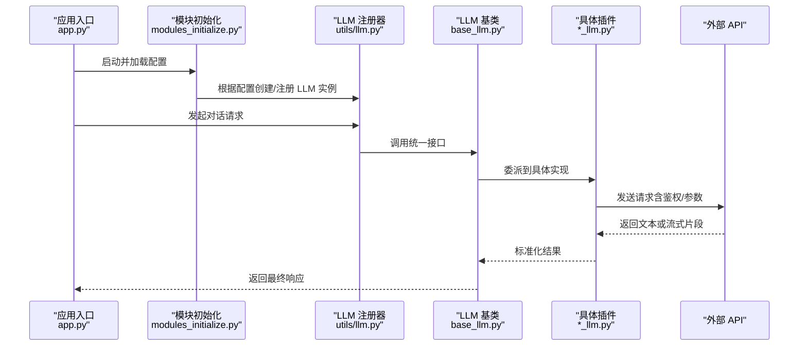
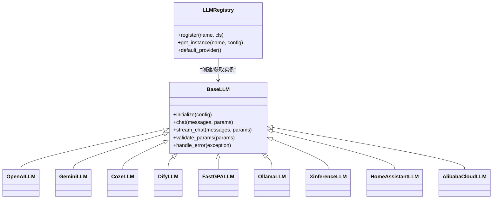
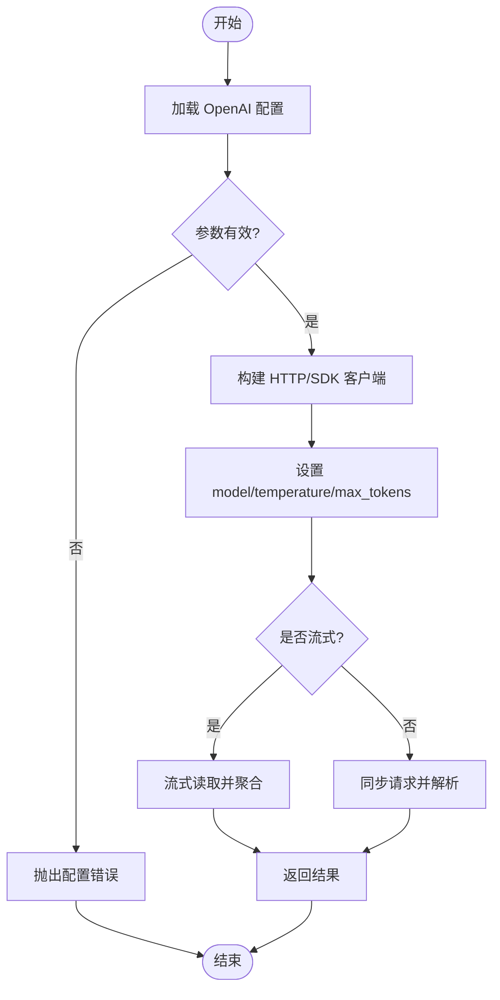
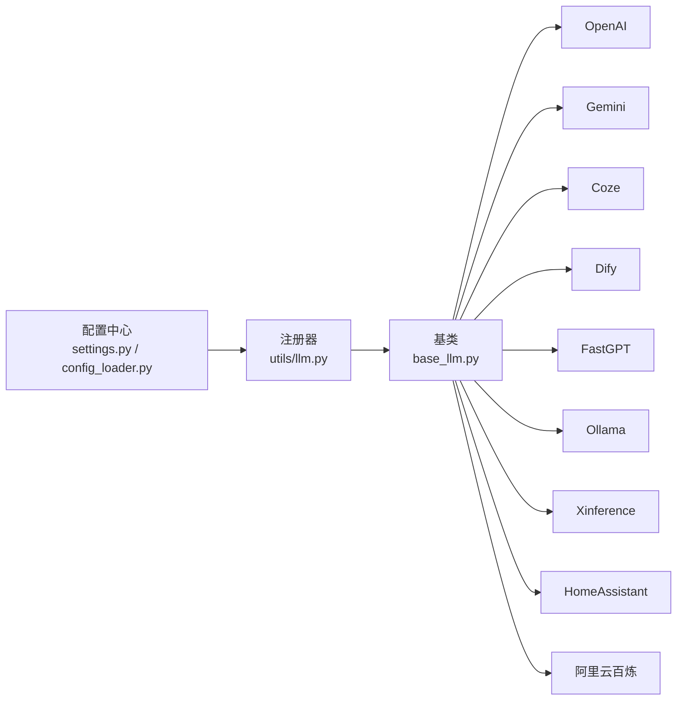

# 大语言模型插件 (LLM)

<cite>
**本文引用的文件**   
- [app.py](file://main/xiaozhi-server/app.py)
- [modules_initialize.py](file://main/xiaozhi-server/core/utils/modules_initialize.py)
- [llm.py](file://main/xiaozhi-server/core/utils/llm.py)
- [base_llm.py](file://main/xiaozhi-server/core/providers/llm/base_llm.py)
- [openai_llm.py](file://main/xiaozhi-server/core/providers/llm/openai_llm.py)
- [gemini_llm.py](file://main/xiaozhi-server/core/providers/llm/gemini_llm.py)
- [coze_llm.py](file://main/xiaozhi-server/core/providers/llm/coze_llm.py)
- [dify_llm.py](file://main/xiaozhi-server/core/providers/llm/dify_llm.py)
- [fastgpt_llm.py](file://main/xiaozhi-server/core/providers/llm/fastgpt_llm.py)
- [ollama_llm.py](file://main/xiaozhi-server/core/providers/llm/ollama_llm.py)
- [xinference_llm.py](file://main/xiaozhi-server/core/providers/llm/xinference_llm.py)
- [homeassistant_llm.py](file://main/xiaozhi-server/core/providers/llm/homeassistant_llm.py)
- [alibabacloud_llm.py](file://main/xiaozhi-server/core/providers/llm/alibabacloud_llm.py)
- [settings.py](file://main/xiaozhi-server/config/settings.py)
- [config_loader.py](file://main/xiaozhi-server/config/config_loader.py)
</cite>

## 目录
1. [简介](#简介)
2. [项目结构](#项目结构)
3. [核心组件](#核心组件)
4. [架构总览](#架构总览)
5. [详细组件分析](#详细组件分析)
6. [依赖关系分析](#依赖关系分析)
7. [性能考量](#性能考量)
8. [故障排查指南](#故障排查指南)
9. [结论](#结论)
10. [附录](#附录)

## 简介
本技术文档面向大语言模型（LLM）插件体系，覆盖 OpenAI、Gemini、Coze、Dify、FastGPT、Ollama、Xinference、HomeAssistant、AliBL（阿里云百炼）等提供商。文档从系统架构、组件职责、数据流与处理逻辑出发，详细说明各插件的配置参数、API 密钥管理、模型选择、上下文长度、温度参数、流式响应等能力；并给出初始化流程、连接池管理、请求重试、超时处理的实现要点。同时提供使用示例与配置模板思路，展示如何切换不同 LLM 提供商、处理 API 限制、优化响应速度，以及安全、成本控制、负载均衡与故障转移策略。

## 项目结构
LLM 相关代码主要位于 xiaozhi-server 的 core 层：
- 配置加载与全局设置：config/settings.py、config/config_loader.py
- 模块初始化与注册：core/utils/modules_initialize.py
- LLM 抽象与工具：core/utils/llm.py、core/providers/llm/base_llm.py
- 各提供商实现：core/providers/llm/*_llm.py
- 应用入口与装配：app.py

图表来源 
- [app.py](file://main/xiaozhi-server/app.py)
- [modules_initialize.py](file://main/xiaozhi-server/core/utils/modules_initialize.py)
- [llm.py](file://main/xiaozhi-server/core/utils/llm.py)
- [base_llm.py](file://main/xiaozhi-server/core/providers/llm/base_llm.py)
- [openai_llm.py](file://main/xiaozhi-server/core/providers/llm/openai_llm.py)
- [gemini_llm.py](file://main/xiaozhi-server/core/providers/llm/gemini_llm.py)
- [coze_llm.py](file://main/xiaozhi-server/core/providers/llm/coze_llm.py)
- [dify_llm.py](file://main/xiaozhi-server/core/providers/llm/dify_llm.py)
- [fastgpt_llm.py](file://main/xiaozhi-server/core/providers/llm/fastgpt_llm.py)
- [ollama_llm.py](file://main/xiaozhi-server/core/providers/llm/ollama_llm.py)
- [xinference_llm.py](file://main/xiaozhi-server/core/providers/llm/xinference_llm.py)
- [homeassistant_llm.py](file://main/xiaozhi-server/core/providers/llm/homeassistant_llm.py)
- [alibabacloud_llm.py](file://main/xiaozhi-server/core/providers/llm/alibabacloud_llm.py)
- [settings.py](file://main/xiaozhi-server/config/settings.py)
- [config_loader.py](file://main/xiaozhi-server/config/config_loader.py)

章节来源
- [app.py](file://main/xiaozhi-server/app.py)
- [modules_initialize.py](file://main/xiaozhi-server/core/utils/modules_initialize.py)
- [settings.py](file://main/xiaozhi-server/config/settings.py)
- [config_loader.py](file://main/xiaozhi-server/config/config_loader.py)

## 核心组件
- 抽象基类 base_llm：定义统一的 LLM 接口（如对话生成、流式输出、参数校验、错误处理），屏蔽各提供商差异。
- 工具模块 llm：负责按配置动态实例化具体 LLM 插件，维护默认实例与多实例路由。
- 模块初始化 modules_initialize：在应用启动时加载配置、注册 LLM 插件、建立连接池或客户端单例。
- 各提供商实现 *_llm.py：封装各自 SDK/HTTP 调用、鉴权、流式解析、重试与超时控制。

章节来源
- [base_llm.py](file://main/xiaozhi-server/core/providers/llm/base_llm.py)
- [llm.py](file://main/xiaozhi-server/core/utils/llm.py)
- [modules_initialize.py](file://main/xiaozhi-server/core/utils/modules_initialize.py)

## 架构总览
下图展示了从应用入口到具体 LLM 插件的调用链路与数据流向，包括配置加载、插件注册、请求构造、流式响应返回。

图表来源 
- [app.py](file://main/xiaozhi-server/app.py)
- [modules_initialize.py](file://main/xiaozhi-server/core/utils/modules_initialize.py)
- [llm.py](file://main/xiaozhi-server/core/utils/llm.py)
- [base_llm.py](file://main/xiaozhi-server/core/providers/llm/base_llm.py)

## 详细组件分析

### 抽象基类与工具
- base_llm：定义标准方法签名（如对话生成、流式生成、参数校验、错误码映射），确保上层调用一致。
- utils/llm：根据配置项选择并实例化对应插件，支持多实例与默认回退。

图表来源 
- [base_llm.py](file://main/xiaozhi-server/core/providers/llm/base_llm.py)
- [llm.py](file://main/xiaozhi-server/core/utils/llm.py)
- [openai_llm.py](file://main/xiaozhi-server/core/providers/llm/openai_llm.py)
- [gemini_llm.py](file://main/xiaozhi-server/core/providers/llm/gemini_llm.py)
- [coze_llm.py](file://main/xiaozhi-server/core/providers/llm/coze_llm.py)
- [dify_llm.py](file://main/xiaozhi-server/core/providers/llm/dify_llm.py)
- [fastgpt_llm.py](file://main/xiaozhi-server/core/providers/llm/fastgpt_llm.py)
- [ollama_llm.py](file://main/xiaozhi-server/core/providers/llm/ollama_llm.py)
- [xinference_llm.py](file://main/xiaozhi-server/core/providers/llm/xinference_llm.py)
- [homeassistant_llm.py](file://main/xiaozhi-server/core/providers/llm/homeassistant_llm.py)
- [alibabacloud_llm.py](file://main/xiaozhi-server/core/providers/llm/alibabacloud_llm.py)

章节来源
- [base_llm.py](file://main/xiaozhi-server/core/providers/llm/base_llm.py)
- [llm.py](file://main/xiaozhi-server/core/utils/llm.py)

### OpenAI 插件
- 配置参数：api_key、base_url、model、max_tokens、temperature、top_p、timeout、retry_count、streaming。
- API 密钥管理：从配置读取并注入到 HTTP 客户端或 SDK。
- 模型选择：通过 model 字段指定，支持热切换。
- 上下文长度：由 max_tokens 与后端模型上限共同决定。
- 温度参数：temperature 控制随机性。
- 流式响应：启用 streaming 后逐块返回增量文本。
- 重试与超时：可配置 retry_count 与 timeout，失败自动重试。

图表来源 
- [openai_llm.py](file://main/xiaozhi-server/core/providers/llm/openai_llm.py)

章节来源
- [openai_llm.py](file://main/xiaozhi-server/core/providers/llm/openai_llm.py)

### Gemini 插件
- 配置参数：api_key、model、generation_config（temperature、top_p、max_output_tokens）、timeout、retry。
- 模型选择：通过 model 字段指定。
- 上下文长度：受 max_output_tokens 与模型上下文窗口限制。
- 温度参数：temperature 控制多样性。
- 流式响应：按块返回增量内容。
- 重试与超时：对网络异常进行指数退避重试。

章节来源
- [gemini_llm.py](file://main/xiaozhi-server/core/providers/llm/gemini_llm.py)

### Coze 插件
- 配置参数：api_key、bot_id、user_id、model、timeout、streaming。
- API 密钥管理：通过请求头或查询参数注入。
- 模型选择：通过 model 或 bot 配置决定。
- 上下文长度：由后端会话上下文与 token 上限控制。
- 温度参数：若平台暴露则透传。
- 流式响应：按事件推送增量文本。
- 重试与超时：针对网络抖动进行有限重试。

章节来源
- [coze_llm.py](file://main/xiaozhi-server/core/providers/llm/coze_llm.py)

### Dify 插件
- 配置参数：api_key、app_id、mode（chat/completion）、timeout、streaming。
- API 密钥管理：通过 Header 或 URL 参数传递。
- 模型选择：由 app_id 与 mode 决定。
- 上下文长度：受 Dify 工作流或对话上下文限制。
- 温度参数：若工作流暴露则透传。
- 流式响应：SSE 或 WebSocket 增量返回。
- 重试与超时：对服务端限流进行退避重试。

章节来源
- [dify_llm.py](file://main/xiaozhi-server/core/providers/llm/dify_llm.py)

### FastGPT 插件
- 配置参数：api_key、project_id、model、timeout、streaming。
- API 密钥管理：通过请求头注入。
- 模型选择：通过 project/model 组合确定。
- 上下文长度：受项目配置与模型上限约束。
- 温度参数：若平台暴露则透传。
- 流式响应：按块返回增量文本。
- 重试与超时：对限流与网络异常进行重试。

章节来源
- [fastgpt_llm.py](file://main/xiaozhi-server/core/providers/llm/fastgpt_llm.py)

### Ollama 插件
- 配置参数：base_url、model、stream、timeout、num_ctx（上下文窗口）。
- API 密钥管理：本地部署通常无需密钥。
- 模型选择：通过 model 字段指定。
- 上下文长度：num_ctx 控制上下文窗口大小。
- 温度参数：temperature 控制随机性。
- 流式响应：流式返回增量文本。
- 重试与超时：对本地服务可用性进行重试。

章节来源
- [ollama_llm.py](file://main/xiaozhi-server/core/providers/llm/ollama_llm.py)

### Xinference 插件
- 配置参数：base_url、model、temperature、max_tokens、timeout、streaming。
- API 密钥管理：可选，视部署而定。
- 模型选择：通过 model 字段指定。
- 上下文长度：max_tokens 与模型上限共同决定。
- 温度参数：temperature 控制随机性。
- 流式响应：按块返回增量文本。
- 重试与超时：对服务重启与负载波动进行重试。

章节来源
- [xinference_llm.py](file://main/xiaozhi-server/core/providers/llm/xinference_llm.py)

### HomeAssistant 插件
- 配置参数：base_url、api_key、entity_id、timeout、streaming。
- API 密钥管理：通过认证头或令牌注入。
- 模型选择：由实体或脚本决定。
- 上下文长度：受 HA 集成限制。
- 温度参数：若暴露则透传。
- 流式响应：按事件推送增量文本。
- 重试与超时：对设备或服务不可用进行重试。

章节来源
- [homeassistant_llm.py](file://main/xiaozhi-server/core/providers/llm/homeassistant_llm.py)

### 阿里云百炼（AliBL）插件
- 配置参数：access_key_id、access_key_secret、endpoint、model、timeout、streaming。
- API 密钥管理：通过 AK/SK 签名或 Token 注入。
- 模型选择：通过 model 字段指定。
- 上下文长度：受模型上下文窗口限制。
- 温度参数：temperature 控制随机性。
- 流式响应：按块返回增量文本。
- 重试与超时：对限流与服务降级进行重试。

章节来源
- [alibabacloud_llm.py](file://main/xiaozhi-server/core/providers/llm/alibabacloud_llm.py)

## 依赖关系分析
- 配置驱动：所有插件均依赖 settings.py 与 config_loader.py 提供的配置项。
- 注册机制：utils/llm.py 根据 provider 名称动态加载对应 *_llm.py 实现。
- 基类约束：base_llm.py 定义统一接口，保证上层调用一致性。
- 外部依赖：各插件分别依赖其提供商 SDK 或 HTTP 客户端。

图表来源 
- [settings.py](file://main/xiaozhi-server/config/settings.py)
- [config_loader.py](file://main/xiaozhi-server/config/config_loader.py)
- [llm.py](file://main/xiaozhi-server/core/utils/llm.py)
- [base_llm.py](file://main/xiaozhi-server/core/providers/llm/base_llm.py)

章节来源
- [settings.py](file://main/xiaozhi-server/config/settings.py)
- [config_loader.py](file://main/xiaozhi-server/config/config_loader.py)
- [llm.py](file://main/xiaozhi-server/core/utils/llm.py)
- [base_llm.py](file://main/xiaozhi-server/core/providers/llm/base_llm.py)

## 性能考量
- 连接池管理：为每个提供商维护独立的 HTTP 连接池，减少握手开销。
- 流式响应：优先使用流式接口，降低首字延迟与内存占用。
- 超时与重试：合理设置 timeout 与 retry_count，避免雪崩与长时间阻塞。
- 上下文长度：根据模型上限与业务需求调整 max_tokens/num_ctx，避免截断。
- 并发控制：在高并发场景下限制并行请求数，防止触发提供商限流。
- 缓存策略：对重复查询或固定提示词进行缓存，减少重复调用。

[本节为通用指导，不直接分析具体文件]

## 故障排查指南
- 配置错误：检查 api_key、base_url、model 等必填项是否正确。
- 鉴权失败：确认密钥权限与作用域，必要时重新生成。
- 限流与配额：观察返回码与日志，适当降低并发或增加重试间隔。
- 超时与网络抖动：增大 timeout 或启用指数退避重试。
- 流式中断：检查网络稳定性与下游服务状态，必要时回退为同步模式。
- 日志定位：查看各插件的错误处理与日志输出，定位问题根因。

章节来源
- [openai_llm.py](file://main/xiaozhi-server/core/providers/llm/openai_llm.py)
- [gemini_llm.py](file://main/xiaozhi-server/core/providers/llm/gemini_llm.py)
- [coze_llm.py](file://main/xiaozhi-server/core/providers/llm/coze_llm.py)
- [dify_llm.py](file://main/xiaozhi-server/core/providers/llm/dify_llm.py)
- [fastgpt_llm.py](file://main/xiaozhi-server/core/providers/llm/fastgpt_llm.py)
- [ollama_llm.py](file://main/xiaozhi-server/core/providers/llm/ollama_llm.py)
- [xinference_llm.py](file://main/xiaozhi-server/core/providers/llm/xinference_llm.py)
- [homeassistant_llm.py](file://main/xiaozhi-server/core/providers/llm/homeassistant_llm.py)
- [alibabacloud_llm.py](file://main/xiaozhi-server/core/providers/llm/alibabacloud_llm.py)

## 结论
本仓库通过统一的 LLM 抽象与插件化设计，将多种提供商接入到一致的调用接口中。借助配置驱动与模块初始化，可在运行时灵活切换提供商、优化参数与行为。结合连接池、流式响应、重试与超时控制，能够在高并发与不稳定网络环境下保持稳定的服务质量。建议在生产环境中结合成本与安全策略，实施负载均衡与故障转移，以获得最佳的用户体验与资源利用率。

[本节为总结性内容，不直接分析具体文件]

## 附录

### 使用示例与配置模板思路
- 切换提供商：在配置文件中修改 provider 字段为 openai/gemini/coze/dify/fastgpt/ollama/xinference/homeassistant/alibabacloud，并确保对应密钥与端点正确。
- 流式响应：开启 streaming 选项，前端按增量渲染，提升交互体验。
- 温度与上下文：根据任务类型调整 temperature 与 max_tokens/num_ctx，平衡创造性与准确性。
- 重试与超时：对易限流的提供商设置更保守的重试策略与较短的超时时间。

[本节为概念性说明，不直接分析具体文件]

### 安全考虑
- 密钥管理：使用环境变量或安全配置中心存储敏感信息，避免硬编码。
- 最小权限：为 API 密钥分配最小必要权限，定期轮换。
- 传输加密：始终使用 HTTPS，禁用不安全协议。
- 输入校验：对用户输入进行清洗与长度限制，防止注入与溢出。

[本节为概念性说明，不直接分析具体文件]

### 成本控制
- 模型选择：根据任务复杂度选择性价比更高的模型。
- 上下文裁剪：仅保留必要历史消息，减少 token 消耗。
- 缓存复用：对常见问答与固定提示词进行缓存，降低重复调用。
- 监控与告警：统计 token 用量与成本，设置阈值告警。

[本节为概念性说明，不直接分析具体文件]

### 负载均衡与故障转移
- 多实例部署：同一提供商部署多个实例，基于健康检查进行轮询或加权路由。
- 回退策略：主提供商失败时自动切换到备用提供商或本地模型。
- 限流保护：对上游与下游进行速率限制，避免级联失败。
- 熔断与隔离：对异常服务快速熔断，隔离故障影响范围。

[本节为概念性说明，不直接分析具体文件]