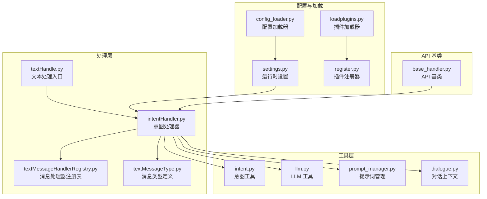
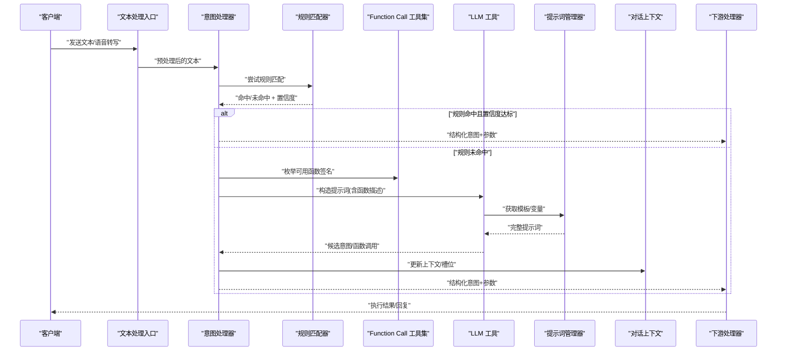
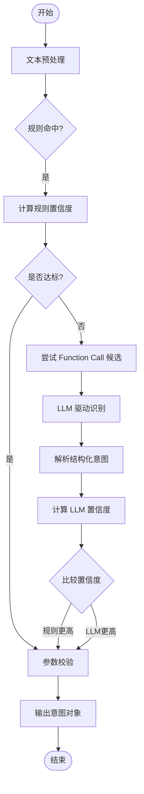
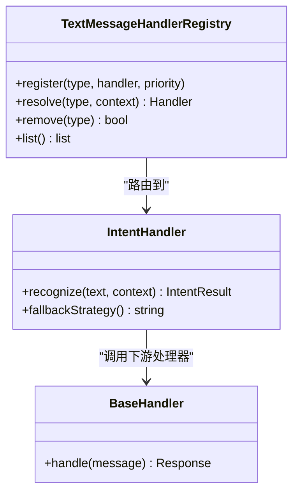
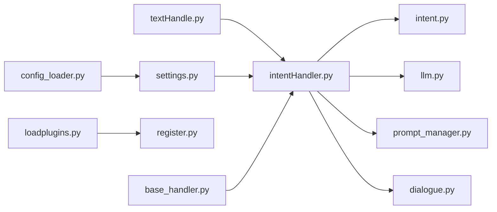

# 意图识别插件

<cite>
**本文引用的文件**   
- [intentHandler.py](file://main/xiaozhi-server/core/handle/intentHandler.py)
- [textMessageHandlerRegistry.py](file://main/xiaozhi-server/core/handle/textMessageHandlerRegistry.py)
- [textMessageType.py](file://main/xiaozhi-server/core/handle/textMessageType.py)
- [intent.py](file://main/xiaozhi-server/core/utils/intent.py)
- [modules_initialize.py](file://main/xiaozhi-server/core/utils/modules_initialize.py)
- [settings.py](file://main/xiaozhi-server/config/settings.py)
- [config_loader.py](file://main/xiaozhi-server/config/config_loader.py)
- [loadplugins.py](file://main/xiaozhi-server/plugins_func/loadplugins.py)
- [register.py](file://main/xiaozhi-server/plugins_func/register.py)
- [base_handler.py](file://main/xiaozhi-server/core/api/base_handler.py)
- [receiveAudioHandle.py](file://main/xiaozhi-server/core/handle/receiveAudioHandle.py)
- [sendAudioHandle.py](file://main/xiaozhi-server/core/handle/sendAudioHandle.py)
- [textHandle.py](file://main/xiaozhi-server/core/handle/textHandle.py)
- [llm.py](file://main/xiaozhi-server/core/utils/llm.py)
- [prompt_manager.py](file://main/xiaozhi-server/core/utils/prompt_manager.py)
- [dialogue.py](file://main/xiaozhi-server/core/utils/dialogue.py)
</cite>

## 目录
1. [简介](#简介)
2. [项目结构](#项目结构)
3. [核心组件](#核心组件)
4. [架构总览](#架构总览)
5. [详细组件分析](#详细组件分析)
6. [依赖关系分析](#依赖关系分析)
7. [性能考量](#性能考量)
8. [故障排查指南](#故障排查指南)
9. [结论](#结论)
10. [附录](#附录)

## 简介
本技术文档围绕“意图识别插件”展开，系统梳理并说明内置的多种意图识别方案：Function Call、LLM 驱动意图、无意图等。内容覆盖初始化流程、文本预处理、规则匹配、模型调用、结果解析与置信度评估；并提供配置模板、使用示例、训练与优化建议、错误处理、性能优化、扩展开发与对话系统集成方法。读者无需深厚背景即可理解与落地。

## 项目结构
与意图识别相关的代码主要分布在以下模块：
- 处理层：意图处理器注册与路由、消息类型定义、文本处理入口
- 工具层：意图工具、LLM 工具、提示词管理、对话上下文
- 配置与加载：运行时设置、配置加载、插件加载与注册
- API 基类：统一接口规范（便于扩展）

图表来源
- [intentHandler.py](file://main/xiaozhi-server/core/handle/intentHandler.py)
- [textMessageHandlerRegistry.py](file://main/xiaozhi-server/core/handle/textMessageHandlerRegistry.py)
- [textMessageType.py](file://main/xiaozhi-server/core/handle/textMessageType.py)
- [intent.py](file://main/xiaozhi-server/core/utils/intent.py)
- [llm.py](file://main/xiaozhi-server/core/utils/llm.py)
- [prompt_manager.py](file://main/xiaozhi-server/core/utils/prompt_manager.py)
- [dialogue.py](file://main/xiaozhi-server/core/utils/dialogue.py)
- [settings.py](file://main/xiaozhi-server/config/settings.py)
- [config_loader.py](file://main/xiaozhi-server/config/config_loader.py)
- [loadplugins.py](file://main/xiaozhi-server/plugins_func/loadplugins.py)
- [register.py](file://main/xiaozhi-server/plugins_func/register.py)
- [base_handler.py](file://main/xiaozhi-server/core/api/base_handler.py)

章节来源
- [intentHandler.py](file://main/xiaozhi-server/core/handle/intentHandler.py)
- [textMessageHandlerRegistry.py](file://main/xiaozhi-server/core/handle/textMessageHandlerRegistry.py)
- [textMessageType.py](file://main/xiaozhi-server/core/handle/textMessageType.py)
- [intent.py](file://main/xiaozhi-server/core/utils/intent.py)
- [llm.py](file://main/xiaozhi-server/core/utils/llm.py)
- [prompt_manager.py](file://main/xiaozhi-server/core/utils/prompt_manager.py)
- [dialogue.py](file://main/xiaozhi-server/core/utils/dialogue.py)
- [settings.py](file://main/xiaozhi-server/config/settings.py)
- [config_loader.py](file://main/xiaozhi-server/config/config_loader.py)
- [loadplugins.py](file://main/xiaozhi-server/plugins_func/loadplugins.py)
- [register.py](file://main/xiaozhi-server/plugins_func/register.py)
- [base_handler.py](file://main/xiaozhi-server/core/api/base_handler.py)

## 核心组件
- 意图处理器（Intent Handler）
  - 负责接收文本输入，执行意图识别策略（规则匹配、Function Call、LLM 驱动），输出结构化意图与参数，并交由下游处理器执行。
- 消息处理器注册表（Text Message Handler Registry）
  - 维护不同消息类型的处理器映射，支持动态注册与优先级调度。
- 意图工具（Intent Utils）
  - 提供统一的意图数据结构、置信度计算、结果校验与格式化能力。
- LLM 工具（LLM Utils）
  - 封装大模型调用、提示词组装、流式与非流式响应处理、重试与超时控制。
- 提示词管理器（Prompt Manager）
  - 集中管理意图识别相关提示词模板，支持多语言与场景化切换。
- 对话上下文（Dialogue Context）
  - 维护会话历史、实体槽位、状态机，辅助意图消歧与多轮对话。
- 配置与插件加载（Settings / Config Loader / Plugin Loader）
  - 读取运行时配置，动态加载意图识别插件与 Function Call 工具集，完成初始化。

章节来源
- [intentHandler.py](file://main/xiaozhi-server/core/handle/intentHandler.py)
- [textMessageHandlerRegistry.py](file://main/xiaozhi-server/core/handle/textMessageHandlerRegistry.py)
- [intent.py](file://main/xiaozhi-server/core/utils/intent.py)
- [llm.py](file://main/xiaozhi-server/core/utils/llm.py)
- [prompt_manager.py](file://main/xiaozhi-server/core/utils/prompt_manager.py)
- [dialogue.py](file://main/xiaozhi-server/core/utils/dialogue.py)
- [settings.py](file://main/xiaozhi-server/config/settings.py)
- [config_loader.py](file://main/xiaozhi-server/config/config_loader.py)
- [loadplugins.py](file://main/xiaozhi-server/plugins_func/loadplugins.py)
- [register.py](file://main/xiaozhi-server/plugins_func/register.py)

## 架构总览
意图识别在整体对话系统中的位置如下：语音或文本输入进入后，先进行文本预处理与清洗，随后由意图处理器选择识别策略（规则/Function Call/LLM），得到结构化意图与参数，再交由对应业务处理器执行，最终生成回复或动作。

图表来源
- [textHandle.py](file://main/xiaozhi-server/core/handle/textHandle.py)
- [intentHandler.py](file://main/xiaozhi-server/core/handle/intentHandler.py)
- [intent.py](file://main/xiaozhi-server/core/utils/intent.py)
- [llm.py](file://main/xiaozhi-server/core/utils/llm.py)
- [prompt_manager.py](file://main/xiaozhi-server/core/utils/prompt_manager.py)
- [dialogue.py](file://main/xiaozhi-server/core/utils/dialogue.py)

## 详细组件分析

### 意图处理器（Intent Handler）
- 职责
  - 接收预处理文本，按策略顺序执行规则匹配、Function Call 候选、LLM 驱动识别。
  - 输出结构化意图对象，包含意图名称、参数、置信度、来源策略、调试信息。
- 关键流程
  - 文本预处理：去噪、标准化、分句、实体抽取（如有）。
  - 规则匹配：基于关键词、正则、语义模板快速判定，返回高置信度结果。
  - Function Call：枚举可用工具函数签名，结合上下文筛选候选。
  - LLM 驱动：组装提示词（含函数描述、约束、示例），调用模型解析为结构化意图。
  - 置信度评估：综合规则命中率、模型概率、上下文一致性打分。
  - 结果校验：参数完整性、类型校验、权限检查。
- 错误处理
  - 规则冲突时回退到 LLM；模型超时/异常时降级为默认意图或请求澄清。
- 性能优化
  - 缓存热点规则与常用函数签名；并行调用外部服务；限制最大候选数量。

图表来源
- [intentHandler.py](file://main/xiaozhi-server/core/handle/intentHandler.py)
- [intent.py](file://main/xiaozhi-server/core/utils/intent.py)
- [llm.py](file://main/xiaozhi-server/core/utils/llm.py)

章节来源
- [intentHandler.py](file://main/xiaozhi-server/core/handle/intentHandler.py)
- [intent.py](file://main/xiaozhi-server/core/utils/intent.py)

### 消息处理器注册表（Text Message Handler Registry）
- 职责
  - 维护消息类型到处理器的映射，支持动态注册、优先级排序、条件路由。
- 关键点
  - 注册接口：按类型注册处理器实例，可指定优先级与启用开关。
  - 路由逻辑：根据消息类型、来源、上下文选择最优处理器。
  - 生命周期：启动时扫描注册，运行中支持热更新。
- 与意图识别集成
  - 将意图识别结果映射到具体业务处理器（如查询、控制、对话）。

图表来源
- [textMessageHandlerRegistry.py](file://main/xiaozhi-server/core/handle/textMessageHandlerRegistry.py)
- [intentHandler.py](file://main/xiaozhi-server/core/handle/intentHandler.py)
- [base_handler.py](file://main/xiaozhi-server/core/api/base_handler.py)

章节来源
- [textMessageHandlerRegistry.py](file://main/xiaozhi-server/core/handle/textMessageHandlerRegistry.py)
- [base_handler.py](file://main/xiaozhi-server/core/api/base_handler.py)

### 意图工具（Intent Utils）
- 数据结构
  - 意图对象：包含意图名、参数字典、置信度、来源、时间戳、会话 ID。
  - 置信度评分：规则命中权重、模型概率、上下文一致性、时效性衰减。
- 功能
  - 参数校验：必填字段、类型转换、范围检查。
  - 结果格式化：统一输出格式，兼容下游处理器。
  - 调试信息：记录匹配路径、候选列表、耗时统计。
- 复杂度
  - 参数校验 O(n)，置信度计算 O(k)（k 为候选数）。

章节来源
- [intent.py](file://main/xiaozhi-server/core/utils/intent.py)

### LLM 工具（LLM Utils）
- 功能
  - 提示词组装：注入函数描述、约束、示例、上下文。
  - 模型调用：支持流式/非流式、重试、超时、熔断。
  - 结果解析：从模型输出中提取结构化意图与参数。
- 错误处理
  - 网络异常、模型限流、输出格式不合法时的降级策略。
- 性能
  - 连接池、并发控制、缓存高频提示词。

章节来源
- [llm.py](file://main/xiaozhi-server/core/utils/llm.py)
- [prompt_manager.py](file://main/xiaozhi-server/core/utils/prompt_manager.py)

### 提示词管理器（Prompt Manager）
- 职责
  - 管理意图识别相关提示词模板，支持多语言、多场景、版本化管理。
- 特性
  - 模板变量替换、条件分支、A/B 测试开关。
  - 与对话上下文联动，动态注入实体与槽位。

章节来源
- [prompt_manager.py](file://main/xiaozhi-server/core/utils/prompt_manager.py)

### 对话上下文（Dialogue Context）
- 职责
  - 维护会话历史、实体槽位、状态机，辅助意图消歧与多轮对话。
- 特性
  - 槽位填充与校验、上下文摘要、记忆持久化。
  - 与意图识别协作，提升复杂指令的准确率。

章节来源
- [dialogue.py](file://main/xiaozhi-server/core/utils/dialogue.py)

### 配置与插件加载（Settings / Config Loader / Plugin Loader）
- 运行时设置（Settings）
  - 意图识别策略开关、阈值、超时、重试次数、模型端点等。
- 配置加载器（Config Loader）
  - 读取 YAML/JSON 配置，合并环境变量，校验必填项。
- 插件加载器（Plugin Loader）
  - 动态加载 Function Call 工具集与自定义意图识别插件。
- 插件注册器（Register）
  - 统一注册接口，支持元数据声明（名称、版本、依赖）。

章节来源
- [settings.py](file://main/xiaozhi-server/config/settings.py)
- [config_loader.py](file://main/xiaozhi-server/config/config_loader.py)
- [loadplugins.py](file://main/xiaozhi-server/plugins_func/loadplugins.py)
- [register.py](file://main/xiaozhi-server/plugins_func/register.py)

## 依赖关系分析
意图识别模块与上下游组件的依赖关系如下：

图表来源
- [textHandle.py](file://main/xiaozhi-server/core/handle/textHandle.py)
- [intentHandler.py](file://main/xiaozhi-server/core/handle/intentHandler.py)
- [intent.py](file://main/xiaozhi-server/core/utils/intent.py)
- [llm.py](file://main/xiaozhi-server/core/utils/llm.py)
- [prompt_manager.py](file://main/xiaozhi-server/core/utils/prompt_manager.py)
- [dialogue.py](file://main/xiaozhi-server/core/utils/dialogue.py)
- [settings.py](file://main/xiaozhi-server/config/settings.py)
- [config_loader.py](file://main/xiaozhi-server/config/config_loader.py)
- [loadplugins.py](file://main/xiaozhi-server/plugins_func/loadplugins.py)
- [register.py](file://main/xiaozhi-server/plugins_func/register.py)
- [base_handler.py](file://main/xiaozhi-server/core/api/base_handler.py)

章节来源
- [textHandle.py](file://main/xiaozhi-server/core/handle/textHandle.py)
- [intentHandler.py](file://main/xiaozhi-server/core/handle/intentHandler.py)
- [intent.py](file://main/xiaozhi-server/core/utils/intent.py)
- [llm.py](file://main/xiaozhi-server/core/utils/llm.py)
- [prompt_manager.py](file://main/xiaozhi-server/core/utils/prompt_manager.py)
- [dialogue.py](file://main/xiaozhi-server/core/utils/dialogue.py)
- [settings.py](file://main/xiaozhi-server/config/settings.py)
- [config_loader.py](file://main/xiaozhi-server/config/config_loader.py)
- [loadplugins.py](file://main/xiaozhi-server/plugins_func/loadplugins.py)
- [register.py](file://main/xiaozhi-server/plugins_func/register.py)
- [base_handler.py](file://main/xiaozhi-server/core/api/base_handler.py)

## 性能考量
- 规则优先：对高频、确定性指令使用规则匹配，降低 LLM 调用成本。
- 缓存策略：缓存热点规则、函数签名、提示词模板，减少重复计算。
- 并发控制：限制 LLM 并发数，避免资源争用；队列化长耗时任务。
- 超时与熔断：设置合理超时阈值，失败快速回退，保障稳定性。
- 结果校验前置：尽早校验参数，减少无效下游调用。
- 监控与度量：记录识别耗时、置信度分布、错误率，持续优化。

[本节为通用指导，不直接分析具体文件]

## 故障排查指南
- 常见问题
  - 规则冲突导致误判：检查规则优先级与覆盖范围，必要时引入上下文消歧。
  - LLM 调用失败：检查网络、密钥、配额、模型可用性；启用重试与降级。
  - 参数缺失或类型错误：完善参数校验与默认值，增强用户引导。
  - 性能瓶颈：定位慢查询与高延迟调用，优化缓存与并发。
- 诊断步骤
  - 查看意图识别日志，确认匹配路径与候选列表。
  - 检查配置项是否正确加载，插件是否成功注册。
  - 使用最小复现用例验证规则与提示词效果。
- 恢复策略
  - 自动回退到默认意图或请求用户澄清。
  - 临时关闭高风险 Function Call，切换到只读模式。

章节来源
- [intentHandler.py](file://main/xiaozhi-server/core/handle/intentHandler.py)
- [intent.py](file://main/xiaozhi-server/core/utils/intent.py)
- [llm.py](file://main/xiaozhi-server/core/utils/llm.py)
- [settings.py](file://main/xiaozhi-server/config/settings.py)

## 结论
本插件通过“规则优先 + Function Call + LLM 驱动”的多策略组合，兼顾准确性与性能。借助统一的意图数据结构、置信度评估与完善的错误处理机制，可在复杂对话场景中稳定工作。通过合理的配置、监控与优化，可持续提升识别准确率与系统吞吐。

[本节为总结，不直接分析具体文件]

## 附录

### 配置模板（示例）
- 基本设置
  - 意图识别策略：规则优先、混合、仅 LLM
  - 置信度阈值：规则阈值、LLM 阈值
  - 超时与重试：LLM 超时秒数、最大重试次数
  - 插件开关：Function Call 工具集启用/禁用
- 高级设置
  - 提示词模板路径、语言包选择
  - 对话上下文窗口大小、槽位保留策略
  - 监控指标上报地址、采样率

章节来源
- [settings.py](file://main/xiaozhi-server/config/settings.py)
- [config_loader.py](file://main/xiaozhi-server/config/config_loader.py)

### 使用示例（步骤）
- 定义意图规则
  - 在规则库中添加关键词、正则表达式与模板，设定优先级与置信度。
- 注册 Function Call 工具
  - 实现工具函数，声明签名与描述，通过注册器暴露给 LLM。
- 配置 LLM 驱动
  - 设置模型端点、密钥、温度、最大令牌数，选择合适提示词模板。
- 运行与调优
  - 观察识别日志与置信度分布，调整阈值与规则覆盖，迭代提示词。

章节来源
- [intentHandler.py](file://main/xiaozhi-server/core/handle/intentHandler.py)
- [loadplugins.py](file://main/xiaozhi-server/plugins_func/loadplugins.py)
- [register.py](file://main/xiaozhi-server/plugins_func/register.py)
- [llm.py](file://main/xiaozhi-server/core/utils/llm.py)
- [prompt_manager.py](file://main/xiaozhi-server/core/utils/prompt_manager.py)

### 训练与优化建议
- 数据收集：采集真实用户语料，标注意图与参数。
- 规则迭代：基于误判案例补充规则，减少 LLM 调用。
- 提示词工程：增加示例、约束与边界说明，提升解析稳定性。
- 模型选择：根据场景选择轻量或强模型，平衡成本与效果。
- 在线学习：结合反馈信号微调规则与阈值，持续改进。

[本节为通用指导，不直接分析具体文件]

### 与对话系统集成
- 语音链路
  - 语音转写后送入文本处理入口，再由意图处理器识别。
- 文本链路
  - 直接传入文本处理入口，走相同识别流程。
- 下游执行
  - 意图结果映射到业务处理器，执行动作或生成回复。
- 状态同步
  - 更新对话上下文，保持多轮一致性。

章节来源
- [receiveAudioHandle.py](file://main/xiaozhi-server/core/handle/receiveAudioHandle.py)
- [sendAudioHandle.py](file://main/xiaozhi-server/core/handle/sendAudioHandle.py)
- [textHandle.py](file://main/xiaozhi-server/core/handle/textHandle.py)
- [dialogue.py](file://main/xiaozhi-server/core/utils/dialogue.py)