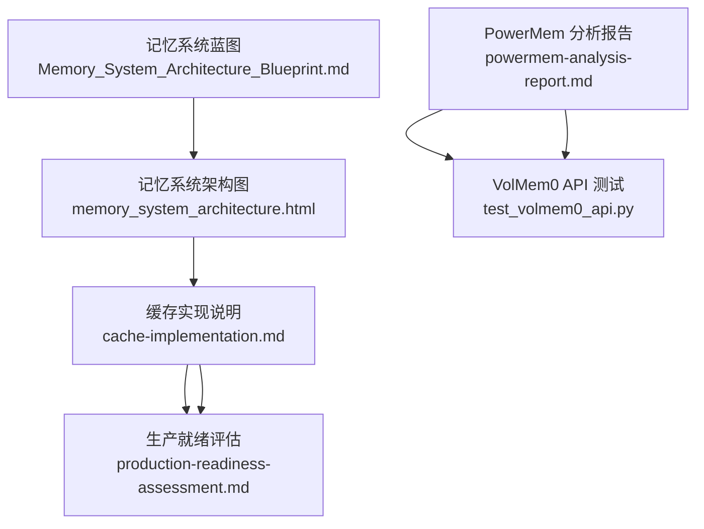
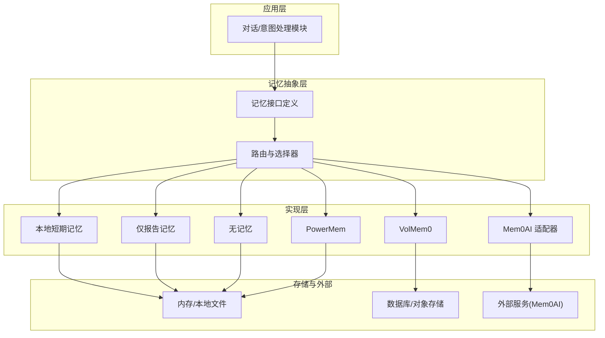
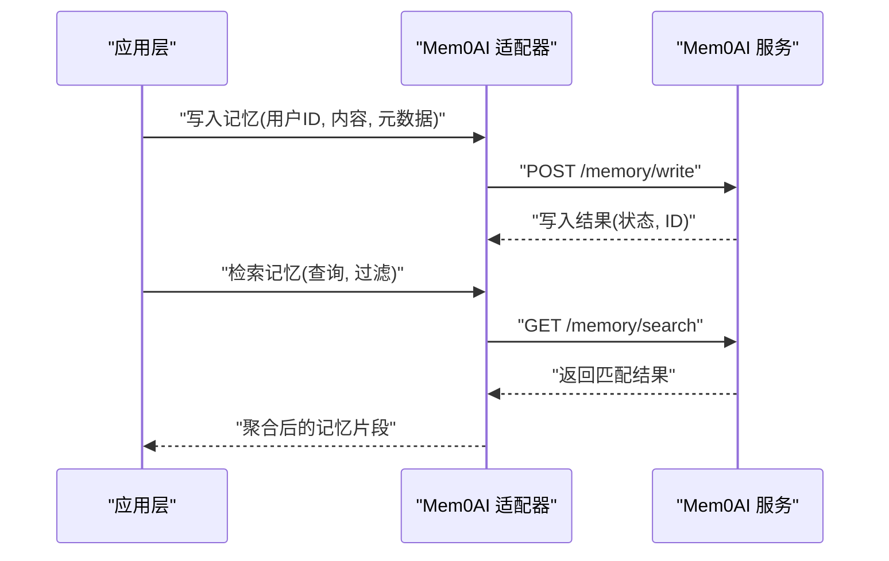
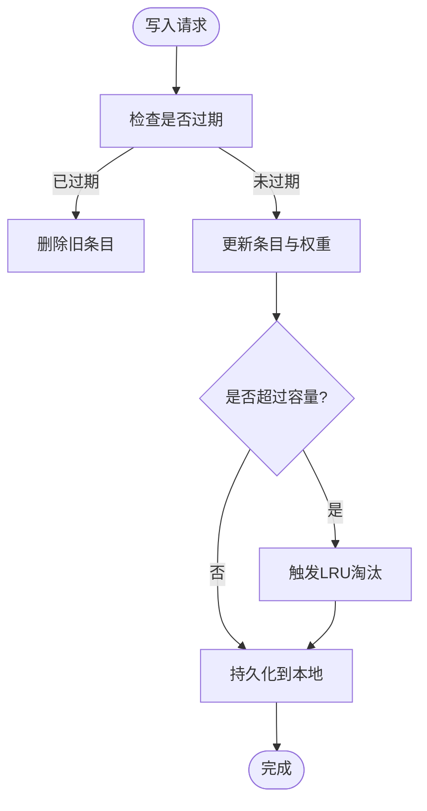
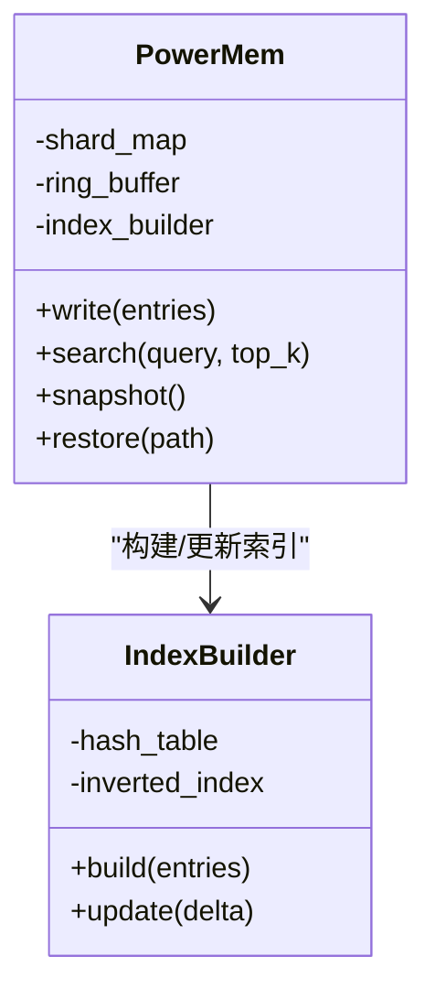
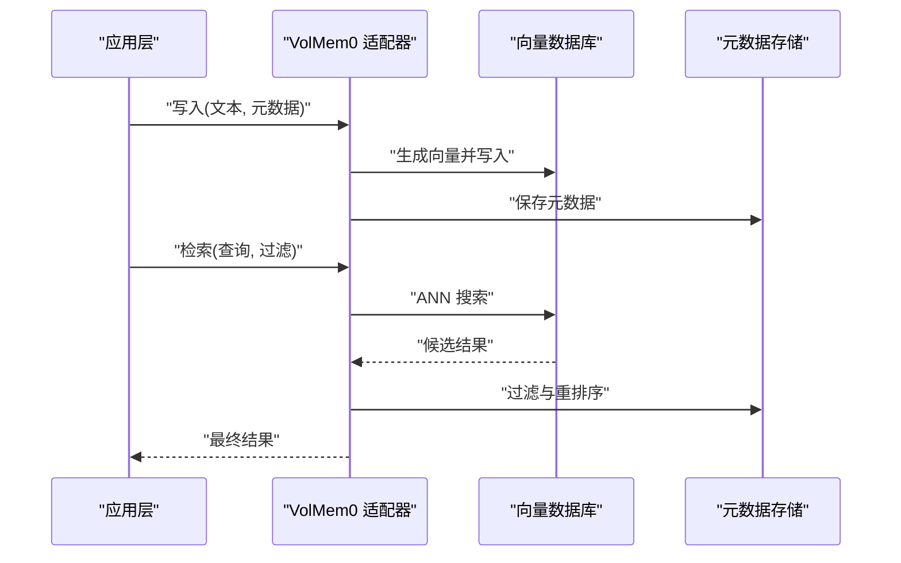
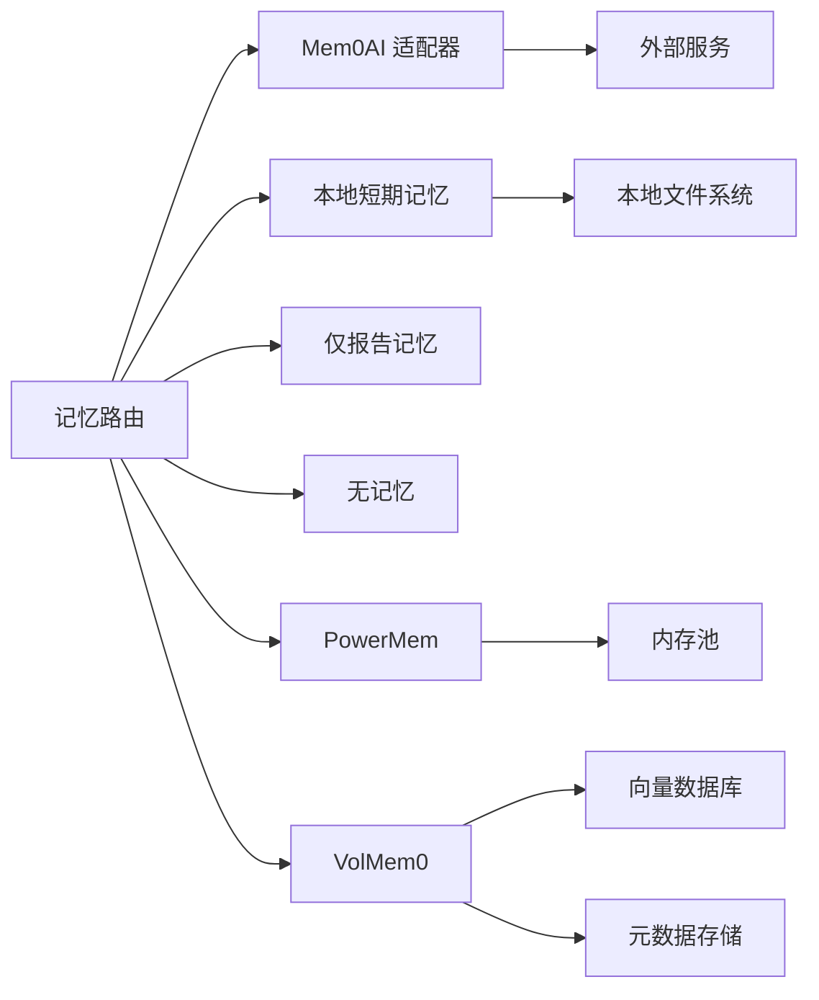

# 记忆系统插件

<cite>
**本文引用的文件**   
- [memory_system_architecture.html](file://main/xiaozhi-server/docs/architecture/memory_system_architecture.html)
- [Memory_System_Architecture_Blueprint.md](file://main/xiaozhi-server/docs/architecture/Memory_System_Architecture_Blueprint.md)
- [powermem-analysis-report.md](file://main/xiaozhi-server/docs/powermem-analysis-report.md)
- [cache-implementation.md](file://main/xiaozhi-server/docs/cache-implementation.md)
- [production-readiness-assessment.md](file://main/xiaozhi-server/docs/production-readiness-assessment.md)
- [test_volmem0_api.py](file://main/xiaozhi-server/test_volmem0_api.py)
</cite>

## 目录
1. [简介](#简介)
2. [项目结构](#项目结构)
3. [核心组件](#核心组件)
4. [架构总览](#架构总览)
5. [详细组件分析](#详细组件分析)
6. [依赖关系分析](#依赖关系分析)
7. [性能考量](#性能考量)
8. [故障排查指南](#故障排查指南)
9. [结论](#结论)
10. [附录](#附录)

## 简介
本技术文档面向“记忆系统插件”，系统性梳理并解释项目中所有内置记忆方案，包括 Mem0AI、本地短期记忆、仅报告记忆、无记忆、PowerMem、VolMem0 等。文档覆盖存储结构、数据持久化、检索算法、生命周期管理、初始化流程、数据同步与冲突解决、备份恢复策略，并提供配置模板、使用示例、迁移与版本兼容建议、性能监控与调试方法，帮助读者快速选型与落地优化。

## 项目结构
记忆系统相关设计与实现主要位于 xiaozhi-server 的文档与测试资源中，包含架构图、蓝图说明、缓存实现说明、PowerMem 分析报告以及 VolMem0 API 测试脚本等。这些材料共同构成了记忆系统的整体设计视图与落地参考。

图表来源
- [Memory_System_Architecture_Blueprint.md](file://main/xiaozhi-server/docs/architecture/Memory_System_Architecture_Blueprint.md)
- [memory_system_architecture.html](file://main/xiaozhi-server/docs/architecture/memory_system_architecture.html)
- [cache-implementation.md](file://main/xiaozhi-server/docs/cache-implementation.md)
- [production-readiness-assessment.md](file://main/xiaozhi-server/docs/production-readiness-assessment.md)
- [powermem-analysis-report.md](file://main/xiaozhi-server/docs/powermem-analysis-report.md)
- [test_volmem0_api.py](file://main/xiaozhi-server/test_volmem0_api.py)

章节来源
- [Memory_System_Architecture_Blueprint.md](file://main/xiaozhi-server/docs/architecture/Memory_System_Architecture_Blueprint.md)
- [memory_system_architecture.html](file://main/xiaozhi-server/docs/architecture/memory_system_architecture.html)
- [cache-implementation.md](file://main/xiaozhi-server/docs/cache-implementation.md)
- [production-readiness-assessment.md](file://main/xiaozhi-server/docs/production-readiness-assessment.md)
- [powermem-analysis-report.md](file://main/xiaozhi-server/docs/powermem-analysis-report.md)
- [test_volmem0_api.py](file://main/xiaozhi-server/test_volmem0_api.py)

## 核心组件
本节对各类记忆系统进行概览性说明，涵盖其目标、适用场景与关键特性：
- Mem0AI：面向外部 AI 服务的记忆集成，强调云端记忆能力与跨会话一致性。
- 本地短期记忆：进程内或本地轻量存储，适合低延迟、短生命周期的上下文维护。
- 仅报告记忆：以事件上报为主，不长期保留完整对话，侧重审计与统计。
- 无记忆：默认关闭记忆能力，适用于隐私敏感或无需上下文的场景。
- PowerMem：高性能内存型记忆，强调吞吐与低延迟，适合高并发对话。
- VolMem0：可插拔的向量/混合检索记忆，支持语义检索与结构化查询。

章节来源
- [Memory_System_Architecture_Blueprint.md](file://main/xiaozhi-server/docs/architecture/Memory_System_Architecture_Blueprint.md)
- [cache-implementation.md](file://main/xiaozhi-server/docs/cache-implementation.md)
- [powermem-analysis-report.md](file://main/xiaozhi-server/docs/powermem-analysis-report.md)
- [test_volmem0_api.py](file://main/xiaozhi-server/test_volmem0_api.py)

## 架构总览
记忆系统采用分层与可插拔设计，上层通过统一接口调用不同实现；中间层负责数据序列化、索引构建与检索路由；底层对接具体存储（内存、本地文件、数据库或外部服务）。该设计便于在运行时切换记忆策略，并在多实例部署下保证一致性与可扩展性。

图表来源
- [Memory_System_Architecture_Blueprint.md](file://main/xiaozhi-server/docs/architecture/Memory_System_Architecture_Blueprint.md)
- [memory_system_architecture.html](file://main/xiaozhi-server/docs/architecture/memory_system_architecture.html)

## 详细组件分析

### Mem0AI 记忆
- 存储结构：以用户/会话为维度组织记忆条目，通常包含文本摘要、时间戳、来源与权重。
- 数据持久化：通过外部服务接口进行读写，支持增量更新与去重。
- 检索算法：基于语义相似度与关键词混合检索，返回与当前上下文最相关的记忆片段。
- 生命周期管理：按过期策略清理旧记忆，结合重要性评分决定保留优先级。
- 初始化流程：加载认证与端点配置，建立连接池与重试机制。
- 数据同步与冲突：服务端侧合并策略优先，客户端幂等写入避免重复。
- 备份恢复：导出为结构化快照，导入时执行冲突检测与合并。

图表来源
- [Memory_System_Architecture_Blueprint.md](file://main/xiaozhi-server/docs/architecture/Memory_System_Architecture_Blueprint.md)
- [memory_system_architecture.html](file://main/xiaozhi-server/docs/architecture/memory_system_architecture.html)

章节来源
- [Memory_System_Architecture_Blueprint.md](file://main/xiaozhi-server/docs/architecture/Memory_System_Architecture_Blueprint.md)
- [memory_system_architecture.html](file://main/xiaozhi-server/docs/architecture/memory_system_architecture.html)

### 本地短期记忆
- 存储结构：键值或列表形式，按会话/用户隔离，支持 TTL 过期。
- 数据持久化：可选落盘为 JSON/SQLite，进程重启后恢复。
- 检索算法：精确匹配与范围查询，必要时加入简单倒排索引。
- 生命周期管理：LRU/LFU 淘汰策略，配合定时任务清理过期项。
- 初始化流程：创建存储目录/表，加载历史快照，预热热点键。
- 数据同步与冲突：单实例强一致，多实例需引入分布式锁或版本号。
- 备份恢复：定期快照导出，启动时增量合并。

图表来源
- [cache-implementation.md](file://main/xiaozhi-server/docs/cache-implementation.md)

章节来源
- [cache-implementation.md](file://main/xiaozhi-server/docs/cache-implementation.md)

### 仅报告记忆
- 存储结构：事件日志格式，包含时间戳、类型、主体与负载。
- 数据持久化：追加写模式，支持滚动归档与压缩。
- 检索算法：按时间窗口与事件类型过滤，支持全文检索。
- 生命周期管理：按保留策略归档与清理，冷热分层存储。
- 初始化流程：初始化日志通道与轮转策略。
- 数据同步与冲突：顺序写入，消费者幂等消费。
- 备份恢复：归档文件拷贝与校验，恢复时重建索引。

章节来源
- [cache-implementation.md](file://main/xiaozhi-server/docs/cache-implementation.md)

### 无记忆
- 存储结构：无持久化，仅在请求处理期间维持临时上下文。
- 数据持久化：不启用。
- 检索算法：不适用。
- 生命周期管理：随请求结束自动释放。
- 初始化流程：最小化配置，禁用记忆模块。
- 数据同步与冲突：不涉及。
- 备份恢复：不涉及。

章节来源
- [cache-implementation.md](file://main/xiaozhi-server/docs/cache-implementation.md)

### PowerMem
- 存储结构：内存友好型结构，如环形缓冲与分片哈希表。
- 数据持久化：可选快照与增量日志，保障崩溃恢复。
- 检索算法：近似最近邻与阈值过滤，兼顾速度与精度。
- 生命周期管理：批量写入与异步刷新，降低锁竞争。
- 初始化流程：预分配内存池，加载索引与参数。
- 数据同步与冲突：分段锁与版本号控制。
- 备份恢复：快照+日志回放，确保一致性。

图表来源
- [powermem-analysis-report.md](file://main/xiaozhi-server/docs/powermem-analysis-report.md)

章节来源
- [powermem-analysis-report.md](file://main/xiaozhi-server/docs/powermem-analysis-report.md)

### VolMem0
- 存储结构：向量嵌入与元数据分离，支持混合检索（向量+标量过滤）。
- 数据持久化：向量库与元数据存储，支持分片与副本。
- 检索算法：ANN 搜索与重排序，结合业务规则过滤。
- 生命周期管理：向量化流水线与异步入库，定期清理无效向量。
- 初始化流程：加载模型与索引配置，预热热点查询。
- 数据同步与冲突：幂等写入与冲突检测，支持回滚。
- 备份恢复：向量与元数据联合快照，恢复时重建索引。

图表来源
- [test_volmem0_api.py](file://main/xiaozhi-server/test_volmem0_api.py)
- [Memory_System_Architecture_Blueprint.md](file://main/xiaozhi-server/docs/architecture/Memory_System_Architecture_Blueprint.md)

章节来源
- [test_volmem0_api.py](file://main/xiaozhi-server/test_volmem0_api.py)
- [Memory_System_Architecture_Blueprint.md](file://main/xiaozhi-server/docs/architecture/Memory_System_Architecture_Blueprint.md)

## 依赖关系分析
记忆系统各实现之间通过统一接口解耦，路由层根据配置选择具体实现。外部依赖包括向量库、数据库与第三方服务。依赖清晰、边界明确，便于替换与扩展。

图表来源
- [Memory_System_Architecture_Blueprint.md](file://main/xiaozhi-server/docs/architecture/Memory_System_Architecture_Blueprint.md)
- [memory_system_architecture.html](file://main/xiaozhi-server/docs/architecture/memory_system_architecture.html)

章节来源
- [Memory_System_Architecture_Blueprint.md](file://main/xiaozhi-server/docs/architecture/Memory_System_Architecture_Blueprint.md)
- [memory_system_architecture.html](file://main/xiaozhi-server/docs/architecture/memory_system_architecture.html)

## 性能考量
- 选择依据：低延迟优先选 PowerMem/本地短期记忆；语义检索优先选 VolMem0；跨会话一致性优先选 Mem0AI。
- 存储优化：合理设置 TTL、淘汰策略与分片大小；向量检索开启近似搜索与重排序阈值。
- 检索效率：构建倒排与向量索引，缓存热点查询结果；批处理写入减少锁竞争。
- 监控指标：QPS、P95/P99 延迟、命中率、内存占用、磁盘 IO、错误率。
- 压测与调优：使用性能测试工具模拟真实负载，逐步调整参数直至稳定。

章节来源
- [production-readiness-assessment.md](file://main/xiaozhi-server/docs/production-readiness-assessment.md)
- [cache-implementation.md](file://main/xiaozhi-server/docs/cache-implementation.md)
- [powermem-analysis-report.md](file://main/xiaozhi-server/docs/powermem-analysis-report.md)

## 故障排查指南
- 常见问题：连接超时、写入失败、检索为空、索引不一致、快照损坏。
- 定位步骤：查看日志与指标，确认配置与依赖健康；复现问题并缩小范围；对比快照与索引一致性。
- 恢复策略：回滚到上一快照，重建索引；对外部服务进行降级与重试；对本地存储进行修复与校验。
- 调试工具：启用详细日志与追踪；使用测试脚本验证接口行为；对关键路径添加断点与埋点。

章节来源
- [production-readiness-assessment.md](file://main/xiaozhi-server/docs/production-readiness-assessment.md)
- [cache-implementation.md](file://main/xiaozhi-server/docs/cache-implementation.md)
- [test_volmem0_api.py](file://main/xiaozhi-server/test_volmem0_api.py)

## 结论
记忆系统插件通过统一接口与可插拔实现，满足多样化业务需求。选型应结合延迟、精度、成本与运维复杂度综合权衡。在生产环境中，务必完善监控、备份与回滚策略，持续优化索引与检索路径，确保系统稳定高效运行。

## 附录
- 配置模板要点：
  - 通用字段：模块名称、启用开关、超时、重试次数、日志级别。
  - Mem0AI：端点、鉴权、命名空间、过期策略。
  - 本地短期记忆：存储路径、最大条目数、TTL、淘汰策略。
  - PowerMem：内存池大小、分片数、快照间隔。
  - VolMem0：向量模型、索引类型、相似度阈值、过滤条件。
- 使用示例：
  - 初始化：加载配置、建立连接、预热索引。
  - 写入：构造条目、去重、幂等写入。
  - 检索：构建查询、过滤与重排序、返回结果。
- 数据迁移与版本兼容：
  - 定义版本标识与迁移脚本，向后兼容读取旧格式。
  - 灰度发布与双写校验，确保平滑过渡。
- 性能监控与调试：
  - 采集核心指标与链路追踪，设置告警阈值。
  - 使用压测与诊断工具定位瓶颈，迭代优化。

章节来源
- [Memory_System_Architecture_Blueprint.md](file://main/xiaozhi-server/docs/architecture/Memory_System_Architecture_Blueprint.md)
- [cache-implementation.md](file://main/xiaozhi-server/docs/cache-implementation.md)
- [powermem-analysis-report.md](file://main/xiaozhi-server/docs/powermem-analysis-report.md)
- [test_volmem0_api.py](file://main/xiaozhi-server/test_volmem0_api.py)
- [production-readiness-assessment.md](file://main/xiaozhi-server/docs/production-readiness-assessment.md)