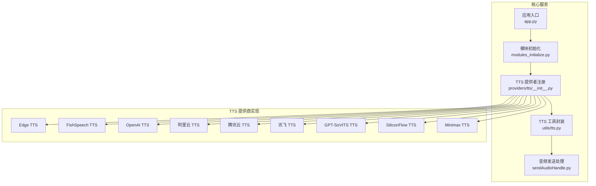
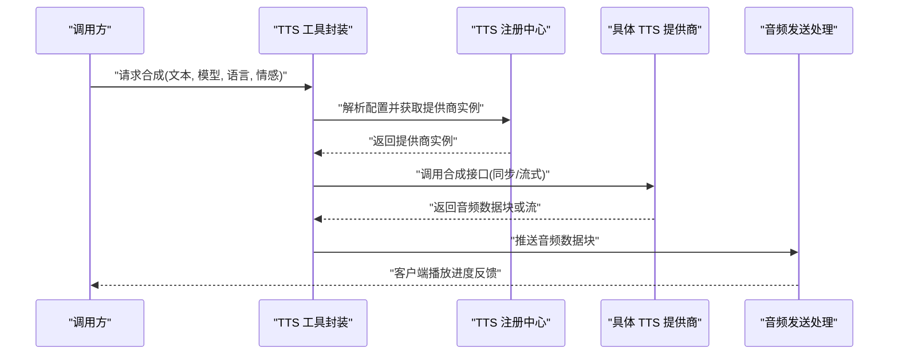
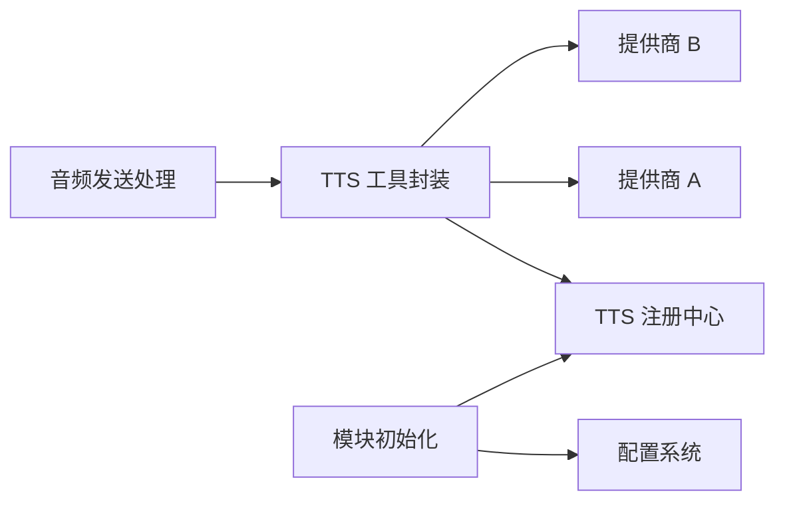

# 语音合成插件（TTS）

<cite>
**本文引用的文件**   
- [core/providers/tts/__init__.py](file://main/xiaozhi-server/core/providers/tts/__init__.py)
- [core/utils/tts.py](file://main/xiaozhi-server/core/utils/tts.py)
- [core/utils/modules_initialize.py](file://main/xiaozhi-server/core/utils/modules_initialize.py)
- [core/handle/sendAudioHandle.py](file://main/xiaozhi-server/core/handle/sendAudioHandle.py)
- [performance_tester/performance_tester_tts.py](file://main/xiaozhi-server/performance_tester/performance_tester_tts.py)
- [performance_tester/performance_tester_stream_tts.py](file://main/xiaozhi-server/performance_tester/performance_tester_stream_tts.py)
- [config/settings.py](file://main/xiaozhi-server/config/settings.py)
- [docs/fish-speech-integration.md](file://docs/fish-speech-integration.md)
</cite>

## 目录
1. [简介](#简介)
2. [项目结构](#项目结构)
3. [核心组件](#核心组件)
4. [架构总览](#架构总览)
5. [详细组件分析](#详细组件分析)
6. [依赖关系分析](#依赖关系分析)
7. [性能考量](#性能考量)
8. [故障排查指南](#故障排查指南)
9. [结论](#结论)
10. [附录](#附录)

## 简介
本技术文档面向语音合成插件（TTS）子系统，系统性梳理内置 TTS 插件的实现与集成方式，覆盖初始化流程、连接管理、音频编码、流式合成、缓存策略、并发处理、内存管理与故障恢复等关键主题。文档同时提供配置要点、使用示例与优化建议，帮助开发者快速接入并稳定运行多种 TTS 提供商（如 Edge、FishSpeech、OpenAI、阿里云、腾讯云、讯飞、GPT-SoVITS、SiliconFlow、Minimax 等）。

## 项目结构
TTS 相关代码主要位于 xiaozhi-server 的 core 层：
- providers/tts：各 TTS 提供商的具体实现与注册入口
- utils/tts：TTS 通用工具与调用封装
- handle/sendAudioHandle：音频发送与播放控制（含流式输出）
- performance_tester：TTS 性能测试脚本（批量/流式）
- config/settings：运行时配置加载与默认值
- docs/fish-speech-integration：FishSpeech 集成说明

**图表来源** 
- [core/utils/modules_initialize.py](file://main/xiaozhi-server/core/utils/modules_initialize.py)
- [core/providers/tts/__init__.py](file://main/xiaozhi-server/core/providers/tts/__init__.py)
- [core/utils/tts.py](file://main/xiaozhi-server/core/utils/tts.py)
- [core/handle/sendAudioHandle.py](file://main/xiaozhi-server/core/handle/sendAudioHandle.py)

**章节来源**
- [core/utils/modules_initialize.py](file://main/xiaozhi-server/core/utils/modules_initialize.py)
- [core/providers/tts/__init__.py](file://main/xiaozhi-server/core/providers/tts/__init__.py)
- [core/utils/tts.py](file://main/xiaozhi-server/core/utils/tts.py)
- [core/handle/sendAudioHandle.py](file://main/xiaozhi-server/core/handle/sendAudioHandle.py)

## 核心组件
- TTS 提供者注册中心：统一暴露创建与选择逻辑，支持按名称或配置动态切换提供商
- TTS 工具封装：对外提供一致的合成接口，屏蔽底层差异（文本预处理、音频格式、错误码映射）
- 音频发送处理：负责将合成结果以流式或非流式方式推送到客户端，控制播放时序与缓冲
- 模块初始化：在启动阶段完成各 TTS 提供商的配置加载、连接池建立与能力探测

**章节来源**
- [core/providers/tts/__init__.py](file://main/xiaozhi-server/core/providers/tts/__init__.py)
- [core/utils/tts.py](file://main/xiaozhi-server/core/utils/tts.py)
- [core/handle/sendAudioHandle.py](file://main/xiaozhi-server/core/handle/sendAudioHandle.py)
- [core/utils/modules_initialize.py](file://main/xiaozhi-server/core/utils/modules_initialize.py)

## 架构总览
TTS 子系统采用“注册中心 + 工具封装 + 具体实现”的分层架构：
- 上层通过工具封装发起合成请求，传入文本、声音模型、语言、情感等参数
- 注册中心根据配置选择具体提供商实例
- 提供商实现负责鉴权、网络请求、音频编码与流式传输
- 音频发送处理将数据块推送至客户端，保证低延迟与稳定性

**图表来源** 
- [core/utils/tts.py](file://main/xiaozhi-server/core/utils/tts.py)
- [core/providers/tts/__init__.py](file://main/xiaozhi-server/core/providers/tts/__init__.py)
- [core/handle/sendAudioHandle.py](file://main/xiaozhi-server/core/handle/sendAudioHandle.py)

## 详细组件分析

### TTS 注册中心（providers/tts/__init__.py）
- 职责：集中管理各 TTS 提供商的创建、选择与生命周期；暴露统一的工厂方法
- 关键点：
  - 按配置项选择提供商名称（如 edge、fishspeech、openai、aliyun、tencent、xfy、gptsovits、siliconflow、minimax）
  - 懒加载与单例化，避免重复初始化
  - 能力探测（支持的音频格式、是否支持流式、情感控制等）
- 扩展性：新增提供商只需实现标准接口并在注册表中声明

**章节来源**
- [core/providers/tts/__init__.py](file://main/xiaozhi-server/core/providers/tts/__init__.py)

### TTS 工具封装（core/utils/tts.py）
- 职责：对上层提供一致 API，处理文本清洗、参数校验、错误映射与重试
- 关键点：
  - 统一输入输出格式（文本、采样率、声道数、编码格式）
  - 流式与非流式合成的桥接
  - 缓存键生成（基于文本哈希、模型名、语言、情感等）
- 性能：
  - 短文本优先流式，长文本可分片并行
  - 失败自动退避与降级到备用提供商

**章节来源**
- [core/utils/tts.py](file://main/xiaozhi-server/core/utils/tts.py)

### 音频发送处理（core/handle/sendAudioHandle.py）
- 职责：接收 TTS 输出的音频数据块，进行缓冲、排序与推送，确保播放流畅
- 关键点：
  - 流式写入，减少首包延迟
  - 网络抖动自适应（滑动窗口、丢包重传策略）
  - 播放状态回调（开始、暂停、结束、错误）
- 兼容性：适配不同编码格式（PCM、Opus、MP3、AAC），必要时转码

**章节来源**
- [core/handle/sendAudioHandle.py](file://main/xiaozhi-server/core/handle/sendAudioHandle.py)

### 模块初始化（core/utils/modules_initialize.py）
- 职责：启动时加载配置、初始化各模块（包括 TTS 提供商）
- 关键点：
  - 读取 settings.py 中的 TTS 配置段
  - 建立连接池（HTTP/WebSocket）、令牌刷新、限流策略
  - 健康检查与预热（可选）

**章节来源**
- [core/utils/modules_initialize.py](file://main/xiaozhi-server/core/utils/modules_initialize.py)
- [config/settings.py](file://main/xiaozhi-server/config/settings.py)

### 性能测试（performance_tester）
- 批量合成测试：评估吞吐、延迟、资源占用
- 流式合成测试：模拟真实场景下的首包时间、抖动、丢包恢复

**章节来源**
- [performance_tester/performance_tester_tts.py](file://main/xiaozhi-server/performance_tester/performance_tester_tts.py)
- [performance_tester/performance_tester_stream_tts.py](file://main/xiaozhi-server/performance_tester/performance_tester_stream_tts.py)

## 依赖关系分析
- 内部依赖：
  - TTS 工具封装依赖注册中心与具体提供商实现
  - 音频发送处理依赖 TTS 工具封装的输出协议
  - 模块初始化依赖配置系统与健康检查模块
- 外部依赖：
  - 各 TTS 提供商的 SDK 或 HTTP API
  - 音频编解码库（如 Opus、FFmpeg）
  - 缓存存储（本地文件或 Redis）

**图表来源** 
- [core/utils/tts.py](file://main/xiaozhi-server/core/utils/tts.py)
- [core/providers/tts/__init__.py](file://main/xiaozhi-server/core/providers/tts/__init__.py)
- [core/handle/sendAudioHandle.py](file://main/xiaozhi-server/core/handle/sendAudioHandle.py)
- [config/settings.py](file://main/xiaozhi-server/config/settings.py)

**章节来源**
- [core/utils/tts.py](file://main/xiaozhi-server/core/utils/tts.py)
- [core/providers/tts/__init__.py](file://main/xiaozhi-server/core/providers/tts/__init__.py)
- [core/handle/sendAudioHandle.py](file://main/xiaozhi-server/core/handle/sendAudioHandle.py)
- [config/settings.py](file://main/xiaozhi-server/config/settings.py)

## 性能考量
- 流式合成：优先使用流式接口降低首包延迟，适合实时对话
- 并发控制：限制并发请求数，避免上游限流与资源耗尽
- 缓存策略：对相同文本+模型+参数的结果进行缓存，命中直接返回
- 内存管理：分块处理大文本，避免一次性加载全部音频到内存
- 错误恢复：指数退避重试、熔断与降级到备用提供商
- 监控指标：QPS、P95/P99 延迟、错误率、缓存命中率、CPU/内存占用

[本节为通用指导，不直接分析具体文件]

## 故障排查指南
- 常见问题：
  - 鉴权失败：检查密钥、签名、有效期与网络连通性
  - 超时/限流：调整超时阈值、增加重试次数、启用队列削峰
  - 音频异常：确认采样率、声道数、编码格式与播放器兼容性
  - 内存泄漏：检查流式处理是否及时释放缓冲区
- 诊断步骤：
  - 启用详细日志，记录请求参数与响应头
  - 使用性能测试脚本复现问题，定位瓶颈
  - 切换备用提供商验证是否为特定供应商问题
  - 检查系统资源（CPU、内存、网络带宽）

**章节来源**
- [performance_tester/performance_tester_tts.py](file://main/xiaozhi-server/performance_tester/performance_tester_tts.py)
- [performance_tester/performance_tester_stream_tts.py](file://main/xiaozhi-server/performance_tester/performance_tester_stream_tts.py)

## 结论
TTS 子系统通过清晰的层次划分与标准化接口，实现了对多提供商的统一接入与灵活切换。结合流式合成、缓存策略与完善的错误恢复机制，可在高并发与低延迟场景下稳定运行。建议在生产环境启用监控与自动化测试，持续优化性能与可靠性。

[本节为总结性内容，不直接分析具体文件]

## 附录

### 提供商特性概览（概念性）
- Edge：免费、多语言、情感丰富，适合快速原型
- FishSpeech：开源可控，支持自定义模型与音色克隆
- OpenAI：高质量语音，API 简洁，成本较高
- 阿里云/腾讯云：企业级稳定性，丰富的地域与合规支持
- 讯飞：中文优化好，方言与情感模型丰富
- GPT-SoVITS：开源语音克隆，适合个性化定制
- SiliconFlow/Minimax：新兴提供商，性价比高，生态活跃

[本节为概念性概述，不直接分析具体文件]

### FishSpeech 集成参考
- 部署方式：本地或云端容器化部署
- 配置项：模型路径、端口、鉴权方式、并发限制
- 最佳实践：预热模型、缓存常用音色、监控 GPU 利用率

**章节来源**
- [docs/fish-speech-integration.md](file://docs/fish-speech-integration.md)

### 配置模板（示例字段）
- 提供商选择：provider_name
- 鉴权信息：api_key、secret_key、token_url
- 模型参数：voice_id、model_version、language、emotion
- 音频格式：sample_rate、channels、codec
- 流式选项：streaming_enabled、chunk_size、buffer_ms
- 缓存策略：cache_enabled、ttl、max_size
- 并发与限流：max_concurrent、rate_limit、retry_times

[本节为通用配置说明，不直接分析具体文件]