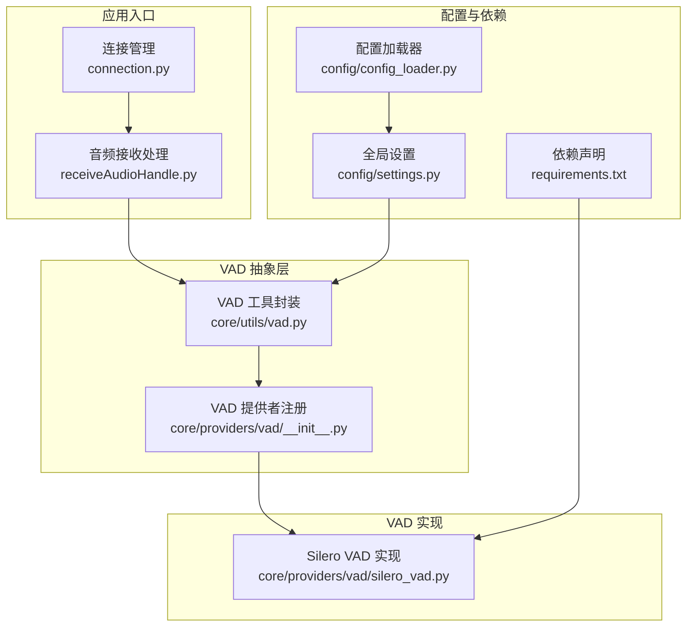
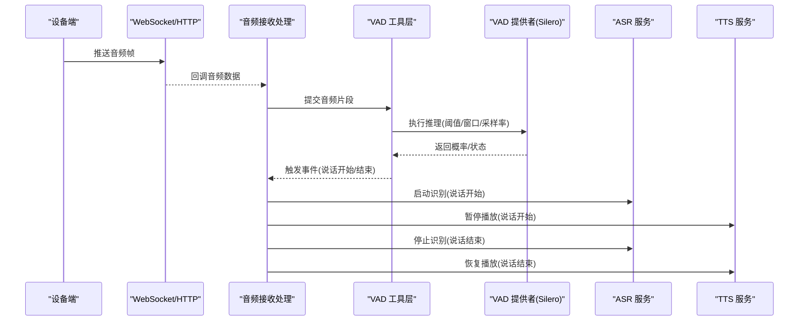
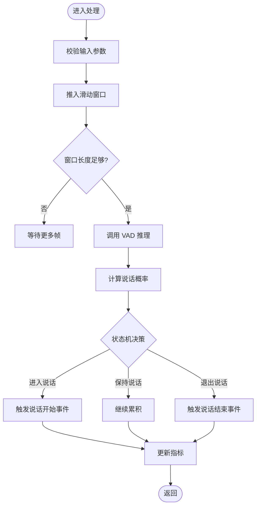
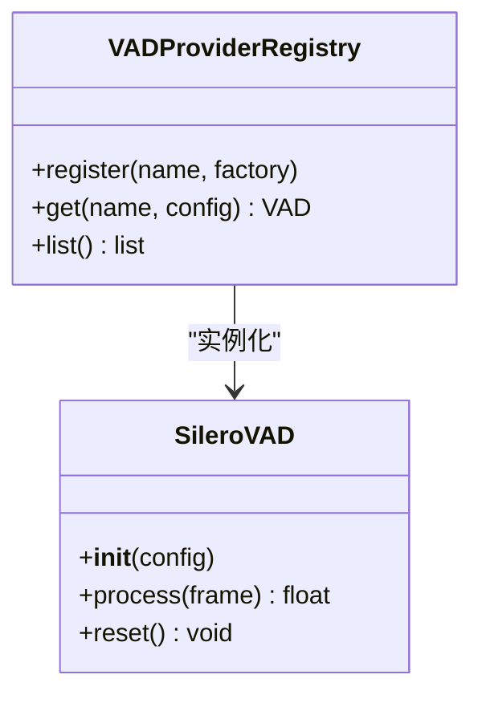
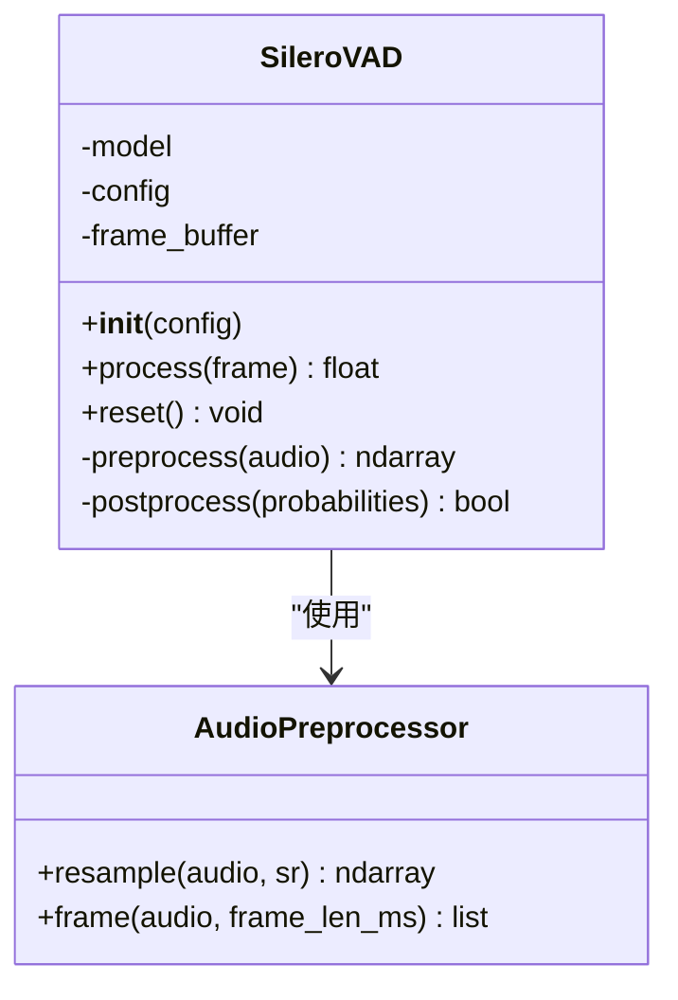
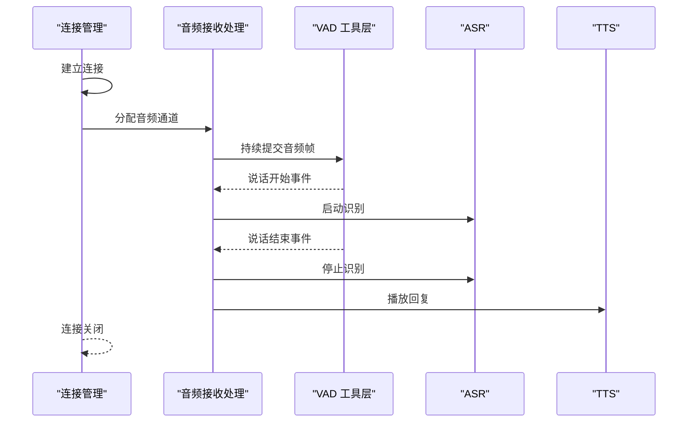
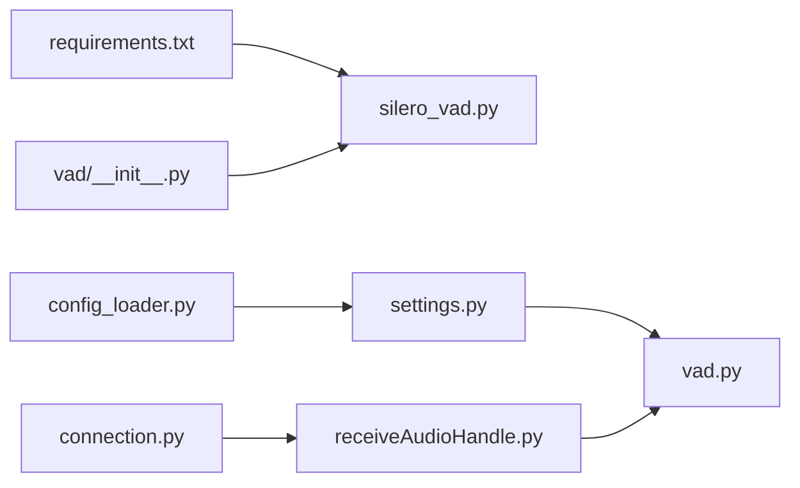

# 语音活动检测插件 (VAD)

<cite>
**本文引用的文件**   
- [vad.py](file://main/xiaozhi-server/core/utils/vad.py)
- [vad/__init__.py](file://main/xiaozhi-server/core/providers/vad/__init__.py)
- [silero_vad.py](file://main/xiaozhi-server/core/providers/vad/silero_vad.py)
- [receiveAudioHandle.py](file://main/xiaozhi-server/core/handle/receiveAudioHandle.py)
- [connection.py](file://main/xiaozhi-server/core/connection.py)
- [config_loader.py](file://main/xiaozhi-server/config/config_loader.py)
- [settings.py](file://main/xiaozhi-server/config/settings.py)
- [requirements.txt](file://main/xiaozhi-server/requirements.txt)
</cite>

## 目录
1. [简介](#简介)
2. [项目结构](#项目结构)
3. [核心组件](#核心组件)
4. [架构总览](#架构总览)
5. [详细组件分析](#详细组件分析)
6. [依赖关系分析](#依赖关系分析)
7. [性能考量](#性能考量)
8. [故障排查指南](#故障排查指南)
9. [结论](#结论)
10. [附录](#附录)

## 简介
本技术文档围绕内置语音活动检测（VAD）插件展开，重点介绍基于 Silero VAD 的检测算法、参数配置与实时处理能力。内容涵盖：
- VAD 初始化流程、音频流处理、事件触发与状态管理
- 关键配置项（阈值、窗口长度、采样率、噪声抑制等）
- 使用示例与配置模板，指导如何调整灵敏度、优化响应延迟、处理背景噪音
- 性能调优建议（CPU、内存、延迟）以及与 ASR/TTS 等语音处理组件的集成方法

## 项目结构
VAD 相关代码主要位于 xiaozhi-server 模块中，采用“工具层 + 提供者层”的分层设计：
- 工具层：提供统一的 VAD 接口与通用逻辑
- 提供者层：具体实现不同 VAD 引擎（当前以 Silero VAD 为主）
- 接入点：在音频接收与连接管理中调用 VAD，驱动后续 ASR 或对话流程

**图示来源** 
- [connection.py](file://main/xiaozhi-server/core/connection.py)
- [receiveAudioHandle.py](file://main/xiaozhi-server/core/handle/receiveAudioHandle.py)
- [vad.py](file://main/xiaozhi-server/core/utils/vad.py)
- [vad/__init__.py](file://main/xiaozhi-server/core/providers/vad/__init__.py)
- [silero_vad.py](file://main/xiaozhi-server/core/providers/vad/silero_vad.py)
- [config_loader.py](file://main/xiaozhi-server/config/config_loader.py)
- [settings.py](file://main/xiaozhi-server/config/settings.py)
- [requirements.txt](file://main/xiaozhi-server/requirements.txt)

**章节来源**
- [vad.py](file://main/xiaozhi-server/core/utils/vad.py)
- [vad/__init__.py](file://main/xiaozhi-server/core/providers/vad/__init__.py)
- [silero_vad.py](file://main/xiaozhi-server/core/providers/vad/silero_vad.py)
- [receiveAudioHandle.py](file://main/xiaozhi-server/core/handle/receiveAudioHandle.py)
- [connection.py](file://main/xiaozhi-server/core/connection.py)
- [config_loader.py](file://main/xiaozhi-server/config/config_loader.py)
- [settings.py](file://main/xiaozhi-server/config/settings.py)
- [requirements.txt](file://main/xiaozhi-server/requirements.txt)

## 核心组件
- VAD 工具封装（utils/vad.py）
  - 职责：统一 VAD 调用接口、参数校验、默认值管理、结果聚合与事件派发
  - 关键点：滑动窗口推理、静音/说话状态机、阈值与滞后控制、日志与指标上报
- VAD 提供者注册（providers/vad/__init__.py）
  - 职责：按名称选择并实例化具体 VAD 实现（如 silero）
  - 关键点：工厂模式、配置注入、异常回退
- Silero VAD 实现（providers/vad/silero_vad.py）
  - 职责：封装 Silero 模型推理、音频预处理（重采样/分帧）、概率到状态的转换
  - 关键点：模型加载与缓存、批处理策略、内存复用、并发安全
- 音频接收与连接管理（receiveAudioHandle.py, connection.py）
  - 职责：采集音频帧、送入 VAD、根据 VAD 事件驱动 ASR/TTS 流程
  - 关键点：低延迟流水线、缓冲队列、背压与丢帧策略

**章节来源**
- [vad.py](file://main/xiaozhi-server/core/utils/vad.py)
- [vad/__init__.py](file://main/xiaozhi-server/core/providers/vad/__init__.py)
- [silero_vad.py](file://main/xiaozhi-server/core/providers/vad/silero_vad.py)
- [receiveAudioHandle.py](file://main/xiaozhi-server/core/handle/receiveAudioHandle.py)
- [connection.py](file://main/xiaozhi-server/core/connection.py)

## 架构总览
VAD 在整体语音链路中的位置如下：
- 设备端通过 WebSocket/HTTP 推送音频帧至服务端
- 音频接收模块将帧送入 VAD 工具层
- VAD 工具层根据配置选择具体实现（Silero），进行实时推理
- VAD 输出“说话开始/结束”事件，驱动 ASR 启动或停止，以及 TTS 播放控制

**图示来源** 
- [receiveAudioHandle.py](file://main/xiaozhi-server/core/handle/receiveAudioHandle.py)
- [vad.py](file://main/xiaozhi-server/core/utils/vad.py)
- [silero_vad.py](file://main/xiaozhi-server/core/providers/vad/silero_vad.py)

## 详细组件分析

### VAD 工具封装（utils/vad.py）
- 功能要点
  - 参数校验与默认值：阈值、最小说话时长、最大静音时长、滑动窗口大小、采样率
  - 状态机：静音→说话→静音，含滞后与去抖，避免频繁切换
  - 事件派发：说话开始/结束事件，供上层驱动 ASR/TTS
  - 指标统计：误报/漏报计数、平均延迟、吞吐
- 复杂度与性能
  - 时间复杂度：O(N) 每帧处理（N 为窗口内样本数）
  - 空间复杂度：O(W) 滑动窗口缓存
  - 优化：内存池复用、批量推理、线程安全锁

**图示来源** 
- [vad.py](file://main/xiaozhi-server/core/utils/vad.py)

**章节来源**
- [vad.py](file://main/xiaozhi-server/core/utils/vad.py)

### VAD 提供者注册（providers/vad/__init__.py）
- 功能要点
  - 工厂选择：根据配置名称（如 “silero”）创建对应实现
  - 配置注入：将阈值、模型路径、采样率等传入具体实现
  - 异常处理：未找到实现时抛出明确错误，便于快速定位
- 扩展性
  - 新增 VAD 实现只需注册名称与构造函数

**图示来源** 
- [vad/__init__.py](file://main/xiaozhi-server/core/providers/vad/__init__.py)
- [silero_vad.py](file://main/xiaozhi-server/core/providers/vad/silero_vad.py)

**章节来源**
- [vad/__init__.py](file://main/xiaozhi-server/core/providers/vad/__init__.py)

### Silero VAD 实现（providers/vad/silero_vad.py）
- 功能要点
  - 模型加载：首次加载模型权重与配置，支持缓存与热重载
  - 音频预处理：重采样至目标采样率、分帧（通常 16kHz，25ms/帧）
  - 推理与后处理：概率阈值化、滑动平均、滞后控制
  - 资源管理：内存池、线程安全、异常重试
- 关键参数
  - threshold：说话概率阈值（典型 0.5~0.7）
  - min_speech_duration_ms：最小说话时长（典型 200~500ms）
  - max_silence_duration_ms：最大静音时长（典型 300~800ms）
  - frame_length_ms：帧长（典型 25ms）
  - sample_rate：采样率（典型 16000Hz）
  - noise_suppression：是否启用噪声抑制（可选）
- 性能特性
  - CPU/GPU 加速：依据环境自动选择
  - 批处理：合并多帧提升吞吐
  - 内存复用：减少 GC 压力

**图示来源** 
- [silero_vad.py](file://main/xiaozhi-server/core/providers/vad/silero_vad.py)

**章节来源**
- [silero_vad.py](file://main/xiaozhi-server/core/providers/vad/silero_vad.py)

### 音频接收与连接管理（receiveAudioHandle.py, connection.py）
- 功能要点
  - 连接生命周期：建立/断开、心跳、错误恢复
  - 音频流处理：缓冲、去抖动、丢帧策略
  - VAD 事件驱动：说话开始启动 ASR，说话结束停止 ASR 并触发 TTS
- 关键设计
  - 低延迟：短缓冲、异步处理
  - 背压：当下游阻塞时主动丢弃旧帧
  - 可观测性：日志与指标上报

**图示来源** 
- [receiveAudioHandle.py](file://main/xiaozhi-server/core/handle/receiveAudioHandle.py)
- [connection.py](file://main/xiaozhi-server/core/connection.py)
- [vad.py](file://main/xiaozhi-server/core/utils/vad.py)

**章节来源**
- [receiveAudioHandle.py](file://main/xiaozhi-server/core/handle/receiveAudioHandle.py)
- [connection.py](file://main/xiaozhi-server/core/connection.py)

### 配置与加载（config_loader.py, settings.py）
- 功能要点
  - 配置来源：配置文件、环境变量、运行时覆盖
  - VAD 配置键：threshold、min_speech_duration_ms、max_silence_duration_ms、frame_length_ms、sample_rate、noise_suppression
  - 默认值与校验：确保合理范围，缺失时使用默认值
- 最佳实践
  - 将敏感路径（模型文件）放入环境变量
  - 生产环境开启严格校验与告警

**章节来源**
- [config_loader.py](file://main/xiaozhi-server/config/config_loader.py)
- [settings.py](file://main/xiaozhi-server/config/settings.py)

## 依赖关系分析
- 外部依赖
  - Silero VAD 模型与推理库（由 requirements.txt 声明）
  - 音频处理库（如 numpy、soundfile、librosa 等，视实现而定）
- 内部依赖
  - utils/vad.py 依赖 providers/vad/* 的具体实现
  - receiveAudioHandle.py 与 connection.py 依赖 utils/vad.py 的事件接口
  - config_loader.py 与 settings.py 提供配置支撑

**图示来源** 
- [requirements.txt](file://main/xiaozhi-server/requirements.txt)
- [settings.py](file://main/xiaozhi-server/config/settings.py)
- [config_loader.py](file://main/xiaozhi-server/config/config_loader.py)
- [vad.py](file://main/xiaozhi-server/core/utils/vad.py)
- [vad/__init__.py](file://main/xiaozhi-server/core/providers/vad/__init__.py)
- [silero_vad.py](file://main/xiaozhi-server/core/providers/vad/silero_vad.py)
- [receiveAudioHandle.py](file://main/xiaozhi-server/core/handle/receiveAudioHandle.py)
- [connection.py](file://main/xiaozhi-server/core/connection.py)

**章节来源**
- [requirements.txt](file://main/xiaozhi-server/requirements.txt)
- [settings.py](file://main/xiaozhi-server/config/settings.py)
- [config_loader.py](file://main/xiaozhi-server/config/config_loader.py)
- [vad.py](file://main/xiaozhi-server/core/utils/vad.py)
- [vad/__init__.py](file://main/xiaozhi-server/core/providers/vad/__init__.py)
- [silero_vad.py](file://main/xiaozhi-server/core/providers/vad/silero_vad.py)
- [receiveAudioHandle.py](file://main/xiaozhi-server/core/handle/receiveAudioHandle.py)
- [connection.py](file://main/xiaozhi-server/core/connection.py)

## 性能考量
- 延迟优化
  - 减小帧长（如 20~25ms）以降低端到端延迟
  - 合理设置最小说话时长，避免过短的噪声触发
  - 使用滑动平均与滞后控制减少抖动
- 吞吐与资源
  - 批处理推理提升 CPU/GPU 利用率
  - 内存池复用减少 GC 停顿
  - 按需加载模型，避免冷启动开销
- 稳定性
  - 背压与丢帧策略防止积压
  - 异常重试与降级（如回退到更高阈值）
- 监控与诊断
  - 记录 VAD 事件时间戳、概率分布、误报/漏报比率
  - 结合系统指标（CPU、内存、I/O）进行瓶颈定位

[本节为通用指导，不直接分析具体文件]

## 故障排查指南
- 常见问题
  - 无法检测到说话：检查阈值是否过高、最小说话时长是否过长、采样率是否匹配
  - 频繁误触发：降低阈值、增大滞后、启用噪声抑制
  - 高延迟：检查帧长与批处理大小、确认下游 ASR/TTS 是否阻塞
  - 内存泄漏：检查缓冲区是否及时释放、是否存在循环引用
- 调试步骤
  - 打印 VAD 概率曲线与状态变化
  - 逐步放宽/收紧阈值观察效果
  - 隔离测试：仅运行 VAD 模块，排除上游/下游影响
- 日志与指标
  - 关注错误堆栈与警告信息
  - 收集性能指标（延迟、吞吐、误报率）

**章节来源**
- [vad.py](file://main/xiaozhi-server/core/utils/vad.py)
- [silero_vad.py](file://main/xiaozhi-server/core/providers/vad/silero_vad.py)
- [receiveAudioHandle.py](file://main/xiaozhi-server/core/handle/receiveAudioHandle.py)

## 结论
本项目内置 VAD 插件采用清晰的抽象与分层设计，以 Silero VAD 为核心实现，提供了灵活的参数配置与高效的实时处理能力。通过合理的阈值与窗口设置、噪声抑制与状态机设计，可在复杂声学环境中稳定工作。配合完善的监控与调优手段，能够显著降低端到端延迟并提升用户体验。

[本节为总结，不直接分析具体文件]

## 附录

### 配置参数说明
- threshold：说话概率阈值，典型范围 0.5~0.7
- min_speech_duration_ms：最小说话时长，典型范围 200~500ms
- max_silence_duration_ms：最大静音时长，典型范围 300~800ms
- frame_length_ms：帧长，典型 20~25ms
- sample_rate：采样率，典型 16000Hz
- noise_suppression：是否启用噪声抑制（布尔）

**章节来源**
- [settings.py](file://main/xiaozhi-server/config/settings.py)
- [config_loader.py](file://main/xiaozhi-server/config/config_loader.py)
- [silero_vad.py](file://main/xiaozhi-server/core/providers/vad/silero_vad.py)

### 使用示例与配置模板
- 初始化流程
  - 从配置加载器读取 VAD 参数
  - 通过提供者注册表实例化 Silero VAD
  - 将实例注入音频接收处理模块
- 音频流处理
  - 持续提交音频帧至 VAD
  - 监听说话开始/结束事件
  - 驱动 ASR 启动/停止与 TTS 播放控制
- 配置模板（键名参考）
  - vad.threshold=0.6
  - vad.min_speech_duration_ms=300
  - vad.max_silence_duration_ms=500
  - vad.frame_length_ms=25
  - vad.sample_rate=16000
  - vad.noise_suppression=true

**章节来源**
- [vad/__init__.py](file://main/xiaozhi-server/core/providers/vad/__init__.py)
- [vad.py](file://main/xiaozhi-server/core/utils/vad.py)
- [receiveAudioHandle.py](file://main/xiaozhi-server/core/handle/receiveAudioHandle.py)
- [settings.py](file://main/xiaozhi-server/config/settings.py)
- [config_loader.py](file://main/xiaozhi-server/config/config_loader.py)

### 与其他组件集成
- 与 ASR 集成
  - 说话开始：启动识别，清空历史文本
  - 说话结束：停止识别，拼接最终文本
- 与 TTS 集成
  - 说话开始：暂停播放，释放麦克风
  - 说话结束：恢复播放，继续对话流程
- 与连接管理集成
  - 连接建立：初始化 VAD 实例
  - 连接断开：释放资源，清理缓冲区

**章节来源**
- [receiveAudioHandle.py](file://main/xiaozhi-server/core/handle/receiveAudioHandle.py)
- [connection.py](file://main/xiaozhi-server/core/connection.py)
- [vad.py](file://main/xiaozhi-server/core/utils/vad.py)