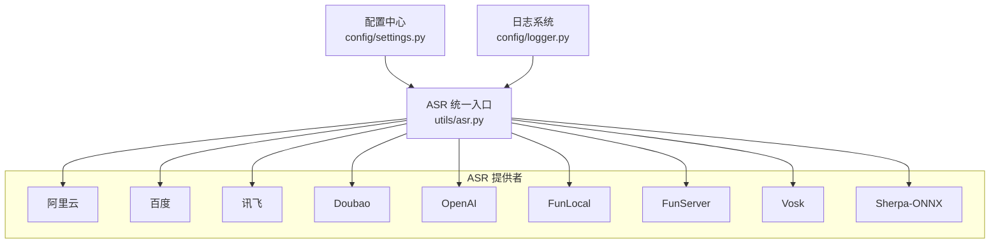
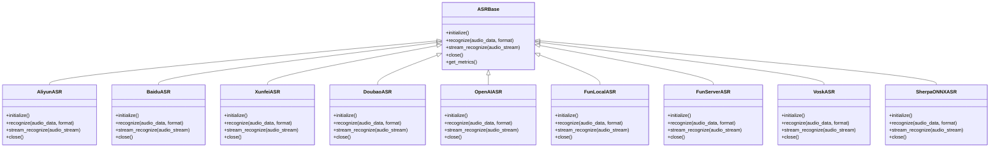
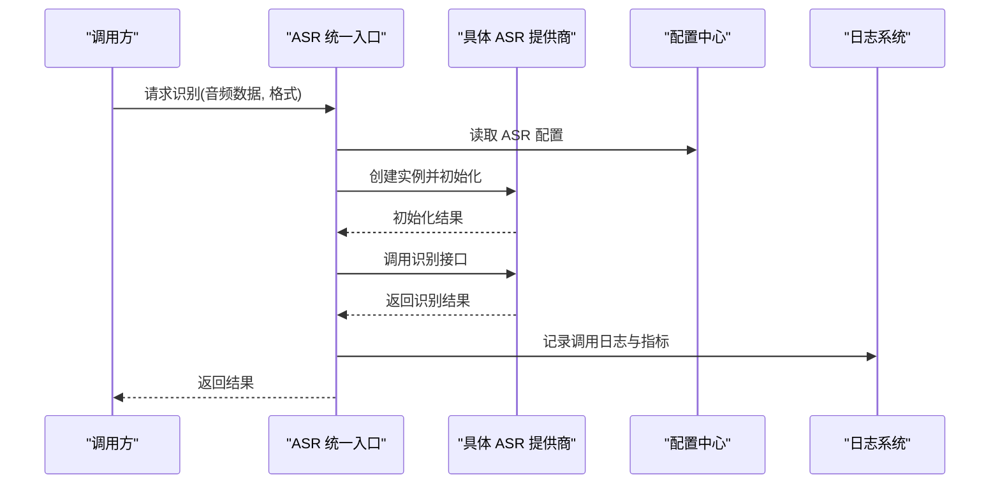
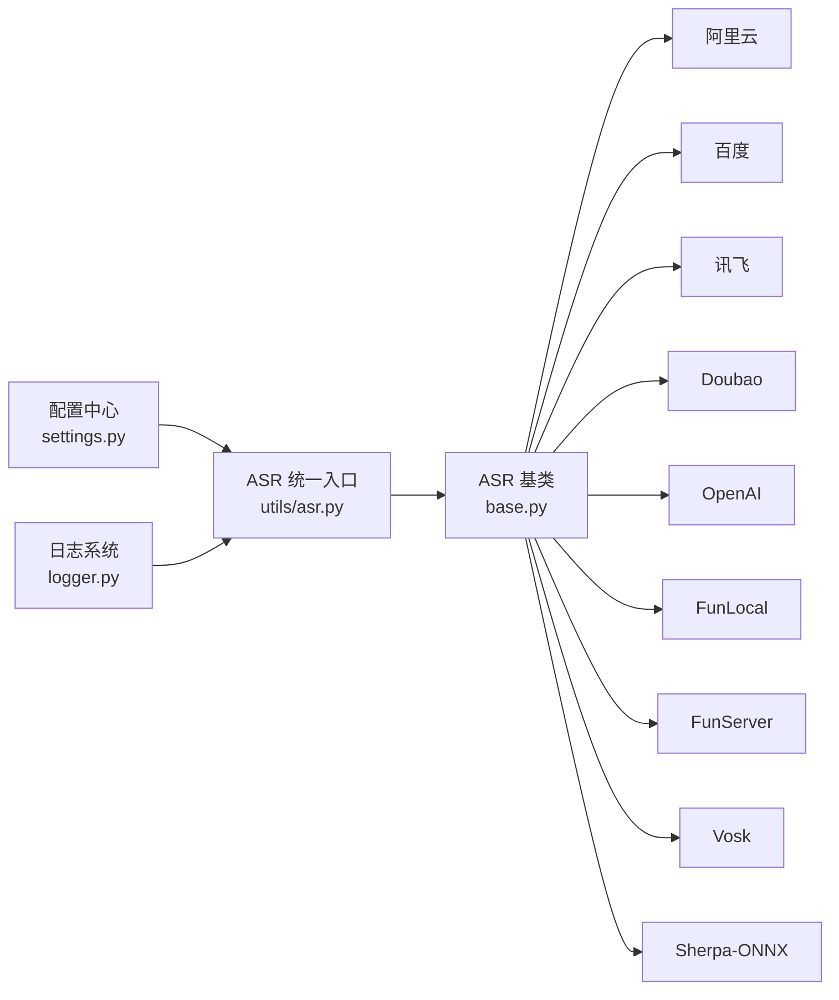

# 语音识别插件 (ASR)

<cite>
**本文引用的文件**   
- [main/xiaozhi-server/core/providers/asr/__init__.py](file://main/xiaozhi-server/core/providers/asr/__init__.py)
- [main/xiaozhi-server/core/providers/asr/base.py](file://main/xiaozhi-server/core/providers/asr/base.py)
- [main/xiaozhi-server/core/utils/asr.py](file://main/xiaozhi-server/core/utils/asr.py)
- [main/xiaozhi-server/core/utils/modules_initialize.py](file://main/xiaozhi-server/core/utils/modules_initialize.py)
- [main/xiaozhi-server/config/settings.py](file://main/xiaozhi-server/config/settings.py)
- [main/xiaozhi-server/config/logger.py](file://main/xiaozhi-server/config/logger.py)
- [main/xiaozhi-server/core/providers/asr/aliyun.py](file://main/xiaozhi-server/core/providers/asr/aliyun.py)
- [main/xiaozhi-server/core/providers/asr/baidu.py](file://main/xiaozhi-server/core/providers/asr/baidu.py)
- [main/xiaozhi-server/core/providers/asr/xunfei.py](file://main/xiaozhi-server/core/providers/asr/xunfei.py)
- [main/xiaozhi-server/core/providers/asr/doubao.py](file://main/xiaozhi-server/core/providers/asr/doubao.py)
- [main/xiaozhi-server/core/providers/asr/openai.py](file://main/xiaozhi-server/core/providers/asr/openai.py)
- [main/xiaozhi-server/core/providers/asr/fun_local.py](file://main/xiaozhi-server/core/providers/asr/fun_local.py)
- [main/xiaozhi-server/core/providers/asr/fun_server.py](file://main/xiaozhi-server/core/providers/asr/fun_server.py)
- [main/xiaozhi-server/core/providers/asr/vosk.py](file://main/xiaozhi-server/core/providers/asr/vosk.py)
- [main/xiaozhi-server/core/providers/asr/sherpa_onnx.py](file://main/xiaozhi-server/core/providers/asr/sherpa_onnx.py)
- [main/xiaozhi-server/performance_tester/performance_tester_asr.py](file://main/xiaozhi-server/performance_tester/performance_tester_asr.py)
- [main/xiaozhi-server/performance_tester/performance_tester_stream_asr.py](file://main/xiaozhi-server/performance_tester/performance_tester_stream_asr.py)
</cite>

## 目录
1. [简介](#简介)
2. [项目结构](#项目结构)
3. [核心组件](#核心组件)
4. [架构总览](#架构总览)
5. [详细组件分析](#详细组件分析)
6. [依赖关系分析](#依赖关系分析)
7. [性能考量](#性能考量)
8. [故障排查指南](#故障排查指南)
9. [结论](#结论)
10. [附录](#附录)

## 简介
本技术文档面向 xiaozhi-esp32-server 中的语音识别（ASR）插件体系，系统性梳理所有内置 ASR 提供商的实现与集成方式，包括阿里云、百度、讯飞、Doubao、OpenAI、FunLocal、FunServer、Vosk、Sherpa-ONNX 等。文档覆盖配置参数、认证方式、音频格式支持、流式处理、错误处理、性能特点、初始化流程、连接管理、缓存策略、重试机制，并提供使用示例、配置模板、切换方法、异常处理与准确率优化建议，以及监控指标、日志记录、调试技巧与常见问题解决方案。

## 项目结构
ASR 相关代码主要位于 main/xiaozhi-server 目录下：
- providers/asr：各 ASR 提供商的具体实现
- utils/asr.py：ASR 统一入口与工具函数
- config/settings.py：全局配置加载与默认值
- config/logger.py：日志配置
- performance_tester：ASR 性能测试脚本

图表来源
- [main/xiaozhi-server/core/utils/asr.py](file://main/xiaozhi-server/core/utils/asr.py)
- [main/xiaozhi-server/config/settings.py](file://main/xiaozhi-server/config/settings.py)
- [main/xiaozhi-server/config/logger.py](file://main/xiaozhi-server/config/logger.py)

章节来源
- [main/xiaozhi-server/core/utils/asr.py](file://main/xiaozhi-server/core/utils/asr.py)
- [main/xiaozhi-server/config/settings.py](file://main/xiaozhi-server/config/settings.py)
- [main/xiaozhi-server/config/logger.py](file://main/xiaozhi-server/config/logger.py)

## 核心组件
- ASR 基类与注册表：定义统一的接口规范、生命周期管理与插件发现机制
- ASR 统一入口：根据配置选择具体提供商实例，封装调用与错误处理
- 配置模块：集中管理各 ASR 提供商的配置项、默认值与校验
- 日志模块：提供结构化日志输出，便于问题定位与性能分析

章节来源
- [main/xiaozhi-server/core/providers/asr/base.py](file://main/xiaozhi-server/core/providers/asr/base.py)
- [main/xiaozhi-server/core/providers/asr/__init__.py](file://main/xiaozhi-server/core/providers/asr/__init__.py)
- [main/xiaozhi-server/core/utils/asr.py](file://main/xiaozhi-server/core/utils/asr.py)
- [main/xiaozhi-server/config/settings.py](file://main/xiaozhi-server/config/settings.py)
- [main/xiaozhi-server/config/logger.py](file://main/xiaozhi-server/config/logger.py)

## 架构总览
ASR 插件采用“统一接口 + 多实现”的架构模式。上层通过统一入口获取 ASR 实例，按配置动态选择具体提供商；各提供商遵循相同接口，屏蔽差异细节。

图表来源
- [main/xiaozhi-server/core/providers/asr/base.py](file://main/xiaozhi-server/core/providers/asr/base.py)
- [main/xiaozhi-server/core/providers/asr/aliyun.py](file://main/xiaozhi-server/core/providers/asr/aliyun.py)
- [main/xiaozhi-server/core/providers/asr/baidu.py](file://main/xiaozhi-server/core/providers/asr/baidu.py)
- [main/xiaozhi-server/core/providers/asr/xunfei.py](file://main/xiaozhi-server/core/providers/asr/xunfei.py)
- [main/xiaozhi-server/core/providers/asr/doubao.py](file://main/xiaozhi-server/core/providers/asr/doubao.py)
- [main/xiaozhi-server/core/providers/asr/openai.py](file://main/xiaozhi-server/core/providers/asr/openai.py)
- [main/xiaozhi-server/core/providers/asr/fun_local.py](file://main/xiaozhi-server/core/providers/asr/fun_local.py)
- [main/xiaozhi-server/core/providers/asr/fun_server.py](file://main/xiaozhi-server/core/providers/asr/fun_server.py)
- [main/xiaozhi-server/core/providers/asr/vosk.py](file://main/xiaozhi-server/core/providers/asr/vosk.py)
- [main/xiaozhi-server/core/providers/asr/sherpa_onnx.py](file://main/xiaozhi-server/core/providers/asr/sherpa_onnx.py)

## 详细组件分析

### 阿里云 ASR
- 配置参数：服务地址、鉴权密钥、模型版本、采样率、语言设置
- 认证方式：签名鉴权或 Token
- 音频格式支持：PCM、WAV、OPUS（视 SDK 而定）
- 流式处理：支持实时流式识别
- 错误处理：网络超时、鉴权失败、服务限流
- 性能特点：高并发、低延迟、云端算力

章节来源
- [main/xiaozhi-server/core/providers/asr/aliyun.py](file://main/xiaozhi-server/core/providers/asr/aliyun.py)

### 百度 ASR
- 配置参数：API Key、Secret Key、模型类型、采样率、语言
- 认证方式：OAuth2 令牌
- 音频格式支持：PCM、WAV、AMR、SILK
- 流式处理：支持 WebSocket 流式
- 错误处理：鉴权过期、请求频率限制、音频格式不匹配
- 性能特点：稳定可靠、中文识别精度高

章节来源
- [main/xiaozhi-server/core/providers/asr/baidu.py](file://main/xiaozhi-server/core/providers/asr/baidu.py)

### 讯飞 ASR
- 配置参数：AppID、APISecret、APIKey、模型、采样率
- 认证方式：WebSocket 握手签名
- 音频格式支持：PCM、WAV、MP3
- 流式处理：原生 WebSocket 流式
- 错误处理：握手失败、音频编码不支持、服务不可用
- 性能特点：实时性好、方言支持丰富

章节来源
- [main/xiaozhi-server/core/providers/asr/xunfei.py](file://main/xiaozhi-server/core/providers/asr/xunfei.py)

### Doubao ASR
- 配置参数：服务端点、鉴权信息、模型名称、采样率
- 认证方式：Bearer Token 或 API Key
- 音频格式支持：PCM、WAV、FLAC
- 流式处理：支持流式接口
- 错误处理：鉴权失败、模型不存在、网络异常
- 性能特点：新兴服务、延迟较低

章节来源
- [main/xiaozhi-server/core/providers/asr/doubao.py](file://main/xiaozhi-server/core/providers/asr/doubao.py)

### OpenAI ASR
- 配置参数：API Key、模型（whisper-*）、采样率、语言
- 认证方式：Bearer Token
- 音频格式支持：MP3、WAV、M4A、FLAC、AAC、OGG
- 流式处理：非流式为主，可分片上传
- 错误处理：配额不足、模型不可用、音频过大
- 性能特点：通用性强、多语言支持

章节来源
- [main/xiaozhi-server/core/providers/asr/openai.py](file://main/xiaozhi-server/core/providers/asr/openai.py)

### FunLocal ASR
- 配置参数：本地模型路径、推理引擎、采样率、设备
- 认证方式：无需外部认证
- 音频格式支持：取决于推理引擎（通常为 PCM/WAV）
- 流式处理：可选，取决于模型能力
- 错误处理：模型加载失败、内存不足、设备不可用
- 性能特点：离线可用、隐私安全、受限于硬件

章节来源
- [main/xiaozhi-server/core/providers/asr/fun_local.py](file://main/xiaozhi-server/core/providers/asr/fun_local.py)

### FunServer ASR
- 配置参数：服务端地址、端口、模型名、采样率
- 认证方式：可选 Token 或内网信任
- 音频格式支持：由服务端决定
- 流式处理：支持 WebSocket 或 HTTP 流
- 错误处理：服务不可达、模型未加载、协议不匹配
- 性能特点：可横向扩展、集中化管理

章节来源
- [main/xiaozhi-server/core/providers/asr/fun_server.py](file://main/xiaozhi-server/core/providers/asr/fun_server.py)

### Vosk ASR
- 配置参数：模型目录、采样率、线程数
- 认证方式：无
- 音频格式支持：PCM（16kHz 单声道）
- 流式处理：支持增量识别
- 错误处理：模型加载失败、音频格式不符
- 性能特点：轻量级、适合边缘设备

章节来源
- [main/xiaozhi-server/core/providers/asr/vosk.py](file://main/xiaozhi-server/core/providers/asr/vosk.py)

### Sherpa-ONNX ASR
- 配置参数：ONNX 模型路径、特征提取器、解码器、采样率
- 认证方式：无
- 音频格式支持：PCM（通常 16kHz）
- 流式处理：支持流式解码
- 错误处理：模型文件缺失、算子不支持
- 性能特点：跨平台、高性能、可 GPU 加速

章节来源
- [main/xiaozhi-server/core/providers/asr/sherpa_onnx.py](file://main/xiaozhi-server/core/providers/asr/sherpa_onnx.py)

### 统一入口与初始化流程
ASR 统一入口负责根据配置创建对应提供商实例，并执行初始化、连接池管理、重试逻辑与指标收集。

图表来源
- [main/xiaozhi-server/core/utils/asr.py](file://main/xiaozhi-server/core/utils/asr.py)
- [main/xiaozhi-server/config/settings.py](file://main/xiaozhi-server/config/settings.py)
- [main/xiaozhi-server/config/logger.py](file://main/xiaozhi-server/config/logger.py)

章节来源
- [main/xiaozhi-server/core/utils/asr.py](file://main/xiaozhi-server/core/utils/asr.py)
- [main/xiaozhi-server/config/settings.py](file://main/xiaozhi-server/config/settings.py)
- [main/xiaozhi-server/config/logger.py](file://main/xiaozhi-server/config/logger.py)

## 依赖关系分析
ASR 模块依赖配置与日志子系统，并通过统一入口聚合各提供商实现。

图表来源
- [main/xiaozhi-server/config/settings.py](file://main/xiaozhi-server/config/settings.py)
- [main/xiaozhi-server/config/logger.py](file://main/xiaozhi-server/config/logger.py)
- [main/xiaozhi-server/core/utils/asr.py](file://main/xiaozhi-server/core/utils/asr.py)
- [main/xiaozhi-server/core/providers/asr/base.py](file://main/xiaozhi-server/core/providers/asr/base.py)

章节来源
- [main/xiaozhi-server/config/settings.py](file://main/xiaozhi-server/config/settings.py)
- [main/xiaozhi-server/config/logger.py](file://main/xiaozhi-server/config/logger.py)
- [main/xiaozhi-server/core/utils/asr.py](file://main/xiaozhi-server/core/utils/asr.py)
- [main/xiaozhi-server/core/providers/asr/base.py](file://main/xiaozhi-server/core/providers/asr/base.py)

## 性能考量
- 流式 vs 非流式：流式可降低首字延迟，但需考虑网络抖动与缓冲策略
- 音频格式与采样率：统一为 16kHz 单声道 PCM 可减少转换开销
- 连接复用：长连接与连接池减少握手开销
- 重试与退避：指数退避避免雪崩
- 资源隔离：不同提供商独立进程或线程池，避免相互影响
- 监控指标：QPS、P95/P99 延迟、错误率、内存占用

章节来源
- [main/xiaozhi-server/performance_tester/performance_tester_asr.py](file://main/xiaozhi-server/performance_tester/performance_tester_asr.py)
- [main/xiaozhi-server/performance_tester/performance_tester_stream_asr.py](file://main/xiaozhi-server/performance_tester/performance_tester_stream_asr.py)

## 故障排查指南
- 鉴权失败：检查密钥有效期、权限范围、签名算法
- 网络异常：检查代理、防火墙、DNS 解析、超时设置
- 音频格式错误：确认采样率、声道数、编码格式
- 模型加载失败：检查路径、权限、依赖库版本
- 服务限流：降低并发、增加重试间隔、扩容后端
- 日志定位：开启 DEBUG 级别，关注错误堆栈与耗时统计

章节来源
- [main/xiaozhi-server/config/logger.py](file://main/xiaozhi-server/config/logger.py)

## 结论
ASR 插件体系通过统一接口与多实现设计，实现了灵活可扩展的语音识别能力。各提供商在配置、认证、音频格式、流式处理与错误处理上各有特点，可根据业务需求选择合适的方案。结合性能测试与监控指标，持续优化识别准确率与系统稳定性。

## 附录

### 使用示例与配置模板
- 切换提供商：修改配置中的 provider 字段为对应服务商名称
- 认证配置：填写密钥、Token、签名参数
- 音频参数：设置采样率、编码格式、语言
- 重试策略：配置最大重试次数与退避间隔
- 监控开关：启用指标采集与日志级别调整

章节来源
- [main/xiaozhi-server/config/settings.py](file://main/xiaozhi-server/config/settings.py)
- [main/xiaozhi-server/core/utils/modules_initialize.py](file://main/xiaozhi-server/core/utils/modules_initialize.py)

### 监控指标与日志记录
- 指标：识别成功率、平均延迟、峰值 QPS、错误分类计数
- 日志：请求 ID、提供商名称、音频时长、识别文本长度、耗时
- 调试：开启详细日志、导出原始音频与中间结果

章节来源
- [main/xiaozhi-server/config/logger.py](file://main/xiaozhi-server/config/logger.py)
- [main/xiaozhi-server/core/utils/asr.py](file://main/xiaozhi-server/core/utils/asr.py)