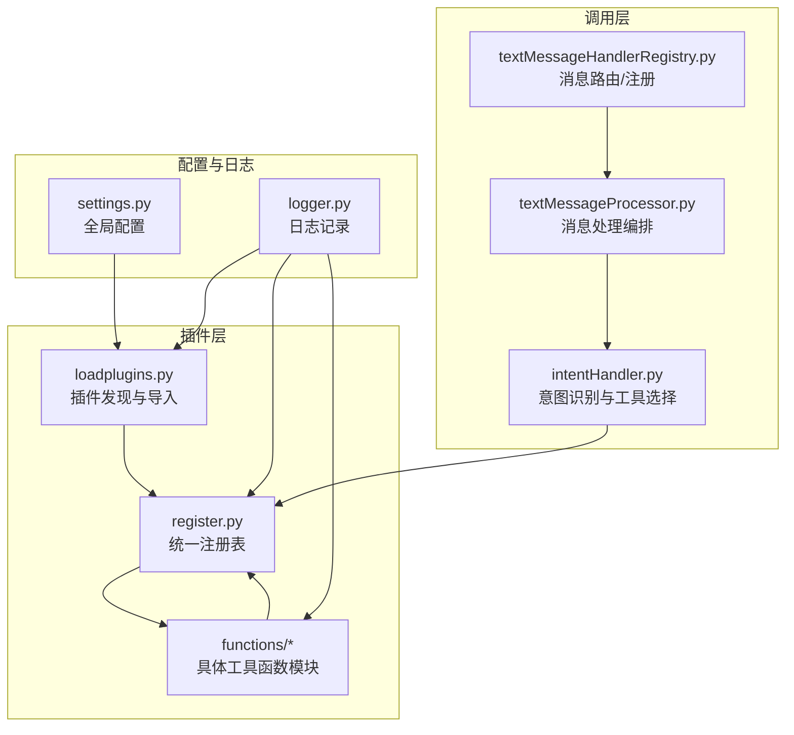
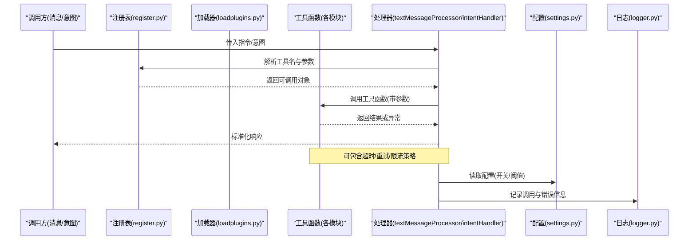
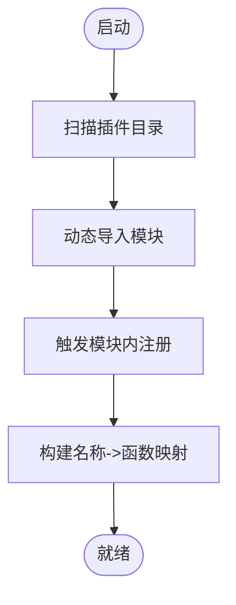
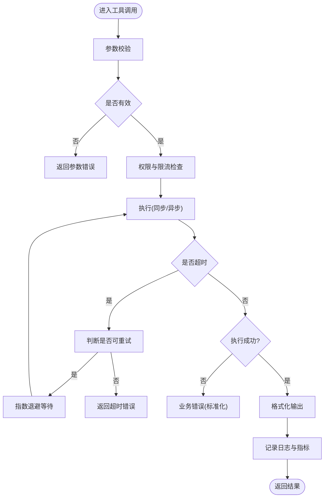
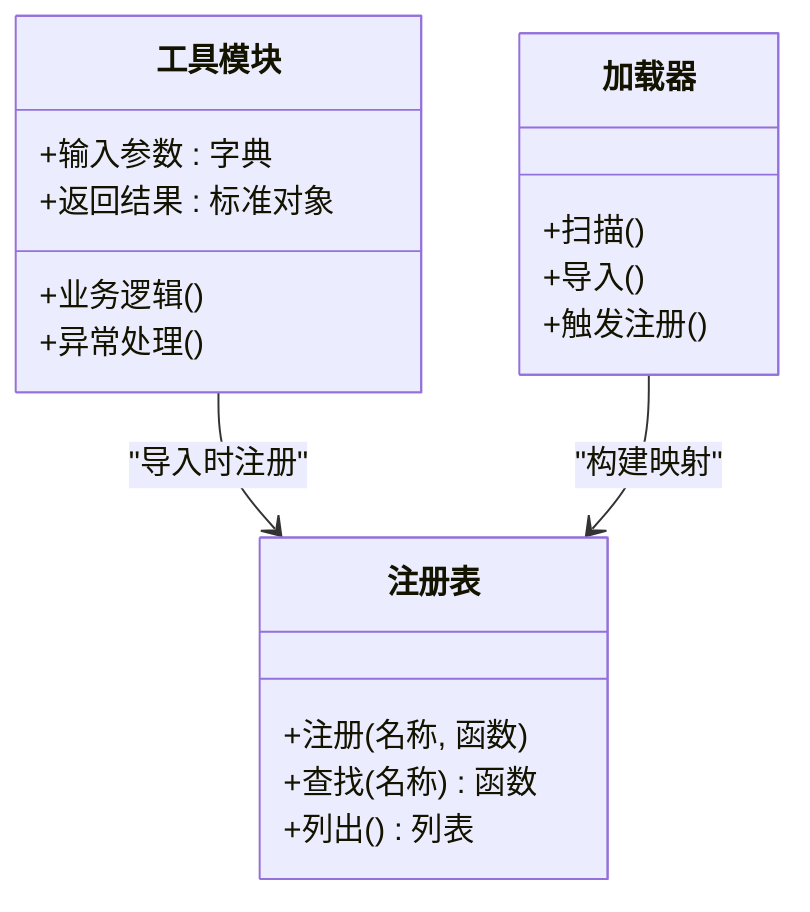
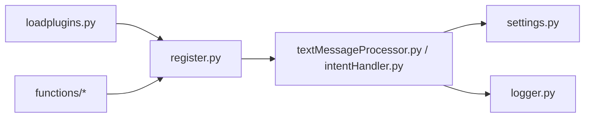

# 工具函数插件

<cite>
**本文引用的文件**   
- [loadplugins.py](file://main/xiaozhi-server/plugins_func/loadplugins.py)
- [register.py](file://main/xiaozhi-server/plugins_func/register.py)
- [functions/__init__.py](file://main/xiaozhi-server/plugins_func/functions/__init__.py)
- [weather.py](file://main/xiaozhi-server/plugins_func/functions/weather.py)
- [news.py](file://main/xiaozhi-server/plugins_func/functions/news.py)
- [device_control.py](file://main/xiaozhi-server/plugins_func/functions/device_control.py)
- [homeassistant.py](file://main/xiaozhi-server/plugins_func/functions/homeassistant.py)
- [text_message_handler_registry.py](file://main/xiaozhi-server/core/handle/textMessageHandlerRegistry.py)
- [text_message_processor.py](file://main/xiaozhi-server/core/handle/textMessageProcessor.py)
- [intentHandler.py](file://main/xiaozhi-server/core/handle/intentHandler.py)
- [settings.py](file://main/xiaozhi-server/config/settings.py)
- [logger.py](file://main/xiaozhi-server/config/logger.py)
</cite>

## 目录
1. [简介](#简介)
2. [项目结构](#项目结构)
3. [核心组件](#核心组件)
4. [架构总览](#架构总览)
5. [详细组件分析](#详细组件分析)
6. [依赖关系分析](#依赖关系分析)
7. [性能考量](#性能考量)
8. [故障排查指南](#故障排查指南)
9. [结论](#结论)
10. [附录](#附录)

## 简介
本技术文档围绕“工具函数插件”系统展开，面向开发者与集成者，系统性阐述其实现原理、注册机制、参数校验、返回值处理、错误处理、执行流程（含异步、超时、重试）、权限控制、调用频率限制与性能监控等高级特性。同时覆盖内置工具函数的功能说明与使用方式，包括天气查询、新闻获取、设备控制、Home Assistant 集成等。

## 项目结构
工具函数插件位于 xiaozhi-server 的 plugins_func 目录下，采用“插件发现 + 统一注册 + 按名调度”的结构：
- 插件加载器负责扫描并导入插件模块
- 注册表集中维护工具名称到可调用对象的映射
- 具体工具函数以独立模块形式提供，便于扩展与维护
- 上层处理器通过统一的工具调用入口进行解析与执行

图表来源
- [loadplugins.py:1-200](file://main/xiaozhi-server/plugins_func/loadplugins.py#L1-L200)
- [register.py:1-200](file://main/xiaozhi-server/plugins_func/register.py#L1-L200)
- [functions/__init__.py:1-200](file://main/xiaozhi-server/plugins_func/functions/__init__.py#L1-L200)
- [text_message_handler_registry.py:1-200](file://main/xiaozhi-server/core/handle/textMessageHandlerRegistry.py#L1-L200)
- [text_message_processor.py:1-200](file://main/xiaozhi-server/core/handle/textMessageProcessor.py#1-L200)
- [intentHandler.py:1-200](file://main/xiaozhi-server/core/handle/intentHandler.py#L1-L200)
- [settings.py:1-200](file://main/xiaozhi-server/config/settings.py#L1-L200)
- [logger.py:1-200](file://main/xiaozhi-server/config/logger.py#L1-L200)

章节来源
- [loadplugins.py:1-200](file://main/xiaozhi-server/plugins_func/loadplugins.py#L1-L200)
- [register.py:1-200](file://main/xiaozhi-server/plugins_func/register.py#L1-L200)
- [functions/__init__.py:1-200](file://main/xiaozhi-server/plugins_func/functions/__init__.py#L1-L200)

## 核心组件
- 插件加载器：负责在启动时扫描插件目录，动态导入每个工具模块，触发其内部注册逻辑。
- 注册表：集中保存工具名称与可调用的函数对象，支持按名查找与批量导出。
- 工具函数模块：每个工具一个模块，定义输入参数规范、业务逻辑、异常处理与返回格式。
- 调用编排：消息处理器或意图处理器根据用户意图或指令解析出工具名与参数，调用注册表中的函数并处理结果。

章节来源
- [loadplugins.py:1-200](file://main/xiaozhi-server/plugins_func/loadplugins.py#L1-L200)
- [register.py:1-200](file://main/xiaozhi-server/plugins_func/register.py#L1-L200)
- [text_message_processor.py:1-200](file://main/xiaozhi-server/core/handle/textMessageProcessor.py#L1-L200)
- [intentHandler.py:1-200](file://main/xiaozhi-server/core/handle/intentHandler.py#L1-L200)

## 架构总览
工具函数插件的执行链路从“消息/意图”进入，经“解析与路由”后落到“工具调用”，再由“结果处理”回传到上层。

图表来源
- [register.py:1-200](file://main/xiaozhi-server/plugins_func/register.py#L1-L200)
- [loadplugins.py:1-200](file://main/xiaozhi-server/plugins_func/loadplugins.py#L1-L200)
- [text_message_processor.py:1-200](file://main/xiaozhi-server/core/handle/textMessageProcessor.py#L1-L200)
- [intentHandler.py:1-200](file://main/xiaozhi-server/core/handle/intentHandler.py#L1-L200)
- [settings.py:1-200](file://main/xiaozhi-server/config/settings.py#L1-L200)
- [logger.py:1-200](file://main/xiaozhi-server/config/logger.py#L1-L200)

## 详细组件分析

### 插件加载与注册机制
- 插件发现：启动时遍历插件目录，匹配约定命名规则，动态导入模块。
- 自动注册：每个工具模块在导入时向注册表登记自身名称与函数引用。
- 统一接口：注册表暴露按名查找、列表导出、重载刷新等能力。
- 配置驱动：可通过配置文件启用/禁用特定插件或调整行为。

图表来源
- [loadplugins.py:1-200](file://main/xiaozhi-server/plugins_func/loadplugins.py#L1-L200)
- [register.py:1-200](file://main/xiaozhi-server/plugins_func/register.py#L1-L200)

章节来源
- [loadplugins.py:1-200](file://main/xiaozhi-server/plugins_func/loadplugins.py#L1-L200)
- [register.py:1-200](file://main/xiaozhi-server/plugins_func/register.py#L1-L200)

### 工具函数通用规范
- 输入参数：建议以结构化字典传递，字段类型与必填性由工具自行声明并在入口处校验。
- 返回值：统一为包含状态码、数据体与可选消息的对象；成功与失败路径需一致。
- 异常处理：捕获外部依赖异常并转换为标准错误结构，避免传播未处理异常。
- 幂等性与副作用：对写操作应设计幂等键或去重策略，减少重复调用的副作用。

章节来源
- [register.py:1-200](file://main/xiaozhi-server/plugins_func/register.py#L1-L200)

### 内置工具函数概览
- 天气查询：根据城市/坐标获取实时天气与预报，支持单位与语言选项。
- 新闻获取：拉取指定主题或来源的新闻摘要，支持分页与关键词过滤。
- 设备控制：对已绑定设备进行开关、调节等操作，返回设备状态与执行结果。
- Home Assistant 集成：通过 HA API 控制实体、读取状态、执行场景与服务。

章节来源
- [weather.py:1-200](file://main/xiaozhi-server/plugins_func/functions/weather.py#L1-L200)
- [news.py:1-200](file://main/xiaozhi-server/plugins_func/functions/news.py#L1-L200)
- [device_control.py:1-200](file://main/xiaozhi-server/plugins_func/functions/device_control.py#L1-L200)
- [homeassistant.py:1-200](file://main/xiaozhi-server/plugins_func/functions/homeassistant.py#L1-L200)

### 工具函数执行流程（含异步、超时、重试）
典型执行流程如下：
- 参数校验：检查必填字段、类型与取值范围，不合法则快速失败。
- 权限与限流：校验调用者权限，应用速率限制与配额。
- 执行策略：同步或异步执行；设置超时；必要时进行重试与退避。
- 结果处理：统一封装成功/失败响应，记录指标与日志。

图表来源
- [text_message_processor.py:1-200](file://main/xiaozhi-server/core/handle/textMessageProcessor.py#L1-L200)
- [intentHandler.py:1-200](file://main/xiaozhi-server/core/handle/intentHandler.py#L1-L200)
- [register.py:1-200](file://main/xiaozhi-server/plugins_func/register.py#L1-L200)

章节来源
- [text_message_processor.py:1-200](file://main/xiaozhi-server/core/handle/textMessageProcessor.py#L1-L200)
- [intentHandler.py:1-200](file://main/xiaozhi-server/core/handle/intentHandler.py#L1-L200)

### 参数验证与返回值处理
- 参数验证：建议在工具入口处进行强校验，结合默认值与类型转换，提升鲁棒性。
- 返回值：统一结构包含状态码、数据体与消息；错误路径携带可诊断信息。
- 序列化：对外部依赖返回的非标准对象进行规范化，保证上游一致性。

章节来源
- [register.py:1-200](file://main/xiaozhi-server/plugins_func/register.py#L1-L200)

### 错误处理与可观测性
- 错误分类：区分参数错误、权限错误、网络错误、业务错误与系统错误。
- 错误收敛：对瞬时错误实施重试与退避，避免雪崩。
- 可观测性：记录关键指标（耗时、成功率、错误率）与上下文（请求ID、用户ID）。

章节来源
- [logger.py:1-200](file://main/xiaozhi-server/config/logger.py#L1-L200)
- [settings.py:1-200](file://main/xiaozhi-server/config/settings.py#L1-L200)

### 权限控制与调用频率限制
- 权限控制：基于角色/租户/设备维度校验访问权限，拒绝未授权调用。
- 频率限制：按用户/设备/IP维度进行令牌桶或滑动窗口限流，超限返回友好提示。
- 配额管理：对高成本工具（如大模型、第三方API）设置每日/每小时配额。

章节来源
- [settings.py:1-200](file://main/xiaozhi-server/config/settings.py#L1-L200)

### 性能监控与优化建议
- 监控指标：QPS、延迟分布、错误率、资源占用（CPU/内存/IO）。
- 缓存策略：对读多写少的数据（如天气、新闻）引入短期缓存。
- 并发控制：合理设置线程池/协程池大小，避免阻塞与资源争用。
- 降级策略：当依赖服务不可用时返回兜底内容或提示。

章节来源
- [settings.py:1-200](file://main/xiaozhi-server/config/settings.py#L1-L200)
- [logger.py:1-200](file://main/xiaozhi-server/config/logger.py#L1-L200)

### 开发指南：创建自定义工具函数
步骤概览：
- 新建模块：在 functions 目录下新增工具模块，定义清晰的输入输出结构。
- 实现逻辑：完成参数校验、业务处理、异常捕获与标准化返回。
- 自动注册：在模块导入时向注册表登记工具名称与函数引用。
- 测试验证：编写单元测试覆盖正常路径、边界条件与异常路径。
- 配置开关：通过 settings 控制启用/禁用与运行参数。

图表来源
- [register.py:1-200](file://main/xiaozhi-server/plugins_func/register.py#L1-L200)
- [loadplugins.py:1-200](file://main/xiaozhi-server/plugins_func/loadplugins.py#L1-L200)
- [functions/__init__.py:1-200](file://main/xiaozhi-server/plugins_func/functions/__init__.py#L1-L200)

章节来源
- [functions/__init__.py:1-200](file://main/xiaozhi-server/plugins_func/functions/__init__.py#L1-L200)
- [register.py:1-200](file://main/xiaozhi-server/plugins_func/register.py#L1-L200)
- [loadplugins.py:1-200](file://main/xiaozhi-server/plugins_func/loadplugins.py#L1-L200)

### 内置工具函数详解

#### 天气查询
- 功能：根据城市或坐标获取当前天气与未来预报，支持单位与语言。
- 输入：城市名/经纬度、单位、语言、是否包含小时级预报。
- 输出：温度、体感、湿度、风速、天气现象、空气质量等。
- 异常：网络错误、无数据、参数非法。
- 优化：短期缓存热点城市数据，降低外部依赖压力。

章节来源
- [weather.py:1-200](file://main/xiaozhi-server/plugins_func/functions/weather.py#L1-L200)

#### 新闻获取
- 功能：拉取指定主题或来源的新闻摘要，支持分页与关键词过滤。
- 输入：主题/来源、页码、每页数量、关键词。
- 输出：标题、摘要、发布时间、链接等。
- 异常：接口限流、数据为空、解析失败。
- 优化：对热门主题做缓存与增量更新。

章节来源
- [news.py:1-200](file://main/xiaozhi-server/plugins_func/functions/news.py#L1-L200)

#### 设备控制
- 功能：对已绑定设备进行开关、调节等操作，返回设备状态与执行结果。
- 输入：设备ID、动作、参数。
- 输出：执行状态、设备当前状态、错误信息。
- 异常：设备离线、权限不足、动作不支持。
- 优化：动作幂等与状态同步，避免重复控制。

章节来源
- [device_control.py:1-200](file://main/xiaozhi-server/plugins_func/functions/device_control.py#L1-L200)

#### Home Assistant 集成
- 功能：通过 HA API 控制实体、读取状态、执行场景与服务。
- 输入：实体ID/服务名、参数、认证信息。
- 输出：执行结果、实体状态、错误信息。
- 异常：认证失败、实体不存在、服务不可用。
- 优化：连接复用与重试退避，敏感信息加密存储。

章节来源
- [homeassistant.py:1-200](file://main/xiaozhi-server/plugins_func/functions/homeassistant.py#L1-L200)

## 依赖关系分析
- 插件层依赖注册表进行统一暴露，加载器负责初始化与热更新。
- 调用层依赖注册表与处理器进行路由与编排。
- 配置与日志贯穿全链路，保障可配置性与可观测性。

图表来源
- [loadplugins.py:1-200](file://main/xiaozhi-server/plugins_func/loadplugins.py#L1-L200)
- [register.py:1-200](file://main/xiaozhi-server/plugins_func/register.py#L1-L200)
- [text_message_processor.py:1-200](file://main/xiaozhi-server/core/handle/textMessageProcessor.py#L1-L200)
- [intentHandler.py:1-200](file://main/xiaozhi-server/core/handle/intentHandler.py#L1-L200)
- [settings.py:1-200](file://main/xiaozhi-server/config/settings.py#L1-L200)
- [logger.py:1-200](file://main/xiaozhi-server/config/logger.py#L1-L200)

章节来源
- [loadplugins.py:1-200](file://main/xiaozhi-server/plugins_func/loadplugins.py#L1-L200)
- [register.py:1-200](file://main/xiaozhi-server/plugins_func/register.py#L1-L200)
- [text_message_processor.py:1-200](file://main/xiaozhi-server/core/handle/textMessageProcessor.py#L1-L200)
- [intentHandler.py:1-200](file://main/xiaozhi-server/core/handle/intentHandler.py#L1-L200)

## 性能考量
- 异步化：对 I/O 密集的工具（网络请求、数据库访问）采用异步执行，提高吞吐。
- 超时控制：为每个工具设置合理的超时阈值，避免长尾阻塞。
- 重试与退避：对瞬时错误进行有限次重试，配合指数退避与抖动。
- 缓存与去重：对读多写少的数据进行缓存，对写操作进行幂等去重。
- 限流与配额：保护下游服务，防止过载与滥用。
- 监控告警：采集关键指标，设置阈值告警，及时发现异常。

[本节为通用指导，无需源码引用]

## 故障排查指南
常见问题与定位要点：
- 工具未找到：检查插件是否被正确加载与注册，确认名称拼写与模块导入。
- 参数错误：查看参数校验逻辑与输入来源，确保字段类型与必填性。
- 权限拒绝：核对权限策略与调用者身份，检查配置项是否开启。
- 超时与重试：检查超时阈值与重试次数，关注下游服务健康状态。
- 日志与指标：通过日志与指标定位瓶颈与错误根因，必要时开启调试模式。

章节来源
- [logger.py:1-200](file://main/xiaozhi-server/config/logger.py#L1-L200)
- [settings.py:1-200](file://main/xiaozhi-server/config/settings.py#L1-L200)

## 结论
工具函数插件系统通过“插件发现 + 统一注册 + 按名调度”的架构，实现了高内聚、低耦合与易扩展的能力。内置工具覆盖了常见场景，开发者可按规范快速扩展自定义工具。通过参数校验、异常处理、超时重试、限流配额与监控日志等机制，系统在稳定性与可观测性方面具备良好基础。建议在生产环境完善监控告警与容量规划，持续优化性能与可靠性。

[本节为总结性内容，无需源码引用]

## 附录
- 最佳实践清单
  - 明确输入输出契约，严格参数校验
  - 统一错误结构与日志格式
  - 合理设置超时与重试策略
  - 使用缓存与幂等控制提升稳定性
  - 配置化开关与阈值，便于灰度与回滚
- 参考文件
  - 插件加载与注册：loadplugins.py、register.py
  - 工具函数示例：weather.py、news.py、device_control.py、homeassistant.py
  - 调用编排：text_message_processor.py、intentHandler.py
  - 配置与日志：settings.py、logger.py

章节来源
- [loadplugins.py:1-200](file://main/xiaozhi-server/plugins_func/loadplugins.py#L1-L200)
- [register.py:1-200](file://main/xiaozhi-server/plugins_func/register.py#L1-L200)
- [weather.py:1-200](file://main/xiaozhi-server/plugins_func/functions/weather.py#L1-L200)
- [news.py:1-200](file://main/xiaozhi-server/plugins_func/functions/news.py#L1-L200)
- [device_control.py:1-200](file://main/xiaozhi-server/plugins_func/functions/device_control.py#L1-L200)
- [homeassistant.py:1-200](file://main/xiaozhi-server/plugins_func/functions/homeassistant.py#L1-L200)
- [text_message_processor.py:1-200](file://main/xiaozhi-server/core/handle/textMessageProcessor.py#L1-L200)
- [intentHandler.py:1-200](file://main/xiaozhi-server/core/handle/intentHandler.py#L1-L200)
- [settings.py:1-200](file://main/xiaozhi-server/config/settings.py#L1-L200)
- [logger.py:1-200](file://main/xiaozhi-server/config/logger.py#L1-L200)