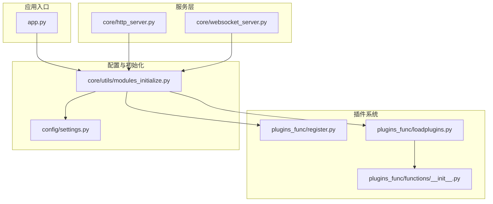
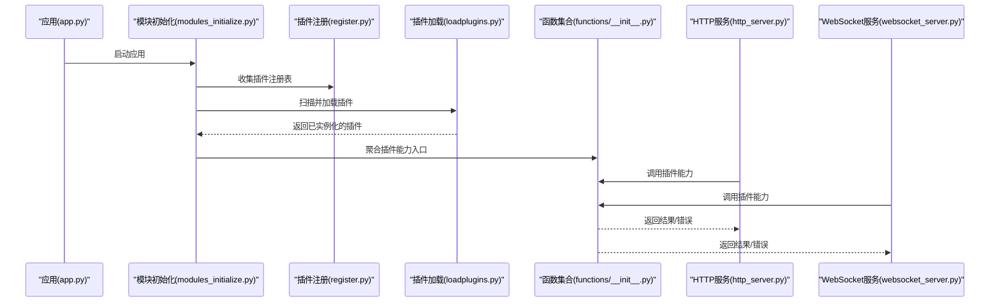
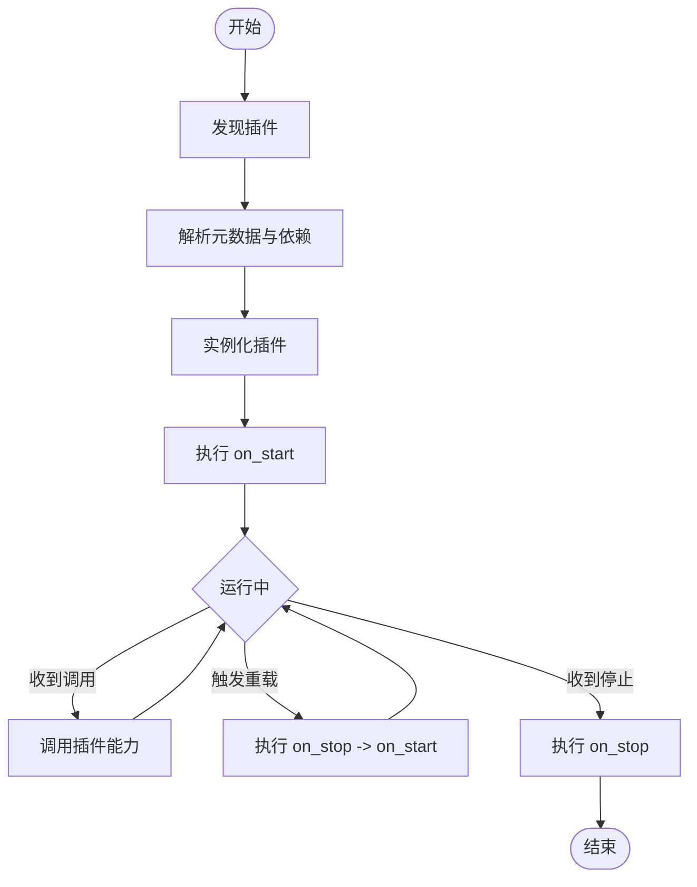
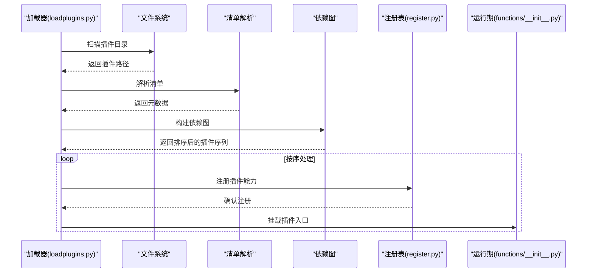
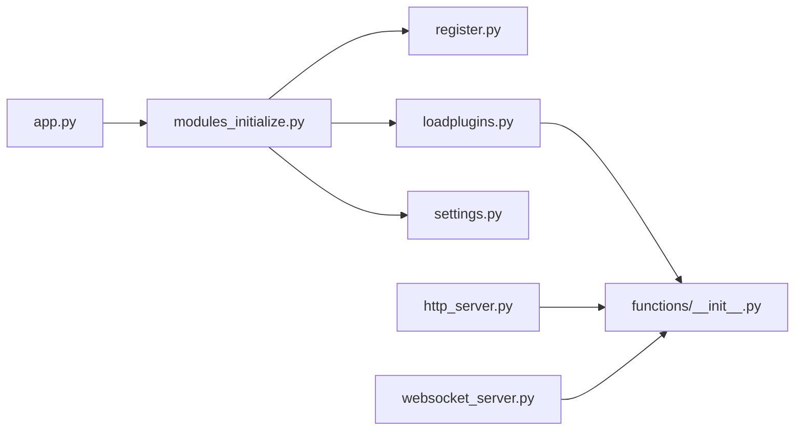

# 插件架构设计

<cite>
**本文引用的文件**   
- [plugins_func/loadplugins.py](file://main/xiaozhi-server/plugins_func/loadplugins.py)
- [plugins_func/register.py](file://main/xiaozhi-server/plugins_func/register.py)
- [plugins_func/functions/__init__.py](file://main/xiaozhi-server/plugins_func/functions/__init__.py)
- [core/utils/modules_initialize.py](file://main/xiaozhi-server/core/utils/modules_initialize.py)
- [core/http_server.py](file://main/xiaozhi-server/core/http_server.py)
- [core/websocket_server.py](file://main/xiaozhi-server/core/websocket_server.py)
- [config/settings.py](file://main/xiaozhi-server/config/settings.py)
- [app.py](file://main/xiaozhi-server/app.py)
</cite>

## 目录
1. [简介](#简介)
2. [项目结构](#项目结构)
3. [核心组件](#核心组件)
4. [架构总览](#架构总览)
5. [详细组件分析](#详细组件分析)
6. [依赖分析](#依赖分析)
7. [性能考虑](#性能考虑)
8. [故障排查指南](#故障排查指南)
9. [结论](#结论)
10. [附录](#附录)

## 简介
本技术文档围绕 xiaozhi-esp32-server 的插件架构进行系统化说明，重点覆盖：
- 插件接口规范与扩展点定义
- 插件生命周期管理与加载流程
- 依赖注入机制与配置管理
- 插件间通信与消息传递
- 权限控制与安全边界
- 热重载支持与错误处理策略
- 性能优化、内存管理与并发安全

该文档旨在帮助开发者快速理解并基于现有框架扩展或开发新插件。

## 项目结构
与插件相关的关键代码集中在以下目录与文件：
- 插件注册与加载：plugins_func/
- 模块初始化与运行时装配：core/utils/modules_initialize.py
- HTTP/WebSocket 服务入口：core/http_server.py, core/websocket_server.py
- 全局配置与设置：config/settings.py
- 应用启动入口：app.py

图表来源
- [app.py](file://main/xiaozhi-server/app.py)
- [core/http_server.py](file://main/xiaozhi-server/core/http_server.py)
- [core/websocket_server.py](file://main/xiaozhi-server/core/websocket_server.py)
- [plugins_func/register.py](file://main/xiaozhi-server/plugins_func/register.py)
- [plugins_func/loadplugins.py](file://main/xiaozhi-server/plugins_func/loadplugins.py)
- [plugins_func/functions/__init__.py](file://main/xiaozhi-server/plugins_func/functions/__init__.py)
- [config/settings.py](file://main/xiaozhi-server/config/settings.py)
- [core/utils/modules_initialize.py](file://main/xiaozhi-server/core/utils/modules_initialize.py)

章节来源
- [app.py](file://main/xiaozhi-server/app.py)
- [core/utils/modules_initialize.py](file://main/xiaozhi-server/core/utils/modules_initialize.py)
- [plugins_func/loadplugins.py](file://main/xiaozhi-server/plugins_func/loadplugins.py)
- [plugins_func/register.py](file://main/xiaozhi-server/plugins_func/register.py)
- [plugins_func/functions/__init__.py](file://main/xiaozhi-server/plugins_func/functions/__init__.py)
- [config/settings.py](file://main/xiaozhi-server/config/settings.py)
- [core/http_server.py](file://main/xiaozhi-server/core/http_server.py)
- [core/websocket_server.py](file://main/xiaozhi-server/core/websocket_server.py)

## 核心组件
- 插件注册器（register.py）
  - 职责：维护插件元数据、能力声明与版本信息；提供统一的注册 API，供插件在启动时向宿主暴露能力。
  - 关键点：插件 ID 唯一性校验、能力键空间隔离、重复注册保护。
- 插件加载器（loadplugins.py）
  - 职责：扫描插件目录、解析插件清单、按依赖顺序实例化插件、执行生命周期钩子。
  - 关键点：动态导入、依赖拓扑排序、失败回滚与错误上报。
- 插件函数集合初始化（functions/__init__.py）
  - 职责：将已注册的插件能力聚合为可被业务层调用的统一入口。
  - 关键点：命名空间映射、调用路由、参数校验与异常包装。
- 模块初始化（modules_initialize.py）
  - 职责：协调配置加载、插件注册与加载、服务启动前的依赖注入。
  - 关键点：配置优先级合并、环境变量覆盖、初始化阶段划分。
- 配置管理（settings.py）
  - 职责：集中管理插件开关、能力开关、超时与重试策略等。
  - 关键点：默认值与覆盖、类型校验、敏感字段脱敏。
- 服务层（http_server.py, websocket_server.py）
  - 职责：对外暴露 HTTP/WebSocket 接口，内部通过插件系统进行能力编排。
  - 关键点：请求上下文传播、插件调用限流与熔断、错误码标准化。

章节来源
- [plugins_func/register.py](file://main/xiaozhi-server/plugins_func/register.py)
- [plugins_func/loadplugins.py](file://main/xiaozhi-server/plugins_func/loadplugins.py)
- [plugins_func/functions/__init__.py](file://main/xiaozhi-server/plugins_func/functions/__init__.py)
- [core/utils/modules_initialize.py](file://main/xiaozhi-server/core/utils/modules_initialize.py)
- [config/settings.py](file://main/xiaozhi-server/config/settings.py)
- [core/http_server.py](file://main/xiaozhi-server/core/http_server.py)
- [core/websocket_server.py](file://main/xiaozhi-server/core/websocket_server.py)

## 架构总览
插件系统采用“注册-加载-装配-调用”的分层架构：
- 注册层：插件通过注册器声明自身能力与元数据。
- 加载层：加载器负责发现、解析、实例化与依赖排序。
- 装配层：初始化模块完成依赖注入与上下文绑定。
- 调用层：HTTP/WebSocket 服务通过统一入口调用插件能力。

图表来源
- [app.py](file://main/xiaozhi-server/app.py)
- [core/utils/modules_initialize.py](file://main/xiaozhi-server/core/utils/modules_initialize.py)
- [plugins_func/register.py](file://main/xiaozhi-server/plugins_func/register.py)
- [plugins_func/loadplugins.py](file://main/xiaozhi-server/plugins_func/loadplugins.py)
- [plugins_func/functions/__init__.py](file://main/xiaozhi-server/plugins_func/functions/__init__.py)
- [core/http_server.py](file://main/xiaozhi-server/core/http_server.py)
- [core/websocket_server.py](file://main/xiaozhi-server/core/websocket_server.py)

## 详细组件分析

### 插件接口规范与扩展点
- 插件元数据
  - 标识：插件 ID、名称、版本、作者、描述
  - 能力：方法名、参数签名、返回值类型、权限要求
  - 依赖：插件依赖列表、最小版本要求
- 扩展点
  - 生命周期钩子：on_init、on_start、on_stop、on_reload
  - 事件总线：插件间事件发布/订阅
  - 配置扩展点：插件级配置项与默认值
- 安全边界
  - 能力白名单、调用频率限制、资源配额

章节来源
- [plugins_func/register.py](file://main/xiaozhi-server/plugins_func/register.py)
- [plugins_func/loadplugins.py](file://main/xiaozhi-server/plugins_func/loadplugins.py)
- [plugins_func/functions/__init__.py](file://main/xiaozhi-server/plugins_func/functions/__init__.py)

### 插件生命周期管理
- 阶段
  - 发现：扫描插件目录与清单
  - 解析：读取元数据与依赖
  - 实例化：创建插件对象并注入依赖
  - 启动：执行 on_start，建立连接与资源
  - 运行：响应调用与事件
  - 停止：释放资源与清理状态
  - 重载：热更新时销毁旧实例并重建
- 错误处理
  - 启动失败回滚、依赖缺失告警、幂等重启

图表来源
- [plugins_func/loadplugins.py](file://main/xiaozhi-server/plugins_func/loadplugins.py)
- [plugins_func/register.py](file://main/xiaozhi-server/plugins_func/register.py)

章节来源
- [plugins_func/loadplugins.py](file://main/xiaozhi-server/plugins_func/loadplugins.py)
- [plugins_func/register.py](file://main/xiaozhi-server/plugins_func/register.py)

### 依赖注入机制
- 容器与提供者
  - 容器：集中管理插件实例与服务对象
  - 提供者：按需创建与缓存依赖对象
- 注入方式
  - 构造器注入：插件构造函数声明依赖
  - 属性注入：通过 setter 注入共享服务
- 作用域
  - 单例：跨插件共享
  - 请求级：每次调用新建
  - 插件级：仅插件内可见

章节来源
- [core/utils/modules_initialize.py](file://main/xiaozhi-server/core/utils/modules_initialize.py)
- [plugins_func/loadplugins.py](file://main/xiaozhi-server/plugins_func/loadplugins.py)

### 插件加载流程
- 扫描与解析
  - 遍历插件目录，读取清单文件
  - 校验元数据完整性与版本兼容性
- 依赖排序
  - 构建依赖图并进行拓扑排序
  - 检测循环依赖并报错
- 实例化与启动
  - 按序实例化插件，执行 on_start
  - 注册能力到统一入口

图表来源
- [plugins_func/loadplugins.py](file://main/xiaozhi-server/plugins_func/loadplugins.py)
- [plugins_func/register.py](file://main/xiaozhi-server/plugins_func/register.py)
- [plugins_func/functions/__init__.py](file://main/xiaozhi-server/plugins_func/functions/__init__.py)

章节来源
- [plugins_func/loadplugins.py](file://main/xiaozhi-server/plugins_func/loadplugins.py)
- [plugins_func/register.py](file://main/xiaozhi-server/plugins_func/register.py)
- [plugins_func/functions/__init__.py](file://main/xiaozhi-server/plugins_func/functions/__init__.py)

### 插件间通信机制
- 事件总线
  - 主题模型：插件按主题发布/订阅事件
  - 过滤与路由：支持条件过滤与多播
- RPC 调用
  - 同步/异步调用：支持阻塞与非阻塞模式
  - 超时与重试：可配置的超时时间与重试策略
- 消息格式
  - 结构化负载：JSON 或 Protobuf
  - 版本兼容：字段向后兼容与弃用标记

章节来源
- [plugins_func/functions/__init__.py](file://main/xiaozhi-server/plugins_func/functions/__init__.py)
- [core/utils/modules_initialize.py](file://main/xiaozhi-server/core/utils/modules_initialize.py)

### 插件注册机制与配置管理
- 注册机制
  - 插件启动时调用注册 API，声明能力与权限
  - 注册表去重与冲突检测
- 配置管理
  - 配置文件与环境变量合并
  - 插件级配置隔离与默认值
  - 运行时动态更新（可选）

章节来源
- [plugins_func/register.py](file://main/xiaozhi-server/plugins_func/register.py)
- [config/settings.py](file://main/xiaozhi-server/config/settings.py)
- [core/utils/modules_initialize.py](file://main/xiaozhi-server/core/utils/modules_initialize.py)

### 权限控制与安全
- 能力白名单
  - 按用户角色或设备类型授权
- 访问控制
  - 鉴权中间件与令牌校验
- 审计与日志
  - 关键操作记录与追踪

章节来源
- [core/http_server.py](file://main/xiaozhi-server/core/http_server.py)
- [core/websocket_server.py](file://main/xiaozhi-server/core/websocket_server.py)
- [config/settings.py](file://main/xiaozhi-server/config/settings.py)

### 热重载支持
- 监听变更
  - 监控插件文件变化与清单更新
- 平滑重载
  - 停止旧实例、重建新实例、切换引用
- 一致性保障
  - 事务式切换与回滚

章节来源
- [plugins_func/loadplugins.py](file://main/xiaozhi-server/plugins_func/loadplugins.py)
- [core/utils/modules_initialize.py](file://main/xiaozhi-server/core/utils/modules_initialize.py)

### 错误处理策略
- 分类与恢复
  - 启动错误：回滚与告警
  - 运行时错误：降级与重试
  - 依赖错误：延迟加载与替代实现
- 诊断与观测
  - 错误码标准化、堆栈采集、指标上报

章节来源
- [plugins_func/loadplugins.py](file://main/xiaozhi-server/plugins_func/loadplugins.py)
- [plugins_func/register.py](file://main/xiaozhi-server/plugins_func/register.py)

## 依赖分析
插件系统各组件之间的依赖关系如下：

图表来源
- [app.py](file://main/xiaozhi-server/app.py)
- [core/utils/modules_initialize.py](file://main/xiaozhi-server/core/utils/modules_initialize.py)
- [plugins_func/register.py](file://main/xiaozhi-server/plugins_func/register.py)
- [plugins_func/loadplugins.py](file://main/xiaozhi-server/plugins_func/loadplugins.py)
- [plugins_func/functions/__init__.py](file://main/xiaozhi-server/plugins_func/functions/__init__.py)
- [config/settings.py](file://main/xiaozhi-server/config/settings.py)
- [core/http_server.py](file://main/xiaozhi-server/core/http_server.py)
- [core/websocket_server.py](file://main/xiaozhi-server/core/websocket_server.py)

章节来源
- [core/utils/modules_initialize.py](file://main/xiaozhi-server/core/utils/modules_initialize.py)
- [plugins_func/loadplugins.py](file://main/xiaozhi-server/plugins_func/loadplugins.py)
- [plugins_func/register.py](file://main/xiaozhi-server/plugins_func/register.py)
- [plugins_func/functions/__init__.py](file://main/xiaozhi-server/plugins_func/functions/__init__.py)
- [config/settings.py](file://main/xiaozhi-server/config/settings.py)
- [core/http_server.py](file://main/xiaozhi-server/core/http_server.py)
- [core/websocket_server.py](file://main/xiaozhi-server/core/websocket_server.py)

## 性能考虑
- 插件实例化与缓存
  - 使用单例与懒加载减少启动开销
  - 对重型依赖进行预热与池化
- 调用路径优化
  - 批量调用与合并响应
  - 异步非阻塞 I/O 与背压控制
- 内存管理
  - 避免大对象常驻内存
  - 及时释放临时资源与句柄
- 并发安全
  - 线程安全的数据结构与锁粒度控制
  - 无共享状态优先，必要时使用读写锁

[本节为通用指导，不直接分析具体文件]

## 故障排查指南
- 常见问题定位
  - 插件未注册：检查注册 API 调用与元数据完整性
  - 依赖缺失：查看依赖图与版本兼容性
  - 启动失败：检查 on_start 钩子与资源初始化
  - 调用超时：调整超时与重试策略，检查下游服务
- 诊断手段
  - 启用详细日志与链路追踪
  - 导出插件健康状态与指标
  - 使用断点与回放工具复现问题

章节来源
- [plugins_func/loadplugins.py](file://main/xiaozhi-server/plugins_func/loadplugins.py)
- [plugins_func/register.py](file://main/xiaozhi-server/plugins_func/register.py)
- [core/utils/modules_initialize.py](file://main/xiaozhi-server/core/utils/modules_initialize.py)

## 结论
本插件架构通过清晰的注册-加载-装配-调用分层，实现了高内聚、低耦合的扩展体系。借助依赖注入、事件总线与统一配置管理，插件具备良好可维护性与可扩展性。结合热重载、错误处理与性能优化策略，可在保证稳定性的同时提升开发效率与运行性能。

[本节为总结性内容，不直接分析具体文件]

## 附录
- 最佳实践
  - 插件职责单一、接口稳定、文档完善
  - 配置项清晰、默认值合理、敏感信息加密
  - 错误码规范、日志详尽、指标完备
- 参考实现路径
  - 插件注册示例：参见 [plugins_func/register.py](file://main/xiaozhi-server/plugins_func/register.py)
  - 插件加载示例：参见 [plugins_func/loadplugins.py](file://main/xiaozhi-server/plugins_func/loadplugins.py)
  - 能力聚合示例：参见 [plugins_func/functions/__init__.py](file://main/xiaozhi-server/plugins_func/functions/__init__.py)
  - 初始化流程示例：参见 [core/utils/modules_initialize.py](file://main/xiaozhi-server/core/utils/modules_initialize.py)
  - 配置管理示例：参见 [config/settings.py](file://main/xiaozhi-server/config/settings.py)
  - 服务集成示例：参见 [core/http_server.py](file://main/xiaozhi-server/core/http_server.py)、[core/websocket_server.py](file://main/xiaozhi-server/core/websocket_server.py)