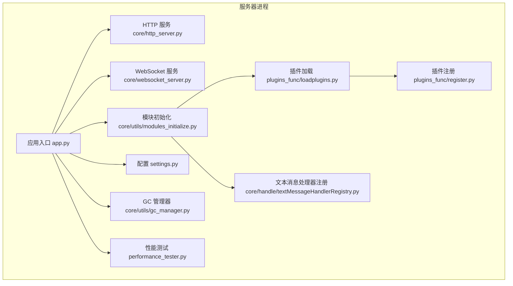
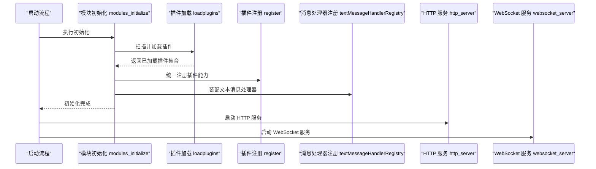
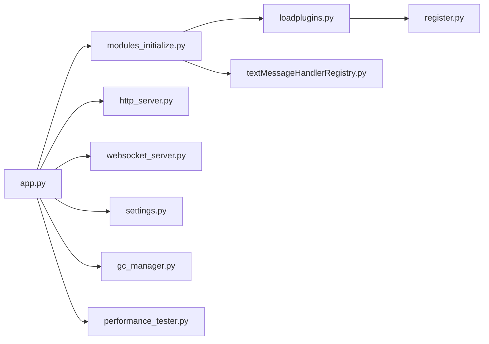

# 插件管理

<cite>
**本文引用的文件**   
- [plugins_func/loadplugins.py](file://main/xiaozhi-server/plugins_func/loadplugins.py)
- [plugins_func/register.py](file://main/xiaozhi-server/plugins_func/register.py)
- [core/handle/textMessageHandlerRegistry.py](file://main/xiaozhi-server/core/handle/textMessageHandlerRegistry.py)
- [core/utils/modules_initialize.py](file://main/xiaozhi-server/core/utils/modules_initialize.py)
- [config/settings.py](file://main/xiaozhi-server/config/settings.py)
- [app.py](file://main/xiaozhi-server/app.py)
- [core/http_server.py](file://main/xiaozhi-server/core/http_server.py)
- [core/websocket_server.py](file://main/xiaozhi-server/core/websocket_server.py)
- [core/utils/gc_manager.py](file://main/xiaozhi-server/core/utils/gc_manager.py)
- [performance_tester.py](file://main/xiaozhi-server/performance_tester.py)
</cite>

## 目录
1. [简介](#简介)
2. [项目结构](#项目结构)
3. [核心组件](#核心组件)
4. [架构总览](#架构总览)
5. [详细组件分析](#详细组件分析)
6. [依赖关系分析](#依赖关系分析)
7. [性能考量](#性能考量)
8. [故障排查指南](#故障排查指南)
9. [结论](#结论)
10. [附录](#附录)

## 简介
本文件面向插件管理系统，系统性阐述插件的加载机制、配置管理、运行时管理与监控能力。重点覆盖：
- 插件的发现与动态加载
- 插件启用/禁用与热重载策略
- 插件生命周期与状态监控
- 插件配置格式与环境变量
- 插件依赖、版本控制与冲突解决
- 性能监控、资源占用与内存泄漏检测
- API 接口、命令行工具与 Web 管理界面使用方法

## 项目结构
插件系统主要位于 xiaozhi-server 模块中，围绕“插件发现与注册”“消息处理器注册”“模块初始化”“HTTP/WebSocket 服务”等关键路径组织。

图表来源
- [app.py](file://main/xiaozhi-server/app.py)
- [core/http_server.py](file://main/xiaozhi-server/core/http_server.py)
- [core/websocket_server.py](file://main/xiaozhi-server/core/websocket_server.py)
- [core/utils/modules_initialize.py](file://main/xiaozhi-server/core/utils/modules_initialize.py)
- [plugins_func/loadplugins.py](file://main/xiaozhi-server/plugins_func/loadplugins.py)
- [plugins_func/register.py](file://main/xiaozhi-server/plugins_func/register.py)
- [config/settings.py](file://main/xiaozhi-server/config/settings.py)
- [core/utils/gc_manager.py](file://main/xiaozhi-server/core/utils/gc_manager.py)
- [performance_tester.py](file://main/xiaozhi-server/performance_tester.py)

章节来源
- [app.py](file://main/xiaozhi-server/app.py)
- [core/utils/modules_initialize.py](file://main/xiaozhi-server/core/utils/modules_initialize.py)
- [plugins_func/loadplugins.py](file://main/xiaozhi-server/plugins_func/loadplugins.py)
- [plugins_func/register.py](file://main/xiaozhi-server/plugins_func/register.py)
- [core/handle/textMessageHandlerRegistry.py](file://main/xiaozhi-server/core/handle/textMessageHandlerRegistry.py)
- [config/settings.py](file://main/xiaozhi-server/config/settings.py)

## 核心组件
- 插件加载器（loadplugins）：负责扫描插件目录、解析元数据、按需导入并实例化插件。
- 插件注册器（register）：提供统一的注册接口，将插件能力暴露给上层调用方。
- 文本消息处理器注册表（textMessageHandlerRegistry）：集中管理基于文本消息的插件式处理逻辑。
- 模块初始化（modules_initialize）：在启动阶段编排各子系统初始化顺序，包括插件加载。
- 配置中心（settings）：集中读取配置与环境变量，为插件提供运行参数。
- HTTP/WebSocket 服务：对外暴露接口，支持通过 API 或 WebSocket 进行插件管理。
- GC 管理器（gc_manager）：辅助内存回收与资源释放，降低插件导致的内存泄漏风险。
- 性能测试（performance_tester）：用于压测与性能基线评估，辅助定位插件性能瓶颈。

章节来源
- [plugins_func/loadplugins.py](file://main/xiaozhi-server/plugins_func/loadplugins.py)
- [plugins_func/register.py](file://main/xiaozhi-server/plugins_func/register.py)
- [core/handle/textMessageHandlerRegistry.py](file://main/xiaozhi-server/core/handle/textMessageHandlerRegistry.py)
- [core/utils/modules_initialize.py](file://main/xiaozhi-server/core/utils/modules_initialize.py)
- [config/settings.py](file://main/xiaozhi-server/config/settings.py)
- [core/http_server.py](file://main/xiaozhi-server/core/http_server.py)
- [core/websocket_server.py](file://main/xiaozhi-server/core/websocket_server.py)
- [core/utils/gc_manager.py](file://main/xiaozhi-server/core/utils/gc_manager.py)
- [performance_tester.py](file://main/xiaozhi-server/performance_tester.py)

## 架构总览
插件系统在启动时由模块初始化流程驱动，按序完成配置加载、插件扫描与注册、消息处理器装配，随后启动 HTTP/WebSocket 服务对外暴露管理能力。

图表来源
- [core/utils/modules_initialize.py](file://main/xiaozhi-server/core/utils/modules_initialize.py)
- [plugins_func/loadplugins.py](file://main/xiaozhi-server/plugins_func/loadplugins.py)
- [plugins_func/register.py](file://main/xiaozhi-server/plugins_func/register.py)
- [core/handle/textMessageHandlerRegistry.py](file://main/xiaozhi-server/core/handle/textMessageHandlerRegistry.py)
- [core/http_server.py](file://main/xiaozhi-server/core/http_server.py)
- [core/websocket_server.py](file://main/xiaozhi-server/core/websocket_server.py)

## 详细组件分析

### 插件加载器（loadplugins）
- 职责
  - 扫描插件目录，识别插件包与元数据。
  - 根据配置决定是否启用某插件。
  - 动态导入插件模块并实例化。
  - 上报加载结果与错误信息。
- 关键点
  - 插件发现策略：约定目录结构与命名规范。
  - 加载失败回退：记录日志并跳过问题插件，保证主流程稳定。
  - 依赖检查：校验必要的外部依赖是否满足。
- 建议
  - 对大型插件采用懒加载，减少启动时间。
  - 为每个插件提供健康检查钩子，便于快速失败。

章节来源
- [plugins_func/loadplugins.py](file://main/xiaozhi-server/plugins_func/loadplugins.py)

### 插件注册器（register）
- 职责
  - 提供统一的注册 API，供插件在初始化时声明自身能力。
  - 维护插件能力映射，供上层调度。
- 关键点
  - 幂等注册：重复注册应覆盖或合并，避免异常。
  - 版本兼容：注册接口需向后兼容，支持多版本插件共存。
- 建议
  - 注册时附带元数据（名称、版本、描述、依赖）。
  - 提供注销接口，支持运行时卸载。

章节来源
- [plugins_func/register.py](file://main/xiaozhi-server/plugins_func/register.py)

### 文本消息处理器注册表（textMessageHandlerRegistry）
- 职责
  - 集中管理基于文本消息的插件式处理逻辑。
  - 提供路由与优先级控制，确保消息被正确分发。
- 关键点
  - 匹配规则：支持正则或关键字匹配。
  - 执行顺序：可配置优先级，避免冲突。
- 建议
  - 为每个处理器提供超时与熔断保护。
  - 记录处理耗时与错误率，便于监控。

章节来源
- [core/handle/textMessageHandlerRegistry.py](file://main/xiaozhi-server/core/handle/textMessageHandlerRegistry.py)

### 模块初始化（modules_initialize）
- 职责
  - 编排子系统初始化顺序：配置、插件、消息处理器、服务等。
  - 协调依赖注入与上下文共享。
- 关键点
  - 初始化失败回滚：部分失败不影响整体可用性。
  - 可插拔扩展点：允许第三方扩展初始化流程。
- 建议
  - 使用事件总线通知初始化阶段变化。
  - 提供初始化进度与诊断信息。

章节来源
- [core/utils/modules_initialize.py](file://main/xiaozhi-server/core/utils/modules_initialize.py)

### 配置中心（settings）
- 职责
  - 集中读取配置文件与环境变量。
  - 为插件提供运行时参数与开关。
- 关键点
  - 配置优先级：环境变量 > 配置文件 > 默认值。
  - 类型校验与缺省值填充。
- 建议
  - 提供配置热更新能力，避免重启。
  - 敏感信息加密存储。

章节来源
- [config/settings.py](file://main/xiaozhi-server/config/settings.py)

### HTTP/WebSocket 服务
- 职责
  - 暴露 RESTful API 与 WebSocket 通道，支持插件管理操作。
  - 鉴权与限流，保障安全与稳定性。
- 关键点
  - 接口版本化，支持平滑升级。
  - 异步处理，提升吞吐。
- 建议
  - 提供 OpenAPI 文档与 SDK。
  - 接入审计日志与访问统计。

章节来源
- [core/http_server.py](file://main/xiaozhi-server/core/http_server.py)
- [core/websocket_server.py](file://main/xiaozhi-server/core/websocket_server.py)

### GC 管理器（gc_manager）
- 职责
  - 辅助触发垃圾回收与资源清理。
  - 监控内存增长趋势，提示潜在泄漏。
- 关键点
  - 定时任务与阈值触发。
  - 与插件生命周期挂钩，确保及时释放。
- 建议
  - 提供内存快照导出与分析。
  - 结合 APM 工具进行链路追踪。

章节来源
- [core/utils/gc_manager.py](file://main/xiaozhi-server/core/utils/gc_manager.py)

### 性能测试（performance_tester）
- 职责
  - 模拟负载，评估插件与系统性能。
  - 生成性能报告，辅助优化。
- 关键点
  - 可配置场景与指标。
  - 与监控平台集成。
- 建议
  - 建立基准回归测试，防止性能退化。
  - 自动化压测纳入 CI/CD。

章节来源
- [performance_tester.py](file://main/xiaozhi-server/performance_tester.py)

## 依赖关系分析
插件系统与核心模块之间的依赖关系如下：

图表来源
- [app.py](file://main/xiaozhi-server/app.py)
- [core/utils/modules_initialize.py](file://main/xiaozhi-server/core/utils/modules_initialize.py)
- [plugins_func/loadplugins.py](file://main/xiaozhi-server/plugins_func/loadplugins.py)
- [plugins_func/register.py](file://main/xiaozhi-server/plugins_func/register.py)
- [core/handle/textMessageHandlerRegistry.py](file://main/xiaozhi-server/core/handle/textMessageHandlerRegistry.py)
- [core/http_server.py](file://main/xiaozhi-server/core/http_server.py)
- [core/websocket_server.py](file://main/xiaozhi-server/core/websocket_server.py)
- [config/settings.py](file://main/xiaozhi-server/config/settings.py)
- [core/utils/gc_manager.py](file://main/xiaozhi-server/core/utils/gc_manager.py)
- [performance_tester.py](file://main/xiaozhi-server/performance_tester.py)

章节来源
- [app.py](file://main/xiaozhi-server/app.py)
- [core/utils/modules_initialize.py](file://main/xiaozhi-server/core/utils/modules_initialize.py)
- [plugins_func/loadplugins.py](file://main/xiaozhi-server/plugins_func/loadplugins.py)
- [plugins_func/register.py](file://main/xiaozhi-server/plugins_func/register.py)
- [core/handle/textMessageHandlerRegistry.py](file://main/xiaozhi-server/core/handle/textMessageHandlerRegistry.py)
- [config/settings.py](file://main/xiaozhi-server/config/settings.py)
- [core/http_server.py](file://main/xiaozhi-server/core/http_server.py)
- [core/websocket_server.py](file://main/xiaozhi-server/core/websocket_server.py)
- [core/utils/gc_manager.py](file://main/xiaozhi-server/core/utils/gc_manager.py)
- [performance_tester.py](file://main/xiaozhi-server/performance_tester.py)

## 性能考量
- 启动优化
  - 延迟加载非关键插件，缩短冷启动时间。
  - 并行扫描与导入，提高发现效率。
- 运行时优化
  - 为插件设置超时与并发限制，避免阻塞。
  - 缓存热点数据，减少重复计算。
- 监控与诊断
  - 采集 CPU、内存、I/O 指标，建立基线。
  - 使用 GC 管理器定期触发回收，观察内存曲线。
  - 引入 APM 工具进行链路追踪与慢查询定位。

[本节为通用指导，不直接分析具体文件]

## 故障排查指南
- 常见问题
  - 插件加载失败：检查目录结构、依赖安装、权限与路径。
  - 配置错误：核对键名、类型与必填项，确认环境变量生效。
  - 运行时崩溃：查看日志堆栈，定位异常插件与调用链。
- 排查步骤
  - 启用调试日志，捕获详细错误信息。
  - 逐步禁用可疑插件，缩小问题范围。
  - 使用性能测试脚本复现问题，验证修复效果。
- 恢复策略
  - 自动回滚到上一稳定版本。
  - 隔离故障插件，保持核心功能可用。
  - 告警通知运维团队介入。

章节来源
- [core/utils/gc_manager.py](file://main/xiaozhi-server/core/utils/gc_manager.py)
- [performance_tester.py](file://main/xiaozhi-server/performance_tester.py)

## 结论
本插件管理体系以“发现-加载-注册-运行-监控”为主线，结合配置中心与服务层，形成完整的插件治理能力。通过严格的依赖管理、版本控制与冲突解决策略，配合性能监控与故障恢复机制，确保系统在扩展性与稳定性之间取得平衡。建议在持续集成中引入自动化测试与性能回归，进一步提升交付质量。

[本节为总结性内容，不直接分析具体文件]

## 附录

### 插件配置文件格式与参数说明
- 文件位置与命名：遵循插件目录约定，包含元数据与运行参数。
- 关键字段
  - 名称与版本：唯一标识与语义化版本。
  - 描述与作者：便于检索与维护。
  - 依赖列表：外部库与插件依赖。
  - 开关与阈值：启用标志、超时、重试次数等。
- 环境变量
  - 覆盖配置文件中的敏感或环境相关参数。
  - 支持布尔、数值、字符串与数组类型。

章节来源
- [config/settings.py](file://main/xiaozhi-server/config/settings.py)

### 插件生命周期管理
- 阶段
  - 发现：扫描插件目录，收集元数据。
  - 加载：导入模块，实例化对象。
  - 注册：声明能力，加入调度表。
  - 运行：响应请求，执行业务逻辑。
  - 卸载：清理资源，注销能力。
- 状态监控
  - 健康检查：周期性探测插件状态。
  - 指标上报：CPU、内存、QPS、错误率。
- 故障恢复
  - 自动重启：失败后指数退避重启。
  - 降级策略：切换备用实现或关闭功能。

章节来源
- [plugins_func/loadplugins.py](file://main/xiaozhi-server/plugins_func/loadplugins.py)
- [plugins_func/register.py](file://main/xiaozhi-server/plugins_func/register.py)
- [core/utils/gc_manager.py](file://main/xiaozhi-server/core/utils/gc_manager.py)

### 启用/禁用与热重载
- 启用/禁用
  - 通过配置开关或 API 动态控制。
  - 支持批量操作与灰度发布。
- 热重载
  - 监听配置变更，触发插件重新加载。
  - 保证无中断切换，旧实例优雅退出。

章节来源
- [core/http_server.py](file://main/xiaozhi-server/core/http_server.py)
- [core/websocket_server.py](file://main/xiaozhi-server/core/websocket_server.py)
- [config/settings.py](file://main/xiaozhi-server/config/settings.py)

### 插件依赖管理、版本控制与冲突解决
- 依赖管理
  - 声明式依赖，自动安装与校验。
  - 虚拟环境隔离，避免全局污染。
- 版本控制
  - 语义化版本，支持多版本并存。
  - 兼容性矩阵，明确向上/向下兼容。
- 冲突解决
  - 优先策略：显式指定优于隐式推断。
  - 冲突检测：启动时预检并给出修复建议。

章节来源
- [plugins_func/loadplugins.py](file://main/xiaozhi-server/plugins_func/loadplugins.py)
- [plugins_func/register.py](file://main/xiaozhi-server/plugins_func/register.py)

### 性能监控、资源占用与内存泄漏检测
- 监控指标
  - 资源：CPU、内存、磁盘、网络。
  - 业务：QPS、延迟、错误率、饱和度。
- 内存泄漏检测
  - 定期快照对比，定位持续增长对象。
  - 结合 GC 管理器与 APM 工具分析。
- 优化建议
  - 减少大对象创建与持有。
  - 使用连接池与对象池复用资源。

章节来源
- [core/utils/gc_manager.py](file://main/xiaozhi-server/core/utils/gc_manager.py)
- [performance_tester.py](file://main/xiaozhi-server/performance_tester.py)

### API 接口、命令行工具与 Web 管理界面
- API 接口
  - 插件列表与详情：GET /api/plugins
  - 启用/禁用：POST /api/plugins/{id}/enable, POST /api/plugins/{id}/disable
  - 热重载：POST /api/plugins/{id}/reload
  - 健康检查：GET /api/plugins/{id}/health
- 命令行工具
  - 列出插件：plugin list
  - 启用/禁用：plugin enable/disable <id>
  - 重载插件：plugin reload <id>
- Web 管理界面
  - 插件总览：显示状态、版本、依赖与健康度。
  - 操作面板：一键启用/禁用、重载与查看日志。
  - 监控看板：实时指标与历史趋势。

章节来源
- [core/http_server.py](file://main/xiaozhi-server/core/http_server.py)
- [core/websocket_server.py](file://main/xiaozhi-server/core/websocket_server.py)