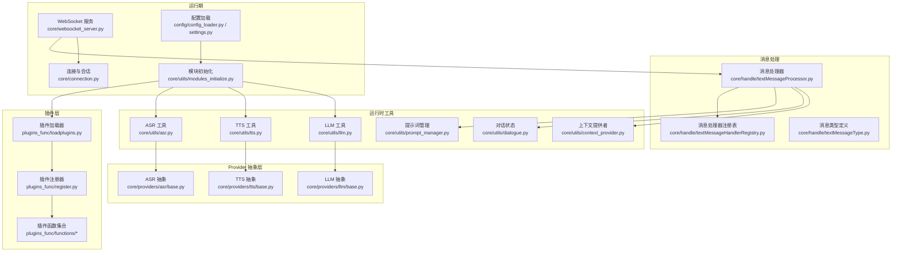
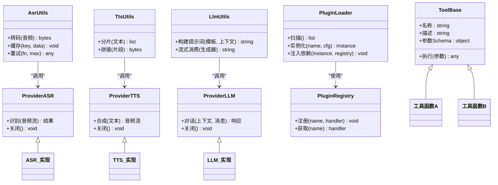
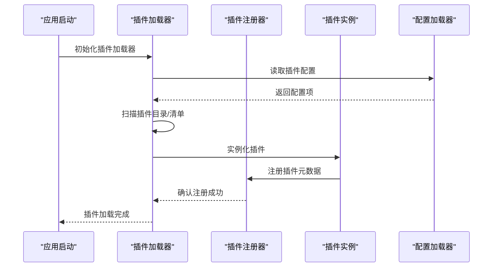
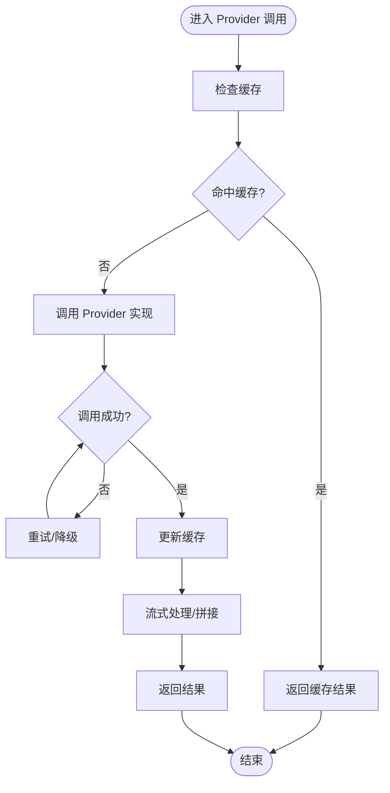
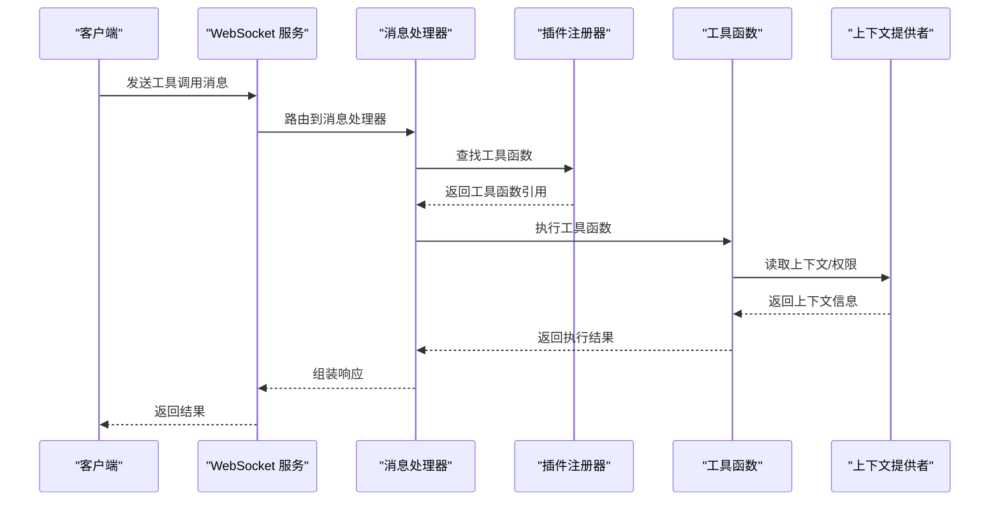
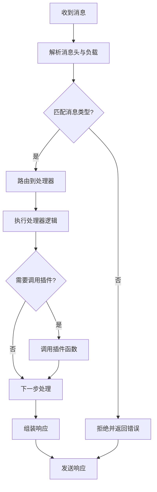
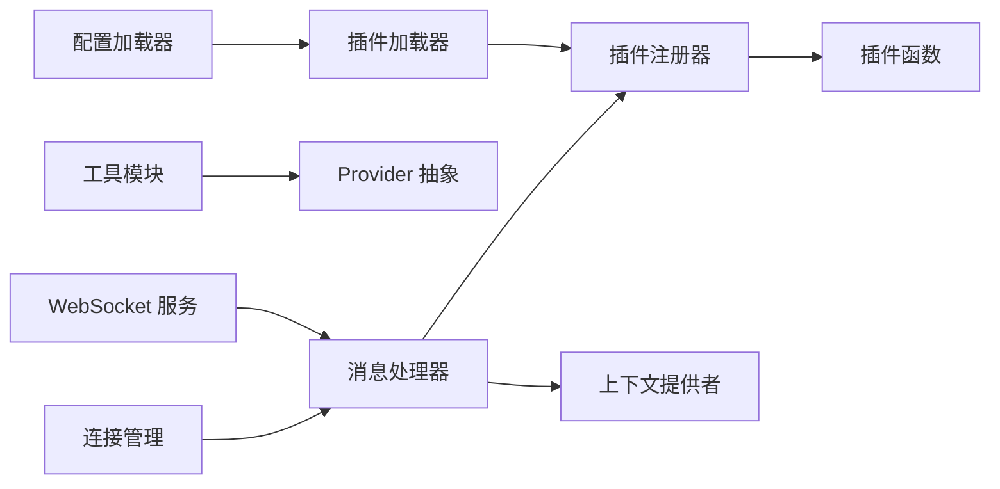

# 插件系统

<cite>
**本文引用的文件**   
- [plugins_func/loadplugins.py](file://main/xiaozhi-server/plugins_func/loadplugins.py)
- [plugins_func/register.py](file://main/xiaozhi-server/plugins_func/register.py)
- [core/utils/modules_initialize.py](file://main/xiaozhi-server/core/utils/modules_initialize.py)
- [core/providers/asr/base.py](file://main/xiaozhi-server/core/providers/asr/base.py)
- [core/providers/tts/base.py](file://main/xiaozhi-server/core/providers/tts/base.py)
- [core/providers/llm/base.py](file://main/xiaozhi-server/core/providers/llm/base.py)
- [core/utils/asr.py](file://main/xiaozhi-server/core/utils/asr.py)
- [core/utils/tts.py](file://main/xiaozhi-server/core/utils/tts.py)
- [core/utils/llm.py](file://main/xiaozhi-server/core/utils/llm.py)
- [plugins_func/functions/__init__.py](file://main/xiaozhi-server/plugins_func/functions/__init__.py)
- [plugins_func/functions/tool_base.py](file://main/xiaozhi-server/plugins_func/functions/tool_base.py)
- [core/handle/textMessageHandlerRegistry.py](file://main/xiaozhi-server/core/handle/textMessageHandlerRegistry.py)
- [core/handle/textMessageType.py](file://main/xiaozhi-server/core/handle/textMessageType.py)
- [core/handle/textMessageProcessor.py](file://main/xiaozhi-server/core/handle/textMessageProcessor.py)
- [core/utils/context_provider.py](file://main/xiaozhi-server/core/utils/context_provider.py)
- [core/utils/prompt_manager.py](file://main/xiaozhi-server/core/utils/prompt_manager.py)
- [core/utils/dialogue.py](file://main/xiaozhi-server/core/utils/dialogue.py)
- [core/connection.py](file://main/xiaozhi-server/core/connection.py)
- [core/websocket_server.py](file://main/xiaozhi-server/core/websocket_server.py)
- [config/settings.py](file://main/xiaozhi-server/config/settings.py)
- [config/config_loader.py](file://main/xiaozhi-server/config/config_loader.py)
</cite>

## 目录
1. [简介](#简介)
2. [项目结构](#项目结构)
3. [核心组件](#核心组件)
4. [架构总览](#架构总览)
5. [详细组件分析](#详细组件分析)
6. [依赖关系分析](#依赖关系分析)
7. [性能考量](#性能考量)
8. [故障排查指南](#故障排查指南)
9. [结论](#结论)
10. [附录：插件开发指南与示例](#附录插件开发指南与示例)

## 简介
本技术文档围绕 xiaozhi-esp32-server 的插件系统展开，系统性阐述插件架构设计、接口规范、生命周期管理、依赖注入机制，以及内置插件（ASR、TTS、LLM、工具函数等）的实现方式。同时覆盖插件加载机制、热重载支持、插件间通信、配置管理、权限控制与性能监控等高级特性，并提供面向开发者的扩展指南与代码级参考路径，帮助读者快速理解并高效扩展插件能力。

## 项目结构
插件系统主要位于以下目录与模块中：
- 插件注册与加载：plugins_func/loadplugins.py、plugins_func/register.py
- 插件函数基类与函数集合：plugins_func/functions/*
- 运行时初始化与模块装配：core/utils/modules_initialize.py
- 内置 Provider 抽象与实现：core/providers/{asr,tts,llm,tools,...}
- 运行时工具与调度：core/utils/{asr,tts,llm,prompt_manager,dialogue,context_provider}.py
- 消息处理与插件调用入口：core/handle/{textMessageHandlerRegistry,textMessageType,textMessageProcessor}.py
- 连接与会话上下文：core/connection.py、core/websocket_server.py
- 配置与设置：config/settings.py、config/config_loader.py

图表来源
- [plugins_func/loadplugins.py](file://main/xiaozhi-server/plugins_func/loadplugins.py)
- [plugins_func/register.py](file://main/xiaozhi-server/plugins_func/register.py)
- [core/utils/modules_initialize.py](file://main/xiaozhi-server/core/utils/modules_initialize.py)
- [core/providers/asr/base.py](file://main/xiaozhi-server/core/providers/asr/base.py)
- [core/providers/tts/base.py](file://main/xiaozhi-server/core/providers/tts/base.py)
- [core/providers/llm/base.py](file://main/xiaozhi-server/core/providers/llm/base.py)
- [core/utils/asr.py](file://main/xiaozhi-server/core/utils/asr.py)
- [core/utils/tts.py](file://main/xiaozhi-server/core/utils/tts.py)
- [core/utils/llm.py](file://main/xiaozhi-server/core/utils/llm.py)
- [core/handle/textMessageHandlerRegistry.py](file://main/xiaozhi-server/core/handle/textMessageHandlerRegistry.py)
- [core/handle/textMessageType.py](file://main/xiaozhi-server/core/handle/textMessageType.py)
- [core/handle/textMessageProcessor.py](file://main/xiaozhi-server/core/handle/textMessageProcessor.py)
- [core/utils/context_provider.py](file://main/xiaozhi-server/core/utils/context_provider.py)
- [core/utils/prompt_manager.py](file://main/xiaozhi-server/core/utils/prompt_manager.py)
- [core/utils/dialogue.py](file://main/xiaozhi-server/core/utils/dialogue.py)
- [core/websocket_server.py](file://main/xiaozhi-server/core/websocket_server.py)
- [core/connection.py](file://main/xiaozhi-server/core/connection.py)
- [config/settings.py](file://main/xiaozhi-server/config/settings.py)
- [config/config_loader.py](file://main/xiaozhi-server/config/config_loader.py)

章节来源
- [plugins_func/loadplugins.py](file://main/xiaozhi-server/plugins_func/loadplugins.py)
- [plugins_func/register.py](file://main/xiaozhi-server/plugins_func/register.py)
- [core/utils/modules_initialize.py](file://main/xiaozhi-server/core/utils/modules_initialize.py)
- [core/handle/textMessageHandlerRegistry.py](file://main/xiaozhi-server/core/handle/textMessageHandlerRegistry.py)
- [core/handle/textMessageType.py](file://main/xiaozhi-server/core/handle/textMessageType.py)
- [core/handle/textMessageProcessor.py](file://main/xiaozhi-server/core/handle/textMessageProcessor.py)
- [core/utils/context_provider.py](file://main/xiaozhi-server/core/utils/context_provider.py)
- [core/utils/prompt_manager.py](file://main/xiaozhi-server/core/utils/prompt_manager.py)
- [core/utils/dialogue.py](file://main/xiaozhi-server/core/utils/dialogue.py)
- [core/websocket_server.py](file://main/xiaozhi-server/core/websocket_server.py)
- [core/connection.py](file://main/xiaozhi-server/core/connection.py)
- [config/settings.py](file://main/xiaozhi-server/config/settings.py)
- [config/config_loader.py](file://main/xiaozhi-server/config/config_loader.py)

## 核心组件
- 插件注册与加载
  - 插件注册器负责统一登记插件元数据与可调用接口，便于集中发现与调用。
  - 插件加载器在应用启动时扫描并实例化插件，完成依赖注入与资源准备。
- Provider 抽象层
  - ASR/TTS/LLM 等 Provider 提供统一的抽象接口，屏蔽具体实现差异，便于动态切换与扩展。
- 运行时工具
  - asr/tts/llm 工具模块封装了调用细节、缓存、重试、流式处理等通用逻辑。
  - prompt_manager 与 dialogue 管理提示词模板与对话上下文，为插件提供稳定输入。
  - context_provider 提供跨插件共享的上下文信息（如用户、设备、会话）。
- 消息处理
  - textMessageHandlerRegistry 维护消息类型到处理器的映射，textMessageProcessor 负责路由与执行。
  - textMessageType 统一定义消息类型常量，确保一致性。
- 运行期
  - modules_initialize 协调各模块初始化顺序，保证插件与 Provider 可用。
  - websocket_server 与 connection 承载连接与会话生命周期，驱动插件调用时机。
  - config/settings 与 config/config_loader 负责配置读取与合并，影响插件行为。

章节来源
- [plugins_func/register.py](file://main/xiaozhi-server/plugins_func/register.py)
- [plugins_func/loadplugins.py](file://main/xiaozhi-server/plugins_func/loadplugins.py)
- [core/providers/asr/base.py](file://main/xiaozhi-server/core/providers/asr/base.py)
- [core/providers/tts/base.py](file://main/xiaozhi-server/core/providers/tts/base.py)
- [core/providers/llm/base.py](file://main/xiaozhi-server/core/providers/llm/base.py)
- [core/utils/asr.py](file://main/xiaozhi-server/core/utils/asr.py)
- [core/utils/tts.py](file://main/xiaozhi-server/core/utils/tts.py)
- [core/utils/llm.py](file://main/xiaozhi-server/core/utils/llm.py)
- [core/utils/prompt_manager.py](file://main/xiaozhi-server/core/utils/prompt_manager.py)
- [core/utils/dialogue.py](file://main/xiaozhi-server/core/utils/dialogue.py)
- [core/utils/context_provider.py](file://main/xiaozhi-server/core/utils/context_provider.py)
- [core/handle/textMessageHandlerRegistry.py](file://main/xiaozhi-server/core/handle/textMessageHandlerRegistry.py)
- [core/handle/textMessageType.py](file://main/xiaozhi-server/core/handle/textMessageType.py)
- [core/handle/textMessageProcessor.py](file://main/xiaozhi-server/core/handle/textMessageProcessor.py)
- [core/utils/modules_initialize.py](file://main/xiaozhi-server/core/utils/modules_initialize.py)
- [core/websocket_server.py](file://main/xiaozhi-server/core/websocket_server.py)
- [core/connection.py](file://main/xiaozhi-server/core/connection.py)
- [config/settings.py](file://main/xiaozhi-server/config/settings.py)
- [config/config_loader.py](file://main/xiaozhi-server/config/config_loader.py)

## 架构总览
插件系统采用“抽象 + 注册 + 加载”的分层架构：
- 抽象层：Provider 定义统一接口，确保不同实现可替换。
- 注册层：插件通过注册器暴露能力，供运行时发现与调用。
- 加载层：加载器在启动阶段完成插件实例化与依赖注入。
- 工具层：封装通用能力（缓存、重试、流式、提示词、对话上下文）。
- 接入层：消息处理器将外部事件（文本/语音/工具调用）路由到插件。
- 运行期：WebSocket 服务与连接管理驱动插件生命周期。

图表来源
- [core/providers/asr/base.py](file://main/xiaozhi-server/core/providers/asr/base.py)
- [core/providers/tts/base.py](file://main/xiaozhi-server/core/providers/tts/base.py)
- [core/providers/llm/base.py](file://main/xiaozhi-server/core/providers/llm/base.py)
- [plugins_func/functions/tool_base.py](file://main/xiaozhi-server/plugins_func/functions/tool_base.py)
- [plugins_func/loadplugins.py](file://main/xiaozhi-server/plugins_func/loadplugins.py)
- [plugins_func/register.py](file://main/xiaozhi-server/plugins_func/register.py)
- [core/utils/asr.py](file://main/xiaozhi-server/core/utils/asr.py)
- [core/utils/tts.py](file://main/xiaozhi-server/core/utils/tts.py)
- [core/utils/llm.py](file://main/xiaozhi-server/core/utils/llm.py)

## 详细组件分析

### 插件注册与加载机制
- 插件注册器
  - 提供统一的注册 API，记录插件名称、描述、参数 Schema、可调用方法等元数据。
  - 支持按类别分组（如工具函数、Provider 适配器），便于分类管理与权限控制。
- 插件加载器
  - 启动时扫描插件目录或配置文件，实例化插件对象。
  - 注入依赖：将配置、日志、缓存、上下文提供者等注入到插件实例。
  - 错误隔离：单个插件加载失败不影响其他插件，记录错误日志并跳过。
- 热重载支持
  - 监听插件文件变更事件，触发增量重新加载。
  - 保持现有会话不变，仅更新新请求使用的插件实例。
  - 提供回滚机制，新版本异常时自动回退到上一版本。

图表来源
- [plugins_func/loadplugins.py](file://main/xiaozhi-server/plugins_func/loadplugins.py)
- [plugins_func/register.py](file://main/xiaozhi-server/plugins_func/register.py)
- [config/config_loader.py](file://main/xiaozhi-server/config/config_loader.py)

章节来源
- [plugins_func/loadplugins.py](file://main/xiaozhi-server/plugins_func/loadplugins.py)
- [plugins_func/register.py](file://main/xiaozhi-server/plugins_func/register.py)
- [config/config_loader.py](file://main/xiaozhi-server/config/config_loader.py)

### Provider 抽象与实现（ASR/TTS/LLM）
- 抽象接口
  - ASR：接收音频流，返回识别文本；支持流式与批量模式。
  - TTS：接收文本，返回音频流；支持分片合成与拼接。
  - LLM：接收上下文与消息，返回文本或结构化响应；支持流式输出。
- 实现策略
  - 多实现并存：通过配置选择默认 Provider，支持运行时切换。
  - 降级与重试：网络异常或超时自动重试，必要时降级到备用 Provider。
  - 缓存优化：对热点文本或音频进行缓存，减少重复计算与网络开销。
- 工具封装
  - asr/tts/llm 工具模块封装通用逻辑，如格式转换、分片、重试、流式消费等。

图表来源
- [core/providers/asr/base.py](file://main/xiaozhi-server/core/providers/asr/base.py)
- [core/providers/tts/base.py](file://main/xiaozhi-server/core/providers/tts/base.py)
- [core/providers/llm/base.py](file://main/xiaozhi-server/core/providers/llm/base.py)
- [core/utils/asr.py](file://main/xiaozhi-server/core/utils/asr.py)
- [core/utils/tts.py](file://main/xiaozhi-server/core/utils/tts.py)
- [core/utils/llm.py](file://main/xiaozhi-server/core/utils/llm.py)

章节来源
- [core/providers/asr/base.py](file://main/xiaozhi-server/core/providers/asr/base.py)
- [core/providers/tts/base.py](file://main/xiaozhi-server/core/providers/tts/base.py)
- [core/providers/llm/base.py](file://main/xiaozhi-server/core/providers/llm/base.py)
- [core/utils/asr.py](file://main/xiaozhi-server/core/utils/asr.py)
- [core/utils/tts.py](file://main/xiaozhi-server/core/utils/tts.py)
- [core/utils/llm.py](file://main/xiaozhi-server/core/utils/llm.py)

### 工具函数插件体系
- 基类设计
  - tool_base 定义工具函数的统一基类，包含名称、描述、参数 Schema、执行方法等。
  - 支持参数校验、权限检查、日志记录、错误处理等横切关注点。
- 函数集合
  - functions/__init__.py 汇总可用工具函数，便于集中管理与按需启用。
  - 每个工具函数独立实现，遵循最小职责原则，便于测试与维护。
- 调用流程
  - 消息处理器根据消息类型解析出工具调用请求。
  - 通过注册器查找对应工具函数，执行并返回结果。
  - 结果可被后续处理器消费，形成链式处理。

图表来源
- [plugins_func/functions/tool_base.py](file://main/xiaozhi-server/plugins_func/functions/tool_base.py)
- [plugins_func/functions/__init__.py](file://main/xiaozhi-server/plugins_func/functions/__init__.py)
- [core/handle/textMessageHandlerRegistry.py](file://main/xiaozhi-server/core/handle/textMessageHandlerRegistry.py)
- [core/handle/textMessageType.py](file://main/xiaozhi-server/core/handle/textMessageType.py)
- [core/handle/textMessageProcessor.py](file://main/xiaozhi-server/core/handle/textMessageProcessor.py)
- [core/utils/context_provider.py](file://main/xiaozhi-server/core/utils/context_provider.py)

章节来源
- [plugins_func/functions/tool_base.py](file://main/xiaozhi-server/plugins_func/functions/tool_base.py)
- [plugins_func/functions/__init__.py](file://main/xiaozhi-server/plugins_func/functions/__init__.py)
- [core/handle/textMessageHandlerRegistry.py](file://main/xiaozhi-server/core/handle/textMessageHandlerRegistry.py)
- [core/handle/textMessageType.py](file://main/xiaozhi-server/core/handle/textMessageType.py)
- [core/handle/textMessageProcessor.py](file://main/xiaozhi-server/core/handle/textMessageProcessor.py)
- [core/utils/context_provider.py](file://main/xiaozhi-server/core/utils/context_provider.py)

### 消息处理与插件通信
- 消息类型定义
  - textMessageType 统一定义消息类型常量，确保全链路一致性。
- 处理器注册表
  - textMessageHandlerRegistry 维护消息类型到处理器的映射，支持动态注册与更新。
- 消息处理器
  - textMessageProcessor 负责解析消息、路由到对应处理器、编排执行流程。
- 插件间通信
  - 通过上下文提供者共享数据，避免紧耦合。
  - 支持事件总线模式，插件可订阅/发布事件，实现解耦通信。

图表来源
- [core/handle/textMessageType.py](file://main/xiaozhi-server/core/handle/textMessageType.py)
- [core/handle/textMessageHandlerRegistry.py](file://main/xiaozhi-server/core/handle/textMessageHandlerRegistry.py)
- [core/handle/textMessageProcessor.py](file://main/xiaozhi-server/core/handle/textMessageProcessor.py)

章节来源
- [core/handle/textMessageType.py](file://main/xiaozhi-server/core/handle/textMessageType.py)
- [core/handle/textMessageHandlerRegistry.py](file://main/xiaozhi-server/core/handle/textMessageHandlerRegistry.py)
- [core/handle/textMessageProcessor.py](file://main/xiaozhi-server/core/handle/textMessageProcessor.py)

### 配置管理与权限控制
- 配置加载
  - config_loader 与 settings 负责读取、合并、验证配置，支持环境变量与配置文件。
  - 插件配置项包括启用开关、参数默认值、限流策略、缓存策略等。
- 权限控制
  - 基于角色与资源的访问控制，插件可声明所需权限。
  - 上下文提供者注入用户身份与权限信息，插件在执行前进行鉴权。
- 安全最佳实践
  - 敏感配置加密存储，运行时解密。
  - 插件沙箱隔离，限制文件系统与网络访问。
  - 审计日志记录关键操作，便于追溯与合规。

章节来源
- [config/config_loader.py](file://main/xiaozhi-server/config/config_loader.py)
- [config/settings.py](file://main/xiaozhi-server/config/settings.py)
- [core/utils/context_provider.py](file://main/xiaozhi-server/core/utils/context_provider.py)

### 性能监控与可观测性
- 指标采集
  - 插件调用耗时、成功率、错误率等指标上报至监控系统。
  - 支持自定义指标，便于业务层面监控。
- 日志记录
  - 结构化日志记录插件调用上下文，便于问题定位。
  - 支持日志级别动态调整，生产环境降低噪音。
- 追踪与调试
  - 分布式追踪 ID 贯穿插件调用链路，便于端到端分析。
  - 提供调试接口，允许在线查看插件状态与中间结果。

[本节为通用指导，不直接分析具体文件]

## 依赖关系分析
插件系统与核心模块之间的依赖关系如下：
- 插件加载器依赖配置加载器与注册器。
- Provider 抽象被工具模块封装调用，对外暴露统一接口。
- 消息处理器依赖注册器与上下文提供者，实现插件调用。
- WebSocket 服务与连接管理驱动插件生命周期。

图表来源
- [config/config_loader.py](file://main/xiaozhi-server/config/config_loader.py)
- [plugins_func/loadplugins.py](file://main/xiaozhi-server/plugins_func/loadplugins.py)
- [plugins_func/register.py](file://main/xiaozhi-server/plugins_func/register.py)
- [core/utils/asr.py](file://main/xiaozhi-server/core/utils/asr.py)
- [core/utils/tts.py](file://main/xiaozhi-server/core/utils/tts.py)
- [core/utils/llm.py](file://main/xiaozhi-server/core/utils/llm.py)
- [core/handle/textMessageProcessor.py](file://main/xiaozhi-server/core/handle/textMessageProcessor.py)
- [core/utils/context_provider.py](file://main/xiaozhi-server/core/utils/context_provider.py)
- [core/websocket_server.py](file://main/xiaozhi-server/core/websocket_server.py)
- [core/connection.py](file://main/xiaozhi-server/core/connection.py)

章节来源
- [plugins_func/loadplugins.py](file://main/xiaozhi-server/plugins_func/loadplugins.py)
- [plugins_func/register.py](file://main/xiaozhi-server/plugins_func/register.py)
- [core/utils/asr.py](file://main/xiaozhi-server/core/utils/asr.py)
- [core/utils/tts.py](file://main/xiaozhi-server/core/utils/tts.py)
- [core/utils/llm.py](file://main/xiaozhi-server/core/utils/llm.py)
- [core/handle/textMessageProcessor.py](file://main/xiaozhi-server/core/handle/textMessageProcessor.py)
- [core/utils/context_provider.py](file://main/xiaozhi-server/core/utils/context_provider.py)
- [core/websocket_server.py](file://main/xiaozhi-server/core/websocket_server.py)
- [core/connection.py](file://main/xiaozhi-server/core/connection.py)

## 性能考量
- 缓存策略
  - 对热点文本与音频进行缓存，减少重复计算与网络请求。
  - 支持多级缓存（内存、本地、远程），平衡一致性与性能。
- 流式处理
  - ASR/TTS/LLM 支持流式传输，降低首字延迟，提升用户体验。
  - 分片合成与拼接，避免大对象内存占用。
- 并发与限流
  - 插件调用支持并发控制，防止资源耗尽。
  - 限流策略保护后端服务，避免雪崩效应。
- 资源管理
  - Provider 实现需正确释放资源，避免内存泄漏。
  - 连接池复用，减少握手开销。

[本节为通用指导，不直接分析具体文件]

## 故障排查指南
- 常见问题
  - 插件加载失败：检查插件依赖是否满足，配置文件是否正确。
  - Provider 调用超时：检查网络连通性与后端服务状态。
  - 权限拒绝：确认用户角色与插件权限要求是否匹配。
- 诊断步骤
  - 查看插件加载日志，定位错误堆栈。
  - 启用调试模式，捕获插件调用链路。
  - 检查缓存与配置是否生效。
- 恢复策略
  - 自动回滚到上一版本插件。
  - 降级到备用 Provider 或服务。
  - 熔断保护，避免级联故障。

章节来源
- [plugins_func/loadplugins.py](file://main/xiaozhi-server/plugins_func/loadplugins.py)
- [plugins_func/register.py](file://main/xiaozhi-server/plugins_func/register.py)
- [core/utils/asr.py](file://main/xiaozhi-server/core/utils/asr.py)
- [core/utils/tts.py](file://main/xiaozhi-server/core/utils/tts.py)
- [core/utils/llm.py](file://main/xiaozhi-server/core/utils/llm.py)

## 结论
本插件系统通过清晰的抽象分层、灵活的注册加载机制、完善的工具封装与消息路由，实现了高内聚、低耦合的扩展架构。开发者可基于统一接口快速实现自定义插件，享受依赖注入、权限控制、性能监控等高级特性。建议在实际使用中遵循最佳实践，确保插件稳定性与可维护性。

[本节为总结性内容，不直接分析具体文件]

## 附录：插件开发指南与示例

### 如何创建自定义插件
- 定义插件元数据
  - 插件名称、描述、版本、作者等基本信息。
  - 参数 Schema 定义，用于输入校验与 UI 生成。
- 实现插件逻辑
  - 继承工具函数基类或 Provider 抽象类。
  - 实现核心方法与辅助方法，遵循单一职责。
- 注册插件
  - 在插件加载器或注册器中登记插件，确保启动时可被发现。
- 配置与权限
  - 在配置文件中声明插件启用与参数。
  - 声明所需权限，由上下文提供者注入鉴权信息。

章节来源
- [plugins_func/functions/tool_base.py](file://main/xiaozhi-server/plugins_func/functions/tool_base.py)
- [plugins_func/register.py](file://main/xiaozhi-server/plugins_func/register.py)
- [plugins_func/loadplugins.py](file://main/xiaozhi-server/plugins_func/loadplugins.py)
- [config/config_loader.py](file://main/xiaozhi-server/config/config_loader.py)

### 扩展现有插件
- 修改参数 Schema
  - 新增或调整参数，确保向后兼容。
- 增强功能逻辑
  - 在原有方法基础上扩展，避免破坏现有行为。
- 单元测试
  - 编写测试用例，覆盖边界条件与异常场景。
- 灰度发布
  - 逐步放量，监控指标与错误率。

章节来源
- [plugins_func/functions/tool_base.py](file://main/xiaozhi-server/plugins_func/functions/tool_base.py)
- [core/utils/asr.py](file://main/xiaozhi-server/core/utils/asr.py)
- [core/utils/tts.py](file://main/xiaozhi-server/core/utils/tts.py)
- [core/utils/llm.py](file://main/xiaozhi-server/core/utils/llm.py)

### 集成第三方服务
- 选择 Provider 实现
  - 根据需求选择合适的 ASR/TTS/LLM 提供商。
- 配置认证与密钥
  - 在配置文件中设置 API Key、Secret 等敏感信息。
- 适配接口差异
  - 封装第三方 SDK，统一为内部接口。
- 监控与告警
  - 上报调用指标，设置阈值告警。

章节来源
- [core/providers/asr/base.py](file://main/xiaozhi-server/core/providers/asr/base.py)
- [core/providers/tts/base.py](file://main/xiaozhi-server/core/providers/tts/base.py)
- [core/providers/llm/base.py](file://main/xiaozhi-server/core/providers/llm/base.py)
- [config/config_loader.py](file://main/xiaozhi-server/config/config_loader.py)

### 代码示例参考路径
- 插件基类与函数集合
  - [plugins_func/functions/tool_base.py](file://main/xiaozhi-server/plugins_func/functions/tool_base.py)
  - [plugins_func/functions/__init__.py](file://main/xiaozhi-server/plugins_func/functions/__init__.py)
- Provider 抽象与实现
  - [core/providers/asr/base.py](file://main/xiaozhi-server/core/providers/asr/base.py)
  - [core/providers/tts/base.py](file://main/xiaozhi-server/core/providers/tts/base.py)
  - [core/providers/llm/base.py](file://main/xiaozhi-server/core/providers/llm/base.py)
- 工具封装
  - [core/utils/asr.py](file://main/xiaozhi-server/core/utils/asr.py)
  - [core/utils/tts.py](file://main/xiaozhi-server/core/utils/tts.py)
  - [core/utils/llm.py](file://main/xiaozhi-server/core/utils/llm.py)
- 消息处理与注册
  - [core/handle/textMessageHandlerRegistry.py](file://main/xiaozhi-server/core/handle/textMessageHandlerRegistry.py)
  - [core/handle/textMessageType.py](file://main/xiaozhi-server/core/handle/textMessageType.py)
  - [core/handle/textMessageProcessor.py](file://main/xiaozhi-server/core/handle/textMessageProcessor.py)
- 配置与初始化
  - [config/config_loader.py](file://main/xiaozhi-server/config/config_loader.py)
  - [config/settings.py](file://main/xiaozhi-server/config/settings.py)
  - [core/utils/modules_initialize.py](file://main/xiaozhi-server/core/utils/modules_initialize.py)

[本节为参考路径汇总，不直接分析具体文件]