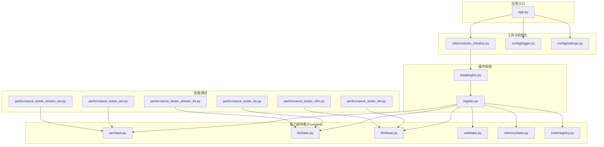
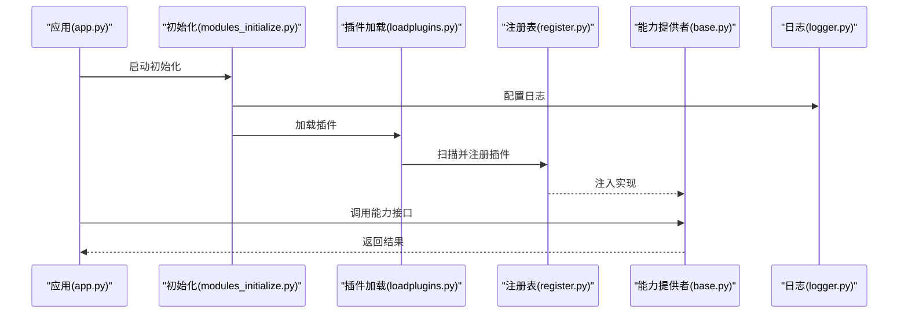
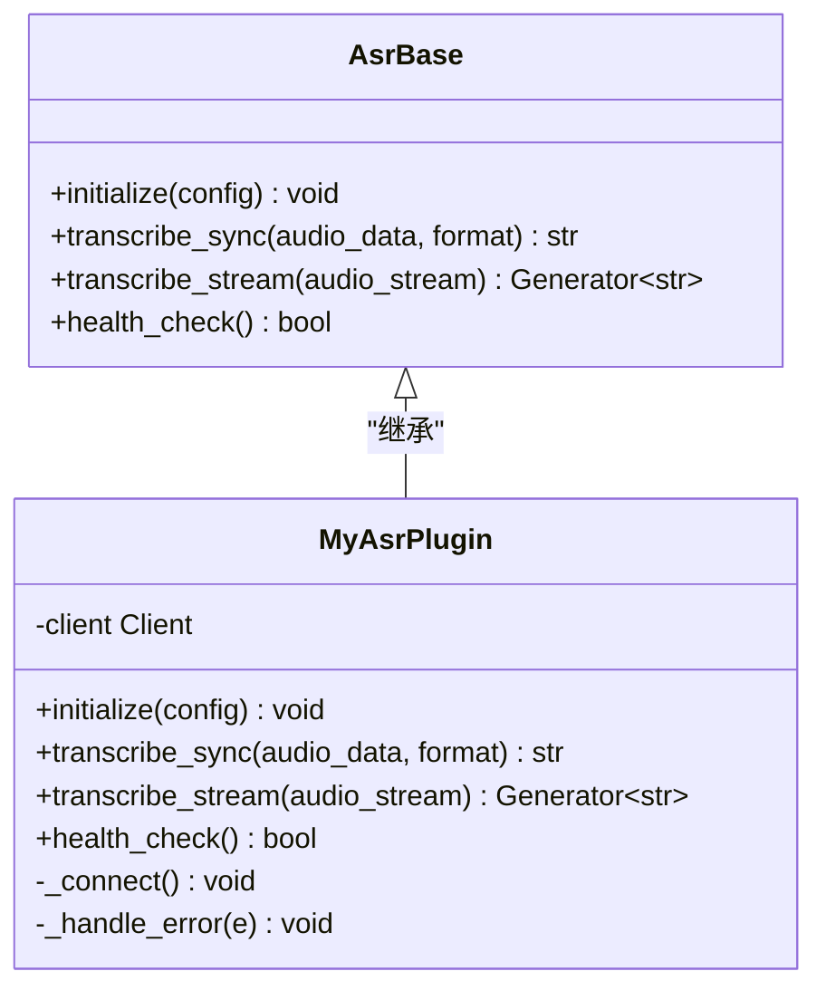
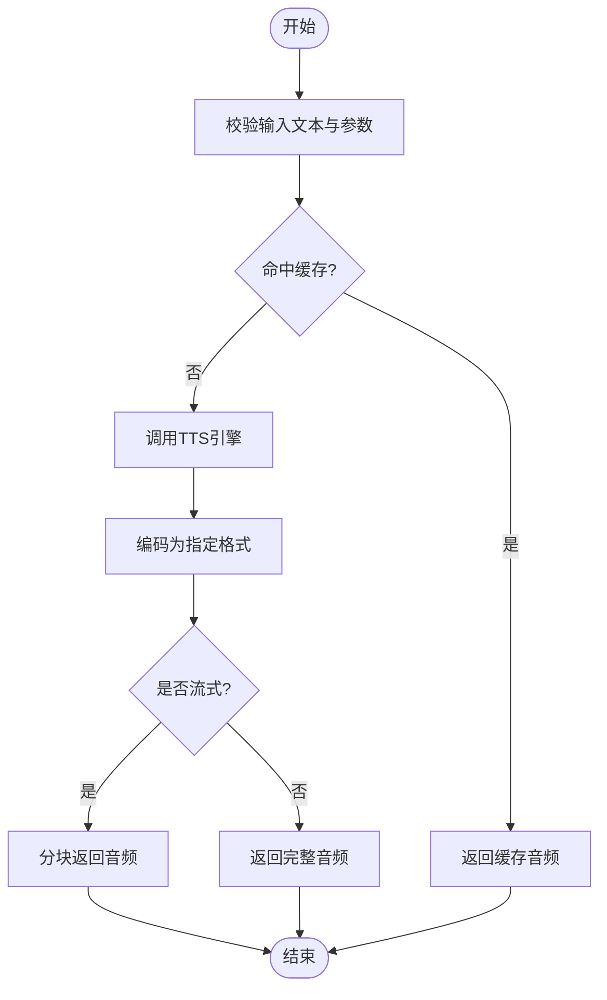
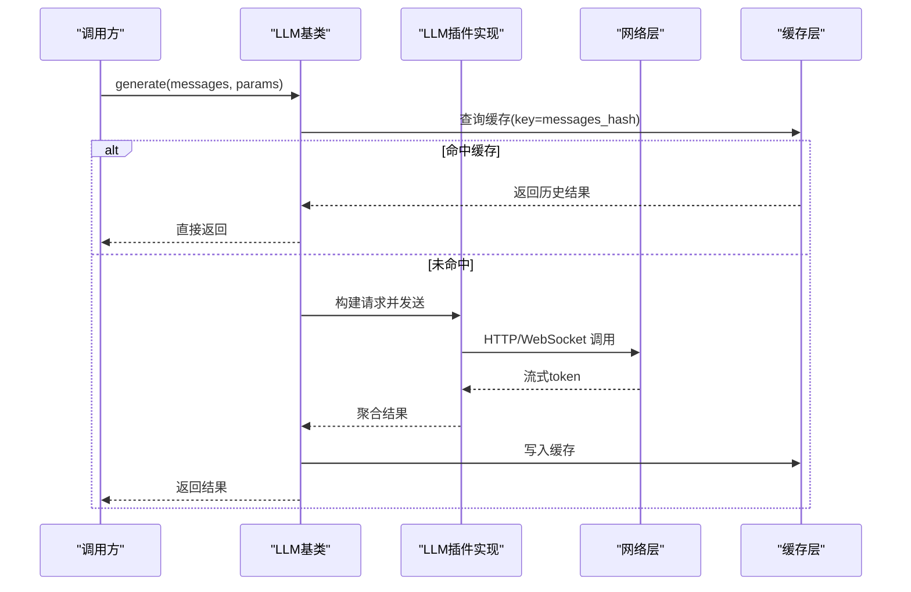
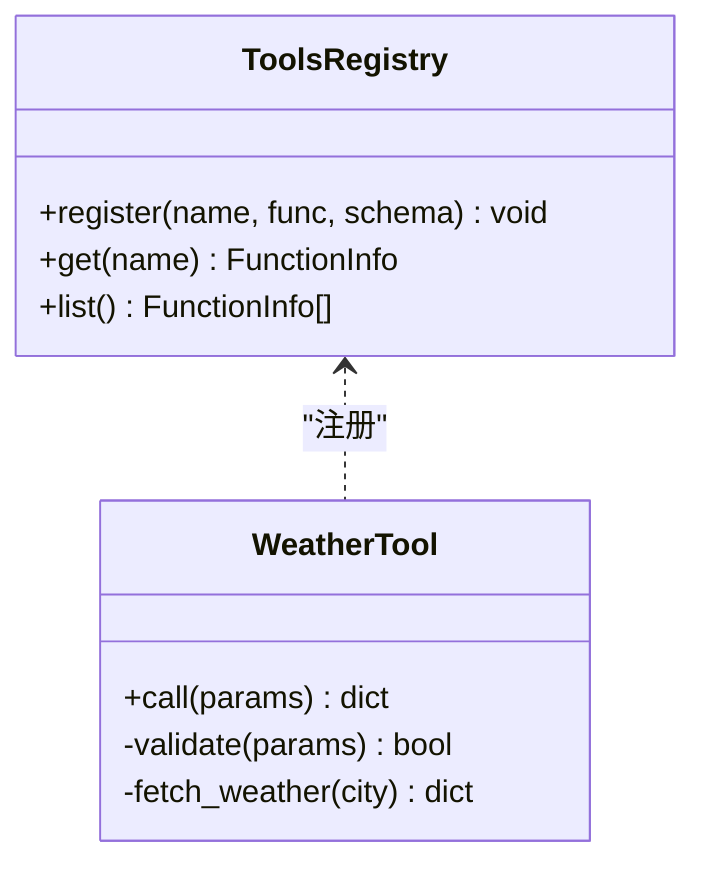
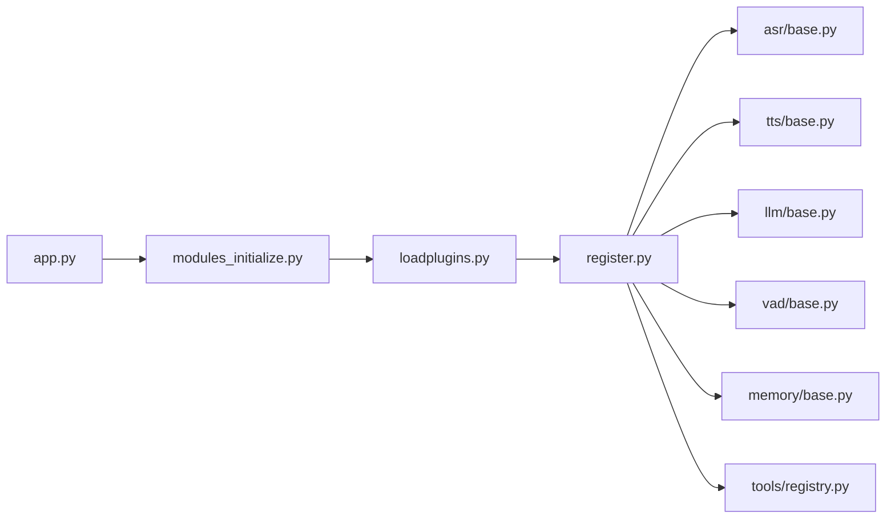

# 自定义插件开发

<cite>
**本文引用的文件**   
- [main.py](file://main/xiaozhi-server/app.py)
- [loadplugins.py](file://main/xiaozhi-server/plugins_func/loadplugins.py)
- [register.py](file://main/xiaozhi-server/plugins_func/register.py)
- [asr_base.py](file://main/xiaozhi-server/core/providers/asr/base.py)
- [tts_base.py](file://main/xiaozhi-server/core/providers/tts/base.py)
- [llm_base.py](file://main/xiaozhi-server/core/providers/llm/base.py)
- [tools_registry.py](file://main/xiaozhi-server/core/providers/tools/registry.py)
- [vad_base.py](file://main/xiaozhi-server/core/providers/vad/base.py)
- [memory_base.py](file://main/xiaozhi-server/core/providers/memory/base.py)
- [modules_initialize.py](file://main/xiaozhi-server/core/utils/modules_initialize.py)
- [logger.py](file://main/xiaozhi-server/config/logger.py)
- [settings.py](file://main/xiaozhi-server/config/settings.py)
- [performance_tester_asr.py](file://main/xiaozhi-server/performance_tester/performance_tester_asr.py)
- [performance_tester_tts.py](file://main/xiaozhi-server/performance_tester/performance_tester_tts.py)
- [performance_tester_llm.py](file://main/xiaozhi-server/performance_tester/performance_tester_llm.py)
- [performance_tester_stream_asr.py](file://main/xiaozhi-server/performance_tester/performance_tester_stream_asr.py)
- [performance_tester_stream_tts.py](file://main/xiaozhi-server/performance_tester/performance_tester_stream_tts.py)
- [performance_tester_vllm.py](file://main/xiaozhi-server/performance_tester/performance_tester_vllm.py)
</cite>

## 目录
1. [简介](#简介)
2. [项目结构](#项目结构)
3. [核心组件](#核心组件)
4. [架构总览](#架构总览)
5. [详细组件分析](#详细组件分析)
6. [依赖关系分析](#依赖关系分析)
7. [性能考量](#性能考量)
8. [故障排查指南](#故障排查指南)
9. [结论](#结论)
10. [附录](#附录)

## 简介
本指南面向希望在 xiaozhi-esp32-server 中开发“自定义插件”的开发者，覆盖从需求分析、接口定义、文件组织、命名约定到测试、调试、性能优化与安全加固的全流程。文档重点围绕 ASR（语音识别）、TTS（语音合成）、LLM（大语言模型）、工具函数等插件类型，提供可操作的规范与最佳实践，并给出生产环境的打包、分发、版本管理与兼容性处理建议。

## 项目结构
本项目采用“按能力域分层 + 插件化扩展”的组织方式：
- 核心运行时位于 main/xiaozhi-server，包含配置、日志、服务启动、消息处理、提供者（providers）与工具（tools）等模块。
- 插件机制通过 plugins_func 进行统一加载与注册，各能力域在 core/providers 下以 base 抽象类定义统一接口，具体实现以插件形式提供。
- 性能测试集中在 performance_tester 目录，便于对 ASR/TTS/LLM 等进行基准与流式评测。

图表来源
- [app.py:1-200](file://main/xiaozhi-server/app.py#L1-L200)
- [modules_initialize.py:1-200](file://main/xiaozhi-server/core/utils/modules_initialize.py#L1-L200)
- [loadplugins.py:1-200](file://main/xiaozhi-server/plugins_func/loadplugins.py#L1-L200)
- [register.py:1-200](file://main/xiaozhi-server/plugins_func/register.py#L1-L200)
- [asr_base.py:1-200](file://main/xiaozhi-server/core/providers/asr/base.py#L1-L200)
- [tts_base.py:1-200](file://main/xiaozhi-server/core/providers/tts/base.py#L1-L200)
- [llm_base.py:1-200](file://main/xiaozhi-server/core/providers/llm/base.py#L1-L200)
- [vad_base.py:1-200](file://main/xiaozhi-server/core/providers/vad/base.py#L1-L200)
- [memory_base.py:1-200](file://main/xiaozhi-server/core/providers/memory/base.py#L1-L200)
- [tools_registry.py:1-200](file://main/xiaozhi-server/core/providers/tools/registry.py#L1-L200)
- [logger.py:1-200](file://main/xiaozhi-server/config/logger.py#L1-L200)
- [settings.py:1-200](file://main/xiaozhi-server/config/settings.py#L1-L200)

章节来源
- [app.py:1-200](file://main/xiaozhi-server/app.py#L1-L200)
- [modules_initialize.py:1-200](file://main/xiaozhi-server/core/utils/modules_initialize.py#L1-L200)
- [loadplugins.py:1-200](file://main/xiaozhi-server/plugins_func/loadplugins.py#L1-L200)
- [register.py:1-200](file://main/xiaozhi-server/plugins_func/register.py#L1-L200)

## 核心组件
- 插件加载器：负责扫描、导入与实例化插件，完成生命周期管理。
- 插件注册表：维护插件元数据（名称、版本、能力标签、参数校验规则），提供查询与选择策略。
- 能力基类：为 ASR、TTS、LLM、VAD、Memory、Tools 等能力定义统一接口，确保插件可插拔。
- 初始化模块：在应用启动时按顺序初始化配置、日志、插件系统与能力提供者。
- 日志与配置：集中化的日志输出与配置加载，保证插件运行环境一致性与可观测性。

章节来源
- [loadplugins.py:1-200](file://main/xiaozhi-server/plugins_func/loadplugins.py#L1-L200)
- [register.py:1-200](file://main/xiaozhi-server/plugins_func/register.py#L1-L200)
- [asr_base.py:1-200](file://main/xiaozhi-server/core/providers/asr/base.py#L1-L200)
- [tts_base.py:1-200](file://main/xiaozhi-server/core/providers/tts/base.py#L1-L200)
- [llm_base.py:1-200](file://main/xiaozhi-server/core/providers/llm/base.py#L1-L200)
- [vad_base.py:1-200](file://main/xiaozhi-server/core/providers/vad/base.py#L1-L200)
- [memory_base.py:1-200](file://main/xiaozhi-server/core/providers/memory/base.py#L1-L200)
- [tools_registry.py:1-200](file://main/xiaozhi-server/core/providers/tools/registry.py#L1-L200)
- [modules_initialize.py:1-200](file://main/xiaozhi-server/core/utils/modules_initialize.py#L1-L200)
- [logger.py:1-200](file://main/xiaozhi-server/config/logger.py#L1-L200)
- [settings.py:1-200](file://main/xiaozhi-server/config/settings.py#L1-L200)

## 架构总览
插件系统遵循“基类抽象 + 注册表调度 + 加载器装配”的设计模式。应用启动后，初始化模块按序加载配置与日志，随后插件加载器扫描插件目录，依据注册表将插件实例注入到对应能力提供者。调用方通过统一的接口访问 ASR/TTS/LLM/VAD/Memory/Tools，屏蔽底层实现差异。

图表来源
- [app.py:1-200](file://main/xiaozhi-server/app.py#L1-L200)
- [modules_initialize.py:1-200](file://main/xiaozhi-server/core/utils/modules_initialize.py#L1-L200)
- [loadplugins.py:1-200](file://main/xiaozhi-server/plugins_func/loadplugins.py#L1-L200)
- [register.py:1-200](file://main/xiaozhi-server/plugins_func/register.py#L1-L200)
- [asr_base.py:1-200](file://main/xiaozhi-server/core/providers/asr/base.py#L1-L200)
- [tts_base.py:1-200](file://main/xiaozhi-server/core/providers/tts/base.py#L1-L200)
- [llm_base.py:1-200](file://main/xiaozhi-server/core/providers/llm/base.py#L1-L200)
- [logger.py:1-200](file://main/xiaozhi-server/config/logger.py#L1-L200)

## 详细组件分析

### ASR 插件开发
ASR 插件需继承 ASR 基类，实现音频流或文件的转写接口，支持同步与流式两种模式。关键要点：
- 接口一致性：遵循基类方法签名，确保输入输出格式统一。
- 流式处理：对于长音频或实时场景，应实现增量返回片段的能力。
- 错误处理：网络异常、鉴权失败、超时等需抛出明确异常并记录日志。
- 性能优化：连接池、缓冲队列、并发控制、内存复用。

图表来源
- [asr_base.py:1-200](file://main/xiaozhi-server/core/providers/asr/base.py#L1-L200)

章节来源
- [asr_base.py:1-200](file://main/xiaozhi-server/core/providers/asr/base.py#L1-L200)
- [performance_tester_asr.py:1-200](file://main/xiaozhi-server/performance_tester/performance_tester_asr.py#L1-L200)
- [performance_tester_stream_asr.py:1-200](file://main/xiaozhi-server/performance_tester/performance_tester_stream_asr.py#L1-L200)

### TTS 插件开发
TTS 插件需继承 TTS 基类，实现文本到语音的转换，支持多种音频格式与采样率。关键要点：
- 音频编码：根据下游设备能力选择合适的编码（如 PCM/Opus）。
- 流式播放：优先使用流式接口以降低首包延迟。
- 资源管理：模型缓存、连接复用、限流与熔断。
- 质量评估：音素对齐、停顿控制、情感与语速可调。

图表来源
- [tts_base.py:1-200](file://main/xiaozhi-server/core/providers/tts/base.py#L1-L200)

章节来源
- [tts_base.py:1-200](file://main/xiaozhi-server/core/providers/tts/base.py#L1-L200)
- [performance_tester_tts.py:1-200](file://main/xiaozhi-server/performance_tester/performance_tester_tts.py#L1-L200)
- [performance_tester_stream_tts.py:1-200](file://main/xiaozhi-server/performance_tester/performance_tester_stream_tts.py#L1-L200)

### LLM 插件开发
LLM 插件需继承 LLM 基类，实现对话生成与上下文管理。关键要点：
- 上下文窗口：合理管理历史消息长度与压缩策略。
- 流式响应：增量输出 token，提升交互体验。
- 安全过滤：敏感词过滤、越狱防护、输出合规检查。
- 成本与速率：请求限流、重试退避、缓存热点提示。

图表来源
- [llm_base.py:1-200](file://main/xiaozhi-server/core/providers/llm/base.py#L1-L200)

章节来源
- [llm_base.py:1-200](file://main/xiaozhi-server/core/providers/llm/base.py#L1-L200)
- [performance_tester_llm.py:1-200](file://main/xiaozhi-server/performance_tester/performance_tester_llm.py#L1-L200)
- [performance_tester_vllm.py:1-200](file://main/xiaozhi-server/performance_tester/performance_tester_vllm.py#L1-L200)

### 工具函数插件开发
工具函数插件通过 tools 注册表暴露可被 LLM 调用的能力，如天气查询、日程管理等。关键要点：
- 函数签名：明确的输入输出 schema，便于自动校验与文档生成。
- 权限控制：基于角色或用户维度的访问限制。
- 幂等与重试：对外部 API 的幂等设计与失败重试策略。
- 监控与告警：调用成功率、耗时、错误码统计。

图表来源
- [tools_registry.py:1-200](file://main/xiaozhi-server/core/providers/tools/registry.py#L1-L200)

章节来源
- [tools_registry.py:1-200](file://main/xiaozhi-server/core/providers/tools/registry.py#L1-L200)

### VAD 与 Memory 插件
- VAD（语音活动检测）插件：用于静音段检测与说话人端点划分，影响 ASR 触发时机与切分策略。
- Memory（记忆）插件：提供短期/长期记忆存储与检索，支撑对话连贯性与个性化。

章节来源
- [vad_base.py:1-200](file://main/xiaozhi-server/core/providers/vad/base.py#L1-L200)
- [memory_base.py:1-200](file://main/xiaozhi-server/core/providers/memory/base.py#L1-L200)

## 依赖关系分析
插件系统通过加载器与注册表解耦具体实现，降低耦合度，提高可替换性。各能力提供者之间通过统一接口协作，避免硬编码依赖。

图表来源
- [loadplugins.py:1-200](file://main/xiaozhi-server/plugins_func/loadplugins.py#L1-L200)
- [register.py:1-200](file://main/xiaozhi-server/plugins_func/register.py#L1-L200)
- [asr_base.py:1-200](file://main/xiaozhi-server/core/providers/asr/base.py#L1-L200)
- [tts_base.py:1-200](file://main/xiaozhi-server/core/providers/tts/base.py#L1-L200)
- [llm_base.py:1-200](file://main/xiaozhi-server/core/providers/llm/base.py#L1-L200)
- [vad_base.py:1-200](file://main/xiaozhi-server/core/providers/vad/base.py#L1-L200)
- [memory_base.py:1-200](file://main/xiaozhi-server/core/providers/memory/base.py#L1-L200)
- [tools_registry.py:1-200](file://main/xiaozhi-server/core/providers/tools/registry.py#L1-L200)
- [modules_initialize.py:1-200](file://main/xiaozhi-server/core/utils/modules_initialize.py#L1-L200)
- [app.py:1-200](file://main/xiaozhi-server/app.py#L1-L200)

章节来源
- [loadplugins.py:1-200](file://main/xiaozhi-server/plugins_func/loadplugins.py#L1-L200)
- [register.py:1-200](file://main/xiaozhi-server/plugins_func/register.py#L1-L200)
- [modules_initialize.py:1-200](file://main/xiaozhi-server/core/utils/modules_initialize.py#L1-L200)
- [app.py:1-200](file://main/xiaozhi-server/app.py#L1-L200)

## 性能考量
- 连接与资源管理：使用连接池、对象池减少创建销毁开销；对 I/O 密集型操作启用异步与并发。
- 缓存策略：对热点数据（如 TTS 音频、LLM 提示）实施多级缓存，注意失效与一致性。
- 流式处理：优先流式接口，降低首包延迟与内存占用。
- 限流与熔断：对第三方 API 设置 QPS 上限、超时与重试退避，防止雪崩。
- 基准测试：利用 performance_tester 系列脚本进行吞吐、延迟、错误率评估，持续回归。

章节来源
- [performance_tester_asr.py:1-200](file://main/xiaozhi-server/performance_tester/performance_tester_asr.py#L1-L200)
- [performance_tester_tts.py:1-200](file://main/xiaozhi-server/performance_tester/performance_tester_tts.py#L1-L200)
- [performance_tester_llm.py:1-200](file://main/xiaozhi-server/performance_tester/performance_tester_llm.py#L1-L200)
- [performance_tester_stream_asr.py:1-200](file://main/xiaozhi-server/performance_tester/performance_tester_stream_asr.py#L1-L200)
- [performance_tester_stream_tts.py:1-200](file://main/xiaozhi-server/performance_tester/performance_tester_stream_tts.py#L1-L200)
- [performance_tester_vllm.py:1-200](file://main/xiaozhi-server/performance_tester/performance_tester_vllm.py#L1-L200)

## 故障排查指南
- 日志定位：统一使用 logger 输出结构化日志，包含请求 ID、插件名、参数摘要、耗时与错误堆栈。
- 健康检查：为每个插件实现 health_check，便于编排与健康探针。
- 常见错误：
  - 鉴权失败：检查密钥、域名、白名单与证书。
  - 超时与重试：调整超时阈值与重试策略，观察错误码分布。
  - 内存泄漏：监控峰值内存与 GC 行为，避免大对象常驻。
- 调试技巧：
  - 开启详细日志与抓包，对比输入输出。
  - 使用性能测试脚本复现场景，逐步缩小范围。
  - 隔离问题插件，验证基类接口与依赖库版本。

章节来源
- [logger.py:1-200](file://main/xiaozhi-server/config/logger.py#L1-L200)
- [asr_base.py:1-200](file://main/xiaozhi-server/core/providers/asr/base.py#L1-L200)
- [tts_base.py:1-200](file://main/xiaozhi-server/core/providers/tts/base.py#L1-L200)
- [llm_base.py:1-200](file://main/xiaozhi-server/core/providers/llm/base.py#L1-L200)

## 结论
通过统一的基类抽象、插件加载与注册机制，项目实现了高内聚、低耦合的可扩展架构。遵循本文的开发规范与最佳实践，开发者可以快速构建高质量的 ASR/TTS/LLM/工具插件，并在生产环境中稳定运行。建议结合性能测试与监控体系持续优化，保障用户体验与服务可靠性。

## 附录

### 插件开发规范与命名约定
- 文件结构：每个插件一个目录，包含实现文件、配置文件与 README。
- 命名约定：插件类名以能力前缀开头（如 AsrXxx、TtsXxx、LlmXxx），文件名小写下划线分隔。
- 接口契约：严格遵循基类方法签名与返回值类型，新增字段需向后兼容。
- 配置项：集中声明于 settings，提供默认值与校验规则。
- 日志与错误：统一日志级别与格式，错误分类清晰，便于自动化处理。

### 插件测试方法与调试技巧
- 单元测试：覆盖正常路径、边界条件与异常分支。
- 集成测试：模拟外部依赖，验证端到端流程。
- 性能测试：使用 performance_tester 系列脚本进行压测与回归。
- 调试技巧：断点、日志、抓包、指标采集，结合健康检查快速定位问题。

### 插件打包、分发与版本管理
- 打包：提供独立安装包或容器镜像，包含依赖与环境说明。
- 分发：通过内部仓库或制品库发布，附带签名与校验信息。
- 版本管理：语义化版本号，变更日志与兼容性矩阵。
- 部署：灰度发布、蓝绿部署、回滚策略与监控告警。

### 安全考虑
- 输入校验：严格校验与过滤，防止注入与越权。
- 密钥管理：使用环境变量或密钥管理服务，禁止硬编码。
- 传输安全：HTTPS/TLS 加密，证书校验与更新。
- 审计与合规：敏感操作留痕，满足合规要求。