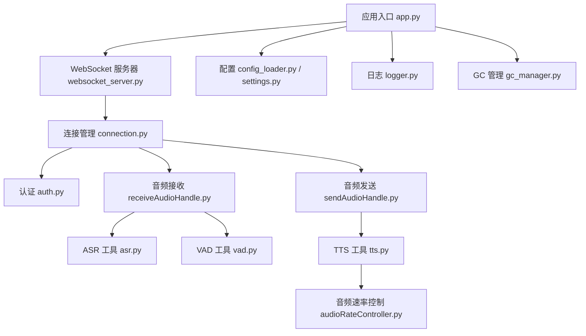
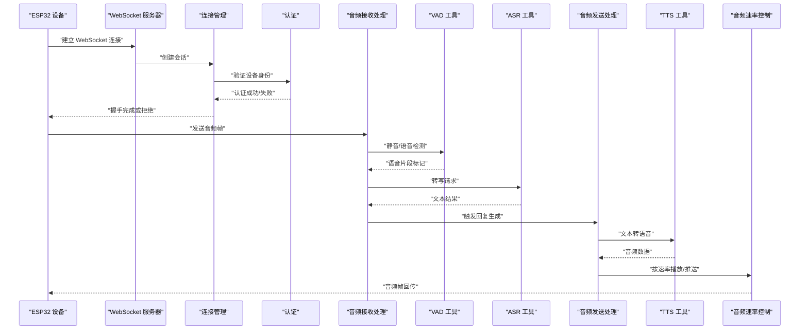
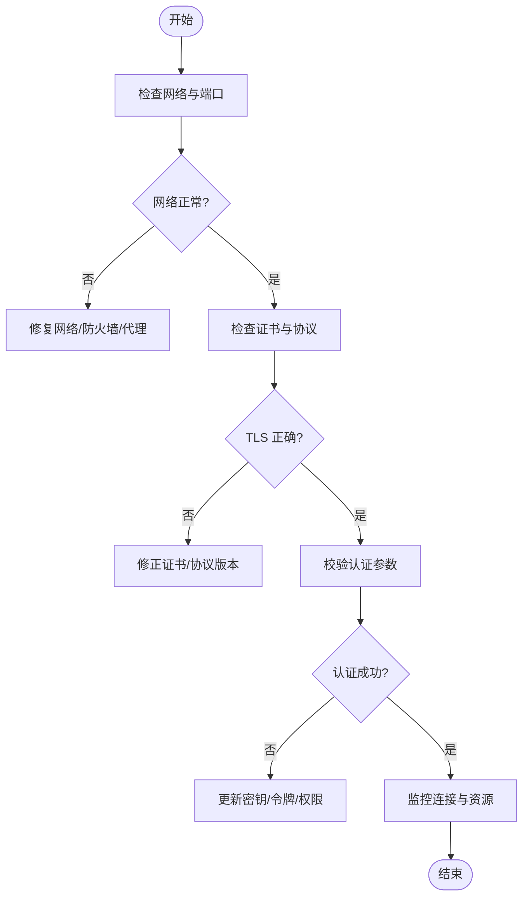
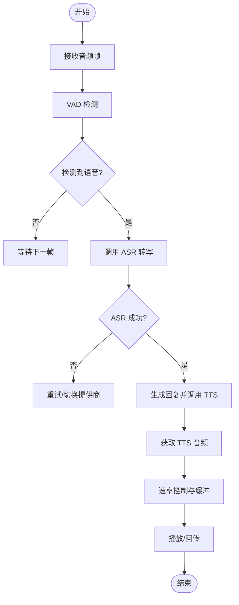
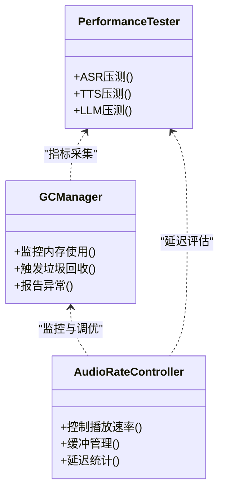
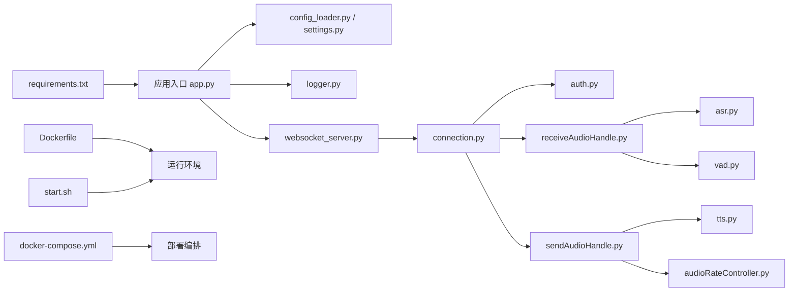

# 常见问题解决

<cite>
**本文引用的文件**   
- [app.py](file://main/xiaozhi-server/app.py)
- [websocket_server.py](file://main/xiaozhi-server/core/websocket_server.py)
- [connection.py](file://main/xiaozhi-server/core/connection.py)
- [auth.py](file://main/xiaozhi-server/core/auth.py)
- [receiveAudioHandle.py](file://main/xiaozhi-server/core/handle/receiveAudioHandle.py)
- [sendAudioHandle.py](file://main/xiaozhi-server/core/handle/sendAudioHandle.py)
- [vad.py](file://main/xiaozhi-server/core/utils/vad.py)
- [asr.py](file://main/xiaozhi-server/core/utils/asr.py)
- [tts.py](file://main/xiaozhi-server/core/utils/tts.py)
- [audioRateController.py](file://main/xiaozhi-server/core/utils/audioRateController.py)
- [gc_manager.py](file://main/xiaozhi-server/core/utils/gc_manager.py)
- [performance_tester_asr.py](file://main/xiaozhi-server/performance_tester/performance_tester_asr.py)
- [performance_tester_tts.py](file://main/xiaozhi-server/performance_tester/performance_tester_tts.py)
- [performance_tester_vllm.py](file://main/xiaozhi-server/performance_tester/performance_tester_vllm.py)
- [config_loader.py](file://main/xiaozhi-server/config/config_loader.py)
- [settings.py](file://main/xiaozhi-server/config/settings.py)
- [logger.py](file://main/xiaozhi-server/config/logger.py)
- [Dockerfile](file://main/xiaozhi-server/Dockerfile)
- [docker-compose.yml](file://main/xiaozhi-server/docker-compose.yml)
- [start.sh](file://main/xiaozhi-server/start.sh)
- [requirements.txt](file://main/xiaozhi-server/requirements.txt)
</cite>

## 目录
1. [简介](#简介)
2. [项目结构](#项目结构)
3. [核心组件](#核心组件)
4. [架构总览](#架构总览)
5. [详细组件分析](#详细组件分析)
6. [依赖关系分析](#依赖关系分析)
7. [性能注意事项](#性能注意事项)
8. [故障排查指南](#故障排查指南)
9. [结论](#结论)
10. [附录](#附录)

## 简介
本文件面向 xiaozhi-esp32-server 的开发者与运维人员，聚焦三类典型问题：设备连接问题（无法连接、连接中断、认证失败）、语音处理问题（ASR识别失败、TTS输出异常、VAD检测问题）、系统性能问题（内存溢出、CPU占用过高、响应延迟）。每个问题提供问题描述、可能原因、解决步骤与预防措施，并附带错误代码对照表与快速诊断方法，帮助快速定位与修复。

## 项目结构
xiaozhi-esp32-server 的核心服务位于 main/xiaozhi-server 目录，包含：
- 应用入口与启动脚本
- WebSocket 服务器与连接管理
- 音频接收/发送处理
- ASR/TTS/VAD 工具与提供者
- 配置加载与日志
- 性能测试工具

图表来源
- [app.py](file://main/xiaozhi-server/app.py)
- [websocket_server.py](file://main/xiaozhi-server/core/websocket_server.py)
- [connection.py](file://main/xiaozhi-server/core/connection.py)
- [auth.py](file://main/xiaozhi-server/core/auth.py)
- [receiveAudioHandle.py](file://main/xiaozhi-server/core/handle/receiveAudioHandle.py)
- [sendAudioHandle.py](file://main/xiaozhi-server/core/handle/sendAudioHandle.py)
- [asr.py](file://main/xiaozhi-server/core/utils/asr.py)
- [tts.py](file://main/xiaozhi-server/core/utils/tts.py)
- [vad.py](file://main/xiaozhi-server/core/utils/vad.py)
- [audioRateController.py](file://main/xiaozhi-server/core/utils/audioRateController.py)
- [config_loader.py](file://main/xiaozhi-server/config/config_loader.py)
- [settings.py](file://main/xiaozhi-server/config/settings.py)
- [logger.py](file://main/xiaozhi-server/config/logger.py)
- [gc_manager.py](file://main/xiaozhi-server/core/utils/gc_manager.py)

章节来源
- [app.py](file://main/xiaozhi-server/app.py)
- [websocket_server.py](file://main/xiaozhi-server/core/websocket_server.py)
- [connection.py](file://main/xiaozhi-server/core/connection.py)
- [config_loader.py](file://main/xiaozhi-server/config/config_loader.py)
- [settings.py](file://main/xiaozhi-server/config/settings.py)
- [logger.py](file://main/xiaozhi-server/config/logger.py)

## 核心组件
- 应用入口与生命周期：负责初始化配置、日志、模块与启动网络服务。
- WebSocket 服务器：监听端口、接受设备连接、路由消息到处理器。
- 连接管理：维护会话状态、心跳、重连策略、资源清理。
- 认证模块：校验设备身份、令牌或密钥，决定连接是否允许。
- 音频处理管线：接收音频流、VAD 检测、ASR 转写、TTS 合成、播放控制。
- 配置与日志：集中化配置加载、运行时设置、结构化日志输出。
- 性能与稳定性：GC 管理、速率控制、性能测试工具。

章节来源
- [app.py](file://main/xiaozhi-server/app.py)
- [websocket_server.py](file://main/xiaozhi-server/core/websocket_server.py)
- [connection.py](file://main/xiaozhi-server/core/connection.py)
- [auth.py](file://main/xiaozhi-server/core/auth.py)
- [receiveAudioHandle.py](file://main/xiaozhi-server/core/handle/receiveAudioHandle.py)
- [sendAudioHandle.py](file://main/xiaozhi-server/core/handle/sendAudioHandle.py)
- [asr.py](file://main/xiaozhi-server/core/utils/asr.py)
- [tts.py](file://main/xiaozhi-server/core/utils/tts.py)
- [vad.py](file://main/xiaozhi-server/core/utils/vad.py)
- [audioRateController.py](file://main/xiaozhi-server/core/utils/audioRateController.py)
- [config_loader.py](file://main/xiaozhi-server/config/config_loader.py)
- [settings.py](file://main/xiaozhi-server/config/settings.py)
- [logger.py](file://main/xiaozhi-server/config/logger.py)
- [gc_manager.py](file://main/xiaozhi-server/core/utils/gc_manager.py)

## 架构总览
下图展示从设备连接到语音处理的端到端流程，以及关键组件之间的交互。

图表来源
- [websocket_server.py](file://main/xiaozhi-server/core/websocket_server.py)
- [connection.py](file://main/xiaozhi-server/core/connection.py)
- [auth.py](file://main/xiaozhi-server/core/auth.py)
- [receiveAudioHandle.py](file://main/xiaozhi-server/core/handle/receiveAudioHandle.py)
- [sendAudioHandle.py](file://main/xiaozhi-server/core/handle/sendAudioHandle.py)
- [vad.py](file://main/xiaozhi-server/core/utils/vad.py)
- [asr.py](file://main/xiaozhi-server/core/utils/asr.py)
- [tts.py](file://main/xiaozhi-server/core/utils/tts.py)
- [audioRateController.py](file://main/xiaozhi-server/core/utils/audioRateController.py)

## 详细组件分析

### 设备连接问题（无法连接、连接中断、认证失败）
- 问题描述
  - 设备无法建立 WebSocket 连接
  - 连接中途断开或频繁重连
  - 认证失败导致连接被拒绝
- 可能原因
  - 网络不通或端口未开放（防火墙/NAT/代理）
  - 证书或 TLS 配置错误（如使用 HTTPS/WSS）
  - 认证参数不正确（设备密钥、令牌过期、权限不足）
  - 服务端负载过高导致握手超时
  - 心跳/保活配置不当导致误断
- 解决步骤
  - 检查网络连通性与端口可达性；确认反向代理与证书链正确
  - 核对认证配置与设备侧参数一致；查看认证日志
  - 调整连接超时与重试策略；观察连接恢复行为
  - 监控服务端资源与队列长度，避免拥塞
- 预防措施
  - 统一配置管理与灰度发布
  - 完善健康检查与告警阈值
  - 启用连接池与限流保护

图表来源
- [websocket_server.py](file://main/xiaozhi-server/core/websocket_server.py)
- [connection.py](file://main/xiaozhi-server/core/connection.py)
- [auth.py](file://main/xiaozhi-server/core/auth.py)
- [logger.py](file://main/xiaozhi-server/config/logger.py)

章节来源
- [websocket_server.py](file://main/xiaozhi-server/core/websocket_server.py)
- [connection.py](file://main/xiaozhi-server/core/connection.py)
- [auth.py](file://main/xiaozhi-server/core/auth.py)
- [logger.py](file://main/xiaozhi-server/config/logger.py)

### 语音处理问题（ASR识别失败、TTS输出异常、VAD检测问题）
- 问题描述
  - ASR 无法识别或识别结果不准确
  - TTS 输出无声、卡顿、音质差或语速异常
  - VAD 误判静音/语音，导致对话节奏异常
- 可能原因
  - 输入音频格式/采样率不匹配
  - ASR 模型或服务不可用、超时或配额限制
  - TTS 引擎配置错误、并发过高或缓存失效
  - VAD 阈值设置不当或环境噪声过大
  - 音频编码/解码链路异常（如 Opus）
- 解决步骤
  - 校验音频帧大小、采样率与编码格式；确保与 ASR/TTS 要求一致
  - 检查 ASR/TTS 服务健康状态与日志；必要时降级或切换提供商
  - 调整 VAD 阈值与窗口长度；降低背景噪声或增加降噪
  - 优化音频速率控制与缓冲策略，减少卡顿
- 预防措施
  - 建立音频质量自检与自动校准
  - 多提供商冗余与自动切换
  - 定期压测与回归测试

图表来源
- [receiveAudioHandle.py](file://main/xiaozhi-server/core/handle/receiveAudioHandle.py)
- [sendAudioHandle.py](file://main/xiaozhi-server/core/handle/sendAudioHandle.py)
- [vad.py](file://main/xiaozhi-server/core/utils/vad.py)
- [asr.py](file://main/xiaozhi-server/core/utils/asr.py)
- [tts.py](file://main/xiaozhi-server/core/utils/tts.py)
- [audioRateController.py](file://main/xiaozhi-server/core/utils/audioRateController.py)

章节来源
- [receiveAudioHandle.py](file://main/xiaozhi-server/core/handle/receiveAudioHandle.py)
- [sendAudioHandle.py](file://main/xiaozhi-server/core/handle/sendAudioHandle.py)
- [vad.py](file://main/xiaozhi-server/core/utils/vad.py)
- [asr.py](file://main/xiaozhi-server/core/utils/asr.py)
- [tts.py](file://main/xiaozhi-server/core/utils/tts.py)
- [audioRateController.py](file://main/xiaozhi-server/core/utils/audioRateController.py)

### 系统性能问题（内存溢出、CPU占用过高、响应延迟）
- 问题描述
  - 进程内存持续增长直至 OOM
  - CPU 占用持续高位，影响吞吐
  - 端到端响应延迟升高，用户体验下降
- 可能原因
  - 大对象未及时释放、循环引用导致 GC 压力
  - 音频编解码与模型推理线程过多或阻塞
  - 外部服务超时或慢查询拖慢整体链路
  - 配置不合理（缓冲区过大、并发过高）
- 解决步骤
  - 启用 GC 监控与堆快照分析；定位泄漏点
  - 调整线程池与队列大小；引入背压与限流
  - 优化音频处理流水线，减少拷贝与序列化
  - 对热点路径进行性能测试与基准对比
- 预防措施
  - 容器资源限制与健康检查
  - 自动化压测与性能回归
  - 分级降级与熔断策略

图表来源
- [gc_manager.py](file://main/xiaozhi-server/core/utils/gc_manager.py)
- [audioRateController.py](file://main/xiaozhi-server/core/utils/audioRateController.py)
- [performance_tester_asr.py](file://main/xiaozhi-server/performance_tester/performance_tester_asr.py)
- [performance_tester_tts.py](file://main/xiaozhi-server/performance_tester/performance_tester_tts.py)
- [performance_tester_vllm.py](file://main/xiaozhi-server/performance_tester/performance_tester_vllm.py)

章节来源
- [gc_manager.py](file://main/xiaozhi-server/core/utils/gc_manager.py)
- [audioRateController.py](file://main/xiaozhi-server/core/utils/audioRateController.py)
- [performance_tester_asr.py](file://main/xiaozhi-server/performance_tester/performance_tester_asr.py)
- [performance_tester_tts.py](file://main/xiaozhi-server/performance_tester/performance_tester_tts.py)
- [performance_tester_vllm.py](file://main/xiaozhi-server/performance_tester/performance_tester_vllm.py)

## 依赖关系分析
- 外部依赖
  - Python 包依赖通过 requirements.txt 管理
  - 容器镜像构建与运行由 Dockerfile 定义
  - 编排与部署通过 docker-compose.yml 管理
  - 启动脚本 start.sh 封装环境变量与服务启动
- 内部模块依赖
  - 应用入口依赖配置加载与日志模块
  - WebSocket 服务器依赖连接管理与认证
  - 音频处理依赖 ASR/TTS/VAD 工具与速率控制
  - 性能测试工具依赖各子系统接口

图表来源
- [requirements.txt](file://main/xiaozhi-server/requirements.txt)
- [Dockerfile](file://main/xiaozhi-server/Dockerfile)
- [docker-compose.yml](file://main/xiaozhi-server/docker-compose.yml)
- [start.sh](file://main/xiaozhi-server/start.sh)
- [app.py](file://main/xiaozhi-server/app.py)
- [config_loader.py](file://main/xiaozhi-server/config/config_loader.py)
- [settings.py](file://main/xiaozhi-server/config/settings.py)
- [logger.py](file://main/xiaozhi-server/config/logger.py)
- [websocket_server.py](file://main/xiaozhi-server/core/websocket_server.py)
- [connection.py](file://main/xiaozhi-server/core/connection.py)
- [auth.py](file://main/xiaozhi-server/core/auth.py)
- [receiveAudioHandle.py](file://main/xiaozhi-server/core/handle/receiveAudioHandle.py)
- [sendAudioHandle.py](file://main/xiaozhi-server/core/handle/sendAudioHandle.py)
- [asr.py](file://main/xiaozhi-server/core/utils/asr.py)
- [tts.py](file://main/xiaozhi-server/core/utils/tts.py)
- [vad.py](file://main/xiaozhi-server/core/utils/vad.py)
- [audioRateController.py](file://main/xiaozhi-server/core/utils/audioRateController.py)

章节来源
- [requirements.txt](file://main/xiaozhi-server/requirements.txt)
- [Dockerfile](file://main/xiaozhi-server/Dockerfile)
- [docker-compose.yml](file://main/xiaozhi-server/docker-compose.yml)
- [start.sh](file://main/xiaozhi-server/start.sh)
- [app.py](file://main/xiaozhi-server/app.py)

## 性能注意事项
- 内存管理
  - 合理设置缓冲区大小，避免一次性加载大音频块
  - 及时释放临时对象，避免循环引用
  - 使用 GC 监控与堆分析定位泄漏
- CPU 优化
  - 控制并发与线程池规模，避免上下文切换开销
  - 将耗时任务异步化，减少阻塞
  - 对热点路径进行基准测试与优化
- 延迟控制
  - 优化音频编码/解码与传输链路
  - 引入自适应缓冲与速率控制
  - 外部服务调用增加超时与重试策略

[本节为通用指导，不直接分析具体文件]

## 故障排查指南
- 快速诊断方法
  - 检查服务健康与端口可达性
  - 查看日志中认证、连接、音频处理相关错误
  - 使用性能测试工具对 ASR/TTS/LLM 进行压测
  - 监控内存、CPU、延迟等关键指标
- 常见错误代码与含义（示例）
  - 认证失败：检查设备密钥、令牌有效期与权限
  - 连接超时：检查网络、代理、TLS 证书与服务负载
  - ASR 超时/失败：检查模型可用性、输入格式与网络
  - TTS 失败/无声：检查引擎状态、并发与音频参数
  - VAD 误判：调整阈值与环境噪声
- 建议的排查顺序
  - 网络与认证 → 音频输入质量 → ASR/TTS 服务状态 → 速率控制与缓冲 → 资源与 GC

章节来源
- [logger.py](file://main/xiaozhi-server/config/logger.py)
- [performance_tester_asr.py](file://main/xiaozhi-server/performance_tester/performance_tester_asr.py)
- [performance_tester_tts.py](file://main/xiaozhi-server/performance_tester/performance_tester_tts.py)
- [performance_tester_vllm.py](file://main/xiaozhi-server/performance_tester/performance_tester_vllm.py)

## 结论
通过系统化梳理设备连接、语音处理与系统性能三大类问题，结合架构图、流程图与依赖图，可快速定位根因并采取针对性措施。建议在开发与运维过程中强化配置管理、健康检查、压测与监控，以降低故障概率并提升用户体验。

[本节为总结性内容，不直接分析具体文件]

## 附录
- 部署与启动
  - 使用 docker-compose.yml 编排服务，配合 start.sh 启动
  - 通过 Dockerfile 构建镜像，确保依赖与运行时环境一致
- 配置与日志
  - 使用 config_loader.py 与 settings.py 集中管理配置
  - 通过 logger.py 输出结构化日志，便于追踪问题
- 性能测试
  - 使用 performance_tester_* 系列脚本对 ASR/TTS/LLM 进行压测与回归

章节来源
- [docker-compose.yml](file://main/xiaozhi-server/docker-compose.yml)
- [start.sh](file://main/xiaozhi-server/start.sh)
- [Dockerfile](file://main/xiaozhi-server/Dockerfile)
- [config_loader.py](file://main/xiaozhi-server/config/config_loader.py)
- [settings.py](file://main/xiaozhi-server/config/settings.py)
- [logger.py](file://main/xiaozhi-server/config/logger.py)
- [performance_tester_asr.py](file://main/xiaozhi-server/performance_tester/performance_tester_asr.py)
- [performance_tester_tts.py](file://main/xiaozhi-server/performance_tester/performance_tester_tts.py)
- [performance_tester_vllm.py](file://main/xiaozhi-server/performance_tester/performance_tester_vllm.py)