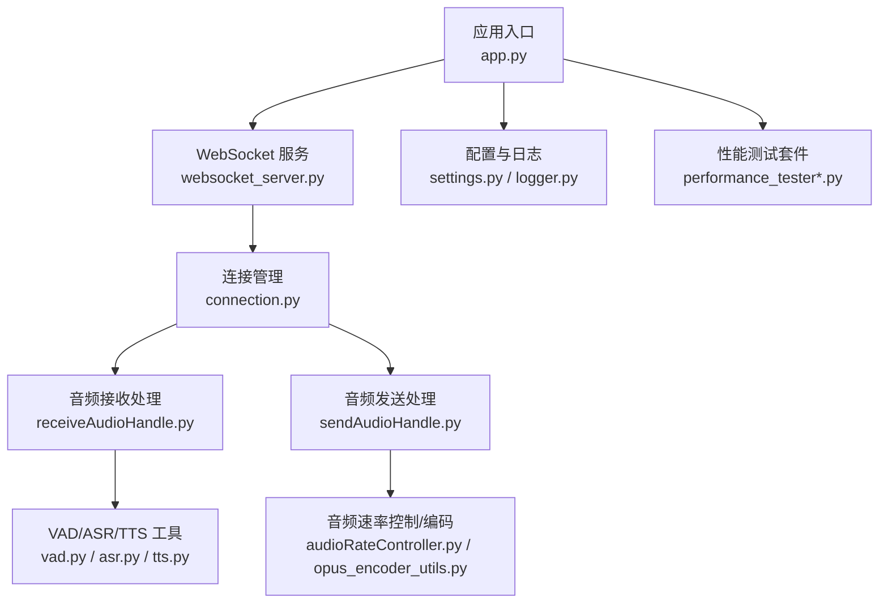
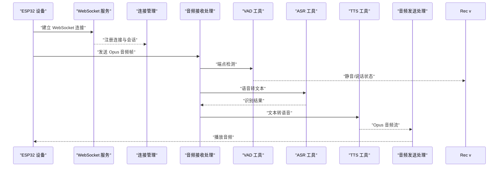
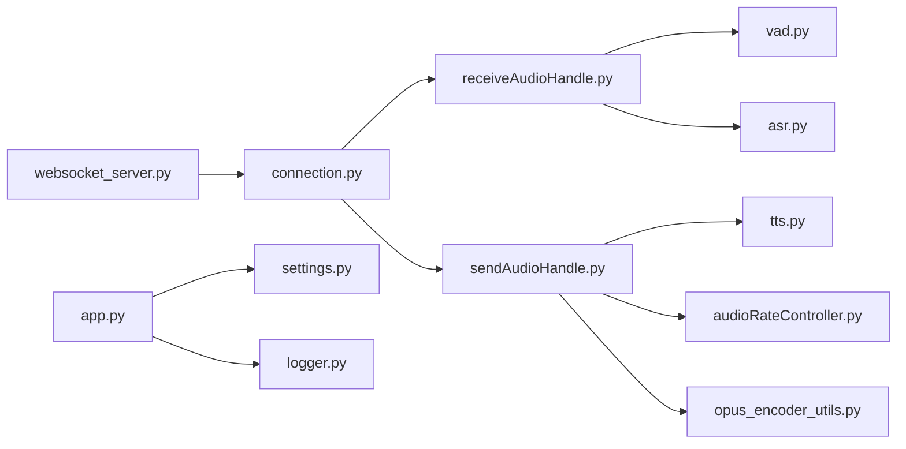

# 故障排查

<cite>
**本文引用的文件**   
- [app.py](file://main/xiaozhi-server/app.py)
- [logger.py](file://main/xiaozhi-server/config/logger.py)
- [settings.py](file://main/xiaozhi-server/config/settings.py)
- [websocket_server.py](file://main/xiaozhi-server/core/websocket_server.py)
- [connection.py](file://main/xiaozhi-server/core/connection.py)
- [receiveAudioHandle.py](file://main/xiaozhi-server/core/handle/receiveAudioHandle.py)
- [sendAudioHandle.py](file://main/xiaozhi-server/core/handle/sendAudioHandle.py)
- [audioRateController.py](file://main/xiaozhi-server/core/utils/audioRateController.py)
- [opus_encoder_utils.py](file://main/xiaozhi-server/core/utils/opus_encoder_utils.py)
- [tts.py](file://main/xiaozhi-server/core/utils/tts.py)
- [asr.py](file://main/xiaozhi-server/core/utils/asr.py)
- [vad.py](file://main/xiaozhi-server/core/utils/vad.py)
- [gc_manager.py](file://main/xiaozhi-server/core/utils/gc_manager.py)
- [performance_tester.py](file://main/xiaozhi-server/performance_tester.py)
- [performance_tester_asr.py](file://main/xiaozhi-server/performance_tester/performance_tester_asr.py)
- [performance_tester_tts.py](file://main/xiaozhi-server/performance_tester/performance_tester_tts.py)
- [performance_tester_stream_asr.py](file://main/xiaozhi-server/performance_tester/performance_tester_stream_asr.py)
- [performance_tester_stream_tts.py](file://main/xiaozhi-server/performance_tester/performance_tester_stream_tts.py)
- [performance_tester_llm.py](file://main/xiaozhi-server/performance_tester/performance_tester_llm.py)
- [performance_tester_vllm.py](file://main/xiaozhi-server/performance_tester/performance_tester_vllm.py)
- [docker-compose.yml](file://main/xiaozhi-server/docker-compose.yml)
- [start.sh](file://main/xiaozhi-server/start.sh)
- [Dockerfile](file://main/xiaozhi-server/Dockerfile)
</cite>

## 目录
1. [简介](#简介)
2. [项目结构](#项目结构)
3. [核心组件](#核心组件)
4. [架构总览](#架构总览)
5. [详细组件分析](#详细组件分析)
6. [依赖关系分析](#依赖关系分析)
7. [性能考量](#性能考量)
8. [故障排查指南](#故障排查指南)
9. [结论](#结论)
10. [附录](#附录)

## 简介
本指南面向 xiaozhi-esp32-server 的运维与开发者，聚焦连接问题、语音质量、性能瓶颈、内存溢出等典型故障场景。文档提供：
- 日志级别配置与关键标识解读
- 网络抓包、性能分析与内存分析工具使用
- 常见问题的诊断步骤与命令
- 预防性措施与性能调优建议

## 项目结构
xiaozhi-esp32-server 的核心位于 main/xiaozhi-server 目录，包含服务启动、WebSocket 接入、音频处理（ASR/VAD/TTS）、性能测试与容器化脚本等。关键路径：
- 应用入口与启动脚本：app.py, start.sh, Dockerfile
- 配置与日志：config/settings.py, config/logger.py
- WebSocket 与服务管理：core/websocket_server.py, core/connection.py
- 音频处理链路：core/utils/{asr,vad,tts,audioRateController,opus_encoder_utils}.py
- 性能测试：performance_tester*.py

图表来源
- [app.py](file://main/xiaozhi-server/app.py)
- [websocket_server.py](file://main/xiaozhi-server/core/websocket_server.py)
- [connection.py](file://main/xiaozhi-server/core/connection.py)
- [receiveAudioHandle.py](file://main/xiaozhi-server/core/handle/receiveAudioHandle.py)
- [sendAudioHandle.py](file://main/xiaozhi-server/core/handle/sendAudioHandle.py)
- [asr.py](file://main/xiaozhi-server/core/utils/asr.py)
- [vad.py](file://main/xiaozhi-server/core/utils/vad.py)
- [tts.py](file://main/xiaozhi-server/core/utils/tts.py)
- [audioRateController.py](file://main/xiaozhi-server/core/utils/audioRateController.py)
- [opus_encoder_utils.py](file://main/xiaozhi-server/core/utils/opus_encoder_utils.py)
- [settings.py](file://main/xiaozhi-server/config/settings.py)
- [logger.py](file://main/xiaozhi-server/config/logger.py)

章节来源
- [app.py](file://main/xiaozhi-server/app.py)
- [start.sh](file://main/xiaozhi-server/start.sh)
- [Dockerfile](file://main/xiaozhi-server/Dockerfile)
- [docker-compose.yml](file://main/xiaozhi-server/docker-compose.yml)

## 核心组件
- 应用入口与生命周期：负责加载配置、初始化日志、启动 WebSocket 服务与后台任务。
- WebSocket 服务与连接：维护设备连接、消息路由、心跳与超时控制。
- 音频处理链路：VAD 检测说话端点，ASR 将语音转文本，TTS 将文本转语音并编码为 Opus 流式输出。
- 音频速率控制与编码：保障端到端延迟与音质平衡，避免卡顿与爆音。
- 配置与日志：集中管理运行参数与日志级别，便于定位问题。
- 性能测试：覆盖 ASR/TTS/LLM 等模块的吞吐与时延评估。

章节来源
- [websocket_server.py](file://main/xiaozhi-server/core/websocket_server.py)
- [connection.py](file://main/xiaozhi-server/core/connection.py)
- [receiveAudioHandle.py](file://main/xiaozhi-server/core/handle/receiveAudioHandle.py)
- [sendAudioHandle.py](file://main/xiaozhi-server/core/handle/sendAudioHandle.py)
- [asr.py](file://main/xiaozhi-server/core/utils/asr.py)
- [vad.py](file://main/xiaozhi-server/core/utils/vad.py)
- [tts.py](file://main/xiaozhi-server/core/utils/tts.py)
- [audioRateController.py](file://main/xiaozhi-server/core/utils/audioRateController.py)
- [opus_encoder_utils.py](file://main/xiaozhi-server/core/utils/opus_encoder_utils.py)
- [settings.py](file://main/xiaozhi-server/config/settings.py)
- [logger.py](file://main/xiaozhi-server/config/logger.py)

## 架构总览
下图展示从设备连接到语音交互的关键流程，包括连接建立、音频上行、VAD/ASR、TTS 生成与下行播放。

图表来源
- [websocket_server.py](file://main/xiaozhi-server/core/websocket_server.py)
- [connection.py](file://main/xiaozhi-server/core/connection.py)
- [receiveAudioHandle.py](file://main/xiaozhi-server/core/handle/receiveAudioHandle.py)
- [sendAudioHandle.py](file://main/xiaozhi-server/core/handle/sendAudioHandle.py)
- [vad.py](file://main/xiaozhi-server/core/utils/vad.py)
- [asr.py](file://main/xiaozhi-server/core/utils/asr.py)
- [tts.py](file://main/xiaozhi-server/core/utils/tts.py)

## 详细组件分析

### 日志系统与配置
- 日志级别与输出：通过配置模块设置全局日志级别，支持控制台与文件输出；关键错误堆栈会记录调用链以便定位。
- 关键标识：在连接建立、音频帧收发、VAD/ASR/TTS 阶段打印统一前缀与会话 ID，便于按会话过滤。
- 调试建议：将日志级别调整为 DEBUG 以捕获详细链路信息；生产环境建议 INFO 或 WARNING 以减少 IO 开销。

章节来源
- [logger.py](file://main/xiaozhi-server/config/logger.py)
- [settings.py](file://main/xiaozhi-server/config/settings.py)

### WebSocket 服务与连接管理
- 连接生命周期：握手、鉴权、心跳保活、异常断开与重连策略。
- 资源清理：连接关闭时释放音频缓冲、编码器实例与线程池资源，防止内存泄漏。
- 并发模型：每个连接独立处理音频流，避免阻塞其他会话。

章节来源
- [websocket_server.py](file://main/xiaozhi-server/core/websocket_server.py)
- [connection.py](file://main/xiaozhi-server/core/connection.py)

### 音频接收与发送处理
- 接收路径：解析 Opus 帧、VAD 判断、触发 ASR 识别、缓存与去抖。
- 发送路径：TTS 生成音频流、速率控制、编码与分片下发，确保低延迟与稳定播放。
- 常见问题：丢帧、乱序、缓冲区溢出、编码失败。

章节来源
- [receiveAudioHandle.py](file://main/xiaozhi-server/core/handle/receiveAudioHandle.py)
- [sendAudioHandle.py](file://main/xiaozhi-server/core/handle/sendAudioHandle.py)

### 音频工具链（VAD/ASR/TTS）
- VAD：静音检测阈值与窗口大小影响断句准确性。
- ASR：模型选择、采样率匹配、网络超时与重试策略。
- TTS：音色与语速配置、流式合成与缓冲策略。

章节来源
- [vad.py](file://main/xiaozhi-server/core/utils/vad.py)
- [asr.py](file://main/xiaozhi-server/core/utils/asr.py)
- [tts.py](file://main/xiaozhi-server/core/utils/tts.py)

### 音频速率控制与编码
- 速率控制：根据网络抖动动态调整播放速率，减少卡顿。
- 编码：Opus 编码参数（码率、帧长）影响音质与带宽占用。

章节来源
- [audioRateController.py](file://main/xiaozhi-server/core/utils/audioRateController.py)
- [opus_encoder_utils.py](file://main/xiaozhi-server/core/utils/opus_encoder_utils.py)

### 垃圾回收与内存管理
- GC 管理器：监控对象创建与销毁，提示潜在内存增长点。
- 建议：合理设置 GC 阈值，避免频繁回收导致抖动。

章节来源
- [gc_manager.py](file://main/xiaozhi-server/core/utils/gc_manager.py)

### 性能测试套件
- 覆盖模块：ASR、TTS、LLM、vLLM 等，提供吞吐、时延与稳定性指标。
- 使用方式：通过命令行执行对应测试脚本，观察输出与日志。

章节来源
- [performance_tester.py](file://main/xiaozhi-server/performance_tester.py)
- [performance_tester_asr.py](file://main/xiaozhi-server/performance_tester/performance_tester_asr.py)
- [performance_tester_tts.py](file://main/xiaozhi-server/performance_tester/performance_tester_tts.py)
- [performance_tester_stream_asr.py](file://main/xiaozhi-server/performance_tester/performance_tester_stream_asr.py)
- [performance_tester_stream_tts.py](file://main/xiaozhi-server/performance_tester/performance_tester_stream_tts.py)
- [performance_tester_llm.py](file://main/xiaozhi-server/performance_tester/performance_tester_llm.py)
- [performance_tester_vllm.py](file://main/xiaozhi-server/performance_tester/performance_tester_vllm.py)

## 依赖关系分析
- 模块耦合：WebSocket 服务依赖连接管理与音频处理模块；音频处理模块依赖 VAD/ASR/TTS 工具；所有模块共享配置与日志。
- 外部依赖：网络通信（WebSocket）、音频编解码（Opus）、第三方 ASR/TTS 服务。
- 潜在循环依赖：应避免在音频处理中直接反向依赖 WebSocket 层，采用事件回调与队列解耦。

图表来源
- [websocket_server.py](file://main/xiaozhi-server/core/websocket_server.py)
- [connection.py](file://main/xiaozhi-server/core/connection.py)
- [receiveAudioHandle.py](file://main/xiaozhi-server/core/handle/receiveAudioHandle.py)
- [sendAudioHandle.py](file://main/xiaozhi-server/core/handle/sendAudioHandle.py)
- [vad.py](file://main/xiaozhi-server/core/utils/vad.py)
- [asr.py](file://main/xiaozhi-server/core/utils/asr.py)
- [tts.py](file://main/xiaozhi-server/core/utils/tts.py)
- [audioRateController.py](file://main/xiaozhi-server/core/utils/audioRateController.py)
- [opus_encoder_utils.py](file://main/xiaozhi-server/core/utils/opus_encoder_utils.py)
- [app.py](file://main/xiaozhi-server/app.py)
- [settings.py](file://main/xiaozhi-server/config/settings.py)
- [logger.py](file://main/xiaozhi-server/config/logger.py)

## 性能考量
- 网络与延迟：优化 WebSocket 帧大小与频率，降低首包时延。
- CPU 与编码：选择合适的 Opus 码率与帧长，避免高负载下 CPU 飙升。
- 内存与缓冲：限制音频缓冲上限，及时释放临时对象，避免内存泄漏。
- 并发与线程：合理设置线程池大小，避免过多上下文切换。

[本节为通用指导，不直接分析具体文件]

## 故障排查指南

### 连接问题
- 症状：设备无法建立 WebSocket 连接、频繁断开、握手失败。
- 可能原因：端口未开放、证书/域名配置错误、鉴权失败、服务器过载。
- 排查步骤：
  - 检查服务是否监听预期端口与协议（ws/wss）。
  - 查看连接日志中的握手与鉴权阶段错误。
  - 验证防火墙与安全组规则。
  - 使用网络抓包确认 TCP 三次握手与 TLS 握手是否成功。
- 常用命令与工具：
  - 查看服务进程与端口占用。
  - 使用 curl 或浏览器测试 WebSocket 连通性。
  - 使用 tcpdump/Wireshark 抓取 ws/wss 流量。
- 预防措施：
  - 启用健康检查与自动重启。
  - 配置合理的连接超时与重试策略。

章节来源
- [websocket_server.py](file://main/xiaozhi-server/core/websocket_server.py)
- [connection.py](file://main/xiaozhi-server/core/connection.py)
- [settings.py](file://main/xiaozhi-server/config/settings.py)
- [logger.py](file://main/xiaozhi-server/config/logger.py)

### 语音质量问题
- 症状：声音断续、杂音、延迟大、音量异常。
- 可能原因：网络抖动、Opus 编码参数不当、VAD 阈值过高/过低、TTS 合成不稳定。
- 排查步骤：
  - 检查网络丢包与抖动（抓包统计）。
  - 调整 Opus 码率与帧长，观察音质变化。
  - 调节 VAD 阈值与窗口大小，改善断句。
  - 检查 TTS 流式合成的缓冲策略。
- 常用命令与工具：
  - 使用性能测试脚本评估 ASR/TTS 吞吐与时延。
  - 使用音频播放器回放录制片段，定位编码问题。
- 预防措施：
  - 自适应码率与动态缓冲。
  - 定期校准 VAD 与 TTS 参数。

章节来源
- [audioRateController.py](file://main/xiaozhi-server/core/utils/audioRateController.py)
- [opus_encoder_utils.py](file://main/xiaozhi-server/core/utils/opus_encoder_utils.py)
- [vad.py](file://main/xiaozhi-server/core/utils/vad.py)
- [tts.py](file://main/xiaozhi-server/core/utils/tts.py)
- [performance_tester_stream_tts.py](file://main/xiaozhi-server/performance_tester/performance_tester_stream_tts.py)

### 性能问题
- 症状：CPU 占用高、响应慢、吞吐下降。
- 可能原因：线程池过小、GC 频繁、I/O 阻塞、模型推理耗时。
- 排查步骤：
  - 使用性能测试套件对 ASR/TTS/LLM 进行基准测试。
  - 观察日志中的耗时标记与错误堆栈。
  - 分析系统资源（CPU、内存、磁盘 IO）。
- 常用命令与工具：
  - 执行 performance_tester*.py 获取指标。
  - 使用 top/htop 与 perf 分析热点。
- 预防措施：
  - 水平扩展服务实例。
  - 优化模型加载与缓存策略。

章节来源
- [performance_tester.py](file://main/xiaozhi-server/performance_tester.py)
- [performance_tester_asr.py](file://main/xiaozhi-server/performance_tester/performance_tester_asr.py)
- [performance_tester_tts.py](file://main/xiaozhi-server/performance_tester/performance_tester_tts.py)
- [performance_tester_llm.py](file://main/xiaozhi-server/performance_tester/performance_tester_llm.py)
- [performance_tester_vllm.py](file://main/xiaozhi-server/performance_tester/performance_tester_vllm.py)

### 内存溢出
- 症状：进程被 OOM Killer 终止、内存持续增长。
- 可能原因：音频缓冲未释放、对象引用未清理、GC 阈值不当。
- 排查步骤：
  - 检查连接关闭时的资源释放逻辑。
  - 使用 gc_manager 监控对象生命周期。
  - 调整 GC 阈值与日志级别，定位泄漏点。
- 常用命令与工具：
  - 使用内存分析工具（如 pymemtrace）导出快照。
  - 结合日志筛选特定会话的内存增长。
- 预防措施：
  - 引入对象池与限流机制。
  - 定期重启与灰度发布。

章节来源
- [gc_manager.py](file://main/xiaozhi-server/core/utils/gc_manager.py)
- [connection.py](file://main/xiaozhi-server/core/connection.py)
- [logger.py](file://main/xiaozhi-server/config/logger.py)

### 典型故障场景诊断步骤

#### 设备无法连接
- 步骤：
  - 确认服务端口与协议配置正确。
  - 检查鉴权与证书配置。
  - 抓包分析握手过程。
  - 查看连接日志中的错误码与堆栈。
- 参考文件：
  - [websocket_server.py](file://main/xiaozhi-server/core/websocket_server.py)
  - [connection.py](file://main/xiaozhi-server/core/connection.py)
  - [settings.py](file://main/xiaozhi-server/config/settings.py)
  - [logger.py](file://main/xiaozhi-server/config/logger.py)

#### 语音识别失败
- 步骤：
  - 检查 VAD 阈值与音频输入质量。
  - 验证 ASR 模型与采样率匹配。
  - 查看 ASR 调用日志与超时重试。
- 参考文件：
  - [vad.py](file://main/xiaozhi-server/core/utils/vad.py)
  - [asr.py](file://main/xiaozhi-server/core/utils/asr.py)
  - [receiveAudioHandle.py](file://main/xiaozhi-server/core/handle/receiveAudioHandle.py)

#### TTS 输出异常
- 步骤：
  - 检查 TTS 配置与音色参数。
  - 验证流式合成缓冲与编码参数。
  - 观察 TTS 日志与错误堆栈。
- 参考文件：
  - [tts.py](file://main/xiaozhi-server/core/utils/tts.py)
  - [sendAudioHandle.py](file://main/xiaozhi-server/core/handle/sendAudioHandle.py)
  - [opus_encoder_utils.py](file://main/xiaozhi-server/core/utils/opus_encoder_utils.py)

### 日志分析方法
- 日志级别配置：
  - 开发环境使用 DEBUG，生产环境使用 INFO 或 WARNING。
  - 通过配置模块统一设置，避免硬编码。
- 关键日志标识：
  - 会话 ID、连接状态、音频帧计数、VAD/ASR/TTS 阶段标记。
- 错误堆栈解读：
  - 关注异常类型、调用链与最近一次成功操作。
- 实用技巧：
  - 使用 grep/awk 过滤特定会话与模块。
  - 将日志输出到文件并按天轮转。

章节来源
- [logger.py](file://main/xiaozhi-server/config/logger.py)
- [settings.py](file://main/xiaozhi-server/config/settings.py)

### 调试工具使用
- 网络抓包：
  - 使用 tcpdump/Wireshark 抓取 ws/wss 流量，分析握手与数据帧。
- 性能分析：
  - 使用 performance_tester*.py 评估各模块吞吐与时延。
  - 使用 top/htop 与 perf 定位热点函数。
- 内存分析：
  - 使用 gc_manager 监控对象生命周期。
  - 使用内存快照工具分析泄漏点。

章节来源
- [performance_tester.py](file://main/xiaozhi-server/performance_tester.py)
- [performance_tester_asr.py](file://main/xiaozhi-server/performance_tester/performance_tester_asr.py)
- [performance_tester_tts.py](file://main/xiaozhi-server/performance_tester/performance_tester_tts.py)
- [performance_tester_stream_asr.py](file://main/xiaozhi-server/performance_tester/performance_tester_stream_asr.py)
- [performance_tester_stream_tts.py](file://main/xiaozhi-server/performance_tester/performance_tester_stream_tts.py)
- [performance_tester_llm.py](file://main/xiaozhi-server/performance_tester/performance_tester_llm.py)
- [performance_tester_vllm.py](file://main/xiaozhi-server/performance_tester/performance_tester_vllm.py)
- [gc_manager.py](file://main/xiaozhi-server/core/utils/gc_manager.py)

### 预防性措施与性能调优建议
- 配置优化：
  - 合理设置日志级别与输出目标。
  - 调整 VAD/ASR/TTS 参数以适应不同环境。
- 资源管理：
  - 限制音频缓冲与连接数，避免资源耗尽。
  - 启用对象池与缓存，减少分配开销。
- 监控告警：
  - 建立关键指标监控（CPU、内存、延迟、错误率）。
  - 配置告警阈值与自动恢复策略。
- 部署建议：
  - 使用容器化与编排平台实现弹性伸缩。
  - 定期更新依赖与模型版本，修复已知问题。

章节来源
- [settings.py](file://main/xiaozhi-server/config/settings.py)
- [logger.py](file://main/xiaozhi-server/config/logger.py)
- [docker-compose.yml](file://main/xiaozhi-server/docker-compose.yml)
- [start.sh](file://main/xiaozhi-server/start.sh)
- [Dockerfile](file://main/xiaozhi-server/Dockerfile)

## 结论
通过系统化日志分析、网络抓包、性能与内存工具的使用，可以快速定位并解决 xiaozhi-esp32-server 的连接、语音质量、性能与内存问题。建议在生产环境中建立完善的监控与告警体系，并结合性能测试持续优化系统稳定性与用户体验。

## 附录
- 常用命令示例：
  - 查看服务进程与端口占用。
  - 使用 curl 测试 WebSocket 连通性。
  - 使用 tcpdump/Wireshark 抓取网络流量。
  - 执行 performance_tester*.py 进行基准测试。
- 参考文件：
  - [start.sh](file://main/xiaozhi-server/start.sh)
  - [docker-compose.yml](file://main/xiaozhi-server/docker-compose.yml)
  - [Dockerfile](file://main/xiaozhi-server/Dockerfile)