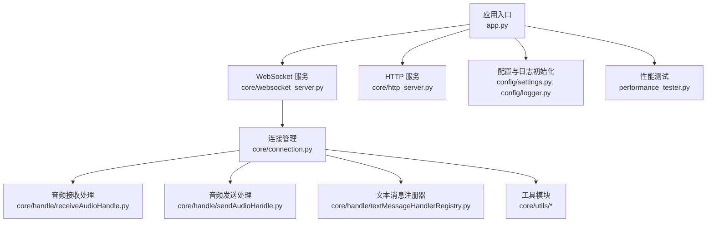
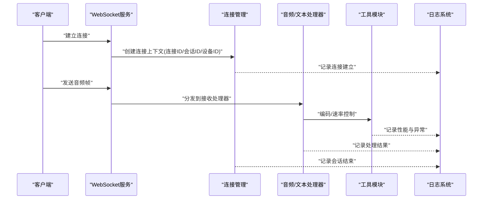
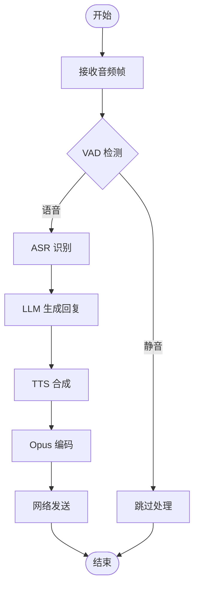
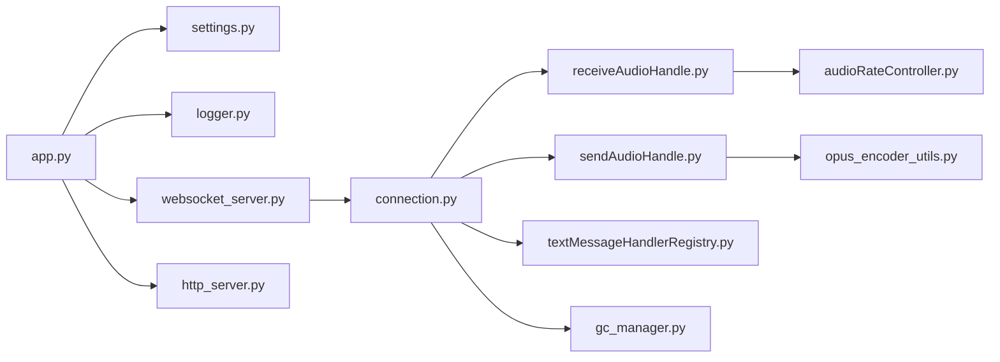

# 日志分析

<cite>
**本文引用的文件**   
- [logger.py](file://main/xiaozhi-server/config/logger.py)
- [settings.py](file://main/xiaozhi-server/config/settings.py)
- [app.py](file://main/xiaozhi-server/app.py)
- [websocket_server.py](file://main/xiaozhi-server/core/websocket_server.py)
- [connection.py](file://main/xiaozhi-server/core/connection.py)
- [http_server.py](file://main/xiaozhi-server/core/http_server.py)
- [receiveAudioHandle.py](file://main/xiaozhi-server/core/handle/receiveAudioHandle.py)
- [sendAudioHandle.py](file://main/xiaozhi-server/core/handle/sendAudioHandle.py)
- [textMessageHandlerRegistry.py](file://main/xiaozhi-server/core/handle/textMessageHandlerRegistry.py)
- [audioRateController.py](file://main/xiaozhi-server/core/utils/audioRateController.py)
- [opus_encoder_utils.py](file://main/xiaozhi-server/core/utils/opus_encoder_utils.py)
- [gc_manager.py](file://main/xiaozhi-server/core/utils/gc_manager.py)
- [performance_tester.py](file://main/xiaozhi-server/performance_tester.py)
</cite>

## 目录
1. [简介](#简介)
2. [项目结构](#项目结构)
3. [核心组件](#核心组件)
4. [架构总览](#架构总览)
5. [详细组件分析](#详细组件分析)
6. [依赖关系分析](#依赖关系分析)
7. [性能考量](#性能考量)
8. [故障排查指南](#故障排查指南)
9. [结论](#结论)
10. [附录](#附录)

## 简介
本指南面向 xiaozhi-esp32-server 的日志系统，目标是帮助开发者与运维人员快速理解日志架构、配置方式、关键标识符含义以及常用分析方法。文档涵盖：
- 日志级别定义与使用场景（DEBUG、INFO、WARN、ERROR）
- 关键日志标识符（连接ID、会话ID、设备ID等）
- 日志文件结构与命名规范
- 常用命令与工具（grep、awk、tail 等）
- 从日志中提取关键信息、识别异常模式与问题定位方法
- 实际日志示例与解读思路

## 项目结构
xiaozhi-esp32-server 的日志相关代码主要位于 main/xiaozhi-server 目录下：
- 配置与初始化：config/logger.py、config/settings.py
- 应用入口：app.py
- 网络服务：core/websocket_server.py、core/http_server.py
- 连接与会话：core/connection.py
- 业务处理：core/handle/*（音频收发、文本消息处理等）
- 工具模块：core/utils/*（音频编码、速率控制、GC管理等）
- 性能测试：performance_tester.py

图表来源
- [app.py](file://main/xiaozhi-server/app.py)
- [websocket_server.py](file://main/xiaozhi-server/core/websocket_server.py)
- [http_server.py](file://main/xiaozhi-server/core/http_server.py)
- [connection.py](file://main/xiaozhi-server/core/connection.py)
- [receiveAudioHandle.py](file://main/xiaozhi-server/core/handle/receiveAudioHandle.py)
- [sendAudioHandle.py](file://main/xiaozhi-server/core/handle/sendAudioHandle.py)
- [textMessageHandlerRegistry.py](file://main/xiaozhi-server/core/handle/textMessageHandlerRegistry.py)
- [settings.py](file://main/xiaozhi-server/config/settings.py)
- [logger.py](file://main/xiaozhi-server/config/logger.py)
- [performance_tester.py](file://main/xiaozhi-server/performance_tester.py)

章节来源
- [app.py](file://main/xiaozhi-server/app.py)
- [settings.py](file://main/xiaozhi-server/config/settings.py)
- [logger.py](file://main/xiaozhi-server/config/logger.py)

## 核心组件
- 日志配置与初始化
  - 通过 settings.py 加载运行参数（如日志级别、输出目标），由 logger.py 统一初始化 Python logging 或第三方日志库。
  - 支持按模块/组件划分日志输出，便于定位问题。
- 应用入口
  - app.py 负责启动服务并调用配置初始化，确保所有子模块使用统一的日志实例。
- 网络服务层
  - websocket_server.py 与 http_server.py 在请求生命周期中记录接入、鉴权、错误等关键事件。
- 连接与会话
  - connection.py 维护连接上下文，注入连接ID、会话ID、设备ID等标识到日志上下文中，保证跨模块追踪。
- 业务处理层
  - receiveAudioHandle.py、sendAudioHandle.py 记录音频流状态、编码/解码耗时、丢包与缓冲情况。
  - textMessageHandlerRegistry.py 记录文本消息路由、意图识别、工具调用等流程。
- 工具模块
  - audioRateController.py、opus_encoder_utils.py、gc_manager.py 等在关键路径上输出性能与异常日志。
- 性能测试
  - performance_tester.py 用于压测与基准测试，输出吞吐、延迟、错误率等指标日志。

章节来源
- [settings.py](file://main/xiaozhi-server/config/settings.py)
- [logger.py](file://main/xiaozhi-server/config/logger.py)
- [app.py](file://main/xiaozhi-server/app.py)
- [websocket_server.py](file://main/xiaozhi-server/core/websocket_server.py)
- [http_server.py](file://main/xiaozhi-server/core/http_server.py)
- [connection.py](file://main/xiaozhi-server/core/connection.py)
- [receiveAudioHandle.py](file://main/xiaozhi-server/core/handle/receiveAudioHandle.py)
- [sendAudioHandle.py](file://main/xiaozhi-server/core/handle/sendAudioHandle.py)
- [textMessageHandlerRegistry.py](file://main/xiaozhi-server/core/handle/textMessageHandlerRegistry.py)
- [audioRateController.py](file://main/xiaozhi-server/core/utils/audioRateController.py)
- [opus_encoder_utils.py](file://main/xiaozhi-server/core/utils/opus_encoder_utils.py)
- [gc_manager.py](file://main/xiaozhi-server/core/utils/gc_manager.py)
- [performance_tester.py](file://main/xiaozhi-server/performance_tester.py)

## 架构总览
日志系统采用“集中配置 + 上下文传播”的架构：
- 集中配置：settings.py 提供全局配置项；logger.py 初始化日志器，设置级别、格式、输出目标。
- 上下文传播：connection.py 将连接ID、会话ID、设备ID等注入到每个请求/处理的日志上下文中，确保跨模块可追踪。
- 分层记录：网络层、连接层、业务处理层、工具层分别记录各自职责范围内的关键事件与异常。

图表来源
- [websocket_server.py](file://main/xiaozhi-server/core/websocket_server.py)
- [connection.py](file://main/xiaozhi-server/core/connection.py)
- [receiveAudioHandle.py](file://main/xiaozhi-server/core/handle/receiveAudioHandle.py)
- [sendAudioHandle.py](file://main/xiaozhi-server/core/handle/sendAudioHandle.py)
- [audioRateController.py](file://main/xiaozhi-server/core/utils/audioRateController.py)
- [opus_encoder_utils.py](file://main/xiaozhi-server/core/utils/opus_encoder_utils.py)
- [logger.py](file://main/xiaozhi-server/config/logger.py)

## 详细组件分析

### 日志配置与初始化
- 作用
  - 统一设置日志级别、输出格式、文件轮转策略。
  - 为不同模块提供独立 Logger 实例，避免耦合。
- 关键点
  - 支持运行时调整日志级别（如调试时临时提升为 DEBUG）。
  - 结构化字段（连接ID、会话ID、设备ID）作为固定字段附加到每条日志。
- 建议
  - 生产环境默认 INFO/WARN/ERROR；开发/测试可使用 DEBUG。
  - 对高频路径避免输出过大对象，防止日志膨胀。

章节来源
- [settings.py](file://main/xiaozhi-server/config/settings.py)
- [logger.py](file://main/xiaozhi-server/config/logger.py)

### 应用入口与服务启动
- 作用
  - 加载配置、初始化日志、启动 WebSocket/HTTP 服务。
- 关键点
  - 确保所有子模块使用同一日志实例，避免重复初始化。
  - 启动失败时输出清晰的错误原因与堆栈。

章节来源
- [app.py](file://main/xiaozhi-server/app.py)

### WebSocket 服务
- 作用
  - 处理客户端连接、鉴权、心跳、断开等生命周期事件。
- 关键点
  - 记录连接建立、认证结果、心跳超时、异常断开。
  - 将连接ID、会话ID、设备ID注入后续处理链路。

章节来源
- [websocket_server.py](file://main/xiaozhi-server/core/websocket_server.py)

### HTTP 服务
- 作用
  - 提供管理接口与资源访问。
- 关键点
  - 记录请求方法、路径、状态码、耗时、错误原因。
  - 敏感信息脱敏（如令牌、密钥）。

章节来源
- [http_server.py](file://main/xiaozhi-server/core/http_server.py)

### 连接与会话管理
- 作用
  - 维护连接上下文，贯穿整个会话的生命周期。
- 关键点
  - 生成并绑定连接ID、会话ID、设备ID。
  - 在日志中始终携带这些标识，便于跨模块追踪。

章节来源
- [connection.py](file://main/xiaozhi-server/core/connection.py)

### 音频处理链路
- 接收处理（receiveAudioHandle.py）
  - 记录音频帧到达、VAD 检测、ASR 输入、错误与重试。
- 发送处理（sendAudioHandle.py）
  - 记录 TTS 输出、Opus 编码、网络发送、缓冲与丢包。
- 工具模块（audioRateController.py、opus_encoder_utils.py）
  - 记录编码耗时、比特率变化、缓冲区水位、异常回退。

图表来源
- [receiveAudioHandle.py](file://main/xiaozhi-server/core/handle/receiveAudioHandle.py)
- [sendAudioHandle.py](file://main/xiaozhi-server/core/handle/sendAudioHandle.py)
- [audioRateController.py](file://main/xiaozhi-server/core/utils/audioRateController.py)
- [opus_encoder_utils.py](file://main/xiaozhi-server/core/utils/opus_encoder_utils.py)

章节来源
- [receiveAudioHandle.py](file://main/xiaozhi-server/core/handle/receiveAudioHandle.py)
- [sendAudioHandle.py](file://main/xiaozhi-server/core/handle/sendAudioHandle.py)
- [audioRateController.py](file://main/xiaozhi-server/core/utils/audioRateController.py)
- [opus_encoder_utils.py](file://main/xiaozhi-server/core/utils/opus_encoder_utils.py)

### 文本消息处理
- 作用
  - 注册与分发文本消息处理器，记录意图识别、工具调用、错误与重试。
- 关键点
  - 使用注册表统一管理处理器，便于扩展与维护。
  - 记录消息类型、处理耗时、返回结果摘要。

章节来源
- [textMessageHandlerRegistry.py](file://main/xiaozhi-server/core/handle/textMessageHandlerRegistry.py)

### 性能与资源管理
- GC 管理（gc_manager.py）
  - 记录内存回收触发、对象数量、内存占用趋势。
- 性能测试（performance_tester.py）
  - 输出 QPS、延迟分布、错误率、资源使用。

章节来源
- [gc_manager.py](file://main/xiaozhi-server/core/utils/gc_manager.py)
- [performance_tester.py](file://main/xiaozhi-server/performance_tester.py)

## 依赖关系分析
- 模块耦合
  - app.py 依赖 settings.py 与 logger.py 完成初始化。
  - websocket_server.py 与 http_server.py 依赖 connection.py 注入上下文。
  - 业务处理器依赖工具模块进行音频编码与速率控制。
- 外部依赖
  - 日志库（Python logging 或第三方）
  - 网络库（WebSocket/HTTP）
  - 音频编解码库（Opus）
  - ASR/LLM/TTS 服务（通过 API 调用）

图表来源
- [app.py](file://main/xiaozhi-server/app.py)
- [settings.py](file://main/xiaozhi-server/config/settings.py)
- [logger.py](file://main/xiaozhi-server/config/logger.py)
- [websocket_server.py](file://main/xiaozhi-server/core/websocket_server.py)
- [http_server.py](file://main/xiaozhi-server/core/http_server.py)
- [connection.py](file://main/xiaozhi-server/core/connection.py)
- [receiveAudioHandle.py](file://main/xiaozhi-server/core/handle/receiveAudioHandle.py)
- [sendAudioHandle.py](file://main/xiaozhi-server/core/handle/sendAudioHandle.py)
- [textMessageHandlerRegistry.py](file://main/xiaozhi-server/core/handle/textMessageHandlerRegistry.py)
- [audioRateController.py](file://main/xiaozhi-server/core/utils/audioRateController.py)
- [opus_encoder_utils.py](file://main/xiaozhi-server/core/utils/opus_encoder_utils.py)
- [gc_manager.py](file://main/xiaozhi-server/core/utils/gc_manager.py)

章节来源
- [app.py](file://main/xiaozhi-server/app.py)
- [settings.py](file://main/xiaozhi-server/config/settings.py)
- [logger.py](file://main/xiaozhi-server/config/logger.py)
- [websocket_server.py](file://main/xiaozhi-server/core/websocket_server.py)
- [http_server.py](file://main/xiaozhi-server/core/http_server.py)
- [connection.py](file://main/xiaozhi-server/core/connection.py)
- [receiveAudioHandle.py](file://main/xiaozhi-server/core/handle/receiveAudioHandle.py)
- [sendAudioHandle.py](file://main/xiaozhi-server/core/handle/sendAudioHandle.py)
- [textMessageHandlerRegistry.py](file://main/xiaozhi-server/core/handle/textMessageHandlerRegistry.py)
- [audioRateController.py](file://main/xiaozhi-server/core/utils/audioRateController.py)
- [opus_encoder_utils.py](file://main/xiaozhi-server/core/utils/opus_encoder_utils.py)
- [gc_manager.py](file://main/xiaozhi-server/core/utils/gc_manager.py)

## 性能考量
- 日志级别选择
  - 生产环境默认 INFO/WARN/ERROR，降低 IO 压力。
  - 调试阶段临时提升至 DEBUG，注意限流与采样。
- 输出目标
  - 控制台与文件同时输出时，建议使用异步写入与轮转策略。
- 关键字段
  - 连接ID、会话ID、设备ID应始终存在，避免冗余大对象。
- 高频路径
  - 音频处理链路避免逐帧打印，改为统计性日志（如每 N 帧或阈值触发）。
- GC 与内存
  - 关注 gc_manager.py 输出的回收事件与内存趋势，及时定位泄漏。

[本节为通用指导，不直接分析具体文件]

## 故障排查指南
- 常见问题定位步骤
  - 确认连接是否建立：搜索“连接建立/认证成功”相关日志。
  - 检查音频链路：查看接收/发送处理器的错误与重试日志。
  - 验证编码与速率：关注 Opus 编码耗时与缓冲区水位。
  - 审查 GC 与内存：根据回收事件判断是否存在内存泄漏。
- 常用命令
  - 过滤特定级别：grep -E "ERROR|WARN" logs/*.log
  - 按连接ID追踪：grep "conn_id=YOUR_CONN_ID" logs/*.log
  - 实时观察：tail -f logs/server.log
  - 统计错误数：grep -c "ERROR" logs/*.log
  - 提取耗时：awk '/耗时/ {print $NF}' logs/*.log
- 异常模式识别
  - 频繁重连：检查心跳超时与网络错误。
  - 音频卡顿：关注缓冲水位与编码耗时。
  - 高 CPU/内存：结合 GC 日志与性能测试输出。

章节来源
- [websocket_server.py](file://main/xiaozhi-server/core/websocket_server.py)
- [connection.py](file://main/xiaozhi-server/core/connection.py)
- [receiveAudioHandle.py](file://main/xiaozhi-server/core/handle/receiveAudioHandle.py)
- [sendAudioHandle.py](file://main/xiaozhi-server/core/handle/sendAudioHandle.py)
- [audioRateController.py](file://main/xiaozhi-server/core/utils/audioRateController.py)
- [opus_encoder_utils.py](file://main/xiaozhi-server/core/utils/opus_encoder_utils.py)
- [gc_manager.py](file://main/xiaozhi-server/core/utils/gc_manager.py)

## 结论
xiaozhi-esp32-server 的日志系统以集中配置与上下文传播为核心，确保跨模块可追踪与问题快速定位。通过合理设置日志级别、规范关键标识符、优化高频路径输出，并结合常用命令与工具，可以高效地进行日常监控与故障排查。建议在开发与生产环境中分别制定日志策略，平衡可观测性与性能开销。

[本节为总结，不直接分析具体文件]

## 附录
- 日志级别说明
  - DEBUG：详细调试信息，仅开发/测试使用。
  - INFO：一般业务流程信息，生产默认级别。
  - WARN：潜在问题警告，需关注但不影响主流程。
  - ERROR：严重错误，需要立即处理。
- 关键标识符
  - 连接ID：唯一标识一次网络连接。
  - 会话ID：表示一次完整交互会话。
  - 设备ID：标识发起连接的硬件设备。
- 日志文件结构
  - 建议按模块或日期分文件，启用轮转与压缩。
  - 文件名示例：server.log、error.log、access.log。
- 实用命令参考
  - grep -i "error\|warn" logs/*.log
  - awk '{if($0 ~ /耗时/) print}' logs/*.log
  - tail -n 100 -f logs/server.log
  - sort | uniq -c | sort -nr 统计常见错误

[本节为通用指导，不直接分析具体文件]