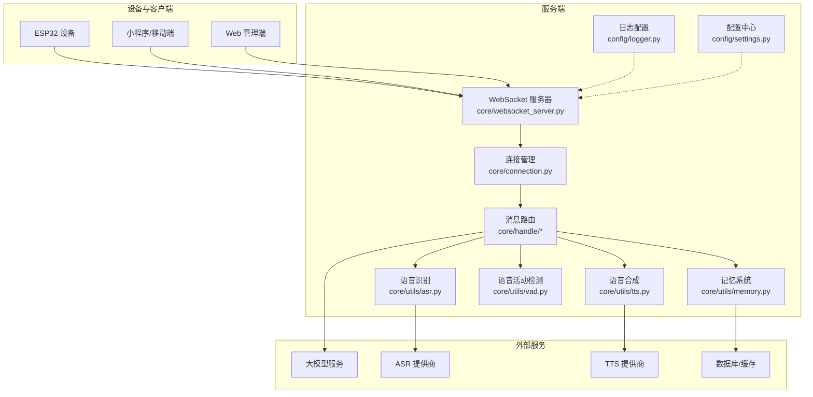
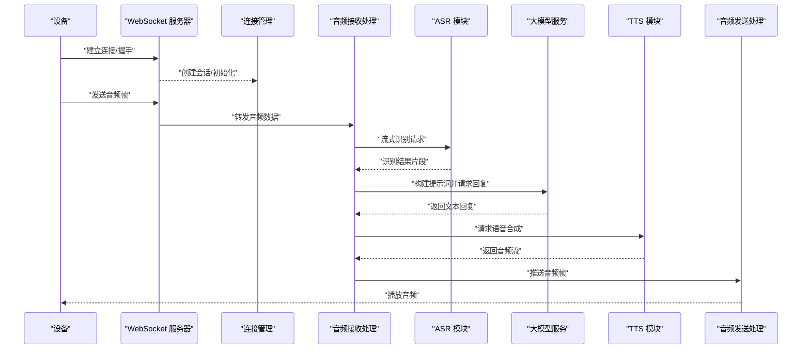
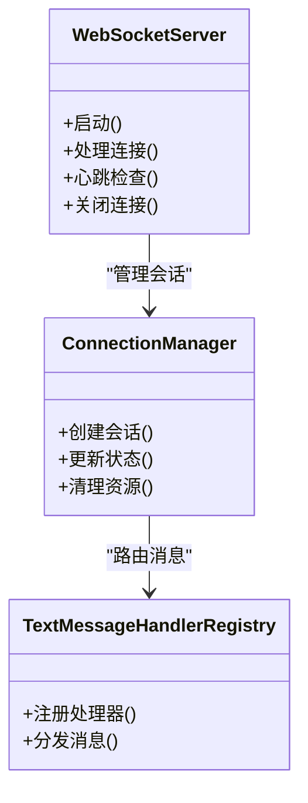
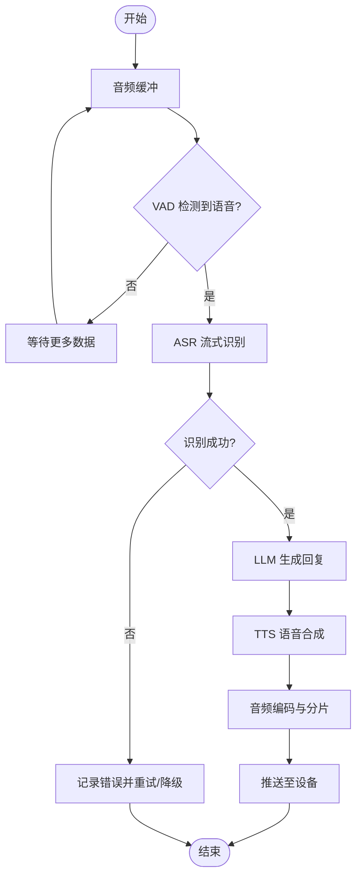
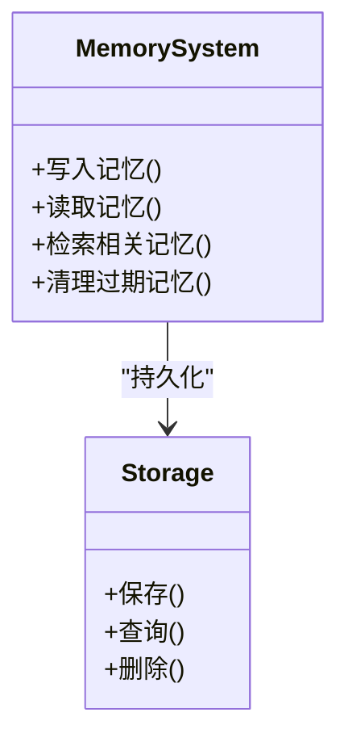
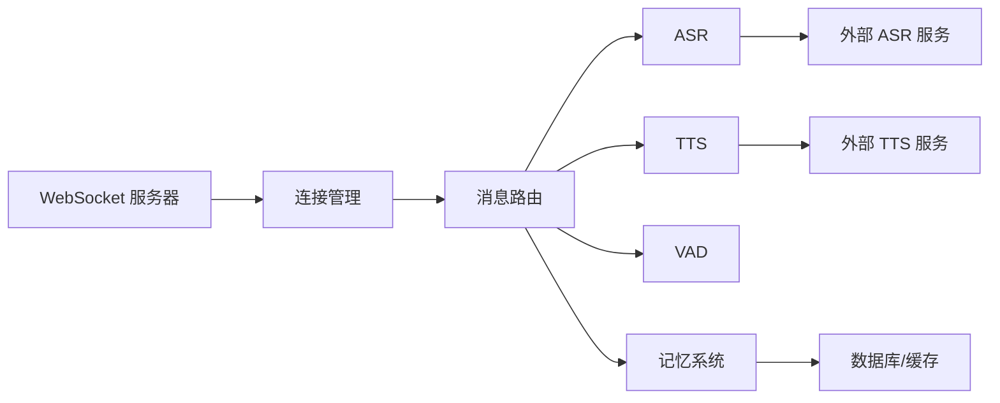

# 诊断流程

<cite>
**本文引用的文件**   
- [app.py](file://main/xiaozhi-server/app.py)
- [websocket_server.py](file://main/xiaozhi-server/core/websocket_server.py)
- [connection.py](file://main/xiaozhi-server/core/connection.py)
- [receiveAudioHandle.py](file://main/xiaozhi-server/core/handle/receiveAudioHandle.py)
- [sendAudioHandle.py](file://main/xiaozhi-server/core/handle/sendAudioHandle.py)
- [textMessageHandlerRegistry.py](file://main/xiaozhi-server/core/handle/textMessageHandlerRegistry.py)
- [tts.py](file://main/xiaozhi-server/core/utils/tts.py)
- [asr.py](file://main/xiaozhi-server/core/utils/asr.py)
- [vad.py](file://main/xiaozhi-server/core/utils/vad.py)
- [memory.py](file://main/xiaozhi-server/core/utils/memory.py)
- [logger.py](file://main/xiaozhi-server/config/logger.py)
- [settings.py](file://main/xiaozhi-server/config/settings.py)
- [performance_tester_asr.py](file://main/xiaozhi-server/performance_tester/performance_tester_asr.py)
- [performance_tester_tts.py](file://main/xiaozhi-server/performance_tester/performance_tester_tts.py)
- [performance_tester_stream_asr.py](file://main/xiaozhi-server/performance_tester/performance_tester_stream_asr.py)
- [performance_tester_stream_tts.py](file://main/xiaozhi-server/performance_tester/performance_tester_stream_tts.py)
- [start.sh](file://main/xiaozhi-server/start.sh)
- [docker-compose.yml](file://main/xiaozhi-server/docker-compose.yml)
- [index-stream-integration.md](file://docs/index-stream-integration.md)
- [paddlespeech-deploy.md](file://docs/paddlespeech-deploy.md)
- [fish-speech-integration.md](file://docs/fish-speech-integration.md)
- [homeassistant-integration.md](file://docs/homeassistant-integration.md)
- [mcp-endpoint-integration.md](file://docs/mcp-endpoint-integration.md)
- [mcp-vision-integration.md](file://docs/mcp-vision-integration.md)
- [weather-integration.md](file://docs/weather-integration.md)
- [server-pipeline-stall-analysis.md](file://plans/server-pipeline-stall-analysis.md)
</cite>

## 目录
1. [引言](#引言)
2. [项目结构](#项目结构)
3. [核心组件](#核心组件)
4. [架构总览](#架构总览)
5. [详细组件分析](#详细组件分析)
6. [依赖关系分析](#依赖关系分析)
7. [性能考量](#性能考量)
8. [故障排查指南](#故障排查指南)
9. [结论](#结论)
10. [附录](#附录)

## 引言
本文件面向运维与研发人员，提供系统化的故障诊断流程与标准操作程序（SOP）。覆盖典型场景：设备无法连接、语音识别失败、TTS 输出异常、记忆数据丢失等。文档包含问题复现方法、根因分析步骤、分类与优先级判定、升级流程与时限要求，以及诊断工具链的使用说明与故障报告模板。目标是让读者能够快速定位并解决问题，保障服务稳定性与用户体验。

## 项目结构
本项目为多端协作的语音交互系统，核心后端位于 main/xiaozhi-server，前端与管理端位于 main/manager-web、main/manager-mobile、main/miniprogram 等。服务端通过 WebSocket 与设备通信，内部模块按功能分层：连接管理、消息路由、ASR/TTS/VAD 等能力提供者、记忆系统等。

图表来源
- [websocket_server.py](file://main/xiaozhi-server/core/websocket_server.py)
- [connection.py](file://main/xiaozhi-server/core/connection.py)
- [receiveAudioHandle.py](file://main/xiaozhi-server/core/handle/receiveAudioHandle.py)
- [sendAudioHandle.py](file://main/xiaozhi-server/core/handle/sendAudioHandle.py)
- [asr.py](file://main/xiaozhi-server/core/utils/asr.py)
- [tts.py](file://main/xiaozhi-server/core/utils/tts.py)
- [vad.py](file://main/xiaozhi-server/core/utils/vad.py)
- [memory.py](file://main/xiaozhi-server/core/utils/memory.py)
- [logger.py](file://main/xiaozhi-server/config/logger.py)
- [settings.py](file://main/xiaozhi-server/config/settings.py)

章节来源
- [app.py](file://main/xiaozhi-server/app.py)
- [websocket_server.py](file://main/xiaozhi-server/core/websocket_server.py)
- [connection.py](file://main/xiaozhi-server/core/connection.py)

## 核心组件
- WebSocket 服务器：负责设备接入、心跳、协议解析与消息分发。
- 连接管理：维护会话状态、资源清理与重连策略。
- 消息路由：根据消息类型分发给处理模块（音频接收、文本处理、意图、上报等）。
- ASR/TTS/VAD：语音识别、语音合成、语音活动检测的能力封装与调用。
- 记忆系统：对话上下文、长期记忆存储与检索。
- 日志与配置：统一日志级别、输出格式与运行时配置加载。

章节来源
- [websocket_server.py](file://main/xiaozhi-server/core/websocket_server.py)
- [connection.py](file://main/xiaozhi-server/core/connection.py)
- [receiveAudioHandle.py](file://main/xiaozhi-server/core/handle/receiveAudioHandle.py)
- [sendAudioHandle.py](file://main/xiaozhi-server/core/handle/sendAudioHandle.py)
- [textMessageHandlerRegistry.py](file://main/xiaozhi-server/core/handle/textMessageHandlerRegistry.py)
- [asr.py](file://main/xiaozhi-server/core/utils/asr.py)
- [tts.py](file://main/xiaozhi-server/core/utils/tts.py)
- [vad.py](file://main/xiaozhi-server/core/utils/vad.py)
- [memory.py](file://main/xiaozhi-server/core/utils/memory.py)
- [logger.py](file://main/xiaozhi-server/config/logger.py)
- [settings.py](file://main/xiaozhi-server/config/settings.py)

## 架构总览
下图展示从设备到后端的端到端流程，包括音频流处理、ASR 识别、LLM 推理、TTS 合成与回传设备的时序。

图表来源
- [websocket_server.py](file://main/xiaozhi-server/core/websocket_server.py)
- [connection.py](file://main/xiaozhi-server/core/connection.py)
- [receiveAudioHandle.py](file://main/xiaozhi-server/core/handle/receiveAudioHandle.py)
- [sendAudioHandle.py](file://main/xiaozhi-server/core/handle/sendAudioHandle.py)
- [asr.py](file://main/xiaozhi-server/core/utils/asr.py)
- [tts.py](file://main/xiaozhi-server/core/utils/tts.py)

## 详细组件分析

### 连接与消息路由
- 连接生命周期：握手、鉴权、心跳保活、断线重连、资源释放。
- 消息路由：基于消息类型注册处理器，支持文本、音频、指令等。
- 错误处理：网络异常、超时、协议不匹配时的降级与告警。

图表来源
- [websocket_server.py](file://main/xiaozhi-server/core/websocket_server.py)
- [connection.py](file://main/xiaozhi-server/core/connection.py)
- [textMessageHandlerRegistry.py](file://main/xiaozhi-server/core/handle/textMessageHandlerRegistry.py)

章节来源
- [websocket_server.py](file://main/xiaozhi-server/core/websocket_server.py)
- [connection.py](file://main/xiaozhi-server/core/connection.py)
- [textMessageHandlerRegistry.py](file://main/xiaozhi-server/core/handle/textMessageHandlerRegistry.py)

### 音频接收与发送处理
- 音频接收：缓冲、VAD 判断、ASR 流式识别、结果拼接。
- 音频发送：TTS 合成、编码、分片推送、延迟控制。
- 关键指标：首包时延、端到端时延、丢包率、卡顿次数。

图表来源
- [receiveAudioHandle.py](file://main/xiaozhi-server/core/handle/receiveAudioHandle.py)
- [sendAudioHandle.py](file://main/xiaozhi-server/core/handle/sendAudioHandle.py)
- [vad.py](file://main/xiaozhi-server/core/utils/vad.py)
- [asr.py](file://main/xiaozhi-server/core/utils/asr.py)
- [tts.py](file://main/xiaozhi-server/core/utils/tts.py)

章节来源
- [receiveAudioHandle.py](file://main/xiaozhi-server/core/handle/receiveAudioHandle.py)
- [sendAudioHandle.py](file://main/xiaozhi-server/core/handle/sendAudioHandle.py)
- [vad.py](file://main/xiaozhi-server/core/utils/vad.py)
- [asr.py](file://main/xiaozhi-server/core/utils/asr.py)
- [tts.py](file://main/xiaozhi-server/core/utils/tts.py)

### 记忆系统
- 记忆写入：对话摘要、事件锚点、用户画像更新。
- 记忆读取：上下文注入、检索增强、冲突合并。
- 持久化：数据库/缓存读写、一致性校验、备份恢复。

图表来源
- [memory.py](file://main/xiaozhi-server/core/utils/memory.py)

章节来源
- [memory.py](file://main/xiaozhi-server/core/utils/memory.py)

## 依赖关系分析
- 模块耦合：WebSocket 服务器与连接管理强耦合；消息路由与处理器松耦合（通过注册表解耦）。
- 外部依赖：ASR/TTS 提供商、LLM 服务、数据库/缓存。
- 潜在循环：避免在处理器中直接反向依赖服务器层，使用事件或回调机制。

图表来源
- [websocket_server.py](file://main/xiaozhi-server/core/websocket_server.py)
- [connection.py](file://main/xiaozhi-server/core/connection.py)
- [asr.py](file://main/xiaozhi-server/core/utils/asr.py)
- [tts.py](file://main/xiaozhi-server/core/utils/tts.py)
- [memory.py](file://main/xiaozhi-server/core/utils/memory.py)

章节来源
- [websocket_server.py](file://main/xiaozhi-server/core/websocket_server.py)
- [connection.py](file://main/xiaozhi-server/core/connection.py)
- [asr.py](file://main/xiaozhi-server/core/utils/asr.py)
- [tts.py](file://main/xiaozhi-server/core/utils/tts.py)
- [memory.py](file://main/xiaozhi-server/core/utils/memory.py)

## 性能考量
- 流式处理：ASR/TTS 采用流式接口以降低首包时延。
- 资源管理：音频缓冲大小、线程池配额、连接上限。
- 监控指标：QPS、P95/P99 时延、错误率、CPU/内存占用、GC 频率。
- 压测工具：使用性能测试器对 ASR/TTS 进行基准测试。

章节来源
- [performance_tester_asr.py](file://main/xiaozhi-server/performance_tester/performance_tester_asr.py)
- [performance_tester_tts.py](file://main/xiaozhi-server/performance_tester/performance_tester_tts.py)
- [performance_tester_stream_asr.py](file://main/xiaozhi-server/performance_tester/performance_tester_stream_asr.py)
- [performance_tester_stream_tts.py](file://main/xiaozhi-server/performance_tester/performance_tester_stream_tts.py)

## 故障排查指南

### 通用排查清单与检查点
- 环境与健康检查
  - 服务进程存活、端口监听、证书有效性、磁盘空间、内存/CPU 使用率。
  - 配置文件加载是否正确（settings.py）、日志级别是否足够详细（logger.py）。
- 网络连接
  - 设备到服务器的连通性（ping、telnet、curl）、代理/NAT 穿透、防火墙规则。
  - WebSocket 握手成功、心跳正常、无频繁断线。
- 音视频链路
  - 音频输入设备权限、采样率/编码格式、网络抖动与丢包。
  - ASR 提供商可用性、速率限制、鉴权密钥。
  - TTS 提供商可用性、音色配置、并发限制。
- 业务逻辑
  - 消息路由是否正确、处理器是否注册、参数校验是否通过。
  - 记忆系统读写是否正常、索引是否损坏、缓存一致性。

章节来源
- [settings.py](file://main/xiaozhi-server/config/settings.py)
- [logger.py](file://main/xiaozhi-server/config/logger.py)
- [websocket_server.py](file://main/xiaozhi-server/core/websocket_server.py)
- [connection.py](file://main/xiaozhi-server/core/connection.py)
- [asr.py](file://main/xiaozhi-server/core/utils/asr.py)
- [tts.py](file://main/xiaozhi-server/core/utils/tts.py)
- [memory.py](file://main/xiaozhi-server/core/utils/memory.py)

### 典型故障场景与诊断步骤

#### 设备无法连接
- 现象：设备反复尝试连接、握手失败、连接后立即断开。
- 复现：使用相同固件版本与网络环境重复连接，观察握手报文与错误码。
- 排查要点：
  - 检查 WebSocket 服务器监听端口与证书。
  - 查看连接管理与鉴权流程的错误日志。
  - 验证设备配置（服务器地址、端口、鉴权信息）。
- 根因分析：网络不通、证书过期、鉴权失败、资源耗尽。
- 解决建议：修复网络策略、更新证书、修正鉴权配置、扩容连接池。

章节来源
- [websocket_server.py](file://main/xiaozhi-server/core/websocket_server.py)
- [connection.py](file://main/xiaozhi-server/core/connection.py)
- [start.sh](file://main/xiaozhi-server/start.sh)
- [docker-compose.yml](file://main/xiaozhi-server/docker-compose.yml)

#### 语音识别失败
- 现象：ASR 返回空结果、频繁超时、识别质量差。
- 复现：录制标准音频样本，通过性能测试器或手动接口触发 ASR。
- 排查要点：
  - 检查 ASR 提供商健康状态与限流策略。
  - 确认音频编码格式、采样率、音量阈值。
  - 查看 VAD 检测结果与 ASR 输入长度。
- 根因分析：提供商不可用、音频格式不匹配、噪声过大、超时配置过短。
- 解决建议：切换提供商、调整音频参数、优化 VAD 阈值、延长超时。

章节来源
- [asr.py](file://main/xiaozhi-server/core/utils/asr.py)
- [vad.py](file://main/xiaozhi-server/core/utils/vad.py)
- [performance_tester_asr.py](file://main/xiaozhi-server/performance_tester/performance_tester_asr.py)
- [performance_tester_stream_asr.py](file://main/xiaozhi-server/performance_tester/performance_tester_stream_asr.py)

#### TTS 输出异常
- 现象：TTS 无输出、音质异常、语速过快/慢、中断频繁。
- 复现：使用固定文本调用 TTS，观察输出时长与质量。
- 排查要点：
  - 检查 TTS 提供商可用性与并发限制。
  - 确认音色配置、语言代码、编码格式。
  - 查看音频发送处理的缓冲与分片策略。
- 根因分析：提供商限流、配置错误、网络抖动、发送队列阻塞。
- 解决建议：扩容并发、修正配置、优化缓冲策略、增加重试与降级。

章节来源
- [tts.py](file://main/xiaozhi-server/core/utils/tts.py)
- [sendAudioHandle.py](file://main/xiaozhi-server/core/handle/sendAudioHandle.py)
- [performance_tester_tts.py](file://main/xiaozhi-server/performance_tester/performance_tester_tts.py)
- [performance_tester_stream_tts.py](file://main/xiaozhi-server/performance_tester/performance_tester_stream_tts.py)

#### 记忆数据丢失
- 现象：对话上下文缺失、历史记忆无法检索、用户画像重置。
- 复现：构造特定对话序列，验证记忆写入与读取一致性。
- 排查要点：
  - 检查记忆系统写入路径与事务提交。
  - 验证数据库/缓存连接、索引完整性、备份恢复流程。
  - 查看清理任务是否误删有效数据。
- 根因分析：持久化失败、索引损坏、清理策略过于激进、并发冲突。
- 解决建议：修复持久化、重建索引、调整清理策略、引入幂等写入。

章节来源
- [memory.py](file://main/xiaozhi-server/core/utils/memory.py)

### 问题复现方法与验证
- 标准化用例：准备最小可复现场景的数据集（音频样本、文本输入、设备配置）。
- 自动化脚本：使用性能测试器或自定义脚本批量触发，收集日志与指标。
- 验证手段：对比预期输出与实际输出，记录差异与错误堆栈。

章节来源
- [performance_tester_asr.py](file://main/xiaozhi-server/performance_tester/performance_tester_asr.py)
- [performance_tester_tts.py](file://main/xiaozhi-server/performance_tester/performance_tester_tts.py)
- [performance_tester_stream_asr.py](file://main/xiaozhi-server/performance_tester/performance_tester_stream_asr.py)
- [performance_tester_stream_tts.py](file://main/xiaozhi-server/performance_tester/performance_tester_stream_tts.py)

### 根因分析方法论
- 现象收集：日志、指标、用户反馈、网络抓包。
- 假设构建：基于时间线与依赖关系提出可能原因。
- 证据验证：隔离变量、灰度发布、A/B 测试、回放测试。
- 根因确认：定位具体代码路径、配置项或外部依赖问题。

章节来源
- [server-pipeline-stall-analysis.md](file://plans/server-pipeline-stall-analysis.md)

### 问题分类与优先级判定
- 分类维度：影响范围（单设备/全局）、功能域（连接/ASR/TTS/记忆）、严重等级（致命/严重/一般/轻微）。
- 优先级矩阵：结合影响面与紧急程度确定 P0-P3 等级。
- 响应时效：P0 立即响应（分钟级），P1 快速响应（小时级），P2 常规处理（天级），P3 计划修复（周级）。

[本节为概念性内容，无需引用具体文件]

### 问题升级流程与时限要求
- 一线支持：收集基础信息与日志，尝试标准解决方案。
- 二线专家：深入代码与依赖分析，制定临时缓解措施。
- 三线架构：评估架构变更与重构方案，推动长期改进。
- 时限要求：按优先级设定 SLA，超时自动升级并通知干系人。

[本节为概念性内容，无需引用具体文件]

### 诊断工具链使用
- 日志分析：统一日志格式与级别，集中采集与检索。
- 性能测试：ASR/TTS 基准测试、流式吞吐与延迟评估。
- 集成测试：对接第三方服务（HomeAssistant、MCP、天气等）的端到端验证。
- 部署与运行：容器化部署、启动脚本、环境变量管理。

章节来源
- [logger.py](file://main/xiaozhi-server/config/logger.py)
- [performance_tester_asr.py](file://main/xiaozhi-server/performance_tester/performance_tester_asr.py)
- [performance_tester_tts.py](file://main/xiaozhi-server/performance_tester/performance_tester_tts.py)
- [performance_tester_stream_asr.py](file://main/xiaozhi-server/performance_tester/performance_tester_stream_asr.py)
- [performance_tester_stream_tts.py](file://main/xiaozhi-server/performance_tester/performance_tester_stream_tts.py)
- [homeassistant-integration.md](file://docs/homeassistant-integration.md)
- [mcp-endpoint-integration.md](file://docs/mcp-endpoint-integration.md)
- [mcp-vision-integration.md](file://docs/mcp-vision-integration.md)
- [weather-integration.md](file://docs/weather-integration.md)
- [start.sh](file://main/xiaozhi-server/start.sh)
- [docker-compose.yml](file://main/xiaozhi-server/docker-compose.yml)

### 故障报告模板与记录规范
- 基本信息：问题标题、发现时间、影响范围、优先级。
- 现象描述：用户反馈、错误日志、截图/录屏、网络抓包。
- 复现步骤：最小数据集、操作步骤、预期与实际结果。
- 根因分析：时间线、关键线索、定位过程、根本原因。
- 解决措施：临时缓解、永久修复、回归验证。
- 后续改进：监控告警、自动化测试、文档更新。

[本节为概念性内容，无需引用具体文件]

## 结论
通过标准化的故障诊断流程与 SOP，团队可以快速定位并解决常见问题，提升系统稳定性与用户体验。建议持续完善监控与自动化测试，强化根因分析与知识沉淀，形成闭环改进机制。

[本节为总结性内容，无需引用具体文件]

## 附录

### 参考文档与集成指南
- 流式集成：了解流式数据处理的最佳实践。
- 部署指南：PaddleSpeech、Fish Speech 等服务的部署与集成。
- 外部集成：HomeAssistant、MCP、天气服务等第三方能力对接。

章节来源
- [index-stream-integration.md](file://docs/index-stream-integration.md)
- [paddlespeech-deploy.md](file://docs/paddlespeech-deploy.md)
- [fish-speech-integration.md](file://docs/fish-speech-integration.md)
- [homeassistant-integration.md](file://docs/homeassistant-integration.md)
- [mcp-endpoint-integration.md](file://docs/mcp-endpoint-integration.md)
- [mcp-vision-integration.md](file://docs/mcp-vision-integration.md)
- [weather-integration.md](file://docs/weather-integration.md)