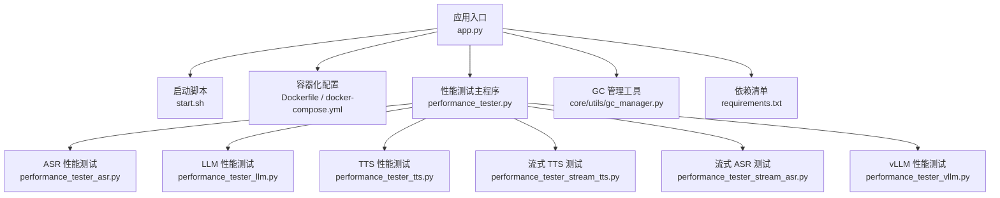
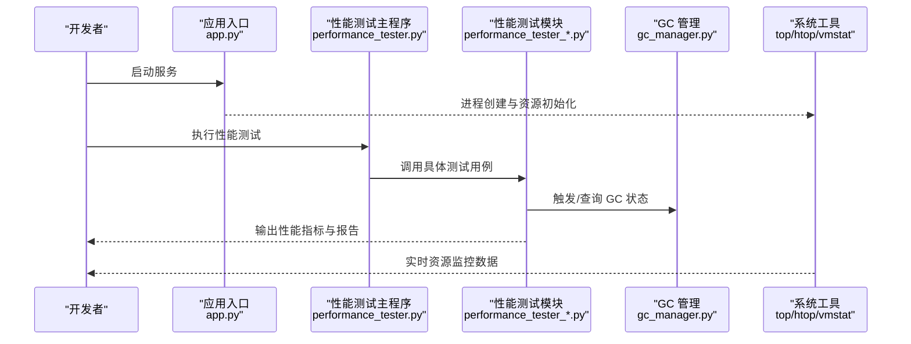
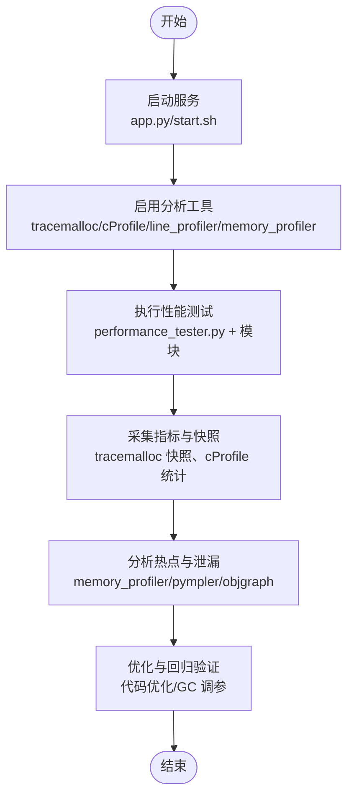
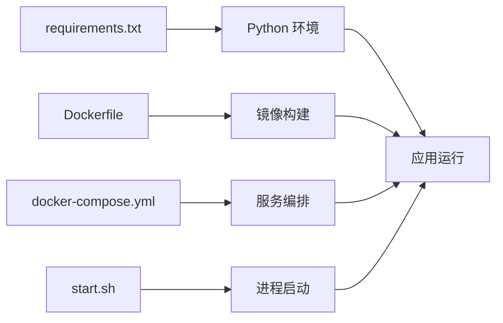

# 内存与CPU分析

<cite>
**本文引用的文件**   
- [performance_tester.py](file://main/xiaozhi-server/performance_tester.py)
- [app.py](file://main/xiaozhi-server/app.py)
- [gc_manager.py](file://main/xiaozhi-server/core/utils/gc_manager.py)
- [performance_tester_asr.py](file://main/xiaozhi-server/performance_tester/performance_tester_asr.py)
- [performance_tester_llm.py](file://main/xiaozhi-server/performance_tester/performance_tester_llm.py)
- [performance_tester_stream_tts.py](file://main/xiaozhi-server/performance_tester/performance_tester_stream_tts.py)
- [performance_tester_stream_asr.py](file://main/xiaozhi-server/performance_tester/performance_tester_stream_asr.py)
- [performance_tester_tts.py](file://main/xiaozhi-server/performance_tester/performance_tester_tts.py)
- [performance_tester_vllm.py](file://main/xiaozhi-server/performance_tester/performance_tester_vllm.py)
- [requirements.txt](file://main/xiaozhi-server/requirements.txt)
- [start.sh](file://main/xiaozhi-server/start.sh)
- [Dockerfile](file://main/xiaozhi-server/Dockerfile)
- [docker-compose.yml](file://main/xiaozhi-server/docker-compose.yml)
- [chat-service-cost-estimate.md](file://main/xiaozhi-server/docs/chat-service-cost-estimate.md)
- [production-readiness-assessment.md](file://main/xiaozhi-server/docs/production-readiness-assessment.md)
</cite>

## 目录
1. [简介](#简介)
2. [项目结构](#项目结构)
3. [核心组件](#核心组件)
4. [架构总览](#架构总览)
5. [详细组件分析](#详细组件分析)
6. [依赖分析](#依赖分析)
7. [性能注意事项](#性能注意事项)
8. [故障排查指南](#故障排查指南)
9. [结论](#结论)
10. [附录](#附录)

## 简介
本文件面向 xiaozhi-esp32-server 项目的性能工程实践，聚焦内存与 CPU 分析工具与方法。内容涵盖：
- memory_profiler 的安装、使用与最佳实践（内存泄漏检测、热点分析与垃圾回收监控）
- tracemalloc 模块的启用与对象分配追踪
- cProfile 与 line_profiler 的配置与使用，定位 CPU 瓶颈
- 系统级工具（top、htop、vmstat）监控资源使用
- pympler、objgraph 等高级内存分析工具用法
- 内存优化策略与 CPU 调优实践
- 结合本项目实际的性能测试脚本与文档进行案例剖析与问题排查

## 项目结构
xiaozhi-esp32-server 的核心服务端位于 main/xiaozhi-server，包含应用入口、性能测试器、GC 管理工具以及多种性能评测脚本。关键路径如下：
- 应用入口与启动：app.py、start.sh、Dockerfile、docker-compose.yml
- 性能测试套件：performance_tester.py 及 performance_tester/* 子模块
- GC 管理：core/utils/gc_manager.py
- 依赖与约束：requirements.txt
- 性能相关文档：docs/chat-service-cost-estimate.md、docs/production-readiness-assessment.md

图表来源
- [app.py](file://main/xiaozhi-server/app.py)
- [start.sh](file://main/xiaozhi-server/start.sh)
- [Dockerfile](file://main/xiaozhi-server/Dockerfile)
- [docker-compose.yml](file://main/xiaozhi-server/docker-compose.yml)
- [performance_tester.py](file://main/xiaozhi-server/performance_tester.py)
- [performance_tester_asr.py](file://main/xiaozhi-server/performance_tester/performance_tester_asr.py)
- [performance_tester_llm.py](file://main/xiaozhi-server/performance_tester/performance_tester_llm.py)
- [performance_tester_tts.py](file://main/xiaozhi-server/performance_tester/performance_tester_tts.py)
- [performance_tester_stream_tts.py](file://main/xiaozhi-server/performance_tester/performance_tester_stream_tts.py)
- [performance_tester_stream_asr.py](file://main/xiaozhi-server/performance_tester/performance_tester_stream_asr.py)
- [performance_tester_vllm.py](file://main/xiaozhi-server/performance_tester/performance_tester_vllm.py)
- [gc_manager.py](file://main/xiaozhi-server/core/utils/gc_manager.py)
- [requirements.txt](file://main/xiaozhi-server/requirements.txt)

章节来源
- [performance_tester.py](file://main/xiaozhi-server/performance_tester.py)
- [app.py](file://main/xiaozhi-server/app.py)
- [gc_manager.py](file://main/xiaozhi-server/core/utils/gc_manager.py)
- [requirements.txt](file://main/xiaozhi-server/requirements.txt)

## 核心组件
- 性能测试主程序：提供统一入口，组织并执行不同模块的性能测试任务（ASR、TTS、LLM、vLLM、流式处理等）。
- 各性能测试子模块：针对具体子系统（ASR/TTS/LLM/vLLM/流式）实现压测、指标采集与结果输出。
- GC 管理工具：封装垃圾回收控制与监控逻辑，便于在长时运行服务中稳定内存占用。
- 启动与容器化：通过 start.sh、Dockerfile、docker-compose.yml 完成环境准备与服务启动，为性能分析提供一致的运行基线。

章节来源
- [performance_tester.py](file://main/xiaozhi-server/performance_tester.py)
- [performance_tester_asr.py](file://main/xiaozhi-server/performance_tester/performance_tester_asr.py)
- [performance_tester_llm.py](file://main/xiaozhi-server/performance_tester/performance_tester_llm.py)
- [performance_tester_tts.py](file://main/xiaozhi-server/performance_tester/performance_tester_tts.py)
- [performance_tester_stream_tts.py](file://main/xiaozhi-server/performance_tester/performance_tester_stream_tts.py)
- [performance_tester_stream_asr.py](file://main/xiaozhi-server/performance_tester/performance_tester_stream_asr.py)
- [performance_tester_vllm.py](file://main/xiaozhi-server/performance_tester/performance_tester_vllm.py)
- [gc_manager.py](file://main/xiaozhi-server/core/utils/gc_manager.py)

## 架构总览
下图展示性能分析在系统中的集成点：应用启动后，可通过命令行或自动化流程调用性能测试套件；同时可注入内存/CPU 分析探针（tracemalloc、cProfile、line_profiler、memory_profiler），并结合系统级工具观测资源变化。

图表来源
- [app.py](file://main/xiaozhi-server/app.py)
- [performance_tester.py](file://main/xiaozhi-server/performance_tester.py)
- [performance_tester_asr.py](file://main/xiaozhi-server/performance_tester/performance_tester_asr.py)
- [performance_tester_llm.py](file://main/xiaozhi-server/performance_tester/performance_tester_llm.py)
- [performance_tester_tts.py](file://main/xiaozhi-server/performance_tester/performance_tester_tts.py)
- [performance_tester_stream_tts.py](file://main/xiaozhi-server/performance_tester/performance_tester_stream_tts.py)
- [performance_tester_stream_asr.py](file://main/xiaozhi-server/performance_tester/performance_tester_stream_asr.py)
- [performance_tester_vllm.py](file://main/xiaozhi-server/performance_tester/performance_tester_vllm.py)
- [gc_manager.py](file://main/xiaozhi-server/core/utils/gc_manager.py)

## 详细组件分析

### 内存分析：memory_profiler
- 安装与启用
  - 通过依赖管理安装 memory_profiler，确保版本与 Python 环境兼容。
  - 在需要分析的函数或代码块上添加装饰器或上下文管理器，以逐行统计内存增量。
- 内存泄漏检测
  - 在长时运行的服务中，周期性对关键路径执行 memory_profiler 采样，观察内存是否持续上升。
  - 结合日志记录与外部监控，定位异常增长区间。
- 内存占用热点分析
  - 对数据处理、模型加载、音频编解码等重内存操作进行热点扫描，识别峰值分配位置。
- 垃圾回收监控
  - 配合 gc_manager 的 GC 控制接口，在 memory_profiler 采样前后触发手动 GC，评估释放效果。
- 使用建议
  - 仅在开发/预发环境开启，生产环境谨慎使用以避免额外开销。
  - 将采样结果导出为可读格式，纳入 CI/CD 质量门禁。

章节来源
- [requirements.txt](file://main/xiaozhi-server/requirements.txt)
- [gc_manager.py](file://main/xiaozhi-server/core/utils/gc_manager.py)

### 内存分配追踪：tracemalloc
- 启用方式
  - 在应用启动阶段启用 tracemalloc，设置快照阈值与跟踪深度，避免过度采样影响性能。
- 对象分配与释放追踪
  - 定期生成内存快照，对比两次快照的差异，定位新增与未释放的对象。
  - 结合堆栈信息，定位分配热点（如临时缓冲区、字符串拼接、大型列表构建）。
- 与 GC 协同
  - 在 GC 触发前后分别取快照，评估 GC 对内存回落的贡献度。
- 输出与可视化
  - 将差异快照导出为文本或结构化数据，便于后续分析与归档。

章节来源
- [gc_manager.py](file://main/xiaozhi-server/core/utils/gc_manager.py)

### CPU 性能分析：cProfile 与 line_profiler
- cProfile
  - 用于函数级别的调用次数与耗时统计，适合快速定位热点函数。
  - 建议在压力测试场景下运行，收集端到端请求的调用链。
- line_profiler
  - 用于逐行级别的耗时分析，适合细粒度优化（如音频处理、文本处理循环）。
  - 需对目标函数添加装饰器，单独运行分析脚本。
- 使用建议
  - 先使用 cProfile 定位热点函数，再使用 line_profiler 深入分析具体行。
  - 将分析报告纳入性能回归测试，防止优化回退。

章节来源
- [performance_tester.py](file://main/xiaozhi-server/performance_tester.py)
- [performance_tester_asr.py](file://main/xiaozhi-server/performance_tester/performance_tester_asr.py)
- [performance_tester_llm.py](file://main/xiaozhi-server/performance_tester/performance_tester_llm.py)
- [performance_tester_tts.py](file://main/xiaozhi-server/performance_tester/performance_tester_tts.py)
- [performance_tester_stream_tts.py](file://main/xiaozhi-server/performance_tester/performance_tester_stream_tts.py)
- [performance_tester_stream_asr.py](file://main/xiaozhi-server/performance_tester/performance_tester_stream_asr.py)
- [performance_tester_vllm.py](file://main/xiaozhi-server/performance_tester/performance_tester_vllm.py)

### 系统级工具：top、htop、vmstat
- top/htop
  - 实时监控进程 CPU、内存、线程数与上下文切换，辅助判断是否存在阻塞或资源争用。
- vmstat
  - 观察系统级指标（CPU 空闲、I/O 等待、页交换、中断），识别系统瓶颈。
- 使用建议
  - 在压测期间并行运行系统工具，记录时间戳对齐性能测试结果。
  - 将关键指标写入日志或监控系统，便于事后复盘。

章节来源
- [start.sh](file://main/xiaozhi-server/start.sh)
- [Dockerfile](file://main/xiaozhi-server/Dockerfile)
- [docker-compose.yml](file://main/xiaozhi-server/docker-compose.yml)

### 高级内存分析：pympler 与 objgraph
- pympler
  - 用于对象大小统计、内存分布分析与类型占比查看，适合发现大对象与集合膨胀。
- objgraph
  - 用于对象引用图分析，定位强引用导致的内存泄漏（如全局缓存、回调闭包）。
- 使用建议
  - 在内存异常时抓取快照与引用图，结合业务逻辑定位根对象。
  - 将分析脚本集成到诊断工具集，支持按需触发。

章节来源
- [requirements.txt](file://main/xiaozhi-server/requirements.txt)
- [gc_manager.py](file://main/xiaozhi-server/core/utils/gc_manager.py)

### 性能测试套件与用例
- 主程序与模块
  - performance_tester.py 作为统一入口，调度 ASR、TTS、LLM、vLLM、流式处理等测试模块。
  - 各模块负责构造负载、采集指标、输出报告。
- 典型用例
  - ASR：语音转文字吞吐与延迟评估
  - TTS：文本转语音吞吐与延迟评估
  - LLM：推理吞吐、首字延迟、显存占用（若涉及）
  - vLLM：高并发推理性能与资源利用率
  - 流式处理：端到端延迟与稳定性

章节来源
- [performance_tester.py](file://main/xiaozhi-server/performance_tester.py)
- [performance_tester_asr.py](file://main/xiaozhi-server/performance_tester/performance_tester_asr.py)
- [performance_tester_llm.py](file://main/xiaozhi-server/performance_tester/performance_tester_llm.py)
- [performance_tester_tts.py](file://main/xiaozhi-server/performance_tester/performance_tester_tts.py)
- [performance_tester_stream_tts.py](file://main/xiaozhi-server/performance_tester/performance_tester_stream_tts.py)
- [performance_tester_stream_asr.py](file://main/xiaozhi-server/performance_tester/performance_tester_stream_asr.py)
- [performance_tester_vllm.py](file://main/xiaozhi-server/performance_tester/performance_tester_vllm.py)

### 概念性概览
以下流程图概括了从启动到性能分析的整体工作流，帮助理解各工具与模块的协作关系。

[本图为概念性流程图，不直接映射具体源码文件]

## 依赖分析
- 依赖清单
  - requirements.txt 定义了 Python 运行时所需库，包括性能分析工具（如 memory_profiler、line_profiler、pympler、objgraph）与业务依赖。
- 容器化与环境一致性
  - Dockerfile 与 docker-compose.yml 确保开发与生产环境一致，减少“在我机器上正常”的问题。
- 启动脚本
  - start.sh 负责环境变量、依赖检查与服务启动，便于在 CI/CD 中复用。

图表来源
- [requirements.txt](file://main/xiaozhi-server/requirements.txt)
- [Dockerfile](file://main/xiaozhi-server/Dockerfile)
- [docker-compose.yml](file://main/xiaozhi-server/docker-compose.yml)
- [start.sh](file://main/xiaozhi-server/start.sh)

章节来源
- [requirements.txt](file://main/xiaozhi-server/requirements.txt)
- [Dockerfile](file://main/xiaozhi-server/Dockerfile)
- [docker-compose.yml](file://main/xiaozhi-server/docker-compose.yml)
- [start.sh](file://main/xiaozhi-server/start.sh)

## 性能注意事项
- 内存优化策略
  - 减少大对象生命周期：及时释放临时缓冲区，避免全局缓存无限增长。
  - 合理使用数据结构：优先使用生成器与迭代器，避免一次性加载全部数据。
  - 控制字符串拼接：使用缓冲或字节流替代频繁拼接。
  - 调整 GC 参数：根据负载特征调节阈值，降低抖动与停顿。
- CPU 调优实践
  - 减少不必要的计算：缓存中间结果，避免重复计算。
  - 批处理与向量化：对批量数据进行向量化操作，提升吞吐。
  - 异步与并发：合理拆分 IO 与 CPU 密集任务，避免阻塞。
  - 预热与懒加载：模型与资源按需加载，缩短冷启动时间。
- 监控与回归
  - 建立性能基线与回归测试，确保优化有效且不引入退化。
  - 将关键指标接入监控系统，设置告警阈值。

[本节为通用指导，不直接分析具体文件]

## 故障排查指南
- 常见内存问题
  - 内存持续增长：检查是否存在未释放的全局缓存、事件监听器、闭包引用。
  - 内存峰值过高：定位大数据加载与临时缓冲区，考虑分块处理与流式读取。
  - GC 频繁触发：调整阈值或减少短生命周期对象创建。
- 常见 CPU 问题
  - 热点函数耗时过长：使用 cProfile 与 line_profiler 定位具体行。
  - 锁竞争与阻塞：检查同步原语与 IO 阻塞点，考虑异步化。
  - 上下文切换过多：减少线程/协程数量，优化调度策略。
- 排查步骤
  - 复现问题：在可控环境下构造最小用例。
  - 采集数据：启用 tracemalloc、cProfile、memory_profiler，并记录系统指标。
  - 分析快照：对比快照差异，定位新增与未释放对象。
  - 定位根对象：使用 objgraph 绘制引用图，找到根引用。
  - 修复与验证：修改代码后回归测试，确认问题解决。

章节来源
- [gc_manager.py](file://main/xiaozhi-server/core/utils/gc_manager.py)
- [performance_tester.py](file://main/xiaozhi-server/performance_tester.py)

## 结论
通过对 xiaozhi-esp32-server 的性能测试套件与 GC 管理工具的梳理，结合 memory_profiler、tracemalloc、cProfile、line_profiler、pympler、objgraph 等工具的系统化使用，可以在开发与生产环境中有效定位内存与 CPU 瓶颈，实施针对性优化并建立回归保障。建议将性能分析纳入日常研发流程，形成“测量—分析—优化—验证”的闭环。

[本节为总结性内容，不直接分析具体文件]

## 附录
- 相关文档
  - chat-service-cost-estimate.md：成本估算与资源规划参考
  - production-readiness-assessment.md：生产就绪评估要点

章节来源
- [chat-service-cost-estimate.md](file://main/xiaozhi-server/docs/chat-service-cost-estimate.md)
- [production-readiness-assessment.md](file://main/xiaozhi-server/docs/production-readiness-assessment.md)