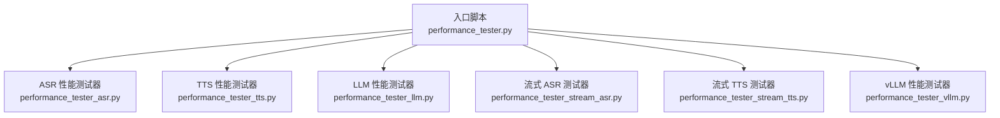
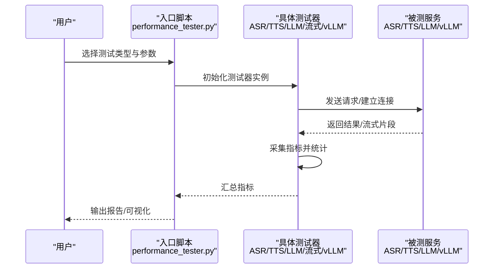
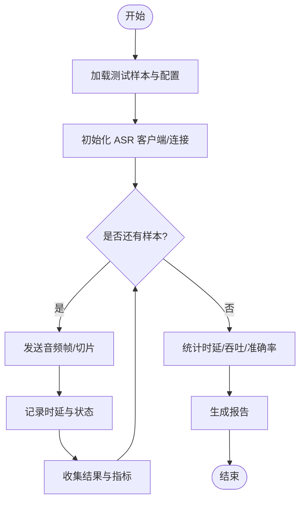
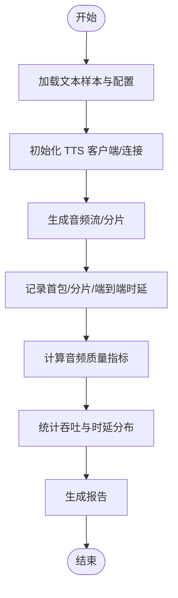
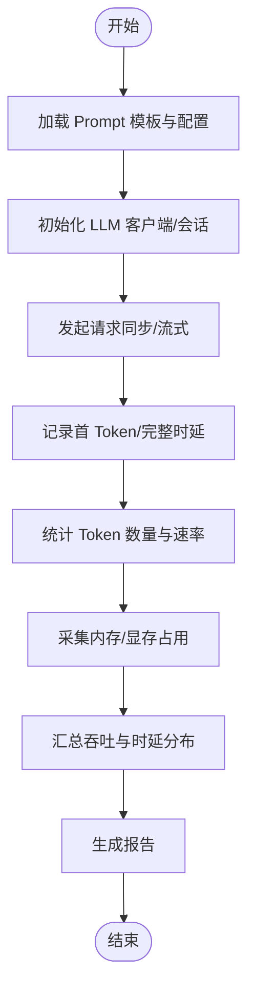
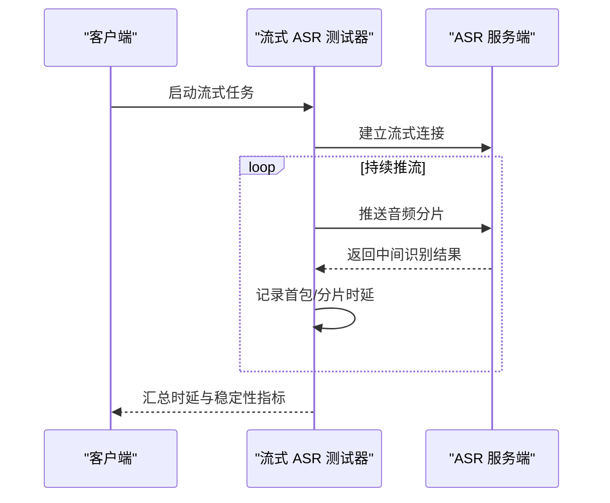
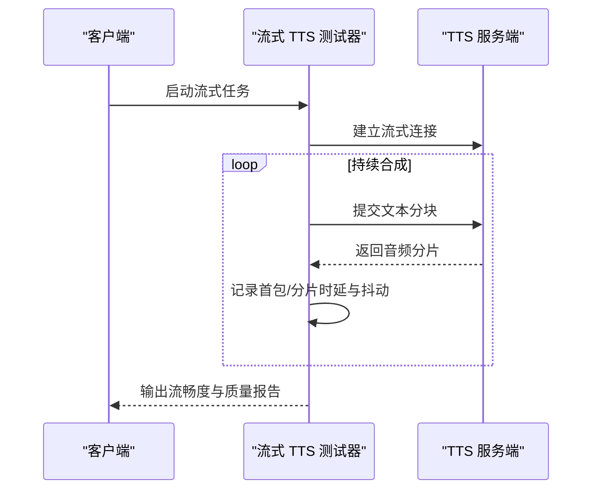
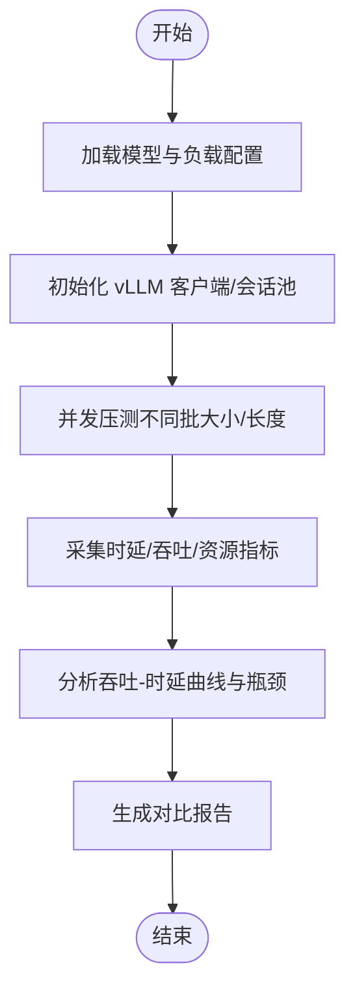
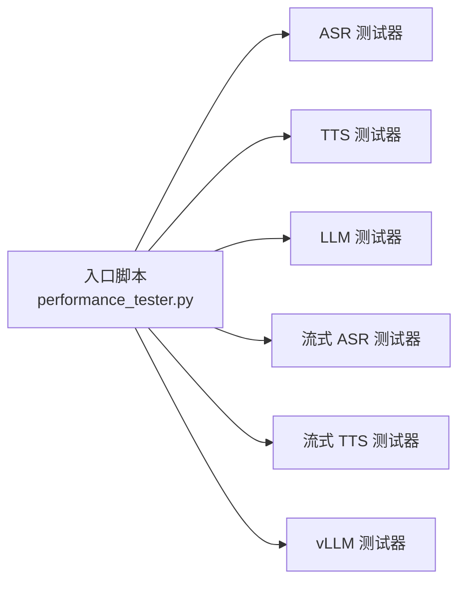

# 性能测试器

<cite>
**本文引用的文件**   
- [performance_tester.py](file://main/xiaozhi-server/performance_tester.py)
- [performance_tester_asr.py](file://main/xiaozhi-server/performance_tester/performance_tester_asr.py)
- [performance_tester_tts.py](file://main/xiaozhi-server/performance_tester/performance_tester_tts.py)
- [performance_tester_llm.py](file://main/xiaozhi-server/performance_tester/performance_tester_llm.py)
- [performance_tester_stream_asr.py](file://main/xiaozhi-server/performance_tester/performance_tester_stream_asr.py)
- [performance_tester_stream_tts.py](file://main/xiaozhi-server/performance_tester/performance_tester_stream_tts.py)
- [performance_tester_vllm.py](file://main/xiaozhi-server/performance_tester/performance_tester_vllm.py)
</cite>

## 目录
1. [简介](#简介)
2. [项目结构](#项目结构)
3. [核心组件](#核心组件)
4. [架构总览](#架构总览)
5. [详细组件分析](#详细组件分析)
6. [依赖关系分析](#依赖关系分析)
7. [性能考量](#性能考量)
8. [故障排查指南](#故障排查指南)
9. [结论](#结论)
10. [附录](#附录)

## 简介
本文件系统性介绍 xiaozhi-esp32-server 中的性能测试器工具集，覆盖 ASR、TTS、LLM、流式 ASR/TTS 以及 vLLM 五大类性能测试能力。文档面向不同技术背景的读者，既提供高层概览与使用指引，也给出代码级架构图、数据流与时序图，帮助快速定位瓶颈并制定优化策略。

## 项目结构
性能测试器位于 main/xiaozhi-server/performance_tester 目录下，采用“按能力拆分”的模块化组织方式：每个子模块对应一类被测对象（ASR/TTS/LLM/流式/vLLM），并提供统一的入口脚本 performance_tester.py 进行统一调度。

图表来源
- [performance_tester.py](file://main/xiaozhi-server/performance_tester.py)
- [performance_tester_asr.py](file://main/xiaozhi-server/performance_tester/performance_tester_asr.py)
- [performance_tester_tts.py](file://main/xiaozhi-server/performance_tester/performance_tester_tts.py)
- [performance_tester_llm.py](file://main/xiaozhi-server/performance_tester/performance_tester_llm.py)
- [performance_tester_stream_asr.py](file://main/xiaozhi-server/performance_tester/performance_tester_stream_asr.py)
- [performance_tester_stream_tts.py](file://main/xiaozhi-server/performance_tester/performance_tester_stream_tts.py)
- [performance_tester_vllm.py](file://main/xiaozhi-server/performance_tester/performance_tester_vllm.py)

章节来源
- [performance_tester.py](file://main/xiaozhi-server/performance_tester.py)

## 核心组件
- ASR 性能测试器：用于评估语音识别响应时间、准确率与并发处理能力。
- TTS 性能测试器：用于评估语音合成延迟、音频质量指标与流式传输吞吐。
- LLM 性能测试器：用于评估大模型调用延迟、Token 处理速度与内存占用。
- 流式 ASR/TTS 测试器：模拟真实流式场景，评估首包时延、端到端时延与抖动。
- vLLM 性能测试器：针对 vLLM 推理引擎的吞吐、时延与资源利用率进行基准评估。

章节来源
- [performance_tester_asr.py](file://main/xiaozhi-server/performance_tester/performance_tester_asr.py)
- [performance_tester_tts.py](file://main/xiaozhi-server/performance_tester/performance_tester_tts.py)
- [performance_tester_llm.py](file://main/xiaozhi-server/performance_tester/performance_tester_llm.py)
- [performance_tester_stream_asr.py](file://main/xiaozhi-server/performance_tester/performance_tester_stream_asr.py)
- [performance_tester_stream_tts.py](file://main/xiaozhi-server/performance_tester/performance_tester_stream_tts.py)
- [performance_tester_vllm.py](file://main/xiaozhi-server/performance_tester/performance_tester_vllm.py)

## 架构总览
下图展示入口脚本与各测试器的关系及典型调用路径。入口脚本负责参数解析、任务分发与结果汇总；各测试器内部封装了数据采集、统计计算与报告输出。

图表来源
- [performance_tester.py](file://main/xiaozhi-server/performance_tester.py)
- [performance_tester_asr.py](file://main/xiaozhi-server/performance_tester/performance_tester_asr.py)
- [performance_tester_tts.py](file://main/xiaozhi-server/performance_tester/performance_tester_tts.py)
- [performance_tester_llm.py](file://main/xiaozhi-server/performance_tester/performance_tester_llm.py)
- [performance_tester_stream_asr.py](file://main/xiaozhi-server/performance_tester/performance_tester_stream_asr.py)
- [performance_tester_stream_tts.py](file://main/xiaozhi-server/performance_tester/performance_tester_stream_tts.py)
- [performance_tester_vllm.py](file://main/xiaozhi-server/performance_tester/performance_tester_vllm.py)

## 详细组件分析

### ASR 性能测试器
- 功能要点
  - 响应时间：首包时延、端到端时延、分片时延分布。
  - 准确率：WER/CER 等文本相似度指标（需参考标注或回写校验）。
  - 并发：多路并发下的时延与吞吐变化，资源饱和点识别。
- 使用方法
  - 通过入口脚本选择 ASR 测试，配置并发数、样本集、目标服务地址与协议。
  - 运行后查看时延分位（P50/P95/P99）、吞吐（每秒识别时长）与准确率趋势。
- 关键流程

图表来源
- [performance_tester_asr.py](file://main/xiaozhi-server/performance_tester/performance_tester_asr.py)

章节来源
- [performance_tester_asr.py](file://main/xiaozhi-server/performance_tester/performance_tester_asr.py)

### TTS 性能测试器
- 功能要点
  - 延迟：首包时延、端到端时延、流式分片间隔。
  - 质量：采样率、比特率、失真度、可懂度（主观/客观指标）。
  - 吞吐：单位时间内合成的音频时长与并发承载能力。
- 使用方法
  - 通过入口脚本选择 TTS 测试，配置文本集、音频格式、流式开关与服务端地址。
  - 运行后关注首包时延、平均分片间隔、丢包重传影响与音质指标。
- 关键流程

图表来源
- [performance_tester_tts.py](file://main/xiaozhi-server/performance_tester/performance_tester_tts.py)

章节来源
- [performance_tester_tts.py](file://main/xiaozhi-server/performance_tester/performance_tester_tts.py)

### LLM 性能测试器
- 功能要点
  - 调用延迟：首 Token 时延、完整响应时延、重试开销。
  - Token 速度：输入/输出 Token/s、峰值吞吐。
  - 内存占用：进程/显存峰值、GC 行为、缓存命中率。
- 使用方法
  - 通过入口脚本选择 LLM 测试，配置 Prompt 模板、并发、最大长度与采样参数。
  - 运行后关注首 Token 时延、Token/s 曲线与内存拐点。
- 关键流程

图表来源
- [performance_tester_llm.py](file://main/xiaozhi-server/performance_tester/performance_tester_llm.py)

章节来源
- [performance_tester_llm.py](file://main/xiaozhi-server/performance_tester/performance_tester_llm.py)

### 流式 ASR 测试器
- 使用场景
  - 实时对话、会议转写、设备端语音交互等对首包时延敏感的场景。
- 参数配置
  - 分片大小、推送频率、缓冲策略、超时与重连策略。
- 关键指标
  - 首包时延、端到端时延、分片抖动、丢包/乱序恢复能力。
- 关键流程

图表来源
- [performance_tester_stream_asr.py](file://main/xiaozhi-server/performance_tester/performance_tester_stream_asr.py)

章节来源
- [performance_tester_stream_asr.py](file://main/xiaozhi-server/performance_tester/performance_tester_stream_asr.py)

### 流式 TTS 测试器
- 使用场景
  - 实时播报、游戏语音、智能客服等需要低延迟连续播放的场景。
- 参数配置
  - 文本分块策略、首包阈值、缓冲区大小、网络拥塞控制。
- 关键指标
  - 首包时延、分片间隔方差、卡顿次数、端到端时延。
- 关键流程

图表来源
- [performance_tester_stream_tts.py](file://main/xiaozhi-server/performance_tester/performance_tester_stream_tts.py)

章节来源
- [performance_tester_stream_tts.py](file://main/xiaozhi-server/performance_tester/performance_tester_stream_tts.py)

### vLLM 性能测试器
- 功能要点
  - 吞吐：并发请求下的 QPS、Token/s、GPU 利用率。
  - 时延：首 Token 时延、尾 Token 时延、P95/P99 时延。
  - 资源：显存峰值、KV Cache 命中率、批调度效率。
- 使用方法
  - 通过入口脚本选择 vLLM 测试，配置模型、批大小、序列长度与并发。
  - 运行后对比不同批大小与长度组合下的吞吐与时延曲线。
- 关键流程

图表来源
- [performance_tester_vllm.py](file://main/xiaozhi-server/performance_tester/performance_tester_vllm.py)

章节来源
- [performance_tester_vllm.py](file://main/xiaozhi-server/performance_tester/performance_tester_vllm.py)

## 依赖关系分析
- 入口脚本作为统一调度层，依赖各测试器模块完成具体任务。
- 各测试器之间相对独立，便于扩展新的能力（如新增评测维度或后端适配）。
- 外部依赖主要为被测服务的接口（HTTP/WebSocket/gRPC 等），测试器通过抽象客户端进行交互。

图表来源
- [performance_tester.py](file://main/xiaozhi-server/performance_tester.py)
- [performance_tester_asr.py](file://main/xiaozhi-server/performance_tester/performance_tester_asr.py)
- [performance_tester_tts.py](file://main/xiaozhi-server/performance_tester/performance_tester_tts.py)
- [performance_tester_llm.py](file://main/xiaozhi-server/performance_tester/performance_tester_llm.py)
- [performance_tester_stream_asr.py](file://main/xiaozhi-server/performance_tester/performance_tester_stream_asr.py)
- [performance_tester_stream_tts.py](file://main/xiaozhi-server/performance_tester/performance_tester_stream_tts.py)
- [performance_tester_vllm.py](file://main/xiaozhi-server/performance_tester/performance_tester_vllm.py)

章节来源
- [performance_tester.py](file://main/xiaozhi-server/performance_tester.py)

## 性能考量
- 指标选取
  - 时延：首包、端到端、分片间隔与分位值（P50/P95/P99）。
  - 吞吐：QPS、Token/s、音频时长/秒。
  - 质量：WER/CER、失真度、卡顿次数、丢包率。
  - 资源：CPU/GPU/内存峰值、缓存命中率、GC 停顿。
- 环境一致性
  - 固定硬件、网络与依赖版本，避免噪声干扰。
  - 预热与冷启动分离，分别记录。
- 并发与负载
  - 逐步增加并发，观察拐点与饱和点。
  - 混合负载（长短文本、不同语速）更贴近真实场景。
- 数据与基线
  - 建立基线数据集与回归测试用例，确保优化前后可比性。
  - 保留原始日志与指标，便于回溯分析。

[本节为通用指导，不直接分析具体文件]

## 故障排查指南
- 常见问题
  - 连接失败/超时：检查服务端地址、端口、协议与鉴权配置。
  - 指标异常：确认时间戳对齐、时钟同步与采样频率一致。
  - 内存泄漏：观察进程内存增长曲线与 GC 行为，必要时重启隔离。
  - 网络抖动：启用重传与缓冲策略，记录丢包与重传次数。
- 诊断步骤
  - 缩小范围：单并发、最小样本集验证链路。
  - 分层定位：网络层、服务层、模型层逐层排查。
  - 日志与指标：开启详细日志，结合系统监控（CPU/GPU/内存/IO）。
  - 复现实验：固定参数多次运行，排除偶发因素。

章节来源
- [performance_tester_asr.py](file://main/xiaozhi-server/performance_tester/performance_tester_asr.py)
- [performance_tester_tts.py](file://main/xiaozhi-server/performance_tester/performance_tester_tts.py)
- [performance_tester_llm.py](file://main/xiaozhi-server/performance_tester/performance_tester_llm.py)
- [performance_tester_stream_asr.py](file://main/xiaozhi-server/performance_tester/performance_tester_stream_asr.py)
- [performance_tester_stream_tts.py](file://main/xiaozhi-server/performance_tester/performance_tester_stream_tts.py)
- [performance_tester_vllm.py](file://main/xiaozhi-server/performance_tester/performance_tester_vllm.py)

## 结论
xiaozhi-esp32-server 的性能测试器工具集以模块化设计覆盖 ASR、TTS、LLM、流式与 vLLM 的关键性能维度。通过统一的入口脚本与标准化的指标采集流程，能够快速定位瓶颈、验证优化效果并支撑持续集成。建议结合基线数据集与回归测试，形成闭环的性能治理体系。

[本节为总结性内容，不直接分析具体文件]

## 附录
- 实际测试用例建议
  - ASR：短语音（1-3s）、长语音（10-30s）、多语种与噪声场景；并发 1/10/50/100。
  - TTS：短句、长段落、多音色与多格式；流式与非流式对比。
  - LLM：不同长度 Prompt、不同采样参数；并发 1/5/20/50。
  - 流式：不同分片大小（10ms/20ms/40ms）、不同缓冲策略。
  - vLLM：批大小 1/4/8/16，序列长度 128/512/1024。
- 优化建议
  - ASR：提升前端降噪与 VAD 精度，减少无效帧；优化分片与合并策略。
  - TTS：首包加速（预取/并行编码）、音频压缩与自适应码率。
  - LLM：Prompt 精简、上下文裁剪、KV Cache 优化、批调度改进。
  - 流式：合理缓冲与重传策略，降低抖动与卡顿。
  - vLLM：调整批大小与序列长度，利用 GPU 并行与内存池。

[本节为补充信息，不直接分析具体文件]