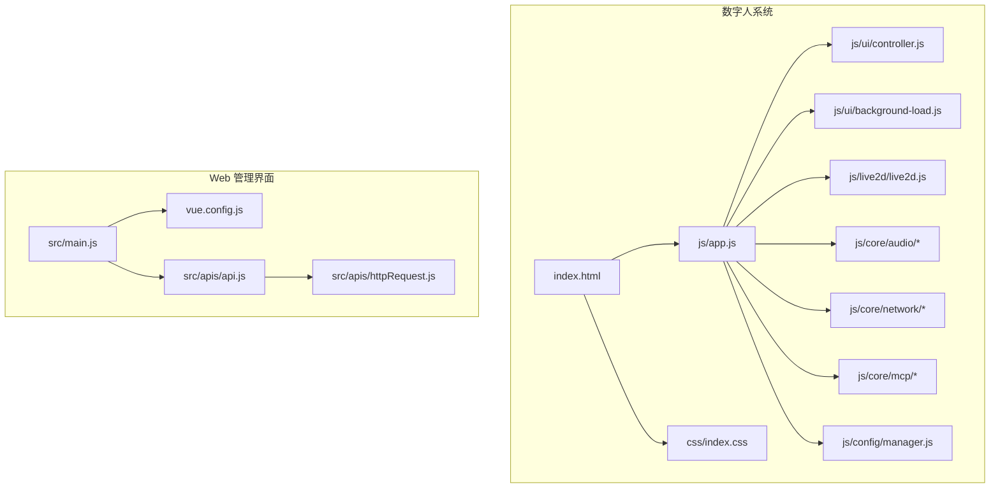
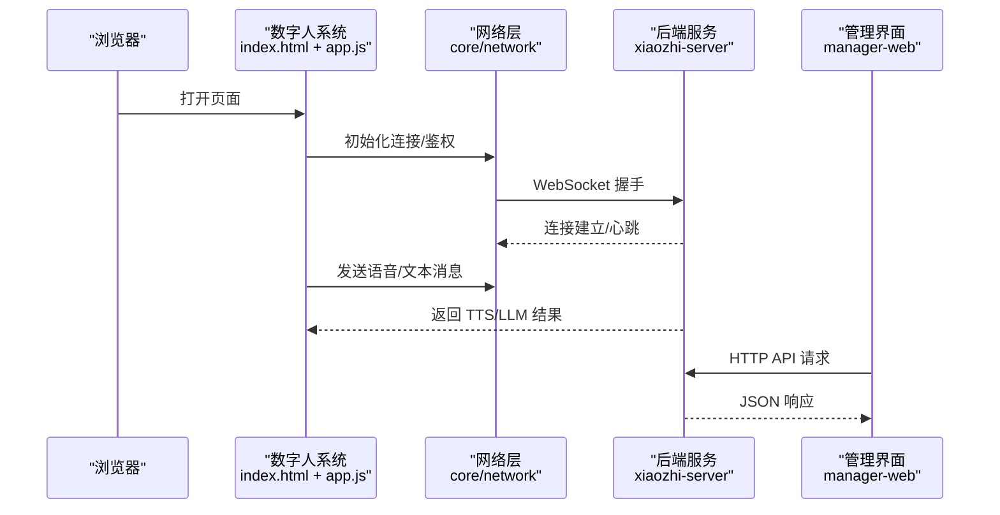
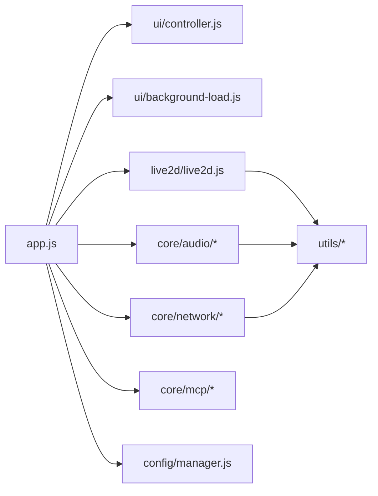

# 浏览器开发者工具

<cite>
**本文引用的文件**   
- [index.html](file://main/digital-human/index.html)
- [app.js](file://main/digital-human/js/app.js)
- [controller.js](file://main/digital-human/js/ui/controller.js)
- [background-load.js](file://main/digital-human/js/ui/background-load.js)
- [live2d.js](file://main/digital-human/js/live2d/live2d.js)
- [logger.js](file://main/digital-human/js/utils/logger.js)
- [blocking-queue.js](file://main/digital-human/js/utils/blocking-queue.js)
- [libopus.js](file://main/digital-human/js/utils/libopus.js)
- [network/](file://main/digital-human/js/core/network/)
- [audio/](file://main/digital-human/js/core/audio/)
- [mcp/](file://main/digital-human/js/core/mcp/)
- [config/manager.js](file://main/digital-human/js/config/manager.js)
- [default-mcp-tools.json](file://main/digital-human/js/config/default-mcp-tools.json)
- [index.css](file://main/digital-human/css/index.css)
- [start.py](file://main/digital-human/start.py)
- [http_server.py](file://main/xiaozhi-server/core/http_server.py)
- [websocket_server.py](file://main/xiaozhi-server/core/websocket_server.py)
- [app.py](file://main/xiaozhi-server/app.py)
- [vue.config.js](file://main/manager-web/vue.config.js)
- [main.js](file://main/manager-web/src/main.js)
- [api.js](file://main/manager-web/src/apis/api.js)
- [httpRequest.js](file://main/manager-web/src/apis/httpRequest.js)
</cite>

## 目录
1. [简介](#简介)
2. [项目结构](#项目结构)
3. [核心组件](#核心组件)
4. [架构总览](#架构总览)
5. [详细组件分析](#详细组件分析)
6. [依赖分析](#依赖分析)
7. [性能考虑](#性能考虑)
8. [故障排查指南](#故障排查指南)
9. [结论](#结论)
10. [附录](#附录)

## 简介
本文件面向 xiaozhi-esp32-server 项目的数字人系统与 Web 管理界面，系统性介绍如何使用 Chrome DevTools（Elements、Console、Network、Performance、Memory、Sources）进行前端调试与问题定位。内容覆盖 DOM 结构与样式调试、JavaScript 调试与日志、WebSocket 通信监控、页面加载与渲染性能分析、内存泄漏检测、断点与调用栈分析，并给出针对数字人系统的专项技巧与常见问题解决方案。

## 项目结构
本项目包含两条主要前端路径：
- 数字人系统（Web 端）：位于 main/digital-human，入口为 index.html，核心逻辑在 js/app.js，UI 控制器在 js/ui/controller.js，Live2D 渲染在 js/live2d/live2d.js，音频处理在 js/core/audio，网络层在 js/core/network，MCP 集成在 js/core/mcp，配置在 js/config。
- Web 管理界面：位于 main/manager-web，基于 Vue，入口为 src/main.js，构建配置 vue.config.js，API 封装在 src/apis。

图表来源 
- [index.html](file://main/digital-human/index.html)
- [app.js](file://main/digital-human/js/app.js)
- [controller.js](file://main/digital-human/js/ui/controller.js)
- [background-load.js](file://main/digital-human/js/ui/background-load.js)
- [live2d.js](file://main/digital-human/js/live2d/live2d.js)
- [index.css](file://main/digital-human/css/index.css)
- [vue.config.js](file://main/manager-web/vue.config.js)
- [main.js](file://main/manager-web/src/main.js)
- [api.js](file://main/manager-web/src/apis/api.js)
- [httpRequest.js](file://main/manager-web/src/apis/httpRequest.js)

章节来源
- [index.html](file://main/digital-human/index.html)
- [app.js](file://main/digital-human/js/app.js)
- [controller.js](file://main/digital-human/js/ui/controller.js)
- [background-load.js](file://main/digital-human/js/ui/background-load.js)
- [live2d.js](file://main/digital-human/js/live2d/live2d.js)
- [index.css](file://main/digital-human/css/index.css)
- [vue.config.js](file://main/manager-web/vue.config.js)
- [main.js](file://main/manager-web/src/main.js)
- [api.js](file://main/manager-web/src/apis/api.js)
- [httpRequest.js](file://main/manager-web/src/apis/httpRequest.js)

## 核心组件
- 数字人系统
  - 应用初始化与生命周期：由 app.js 负责模块加载、事件绑定、状态管理与资源调度。
  - UI 控制器：controller.js 负责用户交互、面板控制与状态同步。
  - 背景加载：background-load.js 用于预加载资源与懒加载策略。
  - Live2D 渲染：live2d.js 驱动模型动画与交互。
  - 音频管线：core/audio 提供录音、编码、播放与缓冲队列（blocking-queue.js）。
  - 网络层：core/network 封装 WebSocket、HTTP 请求与重连机制。
  - MCP 集成：core/mcp 对接模型能力与工具集（default-mcp-tools.json）。
  - 配置管理：config/manager.js 集中管理运行时配置。
  - 样式：css/index.css 定义布局与主题。
- Web 管理界面
  - 入口与构建：main.js 与 vue.config.js 组织应用启动与打包。
  - API 层：api.js 与 httpRequest.js 统一封装后端接口与错误处理。

章节来源
- [app.js](file://main/digital-human/js/app.js)
- [controller.js](file://main/digital-human/js/ui/controller.js)
- [background-load.js](file://main/digital-human/js/ui/background-load.js)
- [live2d.js](file://main/digital-human/js/live2d/live2d.js)
- [blocking-queue.js](file://main/digital-human/js/utils/blocking-queue.js)
- [libopus.js](file://main/digital-human/js/utils/libopus.js)
- [network/](file://main/digital-human/js/core/network/)
- [audio/](file://main/digital-human/js/core/audio/)
- [mcp/](file://main/digital-human/js/core/mcp/)
- [config/manager.js](file://main/digital-human/js/config/manager.js)
- [default-mcp-tools.json](file://main/digital-human/js/config/default-mcp-tools.json)
- [index.css](file://main/digital-human/css/index.css)
- [main.js](file://main/manager-web/src/main.js)
- [vue.config.js](file://main/manager-web/vue.config.js)
- [api.js](file://main/manager-web/src/apis/api.js)
- [httpRequest.js](file://main/manager-web/src/apis/httpRequest.js)

## 架构总览
数字人系统与后端通过 HTTP 与 WebSocket 双向通信；管理界面通过 HTTP API 与后端交互。Chrome DevTools 可用于端到端调试。

图表来源 
- [index.html](file://main/digital-human/index.html)
- [app.js](file://main/digital-human/js/app.js)
- [network/](file://main/digital-human/js/core/network/)
- [http_server.py](file://main/xiaozhi-server/core/http_server.py)
- [websocket_server.py](file://main/xiaozhi-server/core/websocket_server.py)
- [app.py](file://main/xiaozhi-server/app.py)
- [main.js](file://main/manager-web/src/main.js)
- [api.js](file://main/manager-web/src/apis/api.js)
- [httpRequest.js](file://main/manager-web/src/apis/httpRequest.js)

## 详细组件分析

### Elements 面板：DOM 结构与样式调试
- 使用步骤
  - 打开数字人页面，按 F12 进入 Elements。
  - 使用选择器快速定位 Live2D 容器、控制面板与媒体元素。
  - 检查 CSS 规则冲突与计算样式，调整布局与主题。
  - 对关键节点添加/删除类名以验证样式效果。
- 数字人系统要点
  - 关注 Live2D 画布与遮罩层层级关系。
  - 检查音频可视化与控件的可见性、透明度与定位。
  - 验证移动端适配与响应式断点。
- 管理界面要点
  - 检查表格、对话框与表单元素的布局与对齐。
  - 使用 Computed Styles 查看最终样式值，定位第三方库样式覆盖。

章节来源
- [index.html](file://main/digital-human/index.html)
- [index.css](file://main/digital-human/css/index.css)
- [live2d.js](file://main/digital-human/js/live2d/live2d.js)

### Console 面板：JavaScript 调试、日志与错误排查
- 使用步骤
  - 在控制台执行表达式或调用函数，实时观察返回值。
  - 设置条件断点与异常断点，捕获运行时错误。
  - 使用 console.log/console.warn/console.error 输出结构化信息。
- 数字人系统要点
  - 监听音频流事件与解码错误，确认 MediaRecorder 与 AudioContext 状态。
  - 检查网络层重连与消息序列号，避免乱序与丢失。
  - 使用 logger.js 统一日志级别与过滤。
- 管理界面要点
  - 拦截 API 响应与错误码，打印请求参数与响应体。
  - 校验表单输入与路由守卫逻辑。

章节来源
- [logger.js](file://main/digital-human/js/utils/logger.js)
- [app.js](file://main/digital-human/js/app.js)
- [httpRequest.js](file://main/manager-web/src/apis/httpRequest.js)
- [api.js](file://main/manager-web/src/apis/api.js)

### Network 面板：WebSocket 调试与前后端通信
- 使用步骤
  - 切换到 Network 面板，筛选 WS 协议，查看握手与帧数据。
  - 记录消息时间戳，分析延迟与丢包。
  - 过滤特定 URL 或域名，聚焦目标通信。
- 数字人系统要点
  - 验证 WebSocket 连接建立、心跳与重连策略。
  - 检查二进制音频帧与文本指令的顺序与完整性。
  - 结合 Performance 面板分析首帧延迟与卡顿。
- 管理界面要点
  - 检查 HTTP 请求头、Cookie 与跨域配置。
  - 监控分页与列表刷新时的重复请求。

章节来源
- [network/](file://main/digital-human/js/core/network/)
- [http_server.py](file://main/xiaozhi-server/core/http_server.py)
- [websocket_server.py](file://main/xiaozhi-server/core/websocket_server.py)
- [httpRequest.js](file://main/manager-web/src/apis/httpRequest.js)

### Performance 面板：页面加载与渲染瓶颈分析
- 使用步骤
  - 录制页面加载与交互过程，生成性能报告。
  - 分析主线程阻塞、长任务与重排重绘。
  - 识别图片、字体与脚本加载耗时。
- 数字人系统要点
  - 关注 Live2D 模型加载与纹理解压耗时。
  - 检查音频解码与播放线程占用，避免抖动。
  - 优化资源懒加载与缓存策略。
- 管理界面要点
  - 分析路由切换与组件渲染耗时。
  - 减少不必要的重渲染与大型对象序列化。

章节来源
- [live2d.js](file://main/digital-human/js/live2d/live2d.js)
- [background-load.js](file://main/digital-human/js/ui/background-load.js)
- [app.js](file://main/digital-human/js/app.js)

### Memory 面板：堆快照与内存泄漏检测
- 使用步骤
  - 拍摄堆快照，比较不同时间点的内存变化。
  - 查找保留树，定位未释放引用与闭包。
  - 监控事件监听器与定时器是否被清理。
- 数字人系统要点
  - 检查音频上下文与解码器实例的生命周期。
  - 确保 WebSocket 关闭时移除回调与缓冲区。
  - 避免全局变量累积与循环引用。
- 管理界面要点
  - 检查 Vuex/Pinia 状态与组件销毁后的清理。
  - 监控大数组与图片对象的释放。

章节来源
- [app.js](file://main/digital-human/js/app.js)
- [blocking-queue.js](file://main/digital-human/js/utils/blocking-queue.js)
- [libopus.js](file://main/digital-human/js/utils/libopus.js)

### Sources 面板：断点、变量监视与调用栈
- 使用步骤
  - 在源码中设置行断点与条件断点。
  - 使用 Call Stack 回溯函数调用链。
  - 在 Watch 面板监视关键变量与对象属性。
- 数字人系统要点
  - 在音频采集、编码与播放的关键路径设置断点。
  - 监控网络层消息收发与状态机转换。
  - 检查 Live2D 动画帧更新与事件分发。
- 管理界面要点
  - 在 API 请求与响应处理处设置断点。
  - 跟踪路由跳转与权限校验流程。

章节来源
- [app.js](file://main/digital-human/js/app.js)
- [controller.js](file://main/digital-human/js/ui/controller.js)
- [network/](file://main/digital-human/js/core/network/)
- [api.js](file://main/manager-web/src/apis/api.js)

### 数字人系统专项调试技巧
- 音频链路调试
  - 使用 MediaRecorder 与 AudioContext 的状态检查，确认权限与采样率。
  - 利用 blocking-queue.js 的队列长度与消费速率判断是否积压。
  - 通过 libopus.js 的编码器状态与输出大小评估压缩效率。
- 网络链路调试
  - 在 WebSocket 连接失败时检查证书、代理与跨域。
  - 使用 Network 面板的“保存全部 HAR”导出完整会话。
- 渲染与交互
  - 在 Live2D 初始化后检查模型与材质加载完成事件。
  - 使用 Elements 面板临时禁用动画以提升调试效率。

章节来源
- [blocking-queue.js](file://main/digital-human/js/utils/blocking-queue.js)
- [libopus.js](file://main/digital-human/js/utils/libopus.js)
- [live2d.js](file://main/digital-human/js/live2d/live2d.js)
- [network/](file://main/digital-human/js/core/network/)
- [audio/](file://main/digital-human/js/core/audio/)

### Web 管理界面专项调试技巧
- API 调试
  - 在 httpRequest.js 中统一打印请求与响应，便于定位参数错误。
  - 使用 api.js 的分层方法快速复现问题。
- 构建与部署
  - 通过 vue.config.js 调整开发服务器与代理配置。
  - 检查静态资源路径与缓存策略。

章节来源
- [httpRequest.js](file://main/manager-web/src/apis/httpRequest.js)
- [api.js](file://main/manager-web/src/apis/api.js)
- [vue.config.js](file://main/manager-web/vue.config.js)

## 依赖分析
数字人系统的前端模块之间存在明确的依赖关系，合理拆分有助于独立调试与性能优化。

图表来源 
- [app.js](file://main/digital-human/js/app.js)
- [controller.js](file://main/digital-human/js/ui/controller.js)
- [background-load.js](file://main/digital-human/js/ui/background-load.js)
- [live2d.js](file://main/digital-human/js/live2d/live2d.js)
- [audio/](file://main/digital-human/js/core/audio/)
- [network/](file://main/digital-human/js/core/network/)
- [mcp/](file://main/digital-human/js/core/mcp/)
- [config/manager.js](file://main/digital-human/js/config/manager.js)

章节来源
- [app.js](file://main/digital-human/js/app.js)
- [controller.js](file://main/digital-human/js/ui/controller.js)
- [background-load.js](file://main/digital-human/js/ui/background-load.js)
- [live2d.js](file://main/digital-human/js/live2d/live2d.js)
- [audio/](file://main/digital-human/js/core/audio/)
- [network/](file://main/digital-human/js/core/network/)
- [mcp/](file://main/digital-human/js/core/mcp/)
- [config/manager.js](file://main/digital-human/js/config/manager.js)

## 性能考虑
- 首屏优化
  - 按需加载 Live2D 模型与音频库，减少初始包体积。
  - 启用 Gzip/Brotli 与 CDN 加速静态资源。
- 渲染优化
  - 合并重排重绘，使用 requestAnimationFrame 平滑动画。
  - 避免在主线程执行重型计算，必要时使用 Web Worker。
- 网络优化
  - 使用连接池与请求去重，减少并发压力。
  - 合理设置缓存头与版本化资源。
- 内存优化
  - 及时释放音频上下文与解码器实例。
  - 避免闭包持有大对象引用。

[本节为通用指导，不直接分析具体文件]

## 故障排查指南
- 常见问题
  - 音频无法播放：检查浏览器权限、AudioContext 状态与 MIME 类型支持。
  - WebSocket 连接失败：核对端口、协议与跨域配置，查看 Network 面板握手失败原因。
  - Live2D 模型不显示：确认模型与材质路径正确，检查资源加载状态。
  - 管理界面 API 报错：检查请求头、鉴权令牌与后端路由。
- 定位方法
  - 使用 Console 的错误堆栈快速定位异常位置。
  - 在 Sources 面板设置断点逐步执行，观察变量变化。
  - 使用 Performance 与 Memory 面板对比基线与问题场景。
- 恢复策略
  - 实现重试与降级机制，保证用户体验。
  - 增加详细日志与埋点，便于远程问题复现。

章节来源
- [logger.js](file://main/digital-human/js/utils/logger.js)
- [httpRequest.js](file://main/manager-web/src/apis/httpRequest.js)
- [live2d.js](file://main/digital-human/js/live2d/live2d.js)
- [network/](file://main/digital-human/js/core/network/)

## 结论
通过系统化使用 Chrome DevTools，可以在 xiaozhi-esp32-server 的数字人系统与 Web 管理界面中高效定位问题、优化性能与提升稳定性。建议将调试流程标准化，结合日志与监控形成闭环，持续改进用户体验。

[本节为总结，不直接分析具体文件]

## 附录
- 实用快捷键
  - F12：打开 DevTools
  - Ctrl+Shift+I：打开控制台
  - Ctrl+Shift+C：元素选择器
  - Ctrl+Shift+M：设备模拟
- 常用命令
  - $0 获取当前选中元素
  - getEventListeners($0) 查看事件监听器
  - performance.now() 测量时间
  - memory.getHeapSnapshot() 生成堆快照

[本节为补充信息，不直接分析具体文件]