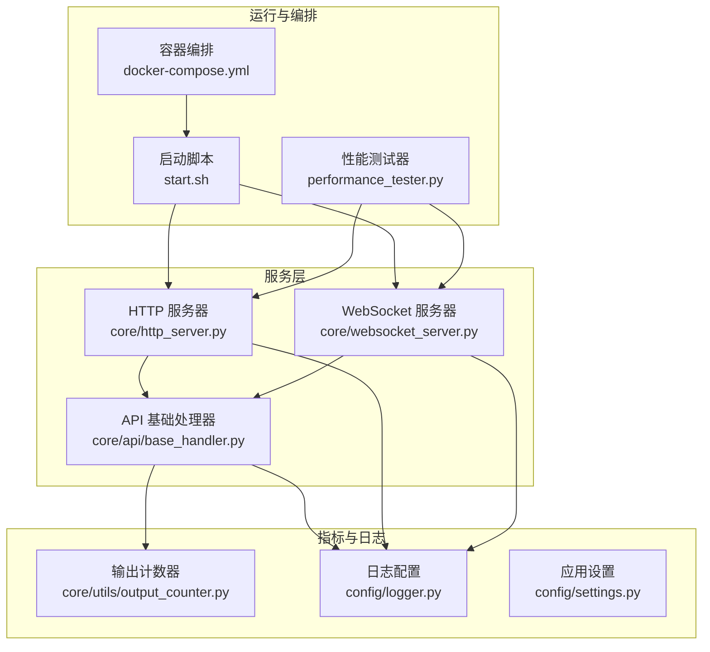
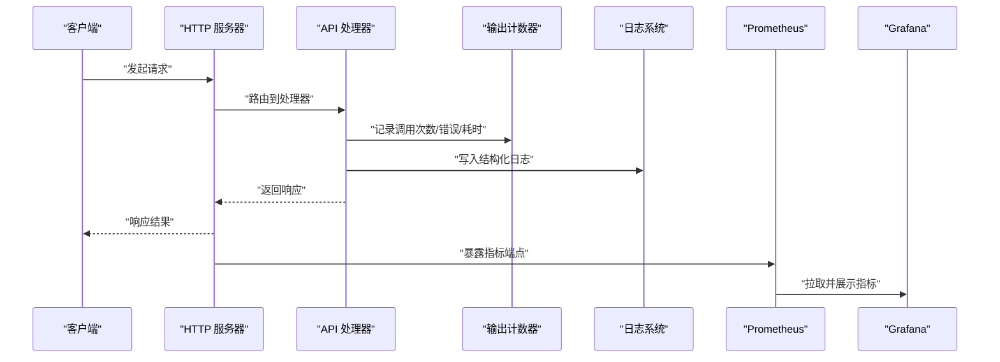
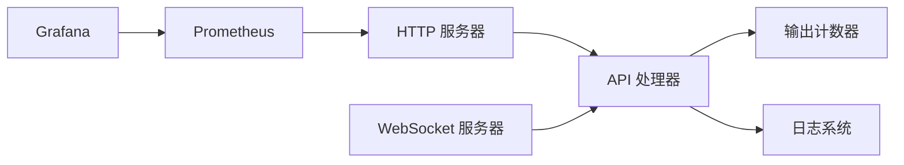

# 监控工具

<cite>
**本文引用的文件**   
- [app.py](file://main/xiaozhi-server/app.py)
- [logger.py](file://main/xiaozhi-server/config/logger.py)
- [settings.py](file://main/xiaozhi-server/config/settings.py)
- [output_counter.py](file://main/xiaozhi-server/core/utils/output_counter.py)
- [http_server.py](file://main/xiaozhi-server/core/http_server.py)
- [websocket_server.py](file://main/xiaozhi-server/core/websocket_server.py)
- [base_handler.py](file://main/xiaozhi-server/core/api/base_handler.py)
- [performance_tester.py](file://main/xiaozhi-server/performance_tester.py)
- [docker-compose.yml](file://main/xiaozhi-server/docker-compose.yml)
- [start.sh](file://main/xiaozhi-server/start.sh)
</cite>

## 目录
1. [简介](#简介)
2. [项目结构](#项目结构)
3. [核心组件](#核心组件)
4. [架构总览](#架构总览)
5. [详细组件分析](#详细组件分析)
6. [依赖关系分析](#依赖关系分析)
7. [性能考量](#性能考量)
8. [故障诊断指南](#故障诊断指南)
9. [结论](#结论)
10. [附录](#附录)

## 简介
本文件面向 xiaozhi-esp32-server 的运维与开发团队，系统性介绍项目的监控能力与健康检查方法。内容涵盖：
- 内置日志系统的使用、级别配置、轮转策略与远程收集方案
- 输出计数器（output_counter）在 API 调用次数、错误率、响应时间统计中的应用
- 外部监控系统（Prometheus、Grafana）集成与可视化展示
- 健康检查接口的设计与使用
- 告警机制配置与通知方式
- 性能指标监控方案与阈值建议
- 生产环境监控最佳实践与自动化技巧

## 项目结构
xiaozhi-esp32-server 的核心监控相关代码集中在以下位置：
- 配置与启动：config/settings.py、config/logger.py、start.sh
- HTTP/WebSocket 服务：core/http_server.py、core/websocket_server.py
- API 基础处理：core/api/base_handler.py
- 指标计数：core/utils/output_counter.py
- 性能测试：performance_tester.py
- 容器编排：docker-compose.yml

图表来源
- [http_server.py](file://main/xiaozhi-server/core/http_server.py)
- [websocket_server.py](file://main/xiaozhi-server/core/websocket_server.py)
- [base_handler.py](file://main/xiaozhi-server/core/api/base_handler.py)
- [output_counter.py](file://main/xiaozhi-server/core/utils/output_counter.py)
- [logger.py](file://main/xiaozhi-server/config/logger.py)
- [settings.py](file://main/xiaozhi-server/config/settings.py)
- [start.sh](file://main/xiaozhi-server/start.sh)
- [docker-compose.yml](file://main/xiaozhi-server/docker-compose.yml)
- [performance_tester.py](file://main/xiaozhi-server/performance_tester.py)

章节来源
- [app.py](file://main/xiaozhi-server/app.py)
- [http_server.py](file://main/xiaozhi-server/core/http_server.py)
- [websocket_server.py](file://main/xiaozhi-server/core/websocket_server.py)
- [base_handler.py](file://main/xiaozhi-server/core/api/base_handler.py)
- [output_counter.py](file://main/xiaozhi-server/core/utils/output_counter.py)
- [logger.py](file://main/xiaozhi-server/config/logger.py)
- [settings.py](file://main/xiaozhi-server/config/settings.py)
- [start.sh](file://main/xiaozhi-server/start.sh)
- [docker-compose.yml](file://main/xiaozhi-server/docker-compose.yml)
- [performance_tester.py](file://main/xiaozhi-server/performance_tester.py)

## 核心组件
- 日志系统（logger.py）
  - 负责日志级别、输出目标（控制台/文件）、格式与轮转策略的配置
  - 支持按大小或时间进行日志轮转，便于集中采集与归档
- 应用设置（settings.py）
  - 提供运行时配置项（如端口、调试开关、模块开关等），可被日志与监控组件读取
- 输出计数器（output_counter.py）
  - 提供统一的计数器与计时器，用于统计 API 调用次数、错误数、耗时分布
  - 可通过 HTTP 端点暴露 Prometheus 兼容指标
- HTTP/WebSocket 服务（http_server.py、websocket_server.py）
  - 承载请求生命周期，接入日志与指标埋点
  - 提供健康检查接口（如 /health、/ready）
- API 基础处理器（base_handler.py）
  - 统一异常捕获、响应封装、指标记录入口
- 性能测试器（performance_tester.py）
  - 提供压测脚本与基准指标，辅助容量规划与回归验证

章节来源
- [logger.py](file://main/xiaozhi-server/config/logger.py)
- [settings.py](file://main/xiaozhi-server/config/settings.py)
- [output_counter.py](file://main/xiaozhi-server/core/utils/output_counter.py)
- [http_server.py](file://main/xiaozhi-server/core/http_server.py)
- [websocket_server.py](file://main/xiaozhi-server/core/websocket_server.py)
- [base_handler.py](file://main/xiaozhi-server/core/api/base_handler.py)
- [performance_tester.py](file://main/xiaozhi-server/performance_tester.py)

## 架构总览
下图展示了从请求进入、处理到指标与日志输出的整体流程，以及对外部监控系统的对接点。

图表来源
- [http_server.py](file://main/xiaozhi-server/core/http_server.py)
- [base_handler.py](file://main/xiaozhi-server/core/api/base_handler.py)
- [output_counter.py](file://main/xiaozhi-server/core/utils/output_counter.py)
- [logger.py](file://main/xiaozhi-server/config/logger.py)

## 详细组件分析

### 日志系统（logger.py）
- 功能要点
  - 日志级别：支持 DEBUG/INFO/WARNING/ERROR 等分级，便于按需过滤
  - 输出目标：控制台与文件双输出，便于本地调试与线上采集
  - 轮转策略：按文件大小或时间间隔轮转，避免单文件过大
  - 格式化：结构化字段（时间、级别、模块、消息）便于解析
- 使用建议
  - 生产环境默认 INFO 级别，关键路径开启 DEBUG
  - 结合日志采集器（如 Filebeat/Fluent Bit）将文件推送到 ELK/Loki
  - 对敏感信息脱敏后再输出

章节来源
- [logger.py](file://main/xiaozhi-server/config/logger.py)

### 应用设置（settings.py）
- 功能要点
  - 集中管理运行参数（端口、调试开关、模块开关等）
  - 为日志、监控、业务模块提供统一配置源
- 使用建议
  - 通过环境变量或配置文件注入，避免硬编码
  - 区分 dev/staging/prod 多套配置

章节来源
- [settings.py](file://main/xiaozhi-server/config/settings.py)

### 输出计数器（output_counter.py）
- 功能要点
  - 计数器：累计请求总数、成功数、失败数
  - 计时器：记录请求耗时分布（平均、分位）
  - 标签维度：可按接口、状态码、模块等维度聚合
  - 指标暴露：提供 /metrics 端点，兼容 Prometheus 抓取
- 使用建议
  - 在 API 处理器中统一埋点，确保口径一致
  - 合理选择分位值（P50/P90/P99）评估延迟
  - 对热点接口单独打点，避免噪声干扰

章节来源
- [output_counter.py](file://main/xiaozhi-server/core/utils/output_counter.py)

### HTTP/WebSocket 服务（http_server.py、websocket_server.py）
- 功能要点
  - 请求生命周期管理：接收、路由、处理、响应
  - 健康检查：/health（存活）、/ready（就绪）
  - 指标暴露：/metrics（Prometheus 格式）
  - 日志接入：请求开始/结束、异常堆栈、耗时
- 使用建议
  - 健康检查需区分存活与就绪，配合负载均衡探针
  - 指标端点限制访问来源，避免泄露内部细节

章节来源
- [http_server.py](file://main/xiaozhi-server/core/http_server.py)
- [websocket_server.py](file://main/xiaozhi-server/core/websocket_server.py)

### API 基础处理器（base_handler.py）
- 功能要点
  - 统一异常捕获与错误码映射
  - 响应体封装，包含状态、数据、追踪 ID
  - 指标埋点：调用次数、错误率、耗时
- 使用建议
  - 所有业务处理器继承基类，保证一致性
  - 对第三方调用增加超时与重试策略

章节来源
- [base_handler.py](file://main/xiaozhi-server/core/api/base_handler.py)

### 性能测试器（performance_tester.py）
- 功能要点
  - 模拟并发请求，生成 QPS、延迟、错误率等指标
  - 输出报告，辅助容量规划与回归验证
- 使用建议
  - 定期执行基准测试，对比历史数据发现退化
  - 结合 CI/CD 自动触发，纳入质量门禁

章节来源
- [performance_tester.py](file://main/xiaozhi-server/performance_tester.py)

## 依赖关系分析
- 组件耦合
  - API 处理器依赖输出计数器与日志系统
  - HTTP/WebSocket 服务依赖 API 处理器与日志系统
  - 启动脚本与编排文件驱动服务进程
- 外部依赖
  - Prometheus 抓取 /metrics
  - Grafana 展示仪表盘
  - 日志采集器（可选）推送至集中式存储

图表来源
- [base_handler.py](file://main/xiaozhi-server/core/api/base_handler.py)
- [output_counter.py](file://main/xiaozhi-server/core/utils/output_counter.py)
- [logger.py](file://main/xiaozhi-server/config/logger.py)
- [http_server.py](file://main/xiaozhi-server/core/http_server.py)
- [websocket_server.py](file://main/xiaozhi-server/core/websocket_server.py)

章节来源
- [base_handler.py](file://main/xiaozhi-server/core/api/base_handler.py)
- [output_counter.py](file://main/xiaozhi-server/core/utils/output_counter.py)
- [logger.py](file://main/xiaozhi-server/config/logger.py)
- [http_server.py](file://main/xiaozhi-server/core/http_server.py)
- [websocket_server.py](file://main/xiaozhi-server/core/websocket_server.py)

## 性能考量
- 指标粒度
  - 接口级、状态码级、模块级多维度聚合
  - 避免过度细分导致指标爆炸
- 采样与缓冲
  - 对高频指标采用滑动窗口或采样降低开销
  - 异步写入日志，减少阻塞
- 资源占用
  - 监控与日志不应成为瓶颈，必要时限流降级
- 容量规划
  - 基于压测结果设定副本数与资源配额

[本节为通用指导，不直接分析具体文件]

## 故障诊断指南
- 快速定位
  - 查看 /health 与 /ready 判断服务状态
  - 检查 /metrics 中的错误率与延迟分位
  - 检索 ERROR/WARN 级别日志，关注异常堆栈
- 常见问题
  - 连接超时：检查下游依赖与网络连通性
  - 内存泄漏：观察内存曲线与 GC 行为
  - 线程池耗尽：监控队列长度与任务堆积
- 排查步骤
  - 复现问题 -> 抓取指标与日志 -> 定位根因 -> 修复验证

章节来源
- [http_server.py](file://main/xiaozhi-server/core/http_server.py)
- [base_handler.py](file://main/xiaozhi-server/core/api/base_handler.py)
- [logger.py](file://main/xiaozhi-server/config/logger.py)

## 结论
通过内置日志系统与输出计数器，结合 Prometheus/Grafana 的外部监控体系，可实现对 xiaozhi-esp32-server 的全链路可观测性。建议在生产环境启用结构化日志、指标暴露与健康检查，并建立告警与自动化巡检流程，保障服务稳定性与可维护性。

[本节为总结，不直接分析具体文件]

## 附录

### 监控与告警配置建议
- Prometheus
  - 抓取间隔：15s~30s
  - 保留策略：根据磁盘与成本调整
- Grafana
  - 仪表盘：QPS、错误率、延迟分位、资源使用
  - 模板化面板，便于多实例复用
- 告警规则
  - 错误率 > 阈值（如 5%）持续 N 分钟
  - P99 延迟 > 阈值（如 500ms）持续 N 分钟
  - 服务不可用（/health 失败）立即告警
- 通知渠道
  - 企业微信/钉钉/邮件/短信

[本节为通用指导，不直接分析具体文件]

### 健康检查接口说明
- /health：存活检查，返回服务是否存活
- /ready：就绪检查，返回依赖是否就绪（数据库、缓存等）
- /metrics：Prometheus 指标端点

章节来源
- [http_server.py](file://main/xiaozhi-server/core/http_server.py)

### 启动与编排
- start.sh：服务启动脚本，加载配置、初始化模块、启动 HTTP/WebSocket
- docker-compose.yml：定义服务镜像、端口映射、环境变量、卷挂载

章节来源
- [start.sh](file://main/xiaozhi-server/start.sh)
- [docker-compose.yml](file://main/xiaozhi-server/docker-compose.yml)