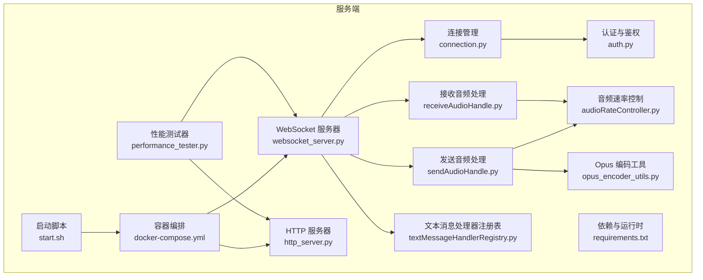
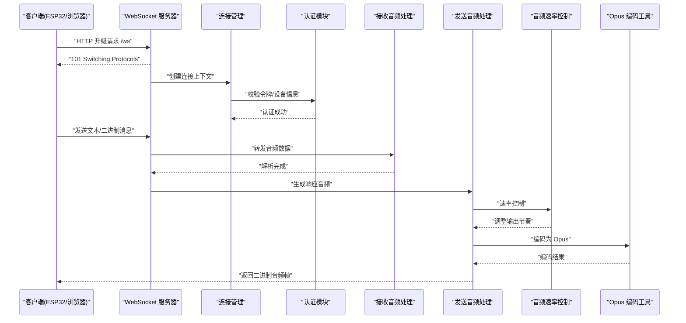
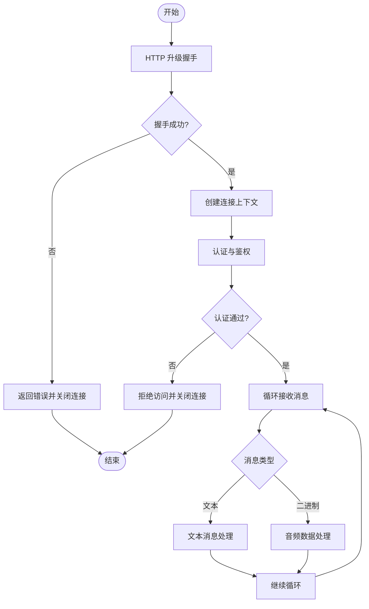
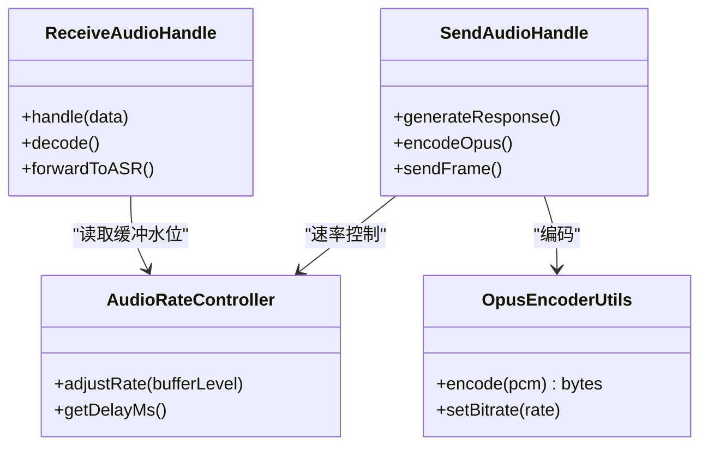
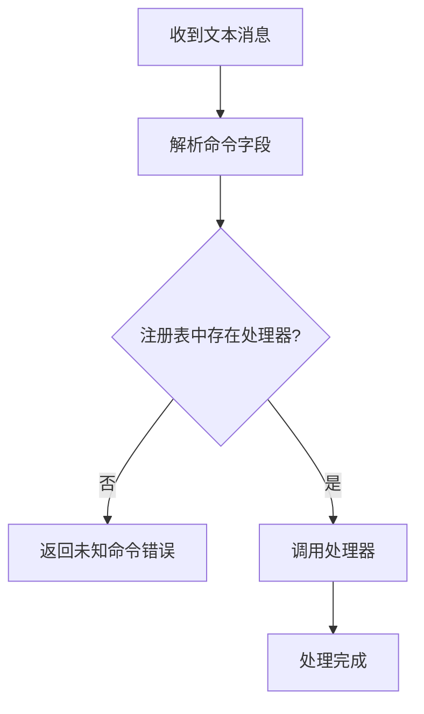
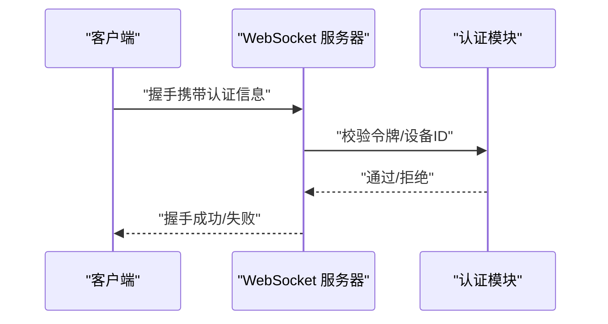
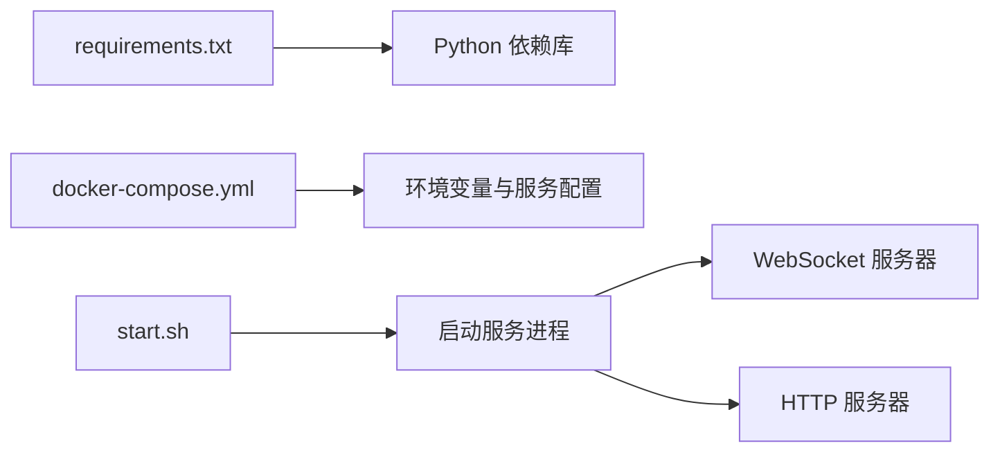

# 网络分析工具

<cite>
**本文档引用的文件**   
- [websocket_server.py](file://main/xiaozhi-server/core/websocket_server.py)
- [connection.py](file://main/xiaozhi-server/core/connection.py)
- [http_server.py](file://main/xiaozhi-server/core/http_server.py)
- [auth.py](file://main/xiaozhi-server/core/auth.py)
- [receiveAudioHandle.py](file://main/xiaozhi-server/core/handle/receiveAudioHandle.py)
- [sendAudioHandle.py](file://main/xiaozhi-server/core/handle/sendAudioHandle.py)
- [textMessageHandlerRegistry.py](file://main/xiaozhi-server/core/handle/textMessageHandlerRegistry.py)
- [audioRateController.py](file://main/xiaozhi-server/core/utils/audioRateController.py)
- [opus_encoder_utils.py](file://main/xiaozhi-server/core/utils/opus_encoder_utils.py)
- [performance_tester.py](file://main/xiaozhi-server/performance_tester.py)
- [requirements.txt](file://main/xiaozhi-server/requirements.txt)
- [docker-compose.yml](file://main/xiaozhi-server/docker-compose.yml)
- [start.sh](file://main/xiaozhi-server/start.sh)
</cite>

## 目录
1. [简介](#简介)
2. [项目结构](#项目结构)
3. [核心组件](#核心组件)
4. [架构总览](#架构总览)
5. [详细组件分析](#详细组件分析)
6. [依赖关系分析](#依赖关系分析)
7. [性能考量](#性能考量)
8. [故障排查指南](#故障排查指南)
9. [结论](#结论)
10. [附录](#附录)

## 简介
本文件面向 xiaozhi-esp32-server 的网络通信调试与排障，聚焦 WebSocket、MQTT（如集成）以及通用网络监控技术。内容涵盖：
- 使用 Wireshark 捕获与分析 WebSocket 数据包（握手、消息帧、错误处理）
- 使用 tcpdump 进行实时流量监控与过滤规则配置
- MQTT 抓包分析方法（主题订阅、发布、QoS 验证）
- 浏览器开发者工具 Network 面板调试前端 WebSocket
- 网络延迟测量、丢包率分析与带宽监控方案
- 常见网络问题诊断步骤与解决方案（连接超时、消息丢失、协议不兼容）

## 项目结构
xiaozhi-esp32-server 的核心网络能力集中在 Python 服务端模块中，主要涉及：
- WebSocket 服务器与连接管理
- HTTP API 服务
- 音频收发处理与编码工具
- 性能测试与运行脚本

图表来源
- [websocket_server.py](file://main/xiaozhi-server/core/websocket_server.py)
- [connection.py](file://main/xiaozhi-server/core/connection.py)
- [http_server.py](file://main/xiaozhi-server/core/http_server.py)
- [auth.py](file://main/xiaozhi-server/core/auth.py)
- [receiveAudioHandle.py](file://main/xiaozhi-server/core/handle/receiveAudioHandle.py)
- [sendAudioHandle.py](file://main/xiaozhi-server/core/handle/sendAudioHandle.py)
- [textMessageHandlerRegistry.py](file://main/xiaozhi-server/core/handle/textMessageHandlerRegistry.py)
- [audioRateController.py](file://main/xiaozhi-server/core/utils/audioRateController.py)
- [opus_encoder_utils.py](file://main/xiaozhi-server/core/utils/opus_encoder_utils.py)
- [performance_tester.py](file://main/xiaozhi-server/performance_tester.py)
- [requirements.txt](file://main/xiaozhi-server/requirements.txt)
- [docker-compose.yml](file://main/xiaozhi-server/docker-compose.yml)
- [start.sh](file://main/xiaozhi-server/start.sh)

章节来源
- [websocket_server.py](file://main/xiaozhi-server/core/websocket_server.py)
- [connection.py](file://main/xiaozhi-server/core/connection.py)
- [http_server.py](file://main/xiaozhi-server/core/http_server.py)
- [auth.py](file://main/xiaozhi-server/core/auth.py)
- [receiveAudioHandle.py](file://main/xiaozhi-server/core/handle/receiveAudioHandle.py)
- [sendAudioHandle.py](file://main/xiaozhi-server/core/handle/sendAudioHandle.py)
- [textMessageHandlerRegistry.py](file://main/xiaozhi-server/core/handle/textMessageHandlerRegistry.py)
- [audioRateController.py](file://main/xiaozhi-server/core/utils/audioRateController.py)
- [opus_encoder_utils.py](file://main/xiaozhi-server/core/utils/opus_encoder_utils.py)
- [performance_tester.py](file://main/xiaozhi-server/performance_tester.py)
- [requirements.txt](file://main/xiaozhi-server/requirements.txt)
- [docker-compose.yml](file://main/xiaozhi-server/docker-compose.yml)
- [start.sh](file://main/xiaozhi-server/start.sh)

## 核心组件
- WebSocket 服务器：负责建立、维护与关闭 WebSocket 连接，路由消息到具体处理器。
- 连接管理：封装连接生命周期、心跳、重连策略与资源清理。
- HTTP 服务器：提供 REST API，用于设备注册、OTA 升级、状态查询等。
- 音频处理：接收端解码与播放队列管理，发送端编码与速率控制。
- 文本消息处理：基于注册表的命令分发与业务逻辑执行。
- 认证与鉴权：对连接或请求进行身份校验与权限控制。
- 性能测试：模拟客户端行为，评估吞吐、时延与稳定性。

章节来源
- [websocket_server.py](file://main/xiaozhi-server/core/websocket_server.py)
- [connection.py](file://main/xiaozhi-server/core/connection.py)
- [http_server.py](file://main/xiaozhi-server/core/http_server.py)
- [receiveAudioHandle.py](file://main/xiaozhi-server/core/handle/receiveAudioHandle.py)
- [sendAudioHandle.py](file://main/xiaozhi-server/core/handle/sendAudioHandle.py)
- [textMessageHandlerRegistry.py](file://main/xiaozhi-server/core/handle/textMessageHandlerRegistry.py)
- [auth.py](file://main/xiaozhi-server/core/auth.py)
- [performance_tester.py](file://main/xiaozhi-server/performance_tester.py)

## 架构总览
下图展示了从客户端到服务端的关键交互路径，包括 WebSocket 握手、消息路由、音频编解码与速率控制。

图表来源
- [websocket_server.py](file://main/xiaozhi-server/core/websocket_server.py)
- [connection.py](file://main/xiaozhi-server/core/connection.py)
- [auth.py](file://main/xiaozhi-server/core/auth.py)
- [receiveAudioHandle.py](file://main/xiaozhi-server/core/handle/receiveAudioHandle.py)
- [sendAudioHandle.py](file://main/xiaozhi-server/core/handle/sendAudioHandle.py)
- [audioRateController.py](file://main/xiaozhi-server/core/utils/audioRateController.py)
- [opus_encoder_utils.py](file://main/xiaozhi-server/core/utils/opus_encoder_utils.py)

## 详细组件分析

### WebSocket 连接与消息流
- 连接建立：客户端发起 HTTP 升级请求，服务端完成握手并创建连接上下文。
- 消息路由：文本消息通过注册表分发到对应处理器；二进制消息进入音频处理管线。
- 错误处理：握手失败、认证失败、消息格式错误均会触发相应错误码与断开流程。

图表来源
- [websocket_server.py](file://main/xiaozhi-server/core/websocket_server.py)
- [connection.py](file://main/xiaozhi-server/core/connection.py)
- [auth.py](file://main/xiaozhi-server/core/auth.py)

章节来源
- [websocket_server.py](file://main/xiaozhi-server/core/websocket_server.py)
- [connection.py](file://main/xiaozhi-server/core/connection.py)
- [auth.py](file://main/xiaozhi-server/core/auth.py)

### 音频接收与发送处理
- 接收端：解析二进制帧，解码为 PCM/语音格式，送入下游 ASR 或对话流程。
- 发送端：根据业务逻辑生成语音，经 Opus 编码后按速率控制发送，避免抖动与卡顿。
- 速率控制：依据网络状况与缓冲区水位动态调整发送频率。

图表来源
- [receiveAudioHandle.py](file://main/xiaozhi-server/core/handle/receiveAudioHandle.py)
- [sendAudioHandle.py](file://main/xiaozhi-server/core/handle/sendAudioHandle.py)
- [audioRateController.py](file://main/xiaozhi-server/core/utils/audioRateController.py)
- [opus_encoder_utils.py](file://main/xiaozhi-server/core/utils/opus_encoder_utils.py)

章节来源
- [receiveAudioHandle.py](file://main/xiaozhi-server/core/handle/receiveAudioHandle.py)
- [sendAudioHandle.py](file://main/xiaozhi-server/core/handle/sendAudioHandle.py)
- [audioRateController.py](file://main/xiaozhi-server/core/utils/audioRateController.py)
- [opus_encoder_utils.py](file://main/xiaozhi-server/core/utils/opus_encoder_utils.py)

### 文本消息处理器注册表
- 注册机制：集中式注册表将不同命令映射到具体处理器，便于扩展与维护。
- 分发流程：收到文本消息后，解析命令字段，查找处理器并执行。

图表来源
- [textMessageHandlerRegistry.py](file://main/xiaozhi-server/core/handle/textMessageHandlerRegistry.py)

章节来源
- [textMessageHandlerRegistry.py](file://main/xiaozhi-server/core/handle/textMessageHandlerRegistry.py)

### 认证与鉴权
- 连接级认证：在 WebSocket 握手阶段校验令牌或设备标识。
- 请求级鉴权：对后续 API 或敏感操作进行权限检查。

图表来源
- [auth.py](file://main/xiaozhi-server/core/auth.py)
- [websocket_server.py](file://main/xiaozhi-server/core/websocket_server.py)

章节来源
- [auth.py](file://main/xiaozhi-server/core/auth.py)
- [websocket_server.py](file://main/xiaozhi-server/core/websocket_server.py)

### 性能测试与基准
- 功能：模拟客户端并发连接、持续发送/接收音频帧，统计吞吐与时延。
- 指标：连接成功率、平均 RTT、P95/P99 时延、丢包率、CPU/内存占用。

章节来源
- [performance_tester.py](file://main/xiaozhi-server/performance_tester.py)

## 依赖关系分析
- 运行时依赖：Python 库与音视频编解码库由 requirements.txt 管理。
- 部署依赖：docker-compose.yml 定义服务编排与环境变量。
- 启动流程：start.sh 初始化环境并拉起服务。

图表来源
- [requirements.txt](file://main/xiaozhi-server/requirements.txt)
- [docker-compose.yml](file://main/xiaozhi-server/docker-compose.yml)
- [start.sh](file://main/xiaozhi-server/start.sh)

章节来源
- [requirements.txt](file://main/xiaozhi-server/requirements.txt)
- [docker-compose.yml](file://main/xiaozhi-server/docker-compose.yml)
- [start.sh](file://main/xiaozhi-server/start.sh)

## 性能考量
- 网络层优化：合理设置 TCP 缓冲区、启用 Nagle 禁用与 KeepAlive，减少小包开销。
- 应用层优化：音频帧大小与编码参数调优，速率控制器自适应网络抖动。
- 资源管理：连接池与线程池限制，避免内存泄漏与 CPU 飙升。
- 监控指标：RTT、吞吐、丢包率、重传率、缓冲区水位、编码器耗时。

[本节为通用指导，无需引用具体文件]

## 故障排查指南

### 使用 Wireshark 捕获与分析 WebSocket
- 捕获接口选择：选择服务器网卡或容器桥接接口。
- 过滤器建议：
  - 仅看 WebSocket：tcp.port == 端口号 and (tcp.flags.syn==1 or tcp.flags.ack==1)
  - 只看握手：tcp.port == 端口号 and http.request.method == "GET" and http.request.uri contains "/ws"
  - 只看二进制帧：tcp.port == 端口号 and websocket
- 分析要点：
  - 握手阶段：确认 101 Switching Protocols 响应头是否包含 Sec-WebSocket-Accept。
  - 消息帧：查看 opcode（文本/二进制）、掩码、负载长度与内容。
  - 错误处理：观察异常关闭帧（opcode=8）与原因码。

章节来源
- [websocket_server.py](file://main/xiaozhi-server/core/websocket_server.py)

### 使用 tcpdump 实时监控与过滤
- 基本命令：
  - 捕获所有流量：sudo tcpdump -i any -w capture.pcap
  - 指定端口：sudo tcpdump -i any port 端口号 -w ws.pcap
  - 仅看握手：sudo tcpdump -i any port 端口号 and tcp[tcpflags] & (syn|ack) != 0
- 常用过滤：
  - 只看 WebSocket 流量：port 端口号 and (tcp.flags.syn==1 or tcp.flags.ack==1)
  - 只看特定源/目的 IP：src ip 地址 or dst ip 地址
- 导出与分析：
  - 使用 wireshark -r capture.pcap 打开 pcap 文件进行深度分析。

章节来源
- [websocket_server.py](file://main/xiaozhi-server/core/websocket_server.py)

### MQTT 抓包分析方法（如集成）
- 捕获过滤器：
  - 只看 MQTT：mqtt
  - 指定端口：port 1883 or port 8883
- 分析要点：
  - CONNECT/CONNACK：认证与 QoS 协商
  - SUBSCRIBE/SUBACK：主题订阅与确认
  - PUBLISH/PUBACK/PUBREC/PUBREL/PUBCOMP：QoS 级别与确认流程
  - DISCONNECT：会话终止
- QoS 验证：
  - QoS 0：无确认，可能丢包
  - QoS 1：至少一次，可能出现重复
  - QoS 2：恰好一次，完整握手

章节来源
- [websocket_server.py](file://main/xiaozhi-server/core/websocket_server.py)

### 浏览器开发者工具 Network 面板调试
- 打开 DevTools -> Network -> 勾选 Preserve log 与 Filter by WS。
- 查看握手：确认 Upgrade 与 101 响应。
- 查看消息：切换至 Frames 标签，查看文本/二进制载荷。
- 错误定位：关注 Close 帧与错误码，结合控制台日志。

章节来源
- [websocket_server.py](file://main/xiaozhi-server/core/websocket_server.py)

### 网络延迟测量、丢包率分析与带宽监控
- 延迟测量：
  - ping 与 traceroute 定位链路质量
  - 使用 performance_tester 统计 RTT 与分位时延
- 丢包率分析：
  - tcpdump 统计重传与乱序
  - Wireshark 的 Statistics -> I/O Stats 与 Conversations
- 带宽监控：
  - iftop/htop 观察实时带宽与 CPU
  - 服务端日志记录发送/接收字节数与耗时

章节来源
- [performance_tester.py](file://main/xiaozhi-server/performance_tester.py)

### 常见问题诊断与解决
- 连接超时：
  - 检查防火墙与端口暴露
  - 确认握手 URI 与 Host 头正确
  - 查看服务端日志中的认证失败与资源不足
- 消息丢失：
  - 检查 QoS 级别与确认流程
  - 观察缓冲区水位与速率控制参数
  - 使用 Wireshark 确认帧是否到达与顺序
- 协议不兼容：
  - 核对 WebSocket 版本与子协议
  - 确认二进制帧编码（Opus）参数一致
  - 检查掩码与压缩扩展支持

章节来源
- [websocket_server.py](file://main/xiaozhi-server/core/websocket_server.py)
- [connection.py](file://main/xiaozhi-server/core/connection.py)
- [auth.py](file://main/xiaozhi-server/core/auth.py)
- [receiveAudioHandle.py](file://main/xiaozhi-server/core/handle/receiveAudioHandle.py)
- [sendAudioHandle.py](file://main/xiaozhi-server/core/handle/sendAudioHandle.py)
- [audioRateController.py](file://main/xiaozhi-server/core/utils/audioRateController.py)
- [opus_encoder_utils.py](file://main/xiaozhi-server/core/utils/opus_encoder_utils.py)

## 结论
通过对 WebSocket、MQTT 与通用网络工具的掌握，可高效定位 xiaozhi-esp32-server 的网络问题。结合 Wireshark、tcpdump、浏览器 DevTools 与性能测试工具，形成从抓包、解析到优化的闭环流程，保障连接的稳定性与低时延体验。

[本节为总结性内容，无需引用具体文件]

## 附录
- 常用命令速查：
  - tcpdump -i any port 端口号 -w file.pcap
  - wireshark -r file.pcap
  - ping 目标地址
  - iftop -i 网卡名
- 关键配置文件：
  - requirements.txt：Python 依赖
  - docker-compose.yml：服务编排
  - start.sh：启动脚本

章节来源
- [requirements.txt](file://main/xiaozhi-server/requirements.txt)
- [docker-compose.yml](file://main/xiaozhi-server/docker-compose.yml)
- [start.sh](file://main/xiaozhi-server/start.sh)