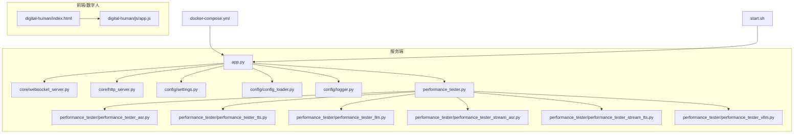
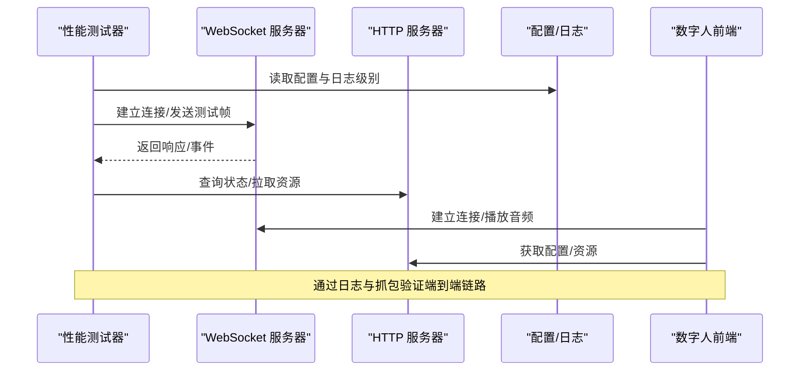
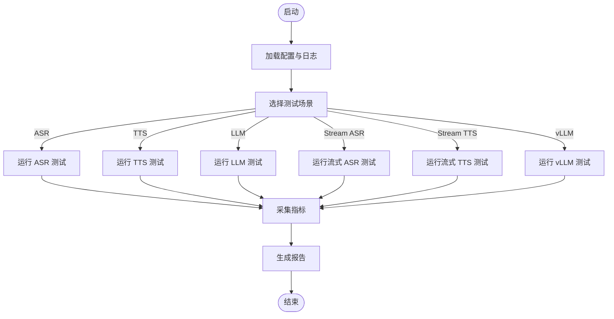
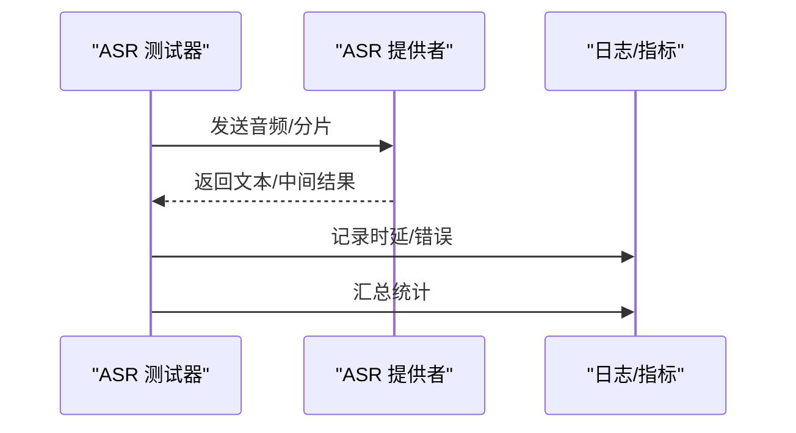
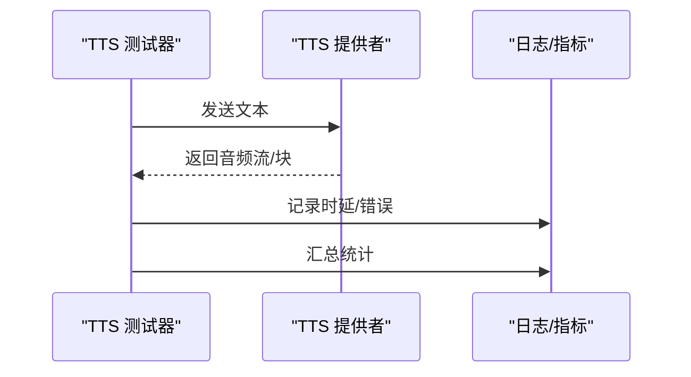
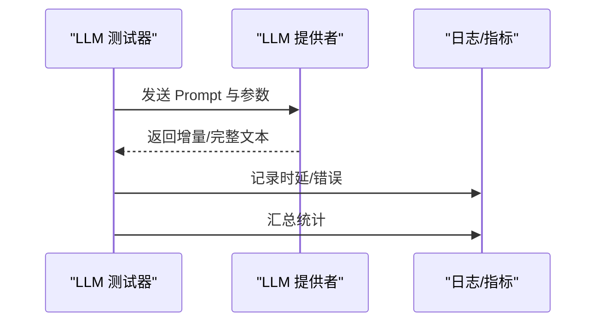
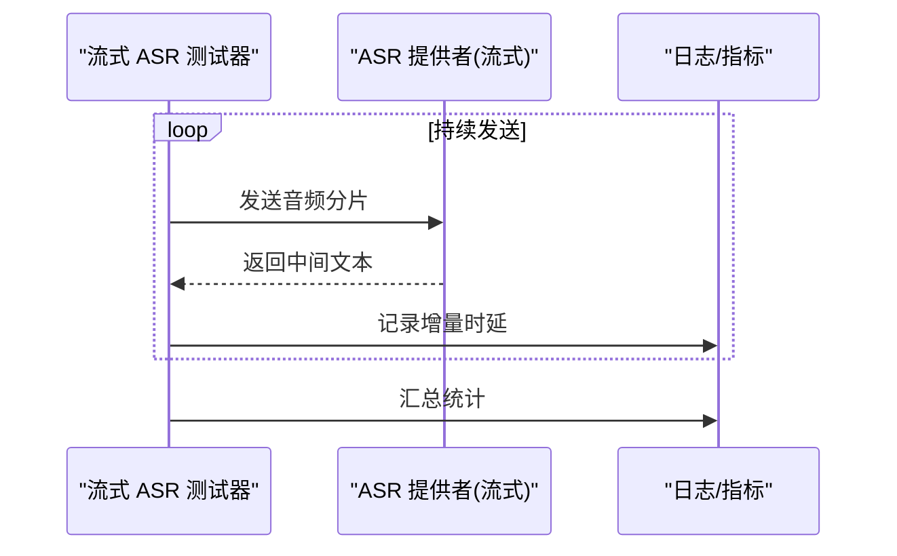
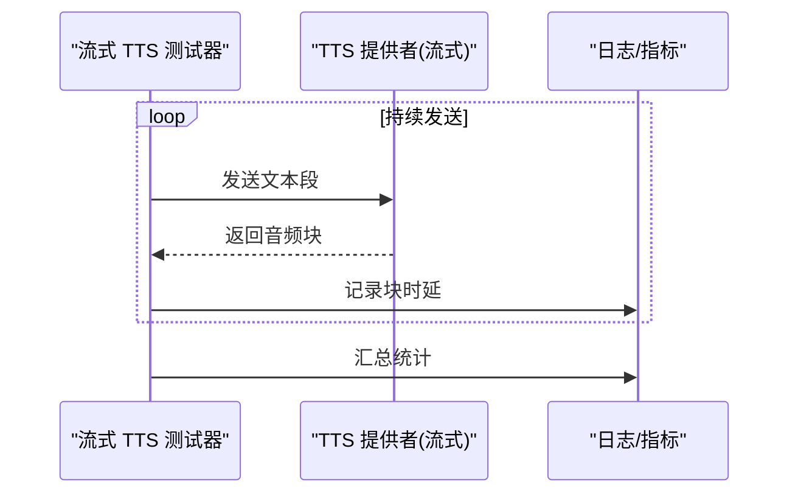
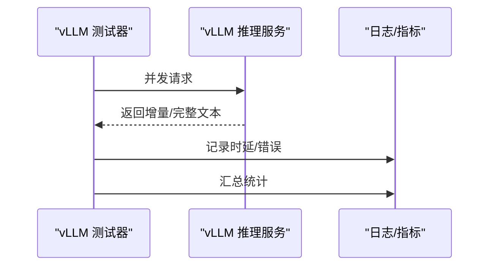
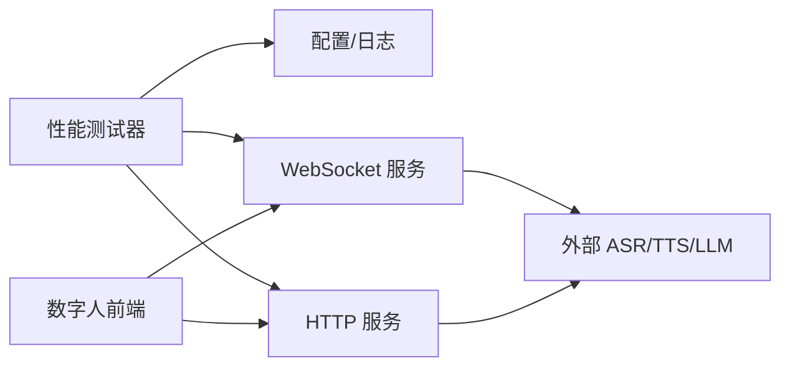

# 调试工具

<cite>
**本文引用的文件**   
- [performance_tester.py](file://main/xiaozhi-server/performance_tester.py)
- [performance_tester_asr.py](file://main/xiaozhi-server/performance_tester/performance_tester_asr.py)
- [performance_tester_tts.py](file://main/xiaozhi-server/performance_tester/performance_tester_tts.py)
- [performance_tester_llm.py](file://main/xiaozhi-server/performance_tester/performance_tester_llm.py)
- [performance_tester_stream_asr.py](file://main/xiaozhi-server/performance_tester/performance_tester_stream_asr.py)
- [performance_tester_stream_tts.py](file://main/xiaozhi-server/performance_tester/performance_tester_stream_tts.py)
- [performance_tester_vllm.py](file://main/xiaozhi-server/performance_tester/performance_tester_vllm.py)
- [performance_tester.md](file://docs/performance_tester.md)
- [websocket_server.py](file://main/xiaozhi-server/core/websocket_server.py)
- [http_server.py](file://main/xiaozhi-server/core/http_server.py)
- [config_loader.py](file://main/xiaozhi-server/config/config_loader.py)
- [logger.py](file://main/xiaozhi-server/config/logger.py)
- [settings.py](file://main/xiaozhi-server/config/settings.py)
- [app.py](file://main/xiaozhi-server/app.py)
- [start.sh](file://main/xiaozhi-server/start.sh)
- [docker-compose.yml](file://main/xiaozhi-server/docker-compose.yml)
- [index.html](file://main/digital-human/index.html)
- [app.js](file://main/digital-human/js/app.js)
</cite>

## 目录
1. [简介](#简介)
2. [项目结构](#项目结构)
3. [核心组件](#核心组件)
4. [架构总览](#架构总览)
5. [详细组件分析](#详细组件分析)
6. [依赖关系分析](#依赖关系分析)
7. [性能注意事项](#性能注意事项)
8. [故障排查指南](#故障排查指南)
9. [结论](#结论)
10. [附录](#附录)

## 简介
本文件面向 xiaozhi-esp32-server 的调试与性能测试，覆盖以下主题：
- 性能测试器各模块的使用方法（ASR、TTS、LLM、流式 ASR/TTS、vLLM）
- 网络抓包工具（Wireshark、tcpdump）对 WebSocket 与 MQTT 的分析方法
- 内存分析工具（memory_profiler、tracemalloc）的使用与结果解读
- CPU 性能分析工具（cProfile、line_profiler）的配置与使用
- 浏览器开发者工具在前端与数字人系统的调试技巧
- 专业监控工具进行系统健康检查与问题诊断

## 项目结构
与调试和性能相关的代码主要集中在 main/xiaozhi-server 下的 performance_tester 目录与 core 子模块；前端与数字人相关页面位于 main/digital-human。配置与日志在 config 目录中。

图表来源
- [app.py](file://main/xiaozhi-server/app.py)
- [websocket_server.py](file://main/xiaozhi-server/core/websocket_server.py)
- [http_server.py](file://main/xiaozhi-server/core/http_server.py)
- [settings.py](file://main/xiaozhi-server/config/settings.py)
- [config_loader.py](file://main/xiaozhi-server/config/config_loader.py)
- [logger.py](file://main/xiaozhi-server/config/logger.py)
- [performance_tester.py](file://main/xiaozhi-server/performance_tester.py)
- [performance_tester_asr.py](file://main/xiaozhi-server/performance_tester/performance_tester_asr.py)
- [performance_tester_tts.py](file://main/xiaozhi-server/performance_tester/performance_tester_tts.py)
- [performance_tester_llm.py](file://main/xiaozhi-server/performance_tester/performance_tester_llm.py)
- [performance_tester_stream_asr.py](file://main/xiaozhi-server/performance_tester/performance_tester_stream_asr.py)
- [performance_tester_stream_tts.py](file://main/xiaozhi-server/performance_tester/performance_tester_stream_tts.py)
- [performance_tester_vllm.py](file://main/xiaozhi-server/performance_tester/performance_tester_vllm.py)
- [index.html](file://main/digital-human/index.html)
- [app.js](file://main/digital-human/js/app.js)
- [docker-compose.yml](file://main/xiaozhi-server/docker-compose.yml)
- [start.sh](file://main/xiaozhi-server/start.sh)

章节来源
- [performance_tester.md](file://docs/performance_tester.md)
- [performance_tester.py](file://main/xiaozhi-server/performance_tester.py)
- [websocket_server.py](file://main/xiaozhi-server/core/websocket_server.py)
- [http_server.py](file://main/xiaozhi-server/core/http_server.py)
- [settings.py](file://main/xiaozhi-server/config/settings.py)
- [config_loader.py](file://main/xiaozhi-server/config/config_loader.py)
- [logger.py](file://main/xiaozhi-server/config/logger.py)
- [app.py](file://main/xiaozhi-server/app.py)
- [start.sh](file://main/xiaozhi-server/start.sh)
- [docker-compose.yml](file://main/xiaozhi-server/docker-compose.yml)
- [index.html](file://main/digital-human/index.html)
- [app.js](file://main/digital-human/js/app.js)

## 核心组件
- 性能测试入口与调度
  - 统一入口脚本负责加载不同场景的性能测试模块，并输出统计指标（时延、吞吐、错误率等）。
  - 支持 ASR、TTS、LLM、流式 ASR/TTS、vLLM 等多类测试用例。
- 服务层
  - WebSocket 服务器处理实时音视频与指令通道。
  - HTTP 服务器提供管理接口与配置更新能力。
- 配置与日志
  - settings/config_loader 负责配置加载与合并。
  - logger 提供结构化日志输出，便于定位问题。
- 前端与数字人
  - index.html + app.js 实现数字人交互界面与媒体管线，便于前端侧观察渲染、音频播放与网络请求。

章节来源
- [performance_tester.py](file://main/xiaozhi-server/performance_tester.py)
- [performance_tester_asr.py](file://main/xiaozhi-server/performance_tester/performance_tester_asr.py)
- [performance_tester_tts.py](file://main/xiaozhi-server/performance_tester/performance_tester_tts.py)
- [performance_tester_llm.py](file://main/xiaozhi-server/performance_tester/performance_tester_llm.py)
- [performance_tester_stream_asr.py](file://main/xiaozhi-server/performance_tester/performance_tester_stream_asr.py)
- [performance_tester_stream_tts.py](file://main/xiaozhi-server/performance_tester/performance_tester_stream_tts.py)
- [performance_tester_vllm.py](file://main/xiaozhi-server/performance_tester/performance_tester_vllm.py)
- [websocket_server.py](file://main/xiaozhi-server/core/websocket_server.py)
- [http_server.py](file://main/xiaozhi-server/core/http_server.py)
- [settings.py](file://main/xiaozhi-server/config/settings.py)
- [config_loader.py](file://main/xiaozhi-server/config/config_loader.py)
- [logger.py](file://main/xiaozhi-server/config/logger.py)
- [index.html](file://main/digital-human/index.html)
- [app.js](file://main/digital-human/js/app.js)

## 架构总览
下图展示性能测试器与服务端核心组件的交互关系，以及前端数字人页面的观测点。

图表来源
- [performance_tester.py](file://main/xiaozhi-server/performance_tester.py)
- [websocket_server.py](file://main/xiaozhi-server/core/websocket_server.py)
- [http_server.py](file://main/xiaozhi-server/core/http_server.py)
- [settings.py](file://main/xiaozhi-server/config/settings.py)
- [logger.py](file://main/xiaozhi-server/config/logger.py)
- [index.html](file://main/digital-human/index.html)
- [app.js](file://main/digital-human/js/app.js)

## 详细组件分析

### 性能测试器总览
- 功能要点
  - 统一入口聚合多种测试场景，支持批量执行、并发控制、指标采集与报告输出。
  - 可切换不同的后端提供者（ASR/TTS/LLM），便于对比不同模型或服务的性能。
- 关键流程
  - 初始化配置与日志
  - 选择测试场景（ASR/TTS/LLM/流式/vLLM）
  - 构建请求/数据源
  - 执行测试并记录时延、吞吐、错误码
  - 汇总输出与导出

图表来源
- [performance_tester.py](file://main/xiaozhi-server/performance_tester.py)
- [performance_tester_asr.py](file://main/xiaozhi-server/performance_tester/performance_tester_asr.py)
- [performance_tester_tts.py](file://main/xiaozhi-server/performance_tester/performance_tester_tts.py)
- [performance_tester_llm.py](file://main/xiaozhi-server/performance_tester/performance_tester_llm.py)
- [performance_tester_stream_asr.py](file://main/xiaozhi-server/performance_tester/performance_tester_stream_asr.py)
- [performance_tester_stream_tts.py](file://main/xiaozhi-server/performance_tester/performance_tester_stream_tts.py)
- [performance_tester_vllm.py](file://main/xiaozhi-server/performance_tester/performance_tester_vllm.py)

章节来源
- [performance_tester.py](file://main/xiaozhi-server/performance_tester.py)
- [performance_tester.md](file://docs/performance_tester.md)

### ASR 性能测试
- 目标
  - 评估语音识别端到端时延、吞吐、准确率与稳定性。
- 输入
  - 音频片段集合（长度分布、采样率、编码格式）
  - ASR 提供者配置（模型、超时、重试策略）
- 过程
  - 按批次发送音频帧或完整音频
  - 记录首包时延、逐句时延、失败率
- 输出
  - 时延分布（P50/P90/P99）、吞吐（句/秒）、错误码统计

图表来源
- [performance_tester_asr.py](file://main/xiaozhi-server/performance_tester/performance_tester_asr.py)
- [logger.py](file://main/xiaozhi-server/config/logger.py)

章节来源
- [performance_tester_asr.py](file://main/xiaozhi-server/performance_tester/performance_tester_asr.py)

### TTS 性能测试
- 目标
  - 评估文本转语音的时延、吞吐与音质可用性。
- 输入
  - 文本样本集（长度分布、特殊字符、多语言）
  - TTS 提供者配置（音色、语速、采样率）
- 过程
  - 批量请求合成，记录首包时延与整体时延
  - 可选回放校验与丢包统计
- 输出
  - 时延分布、吞吐、错误率、音频质量抽检结果

图表来源
- [performance_tester_tts.py](file://main/xiaozhi-server/performance_tester/performance_tester_tts.py)
- [logger.py](file://main/xiaozhi-server/config/logger.py)

章节来源
- [performance_tester_tts.py](file://main/xiaozhi-server/performance_tester/performance_tester_tts.py)

### LLM 性能测试
- 目标
  - 评估大模型的响应时延、吞吐与上下文处理能力。
- 输入
  - Prompt 模板与参数（温度、最大 token、系统提示）
  - 会话历史长度与复杂度
- 过程
  - 并发发起请求，记录首 token 时延与完整响应时延
  - 统计错误码、重试次数、限流情况
- 输出
  - 时延分布、吞吐、错误率、资源占用（CPU/GPU/显存）

图表来源
- [performance_tester_llm.py](file://main/xiaozhi-server/performance_tester/performance_tester_llm.py)
- [logger.py](file://main/xiaozhi-server/config/logger.py)

章节来源
- [performance_tester_llm.py](file://main/xiaozhi-server/performance_tester/performance_tester_llm.py)

### 流式 ASR 性能测试
- 目标
  - 评估实时语音识别的端到端时延与稳定性。
- 输入
  - 音频流（分片大小、间隔、编码）
  - 流式 ASR 配置（缓冲区、超时、重连）
- 过程
  - 持续发送音频分片，记录首包时延、增量时延、卡顿率
- 输出
  - 时延分布、吞吐、错误率、断线重连统计

图表来源
- [performance_tester_stream_asr.py](file://main/xiaozhi-server/performance_tester/performance_tester_stream_asr.py)
- [logger.py](file://main/xiaozhi-server/config/logger.py)

章节来源
- [performance_tester_stream_asr.py](file://main/xiaozhi-server/performance_tester/performance_tester_stream_asr.py)

### 流式 TTS 性能测试
- 目标
  - 评估实时语音合成的首包时延与流畅度。
- 输入
  - 文本流（分段策略、标点处理）
  - 流式 TTS 配置（缓冲、采样率、编码）
- 过程
  - 持续发送文本段，记录首包时延与后续块时延
- 输出
  - 时延分布、吞吐、错误率、播放卡顿率

图表来源
- [performance_tester_stream_tts.py](file://main/xiaozhi-server/performance_tester/performance_tester_stream_tts.py)
- [logger.py](file://main/xiaozhi-server/config/logger.py)

章节来源
- [performance_tester_stream_tts.py](file://main/xiaozhi-server/performance_tester/performance_tester_stream_tts.py)

### vLLM 性能测试
- 目标
  - 评估基于 vLLM 的大模型推理吞吐与时延。
- 输入
  - 并发请求数、Prompt 长度、批处理参数
- 过程
  - 高并发压测，记录首 token 时延、完整时延、GPU 利用率
- 输出
  - 吞吐（token/s）、时延分布、错误率、资源占用

图表来源
- [performance_tester_vllm.py](file://main/xiaozhi-server/performance_tester/performance_tester_vllm.py)
- [logger.py](file://main/xiaozhi-server/config/logger.py)

章节来源
- [performance_tester_vllm.py](file://main/xiaozhi-server/performance_tester/performance_tester_vllm.py)

### 网络抓包与协议分析（WebSocket/MQTT）
- 适用场景
  - 定位 WebSocket 握手失败、消息丢失、乱序、延迟抖动
  - 分析 MQTT 订阅/发布、认证、重连行为
- 工具建议
  - Wireshark：图形化抓包、过滤器、解码 WebSocket/MQTT
  - tcpdump：命令行抓包，适合服务器端快速捕获
- 常用过滤
  - WebSocket：端口过滤（如 80/443/自定义端口）、HTTP Upgrade 头
  - MQTT：端口 1883/8883、Topic 过滤、ClientID
- 分析要点
  - 握手阶段：Upgrade、Sec-WebSocket-* 头
  - 消息体：二进制/文本负载、分片与重组
  - 错误码：HTTP 4xx/5xx、MQTT CONNACK/REASON CODE
  - 重连与心跳：PING/PONG、KeepAlive

章节来源
- [websocket_server.py](file://main/xiaozhi-server/core/websocket_server.py)
- [http_server.py](file://main/xiaozhi-server/core/http_server.py)

### 内存分析（memory_profiler / tracemalloc）
- memory_profiler
  - 用法：对函数或脚本逐行统计内存分配
  - 关注：峰值内存、增长趋势、异常分配热点
- tracemalloc
  - 用法：内置追踪，适合生产环境轻量级采样
  - 关注：快照对比、对象类型分布、泄漏路径
- 结果解读
  - 结合日志时间戳定位触发点
  - 区分临时对象与长期驻留对象
  - 针对高频分配优化数据结构或缓存策略

章节来源
- [logger.py](file://main/xiaozhi-server/config/logger.py)
- [settings.py](file://main/xiaozhi-server/config/settings.py)

### CPU 性能分析（cProfile / line_profiler）
- cProfile
  - 用法：运行时调用统计，生成调用图与耗时
  - 关注：Top 耗时函数、递归调用、I/O 阻塞
- line_profiler
  - 用法：逐行耗时分析，定位热点行
  - 关注：循环内开销、字符串拼接、序列化/反序列化
- 结果解读
  - 结合线程/进程信息定位瓶颈
  - 将热点函数下沉到 C/C++ 扩展或异步化

章节来源
- [logger.py](file://main/xiaozhi-server/config/logger.py)
- [settings.py](file://main/xiaozhi-server/config/settings.py)

### 浏览器开发者工具（前端与数字人）
- 网络面板
  - 查看 WebSocket 握手与消息、MQTT 请求
  - 过滤与搜索关键字，定位慢请求
- 性能面板
  - 录制页面生命周期，分析主线程阻塞与渲染耗时
- 内存面板
  - 堆快照对比，查找未释放引用
- 控制台与日志
  - 打印关键事件与错误，配合服务端日志交叉验证

章节来源
- [index.html](file://main/digital-human/index.html)
- [app.js](file://main/digital-human/js/app.js)

### 专业监控与健康检查
- 指标采集
  - 服务存活探针（HTTP 健康端点）
  - 业务指标（QPS、时延、错误率）
- 日志与追踪
  - 结构化日志（trace_id、span_id）
  - 集中式日志平台检索与告警
- 容器与编排
  - docker-compose 编排服务，设置重启策略与资源限制
  - 启动脚本标准化环境变量与挂载卷

章节来源
- [http_server.py](file://main/xiaozhi-server/core/http_server.py)
- [docker-compose.yml](file://main/xiaozhi-server/docker-compose.yml)
- [start.sh](file://main/xiaozhi-server/start.sh)

## 依赖关系分析
- 组件耦合
  - 性能测试器依赖配置与日志模块，调用 WebSocket/HTTP 服务
  - 前端数字人依赖 WebSocket/HTTP 接口与本地资源
- 外部依赖
  - ASR/TTS/LLM 提供者（可能为远程 API 或本地服务）
  - 容器编排与镜像仓库（Docker）
- 潜在风险
  - 循环依赖（应避免）
  - 外部服务不可用导致级联失败（需熔断与降级）

图表来源
- [performance_tester.py](file://main/xiaozhi-server/performance_tester.py)
- [websocket_server.py](file://main/xiaozhi-server/core/websocket_server.py)
- [http_server.py](file://main/xiaozhi-server/core/http_server.py)
- [settings.py](file://main/xiaozhi-server/config/settings.py)
- [logger.py](file://main/xiaozhi-server/config/logger.py)
- [index.html](file://main/digital-human/index.html)
- [app.js](file://main/digital-human/js/app.js)

章节来源
- [performance_tester.py](file://main/xiaozhi-server/performance_tester.py)
- [websocket_server.py](file://main/xiaozhi-server/core/websocket_server.py)
- [http_server.py](file://main/xiaozhi-server/core/http_server.py)
- [settings.py](file://main/xiaozhi-server/config/settings.py)
- [logger.py](file://main/xiaozhi-server/config/logger.py)
- [index.html](file://main/digital-human/index.html)
- [app.js](file://main/digital-human/js/app.js)

## 性能注意事项
- 测试设计
  - 合理设置并发与样本分布，避免极端值影响统计
  - 区分冷启动与热启动场景，分别记录指标
- 资源限制
  - 限制单进程线程/协程数量，防止资源耗尽
  - 启用背压与队列限流，保护下游服务
- 可观测性
  - 完善日志与指标埋点，确保可追溯
  - 定期基线对比，发现回归问题

[本节为通用指导，不直接分析具体文件]

## 故障排查指南
- 常见问题
  - WebSocket 握手失败：检查端口、证书、跨域与安全头
  - MQTT 连接中断：检查认证、Topic 权限、网络防火墙
  - 内存泄漏：使用 tracemalloc 对比快照，定位未释放对象
  - CPU 热点：cProfile 定位耗时函数，line_profiler 细化到行
- 排查步骤
  - 复现问题并抓取网络包
  - 收集服务端日志与指标
  - 前端录制性能与内存快照
  - 逐步隔离组件，定位根因

章节来源
- [logger.py](file://main/xiaozhi-server/config/logger.py)
- [settings.py](file://main/xiaozhi-server/config/settings.py)
- [websocket_server.py](file://main/xiaozhi-server/core/websocket_server.py)
- [http_server.py](file://main/xiaozhi-server/core/http_server.py)

## 结论
通过统一的性能测试器与完善的调试工具链，可以系统化地评估 xiaozhi-esp32-server 的 ASR/TTS/LLM 及流式能力，并结合网络抓包、内存与 CPU 分析、前端调试与监控手段，快速定位与解决性能与稳定性问题。建议在迭代过程中持续积累基线与回归测试，保障服务质量。

[本节为总结性内容，不直接分析具体文件]

## 附录
- 实用命令与参考
  - 启动服务：参考 start.sh 与环境变量
  - 容器编排：参考 docker-compose.yml
  - 文档参考：performance_tester.md

章节来源
- [start.sh](file://main/xiaozhi-server/start.sh)
- [docker-compose.yml](file://main/xiaozhi-server/docker-compose.yml)
- [performance_tester.md](file://docs/performance_tester.md)