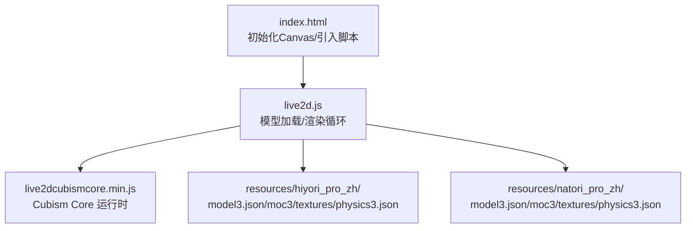
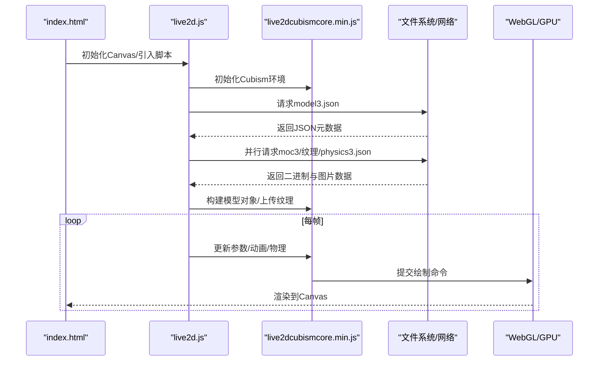
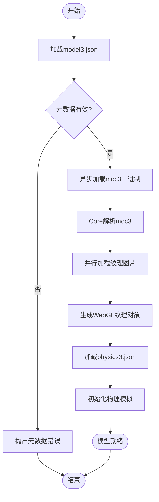
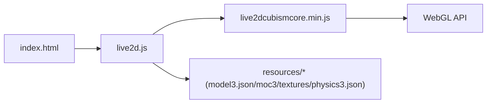

# Live2D 渲染引擎

<cite>
**本文引用的文件**   
- [digital-human/js/live2d/live2d.js](file://main/digital-human/js/live2d/live2d.js)
- [digital-human/js/live2d/live2dcubismcore.min.js](file://main/digital-human/js/live2d/live2dcubismcore.min.js)
- [digital-human/index.html](file://main/digital-human/index.html)
- [digital-human/resources/hiyori_pro_zh/model3.json](file://main/digital-human/resources/hiyori_pro_zh/model3.json)
- [digital-human/resources/natori_pro_zh/model3.json](file://main/digital-human/resources/natori_pro_zh/model3.json)
</cite>

## 目录
1. [简介](#简介)
2. [项目结构](#项目结构)
3. [核心组件](#核心组件)
4. [架构总览](#架构总览)
5. [详细组件分析](#详细组件分析)
6. [依赖关系分析](#依赖关系分析)
7. [性能考量](#性能考量)
8. [故障排查指南](#故障排查指南)
9. [结论](#结论)
10. [附录](#附录)

## 简介
本技术文档围绕仓库中的 Live2D 渲染能力，系统梳理了基于 Cubism SDK 的集成与配置方式，涵盖模型加载、纹理管理、渲染管线优化、文件格式解析（.model3.json、.moc3、.physics3.json）、跨平台兼容性（WebGL 版本适配、移动端优化、浏览器差异处理），并提供开发示例与常见问题排查方法。目标是帮助开发者快速理解并高效扩展该渲染子系统。

## 项目结构
Live2D 渲染相关代码位于 digital-human 模块中，核心包括：
- 入口页面 index.html：初始化 Canvas、引入 Cubism Core 与业务脚本。
- live2d.js：封装模型加载、参数驱动、渲染循环等逻辑。
- live2dcubismcore.min.js：Cubism Core 运行时库（二进制）。
- resources/*：存放模型资源，包含 model3.json、moc3、textures、physics3.json 等。



图表来源
- [digital-human/index.html](file://main/digital-human/index.html)
- [digital-human/js/live2d/live2d.js](file://main/digital-human/js/live2d/live2d.js)
- [digital-human/js/live2d/live2dcubismcore.min.js](file://main/digital-human/js/live2d/live2dcubismcore.min.js)
- [digital-human/resources/hiyori_pro_zh/model3.json](file://main/digital-human/resources/hiyori_pro_zh/model3.json)
- [digital-human/resources/natori_pro_zh/model3.json](file://main/digital-human/resources/natori_pro_zh/model3.json)

章节来源
- [digital-human/index.html](file://main/digital-human/index.html)
- [digital-human/js/live2d/live2d.js](file://main/digital-human/js/live2d/live2d.js)
- [digital-human/js/live2d/live2dcubismcore.min.js](file://main/digital-human/js/live2dcubismcore.min.js)
- [digital-human/resources/hiyori_pro_zh/model3.json](file://main/digital-human/resources/hiyori_pro_zh/model3.json)
- [digital-human/resources/natori_pro_zh/model3.json](file://main/digital-human/resources/natori_pro_zh/model3.json)

## 核心组件
- 入口与初始化（index.html）
  - 创建 Canvas 元素，设置尺寸与像素比，引入 Cubism Core 与业务脚本。
  - 提供基础样式与容器布局，确保在不同设备上正确显示。
- 渲染控制器（live2d.js）
  - 负责生命周期管理：初始化 Cubism、加载模型、构建纹理、启动渲染循环。
  - 暴露 API：设置参数（表情/动作）、切换模型、更新物理效果、事件回调。
- Cubism Core（live2dcubismcore.min.js）
  - 提供底层图形接口、模型数据解析、动画与物理计算、GPU 绘制调用。
- 模型资源（resources/*）
  - model3.json：描述模型拓扑、材质、贴图路径、动作、物理参数等元数据。
  - moc3：二进制模型数据（顶点、UV、骨骼、动画关键帧等）。
  - textures：PNG/JPEG 纹理图集。
  - physics3.json：物理模拟配置文件（重力、风力、碰撞等）。

章节来源
- [digital-human/index.html](file://main/digital-human/index.html)
- [digital-human/js/live2d/live2d.js](file://main/digital-human/js/live2d/live2d.js)
- [digital-human/js/live2d/live2dcubismcore.min.js](file://main/digital-human/js/live2dcubismcore.min.js)
- [digital-human/resources/hiyori_pro_zh/model3.json](file://main/digital-human/resources/hiyori_pro_zh/model3.json)
- [digital-human/resources/natori_pro_zh/model3.json](file://main/digital-human/resources/natori_pro_zh/model3.json)

## 架构总览
整体渲染流程从页面初始化开始，依次完成 Cubism 环境搭建、模型资源加载、纹理上传至 GPU、参数更新与物理模拟、最终通过 WebGL 绘制到 Canvas。



图表来源
- [digital-human/index.html](file://main/digital-human/index.html)
- [digital-human/js/live2d/live2d.js](file://main/digital-human/js/live2d/live2d.js)
- [digital-human/js/live2d/live2dcubismcore.min.js](file://main/digital-human/js/live2dcubismcore.min.js)
- [digital-human/resources/hiyori_pro_zh/model3.json](file://main/digital-human/resources/hiyori_pro_zh/model3.json)
- [digital-human/resources/natori_pro_zh/model3.json](file://main/digital-human/resources/natori_pro_zh/model3.json)

## 详细组件分析

### 模型加载与解析
- 解析 model3.json
  - 读取模型根节点、材质列表、贴图路径、动作定义、物理参数引用。
  - 校验必要字段（如 moc3 路径、纹理目录、动作集合）。
- 加载 moc3
  - 以二进制形式获取，交由 Cubism Core 解析为内部模型结构（顶点、UV、骨骼、动画关键帧）。
- 纹理管理
  - 按 model3.json 中的贴图路径加载图片，生成 WebGL 纹理对象。
  - 支持纹理压缩格式（如 ASTC/ETC/PVRTC）在移动端提升带宽与内存效率。
- 物理效果
  - 加载 physics3.json，初始化物理模拟器，将力场、阻尼、碰撞体等参数注入。
- 错误处理
  - 对缺失资源、格式不兼容、解码失败进行捕获与降级提示。



图表来源
- [digital-human/js/live2d/live2d.js](file://main/digital-human/js/live2d/live2d.js)
- [digital-human/resources/hiyori_pro_zh/model3.json](file://main/digital-human/resources/hiyori_pro_zh/model3.json)
- [digital-human/resources/natori_pro_zh/model3.json](file://main/digital-human/resources/natori_pro_zh/model3.json)

章节来源
- [digital-human/js/live2d/live2d.js](file://main/digital-human/js/live2d/live2d.js)
- [digital-human/resources/hiyori_pro_zh/model3.json](file://main/digital-human/resources/hiyori_pro_zh/model3.json)
- [digital-human/resources/natori_pro_zh/model3.json](file://main/digital-human/resources/natori_pro_zh/model3.json)

### 渲染管线与参数驱动
- 渲染循环
  - 使用 requestAnimationFrame 驱动每帧更新，避免阻塞主线程。
  - 在每帧内先更新参数（表情、口型、肢体角度），再触发物理模拟，最后提交绘制。
- 参数更新
  - 通过 Cubism API 设置参数 ID 与值，支持插值与平滑过渡。
  - 可绑定外部输入（语音、手势、时间）驱动动态效果。
- 绘制优化
  - 合并批次减少状态切换，启用深度测试与混合模式。
  - 合理设置视口与裁剪区域，降低过绘。
- 自定义渲染效果
  - 在绘制前后插入自定义 Shader 或后处理步骤（模糊、发光、色相调整）。
  - 注意保持 Alpha 混合顺序与深度一致性。

```mermaid
sequenceDiagram
participant Loop as "渲染循环"
participant Model as "模型实例"
participant Physics as "物理模拟"
participant GL as "WebGL上下文"
Loop->>Model : 更新参数(表情/动作)
Model->>Physics : 应用力场/碰撞
Physics-->>Model : 返回骨骼变换
Model->>GL : 提交绘制(顶点/纹理/混合)
GL-->>Loop : 完成一帧渲染
```

图表来源
- [digital-human/js/live2d/live2d.js](file://main/digital-human/js/live2d/live2d.js)
- [digital-human/js/live2d/live2dcubismcore.min.js](file://main/digital-human/js/live2dcubismcore.min.js)

章节来源
- [digital-human/js/live2d/live2d.js](file://main/digital-human/js/live2d/live2d.js)
- [digital-human/js/live2d/live2dcubismcore.min.js](file://main/digital-human/js/live2dcubismcore.min.js)

### 跨平台兼容性
- WebGL 版本适配
  - 检测 WebGL 1.0/2.0 能力，选择合适特性集（如纹理压缩、浮点纹理）。
  - 对不支持的特性进行回退策略（如禁用高级混合模式）。
- 移动端优化
  - 限制纹理分辨率与数量，启用纹理压缩格式。
  - 降低每帧更新频率或使用节流策略，减少 CPU/GPU 压力。
- 浏览器差异处理
  - 针对 Safari/Chrome/Firefox 的 Canvas/WebGL 行为差异进行兼容层封装。
  - 处理触摸事件与指针事件的统一抽象。

章节来源
- [digital-human/js/live2d/live2d.js](file://main/digital-human/js/live2d/live2d.js)
- [digital-human/index.html](file://main/digital-human/index.html)

### 开发示例
- 加载模型
  - 指定 model3.json 路径，等待资源全部加载完成后初始化模型实例。
- 设置材质
  - 根据 model3.json 中的材质 ID 修改颜色、透明度、混合模式。
- 实现自定义渲染效果
  - 在渲染循环中插入自定义着色器或后处理步骤，实现发光、模糊、色相偏移等效果。
- 参数驱动
  - 通过参数 ID 设置表情、口型、肢体角度，结合外部输入实现实时交互。

章节来源
- [digital-human/js/live2d/live2d.js](file://main/digital-human/js/live2d/live2d.js)
- [digital-human/resources/hiyori_pro_zh/model3.json](file://main/digital-human/resources/hiyori_pro_zh/model3.json)
- [digital-human/resources/natori_pro_zh/model3.json](file://main/digital-human/resources/natori_pro_zh/model3.json)

## 依赖关系分析
- 模块耦合
  - index.html 仅负责初始化与脚本引入，低耦合。
  - live2d.js 依赖 Cubism Core 与模型资源，承担主要逻辑。
  - Cubism Core 为黑盒运行时，提供稳定接口。
- 外部依赖
  - WebGL API：用于 GPU 加速与纹理管理。
  - 文件系统/网络：用于加载 JSON、二进制与图片资源。
- 潜在循环依赖
  - 当前结构无循环依赖，职责清晰。



图表来源
- [digital-human/index.html](file://main/digital-human/index.html)
- [digital-human/js/live2d/live2d.js](file://main/digital-human/js/live2d/live2d.js)
- [digital-human/js/live2d/live2dcubismcore.min.js](file://main/digital-human/js/live2dcubismcore.min.js)
- [digital-human/resources/hiyori_pro_zh/model3.json](file://main/digital-human/resources/hiyori_pro_zh/model3.json)
- [digital-human/resources/natori_pro_zh/model3.json](file://main/digital-human/resources/natori_pro_zh/model3.json)

章节来源
- [digital-human/index.html](file://main/digital-human/index.html)
- [digital-human/js/live2d/live2d.js](file://main/digital-human/js/live2d/live2d.js)
- [digital-human/js/live2d/live2dcubismcore.min.js](file://main/digital-human/js/live2dcubismcore.min.js)
- [digital-human/resources/hiyori_pro_zh/model3.json](file://main/digital-human/resources/hiyori_pro_zh/model3.json)
- [digital-human/resources/natori_pro_zh/model3.json](file://main/digital-human/resources/natori_pro_zh/model3.json)

## 性能考量
- GPU 加速
  - 充分利用 WebGL 批处理与状态缓存，减少绘制调用次数。
  - 合理设置混合模式与深度测试，避免不必要的重绘。
- 纹理压缩
  - 在移动端启用 ASTC/ETC/PVRTC 等压缩格式，降低带宽与显存占用。
  - 预生成多级纹理（Mipmap）以提升采样质量与性能。
- 内存池管理
  - 复用纹理对象与缓冲区，避免频繁分配与释放。
  - 及时释放不再使用的模型与纹理资源，防止内存泄漏。
- 渲染频率控制
  - 在非活跃场景降低帧率（如降至 30fps），平衡功耗与流畅度。
  - 使用节流与防抖策略限制高频参数更新。

[本节为通用性能指导，不直接分析具体文件]

## 故障排查指南
- 模型无法加载
  - 检查 model3.json 路径与字段完整性，确认 moc3 与纹理路径正确。
  - 查看控制台网络请求是否成功，确认 CORS 与 MIME 类型。
- 纹理显示异常
  - 验证图片格式与尺寸，确保符合 WebGL 要求。
  - 检查纹理压缩格式是否被目标设备支持。
- 物理效果不生效
  - 确认 physics3.json 存在且参数合法，检查力场与碰撞体配置。
- 渲染卡顿
  - 监控每帧耗时，定位瓶颈（CPU 更新或 GPU 绘制）。
  - 降低纹理分辨率与复杂度，启用批处理与状态缓存。
- 跨平台问题
  - 针对不同浏览器与设备进行兼容性测试，必要时启用降级策略。

章节来源
- [digital-human/js/live2d/live2d.js](file://main/digital-human/js/live2d/live2d.js)
- [digital-human/resources/hiyori_pro_zh/model3.json](file://main/digital-human/resources/hiyori_pro_zh/model3.json)
- [digital-human/resources/natori_pro_zh/model3.json](file://main/digital-human/resources/natori_pro_zh/model3.json)

## 结论
本仓库中的 Live2D 渲染引擎基于 Cubism SDK 实现了完整的模型加载、纹理管理、参数驱动与渲染循环。通过合理的架构设计与性能优化策略，能够在多平台上提供流畅的 2D 角色渲染体验。开发者可在此基础上扩展自定义效果与交互逻辑，满足多样化应用场景需求。

[本节为总结性内容，不直接分析具体文件]

## 附录
- 术语表
  - model3.json：模型元数据文件，描述模型结构与资源引用。
  - moc3：二进制模型数据，包含几何、动画与骨骼信息。
  - physics3.json：物理模拟配置文件，定义力场与碰撞参数。
  - Cubism Core：Cubism SDK 的运行时库，提供底层图形与解析能力。
- 参考链接
  - Cubism SDK 官方文档（建议查阅最新版本说明与最佳实践）。

[本节为补充信息，不直接分析具体文件]