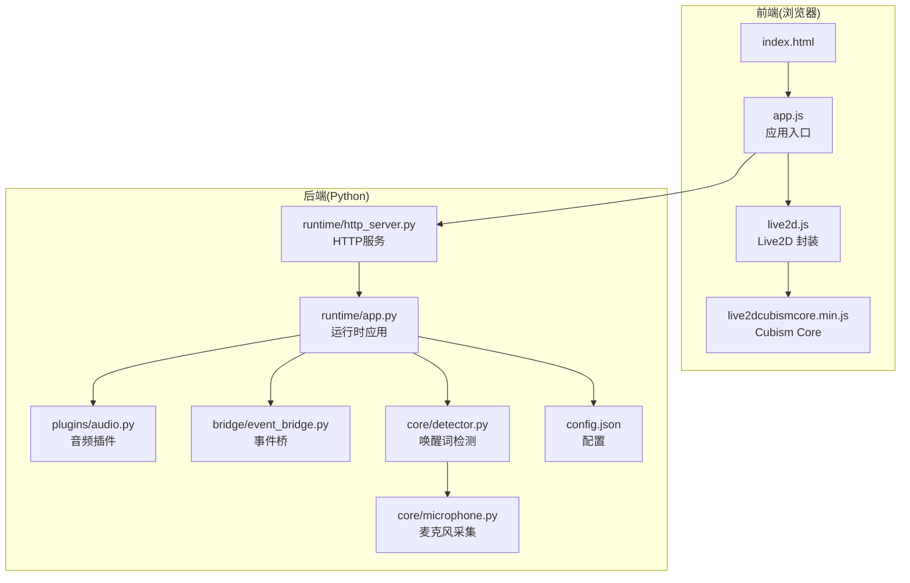
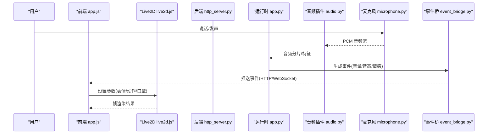
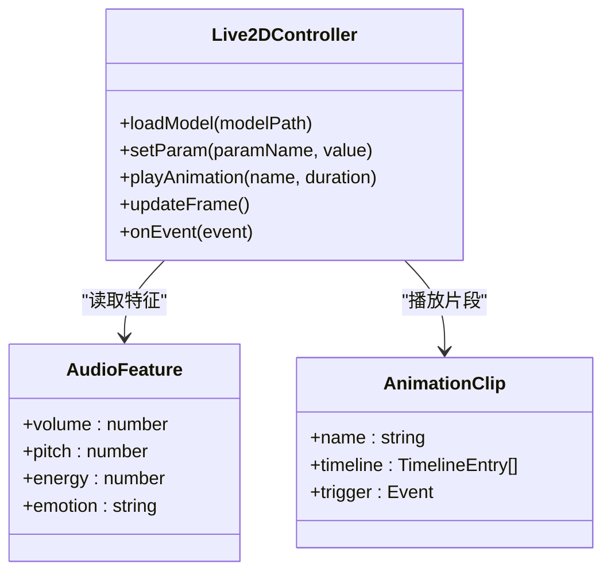
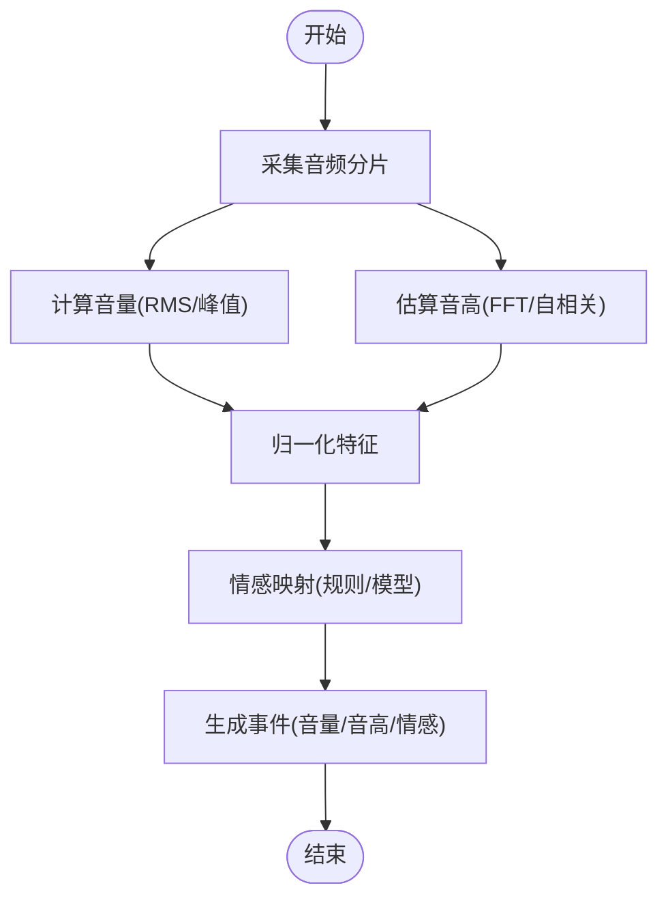
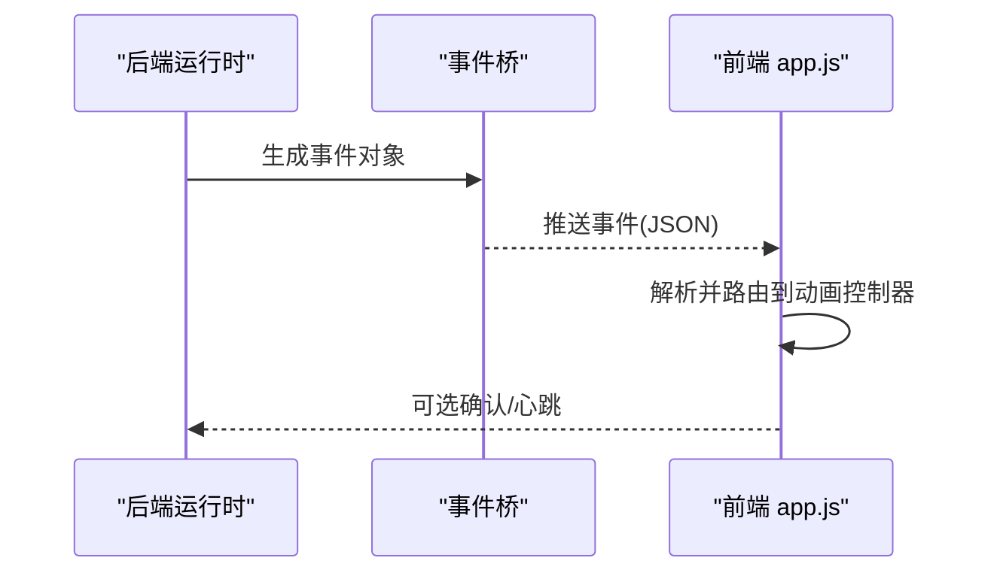
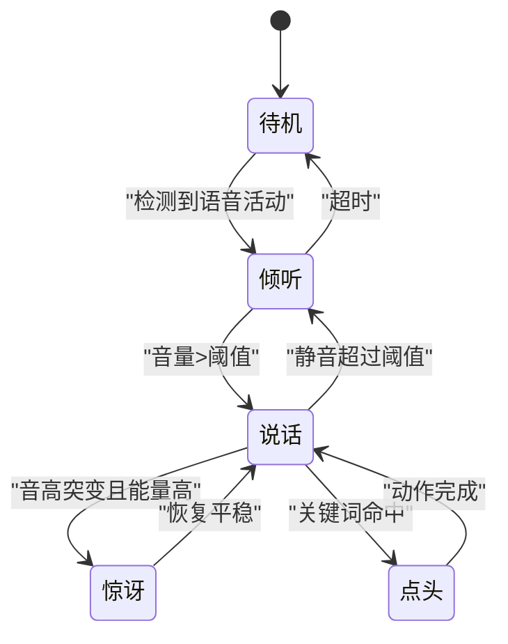
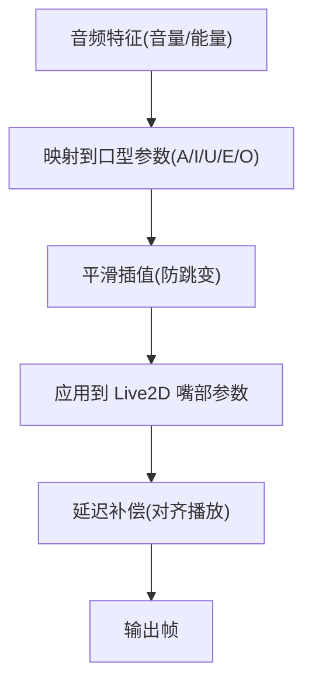
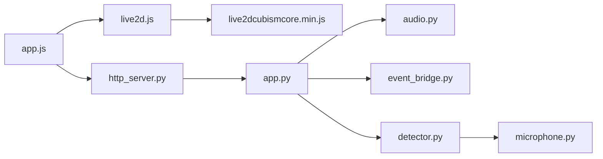

# 动画控制系统

<cite>
**本文档引用的文件**   
- [main.js](file://main/digital-human/js/app.js)
- [live2d.js](file://main/digital-human/js/live2d/live2d.js)
- [live2dcubismcore.min.js](file://main/digital-human/js/live2d/live2dcubismcore.min.js)
- [index.html](file://main/digital-human/index.html)
- [config.json](file://main/digital-human/wakeword_runtime/config.json)
- [app.py](file://main/digital-human/wakeword_runtime/runtime/app.py)
- [http_server.py](file://main/digital-human/wakeword_runtime/runtime/http_server.py)
- [audio.py](file://main/digital-human/wakeword_runtime/plugins/audio.py)
- [event_bridge.py](file://main/digital-human/wakeword_runtime/bridge/event_bridge.py)
- [detector.py](file://main/digital-human/wakeword_runtime/core/detector.py)
- [microphone.py](file://main/digital-human/wakeword_runtime/core/microphone.py)
</cite>

## 目录
1. [简介](#简介)
2. [项目结构](#项目结构)
3. [核心组件](#核心组件)
4. [架构总览](#架构总览)
5. [详细组件分析](#详细组件分析)
6. [依赖关系分析](#依赖关系分析)
7. [性能考虑](#性能考虑)
8. [故障排查指南](#故障排查指南)
9. [结论](#结论)
10. [附录](#附录)

## 简介
本技术文档围绕基于 Live2D 的动画控制系统，系统性阐述表情控制、动作同步与唇形匹配的实现思路；深入解析音频驱动的动画系统（音高分析、音量检测、情感映射）；说明动画状态机设计以支持复杂序列与条件触发；覆盖动画资源管理（模型解析、纹理优化、内存管理）。同时提供开发示例（创建自定义动画、绑定音频事件、实现交互式效果），并给出性能优化与跨平台兼容性建议。

## 项目结构
本项目在数字人前端中集成 Live2D 渲染与交互，后端通过 Python 运行时提供唤醒词检测、音频采集与事件桥接能力，前后端通过 HTTP/WebSocket 协作完成音频驱动动画。

图表来源 
- [index.html](file://main/digital-human/index.html)
- [app.js](file://main/digital-human/js/app.js)
- [live2d.js](file://main/digital-human/js/live2d/live2d.js)
- [live2dcubismcore.min.js](file://main/digital-human/js/live2d/live2dcubismcore.min.js)
- [app.py](file://main/digital-human/wakeword_runtime/runtime/app.py)
- [http_server.py](file://main/digital-human/wakeword_runtime/runtime/http_server.py)
- [audio.py](file://main/digital-human/wakeword_runtime/plugins/audio.py)
- [event_bridge.py](file://main/digital-human/wakeword_runtime/bridge/event_bridge.py)
- [detector.py](file://main/digital-human/wakeword_runtime/core/detector.py)
- [microphone.py](file://main/digital-human/wakeword_runtime/core/microphone.py)
- [config.json](file://main/digital-human/wakeword_runtime/config.json)

章节来源
- [index.html](file://main/digital-human/index.html)
- [app.js](file://main/digital-human/js/app.js)
- [live2d.js](file://main/digital-human/js/live2d/live2d.js)
- [live2dcubismcore.min.js](file://main/digital-human/js/live2d/live2dcubismcore.min.js)
- [app.py](file://main/digital-human/wakeword_runtime/runtime/app.py)
- [http_server.py](file://main/digital-human/wakeword_runtime/runtime/http_server.py)
- [audio.py](file://main/digital-human/wakeword_runtime/plugins/audio.py)
- [event_bridge.py](file://main/digital-human/wakeword_runtime/bridge/event_bridge.py)
- [detector.py](file://main/digital-human/wakeword_runtime/core/detector.py)
- [microphone.py](file://main/digital-human/wakeword_runtime/core/microphone.py)
- [config.json](file://main/digital-human/wakeword_runtime/config.json)

## 核心组件
- 前端 Live2D 渲染层：负责加载模型、参数驱动（表情、动作）、帧更新与事件回调。
- 音频采集与分析：后端通过麦克风采集音频流，进行 VAD/ASR/唤醒词检测，提取音量、音高等特征。
- 事件桥与运行时：将后端音频事件转发给前端，驱动动画状态机切换。
- 配置与资源管理：集中管理模型路径、纹理尺寸、动画片段、采样率等。

章节来源
- [live2d.js](file://main/digital-human/js/live2d/live2d.js)
- [app.js](file://main/digital-human/js/app.js)
- [audio.py](file://main/digital-human/wakeword_runtime/plugins/audio.py)
- [event_bridge.py](file://main/digital-human/wakeword_runtime/bridge/event_bridge.py)
- [detector.py](file://main/digital-human/wakeword_runtime/core/detector.py)
- [microphone.py](file://main/digital-human/wakeword_runtime/core/microphone.py)
- [config.json](file://main/digital-human/wakeword_runtime/config.json)

## 架构总览
整体采用“前端渲染 + 后端音频处理”的分层架构。前端通过 Live2D Cubism Core 渲染模型，接收后端事件驱动参数变化；后端负责音频采集、特征提取与事件分发。

图表来源 
- [app.js](file://main/digital-human/js/app.js)
- [live2d.js](file://main/digital-human/js/live2d/live2d.js)
- [http_server.py](file://main/digital-human/wakeword_runtime/runtime/http_server.py)
- [app.py](file://main/digital-human/wakeword_runtime/runtime/app.py)
- [audio.py](file://main/digital-human/wakeword_runtime/plugins/audio.py)
- [microphone.py](file://main/digital-human/wakeword_runtime/core/microphone.py)
- [event_bridge.py](file://main/digital-human/wakeword_runtime/bridge/event_bridge.py)

## 详细组件分析

### Live2D 渲染与参数驱动
- 模型加载与初始化：根据配置选择模型目录，加载 Cubism Core，实例化控制器。
- 参数映射：将音频特征（如音量、音高、能量）映射到 Live2D 参数（嘴部开合、眼部表情、头部姿态）。
- 动画片段：定义动作序列（待机、说话、点头、眨眼等），通过时间轴或事件触发播放。
- 帧循环：每帧更新参数，确保平滑过渡与低延迟。

图表来源 
- [live2d.js](file://main/digital-human/js/live2d/live2d.js)
- [live2dcubismcore.min.js](file://main/digital-human/js/live2d/live2dcubismcore.min.js)
- [app.js](file://main/digital-human/js/app.js)

章节来源
- [live2d.js](file://main/digital-human/js/live2d/live2d.js)
- [app.js](file://main/digital-human/js/app.js)

### 音频驱动与特征提取
- 音频采集：从麦克风获取 PCM 数据，按固定时长切块。
- 音量检测：计算 RMS/峰值，归一化为 0~1 范围。
- 音高分析：使用 FFT/自相关算法估计基频，转换为音高值。
- 情感映射：基于能量、音高、语速等特征映射到情绪标签（平静、兴奋、悲伤等）。

图表来源 
- [audio.py](file://main/digital-human/wakeword_runtime/plugins/audio.py)
- [microphone.py](file://main/digital-human/wakeword_runtime/core/microphone.py)
- [detector.py](file://main/digital-human/wakeword_runtime/core/detector.py)

章节来源
- [audio.py](file://main/digital-human/wakeword_runtime/plugins/audio.py)
- [microphone.py](file://main/digital-human/wakeword_runtime/core/microphone.py)
- [detector.py](file://main/digital-human/wakeword_runtime/core/detector.py)

### 事件桥与通信协议
- 事件类型：音量阈值、音高区间、情感标签、唤醒词命中等。
- 传输方式：HTTP 短轮询或 WebSocket 长连接，保证实时性。
- 可靠性：重试、去抖、丢包重传策略。

图表来源 
- [event_bridge.py](file://main/digital-human/wakeword_runtime/bridge/event_bridge.py)
- [http_server.py](file://main/digital-human/wakeword_runtime/runtime/http_server.py)
- [app.js](file://main/digital-human/js/app.js)

章节来源
- [event_bridge.py](file://main/digital-human/wakeword_runtime/bridge/event_bridge.py)
- [http_server.py](file://main/digital-human/wakeword_runtime/runtime/http_server.py)
- [app.js](file://main/digital-human/js/app.js)

### 动画状态机设计
- 状态定义：待机、说话、倾听、点头、眨眼、惊讶等。
- 转移条件：基于音频事件（音量>阈值、音高突变）、用户交互（点击、触摸）、时序（定时器）。
- 优先级与抢占：高优先级状态可打断低优先级状态（如说话打断待机）。
- 序列编排：组合多个动画片段形成复合动作（如点头+眨眼）。

图表来源 
- [app.js](file://main/digital-human/js/app.js)
- [live2d.js](file://main/digital-human/js/live2d/live2d.js)

章节来源
- [app.js](file://main/digital-human/js/app.js)
- [live2d.js](file://main/digital-human/js/live2d/live2d.js)

### 唇形匹配与口型同步
- 口型参数映射：将音量/能量映射到嘴部开合参数（如 A、I、U、E、O 元音形状）。
- 平滑插值：使用线性或贝塞尔插值避免跳变。
- 延迟补偿：对齐音频播放与动画帧，减少口型错位。

图表来源 
- [live2d.js](file://main/digital-human/js/live2d/live2d.js)
- [audio.py](file://main/digital-human/wakeword_runtime/plugins/audio.py)

章节来源
- [live2d.js](file://main/digital-human/js/live2d/live2d.js)
- [audio.py](file://main/digital-human/wakeword_runtime/plugins/audio.py)

### 表情控制与动作同步
- 表情参数：眼、眉、脸颊等参数随情感标签变化（开心、悲伤、愤怒）。
- 动作同步：动作片段与音频节奏对齐（如点头节拍）。
- 混合权重：多表情/动作叠加时的权重分配。

章节来源
- [live2d.js](file://main/digital-human/js/live2d/live2d.js)
- [app.js](file://main/digital-human/js/app.js)

### 动画资源管理
- 模型解析：读取模型配置文件，校验必要字段（纹理、参数、动作）。
- 纹理优化：按需加载、压缩格式、Mipmap、共享纹理池。
- 内存管理：引用计数、LRU 缓存、显存回收。

章节来源
- [config.json](file://main/digital-human/wakeword_runtime/config.json)
- [live2d.js](file://main/digital-human/js/live2d/live2d.js)

## 依赖关系分析
- 前端依赖：app.js 依赖 live2d.js，后者依赖 Cubism Core。
- 后端依赖：运行时 app.py 依赖音频插件、事件桥、检测器与麦克风。
- 通信依赖：前端通过 HTTP/WebSocket 与后端交互。

图表来源 
- [app.js](file://main/digital-human/js/app.js)
- [live2d.js](file://main/digital-human/js/live2d/live2d.js)
- [live2dcubismcore.min.js](file://main/digital-human/js/live2d/live2dcubismcore.min.js)
- [http_server.py](file://main/digital-human/wakeword_runtime/runtime/http_server.py)
- [app.py](file://main/digital-human/wakeword_runtime/runtime/app.py)
- [audio.py](file://main/digital-human/wakeword_runtime/plugins/audio.py)
- [event_bridge.py](file://main/digital-human/wakeword_runtime/bridge/event_bridge.py)
- [detector.py](file://main/digital-human/wakeword_runtime/core/detector.py)
- [microphone.py](file://main/digital-human/wakeword_runtime/core/microphone.py)

章节来源
- [app.js](file://main/digital-human/js/app.js)
- [live2d.js](file://main/digital-human/js/live2d/live2d.js)
- [live2dcubismcore.min.js](file://main/digital-human/js/live2d/live2dcubismcore.min.js)
- [http_server.py](file://main/digital-human/wakeword_runtime/runtime/http_server.py)
- [app.py](file://main/digital-human/wakeword_runtime/runtime/app.py)
- [audio.py](file://main/digital-human/wakeword_runtime/plugins/audio.py)
- [event_bridge.py](file://main/digital-human/wakeword_runtime/bridge/event_bridge.py)
- [detector.py](file://main/digital-human/wakeword_runtime/core/detector.py)
- [microphone.py](file://main/digital-human/wakeword_runtime/core/microphone.py)

## 性能考虑
- 前端渲染
  - 限制每帧参数更新次数，合并多次变更。
  - 使用离屏渲染与纹理复用，减少 GPU 压力。
  - 动画片段预加载与懒加载结合。
- 音频处理
  - 降低采样率与分片长度，平衡延迟与精度。
  - 使用 SIMD/WebAssembly 加速 FFT/自相关。
  - 事件去抖与节流，避免频繁状态切换。
- 内存管理
  - 模型与纹理按设备分辨率动态裁剪。
  - 及时释放不再使用的动画片段与中间缓冲区。
- 网络通信
  - 批量发送事件，减少握手开销。
  - 断线重连与心跳保活。

[本节为通用指导，不直接分析具体文件]

## 故障排查指南
- 模型加载失败
  - 检查模型路径与权限，确认配置文件完整。
  - 查看浏览器控制台错误日志。
- 动画无响应
  - 确认事件是否到达前端，检查网络请求。
  - 验证参数名称与取值范围是否正确。
- 口型不同步
  - 调整延迟补偿参数，检查音频播放与帧更新时序。
- 内存泄漏
  - 监控显存占用，定位未释放的纹理与模型。
- 音频异常
  - 检查麦克风权限与采样率配置，验证 VAD/ASR 模块。

章节来源
- [app.js](file://main/digital-human/js/app.js)
- [live2d.js](file://main/digital-human/js/live2d/live2d.js)
- [http_server.py](file://main/digital-human/wakeword_runtime/runtime/http_server.py)
- [audio.py](file://main/digital-human/wakeword_runtime/plugins/audio.py)
- [microphone.py](file://main/digital-human/wakeword_runtime/core/microphone.py)

## 结论
本动画控制系统以 Live2D 为核心，结合后端音频特征提取与事件桥机制，实现了表情控制、动作同步与唇形匹配。通过合理的状态机设计与资源管理策略，系统在性能与体验之间取得平衡。后续可扩展更多情感映射与交互场景，进一步提升沉浸感。

[本节为总结，不直接分析具体文件]

## 附录
- 开发示例
  - 创建自定义动画：在动画配置中添加片段定义，并在状态机中注册触发条件。
  - 绑定音频事件：在后端音频插件中输出事件，在前端监听并映射到参数。
  - 实现交互式效果：添加用户输入事件（点击、滑动），驱动状态转移。
- 跨平台兼容性
  - 浏览器：确保 WebAudio API 与 Canvas/WebGL 支持。
  - 移动端：注意麦克风权限与性能限制，适当降低分辨率与帧率。
  - 桌面端：利用更高算力提升音频分析与渲染质量。

[本节为补充信息，不直接分析具体文件]