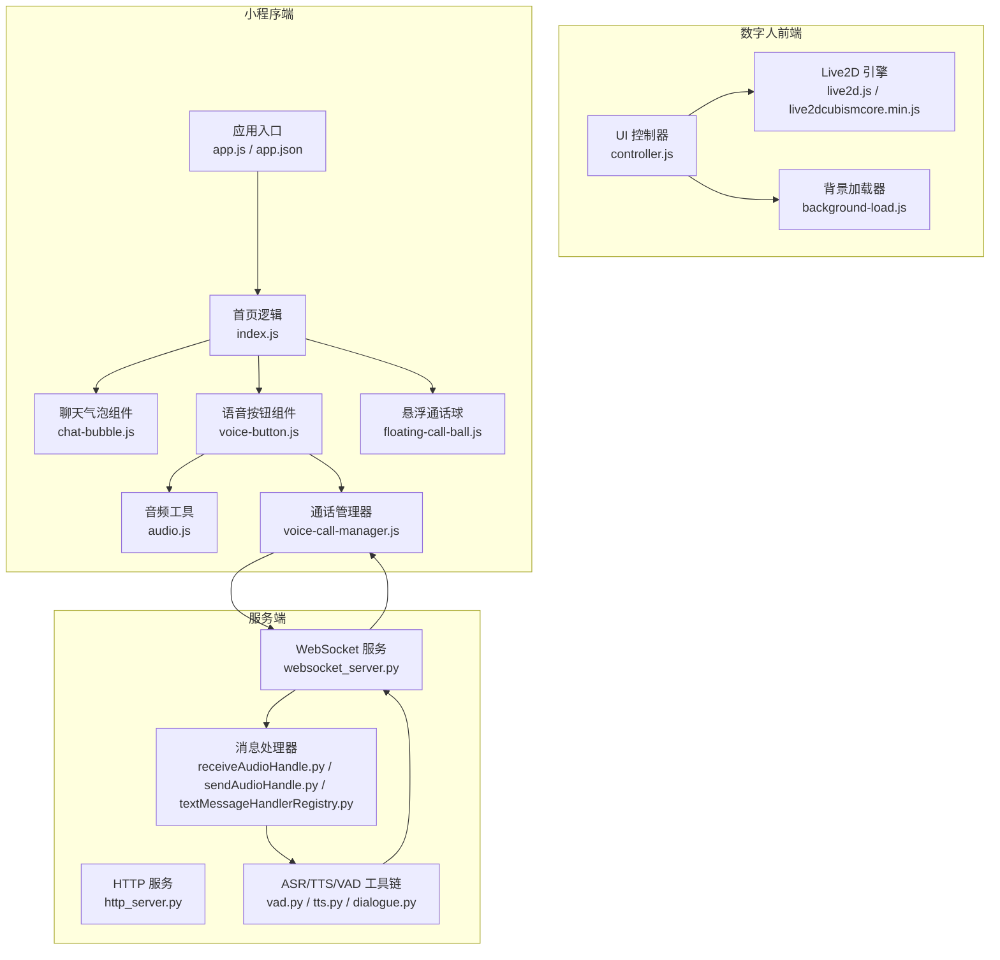
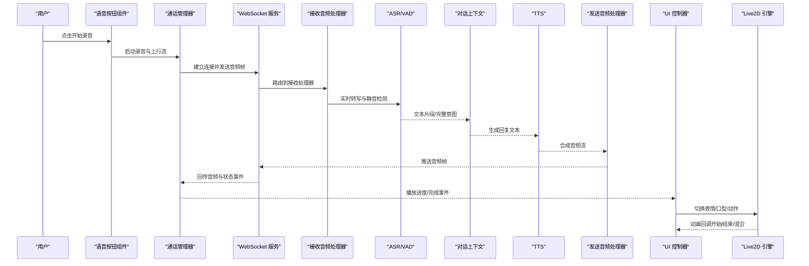
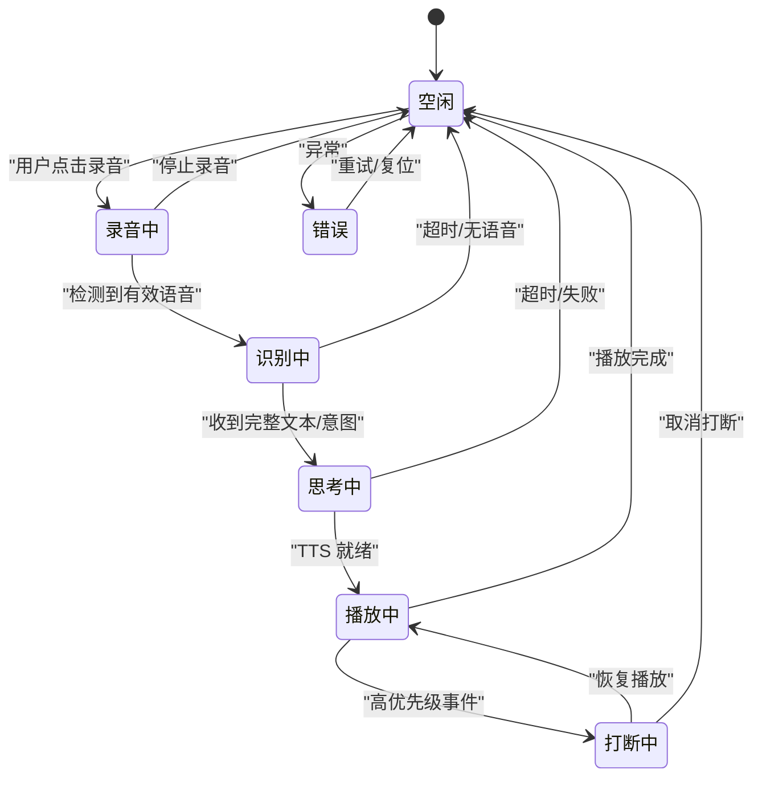
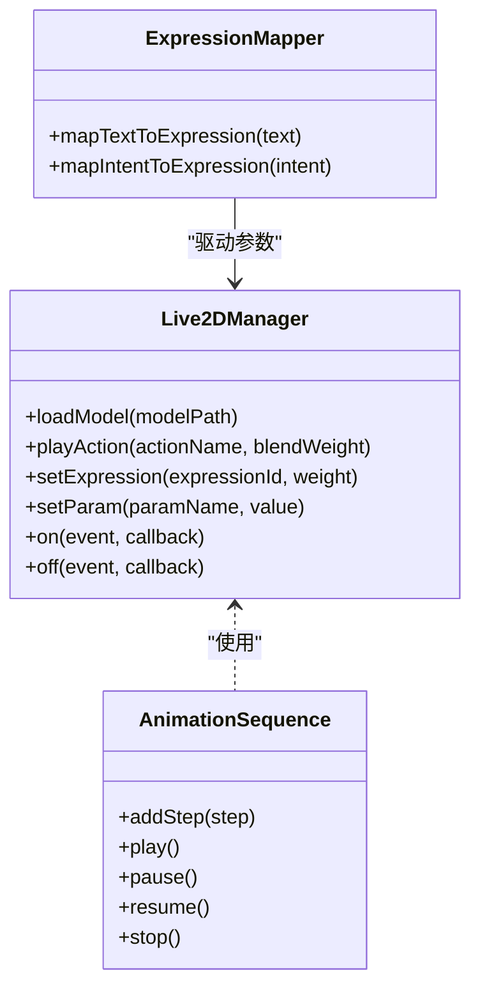
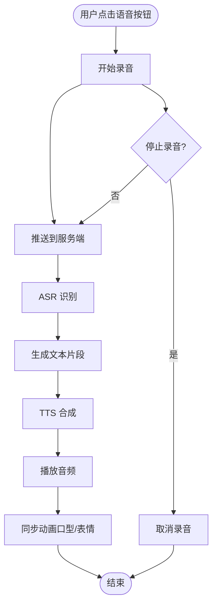
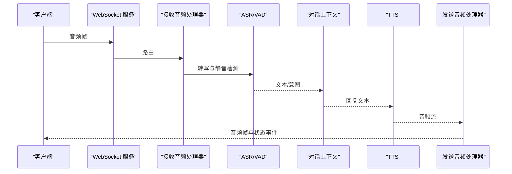
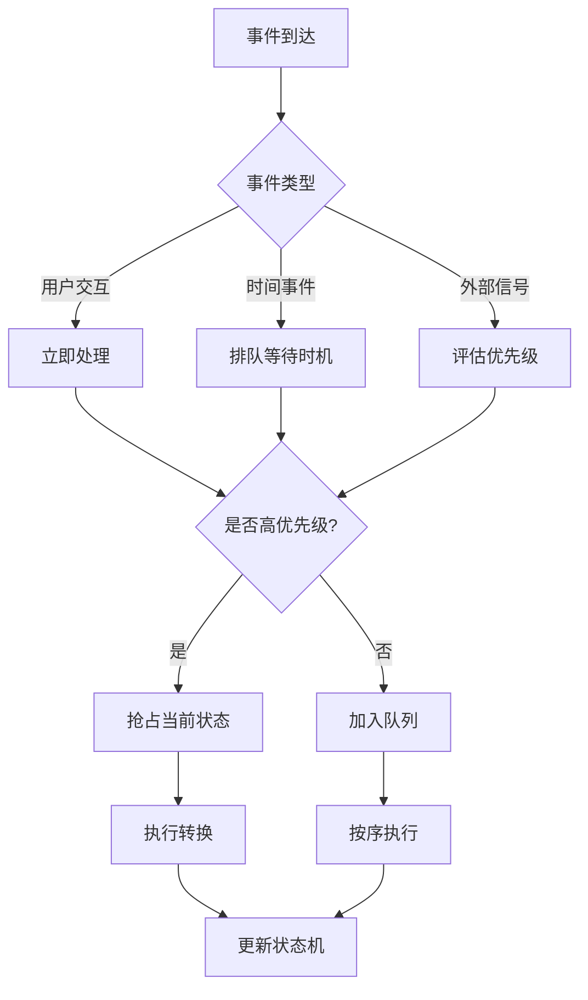
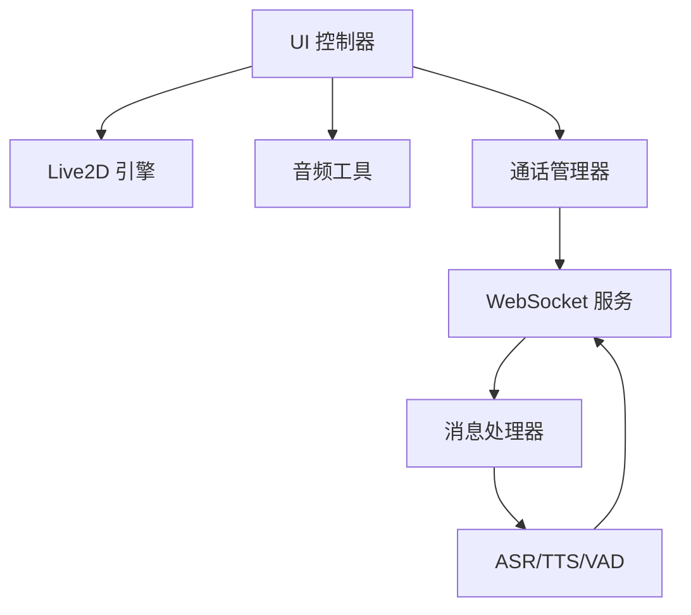

# 动画状态机

<cite>
**本文引用的文件**   
- [main.js](file://main/main.js)
- [app.js](file://main/app.js)
- [live2d.js](file://main/digital-human/js/live2d/live2d.js)
- [live2dcubismcore.min.js](file://main/digital-human/js/live2d/live2dcubismcore.min.js)
- [controller.js](file://main/digital-human/js/ui/controller.js)
- [background-load.js](file://main/digital-human/js/ui/background-load.js)
- [audio.js](file://main/miniprogram/utils/audio.js)
- [voice-call-manager.js](file://main/miniprogram/utils/voice-call-manager.js)
- [index.js](file://main/miniprogram/pages/index/index.js)
- [chat-bubble.js](file://main/miniprogram/components/chat-bubble/chat-bubble.js)
- [voice-button.js](file://main/miniprogram/components/voice-button/voice-button.js)
- [floating-call-ball.js](file://main/miniprogram/components/floating-call-ball/floating-call-ball.js)
- [app.json](file://main/miniprogram/app.json)
- [start.py](file://main/digital-human/start.py)
- [http_server.py](file://main/xiaozhi-server/core/http_server.py)
- [websocket_server.py](file://main/xiaozhi-server/core/websocket_server.py)
- [receiveAudioHandle.py](file://main/xiaozhi-server/core/handle/receiveAudioHandle.py)
- [sendAudioHandle.py](file://main/xiaozhi-server/core/handle/sendAudioHandle.py)
- [textMessageHandlerRegistry.py](file://main/xiaozhi-server/core/handle/textMessageHandlerRegistry.py)
- [dialogue.py](file://main/xiaozhi-server/core/utils/dialogue.py)
- [vad.py](file://main/xiaozhi-server/core/utils/vad.py)
- [tts.py](file://main/xiaozhi-server/core/utils/tts.py)
</cite>

## 目录
1. [简介](#简介)
2. [项目结构](#项目结构)
3. [核心组件](#核心组件)
4. [架构总览](#架构总览)
5. [详细组件分析](#详细组件分析)
6. [依赖关系分析](#依赖关系分析)
7. [性能考量](#性能考量)
8. [故障排查指南](#故障排查指南)
9. [结论](#结论)
10. [附录](#附录)

## 简介
本技术文档围绕“动画状态机”展开，聚焦于数字人前端与小程序端的动画控制、事件驱动机制、多阶段与并行动画管理、条件触发系统、优先级管理与中断处理，以及调试与性能监控方法。通过梳理现有代码中的 Live2D 集成、UI 控制器、音频与通话流程，构建一个可落地的动画状态机设计方案，并提供开发示例与最佳实践。

## 项目结构
本项目包含多个子模块：数字人前端（Live2D）、微信小程序端、服务端（HTTP/WebSocket、ASR/TTS/VAD）。动画状态机的实现主要分布在数字人前端的 UI 控制器与 Live2D 交互层，以及小程序端的页面与组件中；服务端负责音视频流与文本消息的调度，为前端动画提供数据与事件来源。

图表来源
- [live2d.js](file://main/digital-human/js/live2d/live2d.js)
- [live2dcubismcore.min.js](file://main/digital-human/js/live2d/live2dcubismcore.min.js)
- [controller.js](file://main/digital-human/js/ui/controller.js)
- [background-load.js](file://main/digital-human/js/ui/background-load.js)
- [app.js](file://main/miniprogram/app.js)
- [app.json](file://main/miniprogram/app.json)
- [index.js](file://main/miniprogram/pages/index/index.js)
- [chat-bubble.js](file://main/miniprogram/components/chat-bubble/chat-bubble.js)
- [voice-button.js](file://main/miniprogram/components/voice-button/voice-button.js)
- [floating-call-ball.js](file://main/miniprogram/components/floating-call-ball/floating-call-ball.js)
- [audio.js](file://main/miniprogram/utils/audio.js)
- [voice-call-manager.js](file://main/miniprogram/utils/voice-call-manager.js)
- [http_server.py](file://main/xiaozhi-server/core/http_server.py)
- [websocket_server.py](file://main/xiaozhi-server/core/websocket_server.py)
- [receiveAudioHandle.py](file://main/xiaozhi-server/core/handle/receiveAudioHandle.py)
- [sendAudioHandle.py](file://main/xiaozhi-server/core/handle/sendAudioHandle.py)
- [textMessageHandlerRegistry.py](file://main/xiaozhi-server/core/handle/textMessageHandlerRegistry.py)
- [dialogue.py](file://main/xiaozhi-server/core/utils/dialogue.py)
- [vad.py](file://main/xiaozhi-server/core/utils/vad.py)
- [tts.py](file://main/xiaozhi-server/core/utils/tts.py)

章节来源
- [controller.js](file://main/digital-human/js/ui/controller.js)
- [live2d.js](file://main/digital-human/js/live2d/live2d.js)
- [background-load.js](file://main/digital-human/js/ui/background-load.js)
- [app.js](file://main/miniprogram/app.js)
- [app.json](file://main/miniprogram/app.json)
- [index.js](file://main/miniprogram/pages/index/index.js)
- [chat-bubble.js](file://main/miniprogram/components/chat-bubble/chat-bubble.js)
- [voice-button.js](file://main/miniprogram/components/voice-button/voice-button.js)
- [floating-call-ball.js](file://main/miniprogram/components/floating-call-ball/floating-call-ball.js)
- [audio.js](file://main/miniprogram/utils/audio.js)
- [voice-call-manager.js](file://main/miniprogram/utils/voice-call-manager.js)
- [http_server.py](file://main/xiaozhi-server/core/http_server.py)
- [websocket_server.py](file://main/xiaozhi-server/core/websocket_server.py)
- [receiveAudioHandle.py](file://main/xiaozhi-server/core/handle/receiveAudioHandle.py)
- [sendAudioHandle.py](file://main/xiaozhi-server/core/handle/sendAudioHandle.py)
- [textMessageHandlerRegistry.py](file://main/xiaozhi-server/core/handle/textMessageHandlerRegistry.py)
- [dialogue.py](file://main/xiaozhi-server/core/utils/dialogue.py)
- [vad.py](file://main/xiaozhi-server/core/utils/vad.py)
- [tts.py](file://main/xiaozhi-server/core/utils/tts.py)

## 核心组件
- 动画状态机（概念）：定义状态集合、转换条件、事件驱动与优先级策略，协调多阶段与并行动画。
- Live2D 渲染层：封装模型加载、动作播放、表情切换与混合参数控制。
- UI 控制器：作为状态机的前端中枢，监听用户交互、外部信号与时间事件，驱动状态转换。
- 小程序端组件：语音按钮、聊天气泡、悬浮通话球等，负责采集输入、展示输出并与状态机同步。
- 服务端管道：接收音频/文本、执行 ASR/TTS/VAD，并通过 WebSocket 回传结果，驱动前端状态机。

章节来源
- [controller.js](file://main/digital-human/js/ui/controller.js)
- [live2d.js](file://main/digital-human/js/live2d/live2d.js)
- [voice-button.js](file://main/miniprogram/components/voice-button/voice-button.js)
- [chat-bubble.js](file://main/miniprogram/components/chat-bubble/chat-bubble.js)
- [floating-call-ball.js](file://main/miniprogram/components/floating-call-ball/floating-call-ball.js)
- [audio.js](file://main/miniprogram/utils/audio.js)
- [voice-call-manager.js](file://main/miniprogram/utils/voice-call-manager.js)
- [receiveAudioHandle.py](file://main/xiaozhi-server/core/handle/receiveAudioHandle.py)
- [sendAudioHandle.py](file://main/xiaozhi-server/core/handle/sendAudioHandle.py)
- [textMessageHandlerRegistry.py](file://main/xiaozhi-server/core/handle/textMessageHandlerRegistry.py)

## 架构总览
动画状态机贯穿“用户交互—前端状态机—渲染层—服务端管道—反馈回写”的闭环。关键路径包括：
- 用户点击语音按钮，进入“录音/说话”状态，触发 ASR 流式识别。
- 服务端返回文本或中间结果，更新对话上下文，驱动 TTS 合成。
- 前端根据 TTS 播放进度与语义片段，切换 Live2D 表情与口型动画。
- 高优先级事件（如来电、系统提示）可中断当前低优先级动画，确保重要信息优先显示。

图表来源
- [voice-button.js](file://main/miniprogram/components/voice-button/voice-button.js)
- [voice-call-manager.js](file://main/miniprogram/utils/voice-call-manager.js)
- [websocket_server.py](file://main/xiaozhi-server/core/websocket_server.py)
- [receiveAudioHandle.py](file://main/xiaozhi-server/core/handle/receiveAudioHandle.py)
- [sendAudioHandle.py](file://main/xiaozhi-server/core/handle/sendAudioHandle.py)
- [dialogue.py](file://main/xiaozhi-server/core/utils/dialogue.py)
- [vad.py](file://main/xiaozhi-server/core/utils/vad.py)
- [tts.py](file://main/xiaozhi-server/core/utils/tts.py)
- [controller.js](file://main/digital-human/js/ui/controller.js)
- [live2d.js](file://main/digital-human/js/live2d/live2d.js)

## 详细组件分析

### 动画状态机设计模式
- 状态定义：空闲、录音中、识别中、思考中、播放中、打断中、错误等。
- 转换条件：基于用户操作（点击、长按）、时间事件（超时、计时器）、外部信号（WebSocket 事件、系统通知）。
- 事件驱动：统一事件总线分发，避免紧耦合；支持订阅/发布与优先级队列。
- 优先级与中断：高优先级状态（来电、紧急提示）可抢占低优先级动画；支持平滑过渡与回滚。
- 多阶段与并行动画：主序列（如“问候→倾听→回答”）与并行轨道（口型、表情、肢体）解耦，按权重混合。

图表来源
- [controller.js](file://main/digital-human/js/ui/controller.js)
- [voice-button.js](file://main/miniprogram/components/voice-button/voice-button.js)
- [voice-call-manager.js](file://main/miniprogram/utils/voice-call-manager.js)
- [receiveAudioHandle.py](file://main/xiaozhi-server/core/handle/receiveAudioHandle.py)
- [sendAudioHandle.py](file://main/xiaozhi-server/core/handle/sendAudioHandle.py)
- [dialogue.py](file://main/xiaozhi-server/core/utils/dialogue.py)
- [vad.py](file://main/xiaozhi-server/core/utils/vad.py)
- [tts.py](file://main/xiaozhi-server/core/utils/tts.py)

章节来源
- [controller.js](file://main/digital-human/js/ui/controller.js)
- [voice-button.js](file://main/miniprogram/components/voice-button/voice-button.js)
- [voice-call-manager.js](file://main/miniprogram/utils/voice-call-manager.js)
- [receiveAudioHandle.py](file://main/xiaozhi-server/core/handle/receiveAudioHandle.py)
- [sendAudioHandle.py](file://main/xiaozhi-server/core/handle/sendAudioHandle.py)
- [dialogue.py](file://main/xiaozhi-server/core/utils/dialogue.py)
- [vad.py](file://main/xiaozhi-server/core/utils/vad.py)
- [tts.py](file://main/xiaozhi-server/core/utils/tts.py)

### Live2D 渲染层与动画序列
- 模型加载与资源预热：在后台加载模型与动作资源，减少首帧延迟。
- 动作播放与混合：支持多动作叠加（口型、眨眼、头部微动），按权重混合。
- 表情与参数控制：通过参数映射将文本/语义片段映射到表情与口型参数。
- 回调与生命周期：开始、暂停、恢复、结束事件用于与状态机同步。

图表来源
- [live2d.js](file://main/digital-human/js/live2d/live2d.js)
- [live2dcubismcore.min.js](file://main/digital-human/js/live2d/live2dcubismcore.min.js)
- [controller.js](file://main/digital-human/js/ui/controller.js)

章节来源
- [live2d.js](file://main/digital-human/js/live2d/live2d.js)
- [live2dcubismcore.min.js](file://main/digital-human/js/live2d/live2dcubismcore.min.js)
- [controller.js](file://main/digital-human/js/ui/controller.js)

### 小程序端交互与状态同步
- 语音按钮：捕获录音开始/结束、音量变化、错误事件，驱动状态机进入“录音中”。
- 聊天气泡：展示文本与富媒体，随 TTS 播放进度高亮当前句段。
- 悬浮通话球：全局快捷入口，支持快速发起通话、挂断、静音等操作。
- 音频工具：封装播放、缓冲、进度回调，保证与动画节奏一致。
- 通话管理器：维护 WebSocket 连接、音频流收发、重连与错误恢复。

图表来源
- [voice-button.js](file://main/miniprogram/components/voice-button/voice-button.js)
- [audio.js](file://main/miniprogram/utils/audio.js)
- [voice-call-manager.js](file://main/miniprogram/utils/voice-call-manager.js)
- [receiveAudioHandle.py](file://main/xiaozhi-server/core/handle/receiveAudioHandle.py)
- [sendAudioHandle.py](file://main/xiaozhi-server/core/handle/sendAudioHandle.py)
- [tts.py](file://main/xiaozhi-server/core/utils/tts.py)

章节来源
- [voice-button.js](file://main/miniprogram/components/voice-button/voice-button.js)
- [chat-bubble.js](file://main/miniprogram/components/chat-bubble/chat-bubble.js)
- [floating-call-ball.js](file://main/miniprogram/components/floating-call-ball/floating-call-ball.js)
- [audio.js](file://main/miniprogram/utils/audio.js)
- [voice-call-manager.js](file://main/miniprogram/utils/voice-call-manager.js)

### 服务端消息处理与状态驱动
- 接收音频处理器：解析音频帧、调用 VAD 检测、转发至 ASR。
- 发送音频处理器：接收 TTS 输出，分片推送至客户端。
- 文本消息注册表：按类型路由不同处理器（如系统通知、业务指令）。
- 对话上下文：维护会话历史、意图与实体，驱动 TTS 内容生成。
- VAD/TTS：静音检测与语音合成，影响前端状态转换时机。

图表来源
- [websocket_server.py](file://main/xiaozhi-server/core/websocket_server.py)
- [receiveAudioHandle.py](file://main/xiaozhi-server/core/handle/receiveAudioHandle.py)
- [sendAudioHandle.py](file://main/xiaozhi-server/core/handle/sendAudioHandle.py)
- [textMessageHandlerRegistry.py](file://main/xiaozhi-server/core/handle/textMessageHandlerRegistry.py)
- [dialogue.py](file://main/xiaozhi-server/core/utils/dialogue.py)
- [vad.py](file://main/xiaozhi-server/core/utils/vad.py)
- [tts.py](file://main/xiaozhi-server/core/utils/tts.py)

章节来源
- [receiveAudioHandle.py](file://main/xiaozhi-server/core/handle/receiveAudioHandle.py)
- [sendAudioHandle.py](file://main/xiaozhi-server/core/handle/sendAudioHandle.py)
- [textMessageHandlerRegistry.py](file://main/xiaozhi-server/core/handle/textMessageHandlerRegistry.py)
- [dialogue.py](file://main/xiaozhi-server/core/utils/dialogue.py)
- [vad.py](file://main/xiaozhi-server/core/utils/vad.py)
- [tts.py](file://main/xiaozhi-server/core/utils/tts.py)

### 条件触发系统与优先级管理
- 用户交互：点击、长按、滑动等手势触发状态转换。
- 时间事件：定时器、超时、节拍驱动周期性动画（如呼吸、眨眼）。
- 外部信号：WebSocket 事件、系统通知、设备状态变更。
- 优先级策略：高优先级事件（来电、紧急提示）抢占低优先级动画；支持平滑过渡与回滚。
- 中断处理：记录中断点，支持恢复或放弃；避免状态不一致。

图表来源
- [controller.js](file://main/digital-human/js/ui/controller.js)
- [voice-button.js](file://main/miniprogram/components/voice-button/voice-button.js)
- [floating-call-ball.js](file://main/miniprogram/components/floating-call-ball/floating-call-ball.js)
- [voice-call-manager.js](file://main/miniprogram/utils/voice-call-manager.js)

章节来源
- [controller.js](file://main/digital-human/js/ui/controller.js)
- [voice-button.js](file://main/miniprogram/components/voice-button/voice-button.js)
- [floating-call-ball.js](file://main/miniprogram/components/floating-call-ball/floating-call-ball.js)
- [voice-call-manager.js](file://main/miniprogram/utils/voice-call-manager.js)

### 开发示例与实践
- 定义新动画状态：在状态机中新增状态节点，定义进入/退出钩子与转换条件。
- 编写转换逻辑：在 UI 控制器中监听事件，判断条件后调用状态转换 API。
- 实现交互式动画效果：将用户手势映射到 Live2D 动作与表情参数，结合音频进度同步。
- 多阶段与并行动画：使用序列与轨道组合，设置权重与混合策略，确保视觉一致性。

章节来源
- [controller.js](file://main/digital-human/js/ui/controller.js)
- [live2d.js](file://main/digital-human/js/live2d/live2d.js)
- [voice-button.js](file://main/miniprogram/components/voice-button/voice-button.js)
- [chat-bubble.js](file://main/miniprogram/components/chat-bubble/chat-bubble.js)

## 依赖关系分析
- 前端依赖：Live2D 引擎、UI 控制器、音频工具、通话管理器。
- 小程序依赖：页面逻辑、组件库、音频与网络工具。
- 服务端依赖：HTTP/WebSocket 服务、消息处理器、ASR/TTS/VAD、对话上下文。
- 耦合与内聚：状态机与渲染层解耦，通过事件与回调通信；组件间通过统一接口协作。

图表来源
- [controller.js](file://main/digital-human/js/ui/controller.js)
- [live2d.js](file://main/digital-human/js/live2d/live2d.js)
- [audio.js](file://main/miniprogram/utils/audio.js)
- [voice-call-manager.js](file://main/miniprogram/utils/voice-call-manager.js)
- [websocket_server.py](file://main/xiaozhi-server/core/websocket_server.py)
- [receiveAudioHandle.py](file://main/xiaozhi-server/core/handle/receiveAudioHandle.py)
- [sendAudioHandle.py](file://main/xiaozhi-server/core/handle/sendAudioHandle.py)
- [vad.py](file://main/xiaozhi-server/core/utils/vad.py)
- [tts.py](file://main/xiaozhi-server/core/utils/tts.py)

章节来源
- [controller.js](file://main/digital-human/js/ui/controller.js)
- [live2d.js](file://main/digital-human/js/live2d/live2d.js)
- [audio.js](file://main/miniprogram/utils/audio.js)
- [voice-call-manager.js](file://main/miniprogram/utils/voice-call-manager.js)
- [websocket_server.py](file://main/xiaozhi-server/core/websocket_server.py)
- [receiveAudioHandle.py](file://main/xiaozhi-server/core/handle/receiveAudioHandle.py)
- [sendAudioHandle.py](file://main/xiaozhi-server/core/handle/sendAudioHandle.py)
- [vad.py](file://main/xiaozhi-server/core/utils/vad.py)
- [tts.py](file://main/xiaozhi-server/core/utils/tts.py)

## 性能考量
- 资源预热：提前加载模型与动作资源，减少首帧延迟。
- 动画混合：合理设置权重与插值，避免频繁切换导致的闪烁。
- 音频缓冲：动态调整缓冲区大小，平衡延迟与稳定性。
- 事件节流：对高频事件进行节流与合并，降低 CPU 占用。
- 监控指标：记录状态转换耗时、动画帧率、音频延迟、内存占用。

[本节为通用指导，不直接分析具体文件]

## 故障排查指南
- 常见问题：
  - 动画卡顿：检查资源加载与混合策略，优化事件频率。
  - 音画不同步：校准音频进度与动画回调，增加缓冲与补偿。
  - 状态死锁：检查转换条件与中断逻辑，确保状态可复位。
  - 网络异常：重连机制与降级策略，记录错误码与日志。
- 调试工具：
  - 状态机可视化：绘制状态图与转换轨迹，辅助定位问题。
  - 性能面板：监控帧率、CPU、内存、网络请求。
  - 日志与埋点：关键事件与异常上报，便于回溯与分析。

章节来源
- [controller.js](file://main/digital-human/js/ui/controller.js)
- [voice-call-manager.js](file://main/miniprogram/utils/voice-call-manager.js)
- [audio.js](file://main/miniprogram/utils/audio.js)
- [websocket_server.py](file://main/xiaozhi-server/core/websocket_server.py)

## 结论
本方案以状态机为核心，整合 Live2D 渲染、小程序交互与服务端管道，形成完整的动画控制系统。通过事件驱动、优先级管理与多阶段/并行动画，满足复杂场景下的动画需求。配合调试与性能监控，可提升用户体验与系统稳定性。

[本节为总结性内容，不直接分析具体文件]

## 附录
- 配置与启动：
  - 数字人前端启动脚本与配置文件。
  - 小程序应用入口与页面注册。
- 参考实现：
  - Live2D 引擎与核心库。
  - 音频与网络工具库。
  - 服务端消息处理与工具链。

章节来源
- [start.py](file://main/digital-human/start.py)
- [app.json](file://main/miniprogram/app.json)
- [app.js](file://main/miniprogram/app.js)
- [live2dcubismcore.min.js](file://main/digital-human/js/live2d/live2dcubismcore.min.js)
- [audio.js](file://main/miniprogram/utils/audio.js)
- [voice-call-manager.js](file://main/miniprogram/utils/voice-call-manager.js)
- [http_server.py](file://main/xiaozhi-server/core/http_server.py)
- [websocket_server.py](file://main/xiaozhi-server/core/websocket_server.py)