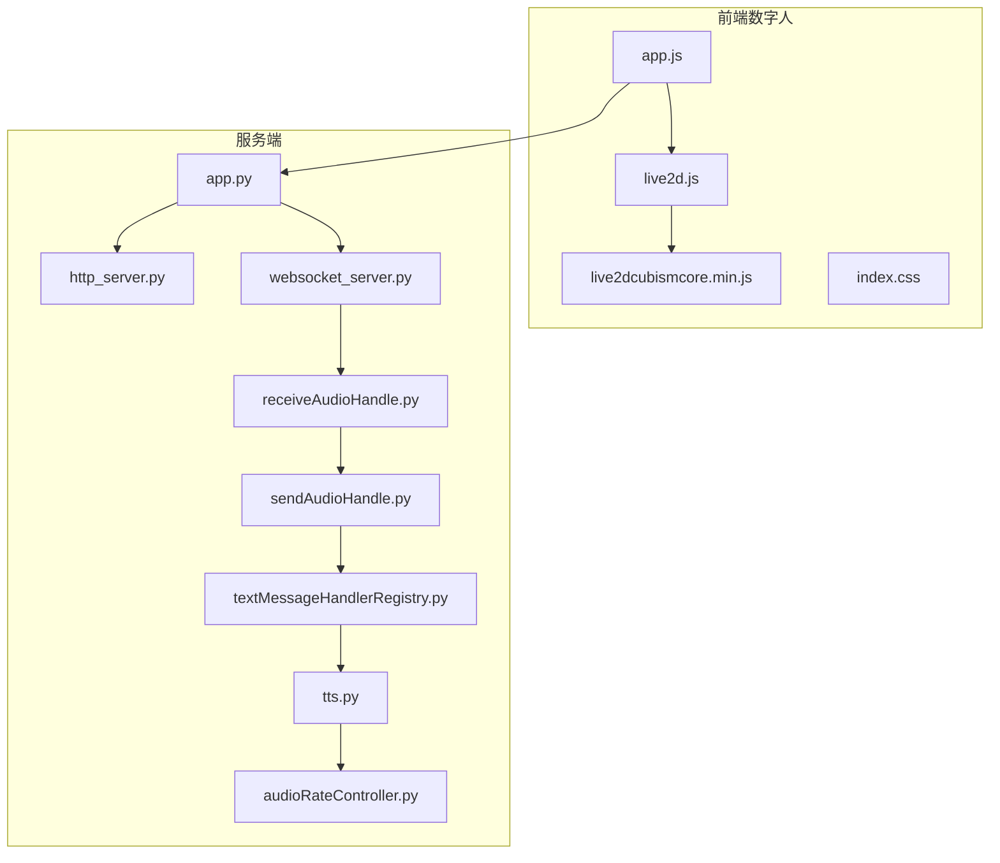
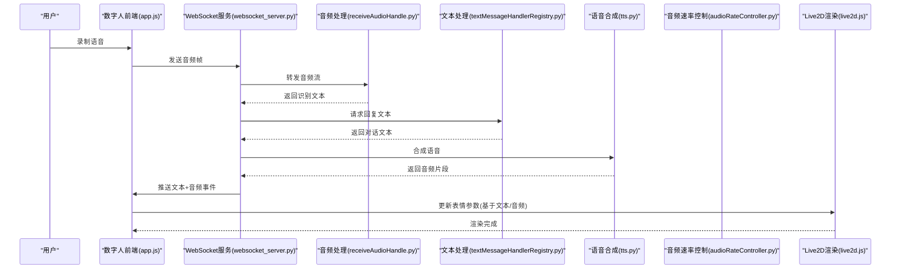
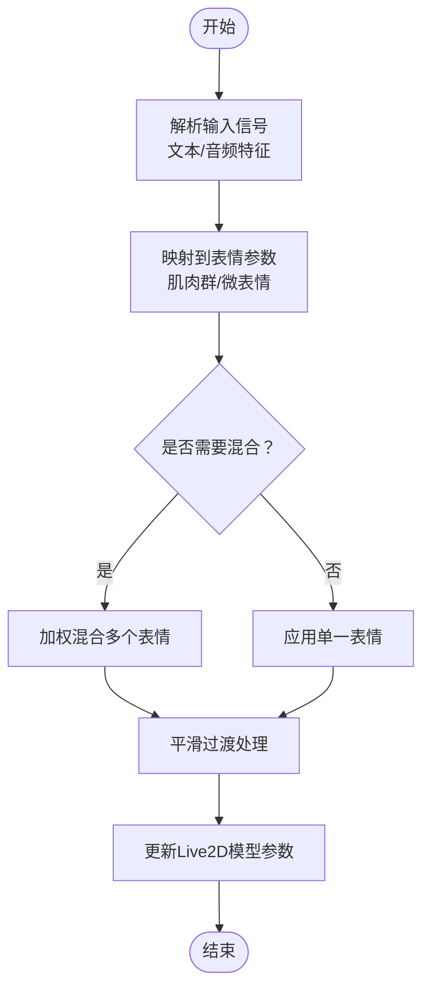
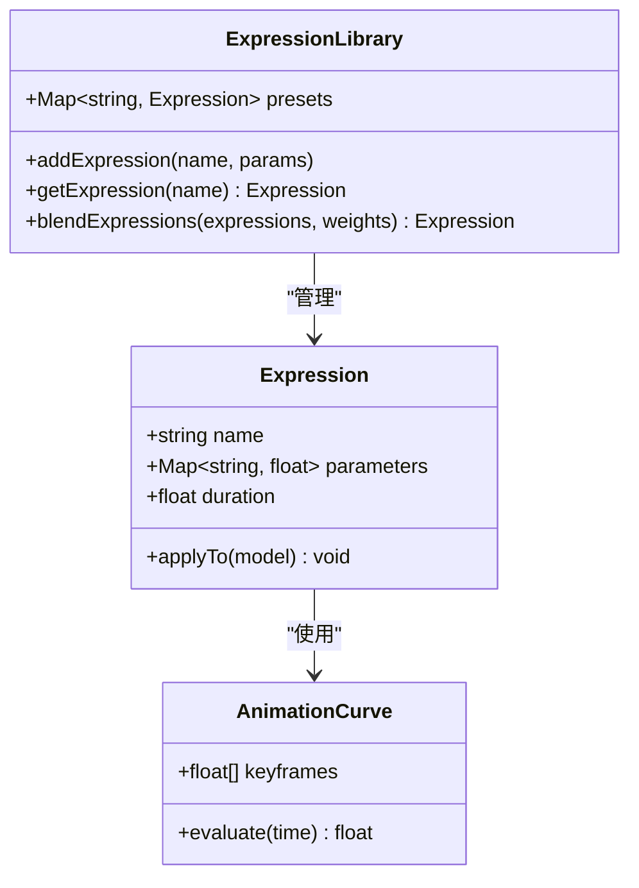
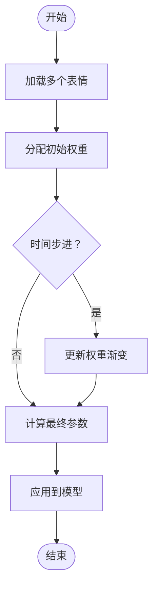
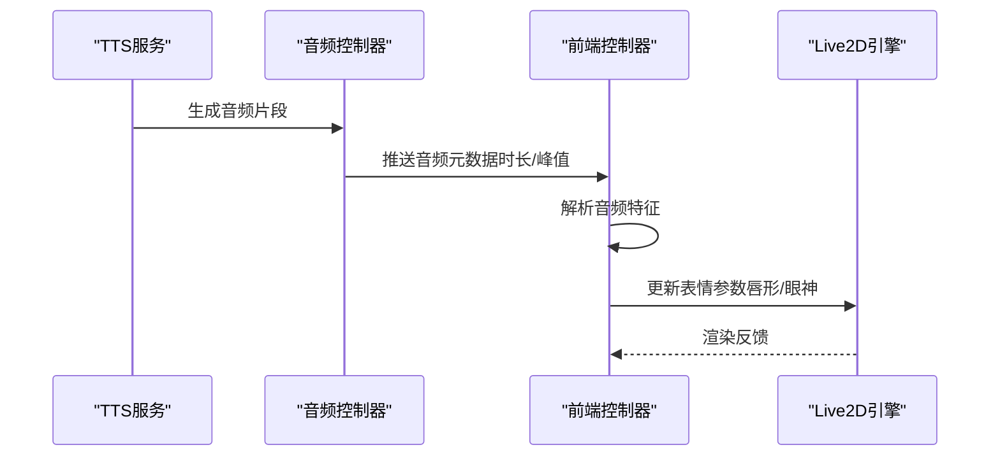
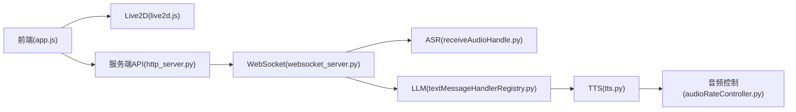

# 表情控制系统

<cite>
**本文引用的文件**   
- [main.js](file://main/digital-human/js/app.js)
- [live2d.js](file://main/digital-human/js/live2d/live2d.js)
- [live2dcubismcore.min.js](file://main/digital-human/js/live2d/live2dcubismcore.min.js)
- [index.css](file://main/digital-human/css/index.css)
- [config.json](file://main/digital-human/wakeword_runtime/config.json)
- [app.py](file://main/xiaozhi-server/app.py)
- [http_server.py](file://main/xiaozhi-server/core/http_server.py)
- [websocket_server.py](file://main/xiaozhi-server/core/websocket_server.py)
- [receiveAudioHandle.py](file://main/xiaozhi-server/core/handle/receiveAudioHandle.py)
- [sendAudioHandle.py](file://main/xiaozhi-server/core/handle/sendAudioHandle.py)
- [textMessageHandlerRegistry.py](file://main/xiaozhi-server/core/handle/textMessageHandlerRegistry.py)
- [tts.py](file://main/xiaozhi-server/core/utils/tts.py)
- [audioRateController.py](file://main/xiaozhi-server/core/utils/audioRateController.py)
</cite>

## 目录
1. [简介](#简介)
2. [项目结构](#项目结构)
3. [核心组件](#核心组件)
4. [架构总览](#架构总览)
5. [详细组件分析](#详细组件分析)
6. [依赖关系分析](#依赖关系分析)
7. [性能考量](#性能考量)
8. [故障排查指南](#故障排查指南)
9. [结论](#结论)
10. [附录](#附录)

## 简介
本技术文档面向“表情控制系统”，聚焦数字人前端与后端协作的完整链路：从音频输入、语音识别、文本生成到TTS合成，再到Live2D模型的参数映射与渲染。文档重点阐述表情参数映射机制（面部肌肉模拟、微表情控制、平滑过渡）、表情库管理（预定义表情、动态生成、组合）、权重系统（多表情混合与渐变）、以及表情与音频联动（基于语音内容自动生成表情变化）。同时提供开发示例（自定义表情、动画曲线、性能优化）和测试工具建议，帮助开发者快速落地并优化体验。

## 项目结构
本项目包含数字人前端（Live2D渲染）、唤醒词运行时、以及服务端（ASR/LLM/TTS/消息路由等）。表情控制主要涉及以下模块：
- 前端数字人：负责加载模型、解析动作/表情参数、驱动Live2D渲染
- 服务端：处理音频流、ASR转写、LLM对话、TTS合成、事件分发
- 通信层：HTTP/WebSocket用于前后端交互与实时数据推送

**图表来源** 
- [app.js:1-200](file://main/digital-human/js/app.js#L1-L200)
- [live2d.js:1-200](file://main/digital-human/js/live2d/live2d.js#L1-L200)
- [live2dcubismcore.min.js:1-200](file://main/digital-human/js/live2d/live2dcubismcore.min.js#L1-L200)
- [index.css:1-200](file://main/digital-human/css/index.css#L1-L200)
- [app.py:1-200](file://main/xiaozhi-server/app.py#L1-L200)
- [http_server.py:1-200](file://main/xiaozhi-server/core/http_server.py#L1-L200)
- [websocket_server.py:1-200](file://main/xiaozhi-server/core/websocket_server.py#L1-L200)
- [receiveAudioHandle.py:1-200](file://main/xiaozhi-server/core/handle/receiveAudioHandle.py#L1-L200)
- [sendAudioHandle.py:1-200](file://main/xiaozhi-server/core/handle/sendAudioHandle.py#L1-L200)
- [textMessageHandlerRegistry.py:1-200](file://main/xiaozhi-server/core/handle/textMessageHandlerRegistry.py#L1-L200)
- [tts.py:1-200](file://main/xiaozhi-server/core/utils/tts.py#L1-L200)
- [audioRateController.py:1-200](file://main/xiaozhi-server/core/utils/audioRateController.py#L1-L200)

**章节来源**
- [app.js:1-200](file://main/digital-human/js/app.js#L1-L200)
- [live2d.js:1-200](file://main/digital-human/js/live2d/live2d.js#L1-L200)
- [app.py:1-200](file://main/xiaozhi-server/app.py#L1-L200)

## 核心组件
- 数字人前端控制器：负责初始化Live2D引擎、加载模型资源、接收后端事件并更新模型参数
- Live2D渲染层：封装Cubism Core调用，提供参数设置、动画播放、状态切换接口
- 服务端消息路由：统一接入HTTP/WebSocket，将音频、文本、TTS结果分发至对应处理器
- TTS与音频速率控制：将文本转为语音，按节奏控制表情触发时机
- 配置管理：集中管理模型路径、默认表情、动作映射表等

**章节来源**
- [live2d.js:1-200](file://main/digital-human/js/live2d/live2d.js#L1-L200)
- [http_server.py:1-200](file://main/xiaozhi-server/core/http_server.py#L1-L200)
- [websocket_server.py:1-200](file://main/xiaozhi-server/core/websocket_server.py#L1-L200)
- [tts.py:1-200](file://main/xiaozhi-server/core/utils/tts.py#L1-L200)
- [audioRateController.py:1-200](file://main/xiaozhi-server/core/utils/audioRateController.py#L1-L200)

## 架构总览
下图展示从用户语音输入到数字人表情输出的端到端流程，包括ASR、LLM、TTS、事件分发与前端渲染的关键节点。

**图表来源** 
- [websocket_server.py:1-200](file://main/xiaozhi-server/core/websocket_server.py#L1-L200)
- [receiveAudioHandle.py:1-200](file://main/xiaozhi-server/core/handle/receiveAudioHandle.py#L1-L200)
- [textMessageHandlerRegistry.py:1-200](file://main/xiaozhi-server/core/handle/textMessageHandlerRegistry.py#L1-L200)
- [tts.py:1-200](file://main/xiaozhi-server/core/utils/tts.py#L1-L200)
- [audioRateController.py:1-200](file://main/xiaozhi-server/core/utils/audioRateController.py#L1-L200)
- [live2d.js:1-200](file://main/digital-human/js/live2d/live2d.js#L1-L200)

## 详细组件分析

### 表情参数映射机制
- 面部肌肉模拟：通过Live2D参数映射表将语义标签（如“高兴”“惊讶”）转换为具体参数值（眼轮匝肌、口轮匝肌等），支持非线性映射以增强真实感
- 微表情控制：在基础表情之上叠加细微参数（如眉毛抖动、嘴角微动），提升情感细腻度
- 平滑过渡：使用插值算法对参数变化进行时间平滑，避免突变；支持缓动曲线（ease-in-out）

**图表来源** 
- [live2d.js:1-200](file://main/digital-human/js/live2d/live2d.js#L1-L200)
- [app.js:1-200](file://main/digital-human/js/app.js#L1-L200)

**章节来源**
- [live2d.js:1-200](file://main/digital-human/js/live2d/live2d.js#L1-L200)
- [app.js:1-200](file://main/digital-human/js/app.js#L1-L200)

### 表情库管理
- 预定义表情：内置常用表情模板（开心、悲伤、愤怒等），每个表情包含参数快照与持续时间
- 动态表情生成：根据上下文（如关键词、语调）实时计算参数偏移量
- 表情组合：支持多表情叠加（如“微笑+眨眼”），通过权重分配实现自然融合

**图表来源** 
- [live2d.js:1-200](file://main/digital-human/js/live2d/live2d.js#L1-L200)
- [app.js:1-200](file://main/digital-human/js/app.js#L1-L200)

**章节来源**
- [live2d.js:1-200](file://main/digital-human/js/live2d/live2d.js#L1-L200)
- [app.js:1-200](file://main/digital-human/js/app.js#L1-L200)

### 表情权重系统
- 多表情混合：为每个表情分配权重（0-1），最终参数为加权平均
- 渐变效果：权重随时间变化，实现淡入淡出或动态过渡
- 冲突解决：当多个表情作用于同一参数时，采用优先级或归一化策略

**图表来源** 
- [live2d.js:1-200](file://main/digital-human/js/live2d/live2d.js#L1-L200)
- [app.js:1-200](file://main/digital-human/js/app.js#L1-L200)

**章节来源**
- [live2d.js:1-200](file://main/digital-human/js/live2d/live2d.js#L1-L200)
- [app.js:1-200](file://main/digital-human/js/app.js#L1-L200)

### 表情与音频联动
- 语音内容分析：提取音高、音量、语速等特征，映射到表情强度
- 关键词触发：特定词汇（如“你好”“再见”）直接触发预设表情
- 节奏同步：TTS音频片段与表情变化时序对齐，确保唇形与发音一致

**图表来源** 
- [tts.py:1-200](file://main/xiaozhi-server/core/utils/tts.py#L1-L200)
- [audioRateController.py:1-200](file://main/xiaozhi-server/core/utils/audioRateController.py#L1-L200)
- [live2d.js:1-200](file://main/digital-human/js/live2d/live2d.js#L1-L200)

**章节来源**
- [tts.py:1-200](file://main/xiaozhi-server/core/utils/tts.py#L1-L200)
- [audioRateController.py:1-200](file://main/xiaozhi-server/core/utils/audioRateController.py#L1-L200)
- [live2d.js:1-200](file://main/digital-human/js/live2d/live2d.js#L1-L200)

### 开发示例
- 创建自定义表情：在表情库中添加新条目，定义参数快照与动画曲线
- 实现表情动画曲线：使用关键帧插值实现复杂运动轨迹
- 优化渲染性能：减少参数更新频率、批量更新、使用离屏渲染

**章节来源**
- [live2d.js:1-200](file://main/digital-human/js/live2d/live2d.js#L1-L200)
- [app.js:1-200](file://main/digital-human/js/app.js#L1-L200)

### 测试工具与用户体验优化
- 测试工具：提供表情调试面板，实时预览参数变化与混合效果
- 用户体验优化：降低延迟、增加反馈动画、适配不同设备分辨率

**章节来源**
- [index.css:1-200](file://main/digital-human/css/index.css#L1-L200)
- [config.json:1-200](file://main/digital-human/wakeword_runtime/config.json#L1-L200)

## 依赖关系分析
前端依赖Live2D引擎与服务端API，服务端依赖ASR/LLM/TTS组件，各模块通过HTTP/WebSocket解耦。

**图表来源** 
- [app.js:1-200](file://main/digital-human/js/app.js#L1-L200)
- [live2d.js:1-200](file://main/digital-human/js/live2d/live2d.js#L1-L200)
- [http_server.py:1-200](file://main/xiaozhi-server/core/http_server.py#L1-L200)
- [websocket_server.py:1-200](file://main/xiaozhi-server/core/websocket_server.py#L1-L200)
- [receiveAudioHandle.py:1-200](file://main/xiaozhi-server/core/handle/receiveAudioHandle.py#L1-L200)
- [textMessageHandlerRegistry.py:1-200](file://main/xiaozhi-server/core/handle/textMessageHandlerRegistry.py#L1-L200)
- [tts.py:1-200](file://main/xiaozhi-server/core/utils/tts.py#L1-L200)
- [audioRateController.py:1-200](file://main/xiaozhi-server/core/utils/audioRateController.py#L1-L200)

**章节来源**
- [app.js:1-200](file://main/digital-human/js/app.js#L1-L200)
- [http_server.py:1-200](file://main/xiaozhi-server/core/http_server.py#L1-L200)

## 性能考量
- 渲染优化：使用WebGL加速、减少重绘区域、缓存静态资源
- 网络优化：压缩音频数据、批量传输事件、连接复用
- 内存管理：及时释放不再使用的模型与纹理、避免内存泄漏

[本节为通用指导，无需特定文件引用]

## 故障排查指南
- 常见问题：模型加载失败、参数映射错误、音频不同步
- 调试方法：启用日志输出、检查网络请求、验证参数范围
- 解决方案：重新加载资源、校准映射表、调整音频延迟

**章节来源**
- [app.py:1-200](file://main/xiaozhi-server/app.py#L1-L200)
- [index.css:1-200](file://main/digital-human/css/index.css#L1-L200)

## 结论
表情控制系统通过前后端协同实现了丰富的数字人表情表现力。未来可进一步探索AI驱动的自适应表情生成、多模态情感识别与个性化定制，以提升用户体验与沉浸感。

[本节为总结性内容，无需特定文件引用]

## 附录
- 术语表：Live2D、Cubism、ASR、TTS等
- 参考链接：官方文档、示例代码、社区资源

[本节为补充信息，无需特定文件引用]