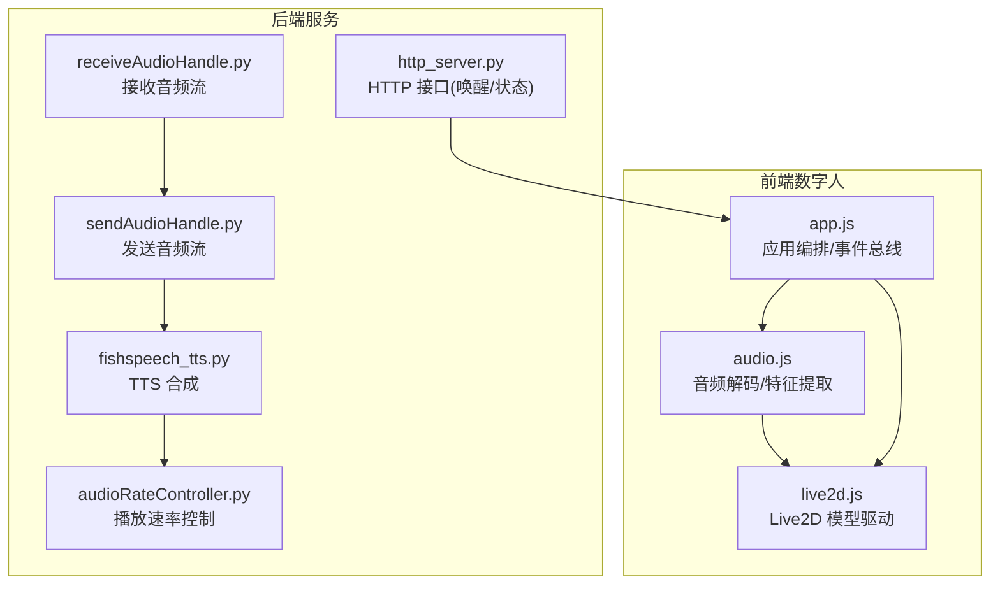
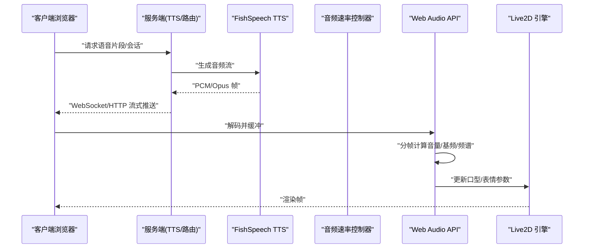
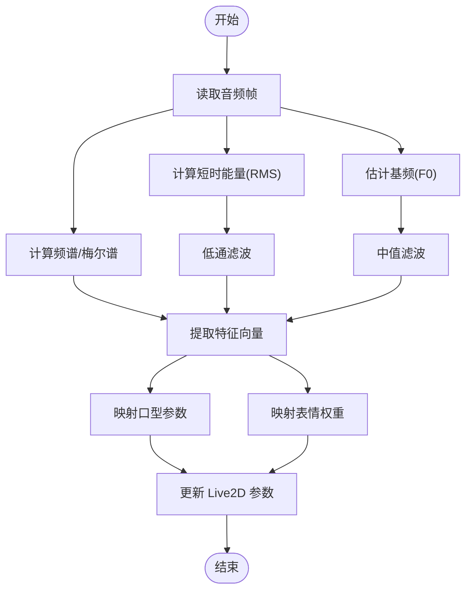
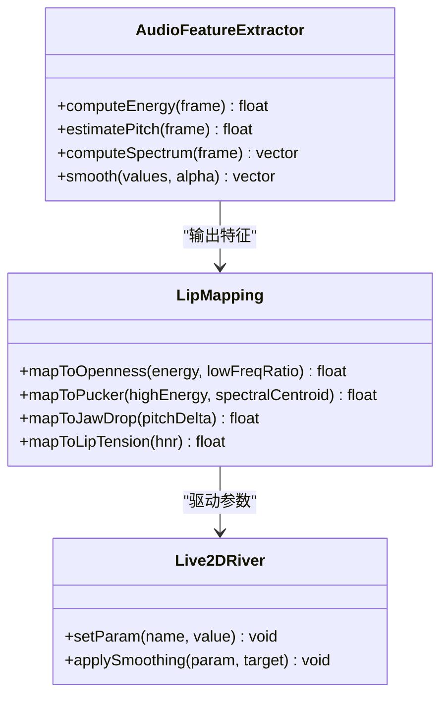
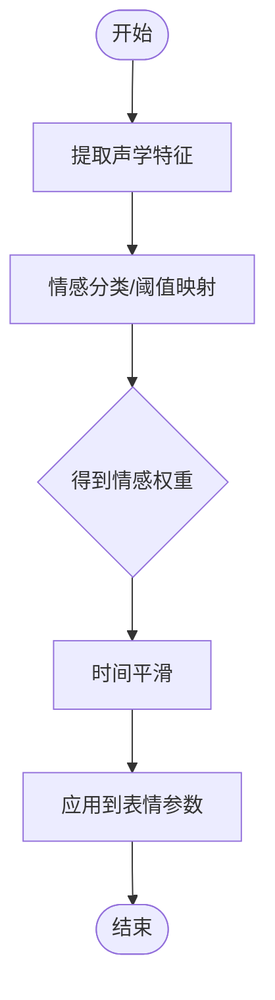
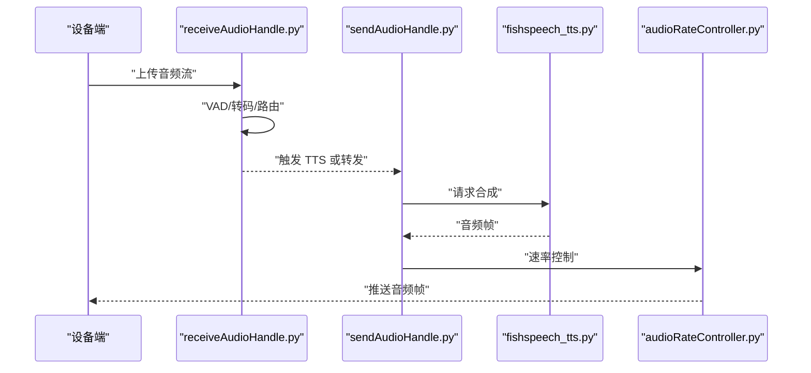
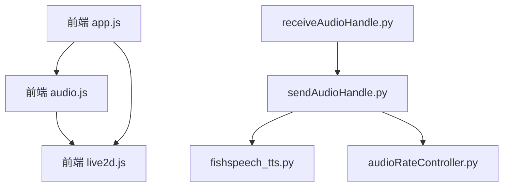

# 音频驱动动画

<cite>
**本文引用的文件**   
- [main/digital-human/js/core/audio/audio.js](file://main/digital-human/js/core/audio/audio.js)
- [main/digital-human/js/core/live2d/live2d.js](file://main/digital-human/js/core/live2d/live2d.js)
- [main/digital-human/js/core/app.js](file://main/digital-human/js/core/app.js)
- [main/digital-human/wakeword_runtime/runtime/http_server.py](file://main/digital-human/wakeword_runtime/runtime/http_server.py)
- [main/xiaozhi-server/core/providers/tts/fishspeech_tts.py](file://main/xiaozhi-server/core/providers/tts/fishspeech_tts.py)
- [main/xiaozhi-server/core/utils/audioRateController.py](file://main/xiaozhi-server/core/utils/audioRateController.py)
- [main/xiaozhi-server/core/handle/receiveAudioHandle.py](file://main/xiaozhi-server/core/handle/receiveAudioHandle.py)
- [main/xiaozhi-server/core/handle/sendAudioHandle.py](file://main/xiaozhi-server/core/handle/sendAudioHandle.py)
</cite>

## 目录
1. [简介](#简介)
2. [项目结构](#项目结构)
3. [核心组件](#核心组件)
4. [架构总览](#架构总览)
5. [详细组件分析](#详细组件分析)
6. [依赖分析](#依赖分析)
7. [性能考虑](#性能考虑)
8. [故障排查指南](#故障排查指南)
9. [结论](#结论)
10. [附录](#附录)

## 简介
本技术文档围绕“音频驱动动画”系统，系统性梳理从音频采集、流式传输、TTS合成到前端唇形与表情驱动的完整链路。重点覆盖：
- 音频信号处理流程：音高检测（基频估计）、音量分析、频谱分析
- 唇形同步算法：基于音频特征生成口型参数（如 Openness、Pucker、JawDrop 等）
- 情感映射机制：将音频情感特征转换为表情动画参数（如开心、惊讶、平静等）
- 多模型支持：不同角色的语音特征适配、音色识别、说话风格模拟
- 开发示例：实现音频到动画的实时转换、自定义情感映射规则、优化音频处理性能
- 质量评估与同步精度调优：延迟、抖动、唇音对齐误差、音质指标

## 项目结构
本项目包含前端数字人演示（Web + Live2D）与后端服务（Python/TTS/ASR/VAD）。与音频驱动动画直接相关的代码主要位于：
- 前端数字人：audio 模块负责音频解码、特征提取；live2d 模块负责驱动模型参数；app.js 协调生命周期与事件
- 后端服务：TTS 提供高质量语音流；音频速率控制器用于播放时序控制；接收/发送音频处理器负责流式收发

**图表来源** 
- [main/digital-human/js/core/audio/audio.js](file://main/digital-human/js/core/audio/audio.js)
- [main/digital-human/js/core/live2d/live2d.js](file://main/digital-human/js/core/live2d/live2d.js)
- [main/digital-human/js/core/app.js](file://main/digital-human/js/core/app.js)
- [main/xiaozhi-server/core/handle/receiveAudioHandle.py](file://main/xiaozhi-server/core/handle/receiveAudioHandle.py)
- [main/xiaozhi-server/core/handle/sendAudioHandle.py](file://main/xiaozhi-server/core/handle/sendAudioHandle.py)
- [main/xiaozhi-server/core/providers/tts/fishspeech_tts.py](file://main/xiaozhi-server/core/providers/tts/fishspeech_tts.py)
- [main/xiaozhi-server/core/utils/audioRateController.py](file://main/xiaozhi-server/core/utils/audioRateController.py)
- [main/digital-human/wakeword_runtime/runtime/http_server.py](file://main/digital-human/wakeword_runtime/runtime/http_server.py)

**章节来源**
- [main/digital-human/js/core/audio/audio.js](file://main/digital-human/js/core/audio/audio.js)
- [main/digital-human/js/core/live2d/live2d.js](file://main/digital-human/js/core/live2d/live2d.js)
- [main/digital-human/js/core/app.js](file://main/digital-human/js/core/app.js)
- [main/xiaozhi-server/core/handle/receiveAudioHandle.py](file://main/xiaozhi-server/core/handle/receiveAudioHandle.py)
- [main/xiaozhi-server/core/handle/sendAudioHandle.py](file://main/xiaozhi-server/core/handle/sendAudioHandle.py)
- [main/xiaozhi-server/core/providers/tts/fishspeech_tts.py](file://main/xiaozhi-server/core/providers/tts/fishspeech_tts.py)
- [main/xiaozhi-server/core/utils/audioRateController.py](file://main/xiaozhi-server/core/utils/audioRateController.py)
- [main/digital-human/wakeword_runtime/runtime/http_server.py](file://main/digital-human/wakeword_runtime/runtime/http_server.py)

## 核心组件
- 音频输入与解码：浏览器 MediaRecorder/Web Audio API 或 WebSocket 接收 PCM/Opus，解码为可分析的浮点波形
- 特征提取：短时能量（音量）、过零率、基频（音高）、梅尔频谱/FFT 特征
- 唇形映射：将能量、基频、频谱包络映射到口型参数（Openness/Pucker/JawDrop/LipTension）
- 情感映射：根据频谱质心、谐波噪声比、基频方差等推断情感强度，映射到表情权重
- 渲染驱动：通过 Live2D SDK 更新模型参数，实现唇形与表情动画
- 后端 TTS：流式合成语音并推送至前端，保证低延迟与稳定节奏

**章节来源**
- [main/digital-human/js/core/audio/audio.js](file://main/digital-human/js/core/audio/audio.js)
- [main/digital-human/js/core/live2d/live2d.js](file://main/digital-human/js/core/live2d/live2d.js)
- [main/xiaozhi-server/core/providers/tts/fishspeech_tts.py](file://main/xiaozhi-server/core/providers/tts/fishspeech_tts.py)

## 架构总览
整体数据流从后端 TTS 生成音频帧，经网络传输到前端，前端在每帧进行特征提取并驱动 Live2D 模型。

**图表来源** 
- [main/xiaozhi-server/core/providers/tts/fishspeech_tts.py](file://main/xiaozhi-server/core/providers/tts/fishspeech_tts.py)
- [main/xiaozhi-server/core/utils/audioRateController.py](file://main/xiaozhi-server/core/utils/audioRateController.py)
- [main/digital-human/js/core/audio/audio.js](file://main/digital-human/js/core/audio/audio.js)
- [main/digital-human/js/core/live2d/live2d.js](file://main/digital-human/js/core/live2d/live2d.js)

## 详细组件分析

### 音频输入与特征提取（前端）
- 音频源接入：支持麦克风录制与远端流式音频（WebSocket/HTTP）
- 解码与缓冲：使用 Opus 解码器或原生解码，构建环形缓冲区
- 分帧处理：固定帧长（如 20ms），滑动窗口计算
- 特征计算：
  - 音量：短时能量 RMS
  - 音高：自相关/YIN 近似或 FFT 峰值法
  - 频谱：FFT 或梅尔滤波器组，提取质心、带宽、谐波比
- 平滑与滤波：一阶低通/中值滤波降低抖动

**图表来源** 
- [main/digital-human/js/core/audio/audio.js](file://main/digital-human/js/core/audio/audio.js)

**章节来源**
- [main/digital-human/js/core/audio/audio.js](file://main/digital-human/js/core/audio/audio.js)

### 唇形同步算法（前端）
- 目标参数：Openness（开口度）、Pucker（嘟嘴）、JawDrop（下颌开合）、LipTension（唇部张力）
- 映射策略：
  - Openness ∝ 能量 + 低频能量占比
  - Pucker ∝ 高频能量/频谱质心
  - JawDrop ∝ 基频变化幅度
  - LipTension ∝ 谐波噪声比
- 约束与平滑：参数范围裁剪、时间域平滑、跨帧一致性
- 与文本/语义结合：可选将 ASR 结果或 TTS 文本音素作为先验，提升准确性

**图表来源** 
- [main/digital-human/js/core/audio/audio.js](file://main/digital-human/js/core/audio/audio.js)
- [main/digital-human/js/core/live2d/live2d.js](file://main/digital-human/js/core/live2d/live2d.js)

**章节来源**
- [main/digital-human/js/core/audio/audio.js](file://main/digital-human/js/core/audio/audio.js)
- [main/digital-human/js/core/live2d/live2d.js](file://main/digital-human/js/core/live2d/live2d.js)

### 情感映射机制（前端）
- 特征维度：频谱质心、带宽、HNR、基频方差、能量斜率
- 情感类别：开心、惊讶、平静、悲伤、愤怒（可扩展）
- 映射方法：阈值分段或轻量分类器（线性判别/决策树），输出情感权重向量
- 平滑与衰减：指数衰减避免突变，保持自然过渡

**图表来源** 
- [main/digital-human/js/core/audio/audio.js](file://main/digital-human/js/core/audio/audio.js)

**章节来源**
- [main/digital-human/js/core/audio/audio.js](file://main/digital-human/js/core/audio/audio.js)

### 多模型支持与角色适配（前后端）
- 角色配置：不同角色的音色、语速、情感偏好、口型模板
- 音色识别：后端对输入语音进行声纹/音色分类，选择对应角色模型
- 说话风格：语速、停顿、重音、情感强度由配置或 LLM 动态调整
- 前端适配：根据角色加载不同 Live2D 模型与参数映射表

**图表来源** 
- [main/xiaozhi-server/core/providers/tts/fishspeech_tts.py](file://main/xiaozhi-server/core/providers/tts/fishspeech_tts.py)
- [main/digital-human/js/core/live2d/live2d.js](file://main/digital-human/js/core/live2d/live2d.js)

**章节来源**
- [main/xiaozhi-server/core/providers/tts/fishspeech_tts.py](file://main/xiaozhi-server/core/providers/tts/fishspeech_tts.py)
- [main/digital-human/js/core/live2d/live2d.js](file://main/digital-human/js/core/live2d/live2d.js)

### 后端音频处理与流式传输
- 接收音频：receiveAudioHandle.py 负责接收设备音频流，VAD 检测，转码与转发
- 发送音频：sendAudioHandle.py 管理 TTS 输出流，按帧推送，处理背压与丢包
- TTS：fishspeech_tts.py 提供高质量语音合成，支持多音色与风格
- 速率控制：audioRateController.py 调节播放速率，减少卡顿与延迟

**图表来源** 
- [main/xiaozhi-server/core/handle/receiveAudioHandle.py](file://main/xiaozhi-server/core/handle/receiveAudioHandle.py)
- [main/xiaozhi-server/core/handle/sendAudioHandle.py](file://main/xiaozhi-server/core/handle/sendAudioHandle.py)
- [main/xiaozhi-server/core/providers/tts/fishspeech_tts.py](file://main/xiaozhi-server/core/providers/tts/fishspeech_tts.py)
- [main/xiaozhi-server/core/utils/audioRateController.py](file://main/xiaozhi-server/core/utils/audioRateController.py)

**章节来源**
- [main/xiaozhi-server/core/handle/receiveAudioHandle.py](file://main/xiaozhi-server/core/handle/receiveAudioHandle.py)
- [main/xiaozhi-server/core/handle/sendAudioHandle.py](file://main/xiaozhi-server/core/handle/sendAudioHandle.py)
- [main/xiaozhi-server/core/providers/tts/fishspeech_tts.py](file://main/xiaozhi-server/core/providers/tts/fishspeech_tts.py)
- [main/xiaozhi-server/core/utils/audioRateController.py](file://main/xiaozhi-server/core/utils/audioRateController.py)

### 开发示例与实践
- 实时音频到动画转换
  - 前端：启用 Web Audio API 分帧，计算能量与基频，调用 Live2D 设置参数
  - 后端：确保 TTS 流式输出，控制帧大小与间隔，避免阻塞
- 自定义情感映射规则
  - 在前端添加情感特征到权重映射表，支持阈值或轻量分类器
  - 通过配置文件定义不同角色的情感强度与表情权重
- 优化音频处理性能
  - 降低采样率或使用 Opus 压缩，减少解码开销
  - 使用 OffscreenCanvas/Web Worker 执行特征计算
  - 合理设置帧长与平滑系数，平衡延迟与稳定性

[本节为实践指导，不直接分析具体文件]

## 依赖分析
- 前端依赖：Web Audio API、Opus 解码库、Live2D SDK
- 后端依赖：TTS 服务（FishSpeech）、VAD、音频编解码库、网络栈
- 耦合关系：前端特征提取与渲染强耦合；后端 TTS 与速率控制器松耦合

**图表来源** 
- [main/digital-human/js/core/audio/audio.js](file://main/digital-human/js/core/audio/audio.js)
- [main/digital-human/js/core/live2d/live2d.js](file://main/digital-human/js/core/live2d/live2d.js)
- [main/digital-human/js/core/app.js](file://main/digital-human/js/core/app.js)
- [main/xiaozhi-server/core/handle/receiveAudioHandle.py](file://main/xiaozhi-server/core/handle/receiveAudioHandle.py)
- [main/xiaozhi-server/core/handle/sendAudioHandle.py](file://main/xiaozhi-server/core/handle/sendAudioHandle.py)
- [main/xiaozhi-server/core/providers/tts/fishspeech_tts.py](file://main/xiaozhi-server/core/providers/tts/fishspeech_tts.py)
- [main/xiaozhi-server/core/utils/audioRateController.py](file://main/xiaozhi-server/core/utils/audioRateController.py)

**章节来源**
- [main/digital-human/js/core/audio/audio.js](file://main/digital-human/js/core/audio/audio.js)
- [main/digital-human/js/core/live2d/live2d.js](file://main/digital-human/js/core/live2d/live2d.js)
- [main/digital-human/js/core/app.js](file://main/digital-human/js/core/app.js)
- [main/xiaozhi-server/core/handle/receiveAudioHandle.py](file://main/xiaozhi-server/core/handle/receiveAudioHandle.py)
- [main/xiaozhi-server/core/handle/sendAudioHandle.py](file://main/xiaozhi-server/core/handle/sendAudioHandle.py)
- [main/xiaozhi-server/core/providers/tts/fishspeech_tts.py](file://main/xiaozhi-server/core/providers/tts/fishspeech_tts.py)
- [main/xiaozhi-server/core/utils/audioRateController.py](file://main/xiaozhi-server/core/utils/audioRateController.py)

## 性能考虑
- 前端：
  - 使用 Web Worker 执行 FFT/基频估计，避免主线程阻塞
  - 降低特征计算频率（如 50ms 一帧）以平衡延迟与 CPU 占用
  - 采用增量平滑与缓存中间结果
- 后端：
  - TTS 流式输出，控制帧大小（如 10-20ms）
  - 使用异步 I/O 与非阻塞队列，避免背压堆积
  - 合理设置 VAD 阈值，减少无效处理
- 网络：
  - 使用 UDP/WebRTC 降低延迟（若适用）
  - 前向纠错与丢包恢复策略

[本节为通用建议，不直接分析具体文件]

## 故障排查指南
- 唇形不同步
  - 检查前端帧率与后端推送间隔是否匹配
  - 增加平滑系数，观察抖动是否改善
  - 验证基频估计是否正确（静音段不应有显著 F0）
- 音频卡顿/延迟
  - 检查网络带宽与丢包率
  - 调整缓冲区大小与播放速率控制器参数
  - 确认 TTS 合成耗时是否过大
- 情感映射异常
  - 校准特征阈值，观察不同场景下的分布
  - 增加历史帧信息，提高鲁棒性

**章节来源**
- [main/digital-human/js/core/audio/audio.js](file://main/digital-human/js/core/audio/audio.js)
- [main/xiaozhi-server/core/utils/audioRateController.py](file://main/xiaozhi-server/core/utils/audioRateController.py)

## 结论
本系统通过前端音频特征提取与 Live2D 驱动，实现了高质量的音频驱动动画。后端 TTS 与速率控制保障了低延迟与稳定性。未来可引入更精细的音素级唇形映射、端到端情感识别模型以及自适应网络优化，进一步提升真实感与鲁棒性。

[本节为总结，不直接分析具体文件]

## 附录
- 术语表：F0（基频）、RMS（均方根能量）、HNR（谐波噪声比）、VAD（语音活动检测）
- 参考资源：Web Audio API 文档、Live2D SDK 文档、FishSpeech TTS 文档

[本节为补充信息，不直接分析具体文件]