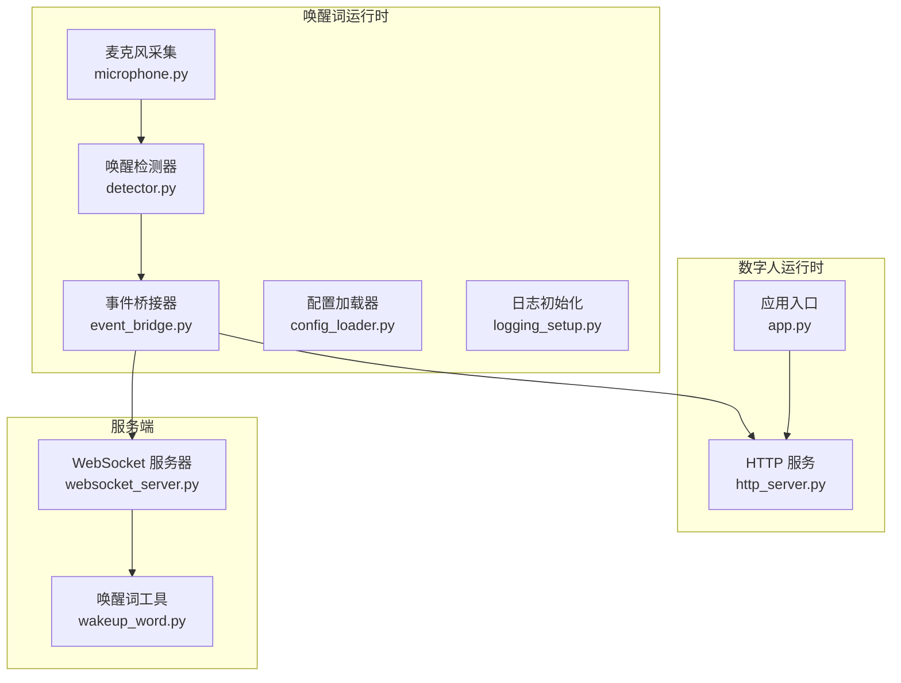
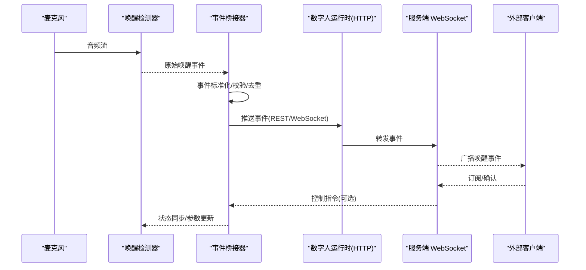
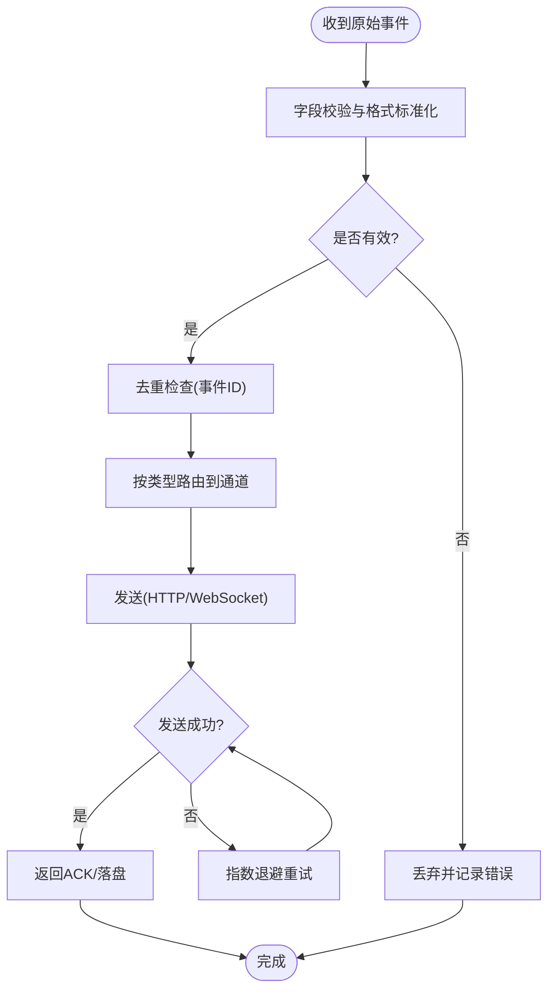
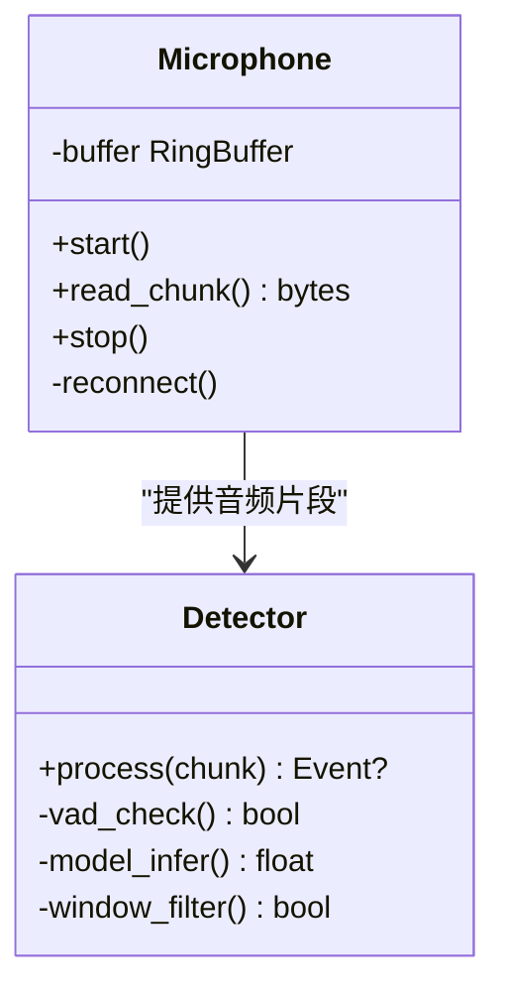
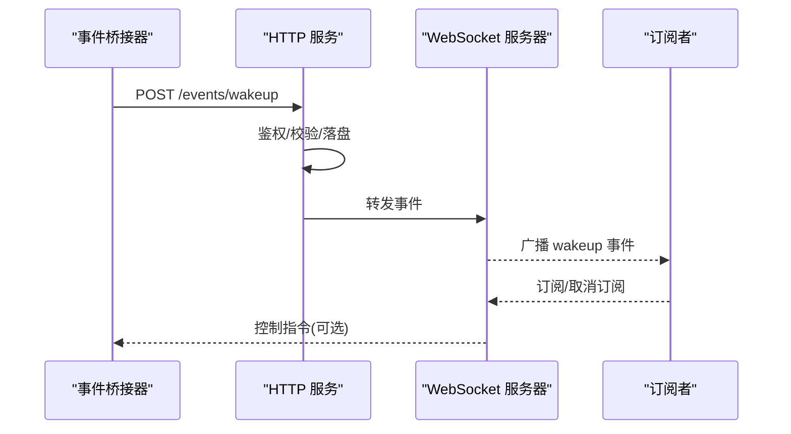

# 事件桥接系统

<cite>
**本文引用的文件**   
- [digital-human-wakeword.md](file://docs/digital-human-wakeword.md)
- [event_bridge.py](file://main/digital-human/wakeword_runtime/bridge/event_bridge.py)
- [__init__.py](file://main/digital-human/wakeword_runtime/bridge/__init__.py)
- [config_loader.py](file://main/digital-human/wakeword_runtime/config/config_loader.py)
- [logging_setup.py](file://main/digital-human/wakeword_runtime/config/logging_setup.py)
- [detector.py](file://main/digital-human/wakeword_runtime/core/detector.py)
- [microphone.py](file://main/digital-human/wakeword_runtime/core/microphone.py)
- [app.py](file://main/digital-human/wakeword_runtime/runtime/app.py)
- [http_server.py](file://main/digital-human/wakeword_runtime/runtime/http_server.py)
- [websocket_server.py](file://main/xiaozhi-server/core/websocket_server.py)
- [wakeup_word.py](file://main/xiaozhi-server/core/utils/wakeup_word.py)
</cite>

## 目录
1. [简介](#简介)
2. [项目结构](#项目结构)
3. [核心组件](#核心组件)
4. [架构总览](#架构总览)
5. [详细组件分析](#详细组件分析)
6. [依赖关系分析](#依赖关系分析)
7. [性能考量](#性能考量)
8. [故障排查指南](#故障排查指南)
9. [结论](#结论)
10. [附录](#附录)

## 简介
本技术文档围绕“唤醒词事件桥接系统”展开，聚焦事件驱动架构在数字人唤醒链路中的落地实践。内容涵盖：
- 事件发布订阅模式与消息队列集成思路
- 异步处理机制与状态同步策略
- 事件桥接器的实现要点：事件监听、消息路由、状态同步
- 与数字人主应用的通信协议：WebSocket 连接管理、事件序列化、错误重试
- 事件过滤与转换：格式标准化、数据校验、日志记录
- 外部应用集成示例：订阅唤醒事件、发送控制指令
- 调试工具与性能监控方法

本说明旨在帮助开发者快速理解并扩展该桥接系统，确保高可靠、低延迟的唤醒事件流转。

## 项目结构
本项目中与唤醒词事件桥接相关的代码主要分布在以下模块：
- 唤醒词运行时（Python）：负责音频采集、唤醒检测、事件生成与桥接
- 数字人运行时（Python）：提供 HTTP/WebSocket 服务，暴露事件接口
- 服务端（Python）：WebSocket 服务器与唤醒词工具模块，支撑跨进程/跨设备的事件分发

图表来源
- [microphone.py](file://main/digital-human/wakeword_runtime/core/microphone.py)
- [detector.py](file://main/digital-human/wakeword_runtime/core/detector.py)
- [event_bridge.py](file://main/digital-human/wakeword_runtime/bridge/event_bridge.py)
- [config_loader.py](file://main/digital-human/wakeword_runtime/config/config_loader.py)
- [logging_setup.py](file://main/digital-human/wakeword_runtime/config/logging_setup.py)
- [app.py](file://main/digital-human/wakeword_runtime/runtime/app.py)
- [http_server.py](file://main/digital-human/wakeword_runtime/runtime/http_server.py)
- [websocket_server.py](file://main/xiaozhi-server/core/websocket_server.py)
- [wakeup_word.py](file://main/xiaozhi-server/core/utils/wakeup_word.py)

章节来源
- [digital-human-wakeword.md](file://docs/digital-human-wakeword.md)

## 核心组件
- 事件桥接器（EventBridge）
  - 职责：统一封装事件发布/订阅、消息路由、重试与幂等、状态同步
  - 关键点：事件模型标准化、去重与限流、失败重试与退避、可观测性埋点
- 唤醒检测器（Detector）
  - 职责：音频流接入、VAD/ASR 或本地模型触发、事件产出
  - 关键点：采样率适配、静音段判定、阈值与窗口策略
- 麦克风（Microphone）
  - 职责：音频采集、缓冲与丢帧策略、异常恢复
  - 关键点：线程安全、背压处理、设备热插拔兼容
- 运行时服务（App/HTTP）
  - 职责：对外暴露 REST/WebSocket 接口，转发事件到服务端或下游消费者
  - 关键点：请求校验、鉴权、超时与熔断
- 服务端 WebSocket
  - 职责：长连接管理、事件广播、会话状态维护
  - 关键点：心跳保活、断线重连、消息顺序保证

章节来源
- [event_bridge.py](file://main/digital-human/wakeword_runtime/bridge/event_bridge.py)
- [detector.py](file://main/digital-human/wakeword_runtime/core/detector.py)
- [microphone.py](file://main/digital-human/wakeword_runtime/core/microphone.py)
- [app.py](file://main/digital-human/wakeword_runtime/runtime/app.py)
- [http_server.py](file://main/digital-human/wakeword_runtime/runtime/http_server.py)
- [websocket_server.py](file://main/xiaozhi-server/core/websocket_server.py)

## 架构总览
整体采用“事件驱动 + 发布订阅”的架构，结合 WebSocket 长连接进行实时事件分发。唤醒端通过本地检测产生事件，经桥接器标准化后，推送至数字人运行时与服务端；服务端通过 WebSocket 将事件广播给已连接的客户端（如移动端、Web 控制台）。

图表来源
- [event_bridge.py](file://main/digital-human/wakeword_runtime/bridge/event_bridge.py)
- [http_server.py](file://main/digital-human/wakeword_runtime/runtime/http_server.py)
- [websocket_server.py](file://main/xiaozhi-server/core/websocket_server.py)

## 详细组件分析

### 事件桥接器（EventBridge）
- 设计要点
  - 事件模型：定义统一的 WakeupEvent 结构（包含设备ID、时间戳、置信度、上下文等）
  - 发布/订阅：内部基于内存队列或轻量消息总线，支持多订阅者
  - 路由策略：按事件类型与目标通道（HTTP/WebSocket）分发
  - 可靠性：失败重试（指数退避）、死信队列、幂等键（事件ID）
  - 可观测性：指标计数、耗时统计、错误码分类
- 关键流程
  - 接收原始事件 -> 校验字段 -> 标准化 -> 去重 -> 路由 -> 持久化/上报 -> 回调通知

图表来源
- [event_bridge.py](file://main/digital-human/wakeword_runtime/bridge/event_bridge.py)

章节来源
- [event_bridge.py](file://main/digital-human/wakeword_runtime/bridge/event_bridge.py)

### 唤醒检测器（Detector）与麦克风（Microphone）
- 麦克风
  - 持续采集音频，维护环形缓冲，支持丢帧与回压
  - 异常处理：设备断开自动重连，缓冲溢出保护
- 检测器
  - 对音频片段进行 VAD/特征提取/模型推理
  - 输出候选唤醒事件，附带置信度与时间窗信息
  - 与桥接器解耦，仅负责事件生产

图表来源
- [microphone.py](file://main/digital-human/wakeword_runtime/core/microphone.py)
- [detector.py](file://main/digital-human/wakeword_runtime/core/detector.py)

章节来源
- [microphone.py](file://main/digital-human/wakeword_runtime/core/microphone.py)
- [detector.py](file://main/digital-human/wakeword_runtime/core/detector.py)

### 运行时服务（App/HTTP）与 WebSocket 服务器
- 数字人运行时
  - 启动 HTTP 服务，暴露事件上报与查询接口
  - 鉴权与限流，请求体校验，响应标准化
- 服务端 WebSocket
  - 管理连接生命周期（握手、心跳、关闭）
  - 事件广播与订阅过滤（按设备/主题）
  - 断线重连与消息排序

图表来源
- [http_server.py](file://main/digital-human/wakeword_runtime/runtime/http_server.py)
- [websocket_server.py](file://main/xiaozhi-server/core/websocket_server.py)

章节来源
- [http_server.py](file://main/digital-human/wakeword_runtime/runtime/http_server.py)
- [websocket_server.py](file://main/xiaozhi-server/core/websocket_server.py)

### 配置与日志
- 配置加载器
  - 集中管理端口、模型路径、重试策略、日志级别等
  - 支持热重载与环境变量覆盖
- 日志初始化
  - 统一日志格式、分级输出、结构化字段（trace_id、event_id）

章节来源
- [config_loader.py](file://main/digital-human/wakeword_runtime/config/config_loader.py)
- [logging_setup.py](file://main/digital-human/wakeword_runtime/config/logging_setup.py)

### 与唤醒词工具的集成
- 唤醒词工具模块提供通用能力（如阈值、关键词库、结果格式化），供服务端与运行时复用

章节来源
- [wakeup_word.py](file://main/xiaozhi-server/core/utils/wakeup_word.py)

## 依赖关系分析
- 模块内聚与耦合
  - 桥接器与检测器松耦合，通过标准事件模型交互
  - 运行时服务与 WebSocket 服务器通过内部转发解耦
- 外部依赖
  - 音频设备驱动、网络库（HTTP/WebSocket）、日志框架
- 潜在循环依赖
  - 避免桥接器反向依赖检测器，保持单向数据流

图表来源
- [microphone.py](file://main/digital-human/wakeword_runtime/core/microphone.py)
- [detector.py](file://main/digital-human/wakeword_runtime/core/detector.py)
- [event_bridge.py](file://main/digital-human/wakeword_runtime/bridge/event_bridge.py)
- [http_server.py](file://main/digital-human/wakeword_runtime/runtime/http_server.py)
- [websocket_server.py](file://main/xiaozhi-server/core/websocket_server.py)
- [wakeup_word.py](file://main/xiaozhi-server/core/utils/wakeup_word.py)

章节来源
- [__init__.py](file://main/digital-human/wakeword_runtime/bridge/__init__.py)

## 性能考量
- 音频采集与处理
  - 使用环形缓冲与零拷贝策略，降低 GC 压力
  - 合理设置采样率与分片大小，平衡时延与吞吐
- 事件路由与序列化
  - 二进制序列化优先（如 Protobuf/MessagePack），减少带宽
  - 批量发送与合并，降低网络开销
- 并发与背压
  - 生产者-消费者队列限制速率，防止雪崩
  - 超时与熔断保护下游服务
- 可观测性
  - 关键指标：事件吞吐、P95/P99 时延、错误率、重试次数
  - 分布式追踪：trace_id 贯穿全链路

## 故障排查指南
- 常见问题定位
  - 音频采集失败：检查设备权限、采样率、缓冲溢出
  - 唤醒误报/漏报：调整 VAD 阈值、模型置信度、时间窗
  - 事件丢失：检查去重策略、重试上限、死信队列
  - WebSocket 断连：心跳间隔、NAT 超时、代理配置
- 诊断手段
  - 启用结构化日志与 trace_id
  - 导出指标到监控系统（Prometheus/Grafana）
  - 抓包分析（Wireshark/tcpdump）验证消息序列

章节来源
- [logging_setup.py](file://main/digital-human/wakeword_runtime/config/logging_setup.py)
- [config_loader.py](file://main/digital-human/wakeword_runtime/config/config_loader.py)

## 结论
本事件桥接系统以事件驱动为核心，通过标准化的事件模型与可靠的发布订阅机制，实现了从音频采集到数字人主应用的高效联动。借助 WebSocket 长连接与完善的错误重试、可观测性方案，系统在稳定性与性能上具备良好表现。后续可扩展更多事件类型与路由策略，以满足更复杂的业务场景。

## 附录
- 集成示例（概念性说明）
  - 外部应用订阅唤醒事件：通过 WebSocket 连接服务端，订阅 wakeup 主题，接收事件后执行 UI 提示或业务逻辑
  - 发送控制指令：通过 HTTP 接口或 WebSocket 下发控制命令（如切换唤醒词、调整阈值），由桥接器转发至检测器或运行时
- 参考文档
  - 数字人唤醒相关设计与部署说明

章节来源
- [digital-human-wakeword.md](file://docs/digital-human-wakeword.md)