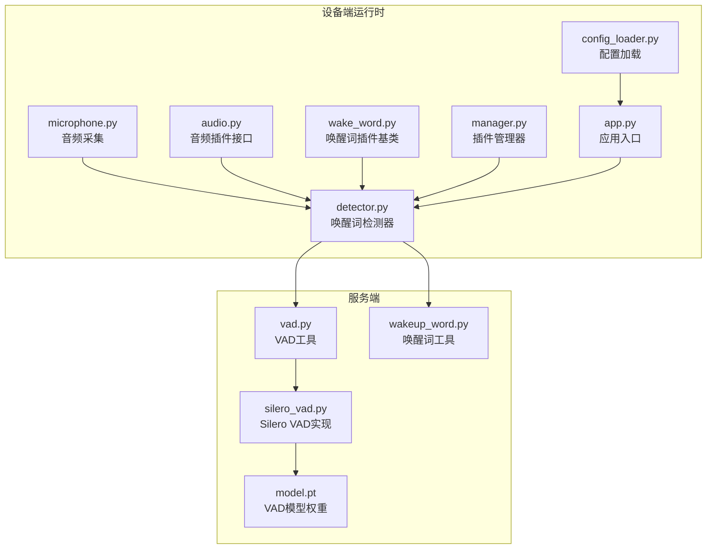
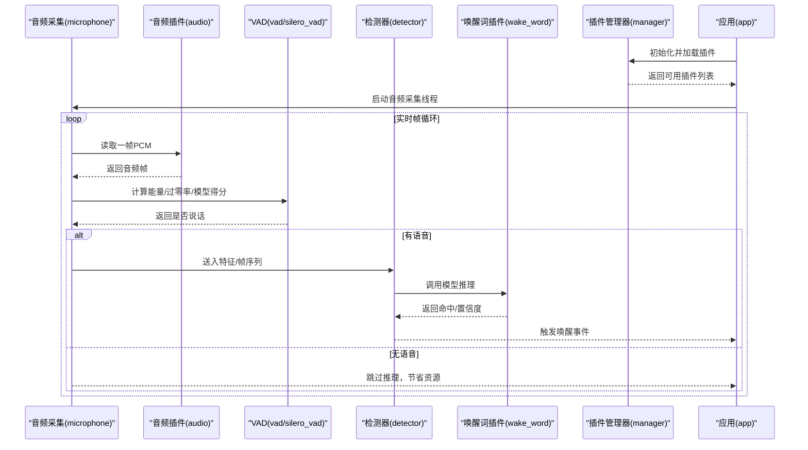
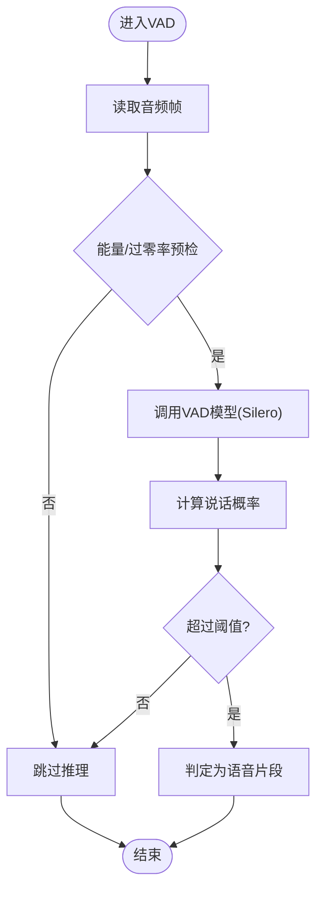
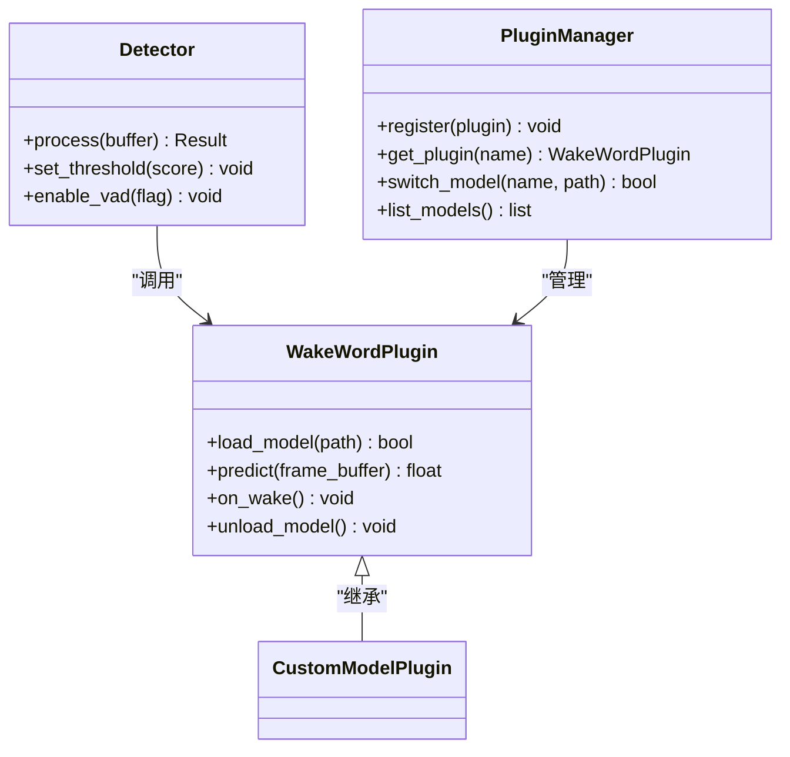
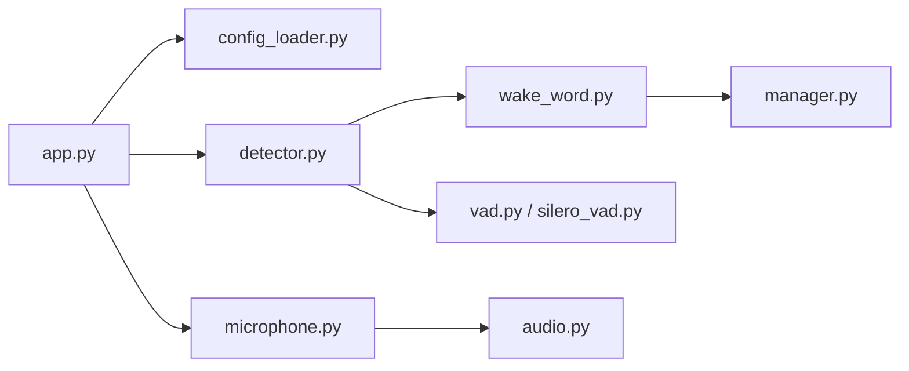

# 唤醒词检测系统

<cite>
**本文档引用的文件**   
- [digital-human/wakeword_runtime/core/detector.py](file://main/digital-human/wakeword_runtime/core/detector.py)
- [digital-human/wakeword_runtime/core/microphone.py](file://main/digital-human/wakeword_runtime/core/microphone.py)
- [digital-human/wakeword_runtime/plugins/audio.py](file://main/digital-human/wakeword_runtime/plugins/audio.py)
- [digital-human/wakeword_runtime/plugins/base.py](file://main/digital-human/wakeword_runtime/plugins/base.py)
- [digital-human/wakeword_runtime/plugins/manager.py](file://main/digital-human/wakeword_runtime/plugins/manager.py)
- [digital-human/wakeword_runtime/plugins/wake_word.py](file://main/digital-human/wakeword_runtime/plugins/wake_word.py)
- [digital-human/wakeword_runtime/runtime/app.py](file://main/digital-human/wakeword_runtime/runtime/app.py)
- [digital-human/wakeword_runtime/config/config_loader.py](file://main/digital-human/wakeword_runtime/config/config_loader.py)
- [xiaozhi-server/core/utils/wakeup_word.py](file://main/xiaozhi-server/core/utils/wakeup_word.py)
- [xiaozhi-server/core/providers/vad/silero_vad.py](file://main/xiaozhi-server/core/providers/vad/silero_vad.py)
- [xiaozhi-server/core/utils/vad.py](file://main/xiaozhi-server/core/utils/vad.py)
- [xiaozhi-server/models/snakers4_silero-vad/model.pt](file://main/xiaozhi-server/models/snakers4_silero-vad/model.pt)
</cite>

## 目录
1. [简介](#简介)
2. [项目结构](#项目结构)
3. [核心组件](#核心组件)
4. [架构总览](#架构总览)
5. [详细组件分析](#详细组件分析)
6. [依赖关系分析](#依赖关系分析)
7. [性能考虑](#性能考虑)
8. [故障排查指南](#故障排查指南)
9. [结论](#结论)
10. [附录](#附录)

## 简介
本技术文档围绕唤醒词检测系统，系统性阐述基于深度学习的关键词识别算法与工程实现。内容覆盖音频采集、VAD（语音活动检测）、特征提取、实时检测流程、插件化架构设计（支持多模型动态加载与切换），以及性能优化（缓冲区管理、多线程、GPU加速）。同时提供开发指南：如何新增唤醒词模型、自定义检测算法、集成第三方语音库，并给出调试工具与性能监控方法。

## 项目结构
本项目包含两个与唤醒词相关的主要子系统：
- 数字人端侧运行时（wakeword_runtime）：负责设备端的音频采集、VAD、唤醒词推理与事件上报，采用插件化架构。
- 服务端（xiaozhi-server）：提供 VAD 能力与唤醒词辅助工具，便于云端或边缘服务协同处理。

图表来源 
- [digital-human/wakeword_runtime/core/microphone.py](file://main/digital-human/wakeword_runtime/core/microphone.py)
- [digital-human/wakeword_runtime/plugins/audio.py](file://main/digital-human/wakeword_runtime/plugins/audio.py)
- [digital-human/wakeword_runtime/core/detector.py](file://main/digital-human/wakeword_runtime/core/detector.py)
- [digital-human/wakeword_runtime/plugins/wake_word.py](file://main/digital-human/wakeword_runtime/plugins/wake_word.py)
- [digital-human/wakeword_runtime/plugins/manager.py](file://main/digital-human/wakeword_runtime/plugins/manager.py)
- [digital-human/wakeword_runtime/runtime/app.py](file://main/digital-human/wakeword_runtime/runtime/app.py)
- [digital-human/wakeword_runtime/config/config_loader.py](file://main/digital-human/wakeword_runtime/config/config_loader.py)
- [xiaozhi-server/core/utils/vad.py](file://main/xiaozhi-server/core/utils/vad.py)
- [xiaozhi-server/core/providers/vad/silero_vad.py](file://main/xiaozhi-server/core/providers/vad/silero_vad.py)
- [xiaozhi-server/core/utils/wakeup_word.py](file://main/xiaozhi-server/core/utils/wakeup_word.py)
- [xiaozhi-server/models/snakers4_silero-vad/model.pt](file://main/xiaozhi-server/models/snakers4_silero-vad/model.pt)

章节来源
- [digital-human/wakeword_runtime/runtime/app.py](file://main/digital-human/wakeword_runtime/runtime/app.py)
- [digital-human/wakeword_runtime/config/config_loader.py](file://main/digital-human/wakeword_runtime/config/config_loader.py)
- [xiaozhi-server/core/utils/vad.py](file://main/xiaozhi-server/core/utils/vad.py)
- [xiaozhi-server/core/providers/vad/silero_vad.py](file://main/xiaozhi-server/core/providers/vad/silero_vad.py)
- [xiaozhi-server/core/utils/wakeup_word.py](file://main/xiaozhi-server/core/utils/wakeup_word.py)

## 核心组件
- 音频采集模块（microphone.py）：从麦克风或音频源持续读取PCM数据，封装为帧流，供后续VAD与唤醒词检测使用。
- 音频插件（plugins/audio.py）：定义统一的音频输入/输出抽象，便于替换不同后端（如PyAudio、librosa等）。
- VAD（语音活动检测）：在设备端或服务端进行静音/非静音切分，降低无效推理开销。
- 唤醒词检测器（detector.py）：将音频帧送入唤醒词模型，输出匹配结果与置信度，触发后续动作。
- 唤醒词插件（plugins/wake_word.py）：统一唤醒词模型的加载、推理与回调接口，支持多模型并存与热切换。
- 插件管理器（plugins/manager.py）：负责插件的发现、注册、生命周期管理与调度。
- 应用入口（runtime/app.py）：编排采集、VAD、检测、事件上报的完整流水线。
- 配置加载（config/config_loader.py）：集中管理采样率、阈值、模型路径等参数。
- 服务端VAD与工具（vad.py, silero_vad.py, wakeup_word.py）：提供高性能VAD推理与唤醒词辅助逻辑。

章节来源
- [digital-human/wakeword_runtime/core/microphone.py](file://main/digital-human/wakeword_runtime/core/microphone.py)
- [digital-human/wakeword_runtime/plugins/audio.py](file://main/digital-human/wakeword_runtime/plugins/audio.py)
- [digital-human/wakeword_runtime/core/detector.py](file://main/digital-human/wakeword_runtime/core/detector.py)
- [digital-human/wakeword_runtime/plugins/wake_word.py](file://main/digital-human/wakeword_runtime/plugins/wake_word.py)
- [digital-human/wakeword_runtime/plugins/manager.py](file://main/digital-human/wakeword_runtime/plugins/manager.py)
- [digital-human/wakeword_runtime/runtime/app.py](file://main/digital-human/wakeword_runtime/runtime/app.py)
- [digital-human/wakeword_runtime/config/config_loader.py](file://main/digital-human/wakeword_runtime/config/config_loader.py)
- [xiaozhi-server/core/utils/vad.py](file://main/xiaozhi-server/core/utils/vad.py)
- [xiaozhi-server/core/providers/vad/silero_vad.py](file://main/xiaozhi-server/core/providers/vad/silero_vad.py)
- [xiaozhi-server/core/utils/wakeup_word.py](file://main/xiaozhi-server/core/utils/wakeup_word.py)

## 架构总览
唤醒词检测系统采用“采集→VAD→特征→推理→事件”的流水线式架构，并通过插件化实现多模型热插拔与扩展。

图表来源 
- [digital-human/wakeword_runtime/core/microphone.py](file://main/digital-human/wakeword_runtime/core/microphone.py)
- [digital-human/wakeword_runtime/plugins/audio.py](file://main/digital-human/wakeword_runtime/plugins/audio.py)
- [xiaozhi-server/core/utils/vad.py](file://main/xiaozhi-server/core/utils/vad.py)
- [xiaozhi-server/core/providers/vad/silero_vad.py](file://main/xiaozhi-server/core/providers/vad/silero_vad.py)
- [digital-human/wakeword_runtime/core/detector.py](file://main/digital-human/wakeword_runtime/core/detector.py)
- [digital-human/wakeword_runtime/plugins/wake_word.py](file://main/digital-human/wakeword_runtime/plugins/wake_word.py)
- [digital-human/wakeword_runtime/plugins/manager.py](file://main/digital-human/wakeword_runtime/plugins/manager.py)
- [digital-human/wakeword_runtime/runtime/app.py](file://main/digital-human/wakeword_runtime/runtime/app.py)

## 详细组件分析

### 音频采集模块（microphone.py）
- 职责：持续从硬件或虚拟源获取音频帧，维护环形缓冲，保证低延迟与稳定吞吐。
- 关键点：
  - 采样率与位深对齐，必要时重采样。
  - 帧大小与滑动窗口策略，适配VAD与模型输入。
  - 异常重试与断线恢复机制。
- 性能要点：
  - 使用非阻塞I/O与队列缓冲，避免主线程阻塞。
  - 控制内存占用，及时释放无用帧。

章节来源
- [digital-human/wakeword_runtime/core/microphone.py](file://main/digital-human/wakeword_runtime/core/microphone.py)

### 音频插件（plugins/audio.py）与基础接口（plugins/base.py）
- 职责：定义统一的音频输入/输出接口，屏蔽底层差异。
- 关键点：
  - 抽象出 read_frame()、write_frame()、open()/close() 等方法。
  - 支持多种后端（PyAudio、librosa、系统API等）。
- 扩展性：新增音频后端只需实现接口并注册到管理器。

章节来源
- [digital-human/wakeword_runtime/plugins/audio.py](file://main/digital-human/wakeword_runtime/plugins/audio.py)
- [digital-human/wakeword_runtime/plugins/base.py](file://main/digital-human/wakeword_runtime/plugins/base.py)

### VAD（语音活动检测）
- 职责：快速判断当前帧是否为有效语音，减少唤醒词模型推理次数。
- 实现方式：
  - 传统方法：能量阈值、过零率、频谱熵等。
  - 深度学习：Silero VAD 模型，提供高鲁棒性。
- 关键参数：
  - 帧长、步长、阈值、平滑窗口、最小/最大语音时长。
- 性能优化：
  - 轻量级预筛（能量+过零率）+ 模型精判。
  - 批处理与缓存最近帧统计。

图表来源 
- [xiaozhi-server/core/utils/vad.py](file://main/xiaozhi-server/core/utils/vad.py)
- [xiaozhi-server/core/providers/vad/silero_vad.py](file://main/xiaozhi-server/core/providers/vad/silero_vad.py)

章节来源
- [xiaozhi-server/core/utils/vad.py](file://main/xiaozhi-server/core/utils/vad.py)
- [xiaozhi-server/core/providers/vad/silero_vad.py](file://main/xiaozhi-server/core/providers/vad/silero_vad.py)

### 唤醒词检测器（detector.py）
- 职责：接收VAD输出的语音片段，进行特征提取与模型推理，输出命中结果。
- 关键点：
  - 特征提取：MFCC、FBank、频谱图等。
  - 模型推理：轻量化CNN/RNN/Transformer，支持ONNX/TensorRT加速。
  - 后处理：滑动窗口投票、置信度阈值、去抖。
- 错误处理：模型加载失败、输入格式不匹配、超时保护。

章节来源
- [digital-human/wakeword_runtime/core/detector.py](file://main/digital-human/wakeword_runtime/core/detector.py)

### 唤醒词插件（plugins/wake_word.py）与插件管理器（plugins/manager.py）
- 插件基类：定义 load_model()、predict()、on_wake() 等标准接口。
- 管理器：扫描插件目录、按需加载、热切换、并发安全。
- 优势：
  - 多模型并行运行（例如“小智同学”、“你好小智”）。
  - 运行时切换模型无需重启。
  - 隔离各模型资源与状态。

图表来源 
- [digital-human/wakeword_runtime/plugins/wake_word.py](file://main/digital-human/wakeword_runtime/plugins/wake_word.py)
- [digital-human/wakeword_runtime/plugins/manager.py](file://main/digital-human/wakeword_runtime/plugins/manager.py)
- [digital-human/wakeword_runtime/core/detector.py](file://main/digital-human/wakeword_runtime/core/detector.py)

章节来源
- [digital-human/wakeword_runtime/plugins/wake_word.py](file://main/digital-human/wakeword_runtime/plugins/wake_word.py)
- [digital-human/wakeword_runtime/plugins/manager.py](file://main/digital-human/wakeword_runtime/plugins/manager.py)
- [digital-human/wakeword_runtime/core/detector.py](file://main/digital-human/wakeword_runtime/core/detector.py)

### 应用入口（runtime/app.py）与配置加载（config/config_loader.py）
- 应用入口：编排采集、VAD、检测、事件上报；提供HTTP/WebSocket接口用于外部控制。
- 配置加载：集中管理采样率、阈值、模型路径、日志级别等。

章节来源
- [digital-human/wakeword_runtime/runtime/app.py](file://main/digital-human/wakeword_runtime/runtime/app.py)
- [digital-human/wakeword_runtime/config/config_loader.py](file://main/digital-human/wakeword_runtime/config/config_loader.py)

### 服务端VAD与唤醒词工具（vad.py, silero_vad.py, wakeup_word.py）
- vad.py：通用VAD工具函数，封装阈值、平滑、统计。
- silero_vad.py：基于Silero的VAD实现，支持CPU/GPU推理。
- wakeup_word.py：唤醒词辅助逻辑，如热词过滤、重复抑制、事件聚合。

章节来源
- [xiaozhi-server/core/utils/vad.py](file://main/xiaozhi-server/core/utils/vad.py)
- [xiaozhi-server/core/providers/vad/silero_vad.py](file://main/xiaozhi-server/core/providers/vad/silero_vad.py)
- [xiaozhi-server/core/utils/wakeup_word.py](file://main/xiaozhi-server/core/utils/wakeup_word.py)

## 依赖关系分析
- 设备端运行时依赖音频插件、VAD、唤醒词插件与配置模块。
- 服务端VAD与工具可被设备端或云端服务复用。
- 插件管理器解耦具体模型实现，提升可扩展性。

图表来源 
- [digital-human/wakeword_runtime/runtime/app.py](file://main/digital-human/wakeword_runtime/runtime/app.py)
- [digital-human/wakeword_runtime/config/config_loader.py](file://main/digital-human/wakeword_runtime/config/config_loader.py)
- [digital-human/wakeword_runtime/core/microphone.py](file://main/digital-human/wakeword_runtime/core/microphone.py)
- [digital-human/wakeword_runtime/core/detector.py](file://main/digital-human/wakeword_runtime/core/detector.py)
- [digital-human/wakeword_runtime/plugins/wake_word.py](file://main/digital-human/wakeword_runtime/plugins/wake_word.py)
- [digital-human/wakeword_runtime/plugins/manager.py](file://main/digital-human/wakeword_runtime/plugins/manager.py)
- [digital-human/wakeword_runtime/plugins/audio.py](file://main/digital-human/wakeword_runtime/plugins/audio.py)
- [xiaozhi-server/core/utils/vad.py](file://main/xiaozhi-server/core/utils/vad.py)
- [xiaozhi-server/core/providers/vad/silero_vad.py](file://main/xiaozhi-server/core/providers/vad/silero_vad.py)

章节来源
- [digital-human/wakeword_runtime/runtime/app.py](file://main/digital-human/wakeword_runtime/runtime/app.py)
- [digital-human/wakeword_runtime/core/detector.py](file://main/digital-human/wakeword_runtime/core/detector.py)
- [digital-human/wakeword_runtime/plugins/manager.py](file://main/digital-human/wakeword_runtime/plugins/manager.py)
- [xiaozhi-server/core/utils/vad.py](file://main/xiaozhi-server/core/utils/vad.py)

## 性能考虑
- 音频缓冲区管理：
  - 使用环形缓冲与双缓冲策略，降低拷贝与锁竞争。
  - 合理设置帧长与步长，平衡时延与准确率。
- 多线程处理：
  - 采集、VAD、推理、事件上报分离为独立线程，避免阻塞。
  - 使用无锁队列或带超时机制的队列，防止死锁。
- GPU加速：
  - VAD与唤醒词模型支持CUDA/ONNX Runtime GPU后端。
  - 批量推理与内存池复用，减少分配开销。
- 资源监控：
  - 记录CPU/GPU利用率、内存峰值、帧处理耗时分布。
  - 告警阈值：长时间卡顿、丢帧、OOM等。

[本节为通用指导，不直接分析具体文件]

## 故障排查指南
- 常见问题：
  - 无法采集音频：检查权限、设备枚举、采样率兼容。
  - VAD误报/漏报：调整能量阈值、平滑窗口、模型置信度。
  - 唤醒词不触发：确认模型路径、特征维度、阈值设置。
  - 插件加载失败：检查依赖库、版本兼容性、路径权限。
- 调试建议：
  - 启用详细日志，记录每帧能量、VAD得分、模型置信度。
  - 使用离线录音回放验证特征与推理链路。
  - 通过HTTP接口动态调整阈值与切换模型。

章节来源
- [digital-human/wakeword_runtime/config/config_loader.py](file://main/digital-human/wakeword_runtime/config/config_loader.py)
- [digital-human/wakeword_runtime/runtime/app.py](file://main/digital-human/wakeword_runtime/runtime/app.py)
- [xiaozhi-server/core/utils/vad.py](file://main/xiaozhi-server/core/utils/vad.py)
- [xiaozhi-server/core/providers/vad/silero_vad.py](file://main/xiaozhi-server/core/providers/vad/silero_vad.py)

## 结论
本唤醒词检测系统以插件化架构为核心，实现了音频采集、VAD、特征提取与模型推理的高效流水线。通过模块化设计与性能优化，系统在低功耗设备上具备良好实时性与稳定性。开发者可基于统一接口快速扩展新模型与新后端，满足多样化场景需求。

[本节为总结，不直接分析具体文件]

## 附录

### 开发指南：添加新的唤醒词模型
- 步骤概览：
  - 实现 wake_word.py 中的插件基类接口（load_model、predict、on_wake）。
  - 将模型文件放入指定目录，并在 manager.py 中注册。
  - 通过 app.py 的动态加载机制启用新模型。
- 注意事项：
  - 确保输入特征维度与模型一致。
  - 设置合理的置信度阈值与去抖策略。
  - 测试不同噪声环境下的鲁棒性。

章节来源
- [digital-human/wakeword_runtime/plugins/wake_word.py](file://main/digital-human/wakeword_runtime/plugins/wake_word.py)
- [digital-human/wakeword_runtime/plugins/manager.py](file://main/digital-human/wakeword_runtime/plugins/manager.py)
- [digital-human/wakeword_runtime/runtime/app.py](file://main/digital-human/wakeword_runtime/runtime/app.py)

### 开发指南：自定义检测算法
- 在 detector.py 中扩展特征提取与后处理逻辑。
- 支持多种特征（MFCC、FBank、谱图）与融合策略。
- 引入在线学习或自适应阈值机制，提升泛化能力。

章节来源
- [digital-human/wakeword_runtime/core/detector.py](file://main/digital-human/wakeword_runtime/core/detector.py)

### 开发指南：集成第三方语音库
- 在 audio.py 中实现新的音频后端接口。
- 在 manager.py 中注册新后端，并提供配置项。
- 验证兼容性：采样率、位深、通道数。

章节来源
- [digital-human/wakeword_runtime/plugins/audio.py](file://main/digital-human/wakeword_runtime/plugins/audio.py)
- [digital-human/wakeword_runtime/plugins/manager.py](file://main/digital-human/wakeword_runtime/plugins/manager.py)

### 调试工具与性能监控
- 日志与指标：
  - 记录每帧能量、VAD得分、模型置信度、处理耗时。
  - 暴露HTTP接口查询当前状态与统计数据。
- 监控面板：
  - CPU/GPU利用率、内存使用、线程状态。
  - 告警规则：卡顿、丢帧、OOM、模型加载失败。

章节来源
- [digital-human/wakeword_runtime/runtime/app.py](file://main/digital-human/wakeword_runtime/runtime/app.py)
- [digital-human/wakeword_runtime/config/config_loader.py](file://main/digital-human/wakeword_runtime/config/config_loader.py)