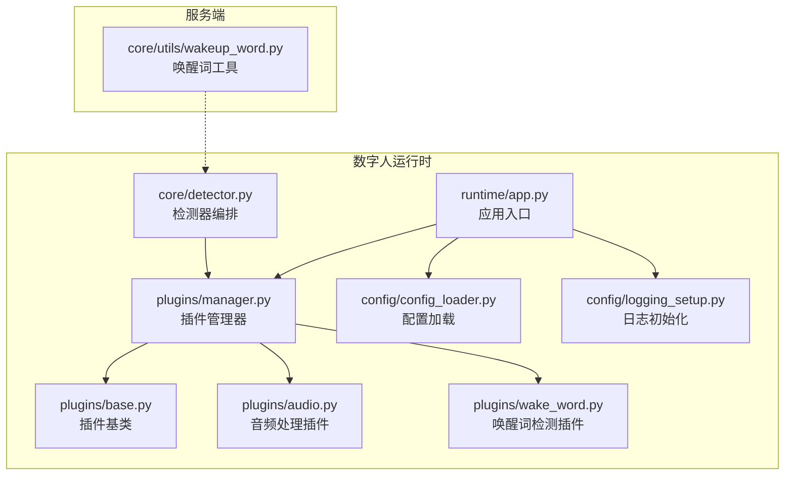
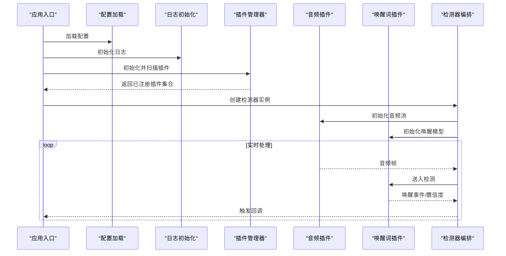
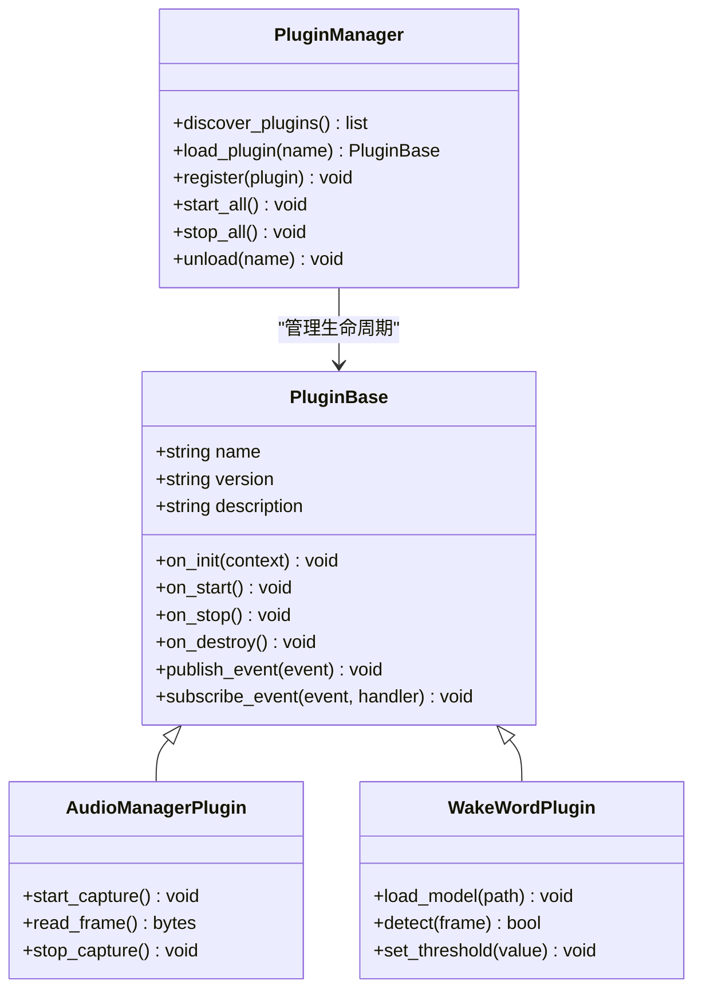
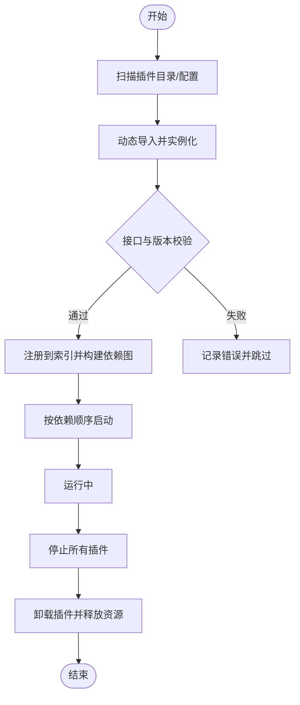
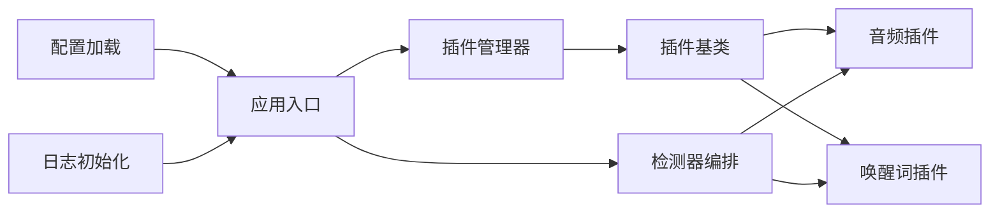

# 插件架构系统

<cite>
**本文引用的文件**   
- [digital-human/wakeword_runtime/plugins/base.py](file://main/digital-human/wakeword_runtime/plugins/base.py)
- [digital-human/wakeword_runtime/plugins/audio.py](file://main/digital-human/wakeword_runtime/plugins/audio.py)
- [digital-human/wakeword_runtime/plugins/wake_word.py](file://main/digital-human/wakeword_runtime/plugins/wake_word.py)
- [digital-human/wakeword_runtime/plugins/manager.py](file://main/digital-human/wakeword_runtime/plugins/manager.py)
- [digital-human/wakeword_runtime/core/detector.py](file://main/digital-human/wakeword_runtime/core/detector.py)
- [digital-human/wakeword_runtime/runtime/app.py](file://main/digital-human/wakeword_runtime/runtime/app.py)
- [digital-human/wakeword_runtime/config/config_loader.py](file://main/digital-human/wakeword_runtime/config/config_loader.py)
- [digital-human/wakeword_runtime/config/logging_setup.py](file://main/digital-human/wakeword_runtime/config/logging_setup.py)
- [xiaozhi-server/core/utils/wakeup_word.py](file://main/xiaozhi-server/core/utils/wakeup_word.py)
</cite>

## 目录
1. [简介](#简介)
2. [项目结构](#项目结构)
3. [核心组件](#核心组件)
4. [架构总览](#架构总览)
5. [详细组件分析](#详细组件分析)
6. [依赖关系分析](#依赖关系分析)
7. [性能考量](#性能考量)
8. [故障排查指南](#故障排查指南)
9. [结论](#结论)
10. [附录：开发指南与最佳实践](#附录开发指南与最佳实践)

## 简介
本技术文档围绕唤醒词插件架构系统，系统性阐述插件化设计模式、插件接口定义、生命周期管理、依赖注入机制；深入解析插件管理器的工作原理（发现、加载、注册、卸载）；介绍内置插件类型（音频处理插件、唤醒词检测插件）的基础实现；并提供自定义插件开发指南、插件间通信方式、配置管理与版本兼容性检查、错误隔离机制以及调试与测试方法。目标是帮助开发者快速理解并扩展该插件体系，构建稳定、可维护、可扩展的唤醒词处理链路。

## 项目结构
本项目在数字人运行时模块中实现了完整的插件化架构，核心位于 wakeword_runtime 子目录，包含插件基类、内置插件、插件管理器、核心检测器、应用启动与配置管理等。同时，服务器端 xiaozhi-server 提供唤醒词相关工具能力，便于与上层服务集成。

图表来源
- [digital-human/wakeword_runtime/plugins/base.py](file://main/digital-human/wakeword_runtime/plugins/base.py)
- [digital-human/wakeword_runtime/plugins/audio.py](file://main/digital-human/wakeword_runtime/plugins/audio.py)
- [digital-human/wakeword_runtime/plugins/wake_word.py](file://main/digital-human/wakeword_runtime/plugins/wake_word.py)
- [digital-human/wakeword_runtime/plugins/manager.py](file://main/digital-human/wakeword_runtime/plugins/manager.py)
- [digital-human/wakeword_runtime/core/detector.py](file://main/digital-human/wakeword_runtime/core/detector.py)
- [digital-human/wakeword_runtime/runtime/app.py](file://main/digital-human/wakeword_runtime/runtime/app.py)
- [digital-human/wakeword_runtime/config/config_loader.py](file://main/digital-human/wakeword_runtime/config/config_loader.py)
- [digital-human/wakeword_runtime/config/logging_setup.py](file://main/digital-human/wakeword_runtime/config/logging_setup.py)
- [xiaozhi-server/core/utils/wakeup_word.py](file://main/xiaozhi-server/core/utils/wakeup_word.py)

章节来源
- [digital-human/wakeword_runtime/runtime/app.py](file://main/digital-human/wakeword_runtime/runtime/app.py)
- [digital-human/wakeword_runtime/plugins/manager.py](file://main/digital-human/wakeword_runtime/plugins/manager.py)
- [digital-human/wakeword_runtime/config/config_loader.py](file://main/digital-human/wakeword_runtime/config/config_loader.py)

## 核心组件
- 插件基类：定义插件统一接口、生命周期钩子、依赖注入点与事件通道，确保所有插件具备一致的行为契约。
- 插件管理器：负责插件的发现、加载、注册、启停与卸载；维护插件元数据、版本兼容性与依赖关系；提供插件间通信总线。
- 音频处理插件：封装音频采集、预处理、降噪、VAD等能力，为唤醒词检测提供标准化音频流。
- 唤醒词检测插件：封装模型推理、阈值策略、触发回调等逻辑，输出统一的唤醒事件。
- 检测器编排：串联音频插件与唤醒词插件，形成端到端的唤醒流水线，协调状态机与资源管理。
- 应用入口：初始化配置、日志、插件管理器，启动检测器与HTTP服务等。
- 配置加载与日志：集中化管理配置项、环境变量覆盖、动态重加载；统一日志格式与级别。

章节来源
- [digital-human/wakeword_runtime/plugins/base.py](file://main/digital-human/wakeword_runtime/plugins/base.py)
- [digital-human/wakeword_runtime/plugins/manager.py](file://main/digital-human/wakeword_runtime/plugins/manager.py)
- [digital-human/wakeword_runtime/plugins/audio.py](file://main/digital-human/wakeword_runtime/plugins/audio.py)
- [digital-human/wakeword_runtime/plugins/wake_word.py](file://main/digital-human/wakeword_runtime/plugins/wake_word.py)
- [digital-human/wakeword_runtime/core/detector.py](file://main/digital-human/wakeword_runtime/core/detector.py)
- [digital-human/wakeword_runtime/runtime/app.py](file://main/digital-human/wakeword_runtime/runtime/app.py)
- [digital-human/wakeword_runtime/config/config_loader.py](file://main/digital-human/wakeword_runtime/config/config_loader.py)
- [digital-human/wakeword_runtime/config/logging_setup.py](file://main/digital-human/wakeword_runtime/config/logging_setup.py)

## 架构总览
下图展示了从应用启动到唤醒事件产生的整体流程，包括配置加载、插件管理器初始化、插件发现与加载、检测器编排、音频流输入与唤醒结果输出。

图表来源
- [digital-human/wakeword_runtime/runtime/app.py](file://main/digital-human/wakeword_runtime/runtime/app.py)
- [digital-human/wakeword_runtime/config/config_loader.py](file://main/digital-human/wakeword_runtime/config/config_loader.py)
- [digital-human/wakeword_runtime/config/logging_setup.py](file://main/digital-human/wakeword_runtime/config/logging_setup.py)
- [digital-human/wakeword_runtime/plugins/manager.py](file://main/digital-human/wakeword_runtime/plugins/manager.py)
- [digital-human/wakeword_runtime/core/detector.py](file://main/digital-human/wakeword_runtime/core/detector.py)
- [digital-human/wakeword_runtime/plugins/audio.py](file://main/digital-human/wakeword_runtime/plugins/audio.py)
- [digital-human/wakeword_runtime/plugins/wake_word.py](file://main/digital-human/wakeword_runtime/plugins/wake_word.py)

## 详细组件分析

### 插件基类与接口契约
- 统一接口：定义插件名称、版本、描述、初始化、开始、停止、销毁等方法。
- 生命周期钩子：on_init、on_start、on_stop、on_destroy，保证资源有序分配与释放。
- 依赖注入：通过上下文对象注入配置、日志、事件总线、共享缓存等。
- 事件通道：插件间通过事件总线发布/订阅消息，解耦调用方与被调用方。
- 错误隔离：捕获插件异常并上报，避免影响宿主与其他插件。

图表来源
- [digital-human/wakeword_runtime/plugins/base.py](file://main/digital-human/wakeword_runtime/plugins/base.py)
- [digital-human/wakeword_runtime/plugins/audio.py](file://main/digital-human/wakeword_runtime/plugins/audio.py)
- [digital-human/wakeword_runtime/plugins/wake_word.py](file://main/digital-human/wakeword_runtime/plugins/wake_word.py)
- [digital-human/wakeword_runtime/plugins/manager.py](file://main/digital-human/wakeword_runtime/plugins/manager.py)

章节来源
- [digital-human/wakeword_runtime/plugins/base.py](file://main/digital-human/wakeword_runtime/plugins/base.py)

### 插件管理器：发现、加载、注册、卸载
- 插件发现：按约定目录或配置文件扫描插件模块，提取元数据（名称、版本、依赖）。
- 插件加载：动态导入模块，实例化插件对象，校验接口一致性。
- 插件注册：将插件加入管理器索引，建立依赖图，进行版本兼容性检查。
- 生命周期管理：批量启动/停止插件，确保顺序正确；异常时回滚状态。
- 卸载机制：安全释放资源，清理事件订阅，解除依赖引用。

图表来源
- [digital-human/wakeword_runtime/plugins/manager.py](file://main/digital-human/wakeword_runtime/plugins/manager.py)

章节来源
- [digital-human/wakeword_runtime/plugins/manager.py](file://main/digital-human/wakeword_runtime/plugins/manager.py)

### 音频处理插件：采集与预处理
- 功能职责：音频设备访问、采样率转换、降噪、增益控制、VAD分割。
- 数据流：以帧为单位输出标准化PCM数据，支持缓冲与背压控制。
- 配置项：设备ID、采样率、缓冲区大小、VAD阈值、降噪参数。
- 错误处理：设备不可用、权限不足、IO异常时的重试与降级策略。

章节来源
- [digital-human/wakeword_runtime/plugins/audio.py](file://main/digital-human/wakeword_runtime/plugins/audio.py)

### 唤醒词检测插件：模型推理与触发
- 功能职责：加载唤醒模型、特征提取、滑动窗口推理、置信度评估、触发回调。
- 配置项：模型路径、阈值、窗口长度、批处理大小、线程池配置。
- 性能优化：异步推理、内存复用、量化模型加载、GPU/CPU切换。
- 错误处理：模型加载失败、推理超时、内存溢出保护。

章节来源
- [digital-human/wakeword_runtime/plugins/wake_word.py](file://main/digital-human/wakeword_runtime/plugins/wake_word.py)

### 检测器编排：流水线与状态机
- 流水线：音频插件 -> 特征提取 -> 唤醒词插件 -> 触发判定 -> 事件广播。
- 状态机：空闲、采集、推理、触发、冷却等状态，防止重复触发。
- 资源协调：线程池、队列、锁机制保障并发安全。
- 监控指标：延迟、吞吐、误报率、召回率、资源占用。

章节来源
- [digital-human/wakeword_runtime/core/detector.py](file://main/digital-human/wakeword_runtime/core/detector.py)

### 应用入口与配置管理
- 应用入口：初始化配置、日志、插件管理器、检测器，启动HTTP服务与主循环。
- 配置管理：集中读取JSON/YAML与环境变量，支持热更新与默认值回退。
- 日志系统：分级输出、结构化日志、异步写入、轮转策略。

章节来源
- [digital-human/wakeword_runtime/runtime/app.py](file://main/digital-human/wakeword_runtime/runtime/app.py)
- [digital-human/wakeword_runtime/config/config_loader.py](file://main/digital-human/wakeword_runtime/config/config_loader.py)
- [digital-human/wakeword_runtime/config/logging_setup.py](file://main/digital-human/wakeword_runtime/config/logging_setup.py)

### 服务端唤醒词工具集成
- 作用：提供唤醒词相关的通用工具函数，供上层服务调用，如模型路径解析、阈值设置、事件桥接。
- 集成方式：通过API或消息队列与数字人运行时交互，实现跨进程协作。

章节来源
- [xiaozhi-server/core/utils/wakeup_word.py](file://main/xiaozhi-server/core/utils/wakeup_word.py)

## 依赖关系分析
- 松耦合：插件通过基类接口与事件总线通信，降低直接依赖。
- 强内聚：每个插件聚焦单一职责，内部实现独立。
- 依赖图：插件管理器维护依赖关系，确保启动顺序与资源分配。
- 外部依赖：音频库、推理框架、网络库等通过配置抽象，便于替换。

图表来源
- [digital-human/wakeword_runtime/plugins/base.py](file://main/digital-human/wakeword_runtime/plugins/base.py)
- [digital-human/wakeword_runtime/plugins/audio.py](file://main/digital-human/wakeword_runtime/plugins/audio.py)
- [digital-human/wakeword_runtime/plugins/wake_word.py](file://main/digital-human/wakeword_runtime/plugins/wake_word.py)
- [digital-human/wakeword_runtime/plugins/manager.py](file://main/digital-human/wakeword_runtime/plugins/manager.py)
- [digital-human/wakeword_runtime/core/detector.py](file://main/digital-human/wakeword_runtime/core/detector.py)
- [digital-human/wakeword_runtime/runtime/app.py](file://main/digital-human/wakeword_runtime/runtime/app.py)
- [digital-human/wakeword_runtime/config/config_loader.py](file://main/digital-human/wakeword_runtime/config/config_loader.py)
- [digital-human/wakeword_runtime/config/logging_setup.py](file://main/digital-human/wakeword_runtime/config/logging_setup.py)

章节来源
- [digital-human/wakeword_runtime/plugins/manager.py](file://main/digital-human/wakeword_runtime/plugins/manager.py)
- [digital-human/wakeword_runtime/core/detector.py](file://main/digital-human/wakeword_runtime/core/detector.py)

## 性能考量
- 音频流处理：采用环形缓冲与零拷贝策略，减少内存分配与复制开销。
- 推理加速：使用量化模型、批处理、多线程/多进程并行推理。
- 资源限制：设置最大线程数、队列长度、内存上限，防止OOM。
- 监控指标：收集延迟、吞吐、CPU/GPU利用率、错误率，用于调优与告警。
- 降级策略：当硬件不可用时自动切换到轻量模型或关闭非必要功能。

[本节为通用性能建议，不直接分析具体文件]

## 故障排查指南
- 常见问题定位：
  - 插件加载失败：检查模块路径、依赖安装、接口实现是否完整。
  - 音频设备不可用：确认权限、设备ID、采样率匹配。
  - 唤醒词无触发：调整阈值、检查模型路径、验证音频质量。
  - 内存泄漏：检查未释放的资源、事件订阅未取消。
- 日志与调试：
  - 启用DEBUG级别日志，查看插件生命周期与事件流。
  - 使用断点与单测验证关键路径。
  - 导出性能指标与火焰图进行分析。
- 错误隔离：
  - 插件异常不影响其他插件运行，管理器记录错误并继续。
  - 支持重启单个插件而不影响整体服务。

章节来源
- [digital-human/wakeword_runtime/config/logging_setup.py](file://main/digital-human/wakeword_runtime/config/logging_setup.py)
- [digital-human/wakeword_runtime/plugins/manager.py](file://main/digital-human/wakeword_runtime/plugins/manager.py)

## 结论
本插件架构通过清晰的接口契约、完善的生命周期管理、灵活的依赖注入与事件总线，实现了高内聚、低耦合的唤醒词处理系统。内置音频与唤醒词插件提供了开箱即用的能力，插件管理器确保了系统的可扩展性与稳定性。结合配置管理与日志系统，开发者可以快速定制与调试插件，满足多样化场景需求。

[本节为总结性内容，不直接分析具体文件]

## 附录：开发指南与最佳实践
- 创建自定义插件：
  - 继承插件基类，实现必要方法与生命周期钩子。
  - 在插件元数据中声明名称、版本、依赖。
  - 通过事件总线发布/订阅消息，实现插件间通信。
- 插件配置管理：
  - 使用配置加载器读取JSON/YAML与环境变量。
  - 支持热更新配置，无需重启服务。
- 版本兼容性检查：
  - 在插件管理器中进行语义化版本比较，确保依赖兼容。
- 错误隔离机制：
  - 捕获插件异常，记录错误上下文，避免级联故障。
  - 提供健康检查接口，监控插件状态。
- 调试与测试：
  - 使用单元测试验证插件逻辑。
  - 使用集成测试模拟音频流与唤醒事件。
  - 使用性能测试评估延迟与吞吐。

章节来源
- [digital-human/wakeword_runtime/plugins/base.py](file://main/digital-human/wakeword_runtime/plugins/base.py)
- [digital-human/wakeword_runtime/plugins/manager.py](file://main/digital-human/wakeword_runtime/plugins/manager.py)
- [digital-human/wakeword_runtime/config/config_loader.py](file://main/digital-human/wakeword_runtime/config/config_loader.py)